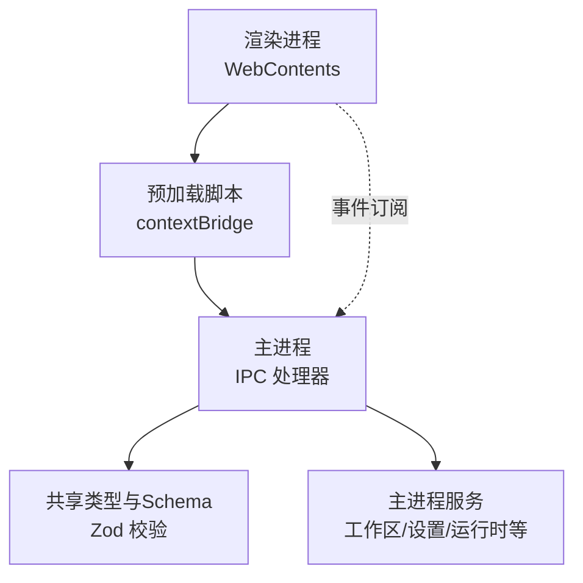
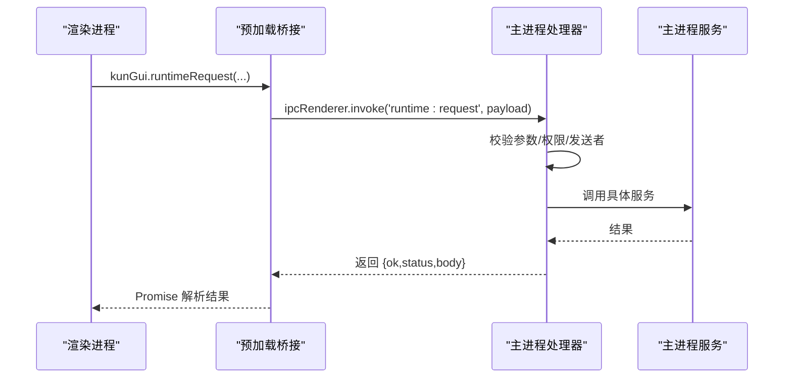
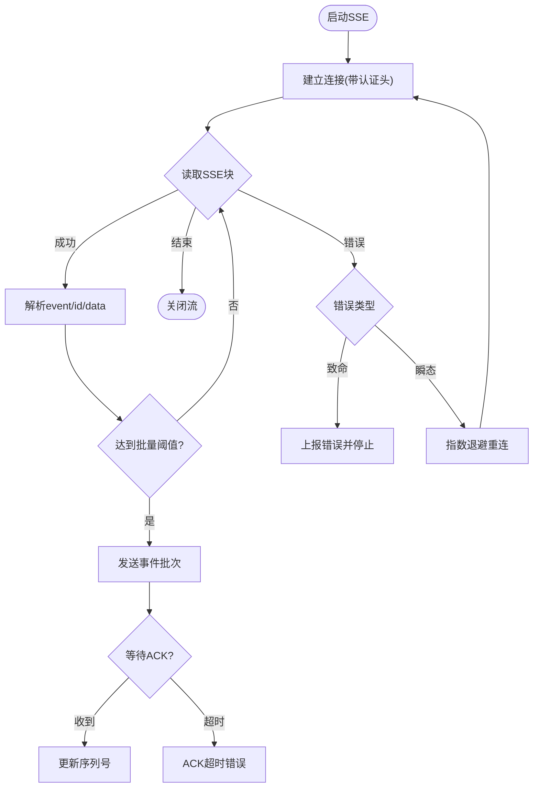
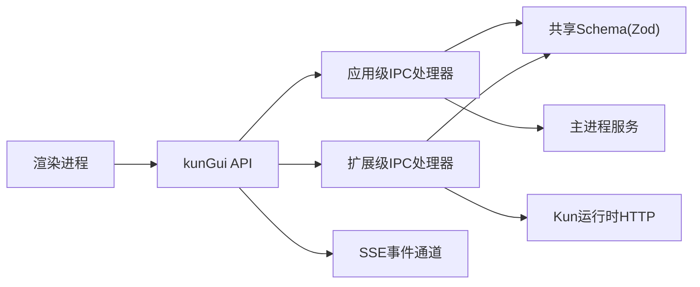

# IPC通信API

<cite>
**本文引用的文件**
- [src/main/ipc/register-app-ipc-handlers.ts](file://src/main/ipc/register-app-ipc-handlers.ts)
- [src/main/ipc/app-ipc-schemas.ts](file://src/main/ipc/app-ipc-schemas.ts)
- [src/main/ipc/register-extension-ipc-handlers.ts](file://src/main/ipc/register-extension-ipc-handlers.ts)
- [src/preload/index.ts](file://src/preload/index.ts)
- [src/shared/kun-gui-api.ts](file://src/shared/kun-gui-api.ts)
- [src/shared/extension-ipc.ts](file://src/shared/extension-ipc.ts)
- [src/main/runtime-sse-ipc.ts](file://src/main/runtime-sse-ipc.ts)
</cite>

## 目录
1. [简介](#简介)
2. [项目结构](#项目结构)
3. [核心组件](#核心组件)
4. [架构总览](#架构总览)
5. [详细组件分析](#详细组件分析)
6. [依赖关系分析](#依赖关系分析)
7. [性能与可靠性](#性能与可靠性)
8. [故障排查指南](#故障排查指南)
9. [结论](#结论)
10. [附录：使用示例与最佳实践](#附录使用示例与最佳实践)

## 简介
本文件为 DeepSeek-GUI 扩展的 IPC 通信 API 提供完整技术文档，覆盖主进程与渲染进程之间的消息传递、事件订阅与 RPC 调用。重点说明 IPC 通道建立、消息格式与数据序列化、异步通信模式、错误处理与超时机制，并给出双向通信、广播消息与点对点通信的实现方式。同时展示如何与主进程服务集成（服务发现与方法调用），以及安全性考虑（消息验证与权限控制）。文末提供实际使用场景的代码示例路径，便于快速上手。

## 项目结构
IPC 体系由三部分构成：
- 渲染侧桥接层：在 preload 中通过 contextBridge 暴露安全的 kunGui API，封装所有 ipcRenderer.invoke/on 调用。
- 主进程路由层：注册应用级与扩展级 IPC 处理器，负责参数校验、权限检查、安全上下文验证与服务转发。
- 共享契约层：定义类型与 Zod Schema，确保跨进程数据结构一致性与可演进性。

图表来源
- [src/preload/index.ts:1-685](file://src/preload/index.ts#L1-L685)
- [src/main/ipc/register-app-ipc-handlers.ts:686-800](file://src/main/ipc/register-app-ipc-handlers.ts#L686-L800)
- [src/main/ipc/app-ipc-schemas.ts:1-8](file://src/main/ipc/app-ipc-schemas.ts#L1-L8)

章节来源
- [src/preload/index.ts:1-685](file://src/preload/index.ts#L1-L685)
- [src/main/ipc/register-app-ipc-handlers.ts:686-800](file://src/main/ipc/register-app-ipc-handlers.ts#L686-L800)
- [src/main/ipc/app-ipc-schemas.ts:1-8](file://src/main/ipc/app-ipc-schemas.ts#L1-L8)

## 核心组件
- 渲染侧 kunGui API：集中暴露所有 IPC 能力，包括设置、运行时、工作区、SSE、终端、扩展等。
- 应用级 IPC 处理器：注册大量 ipcMain.handle，统一进行参数校验、可信发送者校验、权限与审批流。
- 扩展级 IPC 处理器：面向扩展生命周期、视图会话、外部浏览器、内容脚本桥接、通知泵与安全同意流程。
- SSE 运行时事件通道：基于 Electron WebContents 事件实现长连接事件推送，支持批量确认、重连与超时。
- 共享类型与 Schema：以 TypeScript 类型与 Zod Schema 保证请求/响应结构稳定且可演进。

章节来源
- [src/preload/index.ts:1-685](file://src/preload/index.ts#L1-L685)
- [src/main/ipc/register-app-ipc-handlers.ts:686-800](file://src/main/ipc/register-app-ipc-handlers.ts#L686-L800)
- [src/main/ipc/register-extension-ipc-handlers.ts:354-800](file://src/main/ipc/register-extension-ipc-handlers.ts#L354-L800)
- [src/main/runtime-sse-ipc.ts:178-409](file://src/main/runtime-sse-ipc.ts#L178-L409)
- [src/shared/kun-gui-api.ts:581-800](file://src/shared/kun-gui-api.ts#L581-L800)
- [src/shared/extension-ipc.ts:424-527](file://src/shared/extension-ipc.ts#L424-L527)

## 架构总览
IPC 通信采用“请求-响应 + 事件订阅”的双向模型：
- 请求-响应：渲染进程通过 kunGui.* 方法调用 ipcRenderer.invoke，主进程对应 handler 执行后返回结果。
- 事件订阅：主进程通过 webContents.send 推送事件，渲染进程通过 ipcRenderer.on 监听并回调。
- SSE 长连接：针对运行时事件流，主进程维护控制器状态，按批次推送并通过 ack 机制保障可靠消费。

图表来源
- [src/preload/index.ts:172-177](file://src/preload/index.ts#L172-L177)
- [src/main/ipc/register-app-ipc-handlers.ts:686-800](file://src/main/ipc/register-app-ipc-handlers.ts#L686-L800)
- [src/shared/kun-gui-api.ts:685-686](file://src/shared/kun-gui-api.ts#L685-L686)

## 详细组件分析

### 渲染侧 kunGui API（请求-响应）
- 作用：将底层 ipcRenderer.invoke 封装为类型安全的方法集合，屏蔽通道细节。
- 关键能力：
  - 设置读写、凭证揭示、运行时状态查询与控制。
  - 工作区文件操作、预览资源租约、本地文件选择。
  - 终端创建/写入/调整大小/退出事件。
  - 扩展安装/启用/禁用/权限审查/视图会话/外部浏览器控制。
  - SSE 启动/停止/确认与事件订阅。
- 事件订阅：
  - 通过 onXxx 方法注册 ipcRenderer.on，返回取消函数用于清理。
  - 典型事件：storage-relocation:progress、data-migration:progress、speech:local-whisper:progress、runtime:sse-event、tray:action、extension:view-event 等。

章节来源
- [src/preload/index.ts:53-685](file://src/preload/index.ts#L53-L685)
- [src/shared/kun-gui-api.ts:581-800](file://src/shared/kun-gui-api.ts#L581-L800)

### 应用级 IPC 处理器（主进程路由与校验）
- 入口：registerAppIpcHandlers(options)，集中注册大量 ipcMain.handle。
- 安全与校验：
  - 使用 parseIpcPayload(channel, schema, payload) 对入参进行 Zod 校验，失败抛出结构化错误。
  - 使用 assertTrustedWorkbenchSender(event, getMainWindow) 校验发送者是否来自受信任的工作台帧。
  - 敏感操作（如执行设置变更、扩展安装/启用/权限修改）触发原生对话框或保护性同意流程。
- 服务集成：
  - 通过 options 注入的服务（如 settings store、workspace service、workflow runtime、claw/schedule/daemon runtime）完成业务逻辑。
  - 通过 runtimeRequest 与 Kun 运行时交互，获取模型目录、配额、诊断等信息。

章节来源
- [src/main/ipc/register-app-ipc-handlers.ts:443-496](file://src/main/ipc/register-app-ipc-handlers.ts#L443-L496)
- [src/main/ipc/register-app-ipc-handlers.ts:686-800](file://src/main/ipc/register-app-ipc-handlers.ts#L686-L800)

### 扩展级 IPC 处理器（扩展生命周期与会话）
- 入口：registerExtensionIpcHandlers(options)，注册扩展相关 IPC。
- 功能范围：
  - 扩展安装/启用/禁用/回滚/卸载，包含权限审查与保护性同意。
  - 视图会话创建/销毁、消息投递、事件读取。
  - 外部浏览器控制（挂载、激活、导航、缩放、状态同步）。
  - 内容脚本桥接与诊断上报。
  - 通知泵：轮询运行时通知表并投影到工作台，支持退避重试。
  - 密钥揭示同意泵：轮询运行时 secret reveal 请求，弹出用户确认。
- 安全策略：
  - 所有扩展操作均经过 protected actions 授权与可选的用户确认。
  - 权限变更后主动撤销视图会话与内容脚本绑定，防止越权。

章节来源
- [src/main/ipc/register-extension-ipc-handlers.ts:184-352](file://src/main/ipc/register-extension-ipc-handlers.ts#L184-L352)
- [src/main/ipc/register-extension-ipc-handlers.ts:354-800](file://src/main/ipc/register-extension-ipc-handlers.ts#L354-L800)
- [src/shared/extension-ipc.ts:424-527](file://src/shared/extension-ipc.ts#L424-L527)

### SSE 运行时事件通道（长连接与批确认）
- 通道：
  - 启动：runtime:sse:start，返回 streamId。
  - 事件：runtime:sse-event，携带 events 与可选 batchId。
  - 确认：runtime:sse:ack，客户端确认已消费某批次。
  - 停止：runtime:sse:stop，终止流。
- 特性：
  - 自动重连：指数退避，最大延迟限制。
  - 开始超时：SSE 初始连接超时保护。
  - 批确认：可选开启，未确认则视为消费失败并推进序列号。
  - 帧缓冲与批量限制：防止内存膨胀与卡顿。
  - 错误分类：致命错误直接上报；瞬态错误（网络/超时/中止）自动重连。
- 事件映射：
  - 将服务端 event/id/data 规范化为统一 payload，兼容 seq/kind 字段。

图表来源
- [src/main/runtime-sse-ipc.ts:178-409](file://src/main/runtime-sse-ipc.ts#L178-L409)

章节来源
- [src/main/runtime-sse-ipc.ts:178-409](file://src/main/runtime-sse-ipc.ts#L178-L409)

## 依赖关系分析
- 渲染进程依赖 preload 暴露的 kunGui API。
- preload 依赖 ipcRenderer/webFrame/webUtils 与 extension-content-script 初始化。
- 主进程处理器依赖共享类型与 Schema（Zod）进行强校验。
- 扩展处理器依赖运行时 HTTP 接口（runtimeRequest）拉取通知与配置快照。
- SSE 模块依赖设置存储、运行时基础 URL 与认证头生成。

图表来源
- [src/preload/index.ts:1-685](file://src/preload/index.ts#L1-L685)
- [src/main/ipc/register-app-ipc-handlers.ts:686-800](file://src/main/ipc/register-app-ipc-handlers.ts#L686-L800)
- [src/main/ipc/register-extension-ipc-handlers.ts:354-800](file://src/main/ipc/register-extension-ipc-handlers.ts#L354-L800)
- [src/main/runtime-sse-ipc.ts:178-409](file://src/main/runtime-sse-ipc.ts#L178-L409)

章节来源
- [src/preload/index.ts:1-685](file://src/preload/index.ts#L1-L685)
- [src/main/ipc/register-app-ipc-handlers.ts:686-800](file://src/main/ipc/register-app-ipc-handlers.ts#L686-L800)
- [src/main/ipc/register-extension-ipc-handlers.ts:354-800](file://src/main/ipc/register-extension-ipc-handlers.ts#L354-L800)
- [src/main/runtime-sse-ipc.ts:178-409](file://src/main/runtime-sse-ipc.ts#L178-L409)

## 性能与可靠性
- 批量与限流：
  - SSE 事件按批次推送，限制每批事件数与字节数，避免 UI 卡顿。
  - 帧缓冲上限保护内存占用。
- 超时与重连：
  - SSE 启动超时、ACK 超时，防止阻塞。
  - 指数退避重连，降低瞬时抖动影响。
- 安全与一致性：
  - 所有入参经 Zod 校验，失败即拒绝。
  - 受信任发送者校验，防止恶意页面伪造 IPC。
  - 敏感操作需用户确认或保护性同意。
- 可扩展性：
  - 新增 IPC 只需添加 Schema 与 handler，保持向后兼容。
  - 事件通道与请求-响应解耦，便于独立演进。

[本节为通用指导，不直接分析具体文件]

## 故障排查指南
- 常见错误定位：
  - 参数校验失败：查看 parseIpcPayload 抛出的路径与消息，修正请求结构。
  - 发送者不可信：检查是否在受信任的工作台帧内发起调用。
  - SSE 连接失败：关注 fatal status 与瞬态错误日志，必要时重启运行时。
  - ACK 超时：检查渲染端是否正确调用 ack，或是否存在长时间阻塞。
- 日志与诊断：
  - 主进程 logError/logInfo 输出类别与详情。
  - 扩展通知与诊断可通过 extension:diagnostics 获取。
- 恢复步骤：
  - 重置不可读凭证、重新安装/启用扩展、释放视图会话与内容脚本绑定。

章节来源
- [src/main/ipc/register-app-ipc-handlers.ts:443-496](file://src/main/ipc/register-app-ipc-handlers.ts#L443-L496)
- [src/main/ipc/register-extension-ipc-handlers.ts:518-537](file://src/main/ipc/register-extension-ipc-handlers.ts#L518-L537)
- [src/main/runtime-sse-ipc.ts:141-176](file://src/main/runtime-sse-ipc.ts#L141-L176)

## 结论
DeepSeek-GUI 的 IPC 体系以“类型安全 + 强校验 + 安全上下文”为核心，结合请求-响应与事件订阅两种模式，满足复杂桌面应用的跨进程通信需求。SSE 通道提供了高可靠的运行时事件推送能力，扩展 IPC 实现了完整的扩展生命周期管理与权限控制。整体设计兼顾性能、安全与可演进性，适合大规模扩展生态。

[本节为总结，不直接分析具体文件]

## 附录：使用示例与最佳实践

- 调用主进程功能（RPC）
  - 示例：上传运行时图片附件、读取本地办公文档、运行任务、查询配额等。
  - 参考路径：
    - [src/preload/index.ts:172-177](file://src/preload/index.ts#L172-L177)
    - [src/shared/kun-gui-api.ts:687-706](file://src/shared/kun-gui-api.ts#L687-L706)

- 接收系统事件（事件订阅）
  - 示例：监听存储迁移进度、数据迁移进度、语音识别进度、托盘动作、运行时状态等。
  - 参考路径：
    - [src/preload/index.ts:70-130](file://src/preload/index.ts#L70-L130)
    - [src/preload/index.ts:460-491](file://src/preload/index.ts#L460-L491)

- 双向通信（请求+事件）
  - 示例：SSE 启动后持续接收事件，并在需要时发送 ack。
  - 参考路径：
    - [src/preload/index.ts:432-459](file://src/preload/index.ts#L432-L459)
    - [src/main/runtime-sse-ipc.ts:178-409](file://src/main/runtime-sse-ipc.ts#L178-L409)

- 广播消息（主进程→多渲染）
  - 说明：主进程通过 webContents.send 向指定或全部窗口发送事件，适用于全局通知。
  - 参考路径：
    - [src/main/runtime-sse-ipc.ts:53-61](file://src/main/runtime-sse-ipc.ts#L53-L61)

- 点对点通信（会话级）
  - 说明：通过 streamId/sessionId/channel 限定消息范围，避免广播带来的开销与干扰。
  - 参考路径：
    - [src/main/runtime-sse-ipc.ts:178-409](file://src/main/runtime-sse-ipc.ts#L178-L409)
    - [src/shared/extension-ipc.ts:208-222](file://src/shared/extension-ipc.ts#L208-L222)

- 与主进程服务集成（服务发现与方法调用）
  - 示例：通过 runtimeRequest 访问运行时 REST 接口，获取模型目录、配额、诊断等。
  - 参考路径：
    - [src/preload/index.ts:172-177](file://src/preload/index.ts#L172-L177)
    - [src/main/ipc/register-extension-ipc-handlers.ts:414-463](file://src/main/ipc/register-extension-ipc-handlers.ts#L414-L463)

- 安全性考虑（消息验证与权限控制）
  - 入参校验：Zod Schema 严格校验，失败即拒绝。
  - 发送者校验：仅允许受信任的工作台帧发起敏感操作。
  - 权限与同意：扩展安装/启用/权限修改需用户确认或保护性同意。
  - 参考路径：
    - [src/main/ipc/register-app-ipc-handlers.ts:443-496](file://src/main/ipc/register-app-ipc-handlers.ts#L443-L496)
    - [src/main/ipc/register-extension-ipc-handlers.ts:539-717](file://src/main/ipc/register-extension-ipc-handlers.ts#L539-L717)

- 错误处理与超时机制
  - 请求-响应：handler 内部捕获异常并返回结构化错误。
  - SSE：区分致命与瞬态错误，自动重连与超时保护。
  - 参考路径：
    - [src/main/runtime-sse-ipc.ts:141-176](file://src/main/runtime-sse-ipc.ts#L141-L176)
    - [src/main/runtime-sse-ipc.ts:355-385](file://src/main/runtime-sse-ipc.ts#L355-L385)