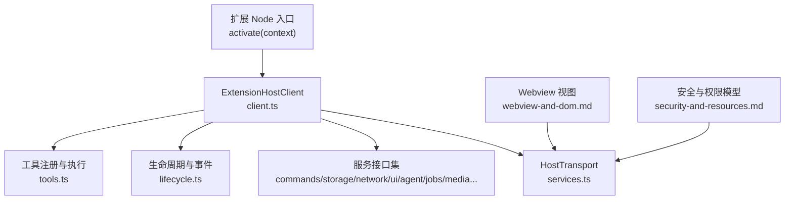
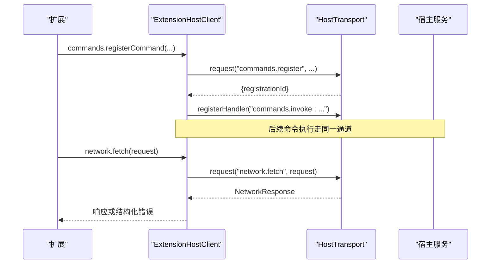
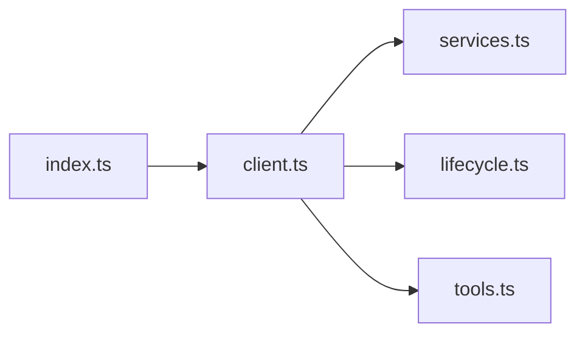

# 扩展API参考

<cite>
**本文引用的文件**
- [packages/extension-api/src/index.ts](file://packages/extension-api/src/index.ts)
- [packages/extension-api/src/client.ts](file://packages/extension-api/src/client.ts)
- [packages/extension-api/src/services.ts](file://packages/extension-api/src/services.ts)
- [packages/extension-api/src/lifecycle.ts](file://packages/extension-api/src/lifecycle.ts)
- [packages/extension-api/src/tools.ts](file://packages/extension-api/src/tools.ts)
- [docs/extensions/api-reference.md](file://docs/extensions/api-reference.md)
- [docs/extensions/webview-and-dom.md](file://docs/extensions/webview-and-dom.md)
- [docs/extensions/lifecycle.md](file://docs/extensions/lifecycle.md)
- [docs/extensions/security-and-resources.md](file://docs/extensions/security-and-resources.md)
</cite>

## 目录
1. [简介](#简介)
2. [项目结构](#项目结构)
3. [核心组件](#核心组件)
4. [架构总览](#架构总览)
5. [详细组件分析](#详细组件分析)
6. [依赖关系分析](#依赖关系分析)
7. [性能与资源限制](#性能与资源限制)
8. [故障排查指南](#故障排查指南)
9. [结论](#结论)
10. [附录：类型与接口速查](#附录类型与接口速查)

## 简介
本参考文档面向 DeepSeek-GUI 的扩展开发者，系统化说明扩展可使用的 API 集合，包括宿主 API、Webview 桥接、文件系统访问、IPC 通信与事件系统。文档按“核心 API、工具 API、高级 API”组织，提供参数与返回值类型说明、调用示例、错误处理模式与最佳实践，并给出版本兼容性与迁移建议。

## 项目结构
扩展 API 由框架无关的 SDK 包 `@kun/extension-api` 暴露稳定契约，并通过 Webview React 绑定与测试夹具增强开发体验。SDK 入口统一导出各模块的类型与 Schema，客户端通过 `HostTransport` 与宿主进行请求/通知/流式交互。

图表来源
- [packages/extension-api/src/client.ts:312-338](file://packages/extension-api/src/client.ts#L312-L338)
- [packages/extension-api/src/services.ts:112-119](file://packages/extension-api/src/services.ts#L112-L119)
- [packages/extension-api/src/lifecycle.ts:21-63](file://packages/extension-api/src/lifecycle.ts#L21-L63)
- [packages/extension-api/src/tools.ts:8-18](file://packages/extension-api/src/tools.ts#L8-L18)
- [docs/extensions/webview-and-dom.md:81-125](file://docs/extensions/webview-and-dom.md#L81-L125)
- [docs/extensions/security-and-resources.md:34-46](file://docs/extensions/security-and-resources.md#L34-L46)

章节来源
- [packages/extension-api/src/index.ts:1-20](file://packages/extension-api/src/index.ts#L1-L20)
- [docs/extensions/api-reference.md:15-23](file://docs/extensions/api-reference.md#L15-L23)

## 核心组件
- 宿主客户端 ExtensionHostClient：封装所有 Host 能力（命令、存储、网络、UI、Agent、线程、工具、Provider、认证、媒体、作业、工作区），通过 HostTransport 发送请求与接收通知。
- 服务接口集：以 TypeScript 接口形式定义各子系统能力，如 CommandsApi、StorageApi、NetworkApi、UiApi、AgentApi、JobsApi、MediaApi、WorkspaceApi 等。
- 生命周期：DisposableStore、Emitter、ActivationContextData、StateMigration 等，用于资源管理与激活/停用流程。
- 工具系统：ExtensionToolDeclaration、ToolInvocation、ToolResult、CancellationToken 等，支持进度上报与取消。

章节来源
- [packages/extension-api/src/client.ts:293-338](file://packages/extension-api/src/client.ts#L293-L338)
- [packages/extension-api/src/services.ts:131-363](file://packages/extension-api/src/services.ts#L131-L363)
- [packages/extension-api/src/lifecycle.ts:21-129](file://packages/extension-api/src/lifecycle.ts#L21-L129)
- [packages/extension-api/src/tools.ts:8-62](file://packages/extension-api/src/tools.ts#L8-L62)

## 架构总览
扩展在 Node 侧通过 activate(context) 获取 ExtensionContext，并在 Webview 中通过窄 bridge 创建 ExtensionHostClient。所有跨进程调用均经过 HostTransport，并由宿主校验方法名、Schema、大小、速率、生命周期与权限。

图表来源
- [packages/extension-api/src/client.ts:353-409](file://packages/extension-api/src/client.ts#L353-L409)
- [packages/extension-api/src/services.ts:112-119](file://packages/extension-api/src/services.ts#L112-L119)

## 详细组件分析

### 宿主 API（核心）
- 命令 CommandsApi
  - 作用：注册/执行命令，handler 返回 JSON 值。
  - 关键方法：registerCommand(id, handler)、executeCommand(id, args)。
  - 典型用法：在 activate 中注册命令，并在 UI 或工具中触发。
- 存储 StorageApi
  - 作用：全局/工作区键值存储，受配额与 Schema 约束。
  - 关键方法：global/workspace.get/set/delete/keys。
- 配置 ConfigurationApi
  - 作用：读取/更新声明式配置项，监听变更。
  - 关键方法：get/update/keys/onDidChange。
- 网络 NetworkApi
  - 作用：经 Broker 的安全网络请求，校验域名、重定向、超时与配额。
  - 关键方法：fetch(request, options)。
- UI UiApi
  - 作用：主题/语言/视图状态/消息/通知/Composer 上下文挂载。
  - 关键方法：getTheme/getLocale/getViewState/setViewState/postMessage/showNotification/attachComposerContext。
- Agent 与线程 AgentApi / ThreadsApi
  - 作用：创建/订阅/控制 Agent Run，列出/查看自有线程。
  - 关键方法：createRun/getRun/subscribe/steer/cancel；listOwn/getOwn。
- 作业 JobsApi
  - 作用：查询/列表/订阅/取消持久化作业，支持回放与快照。
  - 关键方法：get/list/subscribe/cancel。
- 媒体 MediaApi
  - 作用：文件选择、保存目标、缓存目标、元数据、文本读取、资源租约、制品操作、能力探测、音视频分析、FFmpeg 作业等。
  - 关键方法：pickFiles/pickSaveTarget/createCacheTarget/stat/readText/release/openViewResource/performArtifactAction/getCapabilities/...
- 工作区 WorkspaceApi
  - 作用：在授权根内读写文件、stat、列举。
  - 关键方法：readFile/writeFile/stat/list。

章节来源
- [packages/extension-api/src/services.ts:233-363](file://packages/extension-api/src/services.ts#L233-L363)
- [packages/extension-api/src/client.ts:353-741](file://packages/extension-api/src/client.ts#L353-L741)

### 工具 API（扩展工具）
- 工具声明 ExtensionToolDeclaration
  - 字段：id、description、inputSchema、outputSchema、sideEffects、idempotent、maxOutputBytes。
- 工具调用 ToolInvocation / ToolResult
  - 调用上下文包含 invocation、cancellation、reportProgress。
  - 结果可携带 content、summary、metadata、generatedArtifacts。
- 注册与执行
  - tools.registerTool(declaration, handler) 返回 Disposable，内部通过 transport.registerHandler 路由到本地 handler。

章节来源
- [packages/extension-api/src/tools.ts:8-62](file://packages/extension-api/src/tools.ts#L8-L62)
- [packages/extension-api/src/client.ts:544-572](file://packages/extension-api/src/client.ts#L544-L572)

### 高级 API（认证、Provider、兼容性）
- 认证 AuthenticationApi
  - 账户会话管理、已认证 fetch、密钥揭示。
  - 方法：listAccounts/createSession/getSession/cancelSession/deleteAccount/authenticatedFetch/revealSecret。
- Provider ModelProvidersApi
  - 自定义模型 Provider 适配器的注册与状态查询。
  - 方法：registerProvider/getStatus。
- 兼容性 compatibility
  - API 协商与诊断报告，确保扩展与宿主版本兼容。

章节来源
- [packages/extension-api/src/services.ts:288-304](file://packages/extension-api/src/services.ts#L288-L304)
- [docs/extensions/api-reference.md:104-115](file://docs/extensions/api-reference.md#L104-L115)

### Webview 与 DOM
- Webview 沙箱：禁用 Node、启用 contextIsolation、独立 session、拒绝未授权导航/下载/设备权限。
- 窄桥：仅暴露 request/response、host message、命令、事件、主题/语言/缩放/无障碍偏好、视图状态、高层 API。
- View State：持久化 UI 状态，禁止存放敏感信息，需做版本迁移。
- Direct DOM：高风险能力，需静态声明、受限 surface、最小权限确认，且无 SemVer 保证。

章节来源
- [docs/extensions/webview-and-dom.md:19-43](file://docs/extensions/webview-and-dom.md#L19-L43)
- [docs/extensions/webview-and-dom.md:81-125](file://docs/extensions/webview-and-dom.md#L81-L125)
- [docs/extensions/webview-and-dom.md:127-145](file://docs/extensions/webview-and-dom.md#L127-L145)
- [docs/extensions/webview-and-dom.md:192-223](file://docs/extensions/webview-and-dom.md#L192-L223)

### IPC 通信与事件系统
- HostTransport
  - 请求/通知/可选流式发送；onNotification 接收宿主推送；registerHandler 注册服务端处理器。
- 事件模型
  - Emitter<Event<T>> 提供 onEvent 订阅与 dispose；DisposableStore 统一管理资源释放。
- 错误传播
  - 协议校验失败抛出 ExtensionApiError，携带 code、operation、retryable、details。

章节来源
- [packages/extension-api/src/services.ts:112-119](file://packages/extension-api/src/services.ts#L112-L119)
- [packages/extension-api/src/lifecycle.ts:69-92](file://packages/extension-api/src/lifecycle.ts#L69-L92)
- [packages/extension-api/src/client.ts:234-255](file://packages/extension-api/src/client.ts#L234-L255)

### 文件系统访问
- 工作区文件
  - 通过 WorkspaceApi 在授权根内进行读/写/统计/列举，路径规范化，防止遍历与符号链接逃逸。
- 媒体资源
  - 通过 MediaApi 进行文件选择、保存目标、缓存目标、元数据读取、文本读取、资源租约与制品操作。
- 安全边界
  - 权限仅在已授权 root 内生效；写入可能触发审批；权限撤销后下一次操作必须失败。

章节来源
- [packages/extension-api/src/services.ts:350-363](file://packages/extension-api/src/services.ts#L350-L363)
- [docs/extensions/security-and-resources.md:128-133](file://docs/extensions/security-and-resources.md#L128-L133)

### 事件系统与订阅
- Agent 运行事件
  - subscribe 返回订阅，支持初始回放、缓冲事件、去重与序列号推进；dispose 时取消订阅。
- 作业事件
  - jobs.subscribe 返回 JobSubscription，包含 snapshot、replayGap、cursor、complete 与 onEvent。
- 配置与 UI 事件
  - configuration.onDidChange、ui.onDidChangeTheme、ui.onDidChangeLocale、ui.onDidReceiveMessage、ui.onDidChangeProviderStatus。

章节来源
- [packages/extension-api/src/client.ts:447-530](file://packages/extension-api/src/client.ts#L447-L530)
- [packages/extension-api/src/client.ts:743-800](file://packages/extension-api/src/client.ts#L743-L800)
- [packages/extension-api/src/services.ts:143-156](file://packages/extension-api/src/services.ts#L143-L156)
- [packages/extension-api/src/services.ts:245-262](file://packages/extension-api/src/services.ts#L245-L262)

## 依赖关系分析
- 模块耦合
  - client.ts 聚合 services.ts 的所有接口实现，依赖 lifecycle.ts 的事件与资源管理，依赖 tools.ts 的工具声明与调用上下文。
  - index.ts 作为统一入口，重新导出所有子模块。
- 外部依赖
  - 使用 Zod 进行运行时 Schema 校验，确保请求/响应结构与大小限制。
- 潜在循环依赖
  - 当前结构为单向依赖：client → services/lifecycle/tools；index 仅聚合导出，无循环。

图表来源
- [packages/extension-api/src/index.ts:1-20](file://packages/extension-api/src/index.ts#L1-L20)
- [packages/extension-api/src/client.ts:312-338](file://packages/extension-api/src/client.ts#L312-L338)

章节来源
- [packages/extension-api/src/index.ts:1-20](file://packages/extension-api/src/index.ts#L1-L20)
- [packages/extension-api/src/client.ts:312-338](file://packages/extension-api/src/client.ts#L312-L338)

## 性能与资源限制
- 默认限额
  - 单 IPC 消息 1 MiB；激活截止 15 秒；一般操作截止 60 秒；取消宽限 2 秒；关闭截止 5 秒；每扩展并发操作 16；流窗口 32 个未 ack 事件或 4 MiB；主机事件率 200 events/秒；Node Host 内存上限 256 MiB；连续崩溃开路阈值 3；日志轮转 5 MiB × 3；扩展状态文档 10 MiB；状态迁移截止 30 秒；网络/认证请求体 8 MiB。
- 背压与释放
  - Producer 等待 ack，队列有 item/bytes 双上限；lagging subscriber 用 cursor 重连；cancel/terminal 后释放 buffer、timer、listener；disable/uninstall 先 fence 新调用再 cancel/deactivate。

章节来源
- [docs/extensions/security-and-resources.md:134-167](file://docs/extensions/security-and-resources.md#L134-L167)

## 故障排查指南
- 常见错误
  - 协议错误：Host 返回无效响应，抛出 ExtensionApiError，code 为 PROTOCOL_ERROR，包含 issues 详情。
  - 权限不足：Broker 校验失败，返回结构化错误，扩展应降级或提示用户。
  - 超时/取消：遵循 HostRequestOptions.signal/timeoutMs；收到取消后尽快停止上游工作。
- 诊断与日志
  - 使用 kun extension doctor/logs 查看扩展健康、重启次数、熔断、限额错误与最后结构化错误。
  - 日志避免记录密钥、token、完整 prompt/附件与大 body。

章节来源
- [packages/extension-api/src/client.ts:234-255](file://packages/extension-api/src/client.ts#L234-L255)
- [docs/extensions/security-and-resources.md:168-196](file://docs/extensions/security-and-resources.md#L168-L196)

## 结论
DeepSeek-GUI 扩展 API 以稳定的框架无关契约为核心，通过 HostTransport 将命令、存储、网络、UI、Agent、作业、媒体与工作区能力统一暴露给扩展。Webview 与 Direct DOM 提供安全的 UI 扩展方式，事件与生命周期机制保障资源正确释放与健壮性。遵循权限最小化、Schema 校验与限额策略，可实现高可靠、可审计的扩展生态。

## 附录：类型与接口速查
- 核心类型
  - ExtensionContext：激活上下文与服务集合。
  - HostTransport：请求/通知/流式发送与通知订阅。
  - Event<T>、Disposable、DisposableStore、Emitter：事件与资源管理。
  - ToolDeclaration、ToolInvocation、ToolResult、CancellationToken：工具声明与执行上下文。
- 主要接口
  - CommandsApi、StorageApi、ConfigurationApi、NetworkApi、UiApi、AgentApi、ThreadsApi、ToolsApi、ModelProvidersApi、AuthenticationApi、MediaApi、JobsApi、WorkspaceApi。

章节来源
- [packages/extension-api/src/services.ts:131-363](file://packages/extension-api/src/services.ts#L131-L363)
- [packages/extension-api/src/lifecycle.ts:21-129](file://packages/extension-api/src/lifecycle.ts#L21-L129)
- [packages/extension-api/src/tools.ts:8-62](file://packages/extension-api/src/tools.ts#L8-L62)