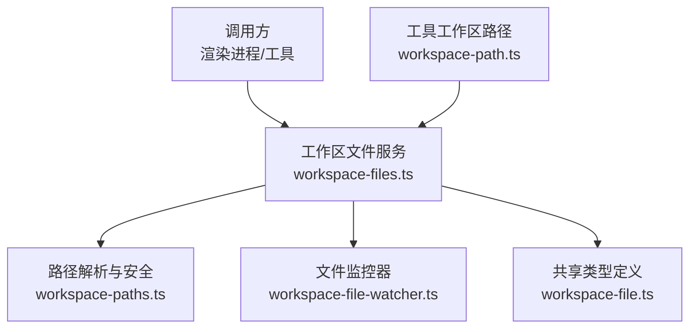
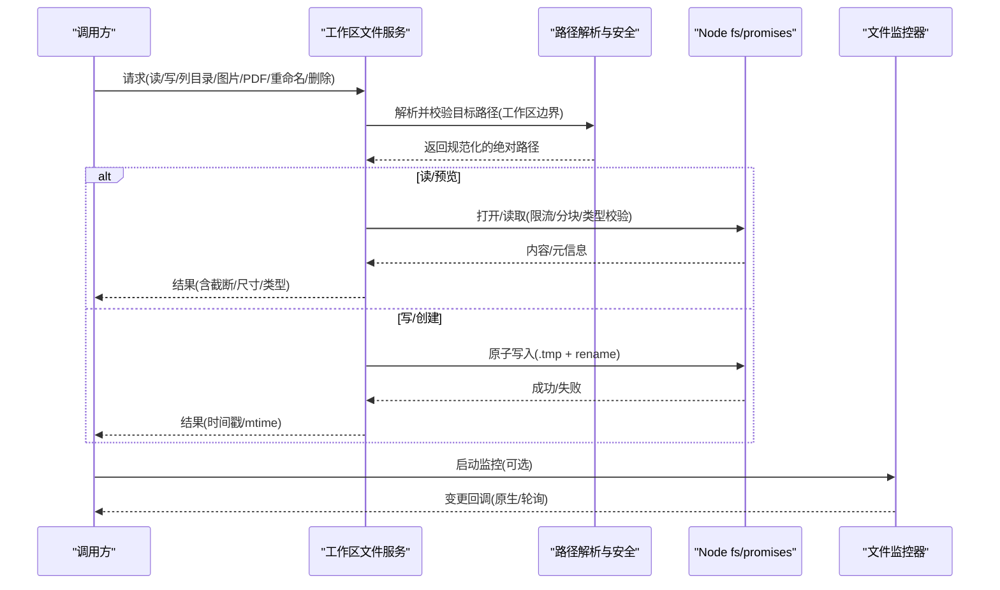
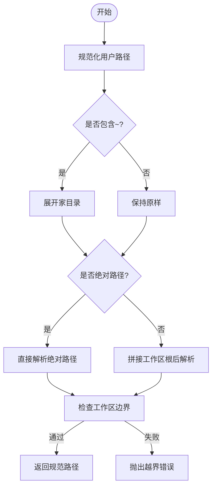
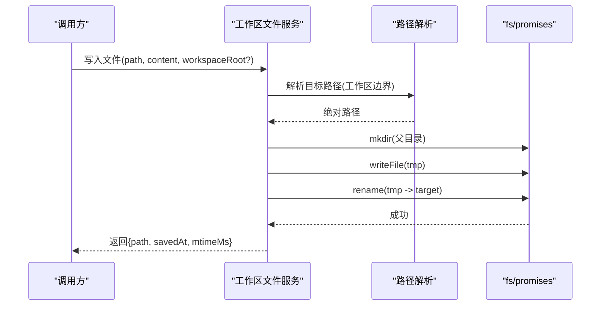
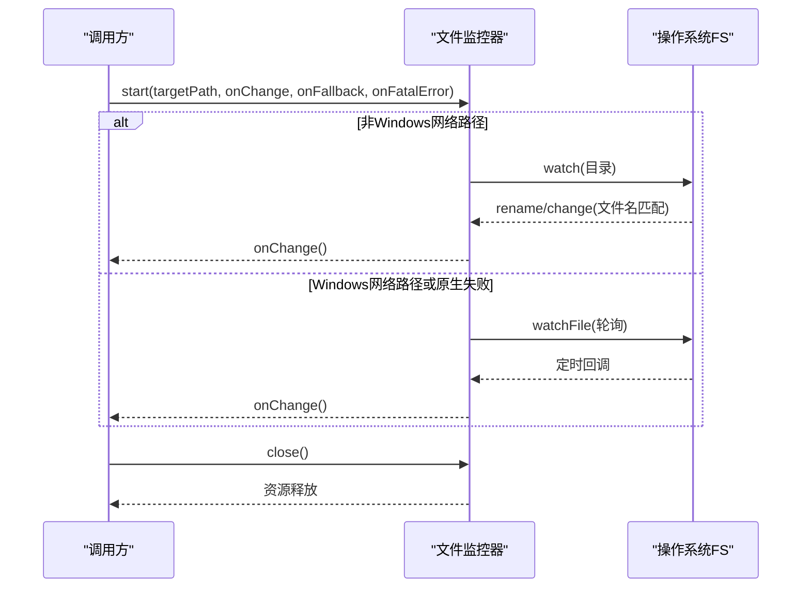
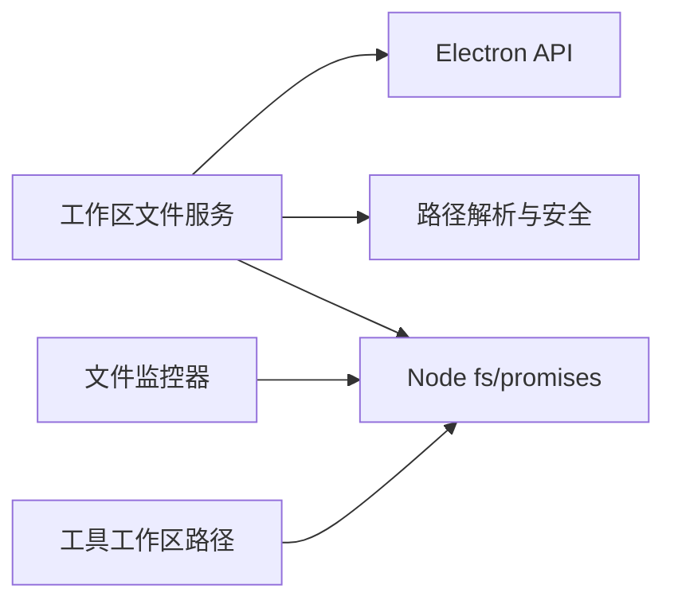

# 文件系统API

<cite>
**本文引用的文件**
- [workspace-files.ts](file://src/main/services/workspace-files.ts)
- [workspace-paths.ts](file://src/main/services/workspace-paths.ts)
- [workspace-file-watcher.ts](file://src/main/services/workspace-file-watcher.ts)
- [workspace-path.ts](file://kun/src/adapters/tool/workspace-path.ts)
- [workspace-file.ts](file://src/shared/workspace-file.ts)
- [ppt-master-tool.test.ts](file://kun/src/adapters/tool/ppt-master-tool.test.ts)
</cite>

## 目录
1. [简介](#简介)
2. [项目结构](#项目结构)
3. [核心组件](#核心组件)
4. [架构总览](#架构总览)
5. [详细组件分析](#详细组件分析)
6. [依赖关系分析](#依赖关系分析)
7. [性能考量](#性能考量)
8. [故障排查指南](#故障排查指南)
9. [结论](#结论)
10. [附录](#附录)

## 简介
本文件为 DeepSeek-GUI 扩展的“文件系统API”提供完整文档，覆盖文件读写、目录遍历、文件监控与路径解析等能力；说明安全限制、权限控制与沙箱机制；给出异步操作模式、错误处理与性能优化建议；并展示编码处理、大文件操作、批量操作的实现要点与工作区集成方式（相对路径解析、工作区感知）。同时包含变更监听、增量更新与冲突解决策略，并提供实际使用场景示例（如配置文件管理、缓存存储）的参考路径。

## 项目结构
文件系统API主要位于主进程服务层，围绕工作区进行安全的文件访问与操作：
- 路径解析与安全边界：统一的路径规范化、展开、校验与边界检查
- 文件与目录操作：读取、写入、创建、重命名、删除、列表
- 媒体与预览：图片/PDF读取与预览、剪贴板图片保存、选择图片保存
- 文件监控：原生FS事件与轮询双通道，自动降级与错误恢复
- 工具侧工作区路径：在工具执行上下文中对符号链接、物理根、同盘判断等进行处理

图表来源
- [workspace-files.ts:1-732](file://src/main/services/workspace-files.ts#L1-L732)
- [workspace-paths.ts:1-258](file://src/main/services/workspace-paths.ts#L1-L258)
- [workspace-file-watcher.ts:1-233](file://src/main/services/workspace-file-watcher.ts#L1-L233)
- [workspace-path.ts:1-130](file://kun/src/adapters/tool/workspace-path.ts#L1-L130)
- [workspace-file.ts:1-339](file://src/shared/workspace-file.ts#L1-L339)

章节来源
- [workspace-files.ts:1-732](file://src/main/services/workspace-files.ts#L1-L732)
- [workspace-paths.ts:1-258](file://src/main/services/workspace-paths.ts#L1-L258)
- [workspace-file-watcher.ts:1-233](file://src/main/services/workspace-file-watcher.ts#L1-L233)
- [workspace-path.ts:1-130](file://kun/src/adapters/tool/workspace-path.ts#L1-L130)
- [workspace-file.ts:1-339](file://src/shared/workspace-file.ts#L1-L339)

## 核心组件
- 工作区文件服务：提供统一的读/写/列目录/重命名/删除/图片与PDF读取/剪贴板图片保存/图片选择保存/文件解析等接口，所有写操作均在工作区内完成，支持原子写入与并发安全。
- 路径解析与安全：负责用户路径规范化、家目录展开、绝对/相对路径解析、工作区边界强制、唯一基名查找、大小写敏感差异处理等。
- 文件监控：基于原生FS事件优先，失败或网络路径时自动回退到轮询；提供关闭与错误上报。
- 工具工作区路径：在工具执行环境中解析符号链接、物理根、是否同盘、路径是否在根内等，确保工具输出受控。

章节来源
- [workspace-files.ts:1-732](file://src/main/services/workspace-files.ts#L1-L732)
- [workspace-paths.ts:1-258](file://src/main/services/workspace-paths.ts#L1-L258)
- [workspace-file-watcher.ts:1-233](file://src/main/services/workspace-file-watcher.ts#L1-L233)
- [workspace-path.ts:1-130](file://kun/src/adapters/tool/workspace-path.ts#L1-L130)

## 架构总览
下图展示了从调用方到文件系统的关键交互流程，包括路径校验、读写、监控与工具侧约束。

图表来源
- [workspace-files.ts:97-281](file://src/main/services/workspace-files.ts#L97-L281)
- [workspace-paths.ts:178-234](file://src/main/services/workspace-paths.ts#L178-L234)
- [workspace-file-watcher.ts:100-233](file://src/main/services/workspace-file-watcher.ts#L100-L233)

## 详细组件分析

### 路径解析与安全边界
- 功能要点
  - 用户路径规范化与家目录展开
  - 相对路径解析与基名唯一匹配
  - 工作区边界强制（防止越界）
  - 大小写敏感差异处理（Linux/Windows）
  - 符号链接与物理根解析（工具侧）
- 关键行为
  - 相对路径必须落在工作区内，否则抛出错误
  - 不存在父级时通过已有父级计算规范路径
  - 工具侧解析符号链接链，限制深度，避免逃逸

图表来源
- [workspace-paths.ts:23-67](file://src/main/services/workspace-paths.ts#L23-L67)
- [workspace-paths.ts:137-203](file://src/main/services/workspace-paths.ts#L137-L203)
- [workspace-path.ts:16-35](file://kun/src/adapters/tool/workspace-path.ts#L16-L35)

章节来源
- [workspace-paths.ts:23-67](file://src/main/services/workspace-paths.ts#L23-L67)
- [workspace-paths.ts:137-203](file://src/main/services/workspace-paths.ts#L137-L203)
- [workspace-path.ts:16-35](file://kun/src/adapters/tool/workspace-path.ts#L16-L35)

### 文件与目录操作
- 目录遍历
  - 列出目录条目，过滤系统隐藏项，补充元数据（类型、扩展名、大小、修改时间），按目录优先+名称排序
- 文件读取与预览
  - 文本文件：检测BOM/UTF-16，限制最大预览字节数，二进制文件拒绝预览
  - 图片：限制大小、识别MIME、转data URL
  - PDF：限制大小、仅允许.pdf、base64返回
- 文件写入与创建
  - 原子写入：先写临时文件再rename，崩溃不产生半写文件
  - 可选mtime冲突检测，避免覆盖外部修改
  - 创建文件时若存在则拒绝
- 重命名与删除
  - 重命名前校验新名称合法性，禁止覆盖已存在项
  - 删除时保护工作区根不被删除，目录递归删除

图表来源
- [workspace-files.ts:238-281](file://src/main/services/workspace-files.ts#L238-L281)
- [workspace-paths.ts:178-203](file://src/main/services/workspace-paths.ts#L178-L203)

章节来源
- [workspace-files.ts:97-326](file://src/main/services/workspace-files.ts#L97-L326)
- [workspace-paths.ts:178-203](file://src/main/services/workspace-paths.ts#L178-L203)

### 图片与PDF处理
- 图片
  - 读取：限制大小、识别扩展名与MIME、生成data URL
  - 保存：剪贴板图片保存到img目录；选择图片保存到指定目录；原始PNG/SVG字节保存到专用目录
  - 尺寸提取：针对PNG/GIF/WebP/JPEG头部解析宽高
- PDF
  - 读取：限制大小、仅允许.pdf、返回base64与元信息

章节来源
- [workspace-files.ts:168-236](file://src/main/services/workspace-files.ts#L168-L236)
- [workspace-files.ts:431-635](file://src/main/services/workspace-files.ts#L431-L635)

### 文件监控与增量更新
- 监控策略
  - 首选原生FS事件监听目录变化，精确匹配文件名触发回调
  - Windows网络路径或原生失败时自动回退到轮询（可配置间隔）
  - 提供close方法释放资源，错误上报与致命错误上报
- 增量更新
  - 通过onChange回调通知上层，上层按需重新读取最新内容
  - 结合写入时的mtime冲突检测，避免竞态导致的覆盖

图表来源
- [workspace-file-watcher.ts:100-233](file://src/main/services/workspace-file-watcher.ts#L100-L233)

章节来源
- [workspace-file-watcher.ts:1-233](file://src/main/services/workspace-file-watcher.ts#L1-L233)

### 工具侧工作区路径与沙箱
- 工具上下文中的路径解析
  - 解析符号链接链，限制深度，避免逃逸
  - 判断路径是否在同一文件系统、是否在工作区根内
  - 提供物理根与词法根的区分，便于安全约束
- 沙箱与白名单
  - 测试用例显示工具对输出位置有严格白名单（例如限定在项目子目录）
  - 输入源类型受限（如仅允许Markdown）
  - 需要确认令牌才能执行敏感操作

章节来源
- [workspace-path.ts:16-130](file://kun/src/adapters/tool/workspace-path.ts#L16-L130)
- [ppt-master-tool.test.ts:156-200](file://kun/src/adapters/tool/ppt-master-tool.test.ts#L156-L200)
- [ppt-master-tool.test.ts:304-329](file://kun/src/adapters/tool/ppt-master-tool.test.ts#L304-L329)

## 依赖关系分析
- 模块耦合
  - 工作区文件服务依赖路径解析与安全模块，以及Node fs/promises
  - 文件监控器依赖Node fs/watch与watchFile/unwatchFile
  - 工具侧路径模块独立于主进程服务，但语义一致（工作区边界、符号链接处理）
- 外部依赖
  - Electron API用于剪贴板与对话框（图片选择）
  - Node标准库用于文件系统操作
- 潜在循环依赖
  - 当前结构无循环依赖迹象，职责清晰分层

图表来源
- [workspace-files.ts:1-732](file://src/main/services/workspace-files.ts#L1-L732)
- [workspace-paths.ts:1-258](file://src/main/services/workspace-paths.ts#L1-L258)
- [workspace-file-watcher.ts:1-233](file://src/main/services/workspace-file-watcher.ts#L1-L233)
- [workspace-path.ts:1-130](file://kun/src/adapters/tool/workspace-path.ts#L1-L130)

章节来源
- [workspace-files.ts:1-732](file://src/main/services/workspace-files.ts#L1-L732)
- [workspace-paths.ts:1-258](file://src/main/services/workspace-paths.ts#L1-L258)
- [workspace-file-watcher.ts:1-233](file://src/main/services/workspace-file-watcher.ts#L1-L233)
- [workspace-path.ts:1-130](file://kun/src/adapters/tool/workspace-path.ts#L1-L130)

## 性能考量
- 大文件与预览
  - 文本预览限制最大字节数，避免内存占用过高
  - 图片与PDF预览限制大小，减少传输与渲染开销
- 原子写入
  - 通过临时文件+rename保证一致性，降低崩溃风险
- 监控策略
  - 原生事件优先，低延迟；网络路径或异常时回退轮询，保障可用性
- 批量操作建议
  - 合并多次写入为一次事务（应用层协调）
  - 批量读取时使用流式或分页，避免一次性加载过大文件
- 编码处理
  - 自动检测BOM与UTF-16，兼容不同编码文本
  - 图片MIME与扩展名一致性校验，避免错误渲染

[本节为通用指导，无需具体文件引用]

## 故障排查指南
- 常见错误
  - 路径越界：确保相对路径在工作区内，或传入正确的workspaceRoot
  - 文件不存在：检查路径是否存在或使用基名唯一匹配
  - 二进制文件无法预览：提示为二进制，需以其他方式处理
  - 图片过大/不支持：调整大小或转换格式
  - 监控失败：检查是否为Windows网络路径或原生事件不可用，查看回退日志
- 调试建议
  - 启用onFallback/onFatalError回调，记录失败原因
  - 对比写入前后的mtime，定位外部修改导致的冲突
  - 使用resolveWorkspaceFile验证路径解析结果

章节来源
- [workspace-files.ts:128-236](file://src/main/services/workspace-files.ts#L128-L236)
- [workspace-file-watcher.ts:73-87](file://src/main/services/workspace-file-watcher.ts#L73-L87)
- [workspace-paths.ts:178-234](file://src/main/services/workspace-paths.ts#L178-L234)

## 结论
DeepSeek-GUI的文件系统API通过统一的路径解析与安全边界、原子写入、多类型预览与监控回退机制，提供了稳定、安全且高性能的工作区文件操作能力。工具侧进一步通过符号链接解析与工作区白名单强化沙箱约束。建议在开发中遵循工作区边界、合理使用预览限制、利用监控回调实现增量更新，并结合mtime冲突检测提升并发安全性。

[本节为总结性内容，无需具体文件引用]

## 附录

### API概览与使用要点
- 目录遍历：listWorkspaceDirectory
- 文件读取与预览：readWorkspaceFile、readWorkspaceImage、readWorkspacePdf
- 文件写入与创建：writeWorkspaceFile、createWorkspaceFile、createWorkspaceDirectory
- 重命名与删除：renameWorkspaceEntry、deleteWorkspaceEntry
- 文件解析：resolveWorkspaceFile
- 图片与PDF：saveWorkspaceClipboardImage、pickAndSaveWorkspaceImage、saveWorkspaceImageBytes
- 监控：startWorkspaceFileWatcher（通过上层封装）

章节来源
- [workspace-files.ts:97-732](file://src/main/services/workspace-files.ts#L97-L732)
- [workspace-file.ts:1-339](file://src/shared/workspace-file.ts#L1-L339)

### 安全限制与权限控制
- 工作区边界强制：所有写操作与打开操作均限制在工作区内
- 工具沙箱：工具输出路径白名单、输入类型限制、确认令牌
- 路径规范化：清理引号包裹、零字符、斜杠标准化
- 符号链接防护：限制深度、解析物理根，防止逃逸

章节来源
- [workspace-paths.ts:137-203](file://src/main/services/workspace-paths.ts#L137-L203)
- [workspace-path.ts:16-130](file://kun/src/adapters/tool/workspace-path.ts#L16-L130)
- [ppt-master-tool.test.ts:156-200](file://kun/src/adapters/tool/ppt-master-tool.test.ts#L156-L200)

### 异步操作模式与错误处理
- 全部操作均为异步Promise风格
- 统一返回结构：ok标志与message或具体结果字段
- 监控回调：onChange/onFallback/onFatalError
- 冲突处理：写入时可选expectedMtimeMs检测，避免覆盖外部修改

章节来源
- [workspace-files.ts:238-281](file://src/main/services/workspace-files.ts#L238-L281)
- [workspace-file-watcher.ts:100-233](file://src/main/services/workspace-file-watcher.ts#L100-L233)
- [workspace-file.ts:252-264](file://src/shared/workspace-file.ts#L252-L264)

### 实际使用场景示例（参考路径）
- 配置文件管理
  - 读取配置：readWorkspaceFile
  - 写入配置：writeWorkspaceFile（配合mtime冲突检测）
  - 参考：[workspace-files.ts:128-281](file://src/main/services/workspace-files.ts#L128-L281)
- 缓存存储
  - 写入缓存：writeWorkspaceFile（原子写入）
  - 读取缓存：readWorkspaceFile
  - 参考：[workspace-files.ts:238-281](file://src/main/services/workspace-files.ts#L238-L281)
- 图片与PDF预览
  - 读取图片：readWorkspaceImage
  - 读取PDF：readWorkspacePdf
  - 参考：[workspace-files.ts:168-236](file://src/main/services/workspace-files.ts#L168-L236)
- 工作区感知与相对路径
  - 解析相对路径：resolveOpenTargetPath/resolveTargetPathWithinWorkspace
  - 参考：[workspace-paths.ts:178-234](file://src/main/services/workspace-paths.ts#L178-L234)