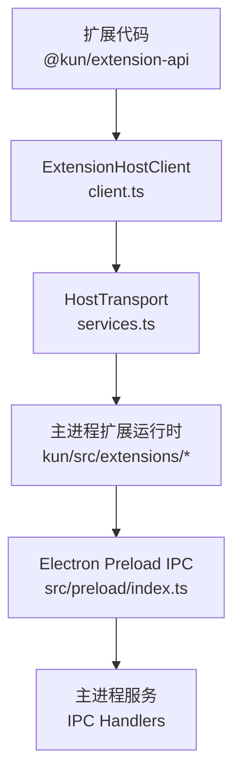
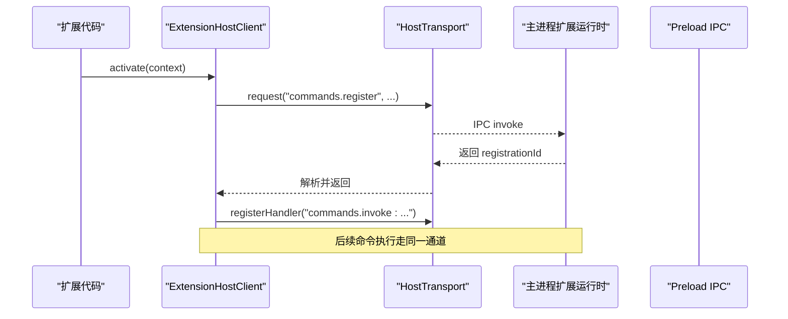
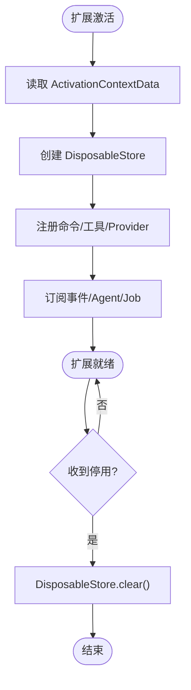
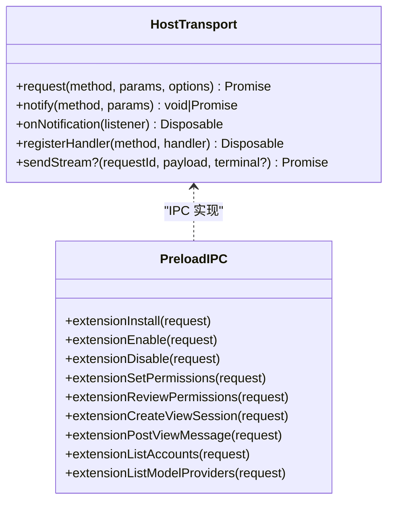
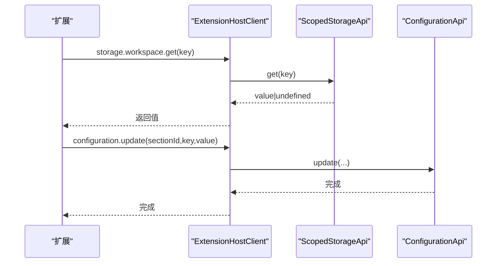
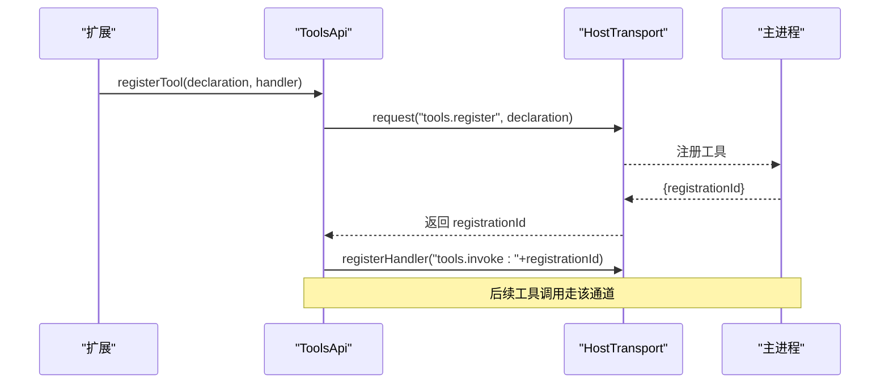
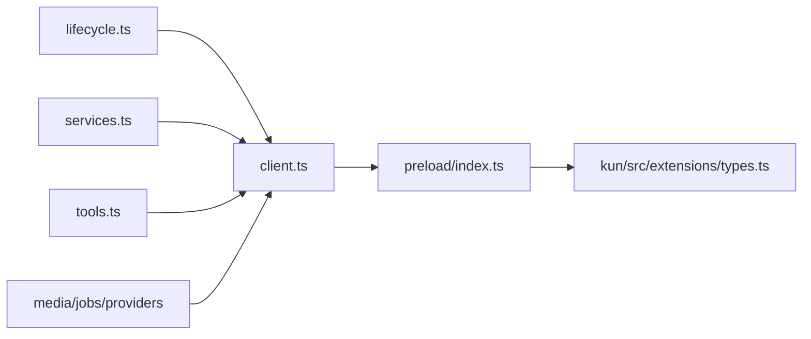

# 核心API

<cite>
**本文引用的文件**
- [packages/extension-api/src/index.ts](file://packages/extension-api/src/index.ts)
- [packages/extension-api/src/client.ts](file://packages/extension-api/src/client.ts)
- [packages/extension-api/src/services.ts](file://packages/extension-api/src/services.ts)
- [packages/extension-api/src/lifecycle.ts](file://packages/extension-api/src/lifecycle.ts)
- [packages/extension-api/src/tools.ts](file://packages/extension-api/src/tools.ts)
- [docs/extensions/api-reference.md](file://docs/extensions/api-reference.md)
- [kun/src/extensions/types.ts](file://kun/src/extensions/types.ts)
- [src/preload/index.ts](file://src/preload/index.ts)
</cite>

## 目录
1. [简介](#简介)
2. [项目结构](#项目结构)
3. [核心组件](#核心组件)
4. [架构总览](#架构总览)
5. [详细组件分析](#详细组件分析)
6. [依赖关系分析](#依赖关系分析)
7. [性能考虑](#性能考虑)
8. [故障排查指南](#故障排查指南)
9. [结论](#结论)
10. [附录](#附录)

## 简介
本文件为 DeepSeek-GUI 扩展核心 API 的权威技术文档，聚焦于扩展生命周期管理、宿主环境访问、配置与状态管理、基础工具函数、权限与元数据、以及 TypeScript 类型支持。文档覆盖扩展的初始化流程、注册机制、卸载处理、与主进程的通信方式、错误处理与调试方法，并提供可操作的示例路径，帮助开发者快速构建稳定、可维护的扩展功能。

## 项目结构
DeepSeek-GUI 的扩展体系由三部分构成：
- 框架无关的扩展 SDK（@kun/extension-api）：定义 Manifest、生命周期、Host Client、Agent、工具、Provider、存储、网络、UI、媒体、作业等契约与类型。
- 宿主侧扩展运行时（kun/src/extensions）：负责扩展发现、加载、注册、权限、索引、迁移、日志、协议与传输等。
- 渲染层桥接（src/preload）：通过 Electron preload 暴露 IPC 能力，供 Webview/扩展视图与主进程通信。

图表来源
- [packages/extension-api/src/client.ts:312-351](file://packages/extension-api/src/client.ts#L312-L351)
- [packages/extension-api/src/services.ts:112-119](file://packages/extension-api/src/services.ts#L112-L119)
- [src/preload/index.ts:565-661](file://src/preload/index.ts#L565-L661)

章节来源
- [packages/extension-api/src/index.ts:1-20](file://packages/extension-api/src/index.ts#L1-L20)
- [docs/extensions/api-reference.md:15-23](file://docs/extensions/api-reference.md#L15-L23)

## 核心组件
- ExtensionContext：扩展激活时注入的上下文对象，提供命令、存储、配置、网络、UI、Agent、线程、工具、模型 Provider、认证、媒体、作业、工作区等能力。
- ExtensionHostClient：在 Webview/扩展视图中创建，封装所有 Host 调用，统一序列化、校验、事件重放与订阅管理。
- HostTransport：请求/通知/流式回调的抽象通道，preload 通过 IPC 实现。
- 生命周期：DisposableStore、Emitter、ActivationContextData、WorkspaceContext、StateMigration 等。
- 工具系统：ExtensionToolDeclaration、ToolInvocation、ToolResult、CancellationToken、进度上报。
- 配置与存储：ScopedStorageApi、ConfigurationApi、StorageScope。
- UI：主题、语言、视图状态、消息、通知、Composer 上下文挂载。
- Agent/Threads：运行、订阅、控制、线程投影。
- 媒体与作业：受保护的文件选择、资源租约、FFmpeg/音频/归档任务、Job 订阅与快照。
- 权限与元数据：Manifest 字段、权限声明、签名与兼容性报告。

章节来源
- [packages/extension-api/src/client.ts:293-338](file://packages/extension-api/src/client.ts#L293-L338)
- [packages/extension-api/src/services.ts:121-156](file://packages/extension-api/src/services.ts#L121-L156)
- [packages/extension-api/src/lifecycle.ts:21-67](file://packages/extension-api/src/lifecycle.ts#L21-L67)
- [packages/extension-api/src/tools.ts:8-62](file://packages/extension-api/src/tools.ts#L8-L62)
- [docs/extensions/api-reference.md:25-77](file://docs/extensions/api-reference.md#L25-L77)

## 架构总览
扩展通过 ExtensionHostClient 与 Host 通信，所有输入输出均使用 Zod Schema 进行严格校验；事件订阅具备重放与缓冲机制，确保断线恢复与顺序一致。preload 将扩展相关 IPC 暴露给渲染进程，主进程承载扩展管理器、注册表、权限、存储、作业调度等。

图表来源
- [packages/extension-api/src/client.ts:353-372](file://packages/extension-api/src/client.ts#L353-L372)
- [src/preload/index.ts:565-585](file://src/preload/index.ts#L565-L585)

章节来源
- [packages/extension-api/src/client.ts:234-255](file://packages/extension-api/src/client.ts#L234-L255)
- [packages/extension-api/src/services.ts:87-119](file://packages/extension-api/src/services.ts#L87-L119)

## 详细组件分析

### 生命周期与激活流程
- 激活上下文 ActivationContextData：包含扩展身份、API 版本、能力列表、已授予权限、工作区上下文、激活事件、初始状态。
- 资源释放：DisposableStore 统一管理 Disposable，clear/dispose 会收集并逆序释放，聚合异常。
- 事件系统：Emitter 提供 event/listener 模式，dispose 后 fire 无效。
- 状态迁移：StateMigrationContext 提供 fromVersion/toVersion/scope/workspace，用于跨版本状态升级。

图表来源
- [packages/extension-api/src/lifecycle.ts:21-67](file://packages/extension-api/src/lifecycle.ts#L21-L67)
- [packages/extension-api/src/lifecycle.ts:103-129](file://packages/extension-api/src/lifecycle.ts#L103-L129)

章节来源
- [packages/extension-api/src/lifecycle.ts:1-129](file://packages/extension-api/src/lifecycle.ts#L1-L129)

### 宿主环境访问与通信
- HostTransport：request/notify/onNotification/registerHandler/sendStream，支持 AbortSignal 与超时。
- 预加载桥接：preload 暴露大量 extension:* IPC，包括安装、启用/禁用、权限审查、View Session、外部浏览器控制、账户/Provider 管理等。
- 安全边界：扩展不直接持有 identity/token，均由 Host 注入或协商。

图表来源
- [packages/extension-api/src/services.ts:112-119](file://packages/extension-api/src/services.ts#L112-L119)
- [src/preload/index.ts:565-661](file://src/preload/index.ts#L565-L661)

章节来源
- [src/preload/index.ts:565-661](file://src/preload/index.ts#L565-L661)
- [packages/extension-api/src/services.ts:87-119](file://packages/extension-api/src/services.ts#L87-L119)

### 配置管理与状态存储
- ScopedStorageApi：global/workspace 两个作用域的 get/set/delete/keys。
- ConfigurationApi：按 sectionId/key 读写配置，监听 onDidChange。
- 类型与约束：StorageEntry、ConfigurationChangeEvent 均有 Zod Schema 校验。

图表来源
- [packages/extension-api/src/client.ts:374-399](file://packages/extension-api/src/client.ts#L374-L399)
- [packages/extension-api/src/services.ts:121-156](file://packages/extension-api/src/services.ts#L121-L156)

章节来源
- [packages/extension-api/src/client.ts:374-399](file://packages/extension-api/src/client.ts#L374-L399)
- [packages/extension-api/src/services.ts:121-156](file://packages/extension-api/src/services.ts#L121-L156)

### 工具系统与注册机制
- 工具声明：id/description/inputSchema/outputSchema/sideEffects/idempotent/maxOutputBytes。
- 调用上下文：invocation/cancellation/reportProgress。
- 结果规范：content/summary/metadata/generatedArtifacts。
- 注册流程：registerTool -> 返回 registrationId -> 本地注册 Handler -> 卸载时注销。

图表来源
- [packages/extension-api/src/tools.ts:8-62](file://packages/extension-api/src/tools.ts#L8-L62)
- [packages/extension-api/src/client.ts:544-572](file://packages/extension-api/src/client.ts#L544-L572)

章节来源
- [packages/extension-api/src/tools.ts:8-62](file://packages/extension-api/src/tools.ts#L8-L62)
- [packages/extension-api/src/client.ts:544-572](file://packages/extension-api/src/client.ts#L544-L572)

### 权限请求与扩展元数据
- Manifest：包含贡献项、激活事件、命令、视图、通知、设置、外部浏览器站点等。
- 权限：STATIC_PERMISSIONS、ScopedPermission、NETWORK_PERMISSION_PATTERN、PROVIDER_PERMISSION_PATTERN。
- 兼容性：supportedApiMajors、negotiateApiVersion、CompatibilityReport。
- 注册表：ExtensionRegistry、InstalledExtensionVersion、SignatureStatus、PermissionGrant。

章节来源
- [docs/extensions/api-reference.md:86-120](file://docs/extensions/api-reference.md#L86-L120)
- [kun/src/extensions/types.ts:6-118](file://kun/src/extensions/types.ts#L6-L118)

### 错误处理、日志与调试
- 错误包装：ExtensionApiError.from/PROTOCOL_ERROR，统一携带 operation/code/details。
- 日志：preload 暴露 logError/getLogPath/openLogDir。
- 诊断：extensionDiagnostics、extension:view-session:events、onExtensionNotifications。
- 调试建议：
  - 使用 onDidError 捕获扩展内错误。
  - 通过 ui.showNotification 向用户提示关键状态。
  - 借助 jobs.subscribe 观察后台任务进展与回放缺口。
  - 使用 agent.subscribe 的事件重放定位问题。

章节来源
- [packages/extension-api/src/client.ts:234-255](file://packages/extension-api/src/client.ts#L234-L255)
- [src/preload/index.ts:561-564](file://src/preload/index.ts#L561-L564)
- [src/preload/index.ts:572-629](file://src/preload/index.ts#L572-L629)

### 基本结构与入口点
- 入口约定：Node 入口接收 ExtensionContext；Webview 通过 HostTransport 创建 ExtensionHostClient。
- 最小示例路径：参考 API 参考中的示例片段，展示 activate 与 createViewClient 的使用。
- 与主进程通信：通过 preload 暴露的 extension:* IPC 完成安装、启用、权限、View Session、消息等。

章节来源
- [docs/extensions/api-reference.md:25-41](file://docs/extensions/api-reference.md#L25-L41)
- [src/preload/index.ts:565-661](file://src/preload/index.ts#L565-L661)

## 依赖关系分析
- @kun/extension-api 内部模块高度内聚：client 依赖 services/lifecycle/tools/media/jobs/providers 等；services 定义所有对外接口与 Schema；lifecycle 提供通用原语。
- 宿主侧 kun/src/extensions 提供类型与运行时契约（如注册表、索引、RPC 版本）。
- 渲染侧 src/preload 作为 IPC 桥，承载扩展管理能力。

图表来源
- [packages/extension-api/src/client.ts:1-140](file://packages/extension-api/src/client.ts#L1-L140)
- [packages/extension-api/src/services.ts:1-86](file://packages/extension-api/src/services.ts#L1-L86)
- [packages/extension-api/src/lifecycle.ts:1-20](file://packages/extension-api/src/lifecycle.ts#L1-L20)
- [packages/extension-api/src/tools.ts:1-18](file://packages/extension-api/src/tools.ts#L1-L18)
- [src/preload/index.ts:565-661](file://src/preload/index.ts#L565-L661)
- [kun/src/extensions/types.ts:6-24](file://kun/src/extensions/types.ts#L6-L24)

章节来源
- [packages/extension-api/src/client.ts:1-140](file://packages/extension-api/src/client.ts#L1-L140)
- [packages/extension-api/src/services.ts:1-86](file://packages/extension-api/src/services.ts#L1-L86)
- [packages/extension-api/src/lifecycle.ts:1-20](file://packages/extension-api/src/lifecycle.ts#L1-L20)
- [packages/extension-api/src/tools.ts:1-18](file://packages/extension-api/src/tools.ts#L1-L18)
- [src/preload/index.ts:565-661](file://src/preload/index.ts#L565-L661)
- [kun/src/extensions/types.ts:6-24](file://kun/src/extensions/types.ts#L6-L24)

## 性能考虑
- 事件缓冲与重放：Agent/Job 订阅维护 initialReplay/buffered，避免丢失历史事件；限制最大缓冲与孤儿订阅数量。
- 序列化开销：toWire 对参数进行 JSON 序列化与反序列化，注意大对象传递成本。
- 网络与 I/O：network.fetch 支持 timeoutMs；media 与 jobs 操作可能触发长时间任务，应配合取消信号与进度上报。
- 存储与配置：ScopedStorage/Configuration 操作均为异步，批量更新时应合并以减少 IPC 次数。

章节来源
- [packages/extension-api/src/client.ts:142-179](file://packages/extension-api/src/client.ts#L142-L179)
- [packages/extension-api/src/client.ts:447-530](file://packages/extension-api/src/client.ts#L447-L530)
- [packages/extension-api/src/client.ts:743-800](file://packages/extension-api/src/client.ts#L743-L800)
- [packages/extension-api/src/services.ts:158-175](file://packages/extension-api/src/services.ts#L158-L175)

## 故障排查指南
- 常见问题
  - 协议错误：Zod 校验失败会抛出 PROTOCOL_ERROR，检查 Host 响应是否与 Schema 匹配。
  - 权限不足：部分 media 与交互 surface 需要显式权限，未授权会返回结构化错误。
  - View 会话失效：ui.showNotification 超时或 lease 失效返回 undefined，需重试或降级。
  - Job 回放缺口：jobs.subscribe 返回 replayGap=true 时，应从 snapshot 刷新。
- 调试步骤
  - 使用 onDidError 捕获扩展错误。
  - 通过 extensionDiagnostics 获取扩展诊断信息。
  - 使用 extension:view-session:events 查看视图事件流。
  - 利用 ui.attachComposerContext 将上下文附加到主会话，便于复现。
  - 打开日志目录与查看日志路径，结合时间戳定位问题。

章节来源
- [packages/extension-api/src/client.ts:234-255](file://packages/extension-api/src/client.ts#L234-L255)
- [src/preload/index.ts:572-629](file://src/preload/index.ts#L572-L629)
- [src/preload/index.ts:561-564](file://src/preload/index.ts#L561-L564)

## 结论
DeepSeek-GUI 扩展核心 API 以强类型、强校验、强隔离为原则，提供完整的生命周期、宿主访问、配置与状态、工具与 Provider、媒体与作业、权限与元数据等能力。通过 ExtensionHostClient 与 HostTransport，扩展可在不同环境中复用同一套语义；preload 提供的 IPC 桥确保了与主进程的安全通信。遵循本文档的模式与实践，可高效构建稳定、可观测、易维护的扩展功能。

## 附录
- 快速开始示例路径：参考 API 参考中的示例片段，展示 activate 与 createViewClient 的基本用法。
- 类型支持：所有公开导出均在 @kun/extension-api 中提供 TypeScript 类型与 Zod Schema，保证编译期与运行期一致性。
- 最佳实践
  - 始终使用 Subscription 管理事件与资源，确保 dispose 清理。
  - 对长耗时操作使用 CancellationToken 与进度上报。
  - 谨慎处理权限与敏感数据，避免在日志中泄露密钥。
  - 使用 jobs.subscribe 与 agent.subscribe 的重放能力提升鲁棒性。

章节来源
- [docs/extensions/api-reference.md:25-41](file://docs/extensions/api-reference.md#L25-L41)
- [docs/extensions/api-reference.md:86-120](file://docs/extensions/api-reference.md#L86-L120)