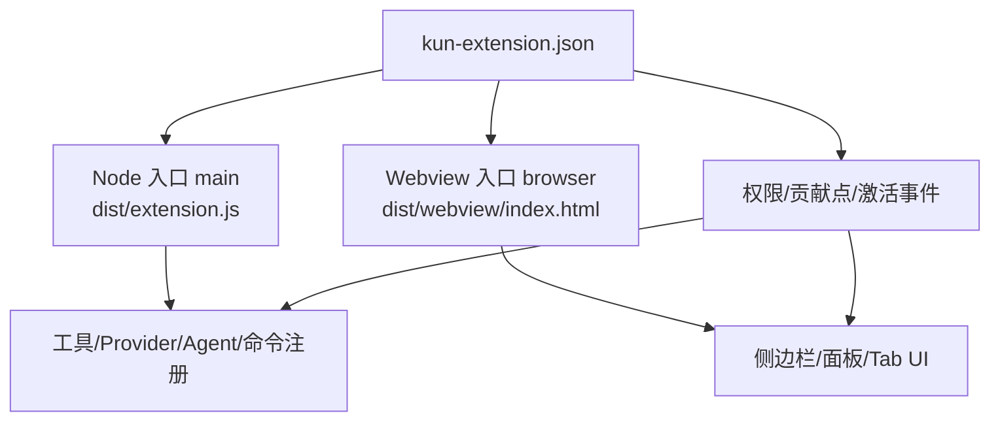
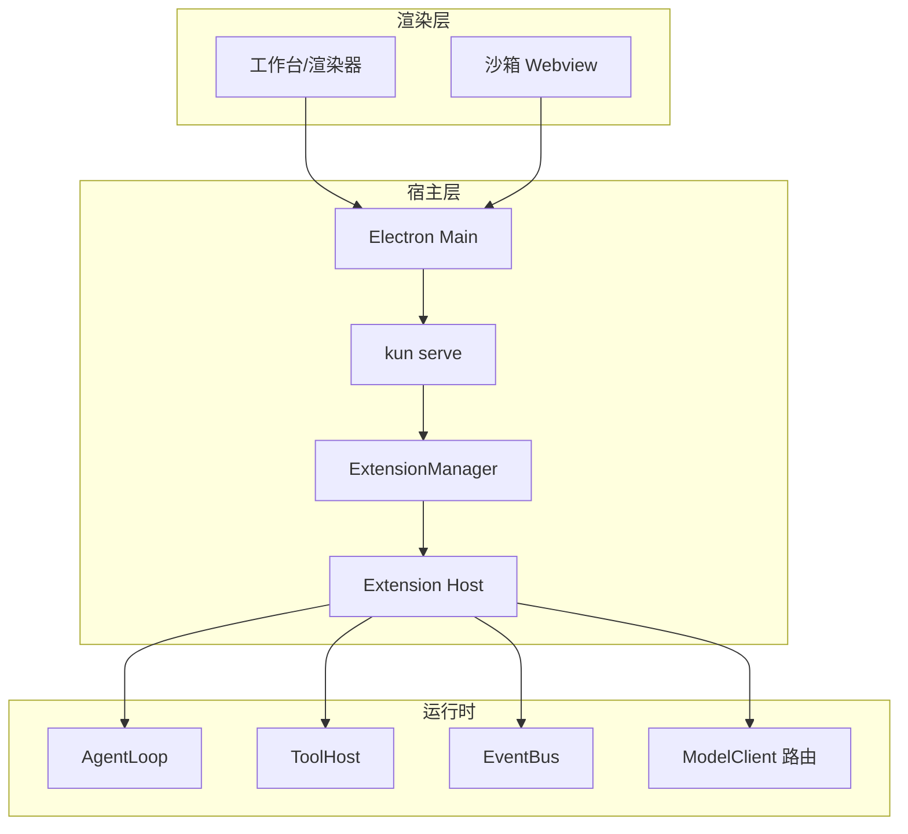
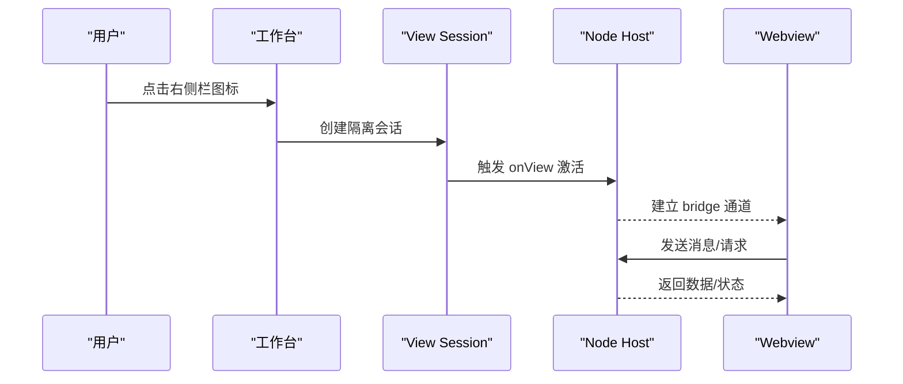
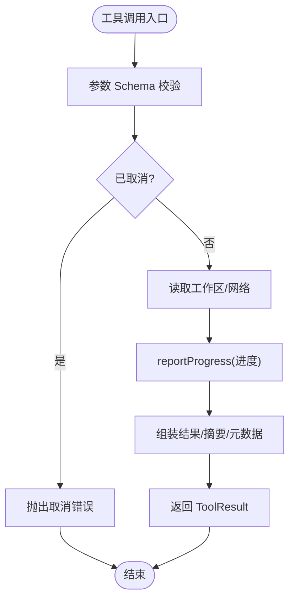
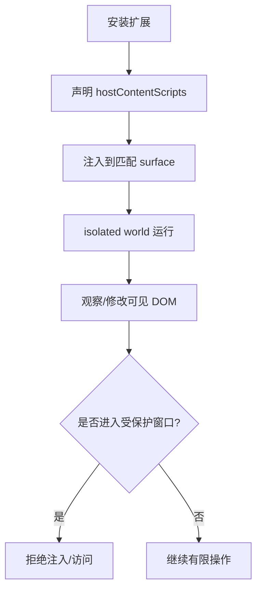
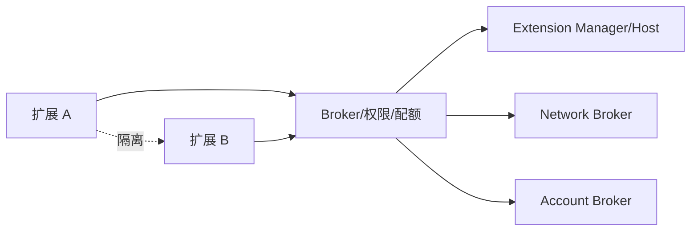

# 扩展开发指南

<cite>
**本文引用的文件**
- [docs/extensions/README.md](file://docs/extensions/README.md)
- [docs/extensions/manifest.md](file://docs/extensions/manifest.md)
- [docs/extensions/quick-start.md](file://docs/extensions/quick-start.md)
- [docs/extensions/architecture.md](file://docs/extensions/architecture.md)
- [docs/extensions/lifecycle.md](file://docs/extensions/lifecycle.md)
- [docs/extensions/workbench.md](file://docs/extensions/workbench.md)
- [docs/extensions/agent-and-tools.md](file://docs/extensions/agent-and-tools.md)
- [docs/extensions/security-and-resources.md](file://docs/extensions/security-and-resources.md)
- [docs/extensions/cli-testing-debugging.md](file://docs/extensions/cli-testing-debugging.md)
- [examples/extensions/README.md](file://examples/extensions/README.md)
- [examples/extensions/hello-sidebar/kun-extension.json](file://examples/extensions/hello-sidebar/kun-extension.json)
- [examples/extensions/tool-provider/kun-extension.json](file://examples/extensions/tool-provider/kun-extension.json)
- [examples/extensions/tool-provider/src/extension.ts](file://examples/extensions/tool-provider/src/extension.ts)
- [examples/extensions/agent-assistant/kun-extension.json](file://examples/extensions/agent-assistant/kun-extension.json)
- [examples/extensions/direct-dom/kun-extension.json](file://examples/extensions/direct-dom/kun-extension.json)
</cite>

## 目录
1. [简介](#简介)
2. [项目结构](#项目结构)
3. [核心组件](#核心组件)
4. [架构总览](#架构总览)
5. [详细组件分析](#详细组件分析)
6. [依赖关系分析](#依赖关系分析)
7. [性能考虑](#性能考虑)
8. [故障排查指南](#故障排查指南)
9. [结论](#结论)
10. [附录](#附录)

## 简介
本指南面向希望从零开始为 DeepSeek-GUI（Kun）创建扩展的开发者。内容覆盖：
- 从零搭建扩展项目、编写 kun-extension.json、组织代码与构建流程
- 四类扩展模式：侧边栏 Webview、工具面板（工具提供者）、内容脚本（Direct DOM）、协议处理器（模型 Provider/认证）
- Manifest 配置项详解、权限与资源边界、安全与信任模型
- 开发环境搭建、调试与测试方法
- 代码组织最佳实践、性能优化建议与安全性注意事项
- 从简单到复杂的扩展示例路径，帮助快速上手并稳定发布

## 项目结构
一个典型的 v1 扩展由以下部分组成：
- 根级清单：kun-extension.json，声明入口、贡献点、激活事件、权限、版本等
- Node 入口（可选）：main 指向的宿主进程模块，用于工具、Provider、Agent、后台命令等
- Webview 入口（可选）：browser 指向的 HTML，用于复杂 UI（侧边栏、面板、编辑区 Tab、全页视图）
- 资源与完整性：打包后生成 integrity 清单，包含所有受控资源
- 构建与脚本：Vite/TypeScript 等将源码编译为 dist 产物，供 manifest 引用

图示来源
- [docs/extensions/manifest.md:57-88](file://docs/extensions/manifest.md#L57-L88)
- [docs/extensions/architecture.md:33-43](file://docs/extensions/architecture.md#L33-L43)

章节来源
- [docs/extensions/manifest.md:57-88](file://docs/extensions/manifest.md#L57-L88)
- [docs/extensions/architecture.md:33-43](file://docs/extensions/architecture.md#L33-L43)

## 核心组件
- 扩展管理器与 Host：负责扩展发现、版本选择、权限快照、惰性激活、并发/速率/内存限制、崩溃熔断、日志与诊断
- 执行位置：Node 子进程（headless/后台能力）、Chromium Webview（受限 UI）、声明式贡献（宿主渲染）、hostContentScripts（高风险 Direct DOM）
- 身份与 Broker：每次操作重新校验扩展身份、工作区信任、权限授予、资源归属、配额与策略
- Agent 与工具：统一通过 Kun runtime 的 AgentLoop、ToolHost、EventBus、ApprovalGate；扩展无内部 token
- 持久化边界：包不可变、状态隔离、账号秘密使用凭证存储、日志轮转与脱敏

章节来源
- [docs/extensions/architecture.md:7-31](file://docs/extensions/architecture.md#L7-L31)
- [docs/extensions/architecture.md:58-68](file://docs/extensions/architecture.md#L58-L68)
- [docs/extensions/architecture.md:97-106](file://docs/extensions/architecture.md#L97-L106)

## 架构总览
Kun 扩展平台不创建第二套 Agent runtime，所有 Agent 对话、线程、工具、审批、事件、Provider 路由与用量均经由唯一 runtime。扩展通过公开 Host Context 和 Broker 调用能力。

图示来源
- [docs/extensions/architecture.md:7-31](file://docs/extensions/architecture.md#L7-L31)

章节来源
- [docs/extensions/architecture.md:7-31](file://docs/extensions/architecture.md#L7-L31)

## 详细组件分析

### 侧边栏扩展（Webview + 命令/设置）
- 典型场景：右侧栏 View，主题、本地化、View 状态持久化
- 关键要点：
  - 在 manifests 中声明 views.rightSidebar 与 entry
  - 仅图标/标题不会激活 Node；真正打开 View 才触发 onView 事件
  - 通过 context.ui.postMessage 与 Webview 通信；使用 @kun/extension-react Hooks 获取主题/locale/状态
  - 设置通过 configuration API 读写，避免重复 localStorage

图示来源
- [docs/extensions/quick-start.md:72-113](file://docs/extensions/quick-start.md#L72-L113)
- [docs/extensions/workbench.md:46-73](file://docs/extensions/workbench.md#L46-L73)

章节来源
- [docs/extensions/quick-start.md:72-113](file://docs/extensions/quick-start.md#L72-L113)
- [docs/extensions/workbench.md:46-73](file://docs/extensions/workbench.md#L46-L73)

### 工具面板（Headless 工具提供者）
- 典型场景：暴露 typed tool，支持进度、取消、工作区访问
- 关键要点：
  - 在 contributes.tools 中声明 inputSchema/outputSchema/sideEffects/idempotent/maxOutputBytes
  - 在 activate 中注册工具 handler，使用 ToolInvocationContext 报告进度与处理取消
  - 通过 workspace.* 与 network:* 权限访问资源，严格遵循最小权限原则

图示来源
- [examples/extensions/tool-provider/src/extension.ts:50-78](file://examples/extensions/tool-provider/src/extension.ts#L50-L78)
- [docs/extensions/agent-and-tools.md:149-207](file://docs/extensions/agent-and-tools.md#L149-L207)

章节来源
- [examples/extensions/tool-provider/src/extension.ts:50-78](file://examples/extensions/tool-provider/src/extension.ts#L50-L78)
- [docs/extensions/agent-and-tools.md:149-207](file://docs/extensions/agent-and-tools.md#L149-L207)

### 内容脚本（Direct DOM）
- 典型场景：必须直接读写宿主 DOM 的极少场景，高风险且不稳定
- 关键要点：
  - hostContentScripts 静态声明 id/matches/scripts/styles/runAt
  - 在插件专属 isolated world 运行，不能访问页面 JS/Electron/Node
  - 需要 hostDom 权限；安装器将其标记为最高风险能力

图示来源
- [docs/extensions/manifest.md:311-315](file://docs/extensions/manifest.md#L311-L315)
- [examples/extensions/direct-dom/kun-extension.json:18-31](file://examples/extensions/direct-dom/kun-extension.json#L18-L31)

章节来源
- [docs/extensions/manifest.md:311-315](file://docs/extensions/manifest.md#L311-L315)
- [examples/extensions/direct-dom/kun-extension.json:18-31](file://examples/extensions/direct-dom/kun-extension.json#L18-L31)

### 协议处理器（模型 Provider/认证）
- 典型场景：自定义模型 Provider、OAuth/API Key 绑定、标准化流式响应、用量统计
- 关键要点：
  - 通过 contributes.modelProviders/authentication 声明
  - 使用 accounts.use/manage/secrets.read 等权限，敏感信息走凭证存储
  - 失败需显式报错，禁止静默回退到其他 Provider/账号/模型

章节来源
- [docs/extensions/manifest.md:163-183](file://docs/extensions/manifest.md#L163-L183)
- [docs/extensions/security-and-resources.md:124-127](file://docs/extensions/security-and-resources.md#L124-L127)

### 清单文件格式（kun-extension.json）详解
- 顶层字段：manifestVersion、apiVersion、publisher、name、version、displayName、description、icon、localizations、license、homepage、engines.kun、main、browser、activationEvents、contributes、permissions、stateSchemaVersion、signature
- 入口约束：至少存在 main 或 browser；要求 headless 的能力必须有 main
- 激活事件：onStartup/onView:/onCommand:/onTool:/onProvider:/onAuthentication:/onAgentProfile:
- 贡献点：commands/views/actions/settings/tools/agentProfiles/modelProviders/authentication/hostContentScripts 等
- when 条件：封闭表达式，不执行 JS，未知 key 解析为 unavailable
- 权限：精确字符串数组，按贡献推导最小权限；新增权限需重新确认
- Direct DOM：静态声明 scripts/styles/matches/runAt；高风险
- 资源与完整性：README/LICENSE/integrity.json；拒绝未声明/缺失/越界资源
- 验证：kun extension validate

章节来源
- [docs/extensions/manifest.md:57-129](file://docs/extensions/manifest.md#L57-L129)
- [docs/extensions/manifest.md:143-208](file://docs/extensions/manifest.md#L143-L208)
- [docs/extensions/manifest.md:276-327](file://docs/extensions/manifest.md#L276-L327)

### 生命周期与激活
- 状态流程：installed -> inactive -> activating -> active -> deactivating -> inactive/disabled/uninstalled
- 静态发现：Manifest 中的标题/图标/when 不激活代码
- activate(context)：注册命令/工具/Provider/监听器，加入 subscriptions
- Disposable 规则：所有资源必须可释放，dispose 幂等
- 激活串行化：同一扩展最多一个 Host，合并激活请求
- Deactivation：disable/切换版本/uninstall/shutdown/权限失效/circuit open/reload
- Headless：kun serve/exec 下工具/Provider/Agent profile 可用；交互需 interaction-required
- 崩溃与熔断：连续不健康启动/崩溃后 circuit open，有界退避

章节来源
- [docs/extensions/lifecycle.md:9-26](file://docs/extensions/lifecycle.md#L9-L26)
- [docs/extensions/lifecycle.md:38-90](file://docs/extensions/lifecycle.md#L38-L90)
- [docs/extensions/lifecycle.md:92-145](file://docs/extensions/lifecycle.md#L92-L145)

### Agent Runs 与工具
- 权限：agent.run/agent.threads.readOwn/tools.register 及对应 workspace/network/accounts
- 稳定 API：createRun/subscribe/steer/cancel/getRun/threads.listOwn/getOwn
- Run 生命周期：queued -> running <-> waiting-approval -> completed / failed / cancelled / budget-exhausted
- 订阅与重放：authenticated event boundary，sequence 重连，bounded queue
- Steering 与取消：不能绕过 ApprovalGate；cancel 幂等
- 工具注册：inputSchema/outputSchema/sideEffects/idempotent/maxOutputBytes
- 工具 Catalog：epoch/fingerprint 固定，避免漂移
- Headless：语义一致，无 GUI 时保持 gated 或按 policy 结束

章节来源
- [docs/extensions/agent-and-tools.md:9-32](file://docs/extensions/agent-and-tools.md#L9-L32)
- [docs/extensions/agent-and-tools.md:84-133](file://docs/extensions/agent-and-tools.md#L84-L133)
- [docs/extensions/agent-and-tools.md:149-263](file://docs/extensions/agent-and-tools.md#L149-L263)

### 工作台贡献点、命令、设置与 UX
- 推荐入口：views.rightSidebar；其他位置兼容但非默认可发现
- 身份与命名空间：builtin:<id> / extension:<publisher.name>/<local-id>
- View 声明：entry/localResourceRoots/icon/title/when/order/showInRightRail
- 命令：注册与 Manifest 一致，参数/返回值受 Schema 与限额保护
- Actions/Context Menu：宿主渲染，关注可访问性与主题适配
- 结果预览：kun.resultPreview.open 消息，payload 不含绝对路径/附件字节
- 设置：非秘密结构化配置，section/key 来自 Manifest，变更事件驱动
- 通知：宿主渲染，action 返回本地 id，不是审批入口
- when 与 Enablement：只决定可见性/可用性，Broker 仍检查权限
- UX/可访问性：主题、locale、zoom、高对比度、焦点管理、长列表虚拟化

章节来源
- [docs/extensions/workbench.md:7-44](file://docs/extensions/workbench.md#L7-L44)
- [docs/extensions/workbench.md:46-73](file://docs/extensions/workbench.md#L46-L73)
- [docs/extensions/workbench.md:75-133](file://docs/extensions/workbench.md#L75-L133)
- [docs/extensions/workbench.md:135-210](file://docs/extensions/workbench.md#L135-L210)
- [docs/extensions/workbench.md:210-249](file://docs/extensions/workbench.md#L210-L249)

## 依赖关系分析
- 扩展与宿主：通过 ExtensionManager 与 Broker 交互，不依赖内部 IPC/token
- 扩展之间：彼此隔离，thread/state/account/command 默认不可共享
- 外部依赖：Network Broker 对 HTTPS 进行 DNS/地址分类/重定向校验；Account Broker 注入认证并移除凭据
- 示例依赖：hello-sidebar（Webview）、tool-provider（headless 工具）、agent-assistant（Agent run/profile）、direct-dom（hostContentScripts）

图示来源
- [docs/extensions/architecture.md:58-68](file://docs/extensions/architecture.md#L58-L68)
- [docs/extensions/security-and-resources.md:96-127](file://docs/extensions/security-and-resources.md#L96-L127)

章节来源
- [docs/extensions/architecture.md:58-68](file://docs/extensions/architecture.md#L58-L68)
- [docs/extensions/security-and-resources.md:96-127](file://docs/extensions/security-and-resources.md#L96-L127)

## 性能考虑
- 激活与关闭：activate 快速完成，尽快返回；deactivate 清理资源
- 资源限额：IPC 消息、operation deadline、stream window、event rate、memory ceiling、日志轮转等
- 背压与队列：producer 等待 ack，queue 有 item/bytes 上限；lagging subscriber 用 cursor 重连
- 取消与终端：收到取消后停止上游工作，不再发非 terminal 事件；terminal 后丢弃晚到结果
- 工具输出：maxOutputBytes 限制，超大结果截断/externalize/reject
- 缓存与状态：避免无意义 churn，设置 TTL/上限/清理策略

章节来源
- [docs/extensions/security-and-resources.md:134-167](file://docs/extensions/security-and-resources.md#L134-L167)
- [docs/extensions/lifecycle.md:106-117](file://docs/extensions/lifecycle.md#L106-L117)

## 故障排查指南
- CLI 命令：validate/pack/install/list/enable/disable/uninstall/rollback/doctor/logs/reload
- Doctor：显示 selected version、source/digest/signature、permissions、entries、contributions、Host activation、PID、restart/circuit、limits、last error、log location
- Logs：合并 stdout/stderr/Host lifecycle log，默认脱敏；不要记录 secret/prompt/body
- 常见错误：INCOMPATIBLE_API/MANIFEST/ENGINE/RPC、ACTIVATION_FAILED/TIMEOUT、HOST_UNAVAILABLE、CANCELLED/BUDGET_EXHAUSTED/RESOURCE_LIMIT、INTERACTION_REQUIRED/PROVIDER_UNAVAILABLE/ACCOUNT_REQUIRED
- 调试循环：build -> test -> validate -> reload -> doctor -> logs
- 集成与发布 CI：typecheck/test/build/validate/pack；packaged smoke（Node runtime 与桌面 E2E）

章节来源
- [docs/extensions/cli-testing-debugging.md:9-33](file://docs/extensions/cli-testing-debugging.md#L9-L33)
- [docs/extensions/cli-testing-debugging.md:62-108](file://docs/extensions/cli-testing-debugging.md#L62-L108)
- [docs/extensions/cli-testing-debugging.md:133-188](file://docs/extensions/cli-testing-debugging.md#L133-L188)
- [docs/extensions/cli-testing-debugging.md:272-329](file://docs/extensions/cli-testing-debugging.md#L272-L329)

## 结论
- 以最小权限与稳定 API 为中心，优先使用 Webview 与声明式贡献，仅在必要时使用 Node/Direct DOM
- 严格遵循 Manifest 与权限模型，确保激活事件与贡献一一对应
- 重视生命周期与资源管理，正确处理取消、超时与熔断
- 利用 CLI 与测试 harness 进行验证与回归，CI 覆盖多平台 packaged smoke
- 通过示例逐步掌握侧边栏、工具、Agent 与 Provider 的开发模式，稳步迭代至复杂场景

## 附录

### 从零开始的完整教程（快速路径）
- 准备环境：安装 Kun CLI、Node LTS、npm；确认模板与 SDK 可用
- 创建项目：npx create-kun-extension，选择 node/webview/react 模板
- 理解 Manifest：声明 main/browser、activationEvents、contributes、permissions
- 实现与释放：activate 中注册能力，subscriptions.add 管理资源
- 构建与测试：build/test/validate；开发加载 install --development 与 reload
- 打包与侧载：pack -> install -> list -> doctor
- 查看日志与清理：logs/disable/uninstall

章节来源
- [docs/extensions/quick-start.md:9-175](file://docs/extensions/quick-start.md#L9-L175)

### 示例索引与说明
- hello-sidebar：沙箱右侧栏 View，主题、本地化、持久化 View 状态
- workspace-dashboard：编辑器仪表盘、命名空间命令、工作区读取、存储、Host 消息
- agent-assistant：扩展拥有的 Agent run、可重放事件、取消、自有 thread 历史
- presentation-studio：修订版独立 HTML 幻灯片、可视化编辑、类型化 Agent 操作、安全投影
- social-media-sidebar：桌面/移动端浏览器页面状态管理
- tool-provider：命名空间类型化工具、进度、取消、工作区访问
- streaming-model-provider：API Key/OAuth 账户绑定、标准化模型流式、用量、取消、无 fallback 错误
- direct-dom：高风险 isolated-world content script，容错 DOM 变更
- kun-video-editor：参考 v1.1 右侧栏 View、受保护媒体、Agent 工具、jobs、生成工件

章节来源
- [examples/extensions/README.md:6-16](file://examples/extensions/README.md#L6-L16)

### 清单示例参考
- 最小侧边栏清单：hello-sidebar/kun-extension.json
- 头化工具清单：tool-provider/kun-extension.json
- Agent 助手清单：agent-assistant/kun-extension.json
- Direct DOM 清单：direct-dom/kun-extension.json

章节来源
- [examples/extensions/hello-sidebar/kun-extension.json:1-34](file://examples/extensions/hello-sidebar/kun-extension.json#L1-L34)
- [examples/extensions/tool-provider/kun-extension.json:1-55](file://examples/extensions/tool-provider/kun-extension.json#L1-L55)
- [examples/extensions/agent-assistant/kun-extension.json:1-54](file://examples/extensions/agent-assistant/kun-extension.json#L1-L54)
- [examples/extensions/direct-dom/kun-extension.json:1-34](file://examples/extensions/direct-dom/kun-extension.json#L1-L34)