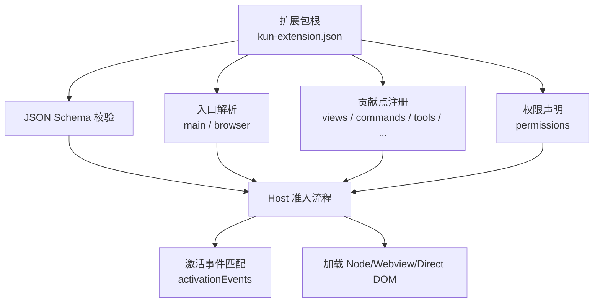
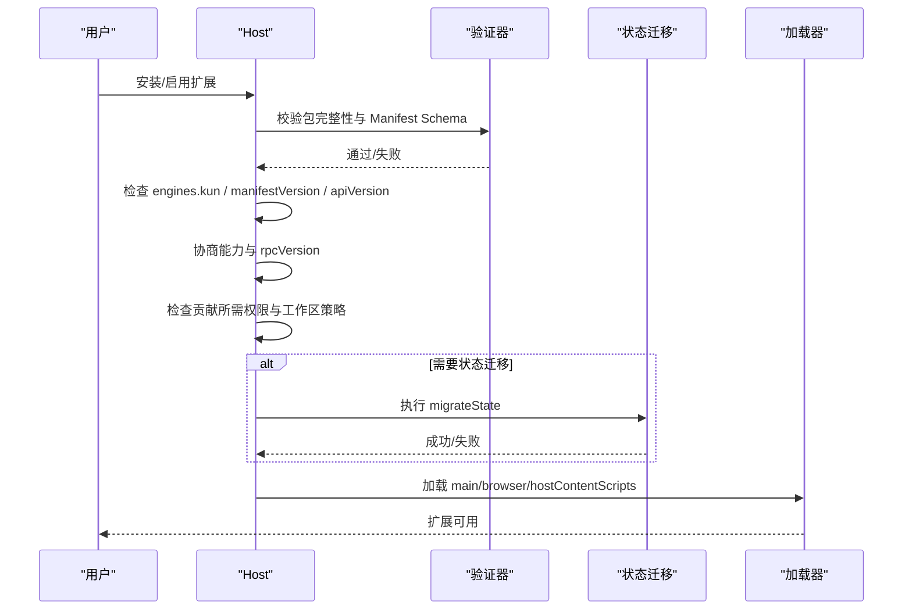
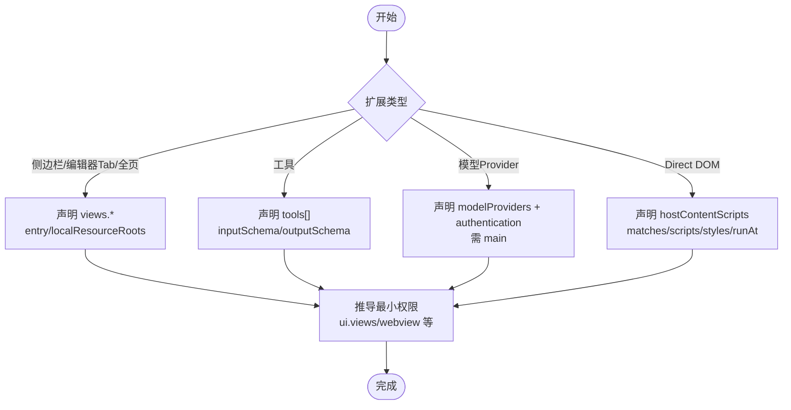
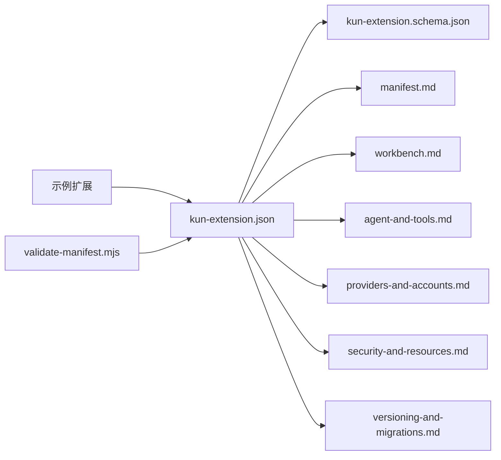

# 扩展清单配置

<cite>
**本文引用的文件**
- [manifest.md](file://docs/extensions/manifest.md)
- [versioning-and-migrations.md](file://docs/extensions/versioning-and-migrations.md)
- [security-and-resources.md](file://docs/extensions/security-and-resources.md)
- [workbench.md](file://docs/extensions/workbench.md)
- [agent-and-tools.md](file://docs/extensions/agent-and-tools.md)
- [providers-and-accounts.md](file://docs/extensions/providers-and-accounts.md)
- [kun-extension.schema.json](file://packages/extension-api/schema/kun-extension.schema.json)
- [hello-sidebar kun-extension.json](file://examples/extensions/hello-sidebar/kun-extension.json)
- [tool-provider kun-extension.json](file://examples/extensions/tool-provider/kun-extension.json)
- [streaming-model-provider kun-extension.json](file://examples/extensions/streaming-model-provider/kun-extension.json)
- [agent-assistant kun-extension.json](file://examples/extensions/agent-assistant/kun-extension.json)
- [direct-dom kun-extension.json](file://examples/extensions/direct-dom/kun-extension.json)
- [workspace-dashboard kun-extension.json](file://examples/extensions/workspace-dashboard/kun-extension.json)
- [validate-manifest.mjs](file://examples/extensions/validate-manifest.mjs)
</cite>

## 目录
1. [简介](#简介)
2. [项目结构](#项目结构)
3. [核心组件](#核心组件)
4. [架构总览](#架构总览)
5. [详细组件分析](#详细组件分析)
6. [依赖关系分析](#依赖关系分析)
7. [性能与配额](#性能与配额)
8. [故障排查指南](#故障排查指南)
9. [结论](#结论)
10. [附录：完整字段参考与示例路径](#附录完整字段参考与示例路径)

## 简介
本文件面向 DeepSeek-GUI 的扩展开发者，系统性说明扩展清单文件 kun-extension.json 的所有配置项、验证规则、权限模型与安全策略，并覆盖侧边栏、工具面板、内容脚本等不同类型扩展的特殊要求。文档同时提供版本兼容性与迁移指南，帮助你在升级 API、Manifest Schema 或状态结构时安全演进。

## 项目结构
- 清单定义与校验：由 JSON Schema 约束，Host 在加载任何扩展代码前进行严格校验。
- 示例扩展：仓库内多个示例展示了不同能力的最小清单写法（侧边栏、工具、Provider、Direct DOM 等）。
- 文档体系：Manifest、工作台、Agent/工具、Provider/账号、安全与资源、版本与迁移等文档共同构成完整规范。

图表来源
- [manifest.md:57-89](file://docs/extensions/manifest.md#L57-L89)
- [kun-extension.schema.json:11-175](file://packages/extension-api/schema/kun-extension.schema.json#L11-L175)

章节来源
- [manifest.md:57-89](file://docs/extensions/manifest.md#L57-L89)
- [kun-extension.schema.json:11-175](file://packages/extension-api/schema/kun-extension.schema.json#L11-L175)

## 核心组件
- 顶层元数据：标识扩展身份、版本、显示文案、主页、许可证、图标、本地化等。
- 引擎与入口：声明 Kun 版本范围；指定 Node Host 入口 main 和 Webview 入口 browser（至少一个）。
- 激活事件：精确控制何时加载扩展代码（onStartup/onView/onCommand/onTool/onProvider/onAuthentication/onAgentProfile）。
- 贡献点：声明 UI、命令、设置、通知、工具、Agent Profile、Provider、认证、Direct DOM 等静态能力。
- 权限：最小化声明 Broker 能力，包含网络、存储、工作区、账号、UI、Webview、Agent、工具、Provider 等。
- 状态版本：stateSchemaVersion 用于持久化状态迁移。

章节来源
- [manifest.md:57-89](file://docs/extensions/manifest.md#L57-L89)
- [manifest.md:143-158](file://docs/extensions/manifest.md#L143-L158)
- [manifest.md:159-209](file://docs/extensions/manifest.md#L159-L209)
- [manifest.md:282-310](file://docs/extensions/manifest.md#L282-L310)
- [kun-extension.schema.json:11-175](file://packages/extension-api/schema/kun-extension.schema.json#L11-L175)

## 架构总览
Kun 在安装/启用扩展时执行严格的准入流程：先校验包完整性与 Manifest Schema，再检查 engines.kun、manifestVersion、apiVersion 支持窗口，协商能力后检查贡献所需权限与工作区策略，必要时执行状态迁移，最后才加载 Node 入口、Webview 或 Direct DOM。

图表来源
- [versioning-and-migrations.md:53-68](file://docs/extensions/versioning-and-migrations.md#L53-L68)
- [manifest.md:131-141](file://docs/extensions/manifest.md#L131-L141)

## 详细组件分析

### 元数据与版本
- 必填字段：manifestVersion、apiVersion、publisher、name、version、engines.kun、activationEvents、contributes、permissions、stateSchemaVersion。
- 可选字段：$schema、displayName、description、icon、localizations、license、homepage、signature。
- 版本维度：package version、manifestVersion、apiVersion、engines.kun、stateSchemaVersion、rpcVersion（私有）。
- 身份不可变：publisher.name 公开后不得更改。

章节来源
- [manifest.md:57-89](file://docs/extensions/manifest.md#L57-L89)
- [manifest.md:117-130](file://docs/extensions/manifest.md#L117-L130)
- [versioning-and-migrations.md:9-22](file://docs/extensions/versioning-and-migrations.md#L9-L22)

### 入口与激活事件
- 入口：main（Node）与 browser（Webview）至少存在一个；必须为规范化相对路径且位于完整性清单允许的资源根内。
- 激活事件：仅当声明的事件触发时才加载代码；每个非 onStartup 事件必须指向真实贡献 ID。

章节来源
- [manifest.md:131-141](file://docs/extensions/manifest.md#L131-L141)
- [manifest.md:143-158](file://docs/extensions/manifest.md#L143-L158)

### 贡献点与特定扩展类型
- 通用贡献：commands、settings、notifications、contextMenus、actions.*、message.resultPreviews。
- View 容器与位置：views.containers、views.leftSidebar、views.rightSidebar、views.auxiliaryPanel、views.editorTab、views.fullPage。
- Agent：agentProfiles（需 agent.run）。
- 工具：tools（需 tools.register），含 inputSchema/outputSchema/sideEffects/idempotent/maxOutputBytes。
- Provider/认证：modelProviders/authentication（需 providers.register，且必须有 Node main）。
- Direct DOM：hostContentScripts（高风险，需 hostDom）。

图表来源
- [manifest.md:159-209](file://docs/extensions/manifest.md#L159-L209)
- [workbench.md:26-44](file://docs/extensions/workbench.md#L26-L44)
- [agent-and-tools.md:149-208](file://docs/extensions/agent-and-tools.md#L149-L208)
- [providers-and-accounts.md:19-28](file://docs/extensions/providers-and-accounts.md#L19-L28)
- [manifest.md:311-316](file://docs/extensions/manifest.md#L311-L316)

章节来源
- [manifest.md:159-209](file://docs/extensions/manifest.md#L159-L209)
- [workbench.md:26-44](file://docs/extensions/workbench.md#L26-L44)
- [agent-and-tools.md:149-208](file://docs/extensions/agent-and-tools.md#L149-L208)
- [providers-and-accounts.md:19-28](file://docs/extensions/providers-and-accounts.md#L19-L28)
- [manifest.md:311-316](file://docs/extensions/manifest.md#L311-L316)

### 权限模型与安全策略
- 最小权限原则：只声明实际需要的权限；新增权限需重新确认。
- 常见权限：commands.register、ui.views、ui.actions、ui.notifications、webview、webview.external、hostDom、agent.run、agent.threads.readOwn、tools.register、providers.register、accounts.read/use/manage/secrets.read、network:*、storage.global/workspace、workspace.read/write。
- 贡献隐含权限：某些贡献自动要求最小权限（如任意 browser 需 webview）。
- 受保护表面：安装/权限变更/凭据输入/外部副作用审批等必须在 Main-owned 受保护窗口中完成。
- 网络 Broker：精确 hostname 授权、DNS/地址白名单、重定向二次校验、生产直连限制。
- 存储：全局/工作区/View 状态与凭据库分离；禁止将秘密写入 state/settings/logs。

章节来源
- [manifest.md:282-310](file://docs/extensions/manifest.md#L282-L310)
- [security-and-resources.md:9-33](file://docs/extensions/security-and-resources.md#L9-L33)
- [security-and-resources.md:34-47](file://docs/extensions/security-and-resources.md#L34-L47)
- [security-and-resources.md:48-59](file://docs/extensions/security-and-resources.md#L48-L59)
- [security-and-resources.md:61-84](file://docs/extensions/security-and-resources.md#L61-L84)
- [security-and-resources.md:96-127](file://docs/extensions/security-and-resources.md#L96-L127)

### 资源与完整性
- 发布包需包含 README.md、LICENSE、kun-extension.integrity.json 及所有被 Manifest 引用资源。
- 完整性清单记录 SHA-256；安装时拒绝未声明/缺失/越界/穿越路径等资源。
- 入口与资源必须位于允许资源根内，不能包含绝对路径或 .. 逃逸。

章节来源
- [manifest.md:317-327](file://docs/extensions/manifest.md#L317-L327)

### 验证与本地化
- 使用 kun extension validate 对开发目录或打包产物进行校验。
- localizations 最多 32 个语言标签，仅覆盖已知显示字段，基础 Manifest 始终为 fallback。

章节来源
- [manifest.md:92-116](file://docs/extensions/manifest.md#L92-L116)
- [manifest.md:328-336](file://docs/extensions/manifest.md#L328-L336)

### 不同类型扩展的配置要点
- 侧边栏/编辑器 Tab/全页 View：
  - 声明 entry、title、icon（可选）、when/order/showInRightRail/multiple/localResourceRoots。
  - 推荐以 views.rightSidebar 作为可发现入口。
- 工具：
  - 声明 inputSchema/outputSchema、sideEffects、idempotent、maxOutputBytes（1 KiB–1 MiB）。
  - 需要 tools.register 与工作区/网络/账号等运行时权限。
- 模型 Provider 与认证：
  - 必须提供 main；声明 modelProviders 与 authentication；需要 providers.register、accounts.*、network:*。
  - credentialHosts 独立于 network 授权；authenticatedFetch 会注入/移除凭据。
- Direct DOM：
  - 高风险；需 hostDom；静态声明 matches/scripts/styles/runAt；隔离世界运行，不暴露页面 JS/Electron/Node。

章节来源
- [workbench.md:46-73](file://docs/extensions/workbench.md#L46-L73)
- [agent-and-tools.md:149-208](file://docs/extensions/agent-and-tools.md#L149-L208)
- [providers-and-accounts.md:30-89](file://docs/extensions/providers-and-accounts.md#L30-L89)
- [manifest.md:311-316](file://docs/extensions/manifest.md#L311-L316)

### 版本兼容与迁移
- 六个版本维度彼此独立：package version、manifestVersion、apiVersion、engines.kun、stateSchemaVersion、rpcVersion。
- 支持窗口：当前 major N 与前一个 N-1；弃用需提前标记并提供替代。
- 状态迁移：仅在 state shape 变化时提高 stateSchemaVersion；迁移失败保留旧状态并回滚。
- Rollback：不会反向调用 forward migration；只有存在兼容快照或显式兼容声明才可降级。

章节来源
- [versioning-and-migrations.md:9-22](file://docs/extensions/versioning-and-migrations.md#L9-L22)
- [versioning-and-migrations.md:36-68](file://docs/extensions/versioning-and-migrations.md#L36-L68)
- [versioning-and-migrations.md:84-135](file://docs/extensions/versioning-and-migrations.md#L84-L135)
- [versioning-and-migrations.md:148-162](file://docs/extensions/versioning-and-migrations.md#L148-L162)

## 依赖关系分析
- 清单与 Schema：kun-extension.json 必须符合 packages/extension-api/schema/kun-extension.schema.json。
- 文档与实现：manifest.md、workbench.md、agent-and-tools.md、providers-and-accounts.md、security-and-resources.md、versioning-and-migrations.md 共同约束行为。
- 示例与校验：examples/extensions/* 下的 kun-extension.json 展示最小实践；validate-manifest.mjs 演示资源存在性校验。

图表来源
- [kun-extension.schema.json:11-175](file://packages/extension-api/schema/kun-extension.schema.json#L11-L175)
- [manifest.md:57-89](file://docs/extensions/manifest.md#L57-L89)
- [validate-manifest.mjs:1-43](file://examples/extensions/validate-manifest.mjs#L1-L43)

章节来源
- [kun-extension.schema.json:11-175](file://packages/extension-api/schema/kun-extension.schema.json#L11-L175)
- [manifest.md:57-89](file://docs/extensions/manifest.md#L57-L89)
- [validate-manifest.mjs:1-43](file://examples/extensions/validate-manifest.mjs#L1-L43)

## 性能与配额
- 默认限额：IPC 消息、激活超时、操作超时、取消宽限、关闭超时、并发上限、流窗口、事件速率、内存上限、日志轮转、状态文档大小、迁移超时、网络请求体等。
- 背压与释放：生产者遵循 ack，队列有 item/bytes 双上限；取消/终止后释放资源；超限熔断仅影响所属扩展。
- 建议：避免无界缓存；使用有界流；幂等取消；合理声明 maxOutputBytes。

章节来源
- [security-and-resources.md:134-157](file://docs/extensions/security-and-resources.md#L134-L157)
- [security-and-resources.md:159-167](file://docs/extensions/security-and-resources.md#L159-L167)

## 故障排查指南
- 使用诊断与日志：
  - kun extension doctor <id>：查看 selected/installed 版本、source/digest/signature、enablement、permission snapshot、Manifest/API/Kun/RPC negotiation、state schema、activation cause、limit failures、last structured error、log location。
  - kun extension logs <id> [--json]：按扩展归因查看 stdout/stderr/lifecycle log。
- 常见问题定位：
  - 权限不足：检查贡献隐含权限与实际运行时权限是否满足。
  - 入口/资源不存在：确保 main/browser/entry/scripts/styles 存在于包内且未被完整性清单排除。
  - 版本不兼容：核对 engines.kun、manifestVersion、apiVersion 支持窗口。
  - 状态迁移失败：检查 from/to 版本、迁移函数确定性、quota 与命名空间。
  - 网络被拒：确认 network:<hostname> 授权与 DNS/地址策略。

章节来源
- [security-and-resources.md:168-195](file://docs/extensions/security-and-resources.md#L168-L195)
- [manifest.md:328-336](file://docs/extensions/manifest.md#L328-L336)
- [versioning-and-migrations.md:116-135](file://docs/extensions/versioning-and-migrations.md#L116-L135)

## 结论
kun-extension.json 是扩展与 Host 之间的契约：它声明身份、能力、权限与资源，并在安装与激活阶段接受严格校验。遵循最小权限、稳定版本、明确迁移与受保护交互的原则，可以构建安全、可维护、可演进的扩展生态。

## 附录：完整字段参考与示例路径

### 顶层字段速查
- $schema：编辑器提示 URL，不参与运行时决策。
- manifestVersion：固定为 1。
- apiVersion：Extension API SemVer。
- publisher/name/version：扩展唯一身份与包版本。
- displayName/description/icon/localizations/license/homepage：显示与元信息。
- engines.kun：允许的 Kun 版本范围。
- main/browser：Node/Webview 入口（至少一个）。
- activationEvents：启动扩展的静态事件列表。
- contributes：静态贡献声明对象。
- permissions：精确字符串权限数组。
- stateSchemaVersion：状态数据结构版本。
- signature：来源证明元数据（present-unverified）。

章节来源
- [manifest.md:57-89](file://docs/extensions/manifest.md#L57-L89)
- [manifest.md:117-130](file://docs/extensions/manifest.md#L117-L130)

### 贡献点速查
- commands：命令注册。
- views.*：各类视图容器与位置。
- actions.*：宿主渲染的操作控件。
- settings：结构化非秘密配置。
- notifications：声明式通知。
- contextMenus：上下文菜单。
- message.resultPreviews：结果预览。
- agentProfiles：Agent profile。
- tools：工具定义。
- modelProviders/authentication：模型 Provider 与认证。
- hostContentScripts：Direct DOM 注入。

章节来源
- [manifest.md:159-209](file://docs/extensions/manifest.md#L159-L209)
- [workbench.md:26-44](file://docs/extensions/workbench.md#L26-L44)

### 权限速查
- UI：commands.register、ui.views、ui.actions、ui.notifications。
- Webview：webview、webview.external。
- 主机 DOM：hostDom。
- Agent：agent.run、agent.threads.readOwn。
- 工具：tools.register。
- Provider：providers.register、accounts.read/use/manage/secrets.read。
- 网络：network:<hostname> 或 network:*.example.com。
- 存储：storage.global、storage.workspace。
- 工作区：workspace.read、workspace.write。

章节来源
- [manifest.md:282-310](file://docs/extensions/manifest.md#L282-L310)

### 示例清单路径
- 最小侧边栏：[hello-sidebar kun-extension.json](file://examples/extensions/hello-sidebar/kun-extension.json)
- 工具提供者：[tool-provider kun-extension.json](file://examples/extensions/tool-provider/kun-extension.json)
- 流式模型 Provider：[streaming-model-provider kun-extension.json](file://examples/extensions/streaming-model-provider/kun-extension.json)
- Agent 助手：[agent-assistant kun-extension.json](file://examples/extensions/agent-assistant/kun-extension.json)
- Direct DOM：[direct-dom kun-extension.json](file://examples/extensions/direct-dom/kun-extension.json)
- 工作区仪表盘：[workspace-dashboard kun-extension.json](file://examples/extensions/workspace-dashboard/kun-extension.json)

章节来源
- [hello-sidebar kun-extension.json:1-34](file://examples/extensions/hello-sidebar/kun-extension.json#L1-L34)
- [tool-provider kun-extension.json:1-55](file://examples/extensions/tool-provider/kun-extension.json#L1-L55)
- [streaming-model-provider kun-extension.json:1-98](file://examples/extensions/streaming-model-provider/kun-extension.json#L1-L98)
- [agent-assistant kun-extension.json:1-54](file://examples/extensions/agent-assistant/kun-extension.json#L1-L54)
- [direct-dom kun-extension.json:1-34](file://examples/extensions/direct-dom/kun-extension.json#L1-L34)
- [workspace-dashboard kun-extension.json:1-46](file://examples/extensions/workspace-dashboard/kun-extension.json#L1-L46)

### 验证与本地化工具
- 清单验证：kun extension validate . 或 kun extension validate ./dist/<包>.kunx。
- 资源存在性校验脚本：[validate-manifest.mjs](file://examples/extensions/validate-manifest.mjs)

章节来源
- [manifest.md:328-336](file://docs/extensions/manifest.md#L328-L336)
- [validate-manifest.mjs:1-43](file://examples/extensions/validate-manifest.mjs#L1-L43)