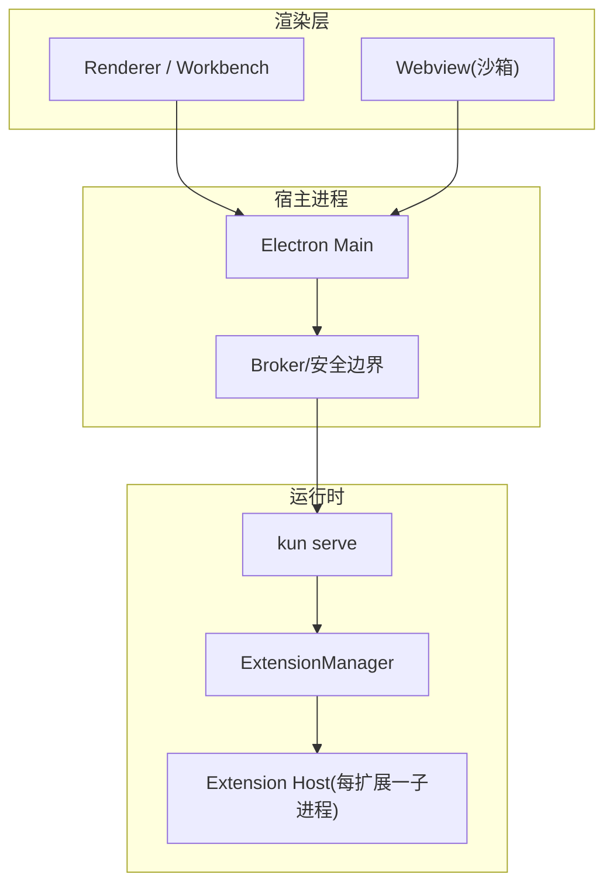
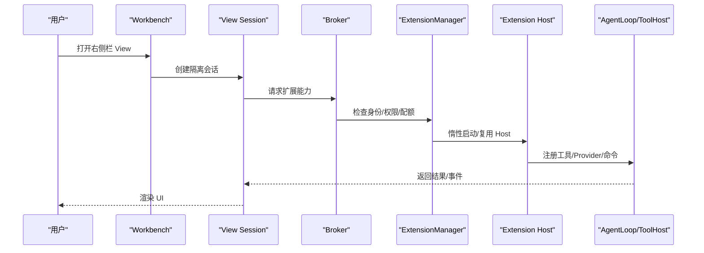
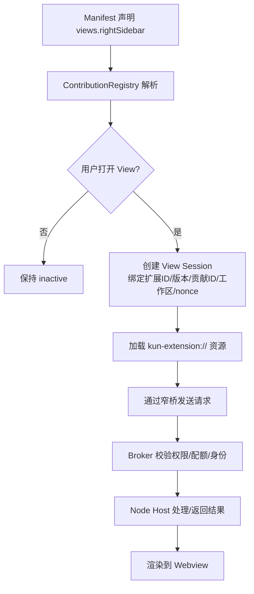
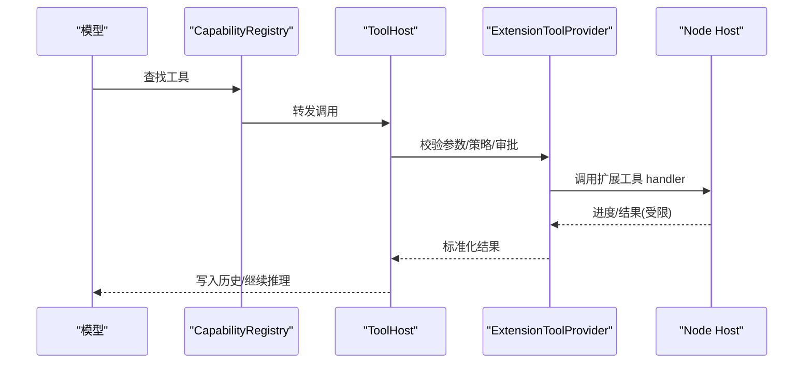
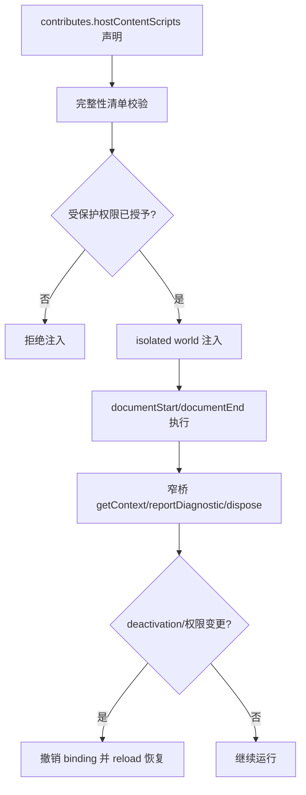
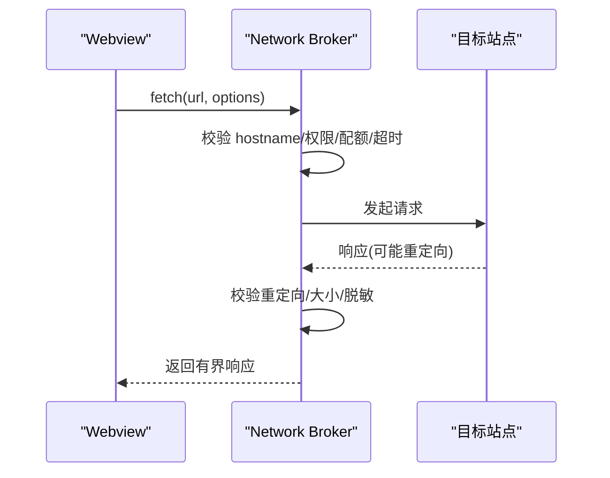
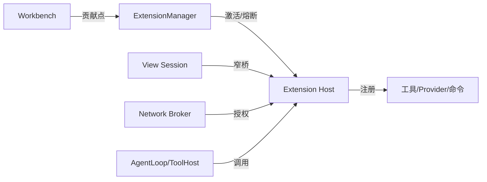

# 扩展类型和架构

<cite>
**本文引用的文件**
- [architecture.md](file://docs/extensions/architecture.md)
- [manifest.md](file://docs/extensions/manifest.md)
- [lifecycle.md](file://docs/extensions/lifecycle.md)
- [api-reference.md](file://docs/extensions/api-reference.md)
- [workbench.md](file://docs/extensions/workbench.md)
- [webview-and-dom.md](file://docs/extensions/webview-and-dom.md)
- [agent-and-tools.md](file://docs/extensions/agent-and-tools.md)
- [hello-sidebar/kun-extension.json](file://examples/extensions/hello-sidebar/kun-extension.json)
- [tool-provider/kun-extension.json](file://examples/extensions/tool-provider/kun-extension.json)
- [social-media-sidebar/kun-extension.json](file://examples/extensions/social-media-sidebar/kun-extension.json)
</cite>

## 目录
1. [简介](#简介)
2. [项目结构](#项目结构)
3. [核心组件](#核心组件)
4. [架构总览](#架构总览)
5. [详细组件分析](#详细组件分析)
6. [依赖关系分析](#依赖关系分析)
7. [性能与资源约束](#性能与资源约束)
8. [故障排查指南](#故障排查指南)
9. [结论](#结论)
10. [附录：复杂扩展案例](#附录复杂扩展案例)

## 简介
本文件系统性介绍 DeepSeek-GUI（Kun）扩展系统的扩展类型、生命周期、通信机制与数据流，重点覆盖侧边栏扩展、工具面板、内容脚本、协议处理器等扩展形态。文档基于官方扩展文档与示例工程，提供架构图、类图与时序图，帮助开发者理解整体设计与最佳实践。

## 项目结构
- 扩展文档位于 docs/extensions，涵盖架构、清单、生命周期、API、工作台贡献、Webview/Direct DOM、Agent 与工具等主题。
- 扩展示例位于 examples/extensions，包含最小侧边栏、工具提供者、社交媒体侧边栏等可运行样例。
- 运行时由 Electron Main + kun serve 组成，ExtensionManager 统一管理扩展的注册、激活、权限、熔断与日志。

图表来源
- [architecture.md:11-29](file://docs/extensions/architecture.md#L11-L29)

章节来源
- [architecture.md:11-29](file://docs/extensions/architecture.md#L11-L29)
- [manifest.md:131-141](file://docs/extensions/manifest.md#L131-L141)

## 核心组件
- ExtensionManager：负责扩展发现、版本选择、权限快照、惰性激活、并发/速率/内存限制、崩溃退避与熔断、状态与日志。
- Broker：每次调用重新校验扩展身份、工作区信任、权限、配额与审批；Node 直连 OS 能力需通过 Manifest 披露与审计。
- View Session：每个复杂 UI 拥有独立会话，绑定扩展 ID、版本、贡献 ID、工作区、WebContents 与不可猜 nonce。
- Agent/Tool/Provider：所有 Agent Run、工具调用、模型 Provider 均经过唯一 kun serve 的 AgentLoop、ToolHost、EventBus 与 ApprovalGate。

章节来源
- [architecture.md:44-68](file://docs/extensions/architecture.md#L44-L68)
- [lifecycle.md:8-26](file://docs/extensions/lifecycle.md#L8-L26)
- [agent-and-tools.md:7-18](file://docs/extensions/agent-and-tools.md#L7-L18)

## 架构总览
扩展系统遵循“单一 Agent runtime”不变量：扩展不创建第二套 Agent 循环，仅通过公开 Host Context 与 Broker 访问能力。执行位置按风险与能力划分：
- main：Node 子进程，适合工具、Provider、认证处理器、Agent、后台命令。
- browser/Webview：独立 Chromium Webview，适合复杂侧栏、编辑区、面板 UI。
- 声明式贡献：在宿主 React 树中渲染命令按钮、菜单、设置、通知。
- hostContentScripts：插件专属 isolated world，仅在必须直接读写宿主 DOM 时使用，高风险且不稳定。

图表来源
- [architecture.md:70-89](file://docs/extensions/architecture.md#L70-L89)
- [lifecycle.md:81-90](file://docs/extensions/lifecycle.md#L81-L90)

章节来源
- [architecture.md:33-68](file://docs/extensions/architecture.md#L33-L68)
- [lifecycle.md:81-104](file://docs/extensions/lifecycle.md#L81-L104)

## 详细组件分析

### 侧边栏扩展（Webview）
- 特点：使用宿主创建的沙箱 Webview，具备稳定 bridge、主题与状态契约；可通过 externalBrowser 承载经授权的远程站点。
- 使用场景：复杂列表、图表、表单、仪表盘；需要与主 Agent 协作时，应通过工具暴露能力，而非共享私有状态。
- 生命周期：每次打开创建独立 View Session；关闭/切换工作区/disable/uninstall/guest crash 会取消待处理调用并释放资源。
- 通信机制：窄桥只暴露 request/response、host message、command invocation、event subscription/disposal、theme/locale/view state 等高层 API；网络必须走 Network Broker。
- 数据流：Manifest 静态贡献 -> ContributionRegistry -> 用户打开 View -> 受保护会话创建 -> Webview preload bridge -> Guest 请求 -> Electron sender/session 校验 -> Kun Broker -> Node Host。

图表来源
- [workbench.md:46-73](file://docs/extensions/workbench.md#L46-L73)
- [webview-and-dom.md:19-63](file://docs/extensions/webview-and-dom.md#L19-L63)
- [architecture.md:70-82](file://docs/extensions/architecture.md#L70-L82)

章节来源
- [workbench.md:26-73](file://docs/extensions/workbench.md#L26-L73)
- [webview-and-dom.md:19-93](file://docs/extensions/webview-and-dom.md#L19-L93)
- [manifest.md:163-188](file://docs/extensions/manifest.md#L163-L188)

### 工具面板（Tools）
- 特点：通过 Manifest 声明工具定义（id、description、inputSchema/outputSchema、sideEffects、idempotent、maxOutputBytes），并在 activate 中注册 handler。
- 使用场景：为 Agent 或命令提供可被调用的能力；支持进度上报、取消、输出上限与幂等性声明。
- 生命周期：onTool:<id> 触发激活；工具 Catalog 在 thread/epoch 边界固定，避免插件启停造成模型前缀漂移。
- 通信机制：模型工具调用 -> CapabilityRegistry -> ToolHost -> ExtensionToolProvider -> 拥有者 Node Host handler -> 规范化结果。
- 数据流：参数/审批/授权/取消/输出上限/历史顺序均由 Kun 控制；结果受 Schema 与大小限制。

图表来源
- [agent-and-tools.md:149-224](file://docs/extensions/agent-and-tools.md#L149-L224)
- [manifest.md:238-274](file://docs/extensions/manifest.md#L238-L274)

章节来源
- [agent-and-tools.md:149-224](file://docs/extensions/agent-and-tools.md#L149-L224)
- [manifest.md:238-274](file://docs/extensions/manifest.md#L238-L274)

### 内容脚本（Direct DOM / hostContentScripts）
- 特点：在插件专属 isolated world 注入，可读取/修改可见 DOM，但无法访问页面 JS 对象、React internals、Electron、Node、window.kunGui 或受保护 surface。
- 使用场景：极少数必须直接操作宿主 DOM 的场景；属于高风险能力，选择器与样式无 SemVer 保证。
- 生命周期：runAt 精确定义 documentStart/documentEnd；deactivation 时撤销 binding 并 reload 当前工作台文档以恢复干净表面。
- 通信机制：窄 content-script bridge 仅提供 getContext/reportDiagnostic/dispose；Main 校验 sender/binding/extension/version/workspace scope/lifecycle。
- 数据流：Manifest 静态声明 scripts/styles/matches/runAt -> 安装验证完整性 -> 受保护权限确认 -> 注入 isolated world -> 受限通信。

图表来源
- [webview-and-dom.md:192-230](file://docs/extensions/webview-and-dom.md#L192-L230)
- [webview-and-dom.md:274-289](file://docs/extensions/webview-and-dom.md#L274-L289)

章节来源
- [webview-and-dom.md:192-230](file://docs/extensions/webview-and-dom.md#L192-L230)
- [webview-and-dom.md:274-289](file://docs/extensions/webview-and-dom.md#L274-L289)

### 协议处理器（Network Broker / External Browser）
- 特点：View 的网络请求必须通过 Network Broker，按 hostname 精确授权；externalBrowser 可在隔离子 Webview 中显示经授权的远程 HTTPS 网站。
- 使用场景：需要在侧栏浏览特定远程站点；或扩展通过 Broker 发起受限网络访问。
- 生命周期：首次启用需用户接受权限；导航/重定向/弹窗严格匹配授权主机名；会话数据按扩展 ID 隔离。
- 通信机制：Manifest 声明 network:<hostname> -> 用户授权 -> View 调用 framework-neutral network API -> Broker 校验 scheme/host/account/scope/size/redirect/timeout/quota -> 返回有界响应。
- 数据流：外部站点不加载 Kun preload，不能访问 window.kunExtension/Node/Electron；顶层导航/子资源受控。

图表来源
- [webview-and-dom.md:176-186](file://docs/extensions/webview-and-dom.md#L176-L186)
- [webview-and-dom.md:162-174](file://docs/extensions/webview-and-dom.md#L162-L174)

章节来源
- [webview-and-dom.md:162-186](file://docs/extensions/webview-and-dom.md#L162-L186)

### 认证处理器（Authentication Providers）
- 特点：通过 Manifest 声明 authentication contribution，配合 accounts.* 权限完成账号创建、认证流程与受保护 secret reveal。
- 使用场景：OAuth、企业登录、平台密钥管理等需要受保护交互的流程。
- 生命周期：onAuthentication:<id> 触发；headless 路径返回 interaction-required 或 gated，不得自动批准。
- 通信机制：通过 Broker 与受保护 surface 交互；token/secret 不进入普通 settings 或 View 存储。
- 数据流：用户真实确认后生成短时单次 consent token，绑定 operation kind/parameter digest/workspace/window session/expiry；消费后失效。

章节来源
- [manifest.md:143-157](file://docs/extensions/manifest.md#L143-L157)
- [lifecycle.md:133-141](file://docs/extensions/lifecycle.md#L133-L141)
- [webview-and-dom.md:254-273](file://docs/extensions/webview-and-dom.md#L254-L273)

### 扩展间协作模式与最佳实践
- 协作模式：
  - 侧边栏与主 Agent：侧边栏通过工具暴露能力，主 Agent 通过工具读取/修改权威状态；两者不共享私有状态或 runtime token。
  - 工具与 Provider：工具调用外部服务或本地进程；Provider 归一化模型请求并路由至 Node Host。
  - Webview 与 Direct DOM：优先使用 Webview；仅在必须直接操作宿主 DOM 时使用 Direct DOM，并做好容错与降级。
- 最佳实践：
  - 让 activate 快速、确定、可重复诊断；注册全部静态能力后再启动可取消后台任务。
  - 用 context.subscriptions 管理资源；对 cancel/dispose 做幂等处理。
  - 不在模块顶层读取秘密或工作区；不缓存超出调用生命周期的 account secret。
  - 给 stream 处理 backpressure，不创建无界数组/队列。
  - 对 interaction-required、permission-revoked、circuit-open 做可操作错误提示。

章节来源
- [workbench.md:73-73](file://docs/extensions/workbench.md#L73-L73)
- [lifecycle.md:161-170](file://docs/extensions/lifecycle.md#L161-L170)

## 依赖关系分析
- 低耦合高内聚：ExtensionManager 集中管理生命周期与资源；各扩展通过 Manifest 声明能力，按需激活。
- 明确边界：Webview 与 Node Host 通过窄桥通信；Direct DOM 与受保护 surface 严格隔离；网络请求统一经 Broker。
- 稳定性保障：工具 Catalog 在 epoch 边界固定；View Session 绑定不可猜 nonce；权限每次调用重新校验。

图表来源
- [architecture.md:44-68](file://docs/extensions/architecture.md#L44-L68)
- [agent-and-tools.md:209-224](file://docs/extensions/agent-and-tools.md#L209-L224)

章节来源
- [architecture.md:44-68](file://docs/extensions/architecture.md#L44-L68)
- [agent-and-tools.md:209-224](file://docs/extensions/agent-and-tools.md#L209-L224)

## 性能与资源约束
- 激活时限：默认 activation deadline 15 秒；超过限额整个尝试失败。
- 视图空闲策略：仅当所有 activation event 都是 onView:* 且无后台贡献时，才允许按 idle policy 停止；默认宽限期 30 秒。
- 消息与流限制：事件通道有 bounded/replayable 特性；订阅者有队列、消息大小与速率上限；lagging subscriber 可重放。
- 输出上限：工具 outputSchema 与 maxOutputBytes 限制结果大小；超大结果会被截断、外化或拒绝。
- 熔断机制：连续 3 次不健康启动/崩溃后 circuit open；重启使用有界退避，不会自动重放可能有副作用的调用。

章节来源
- [lifecycle.md:81-90](file://docs/extensions/lifecycle.md#L81-L90)
- [lifecycle.md:118-131](file://docs/extensions/lifecycle.md#L118-L131)
- [agent-and-tools.md:97-119](file://docs/extensions/agent-and-tools.md#L97-L119)
- [agent-and-tools.md:149-207](file://docs/extensions/agent-and-tools.md#L149-L207)
- [lifecycle.md:143-155](file://docs/extensions/lifecycle.md#L143-L155)

## 故障排查指南
- 使用 CLI 诊断：kun extension doctor <id> 检查贡献注册、缺失权限、无效 entry 和布局故障；kun extension logs <id> 查看已脱敏的诊断。
- 常见错误：
  - 权限不足：Broker 拒绝新调用；UI 可能同时收起，stale invocation 仍被拒绝。
  - 视图崩溃：仅销毁该 View Session 并显示扩展归因 recovery placeholder，不影响主 renderer。
  - 工具调用失败：参数错误、Schema 不匹配、输出超限、未知 outcome（可能已产生外部副作用）。
  - 网络请求失败：未声明 network 权限、重定向到未授权站点、超时或配额耗尽。
- 清理与恢复：disable/uninstall 会 dispose session、pending calls 和 subscriptions；卸载后默认保留 extension data。

章节来源
- [workbench.md:246-251](file://docs/extensions/workbench.md#L246-L251)
- [lifecycle.md:143-155](file://docs/extensions/lifecycle.md#L143-L155)
- [agent-and-tools.md:226-237](file://docs/extensions/agent-and-tools.md#L226-L237)

## 结论
DeepSeek-GUI 扩展系统以“单一 Agent runtime”为核心，通过严格的权限、配额与安全边界，将侧边栏、工具、内容脚本与协议处理器等扩展类型有机整合。开发者应优先使用声明式贡献与 Webview，谨慎使用 Direct DOM；通过工具与 Provider 暴露能力，确保跨扩展协作的安全性与稳定性。借助 ExtensionManager 的生命周期管理与熔断机制，扩展可在 GUI、serve 与 exec 环境下保持一致语义。

## 附录：复杂扩展案例

### 案例一：最小侧边栏（hello-sidebar）
- 说明：仅浏览器入口，通过 onStartup/onView 激活；右侧栏图标直达独立标签与隔离 Webview。
- 关键点：localResourceRoots 限定资源访问；permissions 仅 ui.views 与 webview。

章节来源
- [hello-sidebar/kun-extension.json:1-34](file://examples/extensions/hello-sidebar/kun-extension.json#L1-L34)

### 案例二：工作区工具提供者（tool-provider）
- 说明：headless 扩展，注册工具 workspace-summary；输入输出均有 Schema；声明 sideEffects 与 idempotent。
- 关键点：onTool 激活；tools.register 与 workspace.read 权限；maxOutputBytes 限制输出。

章节来源
- [tool-provider/kun-extension.json:1-55](file://examples/extensions/tool-provider/kun-extension.json#L1-L55)

### 案例三：社交媒体侧边栏（social-media-sidebar）
- 说明：右侧栏集成 externalBrowser，展示抖音、哔哩哔哩、小红书；每个站点需显式 network 授权。
- 关键点：webview.external 与多域名 network 权限；localizations 提供中文覆盖；icon/order 提升可发现性。

章节来源
- [social-media-sidebar/kun-extension.json:1-83](file://examples/extensions/social-media-sidebar/kun-extension.json#L1-L83)