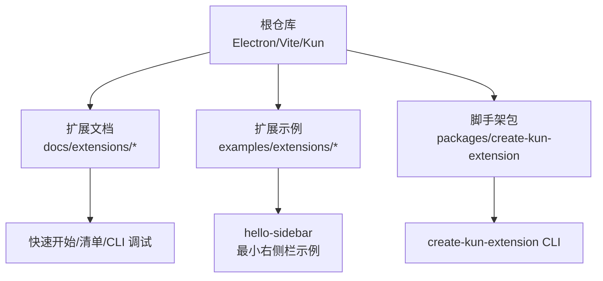
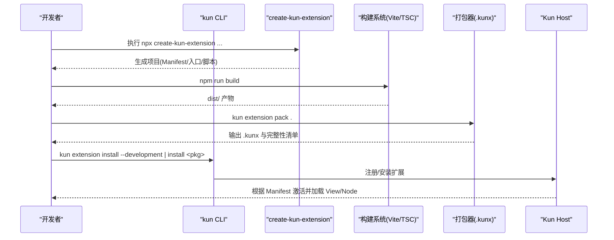
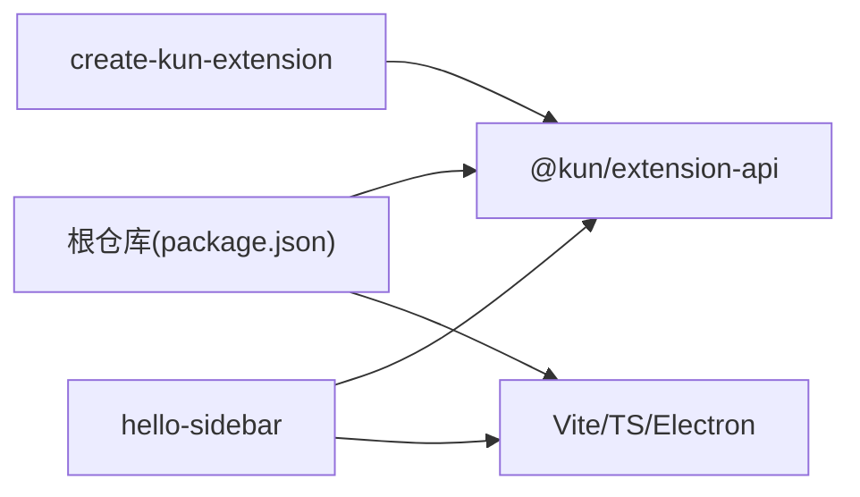

# 环境搭建和项目初始化

<cite>
**本文引用的文件**
- [package.json](file://package.json)
- [docs/DEVELOPMENT.md](file://docs/DEVELOPMENT.md)
- [docs/extensions/quick-start.md](file://docs/extensions/quick-start.md)
- [docs/extensions/manifest.md](file://docs/extensions/manifest.md)
- [docs/extensions/cli-testing-debugging.md](file://docs/extensions/cli-testing-debugging.md)
- [packages/create-kun-extension/package.json](file://packages/create-kun-extension/package.json)
- [examples/extensions/hello-sidebar/kun-extension.json](file://examples/extensions/hello-sidebar/kun-extension.json)
- [examples/extensions/hello-sidebar/package.json](file://examples/extensions/hello-sidebar/package.json)
</cite>

## 目录
1. [简介](#简介)
2. [项目结构](#项目结构)
3. [核心组件](#核心组件)
4. [架构总览](#架构总览)
5. [详细组件分析](#详细组件分析)
6. [依赖关系分析](#依赖关系分析)
7. [性能注意事项](#性能注意事项)
8. [故障排查指南](#故障排查指南)
9. [结论](#结论)
10. [附录](#附录)

## 简介
本指南面向 DeepSeek-GUI（Kun）扩展开发者，提供从零开始的环境准备、工具安装、模板创建、配置文件与基础代码框架的完整步骤。文档覆盖 Node.js 版本要求、依赖安装、命令行操作、最佳实践、常见问题与调试技巧，并区分“独立扩展项目”和“在 Kun 仓库内开发”两种模式。

## 项目结构
- 根仓库是 Electron + Vite 的桌面应用工程，用于运行 Kun GUI 与内置扩展生态。
- 扩展开发主要围绕 docs/extensions 下的官方文档、examples/extensions 中的示例扩展，以及 packages/create-kun-extension 提供的脚手架工具。
- 典型扩展项目由 kun-extension.json（Manifest）、package.json、构建配置（如 vite.config.ts）、宿主入口（Node 侧）与 Webview 入口组成。

图表来源
- [docs/extensions/quick-start.md:1-193](file://docs/extensions/quick-start.md#L1-L193)
- [examples/extensions/hello-sidebar/kun-extension.json:1-34](file://examples/extensions/hello-sidebar/kun-extension.json#L1-L34)
- [packages/create-kun-extension/package.json:1-27](file://packages/create-kun-extension/package.json#L1-L27)

章节来源
- [package.json:1-197](file://package.json#L1-L197)
- [docs/DEVELOPMENT.md:1-174](file://docs/DEVELOPMENT.md#L1-L174)

## 核心组件
- 脚手架 create-kun-extension：生成最小权限 Manifest、宿主/Webview 入口、构建与测试脚本、文档链接等。
- 扩展清单 kun-extension.json：声明 API 版本、引擎兼容、激活事件、贡献点、权限、状态 Schema 版本等。
- 示例 hello-sidebar：一个可运行的右侧栏 Webview 扩展，演示主题、本地化、消息通信与状态持久化的最小用法。
- CLI 命令集：validate/pack/install/reload/doctor/logs 等，贯穿开发到发布的全流程。

章节来源
- [packages/create-kun-extension/package.json:1-27](file://packages/create-kun-extension/package.json#L1-L27)
- [docs/extensions/manifest.md:1-336](file://docs/extensions/manifest.md#L1-L336)
- [examples/extensions/hello-sidebar/kun-extension.json:1-34](file://examples/extensions/hello-sidebar/kun-extension.json#L1-L34)
- [docs/extensions/cli-testing-debugging.md:1-329](file://docs/extensions/cli-testing-debugging.md#L1-L329)

## 架构总览
下图展示了扩展从脚手架到运行时的关键路径：脚手架生成项目 → 构建产物 → 通过 CLI 验证/打包 → 安装到 Kun → 由 Host 根据 Manifest 激活并加载 Webview/Node 入口。

图表来源
- [docs/extensions/quick-start.md:26-70](file://docs/extensions/quick-start.md#L26-L70)
- [docs/extensions/cli-testing-debugging.md:83-108](file://docs/extensions/cli-testing-debugging.md#L83-L108)
- [docs/extensions/manifest.md:131-157](file://docs/extensions/manifest.md#L131-L157)

## 详细组件分析

### 环境准备与 Node.js 版本
- 根仓库要求 Node.js 版本不低于指定版本；脚手架包自身要求 Node.js 不低于其 engines 声明的版本。
- 推荐先确认本机 Node/npm 版本满足要求后再进行后续安装与构建。

章节来源
- [package.json:6-8](file://package.json#L6-L8)
- [packages/create-kun-extension/package.json:22-24](file://packages/create-kun-extension/package.json#L22-L24)

### 依赖安装与工具链
- 使用 npm 工作区管理依赖；根仓库提供 dev/build/test/pack 等脚本。
- 扩展开发常用工具：
  - create-kun-extension：通过 npx 调用，无需全局安装。
  - kun CLI：来自 Kun 安装，用于 validate/pack/install/reload/doctor/logs 等。

章节来源
- [package.json:11-88](file://package.json#L11-L88)
- [docs/extensions/quick-start.md:9-24](file://docs/extensions/quick-start.md#L9-L24)
- [docs/extensions/cli-testing-debugging.md:9-33](file://docs/extensions/cli-testing-debugging.md#L9-L33)

### 从模板创建新扩展项目
- 推荐使用脚手架创建独立扩展项目，选择 node/webview/react 模板之一。
- 脚手架会生成：
  - kun-extension.json（最小权限 Manifest）
  - package.json（scripts/typecheck/validate/pack）
  - tsconfig.host.json / tsconfig.webview.json（按需）
  - vite.config.ts（按模板）
  - README/LICENCE 等基础文件

章节来源
- [docs/extensions/quick-start.md:26-70](file://docs/extensions/quick-start.md#L26-L70)
- [docs/extensions/cli-testing-debugging.md:35-60](file://docs/extensions/cli-testing-debugging.md#L35-L60)
- [examples/extensions/hello-sidebar/package.json:1-21](file://examples/extensions/hello-sidebar/package.json#L1-L21)

### 目录结构与配置文件
- 最小 Manifest 关键字段包括：manifestVersion、apiVersion、publisher、name、version、engines.kun、main/browser、activationEvents、contributes、permissions、stateSchemaVersion。
- 示例 hello-sidebar 展示了右侧栏 View 的最小配置与资源根声明。

章节来源
- [docs/extensions/manifest.md:9-88](file://docs/extensions/manifest.md#L9-L88)
- [examples/extensions/hello-sidebar/kun-extension.json:1-34](file://examples/extensions/hello-sidebar/kun-extension.json#L1-L34)

### 基础代码框架
- Node 宿主入口导出 activate(context)，将注册的 Disposable 加入 context.subscriptions；可选 deactivate()。
- Webview 入口为 HTML，通过桥接与 Host 通信；React 模板提供官方 Hooks 获取主题、语言、状态与消息。
- 不要直接导入 Kun 源码或私有接口，遵循 Extension API v1 公开能力。

章节来源
- [docs/extensions/quick-start.md:115-143](file://docs/extensions/quick-start.md#L115-L143)
- [docs/extensions/manifest.md:131-142](file://docs/extensions/manifest.md#L131-L142)

### 构建、验证与测试
- 构建：npm run build（Vite/TSC 产出 dist）。
- 验证：npm run validate 或 kun extension validate .，检查 Manifest/权限/入口/兼容性等。
- 测试：npm test；可使用 @kun/extension-test 提供的确定性测试夹具。

章节来源
- [examples/extensions/hello-sidebar/package.json:7-12](file://examples/extensions/hello-sidebar/package.json#L7-L12)
- [docs/extensions/cli-testing-debugging.md:62-81](file://docs/extensions/cli-testing-debugging.md#L62-L81)
- [docs/extensions/cli-testing-debugging.md:190-226](file://docs/extensions/cli-testing-debugging.md#L190-L226)

### 开发模式与生产模式
- 开发模式：
  - 使用 kun extension install --development 指向本地目录，不复制代码，不自动 reload。
  - 每次重新构建后需显式执行 reload。
- 生产模式：
  - 使用 kun extension pack 生成 .kunx，再 install 安装包。
  - 安装前会在受保护窗口显示来源、ID、版本、签名等信息，确认后原子安装。

章节来源
- [docs/extensions/quick-start.md:154-175](file://docs/extensions/quick-start.md#L154-L175)
- [docs/extensions/cli-testing-debugging.md:93-110](file://docs/extensions/cli-testing-debugging.md#L93-L110)

### 不同开发模式下的初始化流程
- 独立扩展项目（推荐）：
  - 使用 npx create-kun-extension 创建项目 → npm install → npm run build → npm run validate → 开发加载或打包安装。
- 在 Kun 仓库内开发（基于示例）：
  - 参考 examples/extensions/hello-sidebar 的结构与 scripts，复用仓库内的 kun CLI 包装脚本进行 validate/pack。

章节来源
- [docs/extensions/quick-start.md:26-70](file://docs/extensions/quick-start.md#L26-L70)
- [examples/extensions/hello-sidebar/package.json:7-12](file://examples/extensions/hello-sidebar/package.json#L7-L12)

## 依赖关系分析
- 根仓库依赖 Electron、Vite、TypeScript、测试与构建工具；扩展 SDK 通过 @kun/extension-api 暴露稳定能力。
- 脚手架 create-kun-extension 依赖 @kun/extension-api 以生成与校验 Manifest。
- 示例扩展依赖 @kun/extension-api 与构建工具（Vite/TS）。

图表来源
- [package.json:90-181](file://package.json#L90-L181)
- [packages/create-kun-extension/package.json:18-20](file://packages/create-kun-extension/package.json#L18-L20)
- [examples/extensions/hello-sidebar/package.json:13-18](file://examples/extensions/hello-sidebar/package.json#L13-L18)

章节来源
- [package.json:90-181](file://package.json#L90-L181)
- [packages/create-kun-extension/package.json:18-20](file://packages/create-kun-extension/package.json#L18-L20)
- [examples/extensions/hello-sidebar/package.json:13-18](file://examples/extensions/hello-sidebar/package.json#L13-L18)

## 性能注意事项
- 仅声明最小权限与必要贡献，避免不必要的激活与资源加载。
- 合理划分 Node 与 Webview 职责，减少跨进程通信开销。
- 使用构建优化（如分包、Tree-shaking）减小包体积，提升安装与加载速度。
- 在 CI 中执行 typecheck/build/test/validate/pack，尽早发现性能与体积问题。

[本节为通用建议，不直接分析具体文件]

## 故障排查指南
- 版本与环境问题：
  - 确认 Node.js 版本满足根仓库与脚手架要求。
  - 确认 kun CLI 来自 Kun 安装，而非 npm 上无 scope 的同名包。
- 验证失败：
  - 使用 kun extension validate . 查看结构化诊断，修复 Manifest/权限/入口/兼容性错误。
- 开发加载问题：
  - 确保每次构建后执行 reload；检查 doctor 输出的健康信息。
- 日志与诊断：
  - 使用 kun extension logs 查看扩展日志；使用 doctor 检查激活、权限、会话与限制。
- 常见错误码：
  - 关注 VALIDATION_FAILED、INCOMPATIBLE_API、ACTIVATION_FAILED、PERMISSION_DENIED 等稳定错误码，依据 code 与 details 定位问题。

章节来源
- [docs/extensions/quick-start.md:17-24](file://docs/extensions/quick-start.md#L17-L24)
- [docs/extensions/cli-testing-debugging.md:62-81](file://docs/extensions/cli-testing-debugging.md#L62-L81)
- [docs/extensions/cli-testing-debugging.md:133-160](file://docs/extensions/cli-testing-debugging.md#L133-L160)
- [docs/extensions/cli-testing-debugging.md:174-188](file://docs/extensions/cli-testing-debugging.md#L174-L188)

## 结论
通过本指南，你可以完成 DeepSeek-GUI 扩展的环境准备、项目初始化、构建验证、开发与打包全流程。建议始终遵循最小权限原则、使用脚手架与 CLI 的标准流程，并在 CI 中固化类型检查、构建、测试与验证步骤，以保证扩展质量与可维护性。

[本节为总结，不直接分析具体文件]

## 附录

### 常用命令速查
- 创建扩展：npx create-kun-extension <name> --template <node|webview|react> --publisher <id> --name <name>
- 构建：npm run build
- 验证：npm run validate 或 kun extension validate .
- 开发加载：kun extension install --development <path>
- 重新加载：kun extension reload <ext-id>
- 打包：npm run pack 或 kun extension pack .
- 安装：kun extension install <pkg.kunx>
- 诊断：kun extension doctor <ext-id>
- 日志：kun extension logs <ext-id>

章节来源
- [docs/extensions/quick-start.md:26-70](file://docs/extensions/quick-start.md#L26-L70)
- [docs/extensions/cli-testing-debugging.md:35-60](file://docs/extensions/cli-testing-debugging.md#L35-L60)
- [docs/extensions/cli-testing-debugging.md:83-110](file://docs/extensions/cli-testing-debugging.md#L83-L110)
- [docs/extensions/cli-testing-debugging.md:133-160](file://docs/extensions/cli-testing-debugging.md#L133-L160)