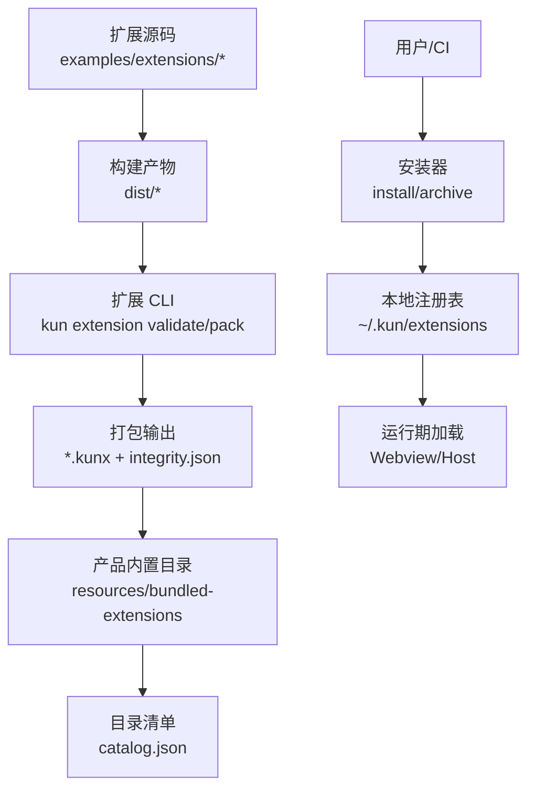
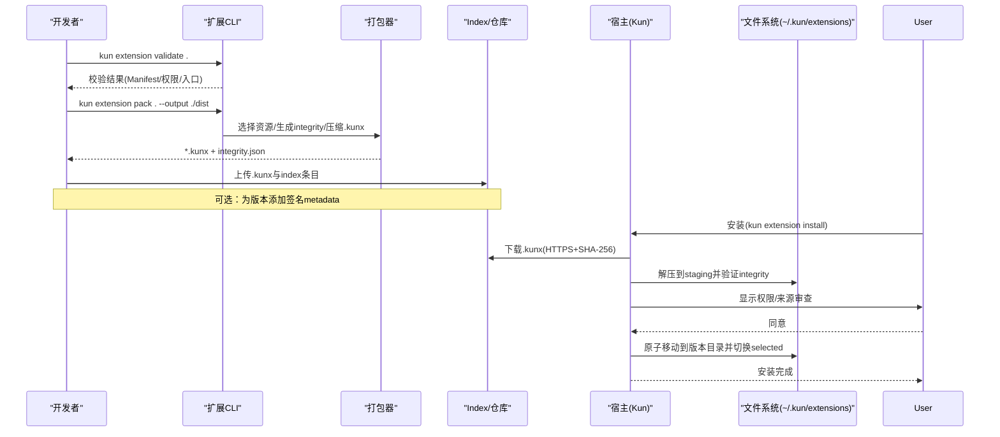
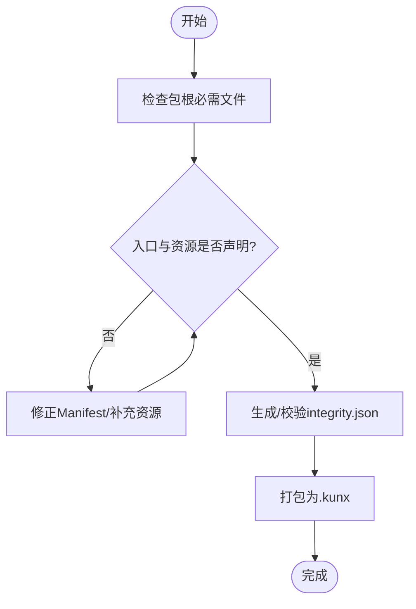
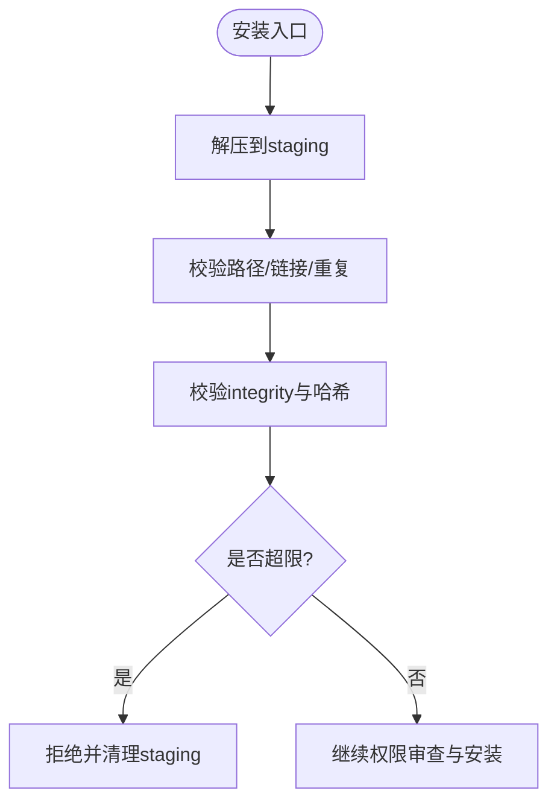
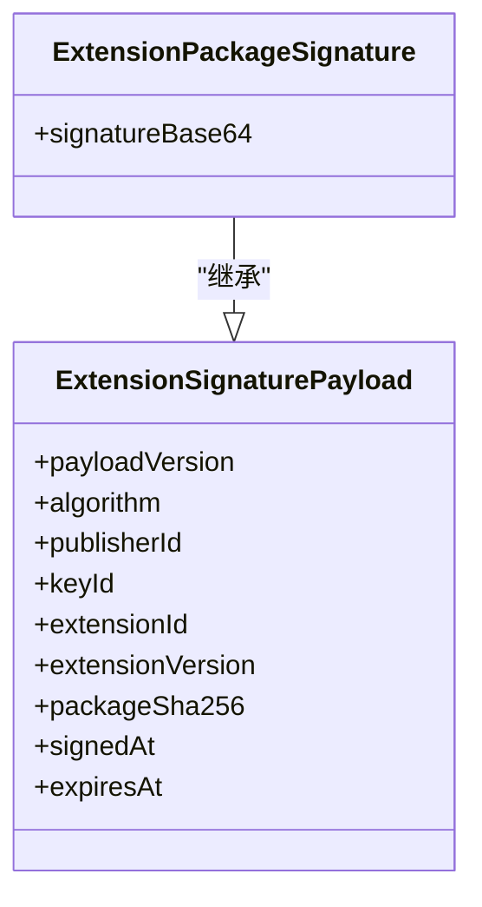
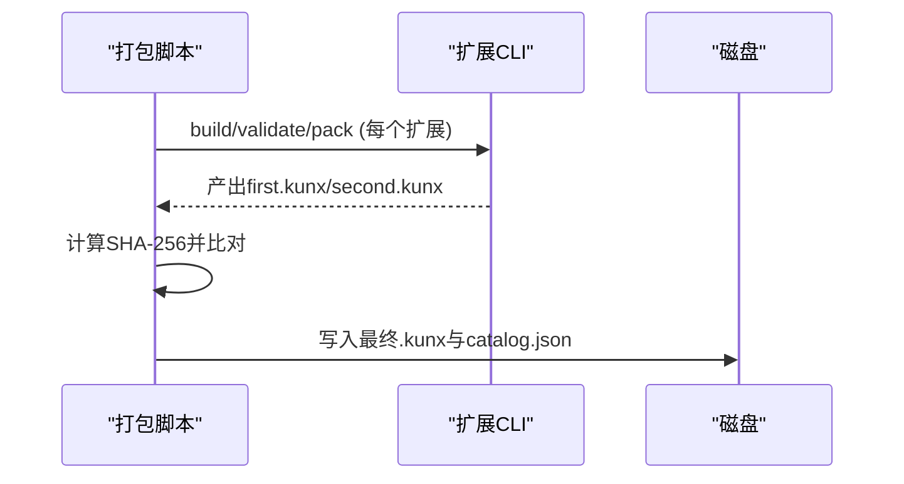
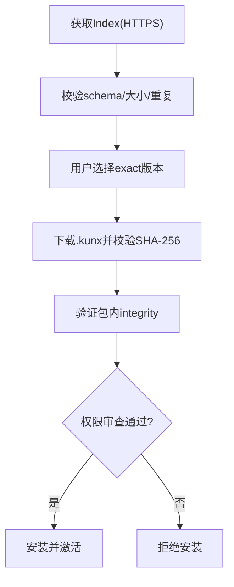
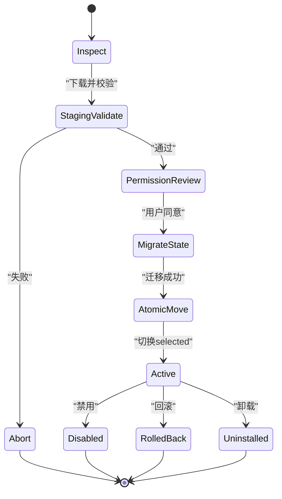
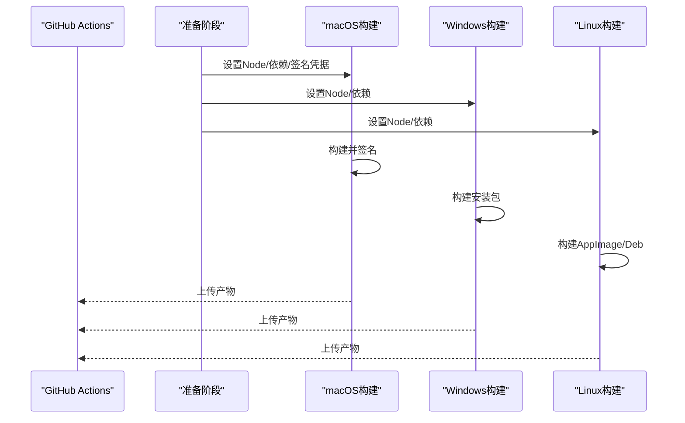
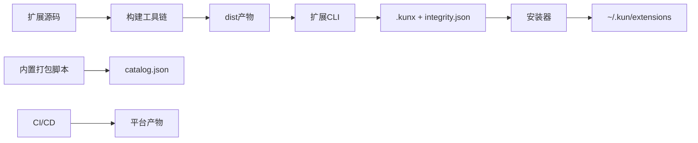

# 扩展打包与分发

<cite>
**本文引用的文件**
- [docs/extensions/packaging-and-index.md](file://docs/extensions/packaging-and-index.md)
- [examples/extensions/hello-sidebar/kun-extension.json](file://examples/extensions/hello-sidebar/kun-extension.json)
- [scripts/pack-bundled-extensions.mjs](file://scripts/pack-bundled-extensions.mjs)
- [src/shared/extension-signature.ts](file://src/shared/extension-signature.ts)
- [.github/workflows/release.yml](file://.github/workflows/release.yml)
</cite>

## 目录
1. [简介](#简介)
2. [项目结构](#项目结构)
3. [核心组件](#核心组件)
4. [架构总览](#架构总览)
5. [详细组件分析](#详细组件分析)
6. [依赖关系分析](#依赖关系分析)
7. [性能考虑](#性能考虑)
8. [故障排查指南](#故障排查指南)
9. [结论](#结论)
10. [附录](#附录)

## 简介
本文件面向 DeepSeek-GUI 的扩展开发者与维护者，系统化说明扩展的打包、签名、验证、发布与安装更新流程。内容覆盖：
- 资源文件处理、依赖管理与构建优化
- 扩展发布格式与包结构规范
- 扩展签名与验证机制
- 扩展商店或仓库集成（索引生成、元数据管理、版本控制）
- CI/CD 自动化构建与发布
- 安装、更新、卸载完整流程
- 最佳实践与安全注意事项

## 项目结构
DeepSeek-GUI 的扩展体系围绕“不可变、可验证”的 `.kunx` ZIP 包展开，配合 Manifest、完整性清单、可选签名以及自定义 HTTPS Index。产品内置扩展通过脚本统一打包并生成确定性目录与目录清单。

图示来源
- [scripts/pack-bundled-extensions.mjs:105-169](file://scripts/pack-bundled-extensions.mjs#L105-L169)
- [docs/extensions/packaging-and-index.md:137-179](file://docs/extensions/packaging-and-index.md#L137-L179)

章节来源
- [docs/extensions/packaging-and-index.md:1-100](file://docs/extensions/packaging-and-index.md#L1-L100)
- [scripts/pack-bundled-extensions.mjs:1-120](file://scripts/pack-bundled-extensions.mjs#L1-L120)

## 核心组件
- 扩展清单 Manifest：定义 ID、版本、入口、权限、贡献等，必须位于包根。
- 完整性清单 integrity.json：记录发布文件的 SHA-256，由官方 pack 工具生成。
- 可选签名 metadata：使用 Ed25519 算法，包含发布者、键标识、包摘要、时间戳等字段。
- 打包与校验 CLI：validate/pack/install/list/doctor/uninstall 等命令。
- 内置扩展打包脚本：统一构建、校验、打包、去重、生成 catalog.json。
- 自定义 Index v1：HTTPS JSON 索引，描述扩展版本、下载 URL、SHA-256、权限与签名元信息。

章节来源
- [docs/extensions/packaging-and-index.md:1-100](file://docs/extensions/packaging-and-index.md#L1-L100)
- [docs/extensions/packaging-and-index.md:211-263](file://docs/extensions/packaging-and-index.md#L211-L263)
- [src/shared/extension-signature.ts:1-169](file://src/shared/extension-signature.ts#L1-L169)
- [scripts/pack-bundled-extensions.mjs:105-169](file://scripts/pack-bundled-extensions.mjs#L105-L169)

## 架构总览
扩展从源码到安装的端到端流程如下：

图示来源
- [docs/extensions/packaging-and-index.md:137-179](file://docs/extensions/packaging-and-index.md#L137-L179)
- [docs/extensions/packaging-and-index.md:211-263](file://docs/extensions/packaging-and-index.md#L211-L263)

## 详细组件分析

### 扩展清单与包结构
- 包根必须包含 `kun-extension.json`、`README.md`、`LICENSE`、入口与 Manifest 引用的资源。
- 扩展 ID 为 `publisher.name`，版本为 SemVer；入口与所有本地资源必须在完整性清单中。
- 禁止包含敏感信息、未声明文件、符号链接、构建缓存等。
- 示例清单展示了最小可用配置与权限声明。

图示来源
- [docs/extensions/packaging-and-index.md:9-39](file://docs/extensions/packaging-and-index.md#L9-L39)
- [docs/extensions/packaging-and-index.md:40-63](file://docs/extensions/packaging-and-index.md#L40-L63)
- [examples/extensions/hello-sidebar/kun-extension.json:1-34](file://examples/extensions/hello-sidebar/kun-extension.json#L1-L34)

章节来源
- [docs/extensions/packaging-and-index.md:9-63](file://docs/extensions/packaging-and-index.md#L9-L63)
- [examples/extensions/hello-sidebar/kun-extension.json:1-34](file://examples/extensions/hello-sidebar/kun-extension.json#L1-L34)

### 完整性清单与包验证限额
- integrity.json 由官方 pack 工具确定性生成，记录每个允许文件的 SHA-256。
- 安装前在 staging 内严格校验路径、重复项、哈希匹配、资源根越界、大小/数量上限等。
- 默认安全上限包括压缩包大小、展开后总量、单文件大小、文件数量等。

图示来源
- [docs/extensions/packaging-and-index.md:40-63](file://docs/extensions/packaging-and-index.md#L40-L63)
- [docs/extensions/packaging-and-index.md:111-136](file://docs/extensions/packaging-and-index.md#L111-L136)

章节来源
- [docs/extensions/packaging-and-index.md:40-63](file://docs/extensions/packaging-and-index.md#L40-L63)
- [docs/extensions/packaging-and-index.md:111-136](file://docs/extensions/packaging-and-index.md#L111-L136)

### 可选签名与验证
- 签名 payload 使用固定字段集与 Ed25519 算法，包含发布者、键ID、扩展ID、版本、包摘要、签发与过期时间。
- 解析器严格校验字段类型、长度、正则格式与时序约束。
- 当前 Host 不执行密码学验签，仅报告签名状态；信任链与验签由安装层负责。

图示来源
- [src/shared/extension-signature.ts:1-169](file://src/shared/extension-signature.ts#L1-L169)

章节来源
- [src/shared/extension-signature.ts:1-169](file://src/shared/extension-signature.ts#L1-L169)

### 内置扩展打包与目录清单
- 脚本对每个内置扩展执行构建、validate、pack，并两次打包比对以断言确定性。
- 生成 catalog.json，固定 ID、版本、归档名、SHA-256、引擎范围、API 版本与权限。
- 清理过时归档，确保目录只包含预期产物。

图示来源
- [scripts/pack-bundled-extensions.mjs:105-169](file://scripts/pack-bundled-extensions.mjs#L105-L169)
- [scripts/pack-bundled-extensions.mjs:171-190](file://scripts/pack-bundled-extensions.mjs#L171-L190)
- [scripts/pack-bundled-extensions.mjs:198-225](file://scripts/pack-bundled-extensions.mjs#L198-L225)

章节来源
- [scripts/pack-bundled-extensions.mjs:105-225](file://scripts/pack-bundled-extensions.mjs#L105-L225)

### 自定义 Index v1 与商店集成
- Index 为不可信 JSON，要求 HTTPS，限制大小，版本条目必须精确 SemVer。
- 安装时先校验 Index 字段、重复身份/版本、URL 策略，再下载包并校验包 SHA-256 与内部 integrity。
- 签名元数据需与 Manifest 一致；Host 报告 present-unverified，不自动执行密码学验签。

图示来源
- [docs/extensions/packaging-and-index.md:211-263](file://docs/extensions/packaging-and-index.md#L211-L263)

章节来源
- [docs/extensions/packaging-and-index.md:211-263](file://docs/extensions/packaging-and-index.md#L211-L263)

### 安装、更新、卸载流程
- 安装布局采用不可变版本目录与 selected 指针，支持回滚与保留旧版本。
- 安装顺序：inspect → validate staging → 权限审查 → state migration → 原子移动 → 原子切换 selected。
- 无自动更新；只有用户主动 refresh/browse 才获取目录元数据，且不会自动下载/安装。
- 启用/禁用/回滚/卸载均保持幂等与可诊断错误。

图示来源
- [docs/extensions/packaging-and-index.md:137-179](file://docs/extensions/packaging-and-index.md#L137-L179)
- [docs/extensions/packaging-and-index.md:264-289](file://docs/extensions/packaging-and-index.md#L264-L289)

章节来源
- [docs/extensions/packaging-and-index.md:137-179](file://docs/extensions/packaging-and-index.md#L137-L179)
- [docs/extensions/packaging-and-index.md:264-289](file://docs/extensions/packaging-and-index.md#L264-L289)

### CI/CD 流水线与自动化构建
- Release 工作流在多平台并行构建 macOS、Windows、Linux，注入签名凭据并执行签名与产物上传。
- 构建产物包含安装包、blockmap、latest YAML 等，用于后续发布与更新。
- 文档与示例 CI 还包含扩展相关门禁：类型检查、片段编译、SDK 指纹一致性、clean-project gate 等。

图示来源
- [.github/workflows/release.yml:52-200](file://.github/workflows/release.yml#L52-L200)

章节来源
- [.github/workflows/release.yml:1-200](file://.github/workflows/release.yml#L1-L200)

## 依赖关系分析
- 扩展源码依赖构建工具链（如 Vite/TSC），产物进入 dist 目录。
- 打包阶段依赖扩展 CLI（validate/pack），生成 .kunx 与 integrity.json。
- 产品内置扩展打包脚本依赖 CLI 与 Node 标准库，生成 catalog.json。
- 安装阶段依赖宿主实现（Kun）进行完整性校验、权限审查与原子安装。
- CI 依赖 GitHub Actions、Node 运行时与平台签名工具。

图示来源
- [scripts/pack-bundled-extensions.mjs:105-169](file://scripts/pack-bundled-extensions.mjs#L105-L169)
- [docs/extensions/packaging-and-index.md:137-179](file://docs/extensions/packaging-and-index.md#L137-L179)
- [.github/workflows/release.yml:52-200](file://.github/workflows/release.yml#L52-L200)

章节来源
- [scripts/pack-bundled-extensions.mjs:105-169](file://scripts/pack-bundled-extensions.mjs#L105-L169)
- [docs/extensions/packaging-and-index.md:137-179](file://docs/extensions/packaging-and-index.md#L137-L179)
- [.github/workflows/release.yml:52-200](file://.github/workflows/release.yml#L52-L200)

## 性能考虑
- 打包应遵循 allowlist 策略，仅包含 Manifest 直接引用与 localResourceRoots 下的文件树，避免冗余。
- 使用确定性打包与二次比对，确保产物稳定可重现。
- 合理拆分 chunk，减少 Webview 首次加载体积；避免在 source map 中泄露敏感信息。
- 控制包大小与文件数量，遵守默认安全上限，避免安装失败。

[本节为通用指导，无需特定文件来源]

## 故障排查指南
- 常见打包错误：include/ignore 非相对路径、目标缺失、命中敏感路径策略、符号链接被拒绝、必需文件遗漏。
- 安装失败：路径穿越、链接/重复路径、哈希不匹配、资源根越界、引擎/API 不兼容、大小/数量超限。
- 签名问题：字段不匹配、未知密钥、过期时间无效、签名与 Manifest 不一致。
- 建议步骤：使用 `validate --json` 获取有效限制与诊断；在干净 profile 中复现；确认 Index 与包 SHA-256 一致；核对权限变更与 release note。

章节来源
- [docs/extensions/packaging-and-index.md:101-136](file://docs/extensions/packaging-and-index.md#L101-L136)
- [docs/extensions/packaging-and-index.md:211-263](file://docs/extensions/packaging-and-index.md#L211-L263)
- [src/shared/extension-signature.ts:1-169](file://src/shared/extension-signature.ts#L1-L169)

## 结论
DeepSeek-GUI 的扩展体系以不可变包、完整性校验与受控权限为核心，结合可选签名与自定义 Index，提供安全可控的分发与安装体验。通过统一的 CLI、内置打包脚本与 CI/CD，可实现从源码到发布的自动化闭环。遵循本文规范与最佳实践，可显著提升扩展的可维护性、安全性与可移植性。

[本节为总结性内容，无需特定文件来源]

## 附录
- 快速参考命令
  - 校验与打包：`kun extension validate .`、`kun extension pack . --output ./dist`
  - 安装与诊断：`kun extension install ./dist/*.kunx`、`kun extension list`、`kun extension doctor <id>`
  - 开发模式：`kun extension install --development /absolute/path/to/extension`
  - 启用/禁用/回滚/卸载：见文档中的命令示例
- 发布检查清单
  - ID/版本/引擎/API/state 维度正确
  - README/LICENSE/integrity/entries/assets 齐全
  - 最小权限，新增权限有清晰 release note
  - 无秘密、私有路径、未声明文件或链接
  - validate 与测试通过
  - 在干净 profile 中完成安装、激活、禁用、回滚、卸载
  - Headless 工具/Provider 不依赖 GUI/browser
  - Index 条目与包元数据/摘要一致
  - 中英文文档与 Changelog 同步

章节来源
- [docs/extensions/packaging-and-index.md:180-210](file://docs/extensions/packaging-and-index.md#L180-L210)
- [docs/extensions/packaging-and-index.md:291-302](file://docs/extensions/packaging-and-index.md#L291-L302)