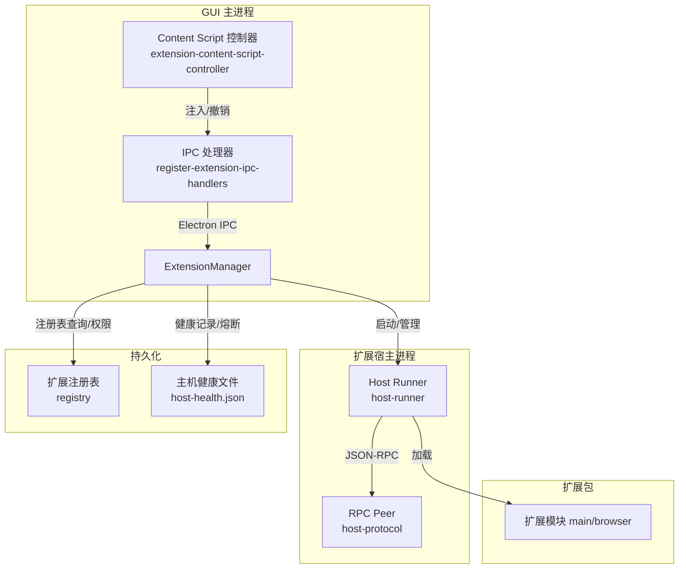
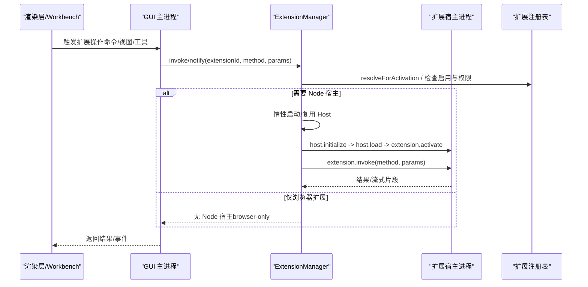
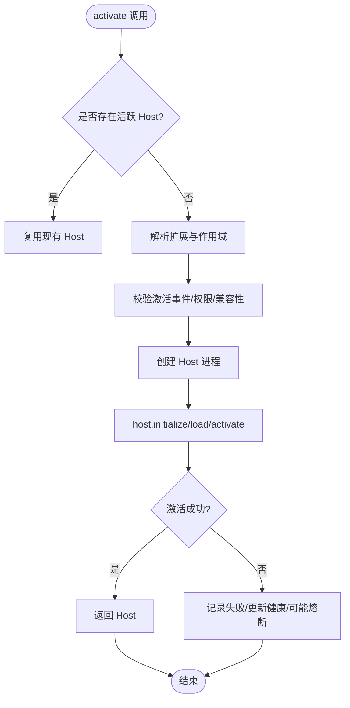
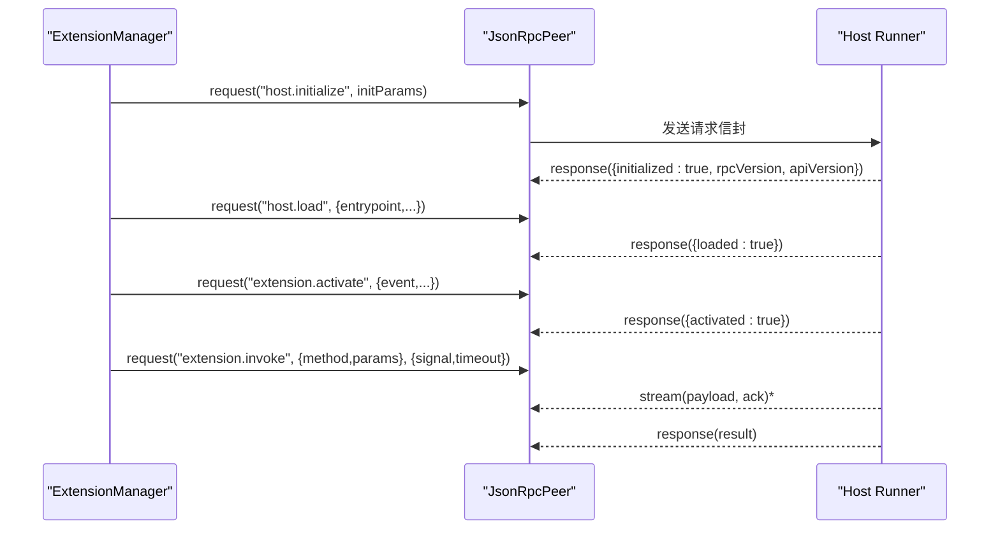
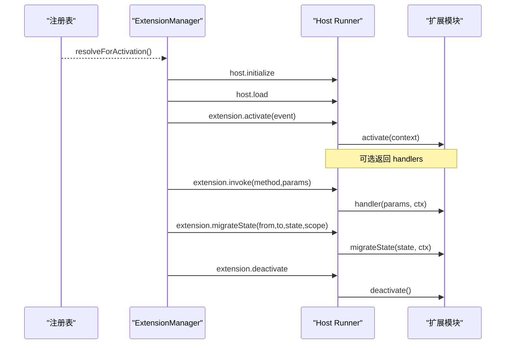
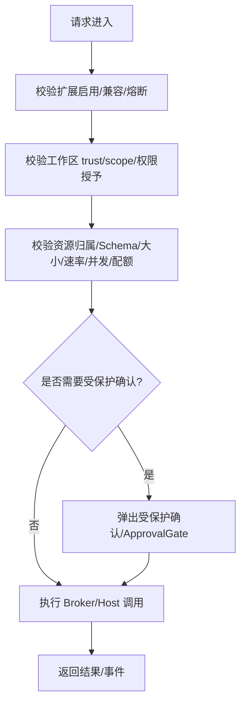
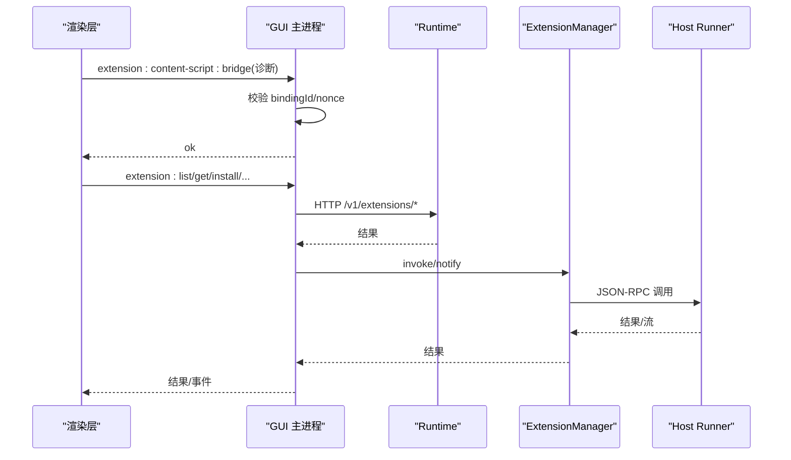
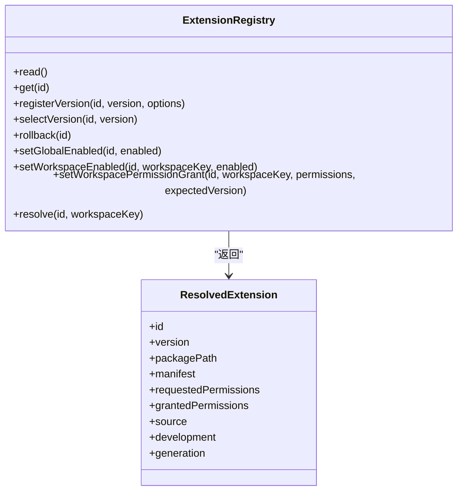
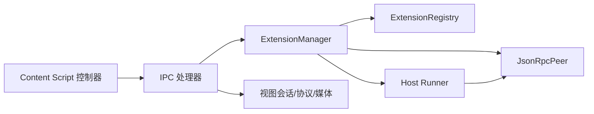

# 扩展架构设计

<cite>
**本文引用的文件**
- [manager.ts](file://kun/src/extensions/manager.ts)
- [host-runner.ts](file://kun/src/extensions/host-runner.ts)
- [host-protocol.ts](file://kun/src/extensions/host-protocol.ts)
- [registry.ts](file://kun/src/extensions/registry.ts)
- [extension-content-script-controller.ts](file://src/main/extensions/extension-content-script-controller.ts)
- [register-extension-ipc-handlers.ts](file://src/main/ipc/register-extension-ipc-handlers.ts)
- [extension-content-script.ts](file://src/preload/extension-content-script.ts)
- [architecture.md](file://docs/extensions/architecture.md)
</cite>

## 目录
1. [简介](#简介)
2. [项目结构](#项目结构)
3. [核心组件](#核心组件)
4. [架构总览](#架构总览)
5. [详细组件分析](#详细组件分析)
6. [依赖关系分析](#依赖关系分析)
7. [性能与资源限制](#性能与资源限制)
8. [故障排查指南](#故障排查指南)
9. [结论](#结论)
10. [附录](#附录)

## 简介
本文件系统性阐述 DeepSeek-GUI（Kun）扩展架构，覆盖主进程扩展管理器、宿主进程隔离机制、进程间通信协议、扩展生命周期管理、安全沙箱与权限模型、扩展与宿主的集成方式（IPC、事件系统、状态同步）、扩展注册表与版本兼容性处理。文档以代码级实现为依据，配合架构图与数据流图，帮助读者从高层到细节全面理解扩展体系。

## 项目结构
- 运行时与扩展内核位于 kun/src/extensions：
  - 扩展管理器 ExtensionManager：负责发现、激活、调用、通知、卸载、健康与熔断。
  - 宿主运行器 host-runner：在独立 Node 子进程中加载扩展模块、建立 RPC 握手、分发 activate/invoke/migrateState/deactivate。
  - 宿主协议 host-protocol：定义 JSON-RPC 信封、请求/响应/通知/取消/流式消息、限流与超时、错误序列化。
  - 扩展注册表 registry：持久化安装版本、选择版本、开发模式、工作区启用与权限授予、回滚等。
- GUI 主进程侧：
  - extension-content-script-controller：管理 Direct DOM 注入的 content script，控制隔离世界、资源加载、撤销与重载。
  - register-extension-ipc-handlers：注册 Electron IPC 处理器，桥接渲染层与 runtime，协调视图会话、媒体协议、外部浏览器、受保护操作等。
- Preload 侧：
  - extension-content-script.ts：在受限 preload 中安装隔离脚本、暴露最小 API、执行 documentStart/documentEnd 策略、上报诊断。
- 文档：
  - docs/extensions/architecture.md：官方架构与边界说明，明确执行位置、身份与权限、数据路径、失败边界等不变量。

**图示来源**
- [manager.ts:90-148](file://kun/src/extensions/manager.ts#L90-L148)
- [host-runner.ts:67-276](file://kun/src/extensions/host-runner.ts#L67-L276)
- [host-protocol.ts:136-341](file://kun/src/extensions/host-protocol.ts#L136-L341)
- [registry.ts:44-528](file://kun/src/extensions/registry.ts#L44-L528)
- [extension-content-script-controller.ts:78-171](file://src/main/extensions/extension-content-script-controller.ts#L78-L171)
- [register-extension-ipc-handlers.ts:354-800](file://src/main/ipc/register-extension-ipc-handlers.ts#L354-L800)

**章节来源**
- [architecture.md:7-124](file://docs/extensions/architecture.md#L7-L124)

## 核心组件
- 扩展管理器（ExtensionManager）
  - 职责：惰性激活、按工作区与作用域隔离实例、并发合并激活、调用与通知、空闲退避与视口引用计数、崩溃熔断与健康持久化、状态迁移、包生命周期钩子。
  - 关键能力：
    - 激活入口：activate(extensionId, event, options) 返回或复用 Host 进程。
    - 调用与通知：invoke/notify 支持信号、超时、流式重置超时。
    - 生命周期：deactivate/deactivateWorkspace/shutdown/retry/diagnostic/listDiagnostics。
    - 健康：crashThreshold、restartBackoffMs、healthyResetMs、viewIdleTimeoutMs。
    - 状态迁移：migrateState(from,to,state,{scope,workspace})。
- 宿主运行器（host-runner）
  - 职责：在独立 Node 子进程内完成初始化握手、加载扩展入口、创建扩展上下文、分发 activate/invoke/migrateState/deactivate、指标上报、异常捕获与退出。
  - 约束：入口必须限定在扩展根目录；结果必须可 JSON 序列化；未捕获异常通过 fatal 通知并退出。
- 宿主协议（host-protocol）
  - 职责：定义 rpcVersion、请求/响应/通知/取消/流/确认信封；限制消息大小、并发、默认超时、流窗口与缓冲；统一错误序列化与脱敏；支持流式背压与序列校验。
- 扩展注册表（registry）
  - 职责：记录已安装版本、选择版本、是否使用开发源、全局/工作区启用、工作区权限授予、回滚、删除、解析最终 ResolvedExtension。
  - 特性：原子写入、版本快照、权限继承与裁剪、不可变包完整性校验、兼容旧版 Action ID 修复。
- Content Script 控制器（extension-content-script-controller）
  - 职责：为 workbench 页面按需注入扩展声明的 hostContentScripts；隔离世界分配、资源读取与大小限制、签名与 nonce 校验、撤销与重载、诊断限速与保留。
- IPC 处理器（register-extension-ipc-handlers）
  - 职责：注册 Electron IPC 通道，桥接渲染层与 runtime；处理安装/启用/禁用/权限/回滚/卸载/配置/列表/诊断等；协调视图会话、媒体协议、外部浏览器、受保护操作与通知泵。
- Preload 内容脚本（extension-content-script.ts）
  - 职责：在受限 preload 中安装隔离脚本、暴露最小 API（getContext/reportDiagnostic/dispose）、按 documentStart/documentEnd 调度、限制网络/弹窗/Worker 等高危能力、上报诊断。

**章节来源**
- [manager.ts:90-148](file://kun/src/extensions/manager.ts#L90-L148)
- [host-runner.ts:67-276](file://kun/src/extensions/host-runner.ts#L67-L276)
- [host-protocol.ts:136-341](file://kun/src/extensions/host-protocol.ts#L136-L341)
- [registry.ts:44-528](file://kun/src/extensions/registry.ts#L44-L528)
- [extension-content-script-controller.ts:78-171](file://src/main/extensions/extension-content-script-controller.ts#L78-L171)
- [register-extension-ipc-handlers.ts:354-800](file://src/main/ipc/register-extension-ipc-handlers.ts#L354-L800)
- [extension-content-script.ts:49-175](file://src/preload/extension-content-script.ts#L49-L175)

## 架构总览
扩展平台遵循“单一 Agent runtime”的不变量：扩展不创建第二套 Agent 运行时，仅通过公开 Host Context 和 Broker 访问能力。Node 扩展在独立子进程执行，具备操作系统用户权限，因此不是安全沙箱；Browser/View 在宿主创建的 Chromium Webview 中运行，默认禁止直连网络，仅暴露窄 bridge。

**图示来源**
- [manager.ts:150-249](file://kun/src/extensions/manager.ts#L150-L249)
- [host-runner.ts:81-167](file://kun/src/extensions/host-runner.ts#L81-L167)
- [registry.ts:466-514](file://kun/src/extensions/registry.ts#L466-L514)

**章节来源**
- [architecture.md:7-124](file://docs/extensions/architecture.md#L7-L124)

## 详细组件分析

### 扩展管理器与宿主进程隔离
- 进程隔离：每个活跃的 Node 扩展拥有独立子进程；同一扩展版本最多一个 Host；不同扩展永不共享进程。
- 作用域隔离：按扩展 ID + 规范化工作区根集合划分实例键，避免跨信任边界复用。
- 激活合并：并发激活请求合并为一次激活，使用 epoch 与 workspaceContextSignature 保证一致性。
- 空闲退避：对无后台贡献的扩展，在最后一个 View 引用释放后进入空闲计时，到期自动停用。
- 健康与熔断：记录连续失败次数、下次重试时间、熔断开关；达到阈值后拒绝激活直至冷却。

**图示来源**
- [manager.ts:150-249](file://kun/src/extensions/manager.ts#L150-L249)
- [manager.ts:496-653](file://kun/src/extensions/manager.ts#L496-L653)
- [manager.ts:684-731](file://kun/src/extensions/manager.ts#L684-L731)

**章节来源**
- [manager.ts:90-148](file://kun/src/extensions/manager.ts#L90-L148)
- [manager.ts:150-249](file://kun/src/extensions/manager.ts#L150-L249)
- [manager.ts:496-653](file://kun/src/extensions/manager.ts#L496-L653)
- [manager.ts:684-731](file://kun/src/extensions/manager.ts#L684-L731)

### 进程间通信协议（JSON-RPC）
- 信封类型：request/response/notification/cancel/stream/ack，均携带 rpcVersion。
- 限制与保护：
  - 最大消息字节、最大并发请求、默认请求超时。
  - 流式传输：序列号校验、确认机制、窗口与缓冲上限、终止帧。
  - 错误序列化：统一错误载荷，敏感信息脱敏，跨包边界只传递公共字段。
- 宿主端路由：host.initialize/host.load/extension.activate/extension.invoke/extension.migrateState/extension.deactivate。

**图示来源**
- [host-protocol.ts:136-341](file://kun/src/extensions/host-protocol.ts#L136-L341)
- [host-runner.ts:81-167](file://kun/src/extensions/host-runner.ts#L81-L167)

**章节来源**
- [host-protocol.ts:136-341](file://kun/src/extensions/host-protocol.ts#L136-L341)
- [host-runner.ts:81-167](file://kun/src/extensions/host-runner.ts#L81-L167)

### 扩展生命周期管理
- 发现与解析：通过注册表获取已安装版本、选择版本、开发模式与工作区权限授予。
- 加载与初始化：
  - 宿主进程先进行握手（initialize），再加载入口（load），最后激活（activate）。
  - 激活时创建扩展上下文，注入扩展 ID、版本、API 版本、能力、权限、工作区上下文与激活事件。
- 调用与流式：
  - 通过 extension.invoke 调用扩展方法或 handlers；支持信号取消、超时、流式分段与确认。
- 状态迁移：
  - 提供 migrateState 接口，支持 global/workspace 范围与 from/to 版本迁移。
- 停用与卸载：
  - deactivate 调用扩展的 deactivate 钩子，清理订阅，关闭传输；卸载前由包生命周期钩子触发停用。

**图示来源**
- [registry.ts:466-514](file://kun/src/extensions/registry.ts#L466-L514)
- [host-runner.ts:81-195](file://kun/src/extensions/host-runner.ts#L81-L195)
- [manager.ts:496-653](file://kun/src/extensions/manager.ts#L496-L653)

**章节来源**
- [host-runner.ts:81-195](file://kun/src/extensions/host-runner.ts#L81-L195)
- [manager.ts:496-653](file://kun/src/extensions/manager.ts#L496-L653)
- [registry.ts:466-514](file://kun/src/extensions/registry.ts#L466-L514)

### 安全沙箱与权限模型
- 执行位置与风险：
  - Node 宿主具备 OS 权限，非沙箱；Manifest 权限用于 Broker 授权与审计。
  - Browser/View 在受限 Webview 中运行，默认禁止直连网络，仅暴露窄 bridge。
  - hostContentScripts 仅在特定 surface 注入，严格隔离世界与资源白名单。
- 权限与信任：
  - 每次 Broker 操作重新校验扩展启用状态、兼容性、熔断、工作区 trust/scope/permission grant、资源归属、Schema/大小/速率/并发/配额、是否需要受保护用户确认。
- 内容脚本安全：
  - 预加载阶段屏蔽危险 API（fetch/WebSocket/Worker/open 等），仅暴露 getContext/reportDiagnostic/dispose。
  - 注入脚本与样式通过 kun-extension:// 协议限制在当前扩展包资源范围内，并进行大小与总量限制。
  - 撤销权限或禁用扩展时，立即撤销 principal 并安排重载以清理任意 DOM/监听器/定时器副作用。

**图示来源**
- [architecture.md:58-68](file://docs/extensions/architecture.md#L58-L68)
- [extension-content-script.ts:177-191](file://src/preload/extension-content-script.ts#L177-L191)
- [extension-content-script-controller.ts:97-171](file://src/main/extensions/extension-content-script-controller.ts#L97-L171)

**章节来源**
- [architecture.md:58-68](file://docs/extensions/architecture.md#L58-L68)
- [extension-content-script.ts:177-191](file://src/preload/extension-content-script.ts#L177-L191)
- [extension-content-script-controller.ts:97-171](file://src/main/extensions/extension-content-script-controller.ts#L97-L171)

### 扩展与宿主应用的集成（IPC、事件、状态同步）
- IPC 通道：
  - 渲染层通过 Electron IPC 与主进程交互，主进程将请求转发至 runtime 或扩展管理器。
  - 内容脚本桥接：preload 通过 ipcRenderer.invoke 向主进程报告诊断，主进程校验 bindingId/nonce 后转发。
- 事件系统：
  - 宿主进程周期性上报 host.metrics；扩展可通过 transport.dispatchNotification 推送事件。
  - 通知泵轮询 runtime 中的待处理通知并投影到工作bench。
- 状态同步：
  - 注册表维护版本选择、启用状态、权限授予；切换版本或权限变更会触发视图会话回收与内容脚本撤销。
  - 健康文件持久化扩展进程健康、重启计数、熔断与日志路径。

**图示来源**
- [register-extension-ipc-handlers.ts:354-800](file://src/main/ipc/register-extension-ipc-handlers.ts#L354-L800)
- [host-runner.ts:218-276](file://kun/src/extensions/host-runner.ts#L218-L276)
- [manager.ts:220-276](file://kun/src/extensions/manager.ts#L220-L276)

**章节来源**
- [register-extension-ipc-handlers.ts:354-800](file://src/main/ipc/register-extension-ipc-handlers.ts#L354-L800)
- [host-runner.ts:218-276](file://kun/src/extensions/host-runner.ts#L218-L276)
- [manager.ts:220-276](file://kun/src/extensions/manager.ts#L220-L276)

### 扩展注册表、依赖管理与版本兼容性
- 注册表能力：
  - 注册版本、选择版本、回滚、删除版本/扩展、设置全局/工作区启用、设置工作区权限授予。
  - 解析 ResolvedExtension，合并工作区权限授予与包授予集。
- 依赖与兼容性：
  - 激活前进行兼容性报告校验，协商 API/RPC 版本；不兼容则标记 incompatible。
  - 开发模式与发布模式分离，开发源可热重载但权限授予清空。
- 权限继承与裁剪：
  - 版本切换时，若新包未扩大权限，则继承并裁剪旧授予；否则要求重新审阅。

**图示来源**
- [registry.ts:44-528](file://kun/src/extensions/registry.ts#L44-L528)

**章节来源**
- [registry.ts:44-528](file://kun/src/extensions/registry.ts#L44-L528)

## 依赖关系分析
- 组件耦合：
  - ExtensionManager 依赖注册表、宿主运行器、协议与路径服务；通过回调注入 broker、权限判定、通知与流处理。
  - Host Runner 依赖协议与扩展 SDK 上下文；通过 process.send 与父进程通信。
  - Content Script 控制器依赖描述符解析器、资源协议、WebContents 与诊断回调。
  - IPC 处理器依赖视图会话、协议注册、媒体协议、外部浏览器、受保护动作与服务。
- 外部依赖：
  - Electron IPC、WebContents、Dialog、Shell。
  - Node fs/promises、crypto、path、url。
  - Zod Schema 校验与 AtomicJsonFile 原子写入。
- 潜在循环：
  - 各模块通过接口与回调解耦，未见直接循环导入；通过 manager.ts 的 options 注入行为，降低紧耦合。

**图示来源**
- [manager.ts:90-148](file://kun/src/extensions/manager.ts#L90-L148)
- [host-runner.ts:67-276](file://kun/src/extensions/host-runner.ts#L67-L276)
- [register-extension-ipc-handlers.ts:354-800](file://src/main/ipc/register-extension-ipc-handlers.ts#L354-L800)
- [extension-content-script-controller.ts:78-171](file://src/main/extensions/extension-content-script-controller.ts#L78-L171)

**章节来源**
- [manager.ts:90-148](file://kun/src/extensions/manager.ts#L90-L148)
- [host-runner.ts:67-276](file://kun/src/extensions/host-runner.ts#L67-L276)
- [register-extension-ipc-handlers.ts:354-800](file://src/main/ipc/register-extension-ipc-handlers.ts#L354-L800)
- [extension-content-script-controller.ts:78-171](file://src/main/extensions/extension-content-script-controller.ts#L78-L171)

## 性能与资源限制
- 请求与流限制：
  - 最大消息字节、最大并发请求、默认请求超时、流窗口与缓冲上限。
  - 流式传输采用序列号校验与 ACK 背压，防止拥塞。
- 内存与 CPU：
  - 宿主进程周期性上报 rss/heapUsed/external 指标；管理器维护健康重置计时器与空闲退避。
- 资源体积：
  - 内容脚本资源单文件大小与总量限制；注入脚本与样式经白名单与哈希签名校验。
- 并发与队列：
  - 激活请求合并；Host 入站请求超限返回并发限制错误；取消优雅处理。

**章节来源**
- [host-protocol.ts:112-175](file://kun/src/extensions/host-protocol.ts#L112-L175)
- [host-protocol.ts:251-303](file://kun/src/extensions/host-protocol.ts#L251-L303)
- [host-runner.ts:242-250](file://kun/src/extensions/host-runner.ts#L242-L250)
- [extension-content-script-controller.ts:24-31](file://src/main/extensions/extension-content-script-controller.ts#L24-L31)

## 故障排查指南
- 常见错误码与场景：
  - EXTENSION_HOST_CONCURRENCY_LIMIT：并发请求超限，需降低并发或提高限制。
  - EXTENSION_HOST_TIMEOUT：请求超时，检查扩展处理耗时与超时配置。
  - EXTENSION_STREAM_BACKPRESSURE：流式背压，减少发送频率或增大窗口/缓冲。
  - EXTENSION_HOST_MESSAGE_LIMIT：消息过大，拆分或压缩。
  - EXTENSION_ENTRYPOINT_INVALID：入口越界或非文件，修正 manifest 与路径。
  - EXTENSION_NOT_ACTIVE：扩展未激活或已停用，检查激活事件与启用状态。
  - EXTENSION_ACTIVATION_EVENT_NOT_DECLARED：激活事件未在 manifest 声明。
  - EXTENSION_PERMISSION_DENIED：工作区权限超出允许集，重新审阅权限。
  - EXTENSION_VERSION_NOT_SELECTED/NOT_INSTALLED：未选择或未安装版本，先选择/安装。
  - EXTENSION_HOST_CRASHED/CIRCUIT_OPEN：宿主崩溃或熔断，等待冷却或手动重试。
- 诊断与日志：
  - 使用 diagnostic/listDiagnostics 查看扩展健康、进程 ID、日志路径、兼容性报告与协商版本。
  - 内容脚本诊断通过 bridge 上报，主进程限制速率与保留最近 N 条。
- 恢复步骤：
  - 权限变更后，视图会话将被回收，内容脚本将被撤销并安排重载。
  - 版本回滚将恢复上一版本与兼容状态快照。
  - 健康文件记录重启计数与熔断，冷却后可 retry。

**章节来源**
- [host-protocol.ts:181-239](file://kun/src/extensions/host-protocol.ts#L181-L239)
- [host-protocol.ts:251-303](file://kun/src/extensions/host-protocol.ts#L251-L303)
- [host-runner.ts:262-273](file://kun/src/extensions/host-runner.ts#L262-L273)
- [manager.ts:431-467](file://kun/src/extensions/manager.ts#L431-L467)
- [extension-content-script-controller.ts:192-228](file://src/main/extensions/extension-content-script-controller.ts#L192-L228)

## 结论
DeepSeek-GUI 的扩展架构通过严格的进程隔离、版本化私有协议、细粒度权限与工作区作用域，实现了可扩展且安全的插件生态。ExtensionManager 作为中枢，协调注册表、宿主进程与 GUI 主进程，确保激活、调用、事件与状态的一致性与健壮性。安全方面，Node 宿主虽具 OS 权限，但通过 Manifest 权限、Broker 授权、内容脚本隔离与资源白名单，将风险控制在可审计与可治理范围内。整体设计兼顾了性能、可靠性与可维护性，适合复杂桌面应用的多角色扩展需求。

## 附录
- 术语：
  - Host：扩展 Node 子进程，承载扩展 main 逻辑。
  - Broker：宿主提供的能力代理，扩展通过它访问 Agent、工具、Provider 等。
  - View Session：绑定扩展、版本、贡献、工作区与 WebContents 的安全会话。
  - Content Script：在受限隔离世界中运行的宿主 DOM 注入脚本。
- 参考：
  - 官方架构文档明确了执行位置、身份与权限、数据路径、失败边界与公开/私有接口。

**章节来源**
- [architecture.md:7-124](file://docs/extensions/architecture.md#L7-L124)