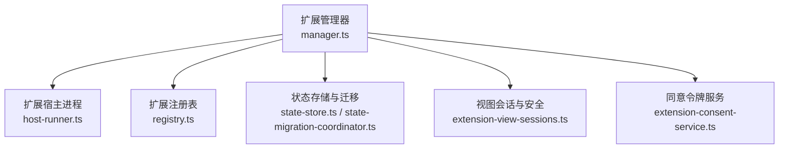
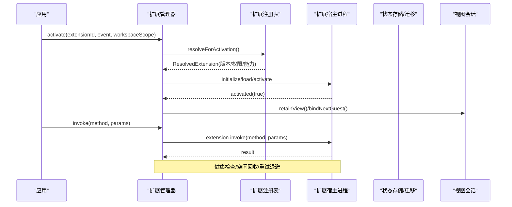
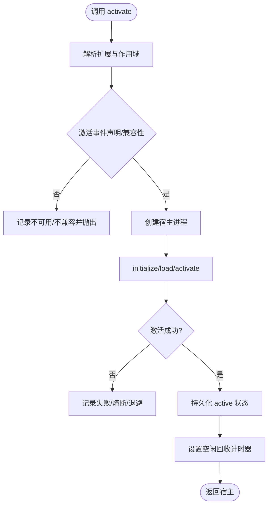
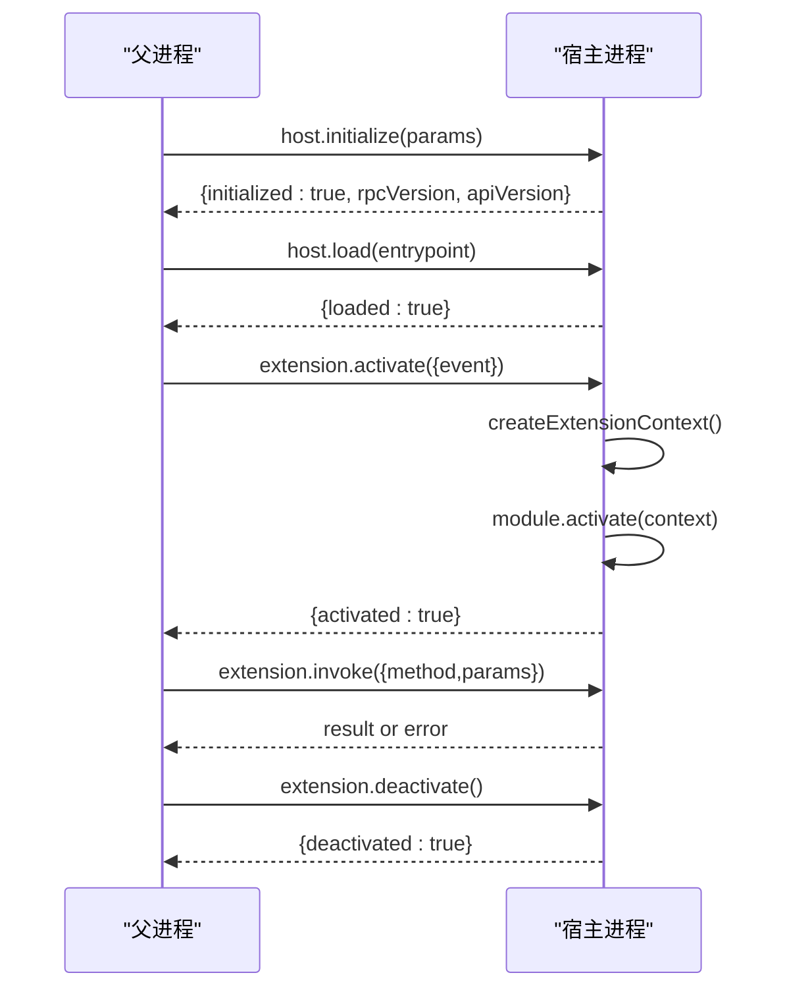
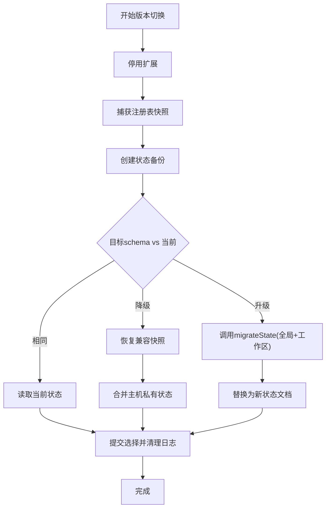
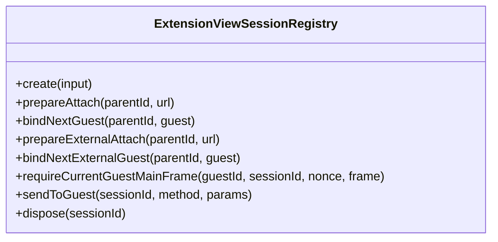
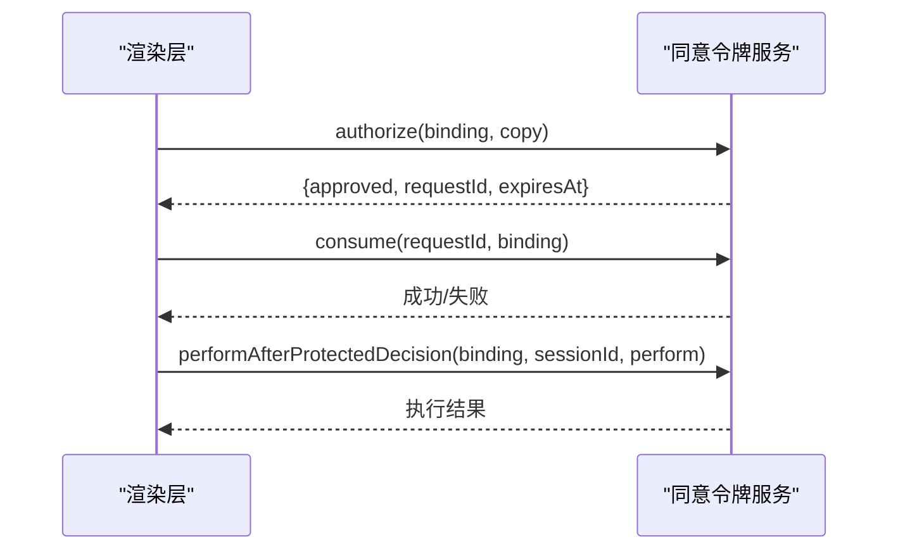
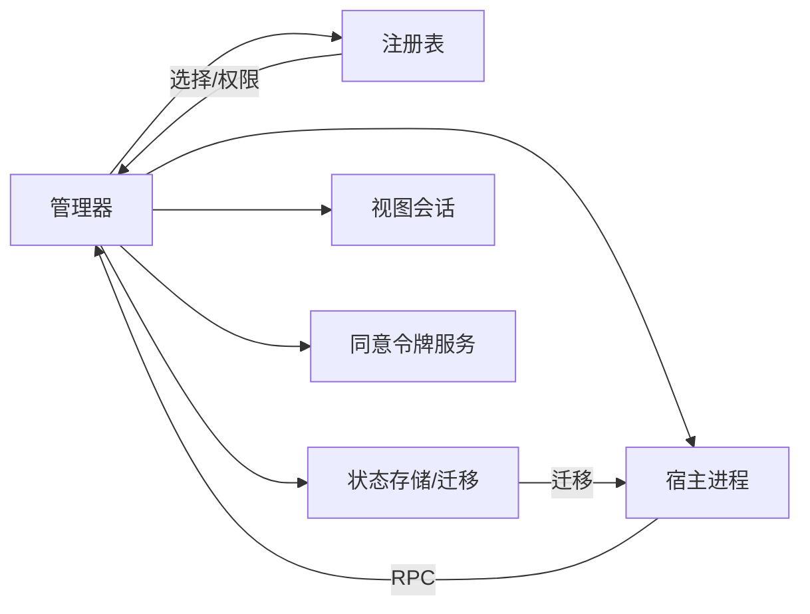

# 扩展生命周期管理

<cite>
**本文引用的文件**
- [manager.ts](file://kun/src/extensions/manager.ts)
- [host-runner.ts](file://kun/src/extensions/host-runner.ts)
- [state-migration-coordinator.ts](file://kun/src/extensions/state-migration-coordinator.ts)
- [registry.ts](file://kun/src/extensions/registry.ts)
- [state-store.ts](file://kun/src/extensions/state-store.ts)
- [extension-consent-service.ts](file://src/main/extensions/extension-consent-service.ts)
- [extension-view-sessions.ts](file://src/main/extensions/extension-view-sessions.ts)
</cite>

## 目录
1. [简介](#简介)
2. [项目结构](#项目结构)
3. [核心组件](#核心组件)
4. [架构总览](#架构总览)
5. [详细组件分析](#详细组件分析)
6. [依赖关系分析](#依赖关系分析)
7. [性能与资源管理](#性能与资源管理)
8. [故障恢复与错误处理](#故障恢复与错误处理)
9. [监控与诊断](#监控与诊断)
10. [结论](#结论)
11. [附录：钩子与自定义行为](#附录：钩子与自定义行为)

## 简介
本文件面向 DeepSeek-GUI 的扩展系统，系统化阐述扩展从发现、验证、加载、初始化、运行到卸载的全生命周期；说明状态持久化、恢复与迁移机制；解释扩展间依赖与冲突解决策略；给出热重载、动态更新与版本升级方案；并提供故障恢复、错误处理、生命周期钩子使用以及监控诊断工具的使用指南。内容基于仓库中扩展管理器、宿主进程、注册表、状态存储与迁移协调器等核心实现进行梳理。

## 项目结构
围绕扩展生命周期的关键代码分布在以下模块：
- 扩展管理器：负责扩展实例的生命周期编排、健康检查、空闲回收、调用路由等
- 扩展宿主进程：承载扩展主逻辑，提供激活、调用、状态迁移、停用等 RPC 接口
- 扩展注册表：维护已安装版本、开发源、选择策略与权限授予
- 状态存储与迁移：管理全局与工作区状态，支持跨版本迁移与回滚
- 视图会话与安全：管理 Webview 会话、外部页面授权、安全绑定
- 同意令牌服务：为敏感操作提供短生命周期令牌与受保护确认流程

**图表来源**
- [manager.ts:90-148](file://kun/src/extensions/manager.ts#L90-L148)
- [host-runner.ts:67-276](file://kun/src/extensions/host-runner.ts#L67-L276)
- [registry.ts:44-529](file://kun/src/extensions/registry.ts#L44-L529)
- [state-store.ts:69-168](file://kun/src/extensions/state-store.ts#L69-L168)
- [state-migration-coordinator.ts:51-171](file://kun/src/extensions/state-migration-coordinator.ts#L51-L171)
- [extension-view-sessions.ts:47-180](file://src/main/extensions/extension-view-sessions.ts#L47-L180)
- [extension-consent-service.ts:47-121](file://src/main/extensions/extension-consent-service.ts#L47-L121)

**章节来源**
- [manager.ts:90-148](file://kun/src/extensions/manager.ts#L90-L148)
- [host-runner.ts:67-276](file://kun/src/extensions/host-runner.ts#L67-L276)
- [registry.ts:44-529](file://kun/src/extensions/registry.ts#L44-L529)
- [state-store.ts:69-168](file://kun/src/extensions/state-store.ts#L69-L168)
- [state-migration-coordinator.ts:51-171](file://kun/src/extensions/state-migration-coordinator.ts#L51-L171)
- [extension-view-sessions.ts:47-180](file://src/main/extensions/extension-view-sessions.ts#L47-L180)
- [extension-consent-service.ts:47-121](file://src/main/extensions/extension-consent-service.ts#L47-L121)

## 核心组件
- 扩展管理器（ExtensionManager）
  - 职责：扩展实例的激活/停用、工作区隔离、空闲回收、健康检查、重试退避、诊断信息聚合、状态迁移桥接、包生命周期钩子集成
  - 关键点：按“扩展ID + 工作区范围”划分实例键；通过 epoch 防止并发激活冲突；维护 host-health.json 持久化健康状态；对无 Node main 的浏览器扩展做特殊处理
- 扩展宿主进程（host-runner）
  - 职责：建立 IPC 通道，执行 host.initialize/host.load/extension.activate/extension.invoke/extension.migrateState/extension.deactivate 等 RPC；创建扩展上下文；度量上报；异常捕获并通知父进程
  - 关键点：入口点路径限制在包根内；激活结果可返回 handlers 映射；迁移函数需实现 migrateState
- 扩展注册表（ExtensionRegistry）
  - 职责：记录已安装版本、开发源、选择策略、启用状态、工作区权限授予；支持版本切换快照与恢复
  - 关键点：工作区权限授予在不可变更新时保守继承；开发模式与生产模式分离；版本回滚保留前一次选择
- 状态存储与迁移（ExtensionStateStore / ExtensionStateMigrationCoordinator）
  - 职责：读写全局与工作区状态；版本切换事务；迁移超时控制；备份与恢复；兼容快照回退；主机私有状态隔离
  - 关键点：迁移以原子文件与标记文件保障幂等恢复；支持 down-grade 仅当存在兼容快照；迁移失败保留原状态并清理临时文件
- 视图会话与安全（ExtensionViewSessionRegistry）
  - 职责：创建/绑定/销毁 Webview 会话；校验当前主帧；外部 Webview 白名单；广播消息
  - 关键点：会话状态机 pending→attaching→active→disposed；主帧导航期间防重入；外部页面严格协议与域名匹配
- 同意令牌服务（ExtensionConsentTokenService / ProtectedExtensionActionService）
  - 职责：签发短生命周期同意令牌；防重放；绑定操作参数；受保护窗口会话撤销；统一授权与执行封装
  - 关键点：令牌仅存摘要；消费即焚；参数规范化哈希；支持一次性授权后直接执行

**章节来源**
- [manager.ts:90-148](file://kun/src/extensions/manager.ts#L90-L148)
- [host-runner.ts:67-276](file://kun/src/extensions/host-runner.ts#L67-L276)
- [registry.ts:44-529](file://kun/src/extensions/registry.ts#L44-L529)
- [state-store.ts:69-168](file://kun/src/extensions/state-store.ts#L69-L168)
- [state-migration-coordinator.ts:51-171](file://kun/src/extensions/state-migration-coordinator.ts#L51-L171)
- [extension-view-sessions.ts:47-180](file://src/main/extensions/extension-view-sessions.ts#L47-L180)
- [extension-consent-service.ts:47-121](file://src/main/extensions/extension-consent-service.ts#L47-L121)

## 架构总览
扩展生命周期由管理器驱动，结合注册表决策、状态迁移协调器与宿主进程协作完成。视图与会话由主进程安全管理，敏感操作通过同意令牌服务授权。

**图表来源**
- [manager.ts:150-190](file://kun/src/extensions/manager.ts#L150-L190)
- [manager.ts:220-249](file://kun/src/extensions/manager.ts#L220-L249)
- [host-runner.ts:107-167](file://kun/src/extensions/host-runner.ts#L107-L167)
- [registry.ts:466-514](file://kun/src/extensions/registry.ts#L466-L514)
- [extension-view-sessions.ts:62-180](file://src/main/extensions/extension-view-sessions.ts#L62-L180)

## 详细组件分析

### 扩展管理器（ExtensionManager）
- 生命周期阶段
  - 发现与验证：通过包管理器解析扩展与作用域，校验激活事件声明与兼容性报告
  - 加载与初始化：创建宿主进程，发送初始化握手，加载入口模块，触发 activate
  - 运行：invoke/notify 路由到宿主；支持流式回调与信号取消
  - 卸载：deactivate/deactivateWorkspace/shutdown 有序停止，清理定时器与引用计数
- 状态管理与持久化
  - 健康文件 host-health.json：记录 lifecycleState、processId、重启次数、连续失败、熔断开关、下次重试时间、最近错误等
  - 空闲回收：无后台贡献的扩展在视图关闭后进入空闲计时，超时自动停用
  - 重试退避：连续失败达到阈值开启熔断，指数退避重试
- 工作区隔离与权限
  - 按工作区根集合计算实例键；每个根是信任边界；解析时取交集避免越权
  - 权限变更触发工作区级停用，保证新权限生效
- 诊断与监控
  - diagnostic/listDiagnostics 聚合运行时与持久化健康信息、兼容性报告、协商 API/RPC 版本

**图表来源**
- [manager.ts:150-190](file://kun/src/extensions/manager.ts#L150-L190)
- [manager.ts:496-653](file://kun/src/extensions/manager.ts#L496-L653)
- [manager.ts:749-784](file://kun/src/extensions/manager.ts#L749-L784)

**章节来源**
- [manager.ts:90-148](file://kun/src/extensions/manager.ts#L90-L148)
- [manager.ts:150-190](file://kun/src/extensions/manager.ts#L150-L190)
- [manager.ts:220-249](file://kun/src/extensions/manager.ts#L220-L249)
- [manager.ts:278-337](file://kun/src/extensions/manager.ts#L278-L337)
- [manager.ts:418-467](file://kun/src/extensions/manager.ts#L418-L467)
- [manager.ts:496-653](file://kun/src/extensions/manager.ts#L496-L653)
- [manager.ts:684-731](file://kun/src/extensions/manager.ts#L684-L731)
- [manager.ts:749-784](file://kun/src/extensions/manager.ts#L749-L784)

### 扩展宿主进程（host-runner）
- 启动与握手：require IPC，接收 host.initialize，返回 rpcVersion/apiVersion
- 加载与激活：host.load 限制入口路径在包根；extension.activate 创建上下文并调用扩展的 activate
- 调用分发：extension.invoke 优先走 transport 注册的 handler，否则查找模块导出方法
- 状态迁移：extension.migrateState 传入 from/to/scope/workspace，要求扩展实现 migrateState
- 停用与清理：extension.deactivate 调用 deactivate 并释放订阅；异常上报 host.disposeError
- 指标与异常：每秒上报内存指标；未捕获异常/拒绝转为 host.fatal 并退出

**图表来源**
- [host-runner.ts:81-200](file://kun/src/extensions/host-runner.ts#L81-L200)
- [host-runner.ts:203-276](file://kun/src/extensions/host-runner.ts#L203-L276)
- [host-runner.ts:278-344](file://kun/src/extensions/host-runner.ts#L278-L344)

**章节来源**
- [host-runner.ts:67-276](file://kun/src/extensions/host-runner.ts#L67-L276)
- [host-runner.ts:278-344](file://kun/src/extensions/host-runner.ts#L278-L344)

### 状态迁移与版本切换（State Migration Coordinator）
- 事务性版本切换：runVersionSwitch 先停用扩展，捕获注册表快照，创建状态备份，准备目标 schema 的状态文档，提交选择，最后清理日志
- 迁移策略：
  - 同版本：直接读取
  - 降级：仅允许恢复到兼容快照，并合并主机私有状态
  - 升级：必须存在 Node main 且实现 migrateState；按 global 与 workspaces 分别迁移，支持 AbortSignal 中断
- 恢复机制：启动时 recoverAll/recover 检测未完成的事务，恢复备份并还原注册表选择
- 主机私有状态：以 __kun_ 前缀隔离，迁移过程中不被扩展写入或覆盖

**图表来源**
- [state-migration-coordinator.ts:97-171](file://kun/src/extensions/state-migration-coordinator.ts#L97-L171)
- [state-migration-coordinator.ts:173-236](file://kun/src/extensions/state-migration-coordinator.ts#L173-L236)
- [state-migration-coordinator.ts:238-297](file://kun/src/extensions/state-migration-coordinator.ts#L238-L297)

**章节来源**
- [state-migration-coordinator.ts:51-171](file://kun/src/extensions/state-migration-coordinator.ts#L51-L171)
- [state-migration-coordinator.ts:173-236](file://kun/src/extensions/state-migration-coordinator.ts#L173-L236)
- [state-migration-coordinator.ts:238-297](file://kun/src/extensions/state-migration-coordinator.ts#L238-L297)
- [state-store.ts:191-289](file://kun/src/extensions/state-store.ts#L191-L289)
- [state-store.ts:291-373](file://kun/src/extensions/state-store.ts#L291-L373)

### 视图与会话管理（Webview Sessions）
- 会话创建：生成唯一 sessionId、partition、sourceUrl，状态初始为 pending
- 绑定流程：prepareAttach 校验 URL 与父级；bindNextGuest 将 WebContents 绑定为 guest，状态变为 active，监听导航事件更新主帧信息
- 外部 Webview：prepareExternalAttach 校验白名单与协议；最多一个外部页面；bindNextExternalGuest 绑定并跟踪销毁
- 安全校验：requireCurrentGuestMainFrame 确保请求来自当前主帧，防止导航竞态；nonce 用于鉴权
- 生命周期：dispose/disposeForExtension/disposeForParent 清理队列、guests、监听器

**图表来源**
- [extension-view-sessions.ts:47-180](file://src/main/extensions/extension-view-sessions.ts#L47-L180)
- [extension-view-sessions.ts:182-246](file://src/main/extensions/extension-view-sessions.ts#L182-L246)
- [extension-view-sessions.ts:254-335](file://src/main/extensions/extension-view-sessions.ts#L254-L335)
- [extension-view-sessions.ts:337-491](file://src/main/extensions/extension-view-sessions.ts#L337-L491)

**章节来源**
- [extension-view-sessions.ts:47-180](file://src/main/extensions/extension-view-sessions.ts#L47-L180)
- [extension-view-sessions.ts:182-246](file://src/main/extensions/extension-view-sessions.ts#L182-L246)
- [extension-view-sessions.ts:254-335](file://src/main/extensions/extension-view-sessions.ts#L254-L335)
- [extension-view-sessions.ts:337-491](file://src/main/extensions/extension-view-sessions.ts#L337-L491)

### 同意令牌与受保护操作
- 令牌签发：issue 生成随机 token，保存摘要与绑定信息，设置过期时间
- 令牌消费：consume 先查是否重复使用，再校验绑定与有效期；失败抛错
- 受保护授权：authorize 弹出受保护提示，成功后签发 handle；performAfterProtectedDecision 可直接执行
- 撤销：revokeProtectedWindowSession 撤销指定会话下的所有令牌

**图表来源**
- [extension-consent-service.ts:60-121](file://src/main/extensions/extension-consent-service.ts#L60-L121)
- [extension-consent-service.ts:142-196](file://src/main/extensions/extension-consent-service.ts#L142-L196)

**章节来源**
- [extension-consent-service.ts:47-121](file://src/main/extensions/extension-consent-service.ts#L47-L121)
- [extension-consent-service.ts:123-196](file://src/main/extensions/extension-consent-service.ts#L123-L196)

## 依赖关系分析
- 管理器依赖注册表进行扩展解析与权限决策；依赖状态迁移协调器执行版本切换；依赖宿主进程执行扩展逻辑；依赖视图会话管理 UI 资源；依赖同意令牌服务进行敏感操作授权
- 宿主进程依赖 RPC 传输与扩展上下文；扩展模块通过 activate/handlers/migrateState 暴露能力
- 状态存储与迁移协调器通过原子文件与备份目录保证一致性；注册表快照用于回滚

**图表来源**
- [manager.ts:90-148](file://kun/src/extensions/manager.ts#L90-L148)
- [host-runner.ts:67-276](file://kun/src/extensions/host-runner.ts#L67-L276)
- [state-migration-coordinator.ts:51-171](file://kun/src/extensions/state-migration-coordinator.ts#L51-L171)
- [registry.ts:44-529](file://kun/src/extensions/registry.ts#L44-L529)
- [extension-view-sessions.ts:47-180](file://src/main/extensions/extension-view-sessions.ts#L47-L180)
- [extension-consent-service.ts:47-121](file://src/main/extensions/extension-consent-service.ts#L47-L121)

**章节来源**
- [manager.ts:90-148](file://kun/src/extensions/manager.ts#L90-L148)
- [host-runner.ts:67-276](file://kun/src/extensions/host-runner.ts#L67-L276)
- [state-migration-coordinator.ts:51-171](file://kun/src/extensions/state-migration-coordinator.ts#L51-L171)
- [registry.ts:44-529](file://kun/src/extensions/registry.ts#L44-L529)
- [extension-view-sessions.ts:47-180](file://src/main/extensions/extension-view-sessions.ts#L47-L180)
- [extension-consent-service.ts:47-121](file://src/main/extensions/extension-consent-service.ts#L47-L121)

## 性能与资源管理
- 空闲回收：无后台贡献的扩展在视图关闭后进入空闲计时，默认超时后自动停用，减少常驻进程占用
- 健康重置：活跃后一段时间重置健康状态，避免误判
- 重试退避：连续失败触发熔断与指数退避，降低雪崩风险
- 流控与配额：宿主进程限制消息大小、并发请求、超时与流缓冲；状态存储限制最大字节数
- 指标上报：宿主进程每秒上报 RSS/堆内存/外部内存，便于监控

[本节为通用指导，无需具体文件引用]

## 故障恢复与错误处理
- 宿主崩溃：handleHostExitInternal 记录失败、更新健康文件、可能触发熔断；onHostExit 回调可用于清理 broker 注册
- 迁移失败：状态迁移失败会保留原状态并清理临时文件；版本切换失败会恢复注册表快照与未提交的安装包
- 不完整迁移：启动时检测迁移标记文件，若未完成则恢复备份并清理标记
- 视图会话异常：主帧导航期间禁止敏感操作；外部页面严格协议与域名匹配；会话销毁时清理队列与监听器
- 同意令牌：令牌消费即焚，防重放；过期或绑定不匹配立即拒绝

**章节来源**
- [manager.ts:684-731](file://kun/src/extensions/manager.ts#L684-L731)
- [state-migration-coordinator.ts:238-297](file://kun/src/extensions/state-migration-coordinator.ts#L238-L297)
- [state-store.ts:431-464](file://kun/src/extensions/state-store.ts#L431-L464)
- [extension-view-sessions.ts:138-179](file://src/main/extensions/extension-view-sessions.ts#L138-L179)
- [extension-consent-service.ts:74-121](file://src/main/extensions/extension-consent-service.ts#L74-L121)

## 监控与诊断
- 扩展健康诊断：diagnostic/listDiagnostics 返回持久化健康、活动状态、进程 ID、日志路径、兼容性报告、协商 API/RPC 版本
- 宿主指标：宿主进程每秒上报 host.metrics（RSS/heapUsed/external）
- 视图会话：可通过 onDidDispose/onDidChangeMainFrame 监听会话销毁与主帧变化
- 同意令牌：支持撤销受保护窗口会话，防止令牌泄露

**章节来源**
- [manager.ts:431-467](file://kun/src/extensions/manager.ts#L431-L467)
- [host-runner.ts:242-250](file://kun/src/extensions/host-runner.ts#L242-L250)
- [extension-view-sessions.ts:364-382](file://src/main/extensions/extension-view-sessions.ts#L364-L382)
- [extension-consent-service.ts:104-121](file://src/main/extensions/extension-consent-service.ts#L104-L121)

## 结论
DeepSeek-GUI 的扩展生命周期管理以管理器为核心，结合注册表、状态迁移协调器、宿主进程与视图会话，实现了安全的发现、验证、加载、初始化、运行与卸载全流程。通过健康文件、空闲回收、重试退避与迁移事务，系统在可靠性与可用性之间取得平衡。配合同意令牌服务与视图会话安全机制，保障了敏感操作与 UI 资源的安全。开发者可通过生命周期钩子与迁移函数定制扩展行为，并利用诊断与指标进行监控与排障。

[本节为总结，无需具体文件引用]

## 附录：钩子与自定义行为
- 扩展激活钩子：在宿主进程中实现 activate(context)，可注册 handlers 或通过 transport 暴露方法
- 停用钩子：实现 deactivate() 释放资源与订阅
- 状态迁移钩子：实现 migrateState(from, to, state, signal) 进行数据升级，注意只写非主机私有键
- 包生命周期钩子：管理器提供 beforeVersionSwitch/beforeDisable/beforePermissionChange/beforeUninstall 钩子，用于在版本切换或禁用前停用扩展
- 自定义行为建议：
  - 在 activate 中按需注册能力，避免过早初始化
  - 在 deactivate 中确保异步资源释放与订阅清理
  - 在 migrateState 中支持 AbortSignal 中断，避免长时间阻塞
  - 使用工作区隔离与权限最小化原则，减少作用域影响

**章节来源**
- [host-runner.ts:119-195](file://kun/src/extensions/host-runner.ts#L119-L195)
- [state-migration-coordinator.ts:173-236](file://kun/src/extensions/state-migration-coordinator.ts#L173-L236)
- [manager.ts:484-493](file://kun/src/extensions/manager.ts#L484-L493)