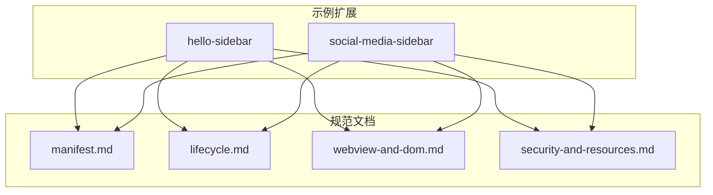
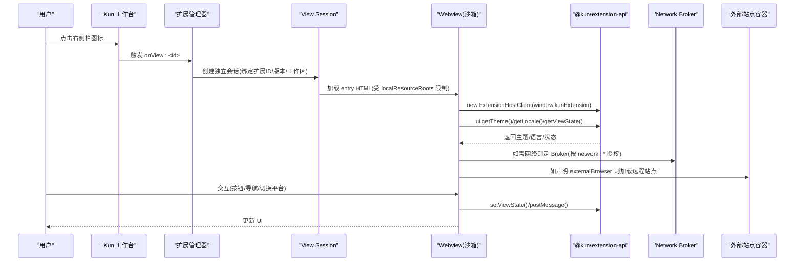
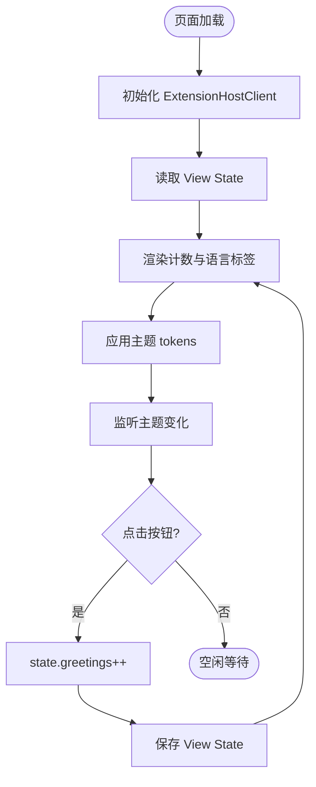
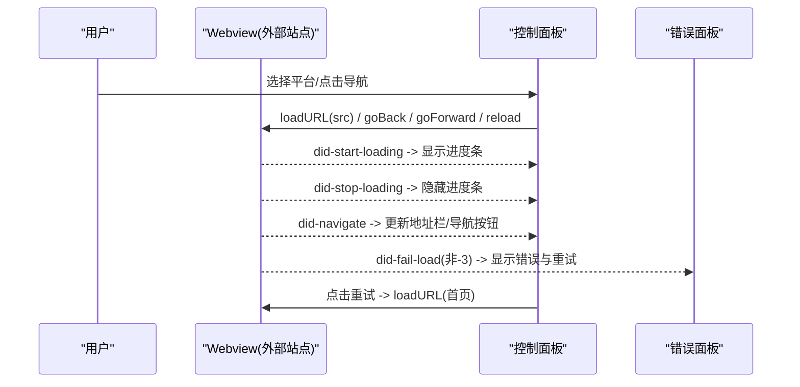
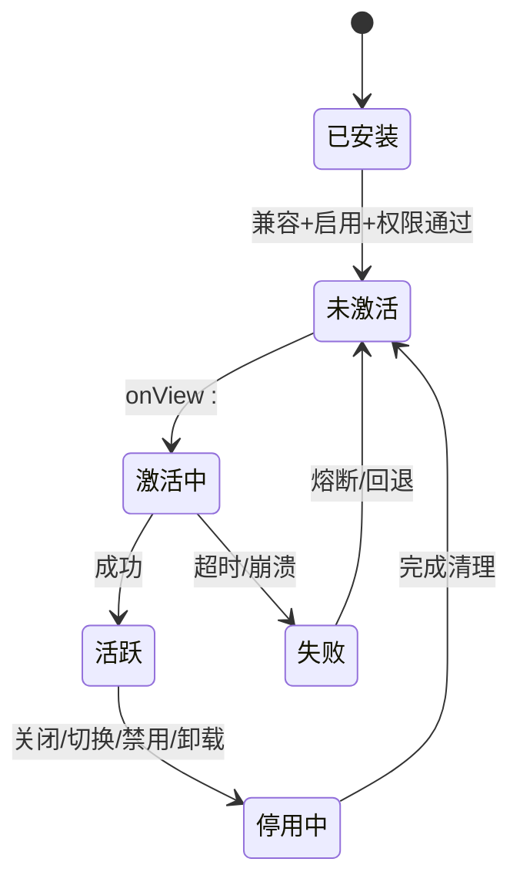
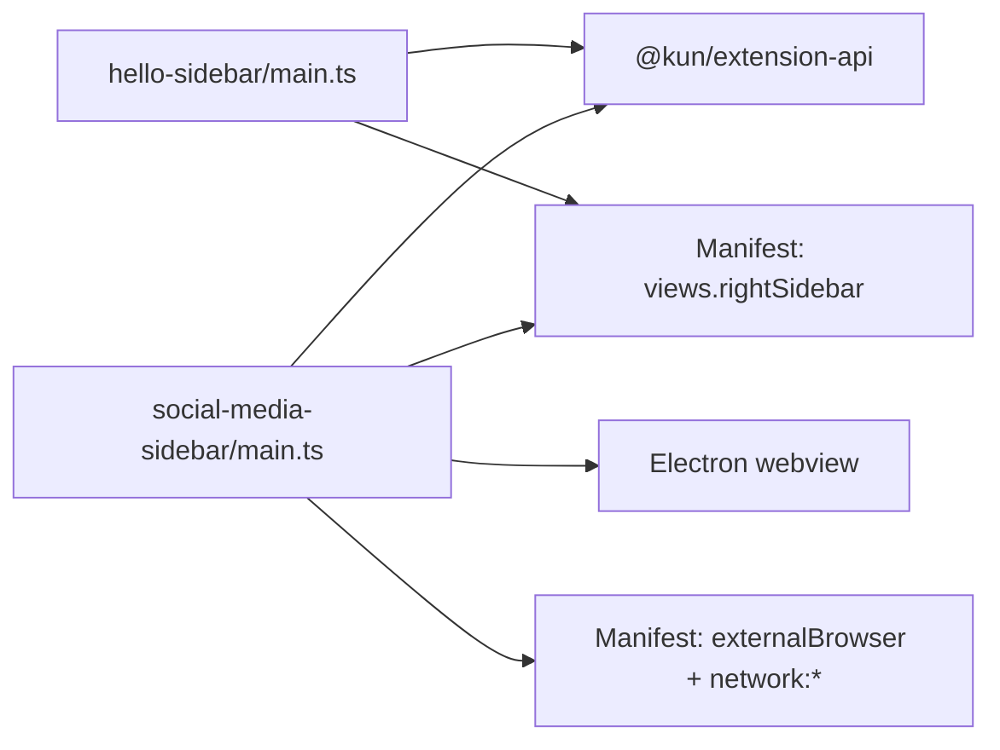

# 侧边栏扩展

<cite>
**本文引用的文件**
- [hello-sidebar/kun-extension.json](file://examples/extensions/hello-sidebar/kun-extension.json)
- [hello-sidebar/src/webview/index.html](file://examples/extensions/hello-sidebar/src/webview/index.html)
- [hello-sidebar/src/webview/main.ts](file://examples/extensions/hello-sidebar/src/webview/main.ts)
- [social-media-sidebar/kun-extension.json](file://examples/extensions/social-media-sidebar/kun-extension.json)
- [social-media-sidebar/src/webview/index.html](file://examples/extensions/social-media-sidebar/src/webview/index.html)
- [social-media-sidebar/src/webview/main.ts](file://examples/extensions/social-media-sidebar/src/webview/main.ts)
- [social-media-sidebar/src/webview/platforms.ts](file://examples/extensions/social-media-sidebar/src/webview/platforms.ts)
- [manifest.md](file://docs/extensions/manifest.md)
- [lifecycle.md](file://docs/extensions/lifecycle.md)
- [webview-and-dom.md](file://docs/extensions/webview-and-dom.md)
- [security-and-resources.md](file://docs/extensions/security-and-resources.md)
</cite>

## 目录
1. [简介](#简介)
2. [项目结构](#项目结构)
3. [核心组件](#核心组件)
4. [架构总览](#架构总览)
5. [详细组件分析](#详细组件分析)
6. [依赖关系分析](#依赖关系分析)
7. [性能与内存优化](#性能与内存优化)
8. [故障排查指南](#故障排查指南)
9. [结论](#结论)
10. [附录：开发清单与最佳实践](#附录开发清单与最佳实践)

## 简介
本文件面向 DeepSeek-GUI 的“侧边栏扩展”能力，围绕 manifest 配置、Webview 生命周期、界面集成、权限与安全模型、主题与多语言适配、响应式设计与性能优化展开。文档以两个官方示例为锚点：
- hello-sidebar：最小化的右侧栏 View，演示主题、本地化、View State 持久化与基础交互。
- social-media-sidebar：在右侧栏内通过外部 Webview 安全浏览指定站点（抖音、哔哩哔哩、小红书），演示 externalBrowser 能力、导航控制、错误处理与平台切换。

## 项目结构
仓库中与侧边栏扩展直接相关的代码与文档分布如下：
- 示例扩展位于 examples/extensions，每个扩展包含 kun-extension.json（Manifest）、src/webview（HTML/TS/CSS）以及可选测试与构建脚本。
- 扩展系统规范位于 docs/extensions，涵盖 Manifest、生命周期、Webview/Direct DOM、安全与资源等权威说明。

**图示来源**
- [manifest.md:1-120](file://docs/extensions/manifest.md#L1-L120)
- [lifecycle.md:1-40](file://docs/extensions/lifecycle.md#L1-L40)
- [webview-and-dom.md:1-80](file://docs/extensions/webview-and-dom.md#L1-L80)
- [security-and-resources.md:1-60](file://docs/extensions/security-and-resources.md#L1-L60)

**章节来源**
- [manifest.md:1-120](file://docs/extensions/manifest.md#L1-L120)
- [lifecycle.md:1-40](file://docs/extensions/lifecycle.md#L1-L40)
- [webview-and-dom.md:1-80](file://docs/extensions/webview-and-dom.md#L1-L80)
- [security-and-resources.md:1-60](file://docs/extensions/security-and-resources.md#L1-L60)

## 核心组件
- Manifest（kun-extension.json）：声明扩展身份、API 版本、激活事件、贡献点（views.rightSidebar）、权限、本地化与资源根。
- Webview 入口 HTML：定义页面结构与 CSP，加载样式与脚本。
- Webview 主逻辑（main.ts）：通过 ExtensionHostClient 与宿主通信，管理主题、本地化、View State、事件与清理。
- 外部站点浏览（social-media-sidebar）：使用 webview 元素承载远程站点，提供导航控制、错误面板与平台切换。

**章节来源**
- [hello-sidebar/kun-extension.json:1-34](file://examples/extensions/hello-sidebar/kun-extension.json#L1-L34)
- [social-media-sidebar/kun-extension.json:1-83](file://examples/extensions/social-media-sidebar/kun-extension.json#L1-L83)
- [hello-sidebar/src/webview/index.html:1-24](file://examples/extensions/hello-sidebar/src/webview/index.html#L1-L24)
- [hello-sidebar/src/webview/main.ts:1-42](file://examples/extensions/hello-sidebar/src/webview/main.ts#L1-L42)
- [social-media-sidebar/src/webview/index.html:1-13](file://examples/extensions/social-media-sidebar/src/webview/index.html#L1-L13)
- [social-media-sidebar/src/webview/main.ts:1-203](file://examples/extensions/social-media-sidebar/src/webview/main.ts#L1-L203)

## 架构总览
侧边栏扩展由“宿主（Kun Workbench）+ 扩展 Manifest + Webview 沙箱 + 可选外部站点隔离容器”构成。宿主根据 Manifest 注册右侧栏 View，创建独立 View Session 并注入窄桥；Webview 通过 @kun/extension-api 调用 ui.* 能力获取主题、本地化与状态，并在需要时请求网络或打开外部站点。

**图示来源**
- [manifest.md:143-188](file://docs/extensions/manifest.md#L143-L188)
- [webview-and-dom.md:19-125](file://docs/extensions/webview-and-dom.md#L19-L125)
- [security-and-resources.md:96-127](file://docs/extensions/security-and-resources.md#L96-L127)

## 详细组件分析

### hello-sidebar：最小化右侧栏 View
- Manifest 要点
  - 贡献 views.rightSidebar，id 为 hello，entry 指向 dist/webview/index.html。
  - 声明 activationEvents 为 onView:hello。
  - 权限包含 ui.views 与 webview。
  - 可设置 localResourceRoots 允许访问构建产物与静态资源。
- HTML 结构
  - 设置严格 CSP，仅允许 self 脚本/样式/图片与 data 图片。
  - 包含标题、提示文案、按钮与输出区域。
- 主逻辑
  - 通过 ExtensionHostClient 初始化客户端。
  - 读取并渲染 View State（问候计数）。
  - 应用主题 token 到 CSS 变量，订阅主题变化。
  - 读取 locale 并显示当前语言。
  - 页面隐藏时 dispose 客户端，释放资源。

**图示来源**
- [hello-sidebar/src/webview/main.ts:11-42](file://examples/extensions/hello-sidebar/src/webview/main.ts#L11-L42)
- [hello-sidebar/src/webview/index.html:1-24](file://examples/extensions/hello-sidebar/src/webview/index.html#L1-L24)
- [hello-sidebar/kun-extension.json:15-31](file://examples/extensions/hello-sidebar/kun-extension.json#L15-L31)

**章节来源**
- [hello-sidebar/kun-extension.json:1-34](file://examples/extensions/hello-sidebar/kun-extension.json#L1-L34)
- [hello-sidebar/src/webview/index.html:1-24](file://examples/extensions/hello-sidebar/src/webview/index.html#L1-L24)
- [hello-sidebar/src/webview/main.ts:1-42](file://examples/extensions/hello-sidebar/src/webview/main.ts#L1-L42)

### social-media-sidebar：外部站点浏览侧栏
- Manifest 要点
  - 贡献 views.rightSidebar，id 为 social-media，entry 指向 dist/webview/index.html。
  - 声明 externalBrowser.sites，列出抖音、哔哩哔哩、小红书的 id/title/badge/accent/url。
  - 权限包含 ui.views、webview、webview.external，以及各站点的 network:* 授权。
  - 提供 zh-CN 本地化覆盖，替换 displayName/description 与视图标题。
- HTML 结构
  - 极简容器 #app，由 main.ts 动态构建 UI。
- 主逻辑
  - 动态创建 shell、平台栏、浏览器控件、视口与错误面板。
  - 使用 <webview> 元素加载远程站点，监听 dom-ready、did-start-loading、did-stop-loading、did-navigate、did-fail-load 等事件。
  - 实现后退/前进/刷新/回到首页/重试等导航控制。
  - 根据 URL 自动识别当前平台并高亮对应按钮。
  - 地址栏展示安全截断后的主机名与路径片段。
- 平台数据
  - platforms.ts 定义平台常量与 URL 匹配函数，用于平台选择与地址解析。

**图示来源**
- [social-media-sidebar/kun-extension.json:19-56](file://examples/extensions/social-media-sidebar/kun-extension.json#L19-L56)
- [social-media-sidebar/src/webview/main.ts:32-118](file://examples/extensions/social-media-sidebar/src/webview/main.ts#L32-L118)
- [social-media-sidebar/src/webview/platforms.ts:11-49](file://examples/extensions/social-media-sidebar/src/webview/platforms.ts#L11-L49)

**章节来源**
- [social-media-sidebar/kun-extension.json:1-83](file://examples/extensions/social-media-sidebar/kun-extension.json#L1-L83)
- [social-media-sidebar/src/webview/index.html:1-13](file://examples/extensions/social-media-sidebar/src/webview/index.html#L1-L13)
- [social-media-sidebar/src/webview/main.ts:1-203](file://examples/extensions/social-media-sidebar/src/webview/main.ts#L1-L203)
- [social-media-sidebar/src/webview/platforms.ts:1-50](file://examples/extensions/social-media-sidebar/src/webview/platforms.ts#L1-L50)

### 生命周期与 View Session
- 激活流程：安装后不立即执行；当触发 onView:<id> 时，扩展管理器创建独立 View Session，加载 entry HTML，建立窄桥。
- 资源释放：关闭 View、切换工作区、禁用/卸载、崩溃恢复都会取消待处理调用、释放订阅与 Host 资源。
- 后台策略：无 Node main 且仅 onView 事件的扩展可按 idle policy 停止；含 onStartup 或其他 headless 能力的扩展保持可用。

**图示来源**
- [lifecycle.md:9-26](file://docs/extensions/lifecycle.md#L9-L26)
- [lifecycle.md:118-131](file://docs/extensions/lifecycle.md#L118-L131)

**章节来源**
- [lifecycle.md:9-26](file://docs/extensions/lifecycle.md#L9-L26)
- [lifecycle.md:118-131](file://docs/extensions/lifecycle.md#L118-L131)

### 权限模型与安全限制
- 最小权限原则：仅声明实际需要的权限；Manifest 会推导最小必需权限。
- 网络访问：必须显式声明 network:<hostname> 或子域通配；生产环境强制 HTTPS、DNS 校验、重定向检查与配额限制。
- 外部站点：需同时声明 webview.external 与对应 network:*；远程站点运行于隔离容器，不加载 Kun preload，无法访问 Node/Electron/本地资源。
- 存储与状态：View State 仅限结构化、有配额的数据，禁止存放凭据/令牌/私钥；全局与工作区状态也受配额与 Schema 约束。
- 受保护表面：安装、权限确认、账号/秘密输入、审批等由宿主独立窗口承载，插件不可绕过。

**章节来源**
- [manifest.md:189-208](file://docs/extensions/manifest.md#L189-L208)
- [manifest.md:282-310](file://docs/extensions/manifest.md#L282-L310)
- [webview-and-dom.md:31-79](file://docs/extensions/webview-and-dom.md#L31-L79)
- [webview-and-dom.md:162-175](file://docs/extensions/webview-and-dom.md#L162-L175)
- [security-and-resources.md:34-71](file://docs/extensions/security-and-resources.md#L34-L71)
- [security-and-resources.md:96-127](file://docs/extensions/security-and-resources.md#L96-L127)

### 主题适配与多语言支持
- 主题：通过 ui.getTheme() 获取主题 tokens，写入 CSS 变量；订阅主题变化实时更新。
- 本地化：ui.getLocale() 获取当前语言；Manifest 的 localizations 覆盖 Host 渲染文案（如视图标题、显示名称）。
- 可访问性：遵循 reduced motion、高对比度、键盘可达性与语义标签。

**章节来源**
- [hello-sidebar/src/webview/main.ts:21-38](file://examples/extensions/hello-sidebar/src/webview/main.ts#L21-L38)
- [manifest.md:92-116](file://docs/extensions/manifest.md#L92-L116)
- [webview-and-dom.md:139-155](file://docs/extensions/webview-and-dom.md#L139-L155)

### 响应式设计实现
- 侧栏宽度有限：避免大表格与固定宽度布局；优先使用弹性布局与自适应网格。
- 外部站点：externalBrowser.presentation 可设为 desktop/mobile；宿主对横向溢出进行有限自动适宽，但用户手动缩放优先。
- 内容裁剪：地址栏与错误信息做长度限制，避免溢出。

**章节来源**
- [social-media-sidebar/kun-extension.json:28-53](file://examples/extensions/social-media-sidebar/kun-extension.json#L28-L53)
- [social-media-sidebar/src/webview/main.ts:177-184](file://examples/extensions/social-media-sidebar/src/webview/main.ts#L177-L184)
- [webview-and-dom.md:162-173](file://docs/extensions/webview-and-dom.md#L162-L173)

## 依赖关系分析
- hello-sidebar 依赖 @kun/extension-api 提供的 ExtensionHostClient，通过 window.kunExtension 窄桥与宿主通信。
- social-media-sidebar 除上述依赖外，还依赖 Electron webview 元素与宿主 externalBrowser 能力，并通过 Manifest 声明的网络权限访问远程站点。
- 两者均依赖 Manifest 的 views.rightSidebar 贡献点与 activationEvents 进行注册与激活。

**图示来源**
- [hello-sidebar/src/webview/main.ts:1-11](file://examples/extensions/hello-sidebar/src/webview/main.ts#L1-L11)
- [social-media-sidebar/src/webview/main.ts:1-17](file://examples/extensions/social-media-sidebar/src/webview/main.ts#L1-L17)
- [hello-sidebar/kun-extension.json:15-31](file://examples/extensions/hello-sidebar/kun-extension.json#L15-L31)
- [social-media-sidebar/kun-extension.json:19-80](file://examples/extensions/social-media-sidebar/kun-extension.json#L19-L80)

**章节来源**
- [hello-sidebar/src/webview/main.ts:1-42](file://examples/extensions/hello-sidebar/src/webview/main.ts#L1-L42)
- [social-media-sidebar/src/webview/main.ts:1-203](file://examples/extensions/social-media-sidebar/src/webview/main.ts#L1-L203)
- [hello-sidebar/kun-extension.json:1-34](file://examples/extensions/hello-sidebar/kun-extension.json#L1-L34)
- [social-media-sidebar/kun-extension.json:1-83](file://examples/extensions/social-media-sidebar/kun-extension.json#L1-L83)

## 性能与内存优化
- 避免长阻塞：activate 快速返回，将耗时任务放入被调用的操作中。
- 背压与限流：队列/缓存设置 item/bytes/time 上限；流式处理使用 ack 与窗口控制。
- 资源释放：所有命令、事件、工具、Provider、计时器与 View Session 注册必须加入 DisposableStore 或明确 dispose；页面隐藏时 dispose 客户端。
- 状态写入：View State 保持结构化、小体积；大数据使用扩展 Storage API 或文件型公开能力。
- 网络请求：通过 Network Broker，限制 body、并发、超时与重定向；不在 URL/query 中放置敏感信息。

**章节来源**
- [lifecycle.md:67-91](file://docs/extensions/lifecycle.md#L67-L91)
- [webview-and-dom.md:127-138](file://docs/extensions/webview-and-dom.md#L127-L138)
- [security-and-resources.md:134-167](file://docs/extensions/security-and-resources.md#L134-L167)

## 故障排查指南
- 常见问题
  - 页面空白：检查 CSP 是否过严、资源路径是否在 localResourceRoots、构建产物是否正确打包。
  - 主题/语言不生效：确认已调用 getTheme/getLocale 并订阅变化；Manifest 本地化覆盖是否匹配贡献 ID。
  - 外部站点无法加载：确认已声明 webview.external 与各站点的 network:*；检查 HTTPS 与域名匹配。
  - 导航按钮无效：确保 ready 标志位正确设置；监听 dom-ready 后再启用控制。
  - 错误面板持续显示：检查 did-fail-load 的错误码，忽略 -3 等预期错误；重试时重新设置 src/loadURL。
- 诊断命令
  - 查看扩展健康与日志：使用 extension doctor/logs/reload。
  - 验证 Manifest：使用 extension validate。

**章节来源**
- [lifecycle.md:143-155](file://docs/extensions/lifecycle.md#L143-L155)
- [manifest.md:328-336](file://docs/extensions/manifest.md#L328-L336)
- [social-media-sidebar/src/webview/main.ts:109-118](file://examples/extensions/social-media-sidebar/src/webview/main.ts#L109-L118)

## 结论
侧边栏扩展通过 Manifest 声明贡献点与权限，由宿主创建独立 View Session 并注入窄桥。hello-sidebar 展示了最小可用的主题、本地化与状态持久化；social-media-sidebar 演示了外部站点的安全浏览、导航控制与错误处理。遵循最小权限、受保护表面与资源限额，可实现安全、稳定且高性能的侧栏体验。

## 附录：开发清单与最佳实践
- 开发步骤
  - 编写 Manifest：声明 name、version、activationEvents、contributes.views.rightSidebar、permissions、localizations。
  - 构建 Webview：使用 Vite 等打包依赖，确保 HTML/JS/CSS 路径受 localResourceRoots 约束。
  - 实现主逻辑：初始化 ExtensionHostClient，读取主题/语言/状态，订阅变化，妥善 dispose。
  - 如需外部站点：声明 externalBrowser.sites 与 network:*，实现导航与错误处理。
- 最佳实践
  - 只声明最小权限；避免在模块顶层执行网络/迁移。
  - 使用 View State 保存 UI 状态，不存凭据；大数据用 Storage API。
  - 遵循 CSP 与网络 Broker；不在 URL 中携带敏感信息。
  - 做好响应式与可访问性；提供错误与重试 UI。
  - 发布前验证 Manifest、完整性清单与包大小。

**章节来源**
- [manifest.md:9-87](file://docs/extensions/manifest.md#L9-L87)
- [webview-and-dom.md:45-79](file://docs/extensions/webview-and-dom.md#L45-L79)
- [security-and-resources.md:61-95](file://docs/extensions/security-and-resources.md#L61-L95)