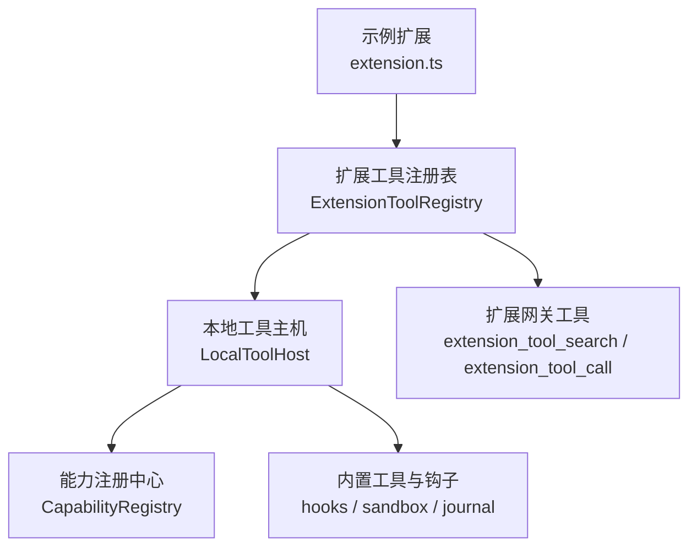
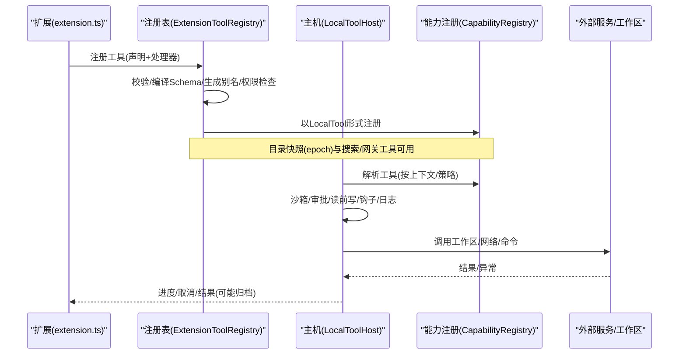
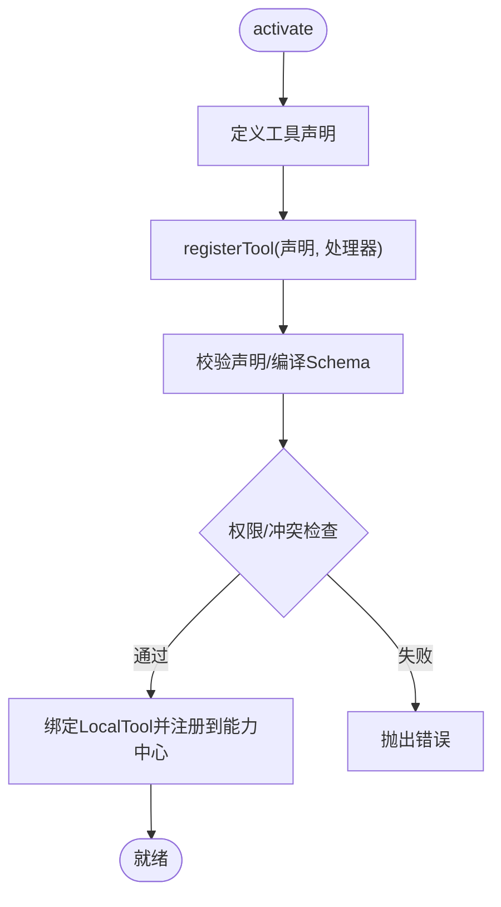
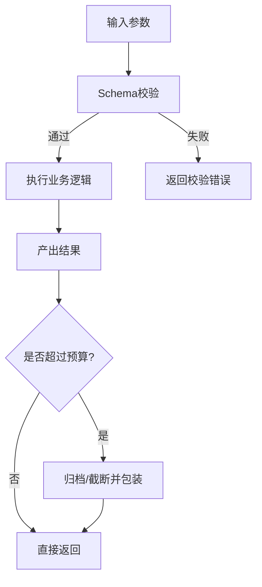
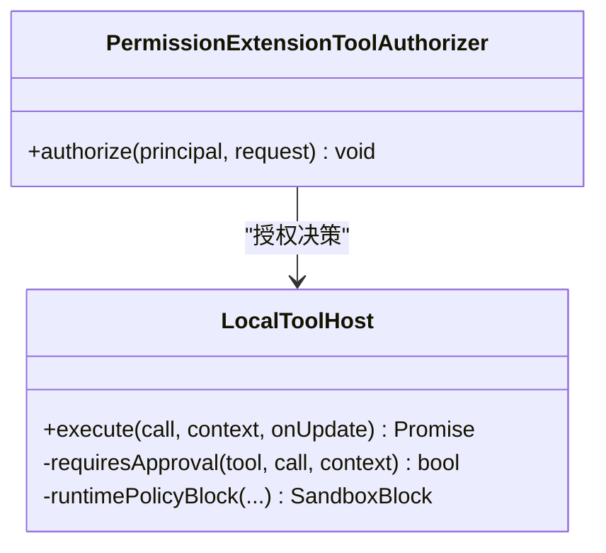
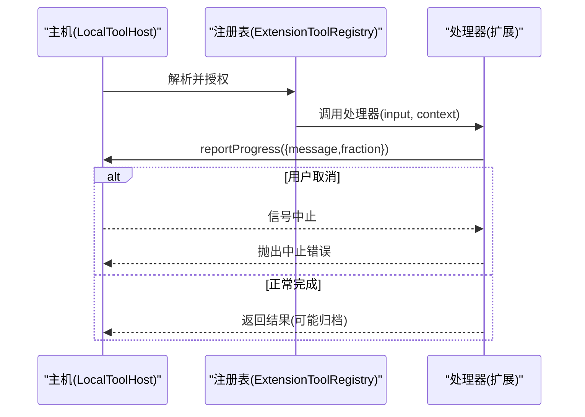

# 工具提供者扩展

<cite>
**本文引用的文件**
- [extension.ts](file://examples/extensions/tool-provider/src/extension.ts)
- [kun-extension.json](file://examples/extensions/tool-provider/kun-extension.json)
- [tools.ts](file://packages/extension-api/src/tools.ts)
- [extension-tool-provider.ts](file://kun/src/adapters/tool/extension-tool-provider.ts)
- [local-tool-host.ts](file://kun/src/adapters/tool/local-tool-host.ts)
</cite>

## 目录
1. [简介](#简介)
2. [项目结构](#项目结构)
3. [核心组件](#核心组件)
4. [架构总览](#架构总览)
5. [详细组件分析](#详细组件分析)
6. [依赖关系分析](#依赖关系分析)
7. [性能考量](#性能考量)
8. [故障排查指南](#故障排查指南)
9. [结论](#结论)
10. [附录](#附录)

## 简介
本文件面向 DeepSeek-GUI 的“工具提供者扩展”（tool-provider extension），系统性阐述其架构设计、注册机制与执行流程，覆盖工具定义、参数校验、错误处理、结果返回、权限模型、资源访问控制、执行环境隔离、异步任务处理、进度反馈与取消机制，并提供测试策略、版本管理与迁移实践，以及复杂工具链组合的高级用法。

## 项目结构
示例扩展位于 examples/extensions/tool-provider，包含：
- 清单 kun-extension.json：声明工具元数据、输入/输出 Schema、副作用、幂等性、输出大小限制、激活事件与权限。
- 实现 src/extension.ts：导出工具声明与处理器，并在 activate 中通过 context.tools.registerTool 完成注册。

运行时由 Kun 内核提供：
- packages/extension-api/src/tools.ts：定义扩展工具声明、调用上下文、进度、结果等类型与约束。
- kun/src/adapters/tool/extension-tool-provider.ts：扩展工具注册表与网关，负责校验、授权、目录快照、执行编排与输出规约。
- kun/src/adapters/tool/local-tool-host.ts：本地工具主机，统一审批、沙箱、操作日志、重试与结果归档等横切能力。



图表来源
- [extension.ts:1-84](file://examples/extensions/tool-provider/src/extension.ts#L1-L84)
- [extension-tool-provider.ts:128-579](file://kun/src/adapters/tool/extension-tool-provider.ts#L128-L579)
- [local-tool-host.ts:143-557](file://kun/src/adapters/tool/local-tool-host.ts#L143-L557)

章节来源
- [kun-extension.json:1-55](file://examples/extensions/tool-provider/kun-extension.json#L1-L55)
- [extension.ts:1-84](file://examples/extensions/tool-provider/src/extension.ts#L1-L84)

## 核心组件
- 扩展工具声明与类型
  - 工具声明需包含 id/name、description、inputSchema、可选 outputSchema、sideEffects/sideEffect、idempotent、maxOutputBytes 等字段，遵循扩展 API 的类型与校验规则。
  - 调用上下文 ToolInvocationContext 提供 invocation、cancellation、reportProgress；结果 ToolResult 支持 content、summary、metadata、generatedArtifacts。
- 扩展工具注册表 ExtensionToolRegistry
  - 负责声明校验、JSON Schema 编译与验证、别名生成、工作区作用域隔离、目录快照 epoch、搜索与漂移检测、授权检查、输出规约与截断、进度限制与字节限制。
  - 将每个扩展工具映射为 LocalTool，并通过 CapabilityRegistry 暴露给模型发现与调度。
- 本地工具主机 LocalToolHost
  - 统一执行入口：解析工具、沙箱策略、前置/后置钩子、计划模式阻断、读前写保护、审批流、操作日志、大输出归档、错误分类与重试防护。
  - 提供 defineTool 构建器与 echo 等内置工具，便于测试与脚本。

章节来源
- [tools.ts:1-62](file://packages/extension-api/src/tools.ts#L1-L62)
- [extension-tool-provider.ts:128-579](file://kun/src/adapters/tool/extension-tool-provider.ts#L128-L579)
- [local-tool-host.ts:143-557](file://kun/src/adapters/tool/local-tool-host.ts#L143-L557)

## 架构总览
扩展工具的生命周期分为三个阶段：
- 声明与注册：扩展在 activate 中调用 registerTool，宿主侧进行声明校验、Schema 编译、权限与冲突检查、别名与目录快照管理。
- 发现与编排：LocalToolHost 根据上下文与策略决定是否展示与执行，必要时触发审批、沙箱检查、读前写保护与操作日志记录。
- 执行与产出：执行处理器，支持进度上报与取消；对输出进行大小限制与归档；记录最终结果并回传。



图表来源
- [extension.ts:73-79](file://examples/extensions/tool-provider/src/extension.ts#L73-L79)
- [extension-tool-provider.ts:142-203](file://kun/src/adapters/tool/extension-tool-provider.ts#L142-L203)
- [local-tool-host.ts:196-557](file://kun/src/adapters/tool/local-tool-host.ts#L196-L557)

## 详细组件分析

### 工具定义与注册
- 工具声明
  - 在扩展中定义工具声明对象，包含 id、description、inputSchema、outputSchema、sideEffects、idempotent、maxOutputBytes。
  - 清单中同步声明 tools 数组，确保 manifest 与运行时一致。
- 注册流程
  - 扩展在 activate 中调用 context.tools.registerTool，传入声明与处理器。
  - 宿主侧编译 input/output Schema，生成 canonicalToolId 与 modelAlias，进行权限与冲突检查，写入注册表并同步到能力注册中心。



图表来源
- [extension.ts:9-35](file://examples/extensions/tool-provider/src/extension.ts#L9-L35)
- [extension.ts:73-79](file://examples/extensions/tool-provider/src/extension.ts#L73-L79)
- [extension-tool-provider.ts:142-203](file://kun/src/adapters/tool/extension-tool-provider.ts#L142-L203)

章节来源
- [extension.ts:9-35](file://examples/extensions/tool-provider/src/extension.ts#L9-L35)
- [extension.ts:73-79](file://examples/extensions/tool-provider/src/extension.ts#L73-L79)
- [extension-tool-provider.ts:142-203](file://kun/src/adapters/tool/extension-tool-provider.ts#L142-L203)
- [kun-extension.json:18-47](file://examples/extensions/tool-provider/kun-extension.json#L18-L47)

### 参数验证与结果返回
- 参数验证
  - 使用 JSON Schema 编译后的校验器在每次调用前校验输入，不合法直接拒绝。
- 结果返回
  - 处理器可返回原始值或 ToolResult；宿主侧对输出进行大小限制与归档，超限时返回包含 truncated/originalBytes/content/message 的结构化响应。
  - 若声明了 outputSchema，则对结果进行二次校验。



图表来源
- [extension-tool-provider.ts:349-408](file://kun/src/adapters/tool/extension-tool-provider.ts#L349-L408)
- [extension-tool-provider.ts:747-765](file://kun/src/adapters/tool/extension-tool-provider.ts#L747-L765)
- [local-tool-host.ts:544-557](file://kun/src/adapters/tool/local-tool-host.ts#L544-L557)

章节来源
- [tools.ts:20-62](file://packages/extension-api/src/tools.ts#L20-L62)
- [extension-tool-provider.ts:349-408](file://kun/src/adapters/tool/extension-tool-provider.ts#L349-L408)
- [extension-tool-provider.ts:747-765](file://kun/src/adapters/tool/extension-tool-provider.ts#L747-L765)

### 权限模型与资源访问控制
- 权限
  - 注册阶段要求 tools.register；调用阶段校验工作区归属，防止跨工作区越权。
- 沙箱与审批
  - 根据 sideEffect 决定策略：read-only/auto 自动执行；workspace-write/network/external 需要请求审批或显式批准。
  - 外部写路径与工作区命令在执行前计算目标并触发审批；Full Access 下仍可对高风险工具保留显式审批。
- 读前写保护
  - 在编辑类工具执行前强制先读取相关资源，避免误改。



图表来源
- [extension-tool-provider.ts:583-592](file://kun/src/adapters/tool/extension-tool-provider.ts#L583-L592)
- [local-tool-host.ts:200-336](file://kun/src/adapters/tool/local-tool-host.ts#L200-L336)

章节来源
- [extension-tool-provider.ts:583-592](file://kun/src/adapters/tool/extension-tool-provider.ts#L583-L592)
- [local-tool-host.ts:200-336](file://kun/src/adapters/tool/local-tool-host.ts#L200-L336)

### 执行环境隔离与操作日志
- 隔离
  - 通过沙箱策略与审批边界限制工具对外部资源的访问范围；工作区命令与外部写路径需明确授权。
- 操作日志
  - 每个工具调用生成唯一操作标识，记录开始、未知结果、失败与完成状态；对未知结果避免自动重试，保障幂等性与一致性。

章节来源
- [local-tool-host.ts:439-478](file://kun/src/adapters/tool/local-tool-host.ts#L439-L478)
- [local-tool-host.ts:511-557](file://kun/src/adapters/tool/local-tool-host.ts#L511-L557)

### 异步任务、进度反馈与取消
- 进度反馈
  - 处理器可通过 invocation.reportProgress 上报消息与进度比例；宿主侧限制更新次数与字节数，防止滥用。
- 取消机制
  - 通过 CancellationToken 与 AbortSignal 组合，在关键节点检查 isCancellationRequested，及时中止并抛出中止错误。
- 网关工具
  - 当扩展工具数量超过阈值时，启用 extension_tool_search/call 网关，通过已固定的目录快照安全调用目标工具。



图表来源
- [extension.ts:50-71](file://examples/extensions/tool-provider/src/extension.ts#L50-L71)
- [extension-tool-provider.ts:349-408](file://kun/src/adapters/tool/extension-tool-provider.ts#L349-L408)
- [local-tool-host.ts:496-510](file://kun/src/adapters/tool/local-tool-host.ts#L496-L510)

章节来源
- [extension.ts:50-71](file://examples/extensions/tool-provider/src/extension.ts#L50-L71)
- [extension-tool-provider.ts:349-408](file://kun/src/adapters/tool/extension-tool-provider.ts#L349-L408)
- [local-tool-host.ts:496-510](file://kun/src/adapters/tool/local-tool-host.ts#L496-L510)

### 工具测试策略与单元测试
- 建议策略
  - 针对处理器函数进行纯函数测试（如 summarizeEntries）。
  - 使用 LocalToolHost.defineTool 构造最小化工具，注入 mock 上下文与审批回调，端到端验证审批、沙箱、日志与输出归档。
  - 利用能力注册中心的 listTools/search 验证工具可见性与搜索排序。
- 模拟服务
  - 对工作区、网络、命令等外部依赖进行桩替换，验证不同分支（成功、失败、超时、取消、超大输出）。
- 参考实现
  - 示例扩展中的测试文件可作为起点，结合宿主提供的测试工具编写用例。

章节来源
- [extension.ts:42-48](file://examples/extensions/tool-provider/src/extension.ts#L42-L48)
- [local-tool-host.ts:689-717](file://kun/src/adapters/tool/local-tool-host.ts#L689-L717)

### 版本管理、向后兼容与升级迁移
- 目录快照与漂移检测
  - 注册表维护 epoch（指纹、工具列表、Schema 摘要），执行时校验当前目录是否与固定快照一致，不一致视为破坏性变更并阻止执行。
- 向后兼容
  - 新增工具为增量变更（additive）；修改或删除工具为破坏性变更（breaking），需重新发布并更新快照。
- 迁移实践
  - 升级时先发布新工具并生成新 epoch；客户端锁定 epoch 后逐步迁移；对已知失败集合进行白名单处理，避免误判。

章节来源
- [extension-tool-provider.ts:249-330](file://kun/src/adapters/tool/extension-tool-provider.ts#L249-L330)
- [extension-tool-provider.ts:575-579](file://kun/src/adapters/tool/extension-tool-provider.ts#L575-L579)

### 复杂工具链组合与高级用法
- 网关工具
  - 当工具数量较多时，通过 extension_tool_search 查找并借助 extension_tool_call 调用目标工具，保证调用链的安全与可追溯。
- 组合策略
  - 将多个小工具组合为复合工作流：先搜索、再选择、最后调用；配合审批与沙箱策略，实现细粒度控制。
- 结果聚合
  - 上层工具可聚合下层工具的输出，并进行截断与归档，保证整体结果可控。

章节来源
- [extension-tool-provider.ts:457-560](file://kun/src/adapters/tool/extension-tool-provider.ts#L457-L560)

## 依赖关系分析
- 扩展层依赖
  - 示例扩展依赖 @kun/extension-api 的工具类型与上下文接口。
- 宿主层依赖
  - 注册表依赖 JSON Schema 校验器、能力注册中心、本地工具主机、权限授权器。
  - 主机依赖沙箱策略、审批系统、钩子引擎、操作日志、读前写跟踪与大输出归档。

```mermaid
graph LR
Ext["@kun/extension-api") --> Reg["ExtensionToolRegistry"]
Reg --> Host["LocalToolHost"]
Host --> Sand["沙箱策略"]
Host --> Appr["审批系统"]
Host --> Hook["钩子引擎"]
Host --> Log["操作日志"]
Host --> Art["大输出归档"]
```

图表来源
- [tools.ts:1-62](file://packages/extension-api/src/tools.ts#L1-L62)
- [extension-tool-provider.ts:128-203](file://kun/src/adapters/tool/extension-tool-provider.ts#L128-L203)
- [local-tool-host.ts:143-190](file://kun/src/adapters/tool/local-tool-host.ts#L143-L190)

章节来源
- [tools.ts:1-62](file://packages/extension-api/src/tools.ts#L1-L62)
- [extension-tool-provider.ts:128-203](file://kun/src/adapters/tool/extension-tool-provider.ts#L128-L203)
- [local-tool-host.ts:143-190](file://kun/src/adapters/tool/local-tool-host.ts#L143-L190)

## 性能考量
- 输出预算与归档
  - 通过 maxOutputBytes 限制单次输出大小；超出阈值时归档至 artifact store，减少内存占用与传输成本。
- 进度限制
  - 限制进度更新次数与字节数，避免频繁上报影响性能。
- 目录快照
  - 使用 epoch 固定工具集，减少动态枚举开销，提升稳定性。
- 缓存与复用
  - 工具注册与能力注册中心按工作区与作用域复用，避免重复创建。

[本节为通用指导，无需特定文件引用]

## 故障排查指南
- 常见错误
  - 参数校验失败：检查 inputSchema 与传入参数类型。
  - 权限不足：确认扩展声明了 tools.register 且工作区归属正确。
  - 审批被拒：查看审批原因与 reviewer 信息。
  - 输出过大：调整 maxOutputBytes 或优化输出结构。
  - 目录漂移：检查工具声明变更是否导致 breaking 变更。
- 定位方法
  - 查看操作日志中的 operation identity 与状态；核对审批记录与沙箱策略；检查进度上报是否超限。

章节来源
- [extension-tool-provider.ts:594-617](file://kun/src/adapters/tool/extension-tool-provider.ts#L594-L617)
- [local-tool-host.ts:511-557](file://kun/src/adapters/tool/local-tool-host.ts#L511-L557)

## 结论
工具提供者扩展通过声明式定义与宿主侧严格校验、授权与编排，实现了安全、可控、可扩展的工具生态。借助目录快照、审批与沙箱、操作日志与输出归档，开发者可以专注于业务逻辑封装与外部服务集成，同时获得一致的执行体验与运维能力。推荐在实践中采用渐进式发布、epoch 锁定与完善的测试策略，确保向后兼容与稳定升级。

## 附录
- 快速上手
  - 在 kun-extension.json 中声明工具与权限；在 extension.ts 中实现处理器并在 activate 中注册；运行后通过模型发现与调用即可使用。
- 最佳实践
  - 明确 sideEffect 与 idempotent；合理设置 maxOutputBytes；使用 outputSchema 约束结果；充分利用进度与取消；对高风险操作开启显式审批。

[本节为通用指导，无需特定文件引用]