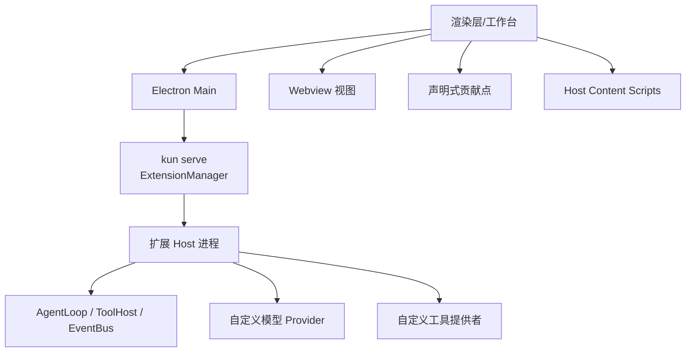
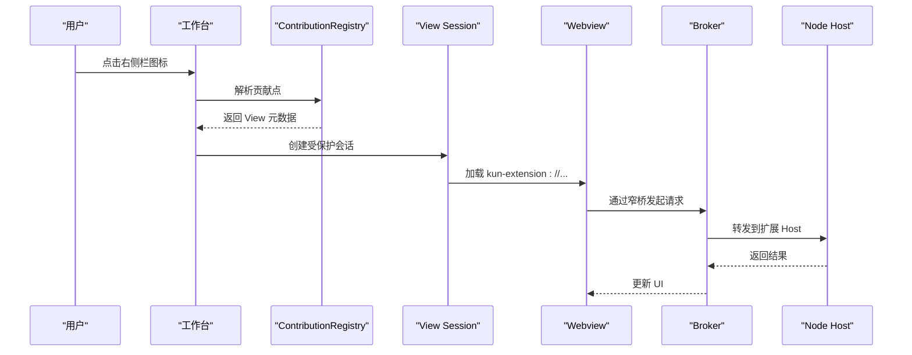
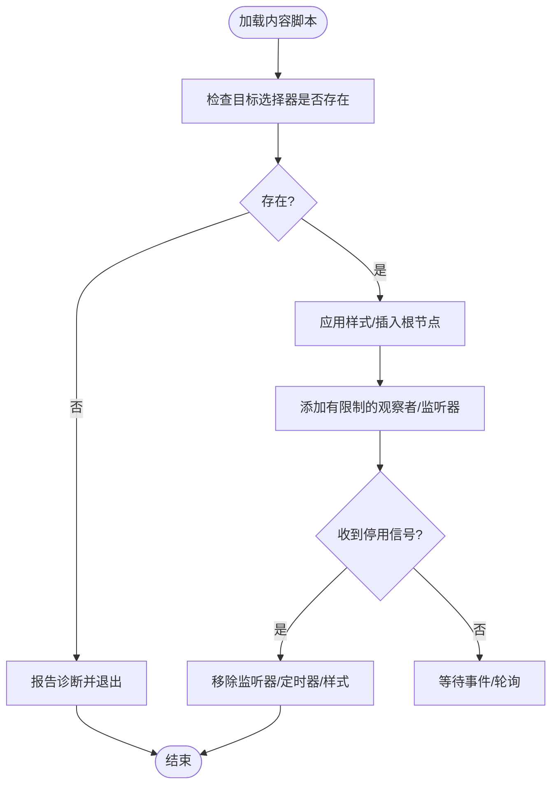
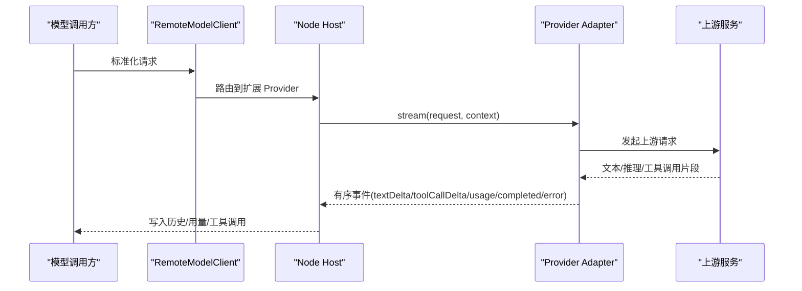
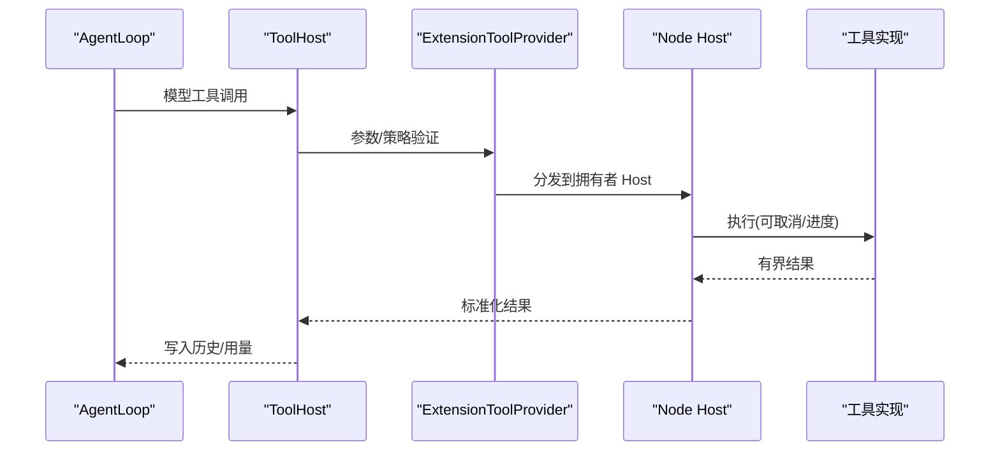
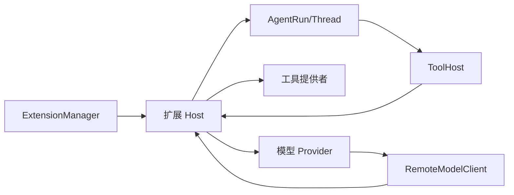

# 扩展类型与分类

<cite>
**本文引用的文件**
- [docs/extensions/README.md](file://docs/extensions/README.md)
- [docs/extensions/architecture.md](file://docs/extensions/architecture.md)
- [docs/extensions/api-reference.md](file://docs/extensions/api-reference.md)
- [docs/extensions/workbench.md](file://docs/extensions/workbench.md)
- [docs/extensions/webview-and-dom.md](file://docs/extensions/webview-and-dom.md)
- [docs/extensions/agent-and-tools.md](file://docs/extensions/agent-and-tools.md)
- [docs/extensions/providers-and-accounts.md](file://docs/extensions/providers-and-accounts.md)
- [examples/extensions/README.md](file://examples/extensions/README.md)
- [examples/extensions/hello-sidebar/kun-extension.json](file://examples/extensions/hello-sidebar/kun-extension.json)
- [examples/extensions/tool-provider/kun-extension.json](file://examples/extensions/tool-provider/kun-extension.json)
- [examples/extensions/streaming-model-provider/kun-extension.json](file://examples/extensions/streaming-model-provider/kun-extension.json)
- [examples/extensions/direct-dom/kun-extension.json](file://examples/extensions/direct-dom/kun-extension.json)
</cite>

## 目录
1. [简介](#简介)
2. [项目结构](#项目结构)
3. [核心组件](#核心组件)
4. [架构总览](#架构总览)
5. [详细组件分析](#详细组件分析)
6. [依赖关系分析](#依赖关系分析)
7. [性能考量](#性能考量)
8. [故障排查指南](#故障排查指南)
9. [结论](#结论)
10. [附录](#附录)

## 简介
本文件面向 DeepSeek-GUI（Kun）扩展开发者，系统化梳理并说明支持的扩展类型与分类：侧边栏扩展、工具面板、内容脚本、协议处理器（模型 Provider）、模型提供商和工具提供者。文档覆盖每种类型的用途、特点、使用场景、完整实现示例路径、最佳实践、选择标准与决策因素、组合使用模式与高级用法，以及复杂扩展的架构设计与模块化组织方式，并提供能力矩阵与兼容性说明。

## 项目结构
Kun 扩展平台围绕“单一 Agent runtime”构建，扩展通过公开 SDK 和能力 Broker 工作，不直接访问内部运行时或 Electron 私有 IPC。扩展可包含 Node main、Webview、声明式贡献点、Host Content Script 等，按 Manifest 声明激活事件、权限与资源，由 ExtensionManager 在 kun serve/GUI 中统一调度。

图表来源
- [docs/extensions/architecture.md:11-29](file://docs/extensions/architecture.md#L11-L29)
- [docs/extensions/architecture.md:44-68](file://docs/extensions/architecture.md#L44-L68)

章节来源
- [docs/extensions/README.md:7-20](file://docs/extensions/README.md#L7-L20)
- [docs/extensions/architecture.md:7-43](file://docs/extensions/architecture.md#L7-L43)

## 核心组件
- 扩展宿主与生命周期：ExtensionManager 负责版本选择、惰性启动、并发与熔断、取消与释放、健康状态与日志。
- 身份与权限：每次 Broker 操作重新校验扩展启用状态、工作区信任、权限授予、请求 Schema/大小/速率/配额及是否需要受保护确认。
- UI 数据路径：Manifest -> ContributionRegistry -> 宿主渲染；打开 View 才触发激活；View Session 绑定扩展 ID、版本、贡献 ID、工作区、WebContents 与 nonce。
- Agent/工具/Provider 数据路径：扩展调用 Agent 创建/恢复 thread，事件持久化并可重放；Kun 调用扩展工具经 CapabilityRegistry -> ToolHost -> ExtensionToolProvider；Provider 由 RemoteModelClient 归一化后路由到 Node Host。

章节来源
- [docs/extensions/architecture.md:44-89](file://docs/extensions/architecture.md#L44-L89)
- [docs/extensions/api-reference.md:25-68](file://docs/extensions/api-reference.md#L25-L68)

## 架构总览
扩展执行位置与职责边界如下：

| 扩展内容 | 执行位置 | 适合用途 | 安全/兼容说明 |
| --- | --- | --- | --- |
| main | 每个扩展独立 Node 子进程 | 工具、Provider、认证处理器、Agent、后台命令 | 有当前用户 OS 权限；进程隔离不是安全沙箱 |
| browser / View | 独立、宿主创建的 Chromium Webview | 复杂侧栏、编辑区、面板 UI | Node 关闭；只暴露窄 bridge；默认禁止直连网络 |
| 声明式贡献 | Kun React 树中的宿主组件 | 命令按钮、菜单、设置、通知 | 不运行插件 React；宿主负责可访问性和 UX |
| hostContentScripts | 插件专属 Electron isolated world | 必须直接读取/修改宿主 DOM 的极少场景 | 高风险；DOM/选择器不稳定；不进入受保护窗口 |

章节来源
- [docs/extensions/architecture.md:33-43](file://docs/extensions/architecture.md#L33-L43)

## 详细组件分析

### 侧边栏扩展（Webview + 声明式贡献）
- 用途与场景：提供右侧栏、编辑器标签、辅助面板等复杂交互界面，如仪表盘、可视化、表单、列表。
- 特点：沙箱 Webview、窄桥通信、主题/locale/缩放同步、View State 持久化、受限网络。
- 实现要点：
  - 在 Manifest 声明 views.rightSidebar 等贡献点与 entry 资源。
  - 使用 @kun/extension-react 的 ExtensionViewProvider 与 hooks 管理状态与消息。
  - 通过 context.ui.showNotification 发送通知，避免合成点击与不可信输入。
- 示例路径：
  - 最小右侧栏示例：[hello-sidebar/kun-extension.json](file://examples/extensions/hello-sidebar/kun-extension.json)
  - 工作台仪表板示例：[workspace-dashboard](file://examples/extensions/workspace-dashboard)
- 最佳实践：
  - 优先使用稳定贡献点与 Webview，避免 Direct DOM。
  - 使用宿主 theme tokens，支持高对比度与无障碍。
  - 对长列表虚拟化，避免破坏布局。
  - 将业务状态放在 storage.workspace，主 Agent 通过工具读写权威状态。

图表来源
- [docs/extensions/architecture.md:70-82](file://docs/extensions/architecture.md#L70-L82)
- [docs/extensions/webview-and-dom.md:19-44](file://docs/extensions/webview-and-dom.md#L19-L44)
- [docs/extensions/workbench.md:46-73](file://docs/extensions/workbench.md#L46-L73)

章节来源
- [docs/extensions/workbench.md:26-73](file://docs/extensions/workbench.md#L26-L73)
- [docs/extensions/webview-and-dom.md:19-125](file://docs/extensions/webview-and-dom.md#L19-L125)
- [examples/extensions/hello-sidebar/kun-extension.json:14-31](file://examples/extensions/hello-sidebar/kun-extension.json#L14-L31)

### 工具面板（声明式 Actions/ContextMenus/Notifications）
- 用途与场景：在工作台顶部操作区、消息操作、上下文菜单、通知中心提供轻量交互入口。
- 特点：宿主渲染、键盘可达、焦点与可访问性由宿主保证；Action 引用同扩展命令。
- 实现要点：
  - 在 Manifest 声明 actions.topBar/composer/message、contextMenus、notifications。
  - 注册命令并通过 context.commands.registerCommand 处理参数与返回值。
  - 通知使用 context.ui.showNotification，限制数量与超时，action 仅返回声明 id。
- 示例路径：参考 workbench 文档中的命令与通知示例。
- 最佳实践：
  - 超过一个简单操作时使用 View/Webview。
  - 敏感操作走 Host-owned protected flow，不在普通 DOM 内完成审批。
  - when 表达式仅用于可见性/可用性，不授予权限。

章节来源
- [docs/extensions/workbench.md:75-133](file://docs/extensions/workbench.md#L75-L133)
- [docs/extensions/workbench.md:135-208](file://docs/extensions/workbench.md#L135-L208)

### 内容脚本（Host Content Scripts / Direct DOM）
- 用途与场景：仅在确实需要直接读取/修改宿主可见 DOM 时使用，属于高风险、不稳定能力。
- 特点：isolated world 执行，不能访问 Node/Electron/runtime token；窄桥仅限 getContext/reportDiagnostic/dispose。
- 实现要点：
  - 在 Manifest 声明 contributes.hostContentScripts，指定 matches、scripts/styles、runAt。
  - 请求 hostDom 权限并通过受保护权限确认。
  - 对缺失 selector 容错退出，记录 bounded diagnostic；清理监听器与定时器。
- 示例路径：
  - 高风险 content script 示例：[direct-dom/kun-extension.json](file://examples/extensions/direct-dom/kun-extension.json)
- 最佳实践：
  - 优先使用稳定贡献点与 Webview；若必须用 Direct DOM，确保最小权限与健壮降级。
  - 不要拼接用户输入形成资源 URL；所有资源从 kun-extension:// 与声明 roots 加载。
  - 注意 runAt 精确定义与 deactivation 清理。

图表来源
- [docs/extensions/webview-and-dom.md:192-231](file://docs/extensions/webview-and-dom.md#L192-L231)
- [docs/extensions/webview-and-dom.md:274-289](file://docs/extensions/webview-and-dom.md#L274-L289)

章节来源
- [docs/extensions/webview-and-dom.md:192-231](file://docs/extensions/webview-and-dom.md#L192-L231)
- [docs/extensions/webview-and-dom.md:274-289](file://docs/extensions/webview-and-dom.md#L274-L289)
- [examples/extensions/direct-dom/kun-extension.json:14-31](file://examples/extensions/direct-dom/kun-extension.json#L14-L31)

### 协议处理器（模型 Provider）
- 用途与场景：实现自定义模型传输，将规范化请求流式事件写入既有 AgentLoop、工具和用量路径。
- 特点：不创建新 Agent runtime；需 Node main；必须 headless 可运行；严格 stream 事件顺序与终止条件；绝不静默 fallback。
- 实现要点：
  - Manifest 声明 authentication 与 modelProviders，列出模型能力与 credentialHosts。
  - 实现 probe/listModels/stream/cancel/countTokens，通过 context.modelProviders 注册。
  - 遵守事件序列、usage 累计、toolCall 组装、backpressure 与超时策略。
- 示例路径：
  - 流式模型 Provider 示例：[streaming-model-provider/kun-extension.json](file://examples/extensions/streaming-model-provider/kun-extension.json)
- 最佳实践：
  - 使用 authenticated fetch 或 Brokered upstream；拒绝原始秘密泄露。
  - 错误与日志脱敏，不记录完整 prompt/attachment/authorization。
  - 账号流程通过受保护 surface，Webview 不得提交 raw credential。

图表来源
- [docs/extensions/providers-and-accounts.md:92-145](file://docs/extensions/providers-and-accounts.md#L92-L145)
- [docs/extensions/providers-and-accounts.md:174-185](file://docs/extensions/providers-and-accounts.md#L174-L185)

章节来源
- [docs/extensions/providers-and-accounts.md:9-28](file://docs/extensions/providers-and-accounts.md#L9-L28)
- [docs/extensions/providers-and-accounts.md:30-90](file://docs/extensions/providers-and-accounts.md#L30-L90)
- [docs/extensions/providers-and-accounts.md:92-145](file://docs/extensions/providers-and-accounts.md#L92-L145)
- [docs/extensions/providers-and-accounts.md:174-197](file://docs/extensions/providers-and-accounts.md#L174-L197)
- [examples/extensions/streaming-model-provider/kun-extension.json:14-96](file://examples/extensions/streaming-model-provider/kun-extension.json#L14-L96)

### 模型提供商（Account 与 Binding）
- 用途与场景：为模型选择器提供可扩展的 Provider、账号与绑定，支持 API Key、OAuth PKCE、Device Authorization。
- 特点：Binding 三者一致（Provider + Account + Model）；账号状态与列表不含秘密；迁移与回滚安全；headless 可用。
- 实现要点：
  - 使用 context.authentication 进行账户管理与会话轮询。
  - 受保护 surface 收集凭证，成功后仅返回 account reference。
  - 刷新合并、失败 fail closed；Credential Store 优先 OS facility。
- 示例路径：参考 providers-and-accounts 文档中的账号流程与 manifest 示例。
- 最佳实践：
  - 不记录完整 prompt/attachment/authorization；错误归一化。
  - 版本/权限/能力变化使旧确认失效，需重新审阅。
  - 删除账号时展示影响范围，保持 binding 一致性。

章节来源
- [docs/extensions/providers-and-accounts.md:199-222](file://docs/extensions/providers-and-accounts.md#L199-L222)
- [docs/extensions/providers-and-accounts.md:223-262](file://docs/extensions/providers-and-accounts.md#L223-L262)
- [docs/extensions/providers-and-accounts.md:264-295](file://docs/extensions/providers-and-accounts.md#L264-L295)
- [docs/extensions/providers-and-accounts.md:297-313](file://docs/extensions/providers-and-accounts.md#L297-L313)

### 工具提供者（Tools）
- 用途与场景：向 Kun Agent 暴露外部工具服务，供模型在 turn 中调用，支持进度、取消、输出上限与幂等性。
- 特点：经过 CapabilityRegistry -> ToolHost -> ExtensionToolProvider；catalog epoch 固定；调用时重新授权。
- 实现要点：
  - Manifest 声明 tools 与 input/output schema、sideEffects、idempotent、maxOutputBytes。
  - 通过 context.tools.registerTool 注册 handler，处理 cancellation、progress 与 bounded result。
  - 遵循 tool catalog 稳定性与漂移检测。
- 示例路径：
  - 工作区工具示例：[tool-provider/kun-extension.json](file://examples/extensions/tool-provider/kun-extension.json)
- 最佳实践：
  - 明确 sideEffects 与 idempotent；未知 outcome 不自动重试。
  - 大结果按契约截断/externalize；避免破坏 history。
  - 禁用/销毁 mid-call 要取消在途调用并返回一致结果。

图表来源
- [docs/extensions/agent-and-tools.md:149-207](file://docs/extensions/agent-and-tools.md#L149-L207)
- [docs/extensions/agent-and-tools.md:209-224](file://docs/extensions/agent-and-tools.md#L209-L224)
- [docs/extensions/agent-and-tools.md:251-262](file://docs/extensions/agent-and-tools.md#L251-L262)

章节来源
- [docs/extensions/agent-and-tools.md:9-18](file://docs/extensions/agent-and-tools.md#L9-L18)
- [docs/extensions/agent-and-tools.md:149-207](file://docs/extensions/agent-and-tools.md#L149-L207)
- [docs/extensions/agent-and-tools.md:209-262](file://docs/extensions/agent-and-tools.md#L209-L262)
- [examples/extensions/tool-provider/kun-extension.json:14-53](file://examples/extensions/tool-provider/kun-extension.json#L14-L53)

### 组合使用模式与高级用法
- 侧边栏 + 工具：View 通过宿主消息协调，主 Agent 通过工具读写权威状态；示例见仓库内的视频编辑器模式。
- 工具 + Provider：Agent Run 使用自定义 Provider 的模型，同时调用扩展工具；预算、catalog epoch、审批与用量统一由 Kun 控制。
- Webview + Content Script：复杂 UI 用 Webview；仅在必要时用 Direct DOM 做最小化 DOM 改动，并严格清理。
- Headless 行为：GUI 关闭不影响 Node 工具/Provider 语义；需要交互时返回结构化 interaction-required，不隐式拉起 GUI。

章节来源
- [docs/extensions/architecture.md:83-95](file://docs/extensions/architecture.md#L83-L95)
- [docs/extensions/workbench.md:73-73](file://docs/extensions/workbench.md#L73-L73)
- [examples/extensions/README.md:6-16](file://examples/extensions/README.md#L6-L16)

## 依赖关系分析
- 扩展与宿主：ExtensionManager 管理版本、权限快照、并发与熔断；每次 Broker 操作重新校验身份与权限。
- 扩展与 Agent：扩展创建/恢复 own thread，订阅事件并重放；steer/cancel 受队列与 terminal fence 约束。
- 扩展与 Provider：Provider adapter 通过 RemoteModelClient 归一化请求；stream 事件严格有序且最多一个 terminal。
- 扩展与工具：工具 catalog 在 thread/epoch 边界固定；调用时重新授权；大结果截断/externalize。

图表来源
- [docs/extensions/architecture.md:44-68](file://docs/extensions/architecture.md#L44-L68)
- [docs/extensions/agent-and-tools.md:83-95](file://docs/extensions/agent-and-tools.md#L83-L95)
- [docs/extensions/providers-and-accounts.md:92-145](file://docs/extensions/providers-and-accounts.md#L92-L145)

章节来源
- [docs/extensions/architecture.md:44-68](file://docs/extensions/architecture.md#L44-L68)
- [docs/extensions/agent-and-tools.md:83-95](file://docs/extensions/agent-and-tools.md#L83-L95)
- [docs/extensions/providers-and-accounts.md:92-145](file://docs/extensions/providers-and-accounts.md#L92-L145)

## 性能考量
- 事件与流：订阅有队列、消息大小与速率上限；lagging subscriber 会收到 resumable overflow cursor 并从持久化源重连。
- 工具结果：超大结果按契约截断/externalize/reject；避免破坏 tool-call/history。
- Provider 背压：每 Host stream window 默认 32 个未确认事件或 4 MiB；消费者落后暂停上游读取。
- 并发与熔断：ExtensionManager 限制启动/操作时间、并发、队列、消息、事件速率、流缓冲与内存；崩溃执行有界退避与熔断。
- Catalog 稳定性：thread/epoch 固定 tool snapshot；发现与 pinned digest 不一致时报 drift 并 fence。

章节来源
- [docs/extensions/agent-and-tools.md:97-119](file://docs/extensions/agent-and-tools.md#L97-L119)
- [docs/extensions/agent-and-tools.md:209-224](file://docs/extensions/agent-and-tools.md#L209-L224)
- [docs/extensions/providers-and-accounts.md:174-179](file://docs/extensions/providers-and-accounts.md#L174-L179)
- [docs/extensions/architecture.md:44-57](file://docs/extensions/architecture.md#L44-L57)
- [docs/extensions/agent-and-tools.md:251-262](file://docs/extensions/agent-and-tools.md#L251-L262)

## 故障排查指南
- 贡献点与权限：使用 kun extension doctor 检查贡献注册、缺失权限、无效 entry 与布局故障；使用 logs 查看已脱敏的诊断。
- 工具与 Provider：关注 catalog drift、unknown outcome、interaction-required、account-required；避免记录完整 prompt/attachment/authorization。
- Webview 与 Content Script：Guest crash 仅销毁该 View Session；Direct DOM 对缺失 selector 容错并记录诊断；deactivation 时清理监听器与定时器。
- 通知与审批：通知 action 不是审批入口；审批走 Main-owned protected surface，合成 click 被拒绝。

章节来源
- [docs/extensions/workbench.md:246-251](file://docs/extensions/workbench.md#L246-L251)
- [docs/extensions/providers-and-accounts.md:199-204](file://docs/extensions/providers-and-accounts.md#L199-L204)
- [docs/extensions/webview-and-dom.md:188-191](file://docs/extensions/webview-and-dom.md#L188-L191)
- [docs/extensions/webview-and-dom.md:254-273](file://docs/extensions/webview-and-dom.md#L254-L273)

## 结论
DeepSeek-GUI 的扩展体系以单一 Agent runtime 为核心，通过稳定的 Manifest、SDK 与 Broker 机制，将侧边栏扩展、工具面板、内容脚本、协议处理器、模型提供商与工具提供者有机整合。开发者应优先采用稳定贡献点与 Webview，谨慎使用 Direct DOM；在工具与 Provider 中严格遵守 schema、权限、预算与流式事件契约；通过组合模式实现复杂工作流，并在 headless 环境下保持一致语义。发布前务必完成清单校验与安全检查，确保可维护性与安全性。

## 附录

### 扩展类型选择标准与决策因素
- 需求匹配：
  - 仅需按钮/菜单/设置/通知：使用声明式贡献点。
  - 复杂 UI：使用 Webview。
  - 必须直接读写宿主 DOM：使用 Direct DOM（高风险）。
  - 暴露外部工具：注册工具提供者。
  - 自定义模型传输：实现模型 Provider。
- 权限与风险：
  - 工具/Provider 需 Node main 与相应权限；Direct DOM 需 hostDom 与受保护确认。
  - 敏感操作走受保护 surface，不在普通 DOM 完成审批。
- 可维护性与兼容性：
  - 优先稳定 API；避免依赖宿主 DOM/CSS/React 结构。
  - 关注 catalog epoch、stream 事件与 backpressure。

章节来源
- [docs/extensions/README.md:11-20](file://docs/extensions/README.md#L11-L20)
- [docs/extensions/webview-and-dom.md:9-18](file://docs/extensions/webview-and-dom.md#L9-L18)
- [docs/extensions/agent-and-tools.md:149-207](file://docs/extensions/agent-and-tools.md#L149-L207)
- [docs/extensions/providers-and-accounts.md:19-28](file://docs/extensions/providers-and-accounts.md#L19-L28)

### 能力矩阵与兼容性说明
- 能力矩阵（摘要）：
  - 侧边栏扩展：Webview、声明式贡献、通知、View State、主题/locale。
  - 工具面板：Actions/ContextMenus/Notifications、命令注册、when 表达式。
  - 内容脚本：hostContentScripts、isolated world、窄桥、高风险。
  - 协议处理器：Provider adapter、stream 事件、usage、cancel/backpressure。
  - 模型提供商：Account/Binding、认证流程、Credential Store、headless 可用。
  - 工具提供者：tools.register、schema、sideEffects/idempotent、catalog epoch。
- 兼容性：
  - 以 Manifest engines.kun 与兼容矩阵为准；API major 行为保持稳定。
  - 工具 catalog 在 thread/epoch 边界固定；发现漂移会 fence。
  - Provider 绝不静默 fallback；binding 变更需重新审阅。

章节来源
- [docs/extensions/README.md:3-13](file://docs/extensions/README.md#L3-L13)
- [docs/extensions/agent-and-tools.md:251-262](file://docs/extensions/agent-and-tools.md#L251-L262)
- [docs/extensions/providers-and-accounts.md:186-197](file://docs/extensions/providers-and-accounts.md#L186-L197)
- [docs/extensions/api-reference.md:9-13](file://docs/extensions/api-reference.md#L9-L13)

### 示例索引
- 右侧栏示例：[hello-sidebar](file://examples/extensions/hello-sidebar)
- 工作区仪表板：[workspace-dashboard](file://examples/extensions/workspace-dashboard)
- Agent 助手：[agent-assistant](file://examples/extensions/agent-assistant)
- 演示工作室：[presentation-studio](file://examples/extensions/presentation-studio)
- 社交媒体侧栏：[social-media-sidebar](file://examples/extensions/social-media-sidebar)
- 工具提供者：[tool-provider](file://examples/extensions/tool-provider)
- 流式模型 Provider：[streaming-model-provider](file://examples/extensions/streaming-model-provider)
- Direct DOM：[direct-dom](file://examples/extensions/direct-dom)
- 视频编辑器：[kun-video-editor](file://examples/extensions/kun-video-editor)

章节来源
- [examples/extensions/README.md:6-16](file://examples/extensions/README.md#L6-L16)