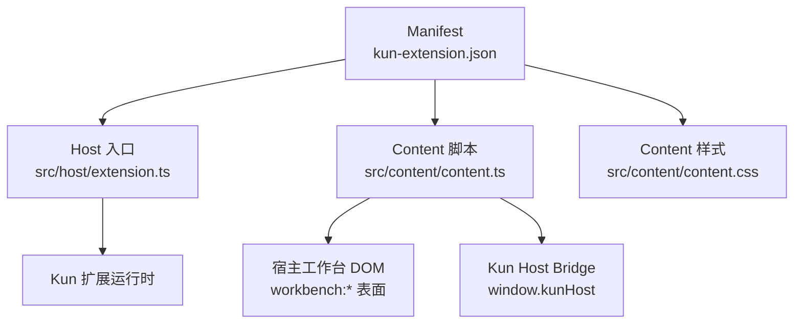
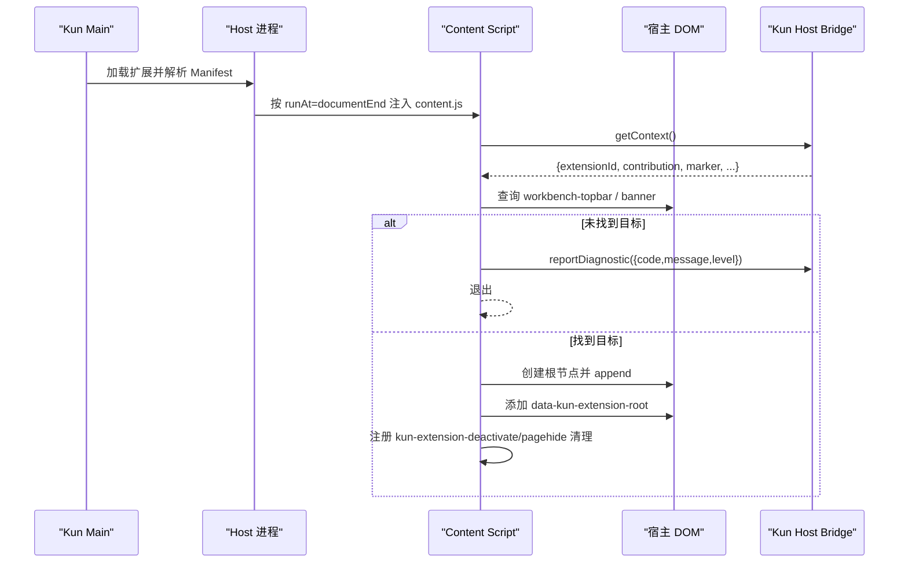
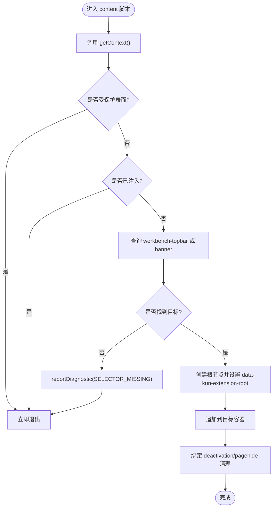
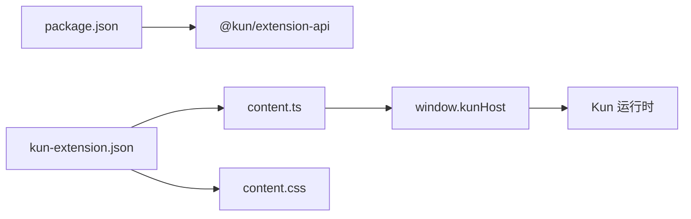

# 直接DOM操作扩展

<cite>
**本文引用的文件**
- [direct-dom/README.md](file://examples/extensions/direct-dom/README.md)
- [direct-dom/kun-extension.json](file://examples/extensions/direct-dom/kun-extension.json)
- [direct-dom/package.json](file://examples/extensions/direct-dom/package.json)
- [direct-dom/src/content/content.ts](file://examples/extensions/direct-dom/src/content/content.ts)
- [direct-dom/src/content/content.css](file://examples/extensions/direct-dom/src/content/content.css)
- [direct-dom/src/host/extension.ts](file://examples/extensions/direct-dom/src/host/extension.ts)
- [webview-and-dom.md](file://docs/extensions/webview-and-dom.md)
</cite>

## 目录
1. [简介](#简介)
2. [项目结构](#项目结构)
3. [核心组件](#核心组件)
4. [架构总览](#架构总览)
5. [详细组件分析](#详细组件分析)
6. [依赖关系分析](#依赖关系分析)
7. [性能与兼容性考虑](#性能与兼容性考虑)
8. [故障排除指南](#故障排除指南)
9. [结论](#结论)
10. [附录：最佳实践清单](#附录最佳实践清单)

## 简介
本文件面向 DeepSeek-GUI 的“直接 DOM 操作扩展”（Direct DOM），聚焦于在受控、隔离的 content-script 环境中对宿主工作台的可见 DOM 进行最小化、可回退的注入。该能力属于高风险特性，仅在明确授权且无法通过稳定贡献点或 Webview 表达时采用。文档涵盖工作原理、安全机制、消息与事件模型、CSP 与跨域限制、变更监听与冲突处理、样式隔离与性能优化，以及调试与排错方法。

## 项目结构
direct-dom 示例扩展由三部分构成：
- Manifest 与打包配置：声明 hostContentScripts、权限、入口与资源。
- Content 脚本与样式：在隔离 world 中运行，读取上下文、查找目标节点并插入只读提示标记。
- Host 入口：仅做生命周期占位，实际注入由 Manifest 静态声明。

图表来源
- [direct-dom/kun-extension.json:18-27](file://examples/extensions/direct-dom/kun-extension.json#L18-L27)
- [direct-dom/src/content/content.ts:1-46](file://examples/extensions/direct-dom/src/content/content.ts#L1-L46)
- [direct-dom/src/host/extension.ts:1-12](file://examples/extensions/direct-dom/src/host/extension.ts#L1-L12)

章节来源
- [direct-dom/kun-extension.json:1-34](file://examples/extensions/direct-dom/kun-extension.json#L1-L34)
- [direct-dom/package.json:1-21](file://examples/extensions/direct-dom/package.json#L1-L21)
- [direct-dom/README.md:1-27](file://examples/extensions/direct-dom/README.md#L1-L27)

## 核心组件
- Manifest 与权限
  - 通过 contributes.hostContentScripts 声明匹配 surface（workbench:*）、脚本与样式、runAt=documentEnd。
  - 请求 hostDom 权限，表示允许在隔离 world 中访问并修改可见 DOM。
- Content 脚本
  - 使用 window.kunHost.getContext() 获取扩展上下文与 marker。
  - 防御性检查受保护表面与重复注入。
  - 选择宿主顶部栏元素，若缺失则上报诊断并退出。
  - 创建根节点并附加 data-kun-extension-root，避免交互与覆盖。
  - 订阅 kun-extension-deactivate 与 pagehide 以清理。
- Host 入口
  - activate/deactivate 为占位实现；资源注入由 Manifest 静态管理。
- 样式
  - 基于 data-kun-extension-root 限定作用域，禁用指针事件以避免干扰宿主交互。

章节来源
- [direct-dom/kun-extension.json:18-31](file://examples/extensions/direct-dom/kun-extension.json#L18-L31)
- [direct-dom/src/content/content.ts:9-45](file://examples/extensions/direct-dom/src/content/content.ts#L9-L45)
- [direct-dom/src/content/content.css:1-17](file://examples/extensions/direct-dom/src/content/content.css#L1-L17)
- [direct-dom/src/host/extension.ts:1-12](file://examples/extensions/direct-dom/src/host/extension.ts#L1-L12)

## 架构总览
Direct DOM 扩展在 Kun 的隔离 world 中执行，仅暴露极窄的 content-script bridge。内容脚本通过 window.kunHost 读取上下文、上报诊断，并在找到目标节点后插入只读标记。所有资源由 Manifest 静态声明，运行时不可动态注入新脚本或样式。

图表来源
- [direct-dom/kun-extension.json:18-27](file://examples/extensions/direct-dom/kun-extension.json#L18-L27)
- [direct-dom/src/content/content.ts:12-45](file://examples/extensions/direct-dom/src/content/content.ts#L12-L45)
- [webview-and-dom.md:192-230](file://docs/extensions/webview-and-dom.md#L192-L230)

## 详细组件分析

### Content 脚本：安全注入与容错
- 上下文与标识
  - 通过 window.kunHost.getContext() 获取扩展元信息与 marker，用于样式与作用域隔离。
- 安全前置校验
  - 检测受保护表面属性，避免在敏感窗口注入。
  - 防止重复注入（通过根节点 id）。
- 目标定位与降级
  - 优先匹配 workbench-topbar，回退到 banner 角色节点。
  - 找不到目标时上报诊断并优雅退出，不抛出异常。
- DOM 插入与清理
  - 创建只读 span，设置 role=status，文本标注“不支持的选择器”。
  - 绑定 kun-extension-deactivate 与 pagehide 事件，确保卸载时移除节点与监听。

图表来源
- [direct-dom/src/content/content.ts:12-45](file://examples/extensions/direct-dom/src/content/content.ts#L12-L45)

章节来源
- [direct-dom/src/content/content.ts:1-46](file://examples/extensions/direct-dom/src/content/content.ts#L1-L46)

### Host 进程：静态资源与生命周期
- 资源注入策略
  - 所有 content 脚本与样式均在 Manifest 中静态声明，Host 不动态注入。
- 生命周期钩子
  - activate/deactivate 为空实现，资源清理由 Kun 在 deactivation 阶段统一处理。

章节来源
- [direct-dom/src/host/extension.ts:1-12](file://examples/extensions/direct-dom/src/host/extension.ts#L1-L12)
- [direct-dom/kun-extension.json:18-27](file://examples/extensions/direct-dom/kun-extension.json#L18-L27)

### 样式与作用域隔离
- 使用 data-kun-extension-root 限定样式作用域，避免泄漏到全局。
- 禁用 pointer-events，防止影响宿主交互。
- 使用系统字体与紧凑布局，减少视觉侵入。

章节来源
- [direct-dom/src/content/content.css:1-17](file://examples/extensions/direct-dom/src/content/content.css#L1-L17)

### 权限控制、CSP 与跨域限制
- 权限
  - 需要 hostDom 权限；仅在用户明确授予后生效。
- CSP
  - 默认严格：禁止远程脚本、内联脚本与 connect-src 直连；网络需走 Broker。
- 跨域
  - content script 无 Node/Electron 能力，不能发起任意网络请求；业务网络应迁移至 Host 或使用 Webview。

章节来源
- [direct-dom/kun-extension.json:29-31](file://examples/extensions/direct-dom/kun-extension.json#L29-L31)
- [webview-and-dom.md:64-79](file://docs/extensions/webview-and-dom.md#L64-L79)
- [webview-and-dom.md:210-230](file://docs/extensions/webview-and-dom.md#L210-L230)

### 消息传递、数据共享与事件处理
- 消息
  - 仅暴露 getContext() 与 reportDiagnostic()，前者返回冻结上下文，后者受 Schema 与速率限制。
- 数据共享
  - 通过 marker 与 data-kun-extension-root 在 DOM 层建立弱关联，避免全局变量。
- 事件
  - 监听 kun-extension-deactivate 与 pagehide，确保资源释放。

章节来源
- [webview-and-dom.md:224-230](file://docs/extensions/webview-and-dom.md#L224-L230)
- [direct-dom/src/content/content.ts:39-45](file://examples/extensions/direct-dom/src/content/content.ts#L39-L45)

### DOM 变更监听、实时同步与冲突解决
- 变更监听
  - 示例未使用 MutationObserver；如需监听宿主结构变化，应在 observer 中增加去抖与上限计数，并在 deactivation 时断开。
- 实时同步
  - 建议将状态收敛到单一根节点，避免多处写入导致闪烁。
- 冲突解决
  - 使用唯一 root id 与 data-kun-extension-root 标记，避免与其他扩展冲突。
  - 当宿主更新导致目标丢失，重新查询或上报诊断并回退。

[本节为通用方案说明，不直接分析具体文件]

### 复杂 UI 集成最佳实践
- 样式隔离
  - 始终使用 data-kun-extension-root 限定样式；避免覆盖宿主 CSS 变量。
- 事件冒泡
  - 不要拦截宿主事件；必要时使用捕获阶段的最小范围监听。
- 性能优化
  - 延迟到 documentEnd；批量更新 DOM；避免频繁重排；及时移除监听与定时器。

[本节为通用方案说明，不直接分析具体文件]

## 依赖关系分析
- 外部依赖
  - @kun/extension-api：提供类型与桥接契约（content-script 侧）。
- 内部依赖
  - Manifest 声明的 hostContentScripts 与 permissions。
  - Kun 运行时负责隔离 world、CSP、权限校验与生命周期管理。

图表来源
- [direct-dom/package.json:13-15](file://examples/extensions/direct-dom/package.json#L13-L15)
- [direct-dom/kun-extension.json:18-31](file://examples/extensions/direct-dom/kun-extension.json#L18-L31)
- [direct-dom/src/content/content.ts:1-6](file://examples/extensions/direct-dom/src/content/content.ts#L1-L6)

章节来源
- [direct-dom/package.json:1-21](file://examples/extensions/direct-dom/package.json#L1-L21)
- [direct-dom/kun-extension.json:1-34](file://examples/extensions/direct-dom/kun-extension.json#L1-L34)

## 性能与兼容性考虑
- 运行时机
  - documentEnd 保证 DOM 就绪后再注入，避免阻塞首屏。
- 资源体积
  - 脚本与样式单最大 2 MiB，一次计划总计不超过 8 MiB。
- 兼容性
  - 选择器失效属于不受支持依赖；必须对缺失目标容错并上报诊断。
- 内存与事件
  - 严格控制 observer/listener/timer 的生命周期，避免泄漏。

章节来源
- [direct-dom/kun-extension.json:18-27](file://examples/extensions/direct-dom/kun-extension.json#L18-L27)
- [webview-and-dom.md:203-209](file://docs/extensions/webview-and-dom.md#L203-L209)
- [webview-and-dom.md:274-289](file://docs/extensions/webview-and-dom.md#L274-L289)

## 故障排除指南
- 常见问题
  - 选择器未命中：检查 workbench 表面是否可用，必要时回退到更通用的 role 选择器。
  - 重复注入：确认根节点 id 存在即跳过。
  - 受保护表面：遇到 data-kun-protected-surface 属性时直接退出。
  - 样式不生效：确认 data-kun-extension-root 值与扩展标识一致。
- 诊断与日志
  - 使用 reportDiagnostic 上报 SELECTOR_MISSING 等结构化诊断，便于主进程聚合。
- 调试技巧
  - 在浏览器 DevTools 的 isolated world 中查看 content script 执行上下文。
  - 观察 kun-extension-deactivate 事件触发时机，验证清理逻辑。
  - 检查 CSP 报错，避免引入远程脚本或内联代码。

章节来源
- [direct-dom/src/content/content.ts:17-30](file://examples/extensions/direct-dom/src/content/content.ts#L17-L30)
- [webview-and-dom.md:224-230](file://docs/extensions/webview-and-dom.md#L224-L230)
- [webview-and-dom.md:274-289](file://docs/extensions/webview-and-dom.md#L274-L289)

## 结论
Direct DOM 扩展提供了在隔离 world 中对宿主可见 DOM 的最小化注入能力，适用于无法用稳定贡献点或 Webview 表达的极端场景。其核心在于：严格的权限与 CSP、极窄的 content-script bridge、健壮的目标选择与容错、以及完善的生命周期清理。生产环境应优先选择稳定 API 与 Webview；确需 Direct DOM 时，务必遵循本指南的安全与兼容性要求。

## 附录：最佳实践清单
- 仅在 manifest 中静态声明脚本与样式，不动态注入。
- 请求 hostDom 并通过用户授权流程启用。
- 使用 getContext().marker 与 data-kun-extension-root 隔离样式与节点。
- 对缺失目标优雅降级并上报诊断。
- 在 deactivation 与页面关闭时彻底清理监听与 DOM。
- 避免任何网络直连与敏感信息泄露；业务网络走 Broker 或 Webview。
- 保持 UI 非交互、低侵入，尊重宿主主题与可访问性。

[本节为通用指导，不直接分析具体文件]