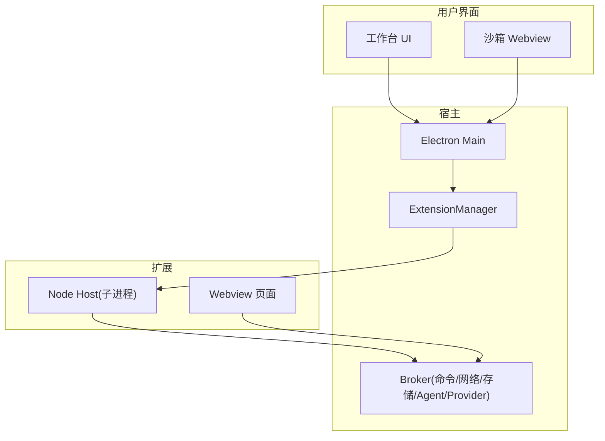
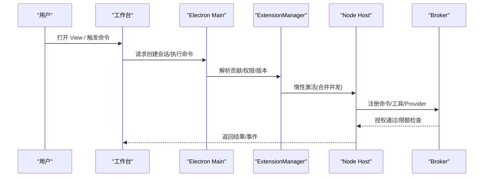
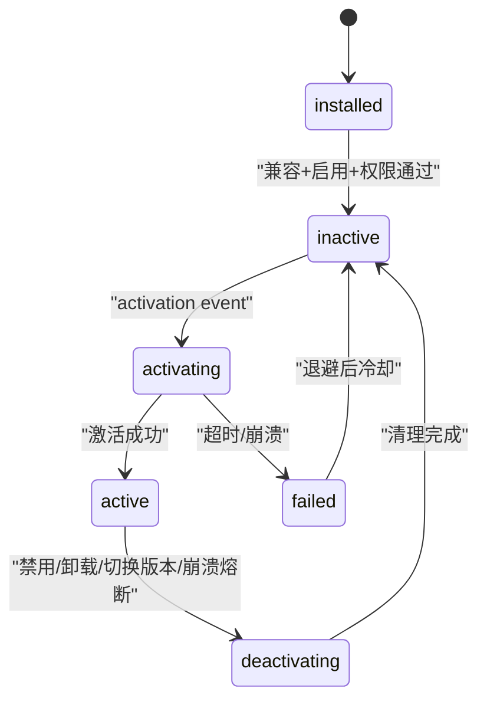
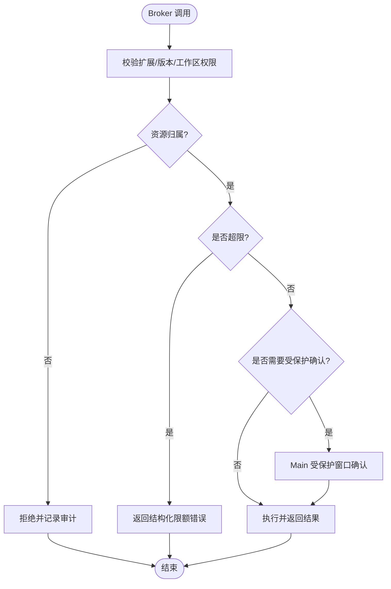
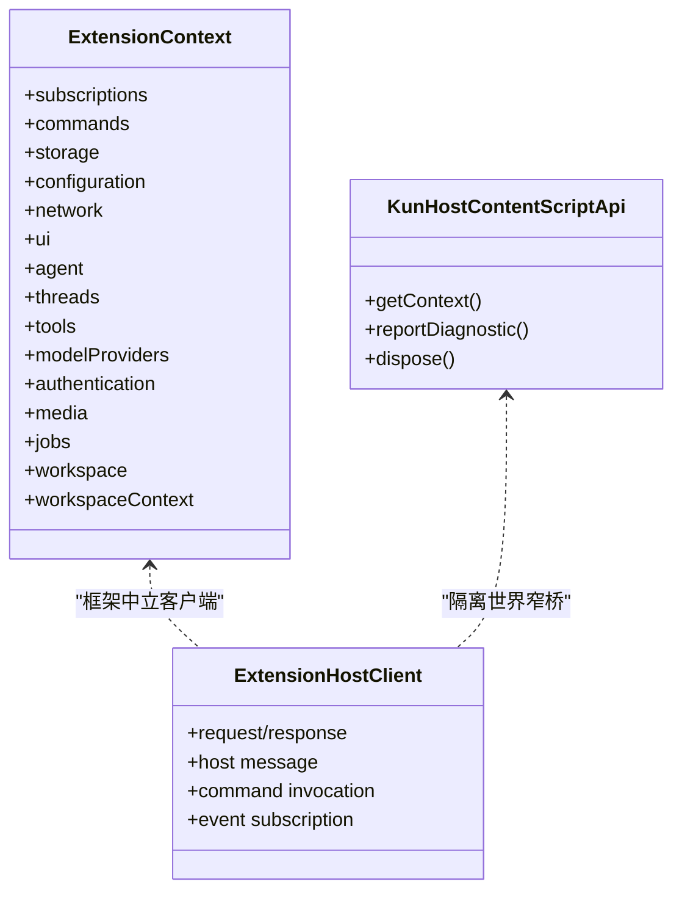
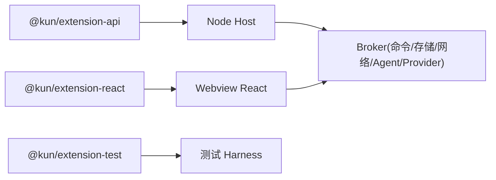

# 扩展系统

<cite>
**本文引用的文件**
- [docs/extensions/README.md](file://docs/extensions/README.md)
- [docs/extensions/architecture.md](file://docs/extensions/architecture.md)
- [docs/extensions/api-reference.md](file://docs/extensions/api-reference.md)
- [docs/extensions/lifecycle.md](file://docs/extensions/lifecycle.md)
- [docs/extensions/security-and-resources.md](file://docs/extensions/security-and-resources.md)
- [docs/extensions/workbench.md](file://docs/extensions/workbench.md)
- [docs/extensions/manifest.md](file://docs/extensions/manifest.md)
- [docs/extensions/webview-and-dom.md](file://docs/extensions/webview-and-dom.md)
- [docs/extensions/packaging-and-index.md](file://docs/extensions/packaging-and-index.md)
- [docs/extensions/quick-start.md](file://docs/extensions/quick-start.md)
- [docs/extensions/cli-testing-debugging.md](file://docs/extensions/cli-testing-debugging.md)
- [examples/extensions/README.md](file://examples/extensions/README.md)
</cite>

## 目录
1. [简介](#简介)
2. [项目结构](#项目结构)
3. [核心组件](#核心组件)
4. [架构总览](#架构总览)
5. [详细组件分析](#详细组件分析)
6. [依赖关系分析](#依赖关系分析)
7. [性能与资源限制](#性能与资源限制)
8. [故障排查指南](#故障排查指南)
9. [结论](#结论)
10. [附录：开发流程与示例](#附录开发流程与示例)

## 简介
本文件为 DeepSeek-GUI（Kun）扩展系统的权威技术文档，覆盖扩展架构、生命周期、权限与安全隔离、API 参考、类型分类、发现与安装、版本管理、调试与优化、以及完整开发到发布的实践路径。内容基于仓库内官方文档与 SDK 导出清单，确保行为描述与机器可执行 Schema/类型一致。

## 项目结构
- 文档位于 docs/extensions，提供从架构、Manifest、API、工作区贡献、Webview/Direct DOM、安全、打包、CLI 到快速开始的完整指引。
- 扩展示例位于 examples/extensions，涵盖右侧栏、工具提供者、模型 Provider、Direct DOM、媒体编辑等典型场景。
- 运行时与宿主逻辑由 Kun 主进程与 ExtensionManager 统一管理，扩展通过稳定 API 与 Broker 交互。

图表来源
- [docs/extensions/architecture.md:11-29](file://docs/extensions/architecture.md#L11-L29)
- [docs/extensions/api-reference.md:25-41](file://docs/extensions/api-reference.md#L25-L41)

章节来源
- [docs/extensions/README.md:1-96](file://docs/extensions/README.md#L1-L96)
- [docs/extensions/architecture.md:1-124](file://docs/extensions/architecture.md#L1-L124)

## 核心组件
- ExtensionManager：负责扩展注册、版本选择、激活事件路由、并发/速率/内存限制、崩溃熔断、日志与健康状态。
- Host Context 与 SDK：Node 入口接收 ExtensionContext；Webview 使用 ExtensionHostClient 与窄桥通信。
- Broker：统一承载命令、存储、网络、Agent、工具、Provider、账号、媒体、Job 等能力调用，并实施权限与配额检查。
- Manifest：声明入口、贡献点、激活事件、权限、本地化与版本信息，是静态发现与校验的权威。
- 工作区贡献：命令、视图、动作、设置、通知、上下文菜单、结果预览等，由宿主渲染与编排。
- Webview 与 Direct DOM：复杂 UI 使用沙箱 Webview；仅在必要时使用高风险 Direct DOM。
- 打包与索引：不可变 .kunx 包、完整性清单、侧载与自定义 Index，严格的安全上限与原子安装。

章节来源
- [docs/extensions/architecture.md:44-68](file://docs/extensions/architecture.md#L44-L68)
- [docs/extensions/api-reference.md:15-23](file://docs/extensions/api-reference.md#L15-L23)
- [docs/extensions/manifest.md:9-89](file://docs/extensions/manifest.md#L9-L89)
- [docs/extensions/workbench.md:1-45](file://docs/extensions/workbench.md#L1-L45)
- [docs/extensions/webview-and-dom.md:19-44](file://docs/extensions/webview-and-dom.md#L19-L44)
- [docs/extensions/packaging-and-index.md:9-23](file://docs/extensions/packaging-and-index.md#L9-L23)

## 架构总览
Kun 扩展平台不创建第二套 Agent runtime。所有对话、线程、工具、审批、事件、Provider 路由与用量均由唯一 kun serve 负责。扩展通过公开 Host Context 和 Broker 访问能力，且每次操作重新校验身份、权限、范围与配额。

图表来源
- [docs/extensions/architecture.md:44-68](file://docs/extensions/architecture.md#L44-L68)
- [docs/extensions/lifecycle.md:81-90](file://docs/extensions/lifecycle.md#L81-L90)

章节来源
- [docs/extensions/architecture.md:7-31](file://docs/extensions/architecture.md#L7-L31)
- [docs/extensions/lifecycle.md:81-90](file://docs/extensions/lifecycle.md#L81-L90)

## 详细组件分析

### 扩展生命周期与激活
- 状态机：installed → inactive → activating(active once) → active → deactivating → inactive/disabled/uninstalled；失败或崩溃进入有界退避重启或熔断。
- 静态发现：Manifest 标题、图标、贡献位置与 when 条件无需激活代码即可呈现。
- activate(context)：快速完成注册，将全部 Disposable 加入 context.subscriptions；deactivate() 用于收尾。
- 取消与终止：长操作需支持取消；terminal outcome 最多一个；未知外部副作用不得自动重试。
- View Session：每个复杂 View 独立 session，关闭/切换/禁用会清理订阅与资源。
- Headless：无 GUI 时 Node 工具/Provider/Agent profile 仍可激活；需要交互时返回结构化 interaction-required。

图表来源
- [docs/extensions/lifecycle.md:9-24](file://docs/extensions/lifecycle.md#L9-L24)
- [docs/extensions/lifecycle.md:92-105](file://docs/extensions/lifecycle.md#L92-L105)

章节来源
- [docs/extensions/lifecycle.md:28-90](file://docs/extensions/lifecycle.md#L28-L90)
- [docs/extensions/lifecycle.md:118-145](file://docs/extensions/lifecycle.md#L118-L145)

### 权限模型与安全隔离
- 信任模型：来源信任（签名仅证明来源）、执行信任（Webview 沙箱、Node 子进程非安全沙箱、Direct DOM 高风险）、工作区信任（按 workspace 生效）、单次操作信任（受保护窗口确认）。
- 权限规则：精确字符串权限；新增权限需受保护确认；每次操作重检；撤销立即阻止新调用；跨扩展默认隔离。
- 受保护表面：安装/升级、workspace trust、凭据输入、OAuth 回调、外部副作用审批等由 Main 专属窗口承载，生成短时单次 token。
- 存储类型：全局状态、工作区状态、View 状态、凭证库；禁止在 state/settings 中保存秘密。
- 网络 Broker：强制 HTTPS、DNS 校验、重定向重验、account scope、大小/并发/速率限制；生产直连策略严格。
- 工作区访问：path 规范化防穿越；权限撤销后后续操作失败。
- 默认限额：消息大小、激活/操作时限、流窗口、事件率、内存上限、日志轮转等。

图表来源
- [docs/extensions/security-and-resources.md:9-33](file://docs/extensions/security-and-resources.md#L9-L33)
- [docs/extensions/security-and-resources.md:34-47](file://docs/extensions/security-and-resources.md#L34-L47)
- [docs/extensions/security-and-resources.md:48-60](file://docs/extensions/security-and-resources.md#L48-L60)
- [docs/extensions/security-and-resources.md:96-123](file://docs/extensions/security-and-resources.md#L96-L123)
- [docs/extensions/security-and-resources.md:134-157](file://docs/extensions/security-and-resources.md#L134-L157)

章节来源
- [docs/extensions/security-and-resources.md:1-210](file://docs/extensions/security-and-resources.md#L1-L210)

### API 参考（宿主 API、Webview API、文件系统、IPC）
- 宿主 API（Node）：ExtensionContext 暴露 commands、storage、configuration、network、ui、agent、threads、tools、modelProviders、authentication、media、jobs、workspace、workspaceContext。
- Webview API：通过 ExtensionHostClient 与窄桥通信；React 绑定提供 useTheme/useLocale/useViewState/useHostMessage/useCommand/useAgentRun/useAccounts/useProviderStatus/useConfiguration 等。
- 文件系统访问：通过 workspace.read/write 与 Storage API；禁止直接读写包目录；路径规范化防穿越。
- IPC 通信：Host 与 Webview 之间通过受控 channel 与 schema-versioned payload；Content Script 通过 KunHostContentScriptApi 受限通信。

图表来源
- [docs/extensions/api-reference.md:25-68](file://docs/extensions/api-reference.md#L25-L68)
- [docs/extensions/webview-and-dom.md:81-125](file://docs/extensions/webview-and-dom.md#L81-L125)
- [docs/extensions/webview-and-dom.md:224-253](file://docs/extensions/webview-and-dom.md#L224-L253)

章节来源
- [docs/extensions/api-reference.md:15-120](file://docs/extensions/api-reference.md#L15-L120)
- [docs/extensions/webview-and-dom.md:81-125](file://docs/extensions/webview-and-dom.md#L81-L125)

### 扩展类型分类
- 侧边栏（views.rightSidebar）：推荐的可发现 UI 入口，独立标签与隔离 Webview。
- 工具面板（actions.topBar/composer/message、message.resultPreviews、settings、contextMenus、notifications）：宿主渲染的轻量交互与配置。
- 内容脚本（hostContentScripts）：高风险 Direct DOM，仅当必须读取/改写宿主可见 DOM 时使用。
- 协议处理器（modelProviders/authentication）：自定义模型 Provider 与认证流程，走 CapabilityRegistry/ToolHost/RemoteModelClient 归一化。

章节来源
- [docs/extensions/workbench.md:26-45](file://docs/extensions/workbench.md#L26-L45)
- [docs/extensions/manifest.md:159-187](file://docs/extensions/manifest.md#L159-L187)
- [docs/extensions/webview-and-dom.md:192-223](file://docs/extensions/webview-and-dom.md#L192-L223)

### 权限系统详解
- 声明式权限：Manifest permissions 数组，最小化原则；贡献隐含权限由 Validator 推导。
- 运行时授权：每次 Broker 操作重检 grant；撤销立即阻止新调用；在途调用按能力规则取消/失败。
- 沙箱限制：Webview 默认关闭 Node、启用 context isolation 与 sandbox；CSP 限制 connect-src；Direct DOM 在 isolated world 运行，仍属高风险 trusted-code。

章节来源
- [docs/extensions/manifest.md:189-208](file://docs/extensions/manifest.md#L189-L208)
- [docs/extensions/security-and-resources.md:34-47](file://docs/extensions/security-and-resources.md#L34-L47)
- [docs/extensions/webview-and-dom.md:31-44](file://docs/extensions/webview-and-dom.md#L31-L44)

### 扩展发现、安装与版本管理
- 发现：静态 Manifest 发现贡献与权限；GUI 不后台拉取 Index；用户主动 refresh/browse。
- 安装：.kunx 不可变 ZIP；完整性清单验证；受保护权限审查；原子移动版本目录并切换 selected version；保留 previous 以支持回滚。
- 版本：version（包）、manifestVersion（Schema）、apiVersion（SDK）、stateSchemaVersion（持久状态）、engines.kun（宿主兼容）五维独立；迁移发生在激活前，失败回滚旧版本与状态。

章节来源
- [docs/extensions/packaging-and-index.md:137-161](file://docs/extensions/packaging-and-index.md#L137-L161)
- [docs/extensions/manifest.md:117-129](file://docs/extensions/manifest.md#L117-L129)
- [docs/extensions/lifecycle.md:157-159](file://docs/extensions/lifecycle.md#L157-L159)

## 依赖关系分析
- 扩展对宿主依赖：通过 @kun/extension-api 的公开导出；不依赖内部模块、Electron、renderer store、私有 HTTP/RPC。
- 宿主对扩展约束：Manifest 校验、贡献引用、权限最小化、资源根与完整性清单、headless 要求 main。
- 运行时边界：ExtensionManager 控制并发、队列、速率、内存、熔断；单个扩展失败不影响其它扩展。

图表来源
- [docs/extensions/api-reference.md:15-23](file://docs/extensions/api-reference.md#L15-L23)
- [docs/extensions/architecture.md:112-123](file://docs/extensions/architecture.md#L112-L123)

章节来源
- [docs/extensions/api-reference.md:86-120](file://docs/extensions/api-reference.md#L86-L120)
- [docs/extensions/architecture.md:108-123](file://docs/extensions/architecture.md#L108-L123)

## 性能与资源限制
- 默认限额：单 IPC 消息 1 MiB、激活时限 15s、一般操作 60s、取消宽限 2s、关停 5s、每扩展并发 16、流窗口 32 事件或 4 MiB、事件率 200/s、Node 内存上限 256 MiB、连续崩溃阈值 3、日志轮转 5 MiB×3、状态文档 10 MiB、迁移时限 30s、网络请求体 8 MiB。
- 背压与释放：生产者等待 ack，队列 item/bytes 双上限，cursor 重连持久事件源，cancel/terminal 后释放 buffer/timer/listener/correlation。
- 包限额：压缩 .kunx 100 MiB、展开总量 250 MiB、单文件 25 MiB、文件数 5,000；平台策略可收紧。

章节来源
- [docs/extensions/security-and-resources.md:134-157](file://docs/extensions/security-and-resources.md#L134-L157)
- [docs/extensions/security-and-resources.md:159-167](file://docs/extensions/security-and-resources.md#L159-L167)
- [docs/extensions/packaging-and-index.md:111-123](file://docs/extensions/packaging-and-index.md#L111-L123)

## 故障排查指南
- 诊断命令：doctor 显示选中/安装版本、来源/摘要/签名、enablement、权限快照、Manifest/API/Kun/RPC 协商、state schema、Host PID、激活原因、重启/熔断、限额失败、最近结构化错误与日志位置。
- 日志：按扩展 ID、版本、进程实例分离并轮转；避免记录密钥、token、完整 prompt/body。
- 常见错误码：INVALID_ARGUMENT、VALIDATION_FAILED、PERMISSION_DENIED、NOT_FOUND、CONFLICT、UNSUPPORTED_CAPABILITY、INCOMPATIBLE_API/MANIFEST/ENGINE/RPC、ACTIVATION_FAILED/TIMEOUT、HOST_UNAVAILABLE、CANCELLED、BUDGET_EXHAUSTED、RESOURCE_LIMIT、INTERACTION_REQUIRED、PROVIDER_UNAVAILABLE、ACCOUNT_REQUIRED、PROTOCOL_ERROR、INTERNAL_ERROR。
- 调试循环：build → test → validate → pack → install → reload → doctor → logs。

章节来源
- [docs/extensions/cli-testing-debugging.md:133-188](file://docs/extensions/cli-testing-debugging.md#L133-L188)
- [docs/extensions/cli-testing-debugging.md:272-291](file://docs/extensions/cli-testing-debugging.md#L272-L291)
- [docs/extensions/security-and-resources.md:168-195](file://docs/extensions/security-and-resources.md#L168-L195)

## 结论
Kun 扩展系统以“身份绑定 + 最小权限 + 受保护确认 + 有界资源”为核心，提供稳定的 SDK、严格的宿主边界与完善的发布/诊断工具链。开发者应优先使用稳定贡献点与 Webview，仅在必要时采用 Direct DOM；遵循最小权限、幂等与背压设计，并通过 CLI 与测试 harness 进行持续验证。

## 附录：开发流程与示例

### 从零到发布（快速开始）
- 环境准备：安装 Kun CLI、Node LTS、npm；确认脚手架可用。
- 创建项目：npx create-kun-extension，选择 node/webview/react 模板。
- 理解 Manifest：声明 main/browser、activationEvents、contributes、permissions、stateSchemaVersion。
- 实现与释放：activate 中注册命令/工具/Provider，并将 Disposable 加入 subscriptions。
- 构建与测试：build → test → validate；开发加载使用 --development 与 reload。
- 打包与侧载：pack 生成 .kunx；install 完成受保护审查与原子安装。
- 查看日志与清理：logs → disable → uninstall；卸载默认保留状态与日志。

章节来源
- [docs/extensions/quick-start.md:9-193](file://docs/extensions/quick-start.md#L9-L193)

### 示例扩展一览
- hello-sidebar：沙箱右侧栏 View、主题/语言、持久 View 状态。
- workspace-dashboard：编辑器仪表板、命名空间命令、工作区读取、Storage、Host 消息。
- agent-assistant：扩展自有 Agent run、可重放事件、取消、自有 thread 历史。
- presentation-studio：修订版独立 HTML 幻灯片、可视化编辑、类型化 Agent 操作、安全投影。
- social-media-sidebar：桌面/移动端浏览器页面（抖音、B站、小红书），受控外部站点。
- tool-provider：命名空间类型化工具、进度、取消、工作区访问。
- streaming-model-provider：API Key 与 OAuth 账号绑定、标准化模型流、用量、取消、无 fallback 错误。
- direct-dom：高风险隔离世界 content script，有限且容错的 DOM 变更。
- kun-video-editor：参考 v1.1 右侧栏 View、受保护媒体、Agent 工具、Job、生成产物。

章节来源
- [examples/extensions/README.md:1-80](file://examples/extensions/README.md#L1-L80)