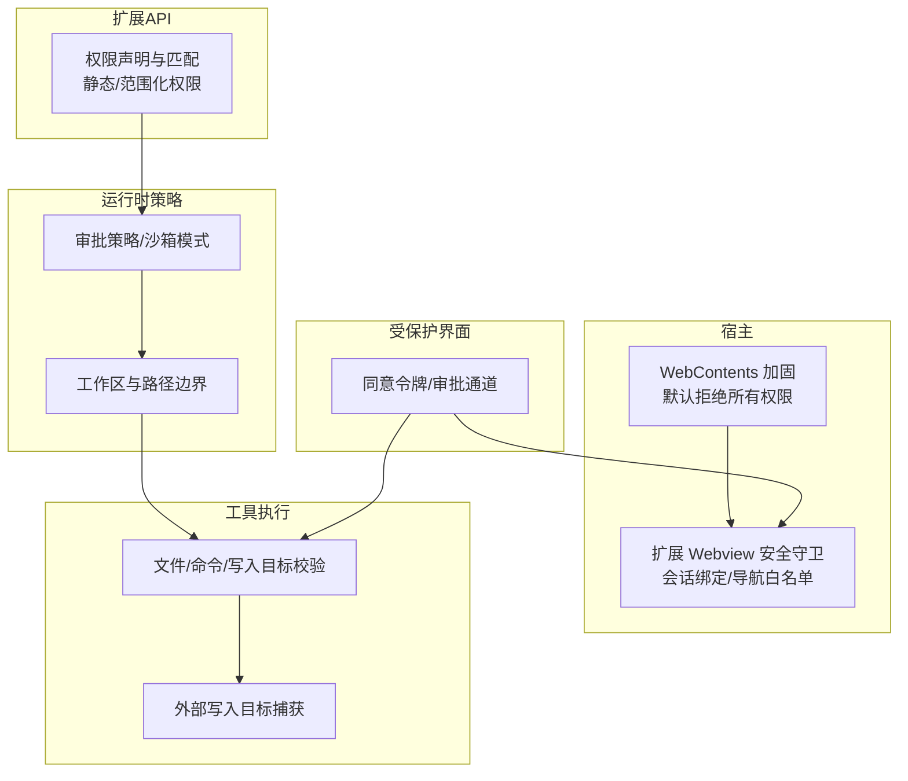
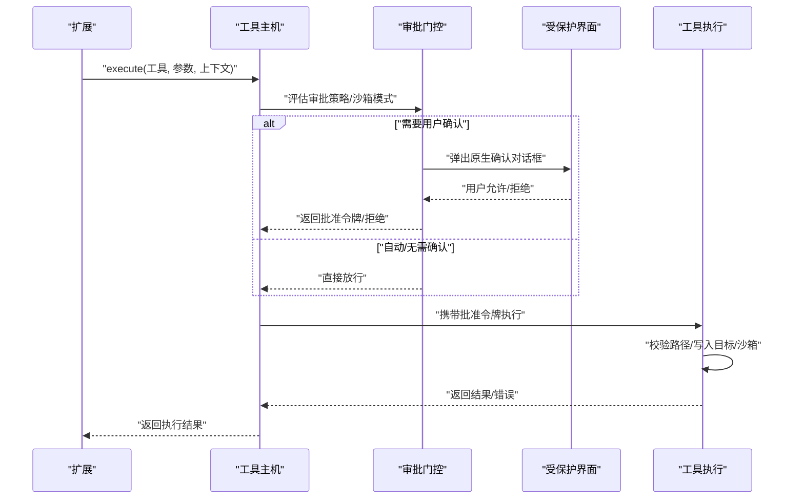
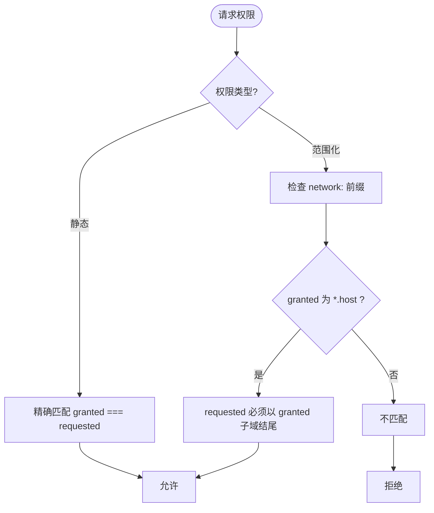
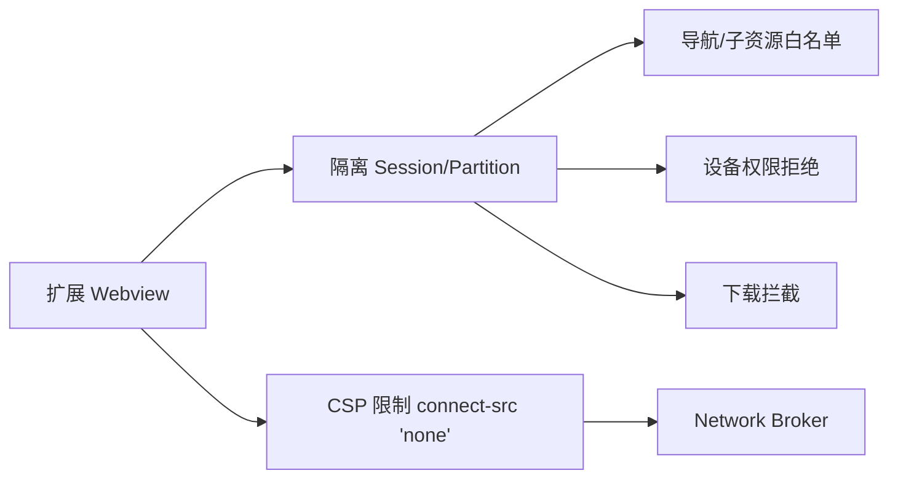
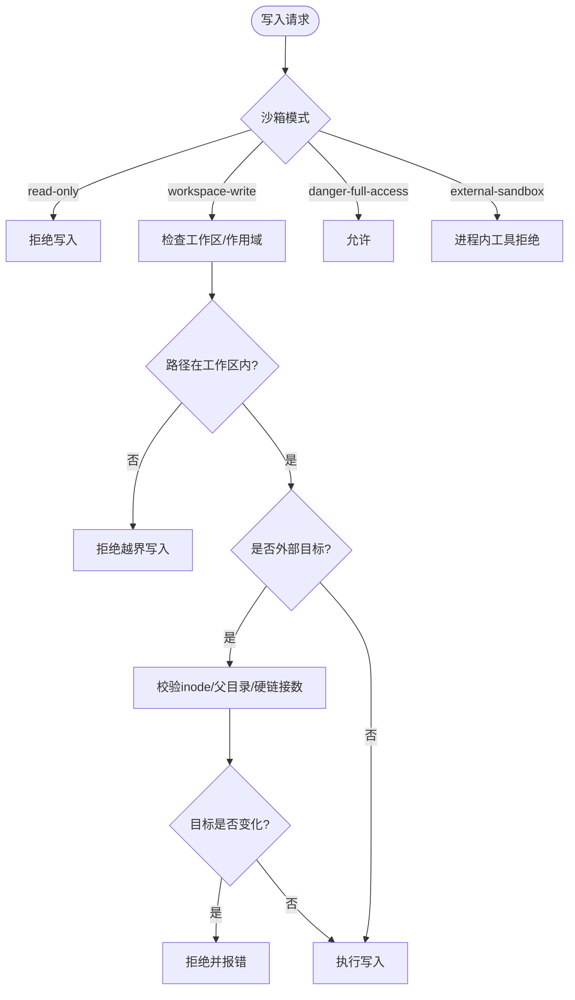
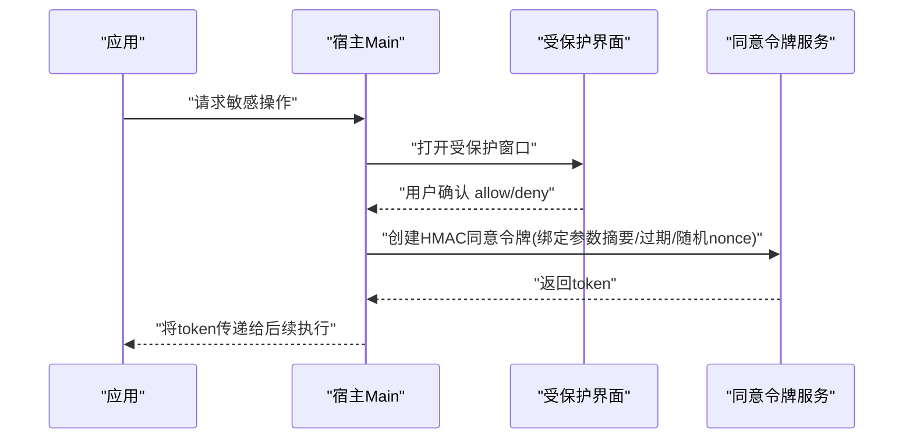
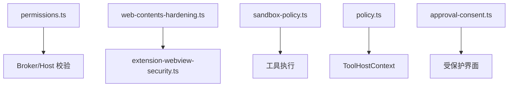

# 权限与安全模型

<cite>
**本文引用的文件**
- [security-and-resources.md](file://docs/extensions/security-and-resources.md)
- [webview-and-dom.md](file://docs/extensions/webview-and-dom.md)
- [permissions.ts](file://packages/extension-api/src/permissions.ts)
- [web-contents-hardening.ts](file://src/main/browser-security/web-contents-hardening.ts)
- [extension-webview-security.ts](file://src/main/extensions/extension-webview-security.ts)
- [untrusted-content.ts](file://kun/src/security/untrusted-content.ts)
- [policy.ts](file://kun/src/contracts/policy.ts)
- [tool-host.ts](file://kun/src/ports/tool-host.ts)
- [sandbox-policy.ts](file://kun/src/adapters/tool/sandbox-policy.ts)
- [approval-consent.ts](file://src/main/approval-consent.ts)
</cite>

## 目录
1. [简介](#简介)
2. [项目结构](#项目结构)
3. [核心组件](#核心组件)
4. [架构总览](#架构总览)
5. [详细组件分析](#详细组件分析)
6. [依赖关系分析](#依赖关系分析)
7. [性能与资源限制](#性能与资源限制)
8. [故障排查指南](#故障排查指南)
9. [结论](#结论)
10. [附录：最佳实践与安全建议](#附录最佳实践与安全建议)

## 简介
本文件面向 DeepSeek-GUI 扩展的权限与安全模型，系统性说明声明式权限、运行时授权、安全隔离（Webview 沙箱、文件系统访问控制、网络请求限制）、敏感操作审批流程、常见威胁防护以及权限检查与错误处理实现要点。文档同时提供可操作的配置建议与排障指引，帮助扩展作者以最小权限原则构建安全可靠的扩展。

## 项目结构
DeepSeek-GUI 的安全能力由“宿主（Electron Main）+ 扩展运行时 + 工具执行环境”共同构成：
- 宿主层负责 Webview 加固、会话隔离、导航与下载拦截、设备权限拒绝等。
- 扩展 API 层定义静态与范围化权限集合及匹配规则。
- 运行时策略层定义审批策略、沙箱模式与工作区边界。
- 工具执行层在沙箱内校验路径、命令与写入目标，必要时触发用户审批。
- 受保护界面与同意令牌用于关键交互（安装、权限变更、secret reveal、外部副作用等）。

图表来源
- [web-contents-hardening.ts:1-33](file://src/main/browser-security/web-contents-hardening.ts#L1-L33)
- [extension-webview-security.ts:25-118](file://src/main/extensions/extension-webview-security.ts#L25-L118)
- [permissions.ts:1-54](file://packages/extension-api/src/permissions.ts#L1-L54)
- [policy.ts:1-129](file://kun/src/contracts/policy.ts#L1-L129)
- [sandbox-policy.ts:128-236](file://kun/src/adapters/tool/sandbox-policy.ts#L128-L236)
- [approval-consent.ts:1-29](file://src/main/approval-consent.ts#L1-L29)

章节来源
- [security-and-resources.md:1-210](file://docs/extensions/security-and-resources.md#L1-L210)
- [webview-and-dom.md:1-300](file://docs/extensions/webview-and-dom.md#L1-L300)

## 核心组件
- 权限声明与匹配：通过静态权限列表与范围化权限（如 network:*、accounts.*）进行精确授权，支持通配符子域匹配与严格主机名匹配。
- Webview 安全基线：禁用 Node 集成、启用上下文隔离与 Chromium sandbox，拒绝设备权限与下载，限制导航到白名单。
- 审批策略与沙箱模式：按线程/任务粒度设置审批策略（always/on-request/untrusted/never/auto/suggest）与沙箱模式（read-only/workspace-write/danger-full-access/external-sandbox），并据此决定工具可见性与执行边界。
- 工具执行与路径约束：对文件读写、命令执行进行沙箱判定；对外部写入目标进行物理路径解析与稳定性校验，防止符号链接逃逸。
- 受保护界面与同意令牌：关键操作必须通过宿主创建的独立窗口完成，生成短时、单次、参数摘要绑定的 HMAC 同意令牌，防重放与过期。

章节来源
- [permissions.ts:1-54](file://packages/extension-api/src/permissions.ts#L1-L54)
- [web-contents-hardening.ts:1-33](file://src/main/browser-security/web-contents-hardening.ts#L1-L33)
- [extension-webview-security.ts:120-286](file://src/main/extensions/extension-webview-security.ts#L120-L286)
- [policy.ts:1-129](file://kun/src/contracts/policy.ts#L1-L129)
- [sandbox-policy.ts:40-111](file://kun/src/adapters/tool/sandbox-policy.ts#L40-L111)
- [approval-consent.ts:1-29](file://src/main/approval-consent.ts#L1-L29)

## 架构总览
下图展示一次需要用户确认的文件写入或命令执行的典型调用链：扩展发起工具调用 → 运行时策略判定是否需要审批 → 若需要则进入受保护界面 → 用户确认后签发同意令牌 → 工具执行前再次校验路径与沙箱 → 执行并返回结果。

图表来源
- [policy.ts:1-129](file://kun/src/contracts/policy.ts#L1-L129)
- [sandbox-policy.ts:128-236](file://kun/src/adapters/tool/sandbox-policy.ts#L128-L236)
- [approval-consent.ts:1-29](file://src/main/approval-consent.ts#L1-L29)
- [tool-host.ts:107-212](file://kun/src/ports/tool-host.ts#L107-L212)

## 详细组件分析

### 声明式权限与运行时授权
- 静态权限：如 commands.register、ui.views、storage.global/workspace、workspace.read/write、media.*、jobs.manage 等，用于声明扩展所需的基础能力。
- 范围化权限：network:<hostname> 与 accounts.*:<providerId>，要求精确匹配或通过 *.example.com 通配符匹配子域；每次 operation 都会基于当前 grant 重新检查，且只能缩小不能扩大。
- 匹配规则：permissionMatches 支持 exact 与 wildcard 子域匹配；hasPermission 用于批量判断是否具备某项权限。

图表来源
- [permissions.ts:29-54](file://packages/extension-api/src/permissions.ts#L29-L54)

章节来源
- [permissions.ts:1-54](file://packages/extension-api/src/permissions.ts#L1-L54)
- [security-and-resources.md:34-47](file://docs/extensions/security-and-resources.md#L34-L47)

### Webview 沙箱与隔离
- 基线加固：禁用 Node 集成、Worker/SubFrame 集成，启用 contextIsolation、Chromium sandbox、webSecurity，禁止不安全内容、webviewTag、拖拽导航、自动播放等。
- 会话隔离：为每个扩展 View 创建独立 partition，拒绝设备权限、下载，拦截未授权导航与子资源。
- 外部网站视图：仅允许已声明 host 的 HTTPS/WSS/data/blob 子资源，顶层导航与 popup 复用 guest，cookie/session 隔离于扩展 ID 分区。
- CSP 与直连限制：connect-src 'none' 阻止浏览器直连网络，必须通过 Kun Network Broker；CSP 由宿主与 Schema 控制，不允许远程脚本与 eval。

图表来源
- [web-contents-hardening.ts:1-33](file://src/main/browser-security/web-contents-hardening.ts#L1-L33)
- [extension-webview-security.ts:25-118](file://src/main/extensions/extension-webview-security.ts#L25-L118)
- [extension-webview-security.ts:170-215](file://src/main/extensions/extension-webview-security.ts#L170-L215)
- [webview-and-dom.md:64-78](file://docs/extensions/webview-and-dom.md#L64-L78)
- [webview-and-dom.md:156-174](file://docs/extensions/webview-and-dom.md#L156-L174)

章节来源
- [web-contents-hardening.ts:1-33](file://src/main/browser-security/web-contents-hardening.ts#L1-L33)
- [extension-webview-security.ts:120-286](file://src/main/extensions/extension-webview-security.ts#L120-L286)
- [webview-and-dom.md:1-300](file://docs/extensions/webview-and-dom.md#L1-L300)

### 文件系统访问控制与外部写入目标
- 沙箱模式：read-only 禁止写入；workspace-write 允许工作区内写入；danger-full-access 放开全部；external-sandbox 由进程外工具强制执行。
- 路径边界：计算工作区根与附加工作区，规范化路径并防止 traversal/symlink escape；写入前再次比对物理路径与 inode/device，确保稳定身份。
- 外部写入目标捕获：针对 file_change 工具，收集待写入的物理目标，并在审批提示时显示真实路径；若目标变化或不符合规范，拒绝执行。
- 命令执行限制：在窄路径边界下，command_execution 工具被阻断；workspace-write 仅暴露内置 shell 工具并通过每命令审批。

图表来源
- [sandbox-policy.ts:128-236](file://kun/src/adapters/tool/sandbox-policy.ts#L128-L236)
- [sandbox-policy.ts:40-111](file://kun/src/adapters/tool/sandbox-policy.ts#L40-L111)

章节来源
- [sandbox-policy.ts:128-236](file://kun/src/adapters/tool/sandbox-policy.ts#L128-L236)
- [sandbox-policy.ts:40-111](file://kun/src/adapters/tool/sandbox-policy.ts#L40-L111)
- [security-and-resources.md:128-133](file://docs/extensions/security-and-resources.md#L128-L133)

### 网络请求限制与认证
- 精确 hostname 优先，必要时显式子域通配；生产直连只接受 public-unicast 地址，出现 loopback/private/link-local/multicast/reserved 等非公网地址即 fail closed。
- 每次请求校验 scheme、DNS 结果、socket 目标、redirect 后目标、account/workspace scope、method/header/body schema、超时、响应字节、并发与速率。
- Redirect 使用 manual/error 模式，调用方需重新发起 Broker 请求以重验权限与凭证；View 直连 fetch/WebSocket 被 CSP 阻止。
- 认证请求仅传 account reference，Broker 注入认证并移除响应中的 credential header。

章节来源
- [security-and-resources.md:96-127](file://docs/extensions/security-and-resources.md#L96-L127)
- [webview-and-dom.md:176-186](file://docs/extensions/webview-and-dom.md#L176-L186)

### 敏感操作审批流程与同意令牌
- 受保护界面：安装/升级、权限变更、workspace trust、credential/secret 输入、OAuth 完成、外部副作用审批等必须由宿主创建的独立窗口承载，不加载扩展 Webview/content script。
- 同意令牌：用户确认后生成短时、单次、HMAC 签名的 consent token，绑定 approvalId、decision、expiry、nonce、extension/version、parameter digest、workspace、window session；缺失、伪造、重放、过期或参数变化均失败。
- 审批通道：出现 pending/submitting 审批时，撤销当前工作台 content-script binding 并 reload 清理遗留监听器；按钮仅接受可信用户事件，通用 bridge 不得访问审批路由。

图表来源
- [approval-consent.ts:1-29](file://src/main/approval-consent.ts#L1-L29)
- [webview-and-dom.md:254-273](file://docs/extensions/webview-and-dom.md#L254-L273)

章节来源
- [approval-consent.ts:1-29](file://src/main/approval-consent.ts#L1-L29)
- [webview-and-dom.md:254-273](file://docs/extensions/webview-and-dom.md#L254-L273)
- [security-and-resources.md:48-60](file://docs/extensions/security-and-resources.md#L48-L60)

### 不可信内容包装与渲染安全
- 对来自外部的内容使用统一包装标签并转义属性，避免 XSS 与属性注入。
- 结合 CSP 与 Webview 隔离，确保不可信内容无法执行脚本或加载不受控资源。

章节来源
- [untrusted-content.ts:1-16](file://kun/src/security/untrusted-content.ts#L1-L16)
- [webview-and-dom.md:64-78](file://docs/extensions/webview-and-dom.md#L64-L78)

## 依赖关系分析
- 权限模块依赖 Zod 进行 Schema 校验与枚举约束；权限匹配函数被上层 Broker/Host 用于每次操作校验。
- Webview 安全守卫依赖 Electron Session/WebPreferences 与扩展视图会话注册表，确保导航、子资源与设备权限受控。
- 工具沙箱策略依赖工作区路径解析与文件系统元数据，保证写入目标稳定且位于授权范围内。
- 审批策略与沙箱模式作为运行时上下文字段，贯穿工具执行生命周期，影响工具可见性、执行边界与审批触发。

图表来源
- [permissions.ts:1-54](file://packages/extension-api/src/permissions.ts#L1-L54)
- [web-contents-hardening.ts:1-33](file://src/main/browser-security/web-contents-hardening.ts#L1-L33)
- [extension-webview-security.ts:25-118](file://src/main/extensions/extension-webview-security.ts#L25-L118)
- [sandbox-policy.ts:128-236](file://kun/src/adapters/tool/sandbox-policy.ts#L128-L236)
- [policy.ts:1-129](file://kun/src/contracts/policy.ts#L1-L129)
- [approval-consent.ts:1-29](file://src/main/approval-consent.ts#L1-L29)

章节来源
- [permissions.ts:1-54](file://packages/extension-api/src/permissions.ts#L1-L54)
- [extension-webview-security.ts:25-118](file://src/main/extensions/extension-webview-security.ts#L25-L118)
- [sandbox-policy.ts:128-236](file://kun/src/adapters/tool/sandbox-policy.ts#L128-L236)
- [policy.ts:1-129](file://kun/src/contracts/policy.ts#L1-L129)
- [approval-consent.ts:1-29](file://src/main/approval-consent.ts#L1-L29)

## 性能与资源限制
- 默认运行时限额：单 IPC 消息、激活/操作截止时间、取消宽限、关闭截止时间、并发上限、流窗口、事件速率、内存上限、日志轮转、状态文档大小、网络请求体大小等均有基线值；达到限额返回结构化错误，不得用无限队列/重试规避。
- 背压与释放：生产者等待 ack，队列有 item/bytes 双上限；取消/终止后释放 buffer、timer、listener 与关联；扩展禁用/卸载先 fence 新调用再 cancel/deactivate。
- 审计与诊断：doctor 输出应包含版本、签名、enablement、权限快照、negotiation、schema、limit failures 与最近结构化错误；日志脱敏，避免记录密钥、token、完整 prompt/附件与大 body。

章节来源
- [security-and-resources.md:134-196](file://docs/extensions/security-and-resources.md#L134-L196)

## 故障排查指南
- 权限被拒：检查 Manifest 中是否声明了精确 hostname 或必要通配符；确认用户已在受保护界面接受权限；注意每次 operation 都会重新校验 grant。
- Webview 导航失败：确认 URL 属于 kun-extension:// 或已授权的 external host；检查 CSP 是否阻止 connect-src；避免拼接用户输入形成资源 URL。
- 文件写入失败：核对沙箱模式与作用域；确认路径在工作区内；外部写入目标需通过审批并满足 inode/父目录/硬链接数等稳定性要求。
- 命令执行被阻断：在窄路径边界下 command_execution 会被拒绝；如需终端命令，需在设置中调整沙箱模式并接受相应风险提示。
- 同意令牌无效：确认 token 未过期、未被重放、参数摘要一致；检查是否在受保护界面生成并由宿主内部传递。

章节来源
- [permissions.ts:29-54](file://packages/extension-api/src/permissions.ts#L29-L54)
- [webview-and-dom.md:45-78](file://docs/extensions/webview-and-dom.md#L45-L78)
- [sandbox-policy.ts:128-236](file://kun/src/adapters/tool/sandbox-policy.ts#L128-L236)
- [approval-consent.ts:1-29](file://src/main/approval-consent.ts#L1-L29)

## 结论
DeepSeek-GUI 的权限与安全模型围绕“身份绑定 + 最小权限 + 受保护界面 + 有界资源”展开，通过声明式权限、严格的 Webview 沙箱、细粒度的文件系统与网络限制、以及强化的审批与同意令牌机制，有效降低恶意代码与误用风险。扩展开发者应遵循最小权限原则，使用宿主提供的安全 API，并对所有外部输入与副作用进行校验与审批。

## 附录：最佳实践与安全建议
- 默认 browser-only：仅在确有需要时才添加 Node main；优先使用 Webview 与稳定贡献点。
- 最小权限声明：精确 hostname、最小 workspace/UI 权限；高风险权限（accounts.secrets.read、hostDom）新增时必须重新确认。
- 不在 state/settings/logs/messages 中存储 secret；使用 Account Broker 管理凭证。
- 所有 stream/queue/cache 设置 bytes/items/time 上限；取消/销毁幂等，丢弃晚到结果。
- 外部副作用准确声明；不自动重试未知结果。
- 发布前使用 doctor、测试 harness 与 release checklist 验证 redaction、denial 与 crash path。
- 对不可信内容进行包装与转义，结合 CSP 与 Webview 隔离渲染。
- 使用 approvedExternalWriteTargets 捕获真实写入目标，并在执行前再次校验。
- 网络请求走 Broker，避免浏览器直连；Redirect 后重新发起请求以重验权限与凭证。

章节来源
- [security-and-resources.md:197-210](file://docs/extensions/security-and-resources.md#L197-L210)
- [webview-and-dom.md:192-223](file://docs/extensions/webview-and-dom.md#L192-L223)
- [sandbox-policy.ts:40-111](file://kun/src/adapters/tool/sandbox-policy.ts#L40-L111)
- [untrusted-content.ts:1-16](file://kun/src/security/untrusted-content.ts#L1-L16)