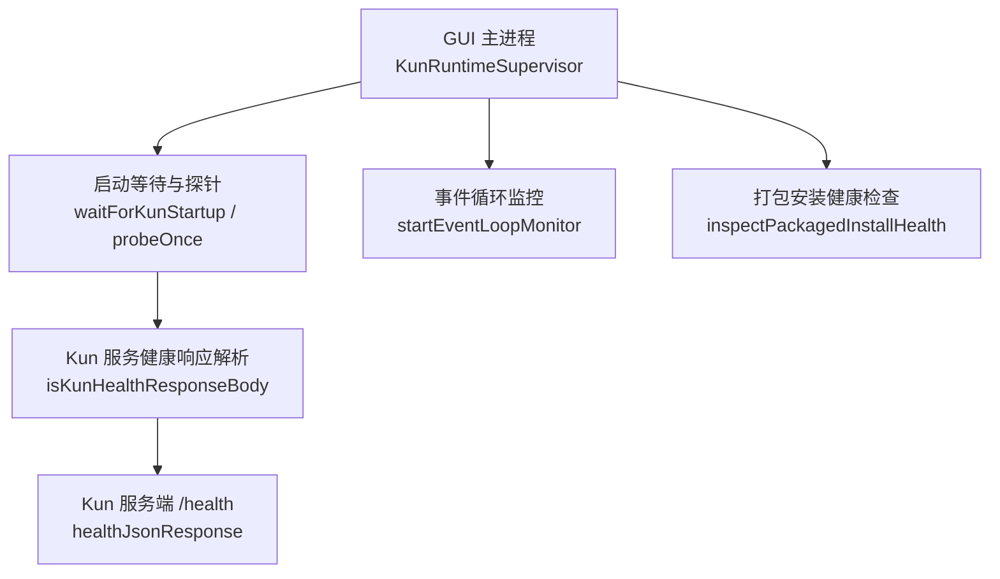
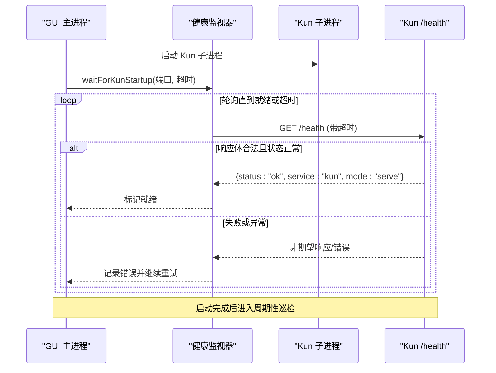
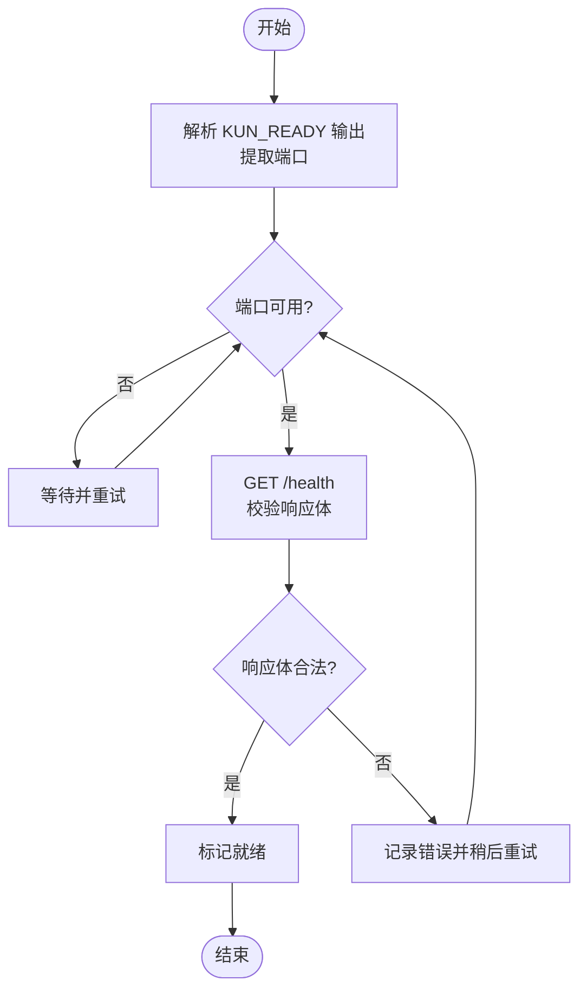
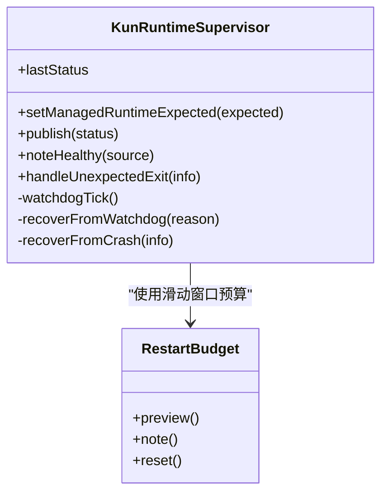
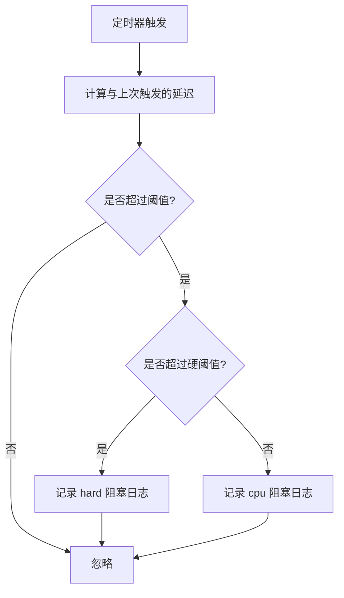
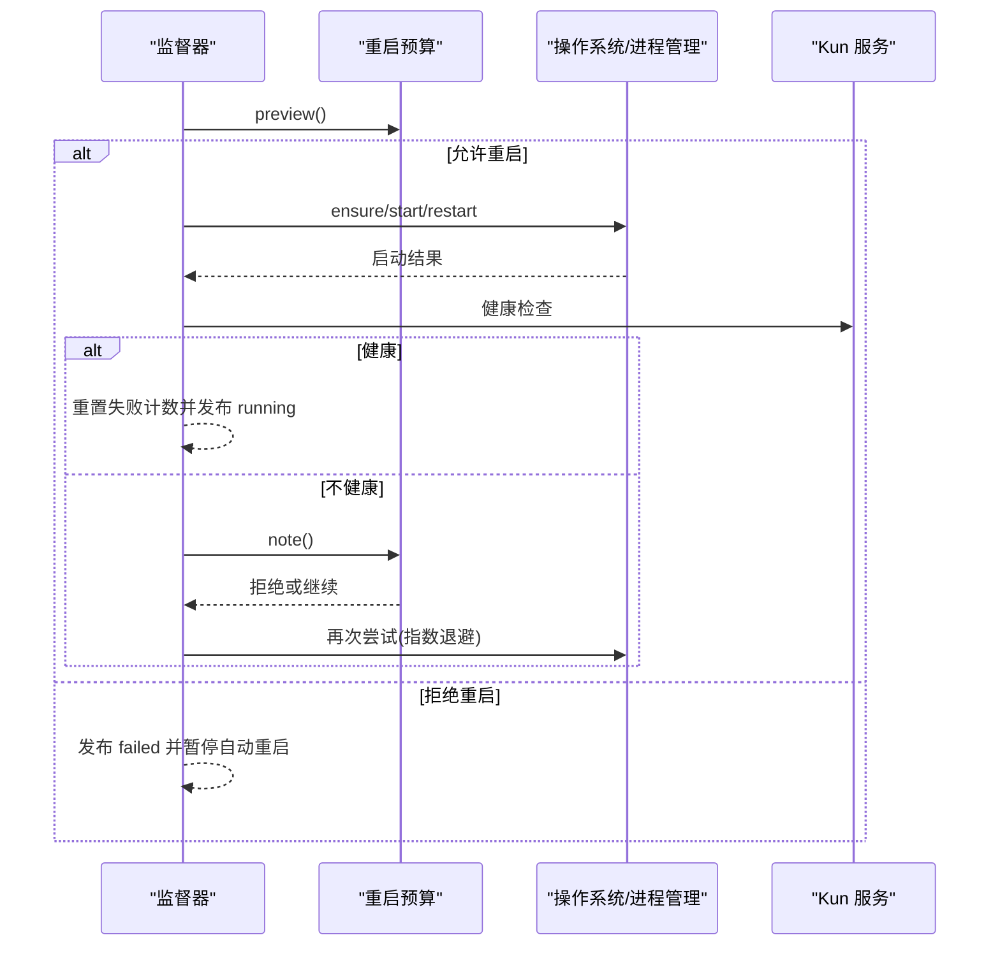
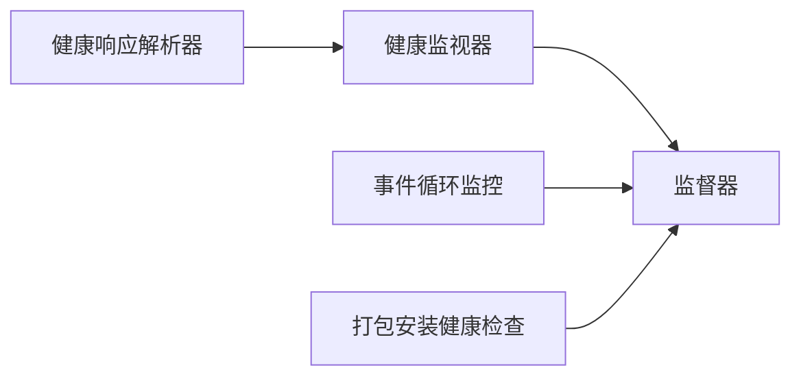

# 健康检查

<cite>
**本文引用的文件**
- [src/main/kun-health.ts](file://src/main/kun-health.ts)
- [kun/src/server/routes/health.ts](file://kun/src/server/routes/health.ts)
- [src/main/runtime/kun-runtime-health-monitor.ts](file://src/main/runtime/kun-runtime-health-monitor.ts)
- [src/main/kun-runtime-supervisor.ts](file://src/main/kun-runtime-supervisor.ts)
- [src/main/packaged-install-health.ts](file://src/main/packaged-install-health.ts)
- [kun/src/server/event-loop-monitor.ts](file://kun/src/server/event-loop-monitor.ts)
</cite>

## 目录
1. [简介](#简介)
2. [项目结构](#项目结构)
3. [核心组件](#核心组件)
4. [架构总览](#架构总览)
5. [详细组件分析](#详细组件分析)
6. [依赖关系分析](#依赖关系分析)
7. [性能与监控指标](#性能与监控指标)
8. [故障排查指南](#故障排查指南)
9. [结论](#结论)
10. [附录：健康检查 API 文档](#附录健康检查-api-文档)

## 简介
本文件为 DeepSeek-GUI 的健康检查体系提供系统化说明，覆盖主进程健康检查、Kun 运行时状态监控、扩展服务健康检测、依赖验证流程（文件系统、数据库连接、网络服务可用性）、自动修复机制（重启、配置重置、状态恢复），以及健康检查 API、监控指标与告警通知实践。内容基于仓库中现有实现进行梳理与可视化，帮助运维与开发者快速定位问题并建立可观测性。

## 项目结构
健康检查相关能力分布在以下位置：
- Kun 服务端暴露 /health 端点，用于对外健康探测
- GUI 主进程负责启动等待、周期性巡检、崩溃恢复与状态发布
- 打包安装阶段对关键资源进行完整性校验
- 事件循环监控用于识别阻塞导致的“假死”或“卡顿”

**图表来源**
- [src/main/runtime/kun-runtime-health-monitor.ts:32-77](file://src/main/runtime/kun-runtime-health-monitor.ts#L32-L77)
- [src/main/kun-health.ts:1-11](file://src/main/kun-health.ts#L1-L11)
- [kun/src/server/routes/health.ts:3-6](file://kun/src/server/routes/health.ts#L3-L6)
- [kun/src/server/event-loop-monitor.ts:49-74](file://kun/src/server/event-loop-monitor.ts#L49-L74)
- [src/main/packaged-install-health.ts:59-76](file://src/main/packaged-install-health.ts#L59-L76)

**章节来源**
- [src/main/runtime/kun-runtime-health-monitor.ts:32-77](file://src/main/runtime/kun-runtime-health-monitor.ts#L32-L77)
- [src/main/kun-health.ts:1-11](file://src/main/kun-health.ts#L1-L11)
- [kun/src/server/routes/health.ts:3-6](file://kun/src/server/routes/health.ts#L3-L6)
- [kun/src/server/event-loop-monitor.ts:49-74](file://kun/src/server/event-loop-monitor.ts#L49-L74)
- [src/main/packaged-install-health.ts:59-76](file://src/main/packaged-install-health.ts#L59-L76)

## 核心组件
- 健康响应解析器：校验 Kun 服务的 /health 返回体是否符合预期格式
- 启动等待与健康探针：在启动阶段轮询端口与 /health，直至就绪或超时
- 运行时健康监视器：按基址周期性探测 /health，支持单飞请求与超时控制
- 运行期监督器：守护进程生命周期，处理崩溃、无响应、自动重启与状态发布
- 事件循环监控：记录事件循环阻塞窗口，辅助区分 CPU 饥饿与硬挂起
- 打包安装健康检查：验证应用可执行文件、ASAR 及 Kun 入口文件是否完整

**章节来源**
- [src/main/kun-health.ts:1-11](file://src/main/kun-health.ts#L1-L11)
- [src/main/runtime/kun-runtime-health-monitor.ts:26-77](file://src/main/runtime/kun-runtime-health-monitor.ts#L26-L77)
- [src/main/kun-runtime-supervisor.ts:108-195](file://src/main/kun-runtime-supervisor.ts#L108-L195)
- [kun/src/server/event-loop-monitor.ts:49-74](file://kun/src/server/event-loop-monitor.ts#L49-L74)
- [src/main/packaged-install-health.ts:59-76](file://src/main/packaged-install-health.ts#L59-L76)

## 架构总览
下图展示了 GUI 主进程如何协同 Kun 服务完成健康检查与自愈：

**图表来源**
- [src/main/runtime/kun-runtime-health-monitor.ts:97-195](file://src/main/runtime/kun-runtime-health-monitor.ts#L97-L195)
- [src/main/runtime/kun-runtime-health-monitor.ts:50-77](file://src/main/runtime/kun-runtime-health-monitor.ts#L50-L77)
- [kun/src/server/routes/health.ts:3-6](file://kun/src/server/routes/health.ts#L3-L6)
- [src/main/kun-health.ts:1-11](file://src/main/kun-health.ts#L1-L11)

## 详细组件分析

### 主进程健康检查与启动等待
- 启动等待：监听子进程 stdout/stderr，解析“KUN_READY”标记获取端口；同时按间隔轮询该端口的 /health，双重确认后才认为就绪
- 健康探针：通过 fetch 调用 /health，使用 AbortSignal 控制单次请求超时；同一基址的请求会合并为单飞，避免风暴
- 超时策略：支持环境变量覆盖启动超时，并在 Windows 与非 Windows 平台采用不同默认值

**图表来源**
- [src/main/runtime/kun-runtime-health-monitor.ts:97-195](file://src/main/runtime/kun-runtime-health-monitor.ts#L97-L195)
- [src/main/runtime/kun-runtime-health-monitor.ts:50-77](file://src/main/runtime/kun-runtime-health-monitor.ts#L50-L77)
- [src/main/kun-health.ts:1-11](file://src/main/kun-health.ts#L1-L11)

**章节来源**
- [src/main/runtime/kun-runtime-health-monitor.ts:97-195](file://src/main/runtime/kun-runtime-health-monitor.ts#L97-L195)
- [src/main/runtime/kun-runtime-health-monitor.ts:50-77](file://src/main/runtime/kun-runtime-health-monitor.ts#L50-L77)
- [src/main/kun-health.ts:1-11](file://src/main/kun-health.ts#L1-L11)

### Kun 运行时状态监控与自动修复
- 周期性巡检：以固定间隔触发 watchdog tick，先判断子进程是否存在，再调用 checkHealth
- 无响应恢复：连续多次健康检查失败达到阈值后，尝试重启；若进程缺失则走 ensure 路径
- 崩溃恢复：捕获子进程退出信号/退出码，按滑动窗口预算进行指数退避重启，超过预算则暂停自动重启
- 状态发布：将 running/restarting/crashed/failed 等状态连同时间戳与上下文信息发布给上层

**图表来源**
- [src/main/kun-runtime-supervisor.ts:38-90](file://src/main/kun-runtime-supervisor.ts#L38-L90)
- [src/main/kun-runtime-supervisor.ts:108-195](file://src/main/kun-runtime-supervisor.ts#L108-L195)
- [src/main/kun-runtime-supervisor.ts:241-364](file://src/main/kun-runtime-supervisor.ts#L241-L364)
- [src/main/kun-runtime-supervisor.ts:366-433](file://src/main/kun-runtime-supervisor.ts#L366-L433)

**章节来源**
- [src/main/kun-runtime-supervisor.ts:108-195](file://src/main/kun-runtime-supervisor.ts#L108-L195)
- [src/main/kun-runtime-supervisor.ts:241-364](file://src/main/kun-runtime-supervisor.ts#L241-L364)
- [src/main/kun-runtime-supervisor.ts:366-433](file://src/main/kun-runtime-supervisor.ts#L366-L433)

### 扩展服务健康检测
- 事件循环监控：通过心跳计时器检测事件循环阻塞，当阻塞超过阈值时分类为 cpu 或 hard，并附带上下文日志，便于定位导致 /health 不可用的同步阻塞
- 适用场景：当 GUI 报告运行时不健康但未见心跳日志时，可能为硬挂起；若见大量阻塞日志，多为 CPU 饥饿

**图表来源**
- [kun/src/server/event-loop-monitor.ts:49-74](file://kun/src/server/event-loop-monitor.ts#L49-L74)

**章节来源**
- [kun/src/server/event-loop-monitor.ts:49-74](file://kun/src/server/event-loop-monitor.ts#L49-L74)

### 依赖验证流程
- 文件系统检查：在打包安装模式下，校验应用可执行文件、app.asar、Kun 的 serve-entry.js 与 manager-entry.js 是否为非空文件；任一缺失即报告
- 数据库连接验证：当前仓库未包含显式数据库连接健康检查逻辑；如需接入，可在监督器的 checkHealth 钩子中扩展自定义依赖探测
- 网络服务可用性检测：通过 /health 端点探测 Kun 服务；可扩展为对上游模型服务、MCP 或其他外部 HTTP 服务的连通性检查

**章节来源**
- [src/main/packaged-install-health.ts:59-76](file://src/main/packaged-install-health.ts#L59-L76)
- [src/main/runtime/kun-runtime-health-monitor.ts:50-77](file://src/main/runtime/kun-runtime-health-monitor.ts#L50-L77)

### 自动修复机制
- 服务重启：根据 RestartBudget 的滑动窗口预算与指数退避策略，限制单位时间内重启次数，避免崩溃循环
- 配置重置：监督器在恢复前会重新加载最新设置，确保以最新配置重启；如需强制回滚，可在上层编排中引入配置快照与回滚逻辑
- 状态恢复：watchdog 检测到缺失或无响应时，优先尝试 ensure 或 restart；成功恢复后重置失败计数并发布 running 状态

**图表来源**
- [src/main/kun-runtime-supervisor.ts:241-364](file://src/main/kun-runtime-supervisor.ts#L241-L364)
- [src/main/kun-runtime-supervisor.ts:366-433](file://src/main/kun-runtime-supervisor.ts#L366-L433)
- [src/main/kun-runtime-supervisor.ts:38-90](file://src/main/kun-runtime-supervisor.ts#L38-L90)

**章节来源**
- [src/main/kun-runtime-supervisor.ts:241-364](file://src/main/kun-runtime-supervisor.ts#L241-L364)
- [src/main/kun-runtime-supervisor.ts:366-433](file://src/main/kun-runtime-supervisor.ts#L366-L433)
- [src/main/kun-runtime-supervisor.ts:38-90](file://src/main/kun-runtime-supervisor.ts#L38-L90)

## 依赖关系分析
- 健康响应解析器依赖 Kun 服务端 /health 的约定格式
- 启动等待依赖子进程 stdout 中的 KUN_READY 标记与端口
- 监督器依赖健康检查回调、进程管理与设置加载
- 事件循环监控独立于健康检查，但与其共同服务于“可观测性”目标

**图表来源**
- [src/main/kun-health.ts:1-11](file://src/main/kun-health.ts#L1-L11)
- [src/main/runtime/kun-runtime-health-monitor.ts:26-77](file://src/main/runtime/kun-runtime-health-monitor.ts#L26-L77)
- [src/main/kun-runtime-supervisor.ts:108-195](file://src/main/kun-runtime-supervisor.ts#L108-L195)
- [kun/src/server/event-loop-monitor.ts:49-74](file://kun/src/server/event-loop-monitor.ts#L49-L74)
- [src/main/packaged-install-health.ts:59-76](file://src/main/packaged-install-health.ts#L59-L76)

**章节来源**
- [src/main/kun-health.ts:1-11](file://src/main/kun-health.ts#L1-L11)
- [src/main/runtime/kun-runtime-health-monitor.ts:26-77](file://src/main/runtime/kun-runtime-health-monitor.ts#L26-L77)
- [src/main/kun-runtime-supervisor.ts:108-195](file://src/main/kun-runtime-supervisor.ts#L108-L195)
- [kun/src/server/event-loop-monitor.ts:49-74](file://kun/src/server/event-loop-monitor.ts#L49-L74)
- [src/main/packaged-install-health.ts:59-76](file://src/main/packaged-install-health.ts#L59-L76)

## 性能与监控指标
- 性能指标
  - 启动耗时：从启动到首次 /health 成功的耗时，可通过启动等待的超时与日志估算
  - 健康检查频率与成功率：由监视器的轮询间隔与成功/失败比例体现
  - 事件循环阻塞时长：通过事件循环监控记录的 stall 时长与分类（cpu/hard）评估
- 错误统计
  - 启动失败原因：包括未收到 KUN_READY、/health 失败、子进程提前退出等
  - 自动重启次数与失败原因：由监督器发布的状态与消息体现
- 资源使用情况
  - 当前实现未直接采集内存/CPU 指标；可在上层集成系统级监控或扩展健康检查回调收集

[本节为通用指导，无需特定文件引用]

## 故障排查指南
- 启动阶段
  - 现象：长时间未就绪
  - 排查：检查 KUN_READY 输出是否出现；确认端口可达；查看 /health 响应体是否符合约定
  - 参考：[src/main/runtime/kun-runtime-health-monitor.ts:97-195](file://src/main/runtime/kun-runtime-health-monitor.ts#L97-L195)、[src/main/kun-health.ts:1-11](file://src/main/kun-health.ts#L1-L11)
- 运行阶段
  - 现象：周期性健康检查失败
  - 排查：观察事件循环监控日志，判断是否为 CPU 饥饿或硬挂起；检查监督器是否触发重启
  - 参考：[kun/src/server/event-loop-monitor.ts:49-74](file://kun/src/server/event-loop-monitor.ts#L49-L74)、[src/main/kun-runtime-supervisor.ts:241-364](file://src/main/kun-runtime-supervisor.ts#L241-L364)
- 安装阶段
  - 现象：应用启动后功能缺失
  - 排查：运行打包安装健康检查，确认关键文件存在且非空
  - 参考：[src/main/packaged-install-health.ts:59-76](file://src/main/packaged-install-health.ts#L59-L76)

**章节来源**
- [src/main/runtime/kun-runtime-health-monitor.ts:97-195](file://src/main/runtime/kun-runtime-health-monitor.ts#L97-L195)
- [src/main/kun-health.ts:1-11](file://src/main/kun-health.ts#L1-L11)
- [kun/src/server/event-loop-monitor.ts:49-74](file://kun/src/server/event-loop-monitor.ts#L49-L74)
- [src/main/kun-runtime-supervisor.ts:241-364](file://src/main/kun-runtime-supervisor.ts#L241-L364)
- [src/main/packaged-install-health.ts:59-76](file://src/main/packaged-install-health.ts#L59-L76)

## 结论
DeepSeek-GUI 的健康检查体系围绕“启动就绪确认 + 周期巡检 + 自动修复 + 可观测性”构建。通过 /health 端点、事件循环监控与监督器，能够在大多数常见故障场景下快速发现并恢复。建议在此基础上补充数据库与外部服务依赖的健康检查，并结合统一指标与告警通道形成闭环。

[本节为总结性内容，无需特定文件引用]

## 附录：健康检查 API 文档
- 端点
  - 方法：GET
  - 路径：/health
  - 认证：无
- 响应体
  - 字段
    - status: 字符串，固定为 ok
    - service: 字符串，固定为 kun
    - mode: 字符串，固定为 serve
  - 示例
    - { "status": "ok", "service": "kun", "mode": "serve" }
- 行为
  - 当服务正常运行时返回上述 JSON；否则返回非期望状态或错误
  - GUI 主进程会校验响应体并据此判定健康状态

**章节来源**
- [kun/src/server/routes/health.ts:3-6](file://kun/src/server/routes/health.ts#L3-L6)
- [src/main/kun-health.ts:1-11](file://src/main/kun-health.ts#L1-L11)