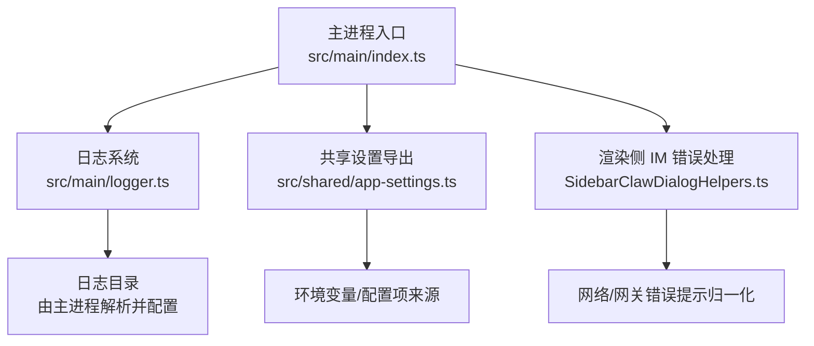
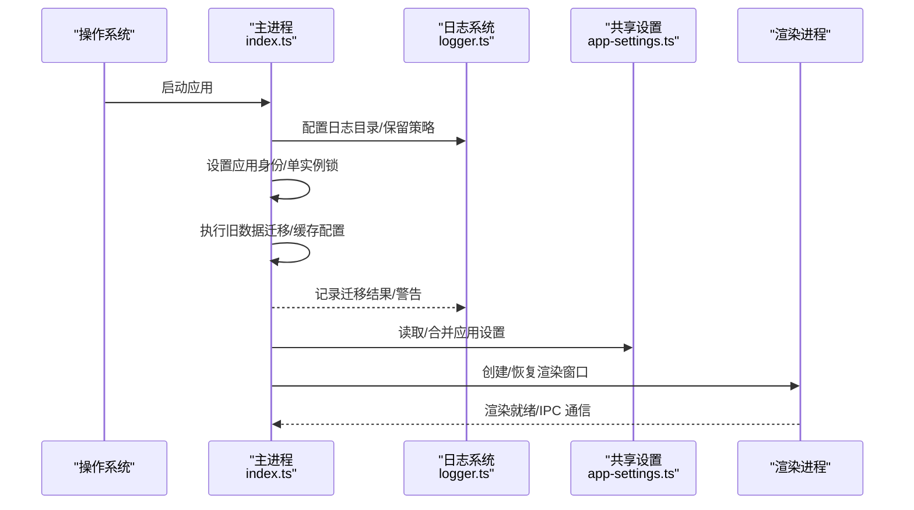
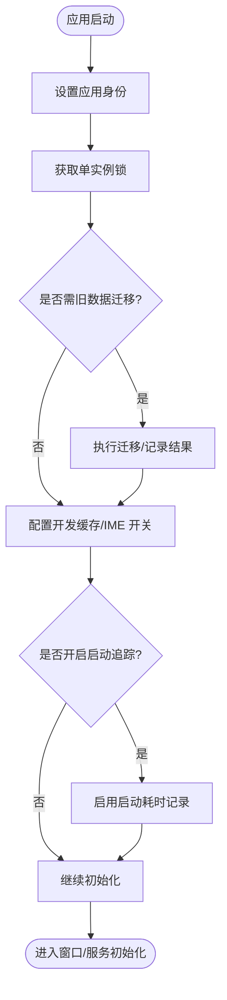
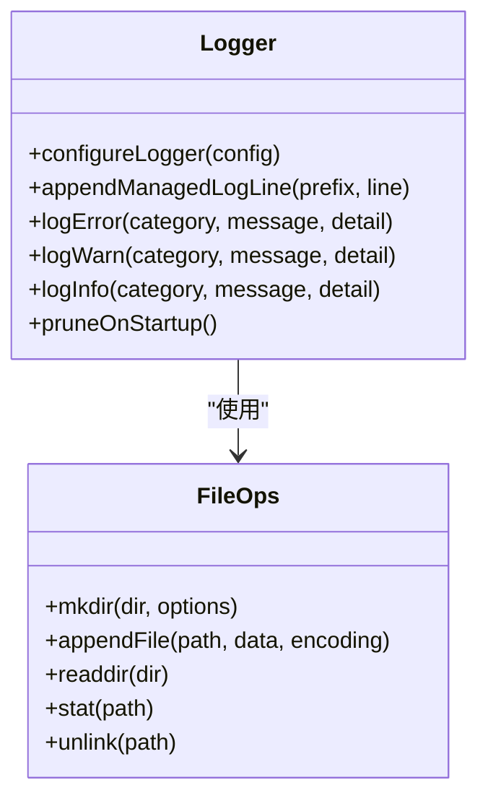
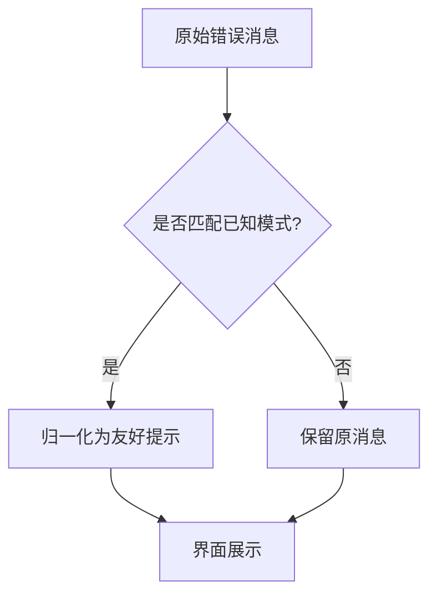
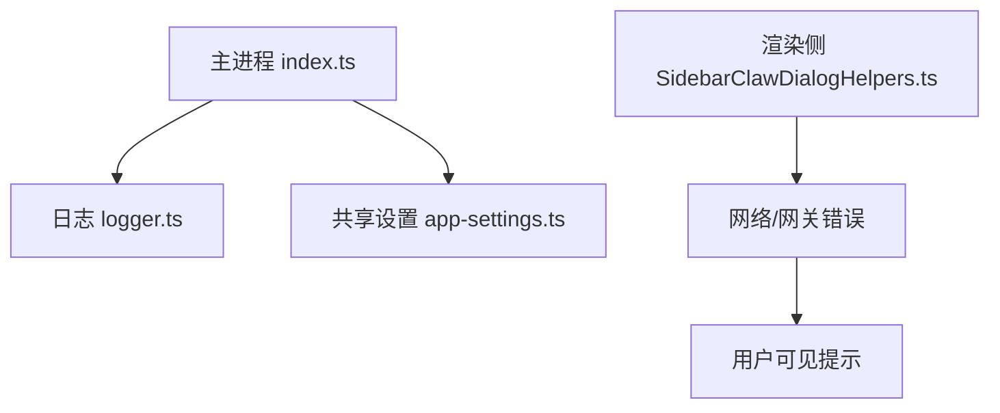

# 启动问题

<cite>
**本文引用的文件**
- [src/main/index.ts](file://src/main/index.ts)
- [src/main/logger.ts](file://src/main/logger.ts)
- [src/shared/app-settings.ts](file://src/shared/app-settings.ts)
- [src/renderer/src/components/chat/SidebarClawDialogHelpers.ts](file://src/renderer/src/components/chat/SidebarClawDialogHelpers.ts)
</cite>

## 目录
1. [简介](#简介)
2. [项目结构](#项目结构)
3. [核心组件](#核心组件)
4. [架构总览](#架构总览)
5. [详细组件分析](#详细组件分析)
6. [依赖关系分析](#依赖关系分析)
7. [性能注意事项](#性能注意事项)
8. [故障排查指南](#故障排查指南)
9. [结论](#结论)
10. [附录](#附录)

## 简介
本文件面向 DeepSeek-GUI 的“启动问题”排查，聚焦以下目标：
- 常见启动失败原因：端口占用、权限不足、配置文件错误、依赖缺失
- 启动日志分析：主进程日志、Kun 运行时日志、渲染进程日志的位置与内容解读
- 环境变量检查：代理设置、模型提供商配置、数据目录路径
- 错误信息对照表：错误代码、可能原因、解决步骤
- 调试模式：启动参数与详细日志输出、性能监控
- 快速修复方案与预防措施

## 项目结构
DeepSeek-GUI 采用 Electron 多进程架构，关键入口与日志/配置相关模块如下：
- 主进程入口负责应用初始化、单实例锁、迁移、资源准备、子进程管理、托盘与窗口创建等
- 日志系统按日期分文件写入，包含主进程与 Kun 运行时的统一前缀
- 共享设置模块集中导出各类配置类型与默认值
- 渲染侧提供 IM 安装/连接相关的错误格式化逻辑（可用于识别网关/桥接类启动失败）

**图表来源**
- [src/main/index.ts:421-477](file://src/main/index.ts#L421-L477)
- [src/main/logger.ts:20-75](file://src/main/logger.ts#L20-L75)
- [src/shared/app-settings.ts:1-19](file://src/shared/app-settings.ts#L1-L19)
- [src/renderer/src/components/chat/SidebarClawDialogHelpers.ts:59-79](file://src/renderer/src/components/chat/SidebarClawDialogHelpers.ts#L59-L79)

**章节来源**
- [src/main/index.ts:421-477](file://src/main/index.ts#L421-L477)
- [src/main/logger.ts:20-75](file://src/main/logger.ts#L20-L75)
- [src/shared/app-settings.ts:1-19](file://src/shared/app-settings.ts#L1-L19)
- [src/renderer/src/components/chat/SidebarClawDialogHelpers.ts:59-79](file://src/renderer/src/components/chat/SidebarClawDialogHelpers.ts#L59-L79)

## 核心组件
- 主进程初始化与生命周期
  - 应用身份、单实例锁、旧数据迁移、开发缓存、Linux Wayland IME 开关等
  - 启动追踪开关用于诊断启动耗时
- 日志子系统
  - 按天分文件，统一前缀 deepseek-gui/kun，自动清理过期日志
- 共享设置
  - 集中导出应用行为、Kun、Graph、Terminal、Provider 等设置类型
- 渲染侧 IM 错误归一化
  - 将网关不可用、未配置、网络错误等统一为友好提示

**章节来源**
- [src/main/index.ts:304-316](file://src/main/index.ts#L304-L316)
- [src/main/index.ts:421-477](file://src/main/index.ts#L421-L477)
- [src/main/logger.ts:20-75](file://src/main/logger.ts#L20-L75)
- [src/shared/app-settings.ts:1-19](file://src/shared/app-settings.ts#L1-L19)
- [src/renderer/src/components/chat/SidebarClawDialogHelpers.ts:59-79](file://src/renderer/src/components/chat/SidebarClawDialogHelpers.ts#L59-L79)

## 架构总览
下图展示启动阶段的关键交互：主进程完成身份与迁移后，加载图标、获取单实例锁、执行迁移与缓存配置，随后进入窗口与服务初始化。日志在启动早期即被启用，便于记录迁移、锁、服务状态等关键事件。

**图表来源**
- [src/main/index.ts:421-477](file://src/main/index.ts#L421-L477)
- [src/main/logger.ts:20-75](file://src/main/logger.ts#L20-L75)
- [src/shared/app-settings.ts:1-19](file://src/shared/app-settings.ts#L1-L19)

## 详细组件分析

### 主进程启动流程与关键断点
- 应用身份与单实例锁
  - 确保任务栏/通知中心显示正确名称，避免多实例冲突
- 旧数据迁移与 userData 路径
  - 迁移失败时回退到旧目录，保证功能可用
- 开发环境 HTTP 缓存与 Linux Wayland IME 开关
  - 影响渲染加载与输入法切换
- 启动追踪
  - 通过环境变量开启，打印带时间戳的启动阶段耗时

**图表来源**
- [src/main/index.ts:421-477](file://src/main/index.ts#L421-L477)
- [src/main/index.ts:304-316](file://src/main/index.ts#L304-L316)

**章节来源**
- [src/main/index.ts:304-316](file://src/main/index.ts#L304-L316)
- [src/main/index.ts:421-477](file://src/main/index.ts#L421-L477)

### 日志系统：位置、命名与清理
- 日志目录与文件名
  - 按日期生成日志文件，统一前缀 deepseek-gui/kun
- 写入与清理
  - 每次写入尝试清理超过保留天数的日志；失败不中断应用
- 启动时清理
  - 启动阶段主动清理旧日志并记录动作

**图表来源**
- [src/main/logger.ts:20-75](file://src/main/logger.ts#L20-L75)
- [src/main/logger.ts:77-110](file://src/main/logger.ts#L77-L110)

**章节来源**
- [src/main/logger.ts:20-75](file://src/main/logger.ts#L20-L75)
- [src/main/logger.ts:77-110](file://src/main/logger.ts#L77-L110)

### 共享设置与环境变量
- 设置导出
  - 集中导出应用行为、Kun、Graph、Terminal、Provider 等设置类型
- 环境变量
  - 启动追踪开关：KUN_STARTUP_TRACE / DEEPSEEK_GUI_STARTUP_TRACE
  - 其他设置项通过共享设置模块注入到主进程/渲染进程

**图表来源**
- [src/main/index.ts:304-316](file://src/main/index.ts#L304-L316)
- [src/shared/app-settings.ts:1-19](file://src/shared/app-settings.ts#L1-L19)

**章节来源**
- [src/main/index.ts:304-316](file://src/main/index.ts#L304-L316)
- [src/shared/app-settings.ts:1-19](file://src/shared/app-settings.ts#L1-L19)

### 渲染侧 IM 错误归一化（辅助定位启动失败）
- 当出现 OpenClaw Gateway 不可用/未配置、WeChat 登录桥缺失、网络请求失败、连接拒绝或特定 HTTP 状态码时，渲染侧会将其归一化为统一提示，便于用户理解与定位问题

**图表来源**
- [src/renderer/src/components/chat/SidebarClawDialogHelpers.ts:59-79](file://src/renderer/src/components/chat/SidebarClawDialogHelpers.ts#L59-L79)

**章节来源**
- [src/renderer/src/components/chat/SidebarClawDialogHelpers.ts:59-79](file://src/renderer/src/components/chat/SidebarClawDialogHelpers.ts#L59-L79)

## 依赖关系分析
- 主进程依赖日志系统记录迁移、锁、服务状态等关键事件
- 主进程通过共享设置模块读取/合并配置，影响后续服务与渲染行为
- 渲染侧对网络/网关错误进行归一化处理，提升可诊断性

**图表来源**
- [src/main/index.ts:421-477](file://src/main/index.ts#L421-L477)
- [src/main/logger.ts:20-75](file://src/main/logger.ts#L20-L75)
- [src/shared/app-settings.ts:1-19](file://src/shared/app-settings.ts#L1-L19)
- [src/renderer/src/components/chat/SidebarClawDialogHelpers.ts:59-79](file://src/renderer/src/components/chat/SidebarClawDialogHelpers.ts#L59-L79)

**章节来源**
- [src/main/index.ts:421-477](file://src/main/index.ts#L421-L477)
- [src/main/logger.ts:20-75](file://src/main/logger.ts#L20-L75)
- [src/shared/app-settings.ts:1-19](file://src/shared/app-settings.ts#L1-L19)
- [src/renderer/src/components/chat/SidebarClawDialogHelpers.ts:59-79](file://src/renderer/src/components/chat/SidebarClawDialogHelpers.ts#L59-L79)

## 性能注意事项
- 启动追踪
  - 通过环境变量开启，可在控制台看到各阶段的相对耗时，便于定位慢启动环节
- 日志清理
  - 每次写入尝试清理过期日志，避免磁盘占用过高导致 I/O 变慢
- 迁移与缓存
  - 旧数据迁移失败会回退到旧目录，减少阻塞；开发缓存配置有助于渲染加载速度

[本节为通用指导，无需具体文件引用]

## 故障排查指南

### 常见启动失败原因与快速修复
- 端口占用
  - 现象：本地服务无法绑定端口，网络请求失败
  - 排查：查看主进程与渲染侧日志中是否有连接拒绝或 HTTP 错误；确认端口未被其他进程占用
  - 修复：关闭占用端口的进程或更换端口；检查代理设置是否正确
- 权限不足
  - 现象：无法写入日志目录、无法访问数据目录
  - 排查：检查日志目录是否存在且可写；查看日志系统中是否有权限错误
  - 修复：以管理员/更高权限运行；修正目录权限
- 配置文件错误
  - 现象：启动时读取设置失败或行为异常
  - 排查：检查共享设置模块导出的配置项；核对环境变量与设置文件一致性
  - 修复：修正配置格式与必填字段；必要时重置为默认值
- 依赖缺失
  - 现象：外部服务（如 OpenClaw Gateway、WeChat 桥）不可用
  - 排查：渲染侧会将网关不可用/桥缺失归一化为友好提示；主进程日志中可能有相关警告
  - 修复：安装/启动依赖服务；检查网络连通性与代理设置

**章节来源**
- [src/main/logger.ts:20-75](file://src/main/logger.ts#L20-L75)
- [src/renderer/src/components/chat/SidebarClawDialogHelpers.ts:59-79](file://src/renderer/src/components/chat/SidebarClawDialogHelpers.ts#L59-L79)

### 启动日志分析
- 主进程日志
  - 位置：由主进程配置的日志目录，按日期生成，前缀 deepseek-gui/kun
  - 内容：迁移结果、单实例锁状态、服务初始化、警告与错误
  - 方法：查看最近日期的日志文件，关注 error/warn 级别条目
- Kun 运行时日志
  - 位置：同一日志目录，前缀 kun
  - 内容：运行时健康、迁移、服务状态
  - 方法：结合主进程日志中的时间戳定位对应阶段
- 渲染进程日志
  - 位置：浏览器开发者工具控制台（F12）
  - 内容：网络请求、IM 安装/连接错误、网关状态
  - 方法：过滤关键字（如网关、桥、连接拒绝），结合渲染侧错误归一化提示

**章节来源**
- [src/main/logger.ts:20-75](file://src/main/logger.ts#L20-L75)
- [src/main/logger.ts:77-110](file://src/main/logger.ts#L77-L110)
- [src/renderer/src/components/chat/SidebarClawDialogHelpers.ts:59-79](file://src/renderer/src/components/chat/SidebarClawDialogHelpers.ts#L59-L79)

### 环境变量配置检查
- 代理设置
  - 检查系统/应用代理是否正确；若使用代理，确保能访问模型提供商与网关
- 模型提供商配置
  - 通过共享设置模块提供的 Provider 配置项核对密钥、端点、配额
- 数据目录路径
  - 确认数据目录存在且可写；迁移失败时会记录并回退到旧目录

**章节来源**
- [src/shared/app-settings.ts:1-19](file://src/shared/app-settings.ts#L1-L19)
- [src/main/index.ts:421-477](file://src/main/index.ts#L421-L477)

### 错误信息对照表（示例）
- 错误代码：connection_refused
  - 可能原因：端口被占用或网关未启动
  - 解决步骤：释放端口或启动网关；检查代理与网络连通性
- 错误代码：permission_denied
  - 可能原因：日志/数据目录无写入权限
  - 解决步骤：提升权限或修改目录权限
- 错误代码：gateway_unavailable
  - 可能原因：OpenClaw Gateway 未配置或未运行
  - 解决步骤：安装/启动网关；检查环境变量与网络
- 错误代码：invalid_config
  - 可能原因：配置文件格式错误或必填字段缺失
  - 解决步骤：修正配置；必要时重置为默认值

[本节为通用对照表，基于日志与渲染侧错误归一化归纳]

### 调试模式与性能监控
- 启动追踪
  - 设置环境变量 KUN_STARTUP_TRACE 或 DEEPSEEK_GUI_STARTUP_TRACE 为 1，可输出带时间戳的启动阶段耗时
- 详细日志
  - 观察主进程与 Kun 运行时日志中的 warn/error 条目；结合渲染侧控制台网络请求
- 性能监控
  - 通过启动追踪定位慢阶段；检查日志清理是否生效，避免磁盘 I/O 瓶颈

**章节来源**
- [src/main/index.ts:304-316](file://src/main/index.ts#L304-L316)
- [src/main/logger.ts:20-75](file://src/main/logger.ts#L20-L75)

### 快速修复方案与预防措施
- 快速修复
  - 端口占用：关闭占用进程或更换端口
  - 权限不足：以管理员运行或修正目录权限
  - 配置错误：修正配置格式与必填字段
  - 依赖缺失：安装/启动网关与桥服务
- 预防措施
  - 定期清理日志，避免磁盘占满
  - 使用环境变量统一管理代理与敏感配置
  - 在 CI/CD 中校验配置与依赖可用性

[本节为通用建议，无需具体文件引用]

## 结论
DeepSeek-GUI 的启动问题通常集中在端口、权限、配置与依赖四个方面。通过主进程日志、Kun 运行时日志与渲染侧控制台，结合环境变量与共享设置，可以快速定位并解决问题。启用启动追踪与合理配置日志保留策略，有助于持续优化启动性能与可诊断性。

[本节为总结，无需具体文件引用]

## 附录
- 常用命令与路径
  - 日志目录：由主进程配置，按日期生成 deepseek-gui/kun 前缀日志
  - 环境变量：KUN_STARTUP_TRACE / DEEPSEEK_GUI_STARTUP_TRACE
- 参考模块
  - 主进程入口：src/main/index.ts
  - 日志系统：src/main/logger.ts
  - 共享设置：src/shared/app-settings.ts
  - 渲染侧错误归一化：src/renderer/src/components/chat/SidebarClawDialogHelpers.ts

[本节为附录，无需具体文件引用]