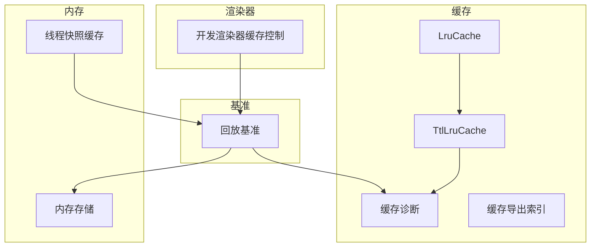
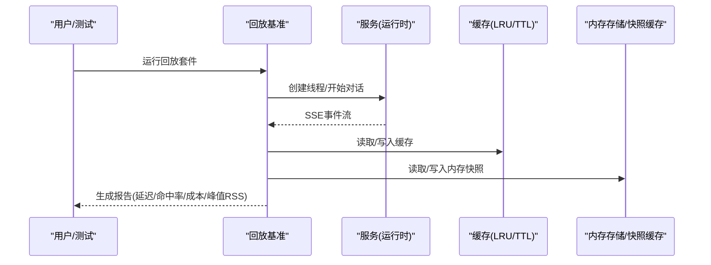
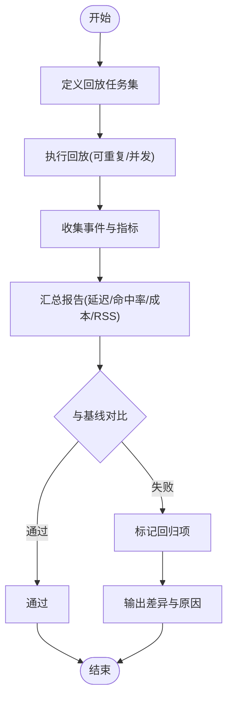
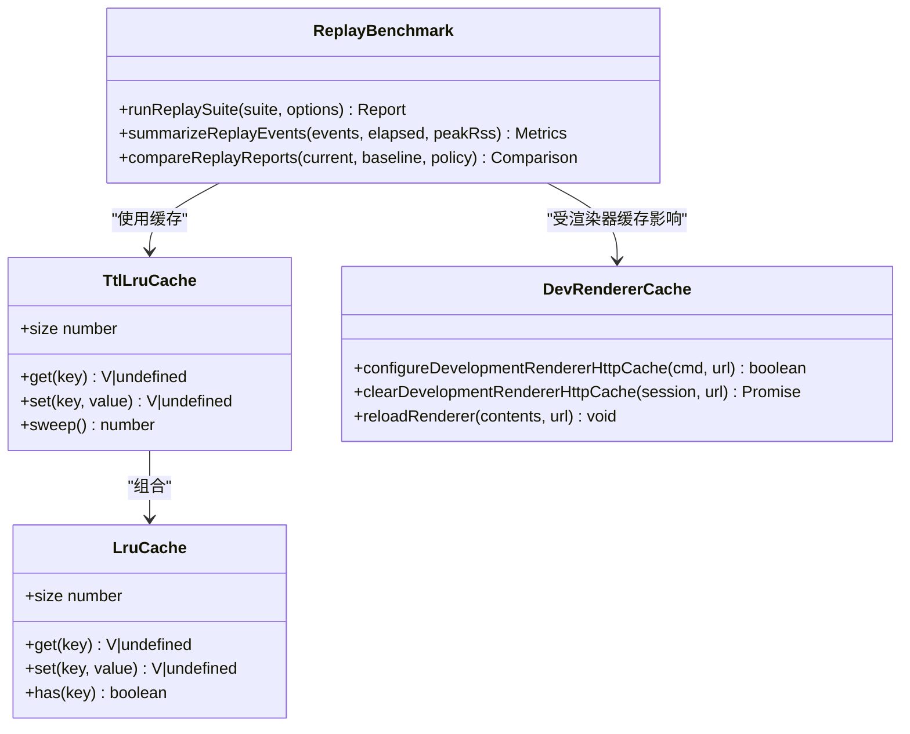

# 性能优化

<cite>
**本文引用的文件**
- [replay-benchmark.ts](file://kun/src/benchmark/replay-benchmark.ts)
- [lru-cache.ts](file://kun/src/cache/lru-cache.ts)
- [ttl-lru-cache.ts](file://kun/src/cache/ttl-lru-cache.ts)
- [cache-diagnostics.ts](file://kun/src/cache/cache-diagnostics.ts)
- [index.ts](file://kun/src/cache/index.ts)
- [dev-renderer-cache.ts](file://src/main/dev-renderer-cache.ts)
- [run-memory-growth-regression.mjs](file://kun/scripts/run-memory-growth-regression.mjs)
- [memory-store.ts](file://kun/src/memory/memory-store.ts)
- [thread-snapshot-cache.ts](file://src/renderer/src/store/thread-snapshot-cache.ts)
</cite>

## 目录
1. [简介](#简介)
2. [项目结构](#项目结构)
3. [核心组件](#核心组件)
4. [架构总览](#架构总览)
5. [详细组件分析](#详细组件分析)
6. [依赖关系分析](#依赖关系分析)
7. [性能注意事项](#性能注意事项)
8. [故障排查指南](#故障排查指南)
9. [结论](#结论)
10. [附录](#附录)

## 简介
本指南面向DeepSeek-GUI的性能优化，覆盖内存使用分析、CPU占用优化、启动速度优化、性能监控工具、缓存策略与基准测试/回归检测。内容基于仓库中已有的缓存实现、回放基准框架、开发渲染器缓存以及内存增长回归脚本等能力进行系统化整理，帮助你在不引入额外依赖的前提下，持续保持应用的高性能与稳定性。

## 项目结构
本项目在性能相关方面主要包含：
- 缓存子系统：LRU/TTL-LRU、诊断与指纹工具，提供可观测的内存与命中率指标。
- 回放基准：端到端任务回放、指标汇总、阈值比较与回归判定。
- 渲染器缓存：开发模式下禁用HTTP缓存、清理与强制重载。
- 内存增长回归：自动化脚本用于检测内存异常增长。
- 渲染层快照缓存：会话/线程快照的本地缓存，减少重复计算与I/O。

**图表来源**
- [lru-cache.ts:1-67](file://kun/src/cache/lru-cache.ts#L1-L67)
- [ttl-lru-cache.ts:1-73](file://kun/src/cache/ttl-lru-cache.ts#L1-L73)
- [cache-diagnostics.ts](file://kun/src/cache/cache-diagnostics.ts)
- [replay-benchmark.ts:300-365](file://kun/src/benchmark/replay-benchmark.ts#L300-L365)
- [dev-renderer-cache.ts:1-48](file://src/main/dev-renderer-cache.ts#L1-L48)
- [memory-store.ts](file://kun/src/memory/memory-store.ts)
- [thread-snapshot-cache.ts](file://src/renderer/src/store/thread-snapshot-cache.ts)

**章节来源**
- [lru-cache.ts:1-67](file://kun/src/cache/lru-cache.ts#L1-L67)
- [ttl-lru-cache.ts:1-73](file://kun/src/cache/ttl-lru-cache.ts#L1-L73)
- [index.ts:1-6](file://kun/src/cache/index.ts#L1-L6)
- [dev-renderer-cache.ts:1-48](file://src/main/dev-renderer-cache.ts#L1-L48)
- [replay-benchmark.ts:300-365](file://kun/src/benchmark/replay-benchmark.ts#L300-L365)

## 核心组件
- 缓存组件
  - LruCache：有界LRU，固定容量，命中时提升热度，未命中返回undefined，避免抛出异常。
  - TtlLruCache：在LRU基础上增加过期时间（TTL），支持批量清理过期条目。
  - 缓存诊断：暴露命中率、容量、淘汰等指标，便于定位热点与瓶颈。
- 回放基准
  - 端到端回放任务执行、SSE事件收集、指标汇总（TTFT、P95延迟、工具调用耗时、SSE延迟、Token用量、成本、峰值RSS）。
  - 报告对比与回归判定：支持相对/绝对阈值，自动识别性能退化项。
- 渲染器缓存
  - 开发模式禁用HTTP缓存、清理缓存、强制忽略缓存重载，加速前端调试与迭代。
- 内存与快照
  - 内存存储与线程快照缓存：降低重复数据加载与序列化开销，配合回放基准中的峰值RSS指标评估内存占用。

**章节来源**
- [lru-cache.ts:1-67](file://kun/src/cache/lru-cache.ts#L1-L67)
- [ttl-lru-cache.ts:1-73](file://kun/src/cache/ttl-lru-cache.ts#L1-L73)
- [cache-diagnostics.ts](file://kun/src/cache/cache-diagnostics.ts)
- [replay-benchmark.ts:519-621](file://kun/src/benchmark/replay-benchmark.ts#L519-L621)
- [dev-renderer-cache.ts:14-48](file://src/main/dev-renderer-cache.ts#L14-L48)
- [memory-store.ts](file://kun/src/memory/memory-store.ts)
- [thread-snapshot-cache.ts](file://src/renderer/src/store/thread-snapshot-cache.ts)

## 架构总览
下图展示从用户请求到回放基准、缓存与内存监控的整体交互路径。

**图表来源**
- [replay-benchmark.ts:300-365](file://kun/src/benchmark/replay-benchmark.ts#L300-L365)
- [replay-benchmark.ts:519-621](file://kun/src/benchmark/replay-benchmark.ts#L519-L621)
- [lru-cache.ts:1-67](file://kun/src/cache/lru-cache.ts#L1-L67)
- [ttl-lru-cache.ts:1-73](file://kun/src/cache/ttl-lru-cache.ts#L1-L73)
- [memory-store.ts](file://kun/src/memory/memory-store.ts)
- [thread-snapshot-cache.ts](file://src/renderer/src/store/thread-snapshot-cache.ts)

## 详细组件分析

### 内存使用分析与调优
- 分析方法
  - 堆快照分析：结合回放基准的峰值RSS指标，观察不同场景下的内存峰值变化，定位异常增长点。
  - 内存泄漏检测：通过多次回放与清理，观察RSS是否随次数线性增长；必要时结合Node.js堆快照工具进一步定位。
  - 垃圾回收调优：在长任务或大数据处理场景中，合理设置Node.js GC参数，避免频繁GC导致的抖动。
- 实践建议
  - 使用TTL-LRU限制热点数据的生命周期，避免长期驻留导致内存膨胀。
  - 对大对象采用分块/流式处理，减少一次性内存占用。
  - 定期触发过期清理（sweep）并统计删除数量，评估缓存有效性。
- 关键指标
  - 峰值RSS、平均RSS、缓存命中率、淘汰率、过期条目数。

**章节来源**
- [replay-benchmark.ts:519-621](file://kun/src/benchmark/replay-benchmark.ts#L519-L621)
- [ttl-lru-cache.ts:58-73](file://kun/src/cache/ttl-lru-cache.ts#L58-L73)
- [run-memory-growth-regression.mjs](file://kun/scripts/run-memory-growth-regression.mjs)

### CPU占用优化
- 异步操作优化
  - 将I/O密集型任务（如文件读写、网络请求）放入异步流程，避免阻塞主循环。
  - 利用回放基准中的并发度配置，合理并行化任务，提高吞吐。
- 计算密集型任务
  - 拆分大任务为小批次，结合工作线程或子进程，避免长时间占用事件循环。
  - 对可缓存的计算结果使用LRU/TTL-LRU缓存，减少重复计算。
- 线程池配置
  - 根据CPU核数与任务特性调整并发度，避免过度并行导致上下文切换开销。
  - 在回放基准中通过concurrency参数控制并行任务数，平衡吞吐与资源占用。

**章节来源**
- [replay-benchmark.ts:300-365](file://kun/src/benchmark/replay-benchmark.ts#L300-L365)
- [lru-cache.ts:1-67](file://kun/src/cache/lru-cache.ts#L1-L67)
- [ttl-lru-cache.ts:1-73](file://kun/src/cache/ttl-lru-cache.ts#L1-L73)

### 启动速度优化
- 懒加载策略
  - 按需加载模块与视图，减少首屏资源体积与解析时间。
  - 对非关键功能采用延迟初始化，仅在需要时构建实例。
- 预编译缓存
  - 开发模式下禁用HTTP缓存以提升调试效率；生产环境启用浏览器HTTP缓存以加速冷启动。
- 依赖优化
  - 精简依赖树，移除未使用包；对大型库进行Tree Shaking与代码分割。
  - 使用回放基准验证改动对启动与首次响应的影响。

**章节来源**
- [dev-renderer-cache.ts:14-48](file://src/main/dev-renderer-cache.ts#L14-L48)
- [replay-benchmark.ts:300-365](file://kun/src/benchmark/replay-benchmark.ts#L300-L365)

### 性能监控工具使用指南
- 浏览器开发者工具
  - 使用Performance面板录制关键路径，关注长任务、布局抖动与脚本执行热点。
  - 使用Memory面板进行堆快照对比，识别潜在泄漏。
- Node.js性能分析器
  - 使用--prof或--inspect开启采样/调试，结合火焰图定位CPU热点。
  - 结合回放基准的指标（TTFT、P95、工具耗时）评估服务端性能。
- Electron性能监控
  - 使用DevTools与主进程日志，监控渲染器与主进程的内存/CPU。
  - 开发模式下通过禁用HTTP缓存与强制重载，快速验证变更效果。

**章节来源**
- [dev-renderer-cache.ts:14-48](file://src/main/dev-renderer-cache.ts#L14-L48)
- [replay-benchmark.ts:519-621](file://kun/src/benchmark/replay-benchmark.ts#L519-L621)

### 缓存策略优化
- 文件缓存
  - 对静态资源启用浏览器HTTP缓存；开发模式禁用以避免干扰调试。
- 数据库索引
  - 为高频查询字段建立索引，减少查询延迟；结合回放基准的SSE延迟指标评估改善效果。
- 内存缓存配置
  - 使用LRU限制容量，避免无限增长；使用TTL-LRU控制过期，降低内存压力。
  - 通过缓存诊断获取命中率与淘汰情况，指导容量与TTL调优。

**章节来源**
- [dev-renderer-cache.ts:14-48](file://src/main/dev-renderer-cache.ts#L14-L48)
- [lru-cache.ts:1-67](file://kun/src/cache/lru-cache.ts#L1-L67)
- [ttl-lru-cache.ts:1-73](file://kun/src/cache/ttl-lru-cache.ts#L1-L73)
- [cache-diagnostics.ts](file://kun/src/cache/cache-diagnostics.ts)

### 性能基准测试与回归检测
- 基准方法
  - 使用回放基准定义任务集，设置超时、模型、标签等参数，运行多轮次与并发度。
  - 收集指标包括TTFT、总耗时、工具调用耗时、SSE延迟、Token用量、成本、峰值RSS。
- 回归检测
  - 通过对比当前与基线报告，设置成功率、延迟、命中率、成本、峰值RSS的阈值。
  - 自动识别回归项并输出原因，便于CI阻断与快速回滚。

**图表来源**
- [replay-benchmark.ts:300-365](file://kun/src/benchmark/replay-benchmark.ts#L300-L365)
- [replay-benchmark.ts:519-621](file://kun/src/benchmark/replay-benchmark.ts#L519-L621)
- [replay-benchmark.ts:627-761](file://kun/src/benchmark/replay-benchmark.ts#L627-L761)

**章节来源**
- [replay-benchmark.ts:300-365](file://kun/src/benchmark/replay-benchmark.ts#L300-L365)
- [replay-benchmark.ts:519-621](file://kun/src/benchmark/replay-benchmark.ts#L519-L621)
- [replay-benchmark.ts:627-761](file://kun/src/benchmark/replay-benchmark.ts#L627-L761)

## 依赖关系分析
- 缓存内部依赖
  - TtlLruCache依赖LruCache，扩展过期与清理能力。
  - 缓存诊断依赖具体缓存实现，采集命中率、容量、淘汰等指标。
- 基准与缓存/内存的耦合
  - 回放基准通过SSE事件收集指标，并与内存存储/快照缓存交互，评估整体性能。
- 渲染器缓存与基准
  - 开发渲染器缓存控制影响前端资源加载行为，间接影响回放基准的首次响应与稳定性。

**图表来源**
- [lru-cache.ts:1-67](file://kun/src/cache/lru-cache.ts#L1-L67)
- [ttl-lru-cache.ts:1-73](file://kun/src/cache/ttl-lru-cache.ts#L1-L73)
- [replay-benchmark.ts:300-365](file://kun/src/benchmark/replay-benchmark.ts#L300-L365)
- [dev-renderer-cache.ts:14-48](file://src/main/dev-renderer-cache.ts#L14-L48)

**章节来源**
- [lru-cache.ts:1-67](file://kun/src/cache/lru-cache.ts#L1-L67)
- [ttl-lru-cache.ts:1-73](file://kun/src/cache/ttl-lru-cache.ts#L1-L73)
- [replay-benchmark.ts:300-365](file://kun/src/benchmark/replay-benchmark.ts#L300-L365)
- [dev-renderer-cache.ts:14-48](file://src/main/dev-renderer-cache.ts#L14-L48)

## 性能注意事项
- 缓存容量与TTL需结合业务访问模式调优，避免过高命中率但低效的缓存或频繁淘汰。
- 回放基准的并发度与重复次数应反映真实负载，避免过拟合或掩盖问题。
- 开发模式禁用HTTP缓存有助于快速验证，但生产环境应启用以提升冷启动性能。
- 内存增长回归脚本应在CI中定期运行，及时发现异常增长趋势。

[本节为通用指导，无需特定文件引用]

## 故障排查指南
- 常见问题
  - 缓存命中率低：检查键空间设计、TTL设置与访问模式，必要时扩大容量或调整策略。
  - 峰值RSS异常：结合回放基准的peakRssBytes指标，定位大对象或泄漏点。
  - 启动缓慢：确认渲染器缓存策略与依赖体积，必要时进行代码分割与懒加载。
- 排查步骤
  - 使用回放基准复现问题，记录指标与日志。
  - 使用浏览器/Node.js性能工具采集CPU与内存快照，对比前后版本。
  - 运行内存增长回归脚本，确认是否存在持续增长。

**章节来源**
- [replay-benchmark.ts:519-621](file://kun/src/benchmark/replay-benchmark.ts#L519-L621)
- [run-memory-growth-regression.mjs](file://kun/scripts/run-memory-growth-regression.mjs)
- [dev-renderer-cache.ts:14-48](file://src/main/dev-renderer-cache.ts#L14-L48)

## 结论
通过系统化的缓存策略、回放基准与内存回归检测，DeepSeek-GUI能够在复杂场景下保持稳定的性能表现。建议将回放基准纳入日常开发与CI流程，持续监控关键指标并及时优化。同时，结合浏览器与Node.js性能工具，形成完整的性能闭环，确保用户体验与资源效率的平衡。

[本节为总结性内容，无需特定文件引用]

## 附录
- 术语
  - TTFT：首token时间，衡量响应速度。
  - P95：95%分位，衡量尾部延迟。
  - RSS：常驻集大小，反映进程内存占用。
- 参考路径
  - 缓存实现：[lru-cache.ts](file://kun/src/cache/lru-cache.ts)、[ttl-lru-cache.ts](file://kun/src/cache/ttl-lru-cache.ts)
  - 基准框架：[replay-benchmark.ts](file://kun/src/benchmark/replay-benchmark.ts)
  - 渲染器缓存：[dev-renderer-cache.ts](file://src/main/dev-renderer-cache.ts)
  - 内存回归：[run-memory-growth-regression.mjs](file://kun/scripts/run-memory-growth-regression.mjs)

[本节为补充信息，无需特定文件引用]