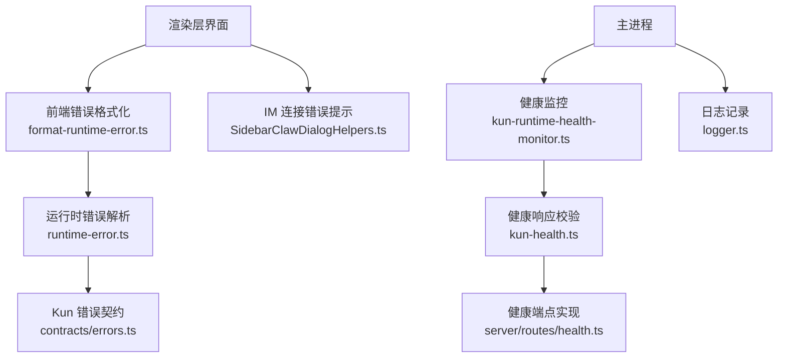
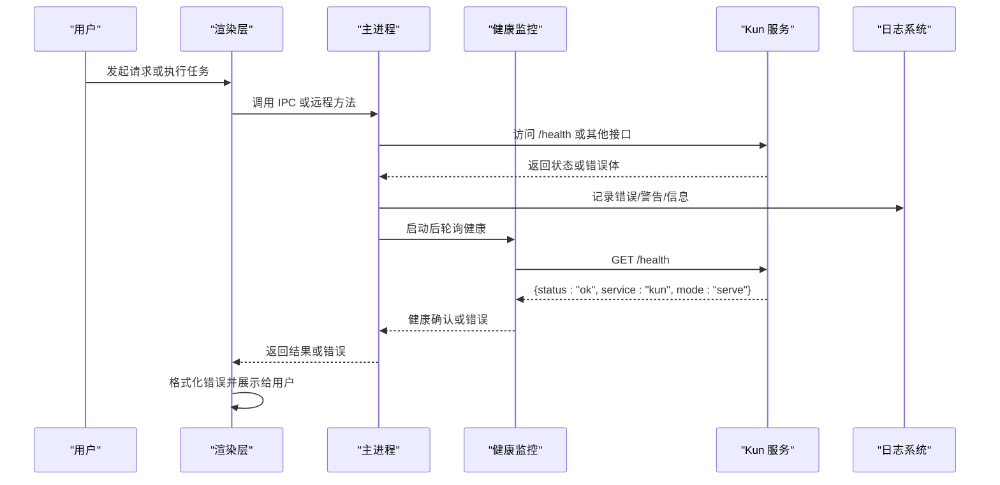
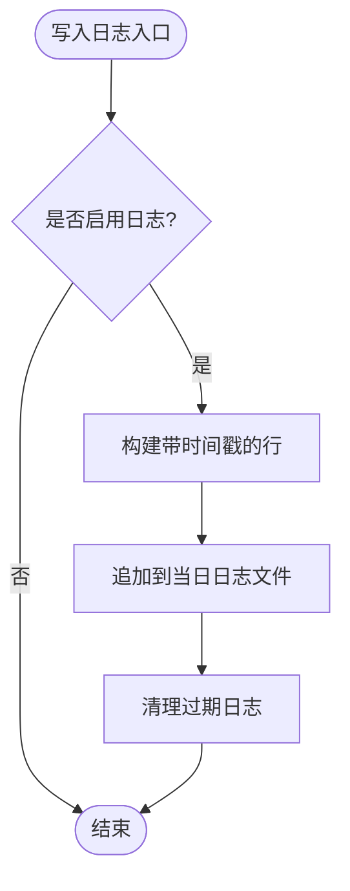
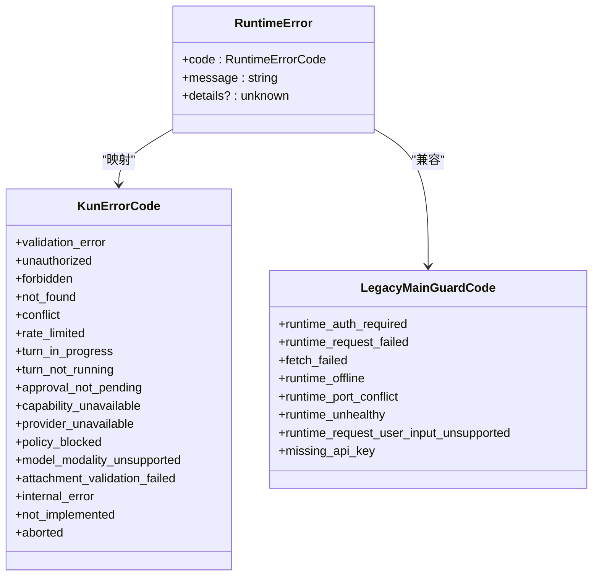
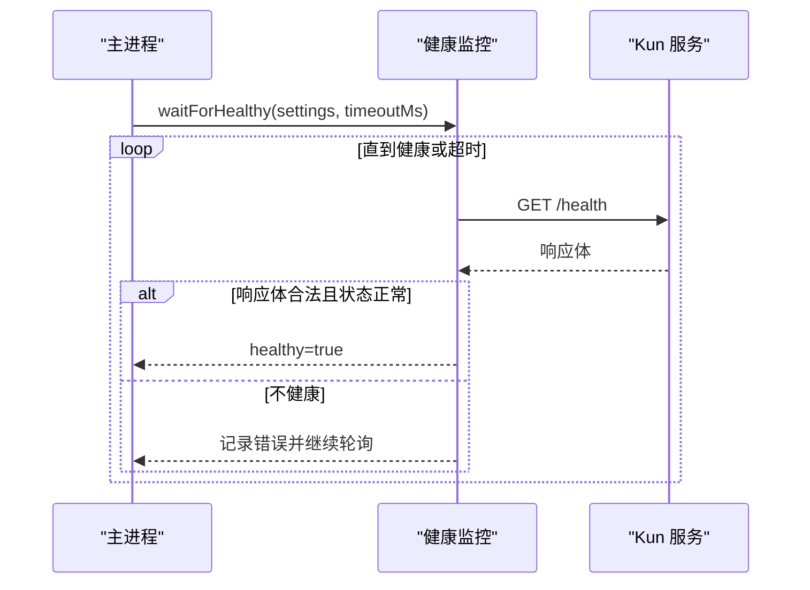
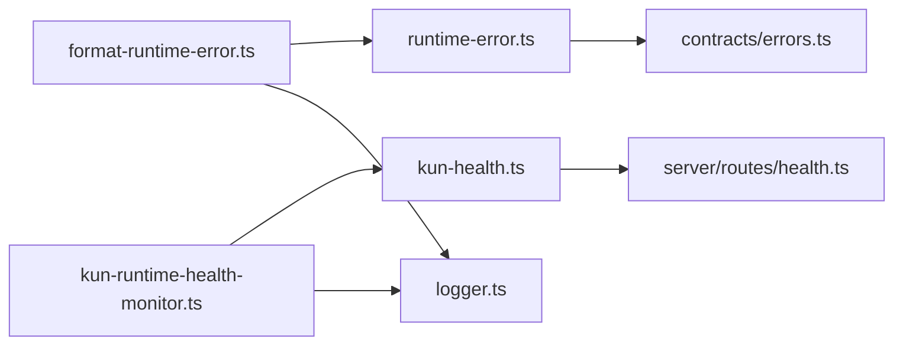

# 故障排除

<cite>
**本文引用的文件**
- [src/main/logger.ts](file://src/main/logger.ts)
- [src/shared/runtime-error.ts](file://src/shared/runtime-error.ts)
- [kun/src/contracts/errors.ts](file://kun/src/contracts/errors.ts)
- [src/renderer/src/lib/format-runtime-error.ts](file://src/renderer/src/lib/format-runtime-error.ts)
- [src/main/kun-health.ts](file://src/main/kun-health.ts)
- [src/main/runtime/kun-runtime-health-monitor.ts](file://src/main/runtime/kun-runtime-health-monitor.ts)
- [kun/src/server/routes/health.ts](file://kun/src/server/routes/health.ts)
- [src/renderer/src/components/chat/SidebarClawDialogHelpers.ts](file://src/renderer/src/components/chat/SidebarClawDialogHelpers.ts)
</cite>

## 目录
1. [简介](#简介)
2. [项目结构](#项目结构)
3. [核心组件](#核心组件)
4. [架构总览](#架构总览)
5. [详细组件分析](#详细组件分析)
6. [依赖关系分析](#依赖关系分析)
7. [性能注意事项](#性能注意事项)
8. [故障排除指南](#故障排除指南)
9. [结论](#结论)
10. [附录](#附录)

## 简介
本故障排除文档面向 DeepSeek-GUI 用户与开发者，聚焦启动失败、连接错误、性能问题等常见场景的诊断与修复。内容涵盖日志分析与配置、错误码参考、健康检查机制、网络问题排查、性能优化建议，以及社区支持与反馈渠道。所有说明均基于仓库中的实际实现与约定，确保可操作性和准确性。

## 项目结构
DeepSeek-GUI 的故障排除相关能力分布在以下模块：
- 主进程日志：负责写入结构化日志并清理旧日志
- 运行时错误解析：统一解析后端返回的错误体，提供稳定错误码
- 健康检查：主进程轮询 Kun 服务健康端点，保障启动就绪
- 渲染层错误格式化：将错误转换为可读摘要与详情，支持国际化与敏感信息脱敏
- IM 连接错误提示：对特定网络与网关错误进行友好提示

**图表来源**
- [src/main/logger.ts:1-120](file://src/main/logger.ts#L1-L120)
- [src/shared/runtime-error.ts:1-161](file://src/shared/runtime-error.ts#L1-L161)
- [kun/src/contracts/errors.ts:1-42](file://kun/src/contracts/errors.ts#L1-L42)
- [src/renderer/src/lib/format-runtime-error.ts:1-176](file://src/renderer/src/lib/format-runtime-error.ts#L1-L176)
- [src/main/kun-health.ts:1-12](file://src/main/kun-health.ts#L1-L12)
- [src/main/runtime/kun-runtime-health-monitor.ts:1-240](file://src/main/runtime/kun-runtime-health-monitor.ts#L1-L240)
- [kun/src/server/routes/health.ts:1-7](file://kun/src/server/routes/health.ts#L1-L7)
- [src/renderer/src/components/chat/SidebarClawDialogHelpers.ts:1-297](file://src/renderer/src/components/chat/SidebarClawDialogHelpers.ts#L1-L297)

**章节来源**
- [src/main/logger.ts:1-120](file://src/main/logger.ts#L1-L120)
- [src/shared/runtime-error.ts:1-161](file://src/shared/runtime-error.ts#L1-L161)
- [kun/src/contracts/errors.ts:1-42](file://kun/src/contracts/errors.ts#L1-L42)
- [src/renderer/src/lib/format-runtime-error.ts:1-176](file://src/renderer/src/lib/format-runtime-error.ts#L1-L176)
- [src/main/kun-health.ts:1-12](file://src/main/kun-health.ts#L1-L12)
- [src/main/runtime/kun-runtime-health-monitor.ts:1-240](file://src/main/runtime/kun-runtime-health-monitor.ts#L1-L240)
- [kun/src/server/routes/health.ts:1-7](file://kun/src/server/routes/health.ts#L1-L7)
- [src/renderer/src/components/chat/SidebarClawDialogHelpers.ts:1-297](file://src/renderer/src/components/chat/SidebarClawDialogHelpers.ts#L1-L297)

## 核心组件
- 日志系统：按级别写入带时间戳和分类的日志，自动清理过期日志，避免影响应用稳定性
- 错误解析器：统一解析 Kun 运行时错误体，兼容新旧格式，输出稳定的 code/message/details
- 健康检查：通过 /health 端点轮询确认 Kun 服务就绪，支持超时与重试策略
- 渲染层错误格式化：将原始错误转换为人类可读摘要，支持敏感信息脱敏与国际化
- IM 连接错误提示：识别常见网络与网关错误，给出用户友好的引导文案

**章节来源**
- [src/main/logger.ts:1-120](file://src/main/logger.ts#L1-L120)
- [src/shared/runtime-error.ts:1-161](file://src/shared/runtime-error.ts#L1-L161)
- [src/main/runtime/kun-runtime-health-monitor.ts:1-240](file://src/main/runtime/kun-runtime-health-monitor.ts#L1-L240)
- [src/renderer/src/lib/format-runtime-error.ts:1-176](file://src/renderer/src/lib/format-runtime-error.ts#L1-L176)
- [src/renderer/src/components/chat/SidebarClawDialogHelpers.ts:1-297](file://src/renderer/src/components/chat/SidebarClawDialogHelpers.ts#L1-L297)

## 架构总览
下图展示了从用户交互到后端健康检查与错误处理的完整链路：

**图表来源**
- [src/main/runtime/kun-runtime-health-monitor.ts:1-240](file://src/main/runtime/kun-runtime-health-monitor.ts#L1-L240)
- [kun/src/server/routes/health.ts:1-7](file://kun/src/server/routes/health.ts#L1-L7)
- [src/main/kun-health.ts:1-12](file://src/main/kun-health.ts#L1-L12)
- [src/main/logger.ts:1-120](file://src/main/logger.ts#L1-L120)
- [src/renderer/src/lib/format-runtime-error.ts:1-176](file://src/renderer/src/lib/format-runtime-error.ts#L1-L176)

## 详细组件分析

### 日志系统与日志分析技巧
- 日志级别：error、warn、info；每条日志包含 ISO 时间戳、级别、分类与消息
- 日志文件命名：按日期生成，前缀区分 deepseek-gui 与 kun
- 保留策略：每次写入时尝试清理超过保留天数的日志，避免磁盘占用
- 启动清理：应用启动时立即清理旧日志并记录动作
- 关键信息提取：通过分类字段快速定位子系统（如 health-probe、logger）

**图表来源**
- [src/main/logger.ts:1-120](file://src/main/logger.ts#L1-L120)

**章节来源**
- [src/main/logger.ts:1-120](file://src/main/logger.ts#L1-L120)

### 错误码参考与解析
- 统一错误体：{ code, message, details? }；兼容 legacy 的 { error, message? }
- 已知代码集合：包括 validation_error、unauthorized、forbidden、not_found、conflict、rate_limited、turn_in_progress、turn_not_running、approval_not_pending、capability_unavailable、provider_unavailable、policy_blocked、model_modality_unsupported、attachment_validation_failed、internal_error、not_implemented、aborted
- 主进程守护代码：runtime_auth_required、runtime_request_failed、fetch_failed、runtime_offline、runtime_port_conflict、runtime_unhealthy、runtime_request_user_input_unsupported、missing_api_key
- 渲染层识别：根据文本特征推断 model_request_failed、fetch_failed、runtime_unhealthy、turn_in_progress、preload_bridge_missing、runtime_binary_not_installed

**图表来源**
- [src/shared/runtime-error.ts:1-161](file://src/shared/runtime-error.ts#L1-L161)
- [kun/src/contracts/errors.ts:1-42](file://kun/src/contracts/errors.ts#L1-L42)

**章节来源**
- [src/shared/runtime-error.ts:1-161](file://src/shared/runtime-error.ts#L1-L161)
- [kun/src/contracts/errors.ts:1-42](file://kun/src/contracts/errors.ts#L1-L42)
- [src/renderer/src/lib/format-runtime-error.ts:1-176](file://src/renderer/src/lib/format-runtime-error.ts#L1-L176)

### 健康检查机制
- 健康端点：GET /health 返回 { status: "ok", service: "kun", mode: "serve" }
- 健康监控：主进程周期性轮询 /health，直到成功或超时
- 启动等待：监听子进程 stdout/stderr，解析 KUN_READY 标记并结合健康检查确认就绪
- 超时策略：支持环境变量覆盖默认超时，Windows 与 macOS 不同默认值
- 单飞探测：同一 base URL 的健康探测去重，避免重复请求

**图表来源**
- [src/main/runtime/kun-runtime-health-monitor.ts:1-240](file://src/main/runtime/kun-runtime-health-monitor.ts#L1-L240)
- [src/main/kun-health.ts:1-12](file://src/main/kun-health.ts#L1-L12)
- [kun/src/server/routes/health.ts:1-7](file://kun/src/server/routes/health.ts#L1-L7)

**章节来源**
- [src/main/runtime/kun-runtime-health-monitor.ts:1-240](file://src/main/runtime/kun-runtime-health-monitor.ts#L1-L240)
- [src/main/kun-health.ts:1-12](file://src/main/kun-health.ts#L1-L12)
- [kun/src/server/routes/health.ts:1-7](file://kun/src/server/routes/health.ts#L1-L7)

### IM 连接错误与网络问题
- 错误识别：匹配 WeChat login bridge、OpenClaw Gateway unavailable/not configured、DEEPSEEK_GUI_OPENCLAW_GATEWAY_URL、fetch failed、ECONNREFUSED、HTTP 401/404/503 等模式
- 用户提示：将底层错误映射为“微信登录桥缺失”等友好文案，降低用户理解成本
- 代理与证书：当出现 fetch failed 或 ECONNREFUSED 时，优先检查代理设置与证书链是否正确
- 连接超时：结合健康监控的超时策略，调整 KUN_STARTUP_TIMEOUT_MS 以适配慢速环境

**章节来源**
- [src/renderer/src/components/chat/SidebarClawDialogHelpers.ts:1-297](file://src/renderer/src/components/chat/SidebarClawDialogHelpers.ts#L1-L297)
- [src/main/runtime/kun-runtime-health-monitor.ts:1-240](file://src/main/runtime/kun-runtime-health-monitor.ts#L1-L240)

## 依赖关系分析
- 渲染层依赖错误格式化模块，将原始错误转为可读摘要
- 主进程依赖健康监控模块，确保 Kun 服务在可用后再继续流程
- 健康监控依赖健康响应校验，保证返回体符合预期
- 日志模块被多处调用，用于记录健康探测与错误信息

**图表来源**
- [src/renderer/src/lib/format-runtime-error.ts:1-176](file://src/renderer/src/lib/format-runtime-error.ts#L1-L176)
- [src/shared/runtime-error.ts:1-161](file://src/shared/runtime-error.ts#L1-L161)
- [kun/src/contracts/errors.ts:1-42](file://kun/src/contracts/errors.ts#L1-L42)
- [src/main/runtime/kun-runtime-health-monitor.ts:1-240](file://src/main/runtime/kun-runtime-health-monitor.ts#L1-L240)
- [src/main/kun-health.ts:1-12](file://src/main/kun-health.ts#L1-L12)
- [kun/src/server/routes/health.ts:1-7](file://kun/src/server/routes/health.ts#L1-L7)
- [src/main/logger.ts:1-120](file://src/main/logger.ts#L1-L120)

**章节来源**
- [src/renderer/src/lib/format-runtime-error.ts:1-176](file://src/renderer/src/lib/format-runtime-error.ts#L1-L176)
- [src/shared/runtime-error.ts:1-161](file://src/shared/runtime-error.ts#L1-L161)
- [kun/src/contracts/errors.ts:1-42](file://kun/src/contracts/errors.ts#L1-L42)
- [src/main/runtime/kun-runtime-health-monitor.ts:1-240](file://src/main/runtime/kun-runtime-health-monitor.ts#L1-L240)
- [src/main/kun-health.ts:1-12](file://src/main/kun-health.ts#L1-L12)
- [kun/src/server/routes/health.ts:1-7](file://kun/src/server/routes/health.ts#L1-L7)
- [src/main/logger.ts:1-120](file://src/main/logger.ts#L1-L120)

## 性能注意事项
- 健康轮询间隔：默认约 150ms，可根据环境调整 healthPollMs 以降低开销
- 超时上限：支持通过 KUN_STARTUP_TIMEOUT_MS 调整，避免长时间阻塞
- 日志写入：每次写入触发一次清理，尽量控制日志量与频率
- 错误格式化：对大对象进行截断与脱敏，减少渲染压力
- 单飞探测：同 base URL 的健康探测去重，避免并发风暴

[本节提供通用指导，无需具体文件引用]

## 故障排除指南

### 启动失败
- 症状：应用无法进入工作区或显示“未就绪”
- 诊断步骤：
  - 查看主进程日志，关注 health-probe 与 logger 分类
  - 检查 Kun 服务是否输出 KUN_READY 标记
  - 使用健康端点验证：GET /health 应返回 { status: "ok", service: "kun", mode: "serve" }
  - 调整超时：设置 KUN_STARTUP_TIMEOUT_MS 以适应慢速环境
- 可能原因：端口冲突、服务崩溃、健康检查失败、环境变量不正确
- 解决步骤：
  - 释放端口或更换端口
  - 重启 Kun 服务并观察 stderr 尾部
  - 修正环境变量与代理设置
  - 若健康检查持续失败，检查网络与证书

**章节来源**
- [src/main/runtime/kun-runtime-health-monitor.ts:1-240](file://src/main/runtime/kun-runtime-health-monitor.ts#L1-L240)
- [src/main/kun-health.ts:1-12](file://src/main/kun-health.ts#L1-L12)
- [kun/src/server/routes/health.ts:1-7](file://kun/src/server/routes/health.ts#L1-L7)
- [src/main/logger.ts:1-120](file://src/main/logger.ts#L1-L120)

### 连接错误
- 症状：IM 绑定失败、二维码扫描无响应、提示“桥缺失”
- 诊断步骤：
  - 检查 OpenClaw Gateway 是否可用与已配置
  - 查看浏览器控制台与主进程日志中的 fetch failed/ECONNREFUSED
  - 确认代理与证书链正确
- 可能原因：Gateway 不可用、网络不通、代理拦截、证书无效
- 解决步骤：
  - 配置正确的 DEEPSEEK_GUI_OPENCLAW_GATEWAY_URL
  - 关闭或修正代理，确保证书信任
  - 重试绑定流程并观察健康检查

**章节来源**
- [src/renderer/src/components/chat/SidebarClawDialogHelpers.ts:1-297](file://src/renderer/src/components/chat/SidebarClawDialogHelpers.ts#L1-L297)
- [src/main/runtime/kun-runtime-health-monitor.ts:1-240](file://src/main/runtime/kun-runtime-health-monitor.ts#L1-L240)

### 性能问题
- 症状：界面卡顿、响应缓慢、内存增长
- 诊断步骤：
  - 查看日志中是否有频繁错误或健康探测失败
  - 使用开发者工具的性能面板记录关键路径
  - 检查错误格式化是否产生大量字符串拼接
- 可能原因：健康轮询过频、日志过多、错误体过大
- 解决步骤：
  - 调整健康轮询间隔与超时
  - 限制日志级别与保留天数
  - 对错误详情进行脱敏与截断

**章节来源**
- [src/main/logger.ts:1-120](file://src/main/logger.ts#L1-L120)
- [src/renderer/src/lib/format-runtime-error.ts:1-176](file://src/renderer/src/lib/format-runtime-error.ts#L1-L176)
- [src/main/runtime/kun-runtime-health-monitor.ts:1-240](file://src/main/runtime/kun-runtime-health-monitor.ts#L1-L240)

### 日志分析技巧
- 定位关键词：health-probe、logger、error/warn/info
- 时间线分析：按时间戳排序，关联健康检查与错误发生时刻
- 细节提取：关注 details 字段中的原始负载，便于复现问题
- 清理策略：利用启动清理与保留天数控制日志体积

**章节来源**
- [src/main/logger.ts:1-120](file://src/main/logger.ts#L1-L120)

### 调试工具使用
- 开发者工具：打开渲染层 DevTools，查看网络请求与控制台错误
- 远程调试：通过 Electron 的 remote debugging 端口连接 Chrome DevTools
- 性能分析器：使用 Performance 面板录制关键操作，识别瓶颈
- 健康检查：直接访问 /health 验证服务状态

[本节提供通用指导，无需具体文件引用]

### 错误码参考
- 分类：
  - 客户端/协议错误：validation_error、unauthorized、forbidden、not_found、conflict、rate_limited
  - 运行时状态：turn_in_progress、turn_not_running、approval_not_pending、capability_unavailable、provider_unavailable、policy_blocked、model_modality_unsupported、attachment_validation_failed
  - 内部错误：internal_error、not_implemented、aborted
  - 主进程守护：runtime_auth_required、runtime_request_failed、fetch_failed、runtime_offline、runtime_port_conflict、runtime_unhealthy、runtime_request_user_input_unsupported、missing_api_key
- 原因分析与解决：
  - unauthorized/forbidden：检查认证与权限配置
  - rate_limited：降低请求频率或升级配额
  - runtime_unhealthy：检查服务健康端点与环境变量
  - missing_api_key：在代理设置中补充 API Key

**章节来源**
- [src/shared/runtime-error.ts:1-161](file://src/shared/runtime-error.ts#L1-L161)
- [kun/src/contracts/errors.ts:1-42](file://kun/src/contracts/errors.ts#L1-L42)

### 健康检查机制
- 服务状态监控：周期轮询 /health，直到返回期望体
- 依赖验证：KUN_READY 标记与健康检查双重确认
- 自动修复：失败时记录错误并继续重试，直至超时或成功
- 可观测性：通过日志与错误摘要暴露健康状态变化

**章节来源**
- [src/main/runtime/kun-runtime-health-monitor.ts:1-240](file://src/main/runtime/kun-runtime-health-monitor.ts#L1-L240)
- [src/main/kun-health.ts:1-12](file://src/main/kun-health.ts#L1-L12)
- [kun/src/server/routes/health.ts:1-7](file://kun/src/server/routes/health.ts#L1-L7)

### 网络问题排查
- 代理配置：确保代理允许访问目标域名与端口
- 证书问题：安装或信任根证书，避免 SSL 握手失败
- 连接超时：调整 KUN_STARTUP_TIMEOUT_MS 与轮询间隔
- 防火墙与 DNS：检查本地规则与解析是否正常

**章节来源**
- [src/renderer/src/components/chat/SidebarClawDialogHelpers.ts:1-297](file://src/renderer/src/components/chat/SidebarClawDialogHelpers.ts#L1-L297)
- [src/main/runtime/kun-runtime-health-monitor.ts:1-240](file://src/main/runtime/kun-runtime-health-monitor.ts#L1-L240)

### 性能优化指南
- 内存使用分析：使用内存快照对比前后差异，定位泄漏点
- CPU 占用优化：减少同步阻塞与高频轮询，合理设置健康检查间隔
- 启动速度提升：缩短健康检查超时、预加载必要资源、禁用非必要功能
- 日志与错误：控制日志级别与大小，避免 I/O 瓶颈

[本节提供通用指导，无需具体文件引用]

### 社区支持与反馈渠道
- 提交 Issue：附上日志片段、错误码与复现步骤
- 讨论区：参与技术讨论与经验分享
- 文档贡献：改进故障排除与最佳实践

[本节提供通用指导，无需具体文件引用]

## 结论
通过统一的错误解析、健壮的健康检查与完善的日志体系，DeepSeek-GUI 提供了清晰的故障定位与修复路径。结合网络排查与性能优化建议，用户可以快速恢复服务并提升体验。建议在生产环境中启用健康监控与日志清理，并定期审查错误码与性能指标。

## 附录
- 常用命令：访问 /health、查看日志文件、调整环境变量
- 参考文件：见“本文引用的文件”列表

[本节提供通用指导，无需具体文件引用]