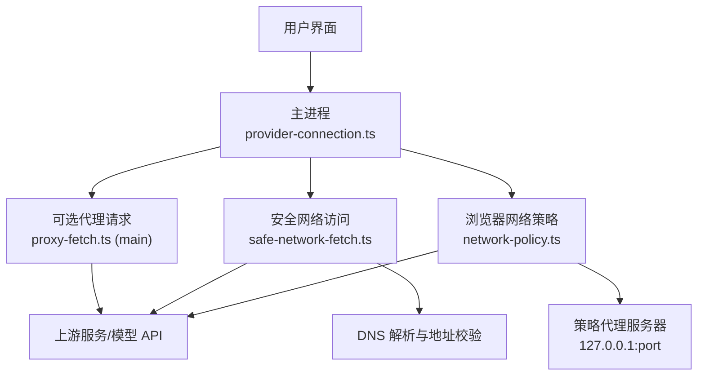
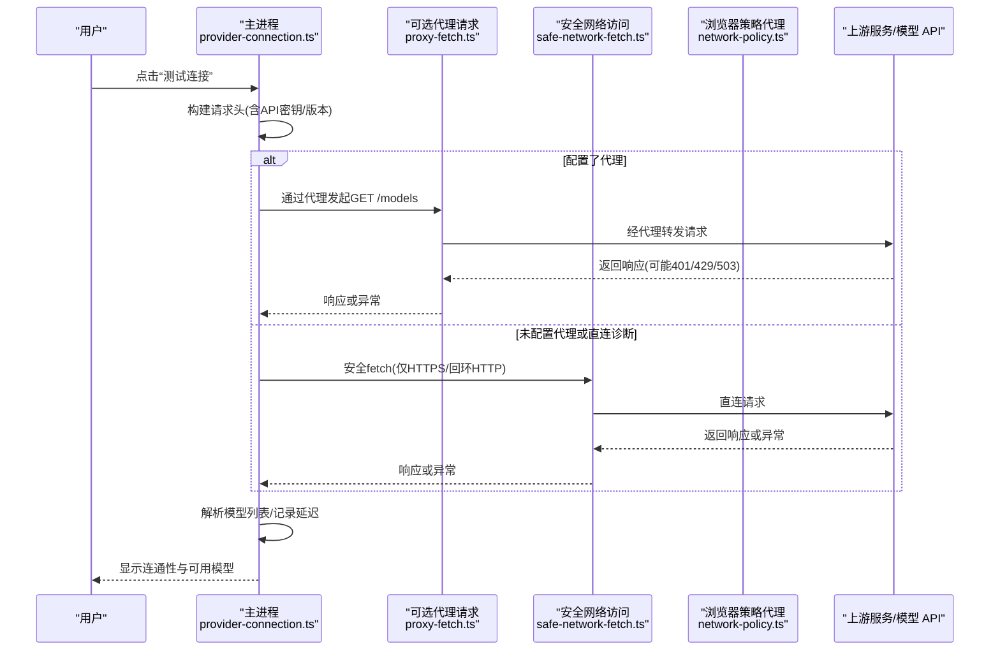
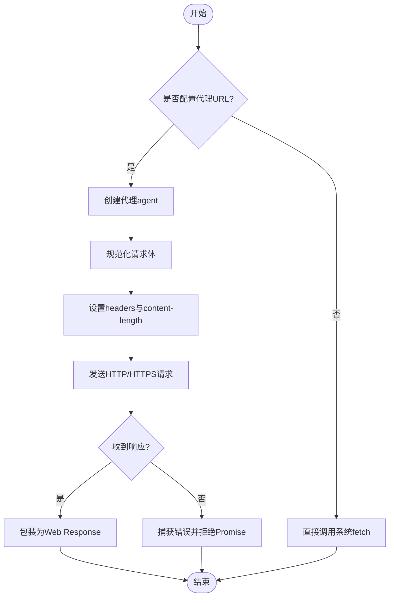
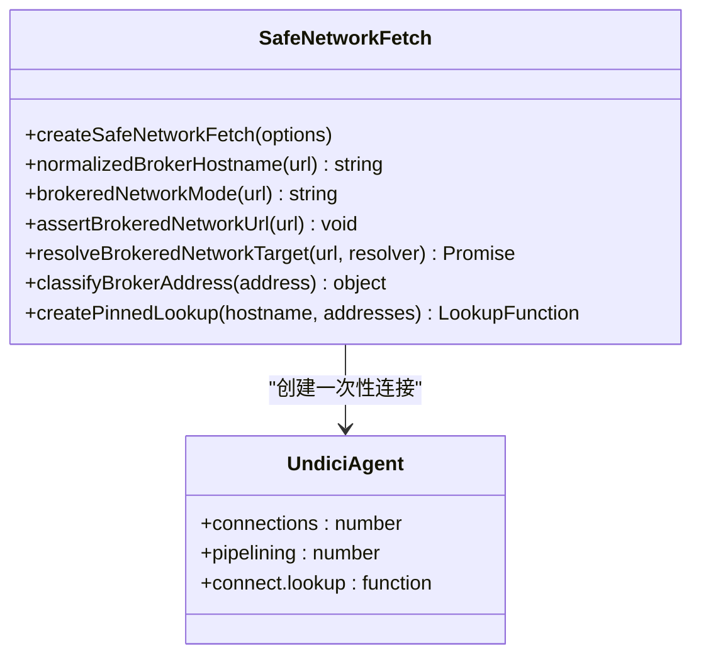
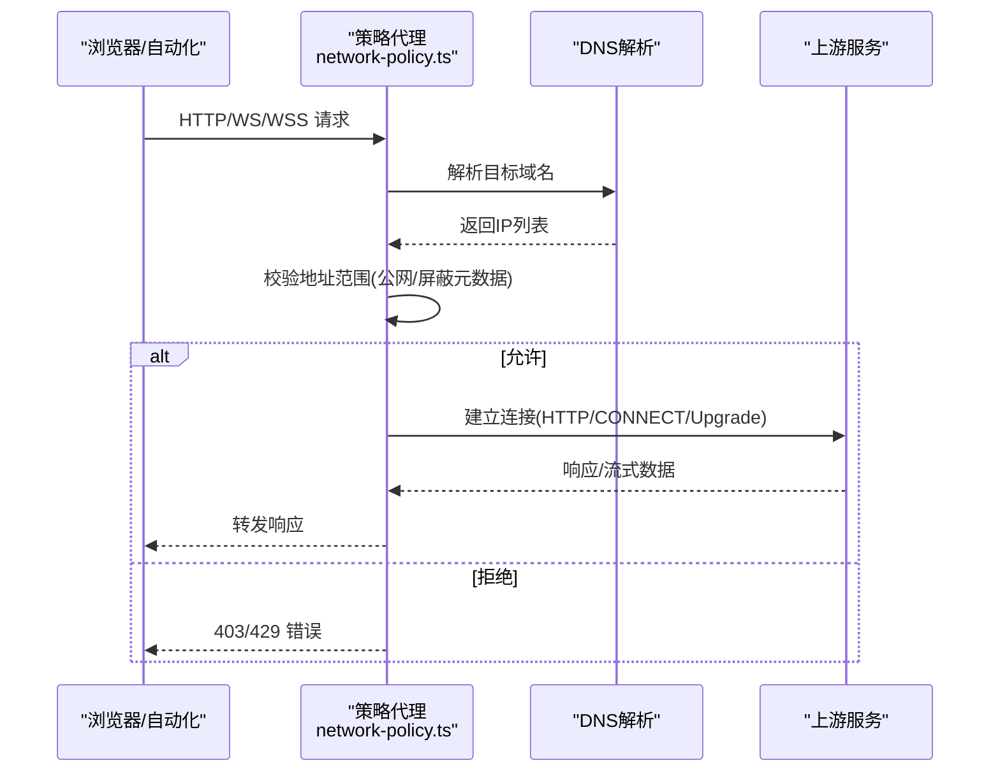
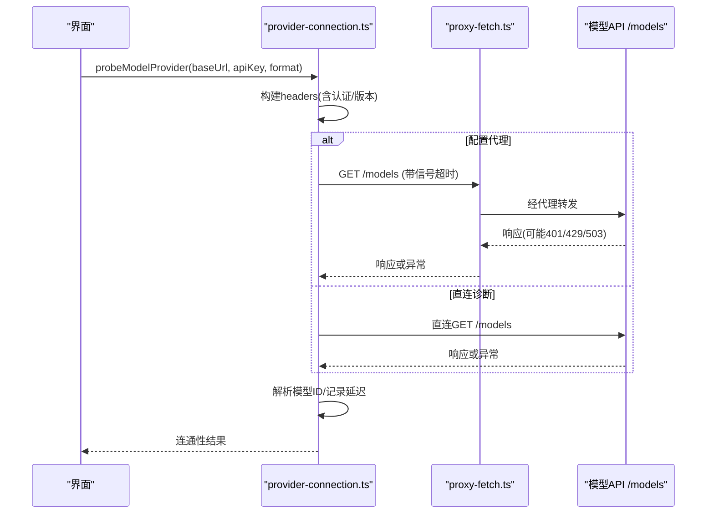
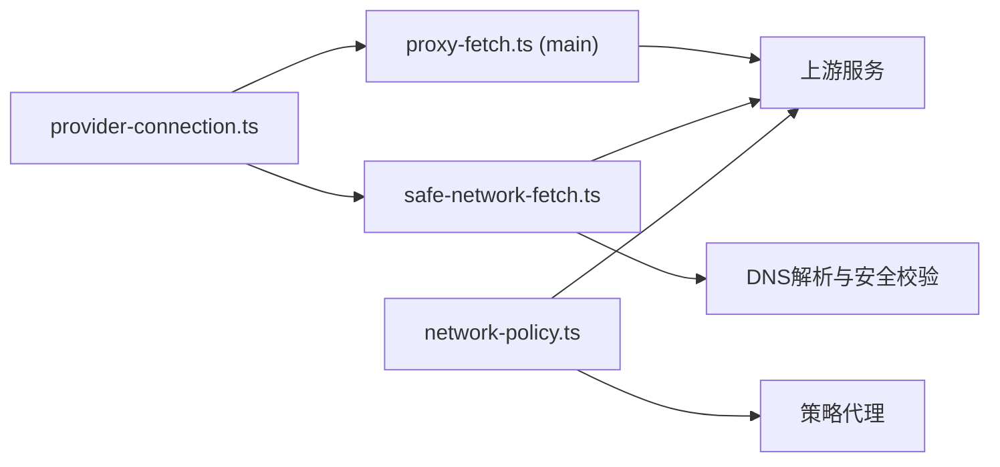

# 网络连接问题

<cite>
**本文引用的文件**
- [src/main/proxy-fetch.ts](file://src/main/proxy-fetch.ts)
- [kun/src/adapters/model/proxy-fetch.ts](file://kun/src/adapters/model/proxy-fetch.ts)
- [src/main/provider-connection.ts](file://src/main/provider-connection.ts)
- [kun/src/extensions/safe-network-fetch.ts](file://kun/src/extensions/safe-network-fetch.ts)
- [src/main/browser-use/network-policy.ts](file://src/main/browser-use/network-policy.ts)
- [src/renderer/src/components/chat/SidebarClawDialogHelpers.ts](file://src/renderer/src/components/chat/SidebarClawDialogHelpers.ts)
</cite>

## 目录
1. [简介](#简介)
2. [项目结构](#项目结构)
3. [核心组件](#核心组件)
4. [架构总览](#架构总览)
5. [详细组件分析](#详细组件分析)
6. [依赖关系分析](#依赖关系分析)
7. [性能与可靠性](#性能与可靠性)
8. [故障排查指南](#故障排查指南)
9. [结论](#结论)
10. [附录：常见错误速查](#附录：常见错误速查)

## 简介
本文件面向 DeepSeek-GUI 的网络连接问题排查，覆盖模型连接失败的诊断方法、代理配置（HTTP/HTTPS、SOCKS、企业网络）、网络诊断工具使用（curl、抓包、连接追踪）、不同网络环境（公司防火墙、VPN、移动网络）的配置建议、连接重试与故障转移策略，以及常见 HTTP 状态码（如 401、429、503）的解决方案。内容基于仓库中实际实现进行说明，帮助你在复杂网络环境下快速定位并解决问题。

## 项目结构
DeepSeek-GUI 在网络层的关键实现分布在主进程与扩展模块中：
- 主进程提供可选代理请求能力，用于在 Electron main 进程中通过代理发起 HTTP/HTTPS 请求。
- 扩展模块提供安全网络访问能力，对 DNS 解析结果进行校验与白名单过滤，防止访问内网或受限地址。
- 浏览器自动化网络策略模块提供受控的 HTTP/WS/WSS 代理，严格限制目标地址范围。
- 模型探测与认证流程在主进程执行，避免渲染进程 CORS 限制，并支持直连与代理两种路径的诊断。
- 前端侧包含针对特定 IM 通道（如微信桥）的错误格式化逻辑，便于用户理解连接失败原因。

**图示来源**
- [src/main/provider-connection.ts:71-153](file://src/main/provider-connection.ts#L71-L153)
- [src/main/proxy-fetch.ts:6-69](file://src/main/proxy-fetch.ts#L6-L69)
- [kun/src/extensions/safe-network-fetch.ts:53-96](file://kun/src/extensions/safe-network-fetch.ts#L53-L96)
- [src/main/browser-use/network-policy.ts:259-301](file://src/main/browser-use/network-policy.ts#L259-L301)

**章节来源**
- [src/main/provider-connection.ts:71-153](file://src/main/provider-connection.ts#L71-L153)
- [src/main/proxy-fetch.ts:6-69](file://src/main/proxy-fetch.ts#L6-L69)
- [kun/src/extensions/safe-network-fetch.ts:53-96](file://kun/src/extensions/safe-network-fetch.ts#L53-L96)
- [src/main/browser-use/network-policy.ts:259-301](file://src/main/browser-use/network-policy.ts#L259-L301)

## 核心组件
- 可选代理请求封装：在主进程中以 Node http/https 模块为基础，结合 proxy-agent 实现带代理的 fetch 兼容接口；支持请求体转换、Content-Length 设置、AbortSignal 取消、错误传播。
- 安全网络访问：在扩展中使用 undici Agent 创建一次性连接，强制 DNS 解析后固定地址，禁止传输层头篡改，仅允许 HTTPS 或本地回环 HTTP，阻止私有/保留地址。
- 浏览器网络策略：提供本地策略代理服务器，对 HTTP/WS/WSS 请求进行策略校验，限制到公网单播地址，屏蔽云元数据地址，支持 CONNECT 隧道与 Upgrade 升级。
- 模型探测与认证：在主进程调用 /models 端点探测可用性，自动注入认证头（Bearer 或 x-api-key），支持超时控制、响应大小限制、直连可达性诊断以区分代理问题。
- 前端错误格式化：针对 IM 通道安装与连接错误进行模式匹配，将底层错误映射为用户友好的提示。

**章节来源**
- [src/main/proxy-fetch.ts:6-96](file://src/main/proxy-fetch.ts#L6-L96)
- [kun/src/adapters/model/proxy-fetch.ts:6-108](file://kun/src/adapters/model/proxy-fetch.ts#L6-L108)
- [kun/src/extensions/safe-network-fetch.ts:53-252](file://kun/src/extensions/safe-network-fetch.ts#L53-L252)
- [src/main/browser-use/network-policy.ts:82-227](file://src/main/browser-use/network-policy.ts#L82-L227)
- [src/main/provider-connection.ts:52-153](file://src/main/provider-connection.ts#L52-L153)
- [src/renderer/src/components/chat/SidebarClawDialogHelpers.ts:59-79](file://src/renderer/src/components/chat/SidebarClawDialogHelpers.ts#L59-L79)

## 架构总览
下图展示了从用户操作到模型调用的关键网络路径，包括代理选择、安全校验、策略代理与上游服务交互。

**图示来源**
- [src/main/provider-connection.ts:71-153](file://src/main/provider-connection.ts#L71-L153)
- [src/main/proxy-fetch.ts:6-69](file://src/main/proxy-fetch.ts#L6-L69)
- [kun/src/extensions/safe-network-fetch.ts:53-96](file://kun/src/extensions/safe-network-fetch.ts#L53-L96)

## 详细组件分析

### 可选代理请求（主进程）
- 功能要点：
  - 当提供代理 URL 时，通过 proxy-agent 构造 agent，并使用 Node http/https 模块发起请求，兼容 RequestInit 的 method、headers、body、signal。
  - 自动处理 body 类型转换与 Content-Length 设置，确保代理正确转发。
  - 支持 AbortSignal 取消，错误事件透传。
- 适用场景：
  - 企业网络要求所有出站流量经过 HTTP/HTTPS 代理。
  - 需要绕过渲染进程 CORS 限制，在主进程统一处理网络。

**图示来源**
- [src/main/proxy-fetch.ts:6-69](file://src/main/proxy-fetch.ts#L6-L69)

**章节来源**
- [src/main/proxy-fetch.ts:6-96](file://src/main/proxy-fetch.ts#L6-L96)

### 安全网络访问（扩展）
- 功能要点：
  - 强制禁用重定向跟随，禁止设置传输层头（如 connection、host、upgrade 等）。
  - DNS 解析后固定地址，使用一次性 Agent 连接，避免连接复用导致的目标漂移。
  - 仅允许 HTTPS 或本地回环 HTTP，阻止私有/保留/链路本地地址。
- 适用场景：
  - 扩展需要访问外部服务但需严格的安全策略。
  - 防止 SSRF 与内网泄露。

**图示来源**
- [kun/src/extensions/safe-network-fetch.ts:53-252](file://kun/src/extensions/safe-network-fetch.ts#L53-L252)

**章节来源**
- [kun/src/extensions/safe-network-fetch.ts:53-252](file://kun/src/extensions/safe-network-fetch.ts#L53-L252)

### 浏览器网络策略（策略代理）
- 功能要点：
  - 启动本地策略代理服务器（127.0.0.1:随机端口），对 HTTP/WS/WSS 请求进行策略校验。
  - 限制目标为公网单播地址，屏蔽云元数据地址（如 169.254.169.254）。
  - 支持 CONNECT 隧道与 WebSocket Upgrade，限制并发连接数，超时控制。
- 适用场景：
  - 浏览器自动化任务需访问受限站点，同时保证安全策略。
  - 企业环境中需要对浏览器流量进行集中管控。

**图示来源**
- [src/main/browser-use/network-policy.ts:259-467](file://src/main/browser-use/network-policy.ts#L259-L467)

**章节来源**
- [src/main/browser-use/network-policy.ts:82-227](file://src/main/browser-use/network-policy.ts#L82-L227)
- [src/main/browser-use/network-policy.ts:259-522](file://src/main/browser-use/network-policy.ts#L259-L522)

### 模型探测与认证（主进程）
- 功能要点：
  - 根据 endpointFormat 注入认证头（messages 格式使用 x-api-key 与 anthropic-version，其他使用 Authorization: Bearer）。
  - 调用 /models 端点探测，限制响应大小，解析模型 ID 列表。
  - 若代理探测失败，尝试直连可达性诊断，给出明确提示。
- 适用场景：
  - 验证模型提供商连通性与凭据有效性。
  - 区分代理配置错误与上游服务不可用。

**图示来源**
- [src/main/provider-connection.ts:52-153](file://src/main/provider-connection.ts#L52-L153)
- [src/main/proxy-fetch.ts:6-69](file://src/main/proxy-fetch.ts#L6-L69)

**章节来源**
- [src/main/provider-connection.ts:52-153](file://src/main/provider-connection.ts#L52-L153)

### 前端错误格式化（IM 通道）
- 功能要点：
  - 对底层错误进行模式匹配，识别 WeChat 登录桥、OpenClaw Gateway 不可用、fetch 失败、ECONNREFUSED、HTTP 401/404/503 等。
  - 将错误映射为用户友好的中文提示，降低排障门槛。
- 适用场景：
  - IM 通道安装与绑定过程中出现网络问题时，提供清晰指引。

**章节来源**
- [src/renderer/src/components/chat/SidebarClawDialogHelpers.ts:59-79](file://src/renderer/src/components/chat/SidebarClawDialogHelpers.ts#L59-L79)

## 依赖关系分析
- 主进程依赖可选代理请求封装，用于统一处理代理与直连。
- 扩展模块依赖安全网络访问，确保 DNS 解析后的地址安全。
- 浏览器自动化依赖策略代理，集中管控出站流量。
- 模型探测依赖认证头注入与响应限制，保障稳定性与安全性。

**图示来源**
- [src/main/provider-connection.ts:71-153](file://src/main/provider-connection.ts#L71-L153)
- [src/main/proxy-fetch.ts:6-69](file://src/main/proxy-fetch.ts#L6-L69)
- [kun/src/extensions/safe-network-fetch.ts:53-96](file://kun/src/extensions/safe-network-fetch.ts#L53-L96)
- [src/main/browser-use/network-policy.ts:259-301](file://src/main/browser-use/network-policy.ts#L259-L301)

**章节来源**
- [src/main/provider-connection.ts:71-153](file://src/main/provider-connection.ts#L71-L153)
- [src/main/proxy-fetch.ts:6-69](file://src/main/proxy-fetch.ts#L6-L69)
- [kun/src/extensions/safe-network-fetch.ts:53-96](file://kun/src/extensions/safe-network-fetch.ts#L53-L96)
- [src/main/browser-use/network-policy.ts:259-301](file://src/main/browser-use/network-policy.ts#L259-L301)

## 性能与可靠性
- 超时控制：模型探测使用固定超时（默认约10秒），直连诊断使用更短超时（约5秒），避免长时间阻塞。
- 响应限制：模型列表响应限制最大字节数，防止大响应占用内存。
- 连接复用：安全网络访问使用一次性 Agent，避免连接复用带来的安全风险；策略代理限制并发连接数，防止资源耗尽。
- 错误分类：通过错误消息与状态码分类，提升可诊断性。

[本节为通用性能讨论，不直接分析具体文件]

## 故障排查指南

### 1. 模型连接失败的诊断方法
- 检查 Base URL 格式：必须以 http:// 或 https:// 开头。
- 检查 API 密钥与认证头：
  - messages 格式需携带 x-api-key 与 anthropic-version。
  - 其他格式需携带 Authorization: Bearer <key>。
- 检查代理配置：
  - 若配置了代理，先确认代理可达且能转发 HTTPS。
  - 若代理失败，系统将尝试直连诊断，若直连可达则提示“代理失败但直连可达”。
- 检查超时与响应大小：
  - 若请求超时，检查网络质量与代理延迟。
  - 若响应过大被截断，减少模型数量或调整限制。

**章节来源**
- [src/main/provider-connection.ts:71-153](file://src/main/provider-connection.ts#L71-L153)
- [src/main/provider-connection.ts:155-179](file://src/main/provider-connection.ts#L155-L179)

### 2. 代理配置的正确设置
- HTTP/HTTPS 代理：
  - 在主进程可选代理请求中，提供代理 URL 即可启用代理。
  - 确保代理支持 CONNECT 方法以访问 HTTPS。
- SOCKS 代理：
  - 当前实现主要基于 HTTP/HTTPS 代理；如需 SOCKS，请通过系统级代理或网关转发。
- 企业网络环境：
  - 若企业要求统一出口代理，确保代理证书可信，必要时配置 CA 证书。
  - 若存在透明代理或拦截器，注意可能修改响应头或注入脚本，影响鉴权。

**章节来源**
- [src/main/proxy-fetch.ts:6-69](file://src/main/proxy-fetch.ts#L6-L69)
- [kun/src/adapters/model/proxy-fetch.ts:6-108](file://kun/src/adapters/model/proxy-fetch.ts#L6-L108)

### 3. 网络诊断工具的使用
- curl 测试：
  - 使用 curl 直接访问 /models 端点，验证网络连通性与鉴权。
  - 在代理环境下，使用 --proxy 参数指定代理。
- 网络抓包：
  - 使用 Wireshark 或 tcpdump 抓取 TCP/HTTP 流量，观察握手与请求头。
  - 关注 TLS 握手失败、证书错误、代理 407 等。
- 连接追踪：
  - 使用 netstat/ss 查看连接状态，确认是否存在大量 TIME_WAIT 或半开连接。
  - 使用 nslookup/dig 检查 DNS 解析结果是否符合预期。

[本节为通用诊断指导，不直接分析具体文件]

### 4. 不同网络环境的配置指南
- 公司防火墙：
  - 确保放行 HTTPS 443 端口及代理端口。
  - 若启用 SSL 拦截，导入企业 CA 证书到系统信任链。
- VPN 环境：
  - 确认 VPN 路由不会将模型域名指向内网。
  - 若 VPN 劫持 DNS，改用系统 DNS 或配置 hosts。
- 移动网络：
  - 运营商可能限制某些端口或协议，优先使用 HTTPS 443。
  - 若频繁切换网络，增加重试与退避策略。

[本节为通用配置指导，不直接分析具体文件]

### 5. 连接重试机制与故障转移策略
- 重试建议：
  - 对 429（请求过多）与 503（服务不可用）实施指数退避重试。
  - 对 401（未授权）不进行重试，提示用户更新凭据。
- 故障转移：
  - 若代理失败且直连可达，切换到直连。
  - 多模型提供商场景下，可配置备用端点，自动切换。

[本节为通用可靠性建议，不直接分析具体文件]

### 6. 常见网络错误的解决方案
- 401 未授权：
  - 检查 API 密钥是否正确，认证头是否注入。
  - 对于订阅型服务（如 ChatGPT/Grok），确认证据未过期。
- 429 请求过多：
  - 降低请求频率，实施令牌桶或漏桶限流。
  - 等待服务端恢复后重试。
- 503 服务不可用：
  - 检查上游服务状态，等待恢复后重试。
  - 若为代理问题，尝试直连或更换代理。

**章节来源**
- [src/main/provider-connection.ts:71-153](file://src/main/provider-connection.ts#L71-L153)
- [src/renderer/src/components/chat/SidebarClawDialogHelpers.ts:59-79](file://src/renderer/src/components/chat/SidebarClawDialogHelpers.ts#L59-L79)

## 结论
DeepSeek-GUI 在网络层提供了灵活的代理支持与严格的安全策略，适用于企业、VPN 与移动网络等多种环境。通过主进程的模型探测、可选代理请求、安全网络访问与浏览器策略代理，能够有效诊断并解决常见的网络连接问题。建议在生产环境中结合日志与监控，持续优化超时、重试与故障转移策略，提升用户体验与系统稳定性。

[本节为总结性内容，不直接分析具体文件]

## 附录：常见错误速查
- 基础 URL 错误：确保以 http:// 或 https:// 开头。
- 认证失败：检查 API 密钥与认证头注入。
- 代理失败：确认代理可达、支持 CONNECT、证书可信。
- 直连可达但代理失败：提示关闭或更新代理。
- 响应过大：限制模型列表大小，避免内存溢出。
- IM 通道错误：根据前端错误格式化提示，检查桥接服务与网关配置。

**章节来源**
- [src/main/provider-connection.ts:71-153](file://src/main/provider-connection.ts#L71-L153)
- [src/renderer/src/components/chat/SidebarClawDialogHelpers.ts:59-79](file://src/renderer/src/components/chat/SidebarClawDialogHelpers.ts#L59-L79)