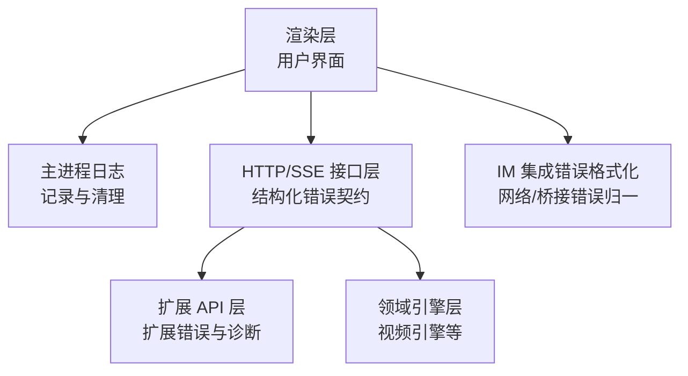
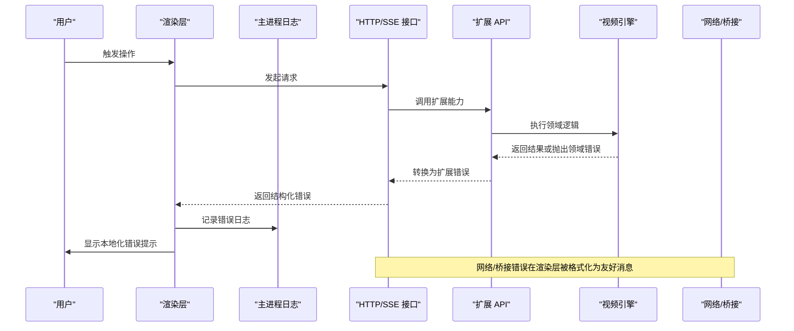
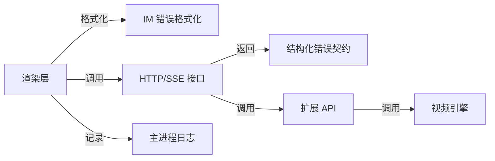

# 错误诊断

<cite>
**本文引用的文件**
- [kun/src/contracts/errors.ts](file://kun/src/contracts/errors.ts)
- [packages/extension-api/src/errors.ts](file://packages/extension-api/src/errors.ts)
- [examples/extensions/kun-video-editor/src/engine/errors.ts](file://examples/extensions/kun-video-editor/src/engine/errors.ts)
- [src/main/logger.ts](file://src/main/logger.ts)
- [src/renderer/src/components/chat/SidebarClawDialogHelpers.ts](file://src/renderer/src/components/chat/SidebarClawDialogHelpers.ts)
- [kun/src/adapters/tool/ppt-master-tool.test.ts](file://kun/src/adapters/tool/ppt-master-tool.test.ts)
</cite>

## 目录
1. [简介](#简介)
2. [项目结构](#项目结构)
3. [核心组件](#核心组件)
4. [架构总览](#架构总览)
5. [详细组件分析](#详细组件分析)
6. [依赖关系分析](#依赖关系分析)
7. [性能考虑](#性能考虑)
8. [故障排查指南](#故障排查指南)
9. [结论](#结论)
10. [附录](#附录)

## 简介
本文件为 DeepSeek-GUI 提供系统化的错误诊断指南，覆盖错误分类、错误码参考、日志分析与定位、复现与调试流程、常见错误模式识别与修复，以及错误报告模板与故障信息收集方法。目标是帮助开发者与运维人员快速定位并解决问题，提升系统稳定性与可维护性。

## 项目结构
DeepSeek-GUI 的错误处理涉及多个层次：
- 运行时与 HTTP/SSE 接口层：统一的结构化错误契约（code/message/details）
- 扩展 API 层：统一的扩展错误类型与诊断数据模型
- 领域引擎层：特定领域的错误类型（如视频引擎）
- 主进程日志：结构化日志写入、保留策略与清理
- 渲染层：用户可见错误的本地化与友好提示

图表来源
- [src/main/logger.ts:1-120](file://src/main/logger.ts#L1-L120)
- [kun/src/contracts/errors.ts:1-42](file://kun/src/contracts/errors.ts#L1-L42)
- [packages/extension-api/src/errors.ts:1-95](file://packages/extension-api/src/errors.ts#L1-L95)
- [examples/extensions/kun-video-editor/src/engine/errors.ts:1-42](file://examples/extensions/kun-video-editor/src/engine/errors.ts#L1-L42)
- [src/renderer/src/components/chat/SidebarClawDialogHelpers.ts:59-79](file://src/renderer/src/components/chat/SidebarClawDialogHelpers.ts#L59-L79)

章节来源
- [src/main/logger.ts:1-120](file://src/main/logger.ts#L1-L120)
- [kun/src/contracts/errors.ts:1-42](file://kun/src/contracts/errors.ts#L1-L42)
- [packages/extension-api/src/errors.ts:1-95](file://packages/extension-api/src/errors.ts#L1-L95)
- [examples/extensions/kun-video-editor/src/engine/errors.ts:1-42](file://examples/extensions/kun-video-editor/src/engine/errors.ts#L1-L42)
- [src/renderer/src/components/chat/SidebarClawDialogHelpers.ts:59-79](file://src/renderer/src/components/chat/SidebarClawDialogHelpers.ts#L59-L79)

## 核心组件
- 结构化错误契约：所有 Kun HTTP/SSE 端点返回统一结构，包含稳定 code、可读 message 与可选 details，便于 UI 状态驱动与诊断展示。
- 扩展 API 错误：定义扩展错误码集合、错误数据结构与诊断数据模型，支持重试标记、文档链接与操作上下文。
- 领域引擎错误：针对视频引擎的专用错误类型，封装业务域错误码与详情。
- 主进程日志：按级别写入管理日志文件，自动清理过期日志，避免影响应用运行。
- IM 集成错误格式化：将底层网络/桥接错误映射为用户友好的本地化提示。

章节来源
- [kun/src/contracts/errors.ts:1-42](file://kun/src/contracts/errors.ts#L1-L42)
- [packages/extension-api/src/errors.ts:1-95](file://packages/extension-api/src/errors.ts#L1-L95)
- [examples/extensions/kun-video-editor/src/engine/errors.ts:1-42](file://examples/extensions/kun-video-editor/src/engine/errors.ts#L1-L42)
- [src/main/logger.ts:1-120](file://src/main/logger.ts#L1-L120)
- [src/renderer/src/components/chat/SidebarClawDialogHelpers.ts:59-79](file://src/renderer/src/components/chat/SidebarClawDialogHelpers.ts#L59-L79)

## 架构总览
下图展示了从渲染层到后端服务与外部依赖的错误流转路径，包括日志记录、错误归一化与用户提示。

图表来源
- [src/main/logger.ts:59-102](file://src/main/logger.ts#L59-L102)
- [kun/src/contracts/errors.ts:11-41](file://kun/src/contracts/errors.ts#L11-L41)
- [packages/extension-api/src/errors.ts:4-39](file://packages/extension-api/src/errors.ts#L4-L39)
- [examples/extensions/kun-video-editor/src/engine/errors.ts:19-41](file://examples/extensions/kun-video-editor/src/engine/errors.ts#L19-L41)
- [src/renderer/src/components/chat/SidebarClawDialogHelpers.ts:59-79](file://src/renderer/src/components/chat/SidebarClawDialogHelpers.ts#L59-L79)

## 详细组件分析

### 运行时错误（HTTP/SSE 结构化错误）
- 错误码体系：包含验证失败、未授权、禁止访问、资源不存在、冲突、限流、线程忙、轮次进行中/未运行、审批不待处理、能力不可用、提供者不可用、策略阻止、模型模态不支持、附件校验失败、内部错误、未实现、中止等。
- 错误体结构：code、message、details（可选），用于 UI 状态与诊断展示。
- 使用建议：
  - 服务端统一抛出结构化错误，客户端根据 code 进行分支处理。
  - 对可重试错误（如限流、线程忙）实施退避与重试。
  - 对权限类错误（未授权/禁止访问）引导用户重新认证或申请权限。

章节来源
- [kun/src/contracts/errors.ts:11-41](file://kun/src/contracts/errors.ts#L11-L41)

### 业务逻辑错误（扩展 API）
- 错误码集合：无效参数、校验失败、权限拒绝、资源不存在、冲突、能力不支持、API/清单/RPC 不兼容、激活失败/超时、取消、预算耗尽、交互需要、提供者不可用、账户需要、协议错误、资源限制、主机不可用、内部错误。
- 错误数据结构：包含 operation、extensionId、retryable、details、documentation，便于追踪与自助修复。
- 使用建议：
  - 通过 from/factory 方法将未知异常包装为标准扩展错误。
  - 利用 retryable 字段控制前端重试策略。
  - 使用 documentation 字段提供自助修复指引。

章节来源
- [packages/extension-api/src/errors.ts:4-39](file://packages/extension-api/src/errors.ts#L4-L39)
- [packages/extension-api/src/errors.ts:42-84](file://packages/extension-api/src/errors.ts#L42-L84)

### 网络错误（IM 集成错误格式化）
- 错误归一化：将微信登录桥缺失、OpenClaw Gateway 不可用/未配置、环境变量缺失、fetch 失败、连接拒绝、HTTP 401/404/503 等错误统一映射为用户友好的本地化提示。
- 使用建议：
  - 在 IM 添加/连接流程中捕获底层错误并调用格式化函数。
  - 对用户明确提示“缺少桥接/网关未配置”等可操作信息。

章节来源
- [src/renderer/src/components/chat/SidebarClawDialogHelpers.ts:59-79](file://src/renderer/src/components/chat/SidebarClawDialogHelpers.ts#L59-L79)

### 权限错误（策略与审批）
- 策略阻止与审批状态：当策略阻止或审批不处于待处理状态时，应返回相应错误码并提示用户完成必要步骤。
- 使用建议：
  - 对审批相关操作先检查审批状态，再执行敏感动作。
  - 对策略阻止场景提供可操作的解决路径（如申请权限）。

章节来源
- [kun/src/contracts/errors.ts:11-29](file://kun/src/contracts/errors.ts#L11-L29)

### 领域引擎错误（视频引擎）
- 错误码：项目无效、模式版本不支持、操作无效、修订冲突、项目不存在/已存在、历史不可用、代理撤销受限、需要恢复、媒体重链、路径逃逸、脚本陈旧/无效、转录无效、转写器不可用、渲染不支持。
- 错误类型：VideoEngineError 封装 code、message、details。
- 使用建议：
  - 在视频编辑流程中对关键步骤进行输入校验与状态检查。
  - 对资源冲突与陈旧脚本进行刷新或重建。

章节来源
- [examples/extensions/kun-video-editor/src/engine/errors.ts:1-42](file://examples/extensions/kun-video-editor/src/engine/errors.ts#L1-L42)

### 工具与流程错误（演示与示例）
- 路径与安全校验：拒绝超出受管写入位置的路径、非 Markdown 源文件、输出路径不在允许目录。
- 审批前置：在未获得设计确认前拒绝项目生成。
- 导出校验：成功退出但未创建 PPTX、接受旧 PPTX 视为错误。
- 读取限制：仅读取受管技能包内的有限文档，防止越界与超限。

章节来源
- [kun/src/adapters/tool/ppt-master-tool.test.ts:156-200](file://kun/src/adapters/tool/ppt-master-tool.test.ts#L156-L200)
- [kun/src/adapters/tool/ppt-master-tool.test.ts:202-238](file://kun/src/adapters/tool/ppt-master-tool.test.ts#L202-L238)
- [kun/src/adapters/tool/ppt-master-tool.test.ts:240-260](file://kun/src/adapters/tool/ppt-master-tool.test.ts#L240-L260)
- [kun/src/adapters/tool/ppt-master-tool.test.ts:304-328](file://kun/src/adapters/tool/ppt-master-tool.test.ts#L304-L328)

## 依赖关系分析
- 耦合度：
  - 渲染层依赖 IM 错误格式化模块，降低网络/桥接错误对用户的影响。
  - HTTP/SSE 接口层依赖结构化错误契约，确保前后端一致。
  - 扩展 API 层依赖错误数据结构，支撑跨扩展的统一错误处理。
  - 领域引擎错误独立于通用错误，便于领域内精细化处理。
- 直接/间接依赖：
  - 日志模块被各层调用，用于问题定位与审计。
  - 错误契约与扩展错误在接口边界处转换，形成清晰的依赖边界。
- 外部依赖：
  - 网络/桥接（微信登录桥、OpenClaw Gateway）可能引入不稳定因素，需在前端做容错与降级。

图表来源
- [src/renderer/src/components/chat/SidebarClawDialogHelpers.ts:59-79](file://src/renderer/src/components/chat/SidebarClawDialogHelpers.ts#L59-L79)
- [kun/src/contracts/errors.ts:11-41](file://kun/src/contracts/errors.ts#L11-L41)
- [packages/extension-api/src/errors.ts:4-39](file://packages/extension-api/src/errors.ts#L4-L39)
- [examples/extensions/kun-video-editor/src/engine/errors.ts:19-41](file://examples/extensions/kun-video-editor/src/engine/errors.ts#L19-L41)
- [src/main/logger.ts:59-102](file://src/main/logger.ts#L59-L102)

章节来源
- [src/renderer/src/components/chat/SidebarClawDialogHelpers.ts:59-79](file://src/renderer/src/components/chat/SidebarClawDialogHelpers.ts#L59-L79)
- [kun/src/contracts/errors.ts:11-41](file://kun/src/contracts/errors.ts#L11-L41)
- [packages/extension-api/src/errors.ts:4-39](file://packages/extension-api/src/errors.ts#L4-L39)
- [examples/extensions/kun-video-editor/src/engine/errors.ts:19-41](file://examples/extensions/kun-video-editor/src/engine/errors.ts#L19-L41)
- [src/main/logger.ts:59-102](file://src/main/logger.ts#L59-L102)

## 性能考虑
- 日志写入：每次写入后尝试清理过期日志，避免磁盘占用增长；若失败则静默忽略，不影响应用运行。
- 错误序列化：安全字符串化限制长度，防止大对象导致日志膨胀。
- 重试策略：对限流/线程忙等可重试错误采用指数退避，减少瞬时压力。
- 资源限制：对读取与输出进行边界控制，避免内存与 I/O 瓶颈。

[本节为通用指导，无需具体文件引用]

## 故障排查指南

### 日志级别配置与关键信息提取
- 日志级别：error/warn/info，分别对应严重错误、警告信息与一般信息。
- 关键信息：时间戳、级别、类别、消息与可选详情；详情会被安全序列化并截断。
- 文件命名：按日期生成日志文件，便于按天检索。
- 保留策略：启动时清理过期日志，默认保留天数可配置。

章节来源
- [src/main/logger.ts:5-15](file://src/main/logger.ts#L5-L15)
- [src/main/logger.ts:24-33](file://src/main/logger.ts#L24-L33)
- [src/main/logger.ts:39-57](file://src/main/logger.ts#L39-L57)
- [src/main/logger.ts:77-102](file://src/main/logger.ts#L77-L102)
- [src/main/logger.ts:107-119](file://src/main/logger.ts#L107-L119)

### 错误复现与调试流程
- 断点设置：在 HTTP/SSE 接口层与扩展 API 层设置断点，观察错误码与详情。
- 变量检查：关注 code、message、details、operation、extensionId、retryable。
- 调用栈分析：结合日志类别与时间戳，定位错误发生的具体阶段。
- 网络/桥接：检查微信登录桥与 OpenClaw Gateway 的状态与环境变量配置。

章节来源
- [packages/extension-api/src/errors.ts:4-39](file://packages/extension-api/src/errors.ts#L4-L39)
- [src/renderer/src/components/chat/SidebarClawDialogHelpers.ts:59-79](file://src/renderer/src/components/chat/SidebarClawDialogHelpers.ts#L59-L79)

### 常见错误模式识别与修复
- 空指针异常：在扩展 API 与领域引擎中进行输入校验，避免 null/undefined 导致的崩溃。
- 类型转换错误：严格校验参数类型与范围，使用结构化错误返回详细信息。
- 资源竞争：对线程忙/轮次进行中等状态进行排队与退避，避免并发冲突。
- 路径与安全：拒绝越界路径与非允许文件类型，防止安全风险。
- 审批前置：在执行敏感操作前检查审批状态，确保合规。

章节来源
- [packages/extension-api/src/errors.ts:4-39](file://packages/extension-api/src/errors.ts#L4-L39)
- [examples/extensions/kun-video-editor/src/engine/errors.ts:1-42](file://examples/extensions/kun-video-editor/src/engine/errors.ts#L1-L42)
- [kun/src/adapters/tool/ppt-master-tool.test.ts:156-200](file://kun/src/adapters/tool/ppt-master-tool.test.ts#L156-L200)
- [kun/src/adapters/tool/ppt-master-tool.test.ts:202-238](file://kun/src/adapters/tool/ppt-master-tool.test.ts#L202-L238)

### 错误报告模板与故障信息收集
- 基本信息：错误码、消息、详情、操作、扩展 ID、是否可重试。
- 环境信息：平台、版本、网络状态、桥接/网关配置。
- 日志片段：最近 error/warn 日志的时间戳与类别。
- 复现步骤：最小化操作步骤与期望/实际结果。
- 附加材料：截图、录屏、配置文件（脱敏）。

[本节为通用指导，无需具体文件引用]

## 结论
DeepSeek-GUI 通过结构化错误契约、扩展 API 错误模型、领域引擎错误类型与主进程日志体系，构建了端到端的错误诊断能力。配合 IM 集成错误格式化与严格的输入/路径/审批校验，能够有效提升系统的稳定性与用户体验。建议在开发过程中遵循统一错误规范，完善日志记录与重试策略，持续优化错误定位与修复效率。

[本节为总结性内容，无需具体文件引用]

## 附录

### 错误码参考手册（节选）
- 运行时错误（HTTP/SSE）：validation_error、unauthorized、forbidden、not_found、conflict、rate_limited、thread_busy、turn_in_progress、turn_not_running、approval_not_pending、capability_unavailable、provider_unavailable、policy_blocked、model_modality_unsupported、attachment_validation_failed、internal_error、not_implemented、aborted
- 扩展 API 错误：INVALID_ARGUMENT、VALIDATION_FAILED、PERMISSION_DENIED、NOT_FOUND、CONFLICT、UNSUPPORTED_CAPABILITY、INCOMPATIBLE_API、INCOMPATIBLE_MANIFEST、INCOMPATIBLE_ENGINE、INCOMPATIBLE_RPC、ACTIVATION_FAILED、ACTIVATION_TIMEOUT、CANCELLED、BUDGET_EXHAUSTED、INTERACTION_REQUIRED、PROVIDER_UNAVAILABLE、ACCOUNT_REQUIRED、PROTOCOL_ERROR、RESOURCE_LIMIT、HOST_UNAVAILABLE、INTERNAL_ERROR
- 视频引擎错误：invalid_project、unsupported_schema_version、invalid_operation、revision_conflict、project_not_found、project_exists、history_unavailable、agent_undo_fenced、recovery_required、media_relink_required、path_escape、script_stale、script_invalid、transcript_invalid、transcriber_unavailable、render_unsupported

章节来源
- [kun/src/contracts/errors.ts:11-29](file://kun/src/contracts/errors.ts#L11-L29)
- [packages/extension-api/src/errors.ts:4-26](file://packages/extension-api/src/errors.ts#L4-L26)
- [examples/extensions/kun-video-editor/src/engine/errors.ts:1-18](file://examples/extensions/kun-video-editor/src/engine/errors.ts#L1-L18)