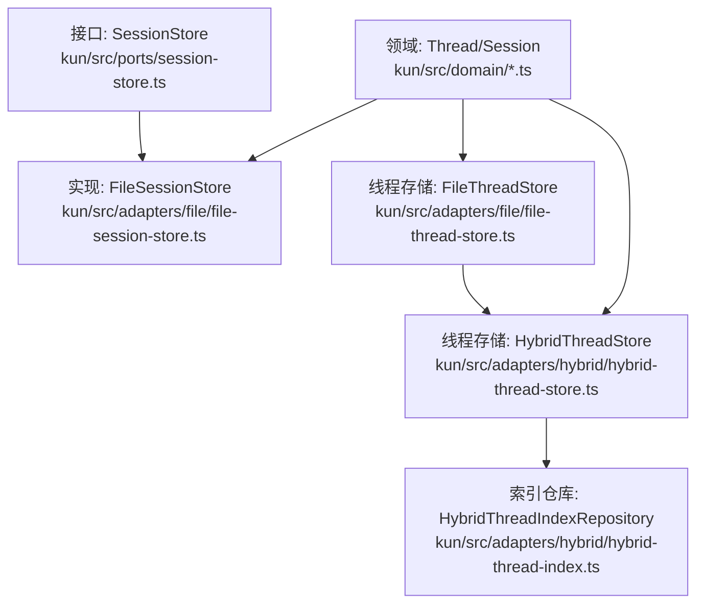
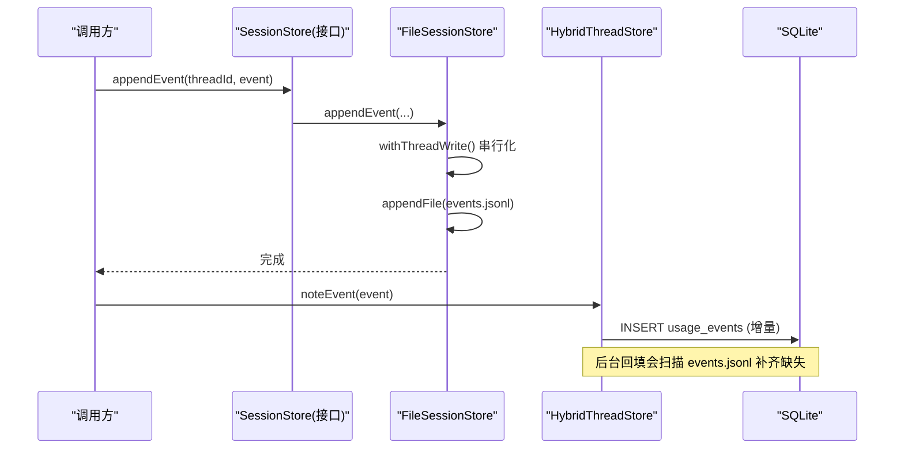
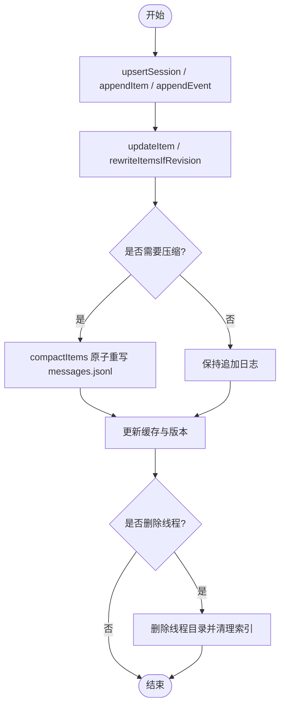
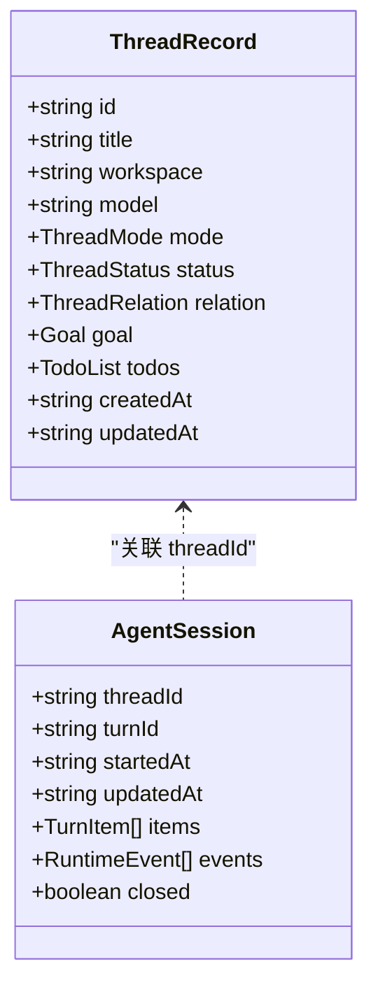
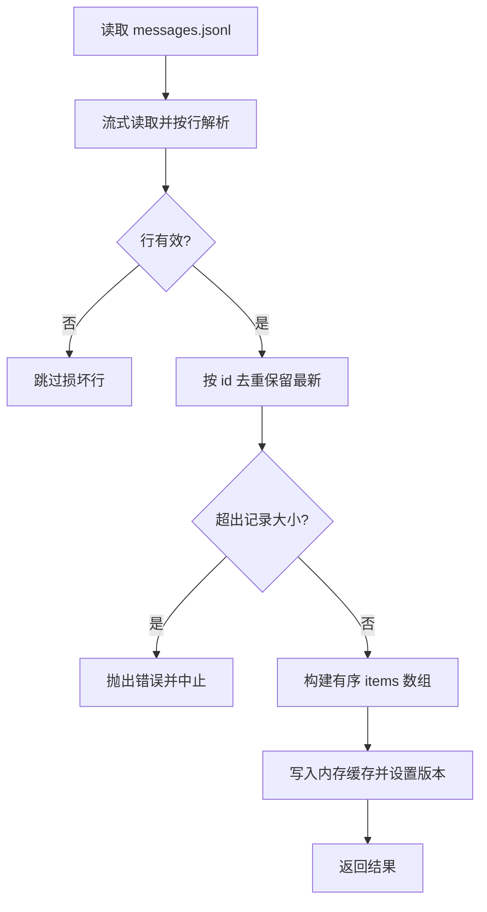
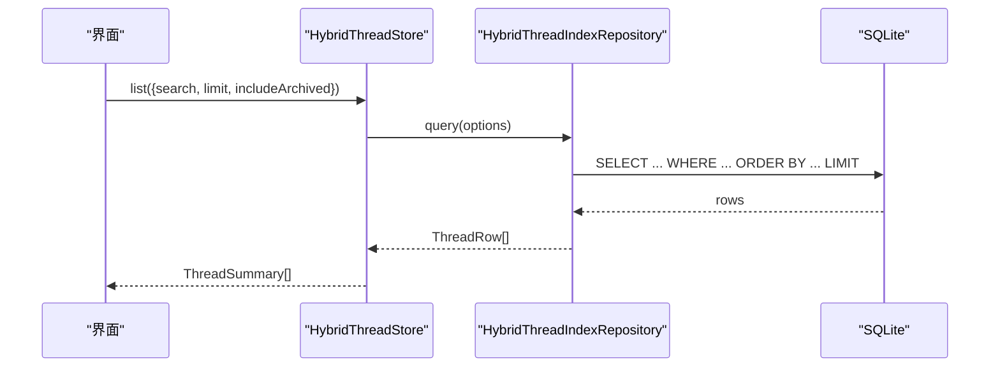
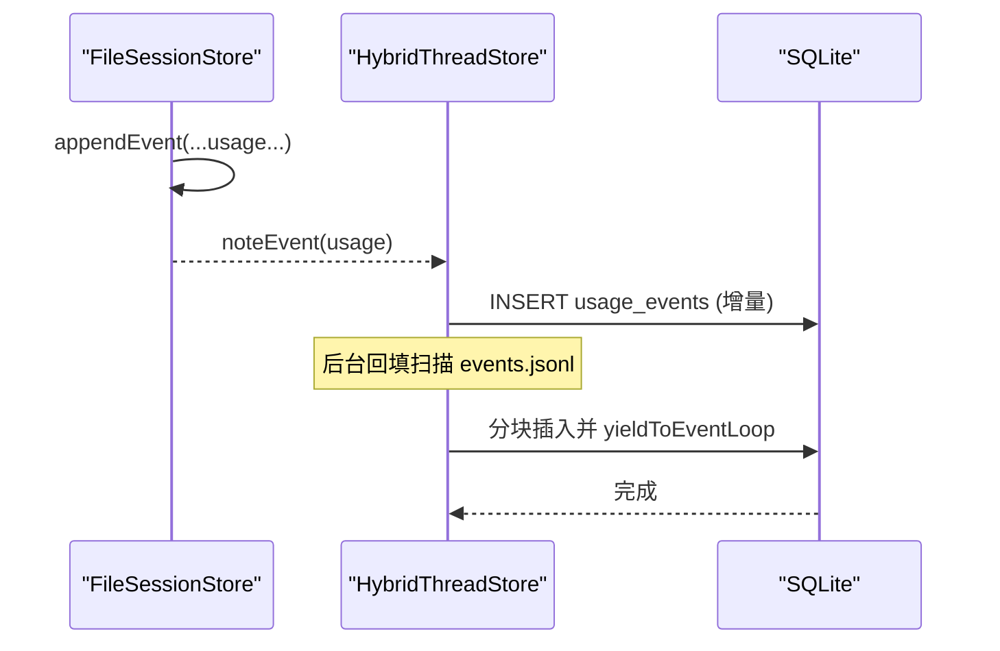
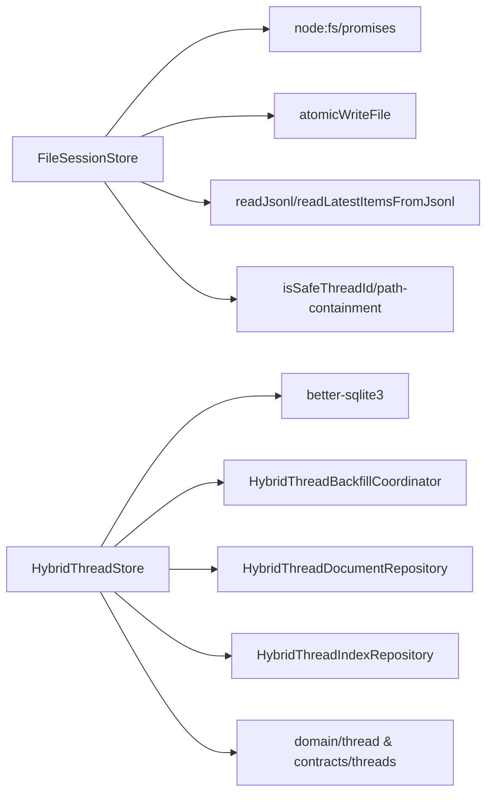

# 会话存储

<cite>
**本文引用的文件**
- [file-session-store.ts](file://kun/src/adapters/file/file-session-store.ts)
- [session-store.ts](file://kun/src/ports/session-store.ts)
- [file-thread-store.ts](file://kun/src/adapters/file/file-thread-store.ts)
- [hybrid-thread-store.ts](file://kun/src/adapters/hybrid/hybrid-thread-store.ts)
- [hybrid-thread-index.ts](file://kun/src/adapters/hybrid/hybrid-thread-index.ts)
- [thread.ts](file://kun/src/domain/thread.ts)
- [threads.ts](file://kun/src/contracts/threads.ts)
- [session.ts](file://kun/src/domain/session.ts)
</cite>

## 目录
1. [简介](#简介)
2. [项目结构](#项目结构)
3. [核心组件](#核心组件)
4. [架构总览](#架构总览)
5. [详细组件分析](#详细组件分析)
6. [依赖关系分析](#依赖关系分析)
7. [性能考虑](#性能考虑)
8. [故障排除指南](#故障排除指南)
9. [结论](#结论)
10. [附录](#附录)

## 简介
本文件面向 DeepSeek-GUI 的“会话存储系统”，围绕以下目标展开：
- 会话生命周期管理：创建、更新、销毁机制与一致性保障。
- 线程（Thread）模型：线程结构、消息历史、状态管理与索引。
- 文件会话存储实现：数据序列化、并发访问控制、错误恢复与压缩。
- 会话索引与查询：快速检索、分页加载、搜索过滤。
- 备份与恢复：增量与完整策略，以及高水位标记。
- 导出与导入：会话数据的导出/导入方法与格式规范。
- 性能优化技巧与故障排除。

## 项目结构
会话存储由“接口定义 + 文件实现 + 混合索引”三部分构成：
- 接口层：SessionStore 定义了事件追加、项历史读写、会话投影、使用量统计等能力。
- 文件实现：FileSessionStore 以 JSONL 为持久化主源，维护小内存缓存与原子写入。
- 线程存储：FileThreadStore 提供轻量级 JSON 元数据与 index.json；HybridThreadStore 在此基础上引入 SQLite 索引与后台回填，提升列表与查询性能。
- 领域模型：Thread/Session 类型与工厂方法用于构造与转换。

**图表来源**
- [session-store.ts:20-121](file://kun/src/ports/session-store.ts#L20-L121)
- [file-session-store.ts:41-547](file://kun/src/adapters/file/file-session-store.ts#L41-L547)
- [file-thread-store.ts:14-143](file://kun/src/adapters/file/file-thread-store.ts#L14-L143)
- [hybrid-thread-store.ts:43-700](file://kun/src/adapters/hybrid/hybrid-thread-store.ts#L43-L700)
- [hybrid-thread-index.ts:9-98](file://kun/src/adapters/hybrid/hybrid-thread-index.ts#L9-L98)
- [thread.ts:23-187](file://kun/src/domain/thread.ts#L23-L187)
- [session.ts:4-89](file://kun/src/domain/session.ts#L4-L89)

**章节来源**
- [session-store.ts:20-121](file://kun/src/ports/session-store.ts#L20-L121)
- [file-session-store.ts:41-547](file://kun/src/adapters/file/file-session-store.ts#L41-L547)
- [file-thread-store.ts:14-143](file://kun/src/adapters/file/file-thread-store.ts#L14-L143)
- [hybrid-thread-store.ts:43-700](file://kun/src/adapters/hybrid/hybrid-thread-store.ts#L43-L700)
- [hybrid-thread-index.ts:9-98](file://kun/src/adapters/hybrid/hybrid-thread-index.ts#L9-L98)
- [thread.ts:23-187](file://kun/src/domain/thread.ts#L23-L187)
- [session.ts:4-89](file://kun/src/domain/session.ts#L4-L89)

## 核心组件
- SessionStore 接口：定义 appendEvent/appendItem/rewriteItems/loadItemSnapshot/updateItem/compactItems/loadEventsSince/iterateEventsSince/loadItems/loadSession/upsertSession/highestSeq 等能力，并支持可选的使用量记录与最新快照查询。
- FileSessionStore：基于 JSONL 的事件日志与消息历史，提供原子写入、按线程写队列、最近项缓存、最高序列号缓存、使用量事件压缩、冷读告警与回放限制。
- FileThreadStore：线程元数据 JSON + index.json，提供 list/get/upsert/delete 与安全的目录路径校验。
- HybridThreadStore：在 JSONL 之上构建 SQLite 索引，支持列表过滤、搜索、分页、使用量增量查询与后台回填（backfill），并提供 WAL 模式与语句缓存优化。
- 领域模型：Thread/Session 类型与工具函数，负责默认值填充、摘要投影、会话追加/更新/关闭等。

**章节来源**
- [session-store.ts:20-121](file://kun/src/ports/session-store.ts#L20-L121)
- [file-session-store.ts:41-547](file://kun/src/adapters/file/file-session-store.ts#L41-L547)
- [file-thread-store.ts:14-143](file://kun/src/adapters/file/file-thread-store.ts#L14-L143)
- [hybrid-thread-store.ts:43-700](file://kun/src/adapters/hybrid/hybrid-thread-store.ts#L43-L700)
- [thread.ts:23-187](file://kun/src/domain/thread.ts#L23-L187)
- [session.ts:4-89](file://kun/src/domain/session.ts#L4-L89)

## 架构总览
会话存储采用“JSONL 为主、SQLite 为辅”的混合架构：
- 事件与消息以 JSONL 追加写入，保证可重放与容错。
- 线程元数据与索引通过 SQLite 加速列表、搜索与分页。
- 后台回填将 events.jsonl 中的 usage 事件批量写入 SQLite，避免阻塞事件循环。
- 所有写操作均具备并发保护与原子性保障。

**图表来源**
- [file-session-store.ts:98-112](file://kun/src/adapters/file/file-session-store.ts#L98-L112)
- [hybrid-thread-store.ts:204-226](file://kun/src/adapters/hybrid/hybrid-thread-store.ts#L204-L226)
- [hybrid-thread-store.ts:434-481](file://kun/src/adapters/hybrid/hybrid-thread-store.ts#L434-L481)

## 详细组件分析

### 会话生命周期管理（创建、更新、销毁）
- 创建：通过 upsertSession 写入 session.json；同时向 events.jsonl 追加事件、向 messages.jsonl 追加项，并更新缓存与版本号。
- 更新：updateItem 对指定 itemId 进行补丁更新，追加新行到 messages.jsonl，刷新缓存与版本；rewriteItemsIfRevision 提供乐观锁式的全量替换，防止竞态。
- 销毁：删除线程目录（FileThreadStore.delete）或清理内存缓存（resetMemory/clearThreadMemory），并移除索引条目（HybridThreadStore）。

**图表来源**
- [file-session-store.ts:114-180](file://kun/src/adapters/file/file-session-store.ts#L114-L180)
- [file-session-store.ts:182-190](file://kun/src/adapters/file/file-session-store.ts#L182-L190)
- [file-session-store.ts:442-481](file://kun/src/adapters/file/file-session-store.ts#L442-L481)
- [file-thread-store.ts:77-91](file://kun/src/adapters/file/file-thread-store.ts#L77-L91)
- [hybrid-thread-store.ts:184-198](file://kun/src/adapters/hybrid/hybrid-thread-store.ts#L184-L198)

**章节来源**
- [file-session-store.ts:114-190](file://kun/src/adapters/file/file-session-store.ts#L114-L190)
- [file-session-store.ts:442-481](file://kun/src/adapters/file/file-session-store.ts#L442-L481)
- [file-thread-store.ts:77-91](file://kun/src/adapters/file/file-thread-store.ts#L77-L91)
- [hybrid-thread-store.ts:184-198](file://kun/src/adapters/hybrid/hybrid-thread-store.ts#L184-L198)

### 线程（Thread）模型：结构、消息历史与状态
- 线程记录：包含标题、工作区、模型、代理面、状态、预算、关系、目标、待办等字段，并通过 Zod Schema 校验。
- 消息历史：以 TurnItem 为单位追加至 messages.jsonl，支持去重、压缩与版本控制。
- 状态管理：ThreadStatus 枚举与运行时状态投影，便于后台轮询而不加载完整历史。

**图表来源**
- [threads.ts:191-266](file://kun/src/contracts/threads.ts#L191-L266)
- [session.ts:12-20](file://kun/src/domain/session.ts#L12-L20)

**章节来源**
- [threads.ts:191-266](file://kun/src/contracts/threads.ts#L191-L266)
- [thread.ts:23-187](file://kun/src/domain/thread.ts#L23-L187)
- [session.ts:4-89](file://kun/src/domain/session.ts#L4-L89)

### 文件会话存储实现原理
- 数据序列化：events.jsonl 与 messages.jsonl 均为 JSONL 文本，逐行追加；session.json 保存会话投影。
- 并发访问控制：每个线程拥有独立的写队列（withThreadWrite），避免同一线程的并发写冲突。
- 错误恢复：读取 JSONL 时跳过损坏行；回放时限制单条记录大小；使用量事件压缩失败不影响追加日志。
- 压缩与缓存：messages.jsonl 超过阈值触发 compactItems 原子重写；items 缓存限制线程数与字节上限；highestSeq 缓存减少重复扫描。

**图表来源**
- [file-session-store.ts:240-278](file://kun/src/adapters/file/file-session-store.ts#L240-L278)
- [file-session-store.ts:638-704](file://kun/src/adapters/file/file-session-store.ts#L638-L704)
- [file-session-store.ts:442-481](file://kun/src/adapters/file/file-session-store.ts#L442-L481)

**章节来源**
- [file-session-store.ts:98-190](file://kun/src/adapters/file/file-session-store.ts#L98-L190)
- [file-session-store.ts:240-278](file://kun/src/adapters/file/file-session-store.ts#L240-L278)
- [file-session-store.ts:442-481](file://kun/src/adapters/file/file-session-store.ts#L442-L481)
- [file-session-store.ts:638-704](file://kun/src/adapters/file/file-session-store.ts#L638-L704)

### 会话索引与查询功能
- 列表与过滤：HybridThreadStore.list 优先从 SQLite 查询，支持 archivedOnly/includeSide/search/limit 等条件；若索引不可用则回退文件系统扫描。
- 搜索与分页：SQLite 查询使用 LIKE 搜索与 LIMIT 分页，ORDER BY updated_at_ms DESC, id DESC。
- 使用量查询：loadUsageRecords 与 loadLatestUsageSnapshots 提供增量与最新快照查询，避免全量回放。

**图表来源**
- [hybrid-thread-store.ts:100-123](file://kun/src/adapters/hybrid/hybrid-thread-store.ts#L100-L123)
- [hybrid-thread-index.ts:16-28](file://kun/src/adapters/hybrid/hybrid-thread-index.ts#L16-L28)

**章节来源**
- [hybrid-thread-store.ts:100-123](file://kun/src/adapters/hybrid/hybrid-thread-store.ts#L100-L123)
- [hybrid-thread-index.ts:16-28](file://kun/src/adapters/hybrid/hybrid-thread-index.ts#L16-L28)
- [hybrid-thread-store.ts:242-307](file://kun/src/adapters/hybrid/hybrid-thread-store.ts#L242-L307)

### 备份与恢复机制
- 增量备份：noteEventSeq/noteEvent 记录事件高水位与 usage 事件；HybridThreadStore 后台扫描 events.jsonl 回填缺失的 usage 事件，分块插入并让出事件循环。
- 完整备份：JSONL 文件本身即为完整可重放日志；可通过复制 threads 目录实现完整备份。
- 恢复策略：若 SQLite 索引损坏或缺失，list/get 自动回退文件系统扫描；必要时重建索引（backfill）。

**图表来源**
- [hybrid-thread-store.ts:204-226](file://kun/src/adapters/hybrid/hybrid-thread-store.ts#L204-L226)
- [hybrid-thread-store.ts:434-481](file://kun/src/adapters/hybrid/hybrid-thread-store.ts#L434-L481)

**章节来源**
- [hybrid-thread-store.ts:204-226](file://kun/src/adapters/hybrid/hybrid-thread-store.ts#L204-L226)
- [hybrid-thread-store.ts:434-481](file://kun/src/adapters/hybrid/hybrid-thread-store.ts#L434-L481)

### 会话数据导出与导入
- 导出：
  - 会话投影：loadSession 返回 AgentSession（包含 items/events 快照）。
  - 事件回放：iterateEventsSince/loadEventsSince 提供按 seq 过滤的事件流或数组。
  - 使用量：loadUsageRecords/loadLatestUsageSnapshots 获取增量或最新快照。
- 导入：
  - 通过 upsertSession 写入新的会话投影。
  - 通过 appendEvent/appendItem 追加事件与项，或使用 rewriteItems 全量替换。
  - 注意：导入需遵循 JSONL 格式与字段约束（如 item.id、event.seq）。

**章节来源**
- [file-session-store.ts:280-295](file://kun/src/adapters/file/file-session-store.ts#L280-L295)
- [file-session-store.ts:192-238](file://kun/src/adapters/file/file-session-store.ts#L192-L238)
- [hybrid-thread-store.ts:242-307](file://kun/src/adapters/hybrid/hybrid-thread-store.ts#L242-L307)
- [session-store.ts:51-121](file://kun/src/ports/session-store.ts#L51-L121)

## 依赖关系分析
- FileSessionStore 依赖：
  - node:fs/promises 与 node:path 进行文件与路径操作。
  - atomicWriteFile 确保原子写入。
  - readJsonl/readLatestItemsFromJsonl 用于 JSONL 解析与去重。
  - isSafeThreadId/path-containment 安全校验。
- HybridThreadStore 依赖：
  - better-sqlite3 作为索引数据库。
  - HybridThreadBackfillCoordinator 后台回填。
  - HybridThreadDocumentRepository/HybridThreadIndexRepository 文档与索引访问。
  - domain/thread 与 contracts/threads 类型与工具。

**图表来源**
- [file-session-store.ts:1-18](file://kun/src/adapters/file/file-session-store.ts#L1-L18)
- [hybrid-thread-store.ts:1-31](file://kun/src/adapters/hybrid/hybrid-thread-store.ts#L1-L31)

**章节来源**
- [file-session-store.ts:1-18](file://kun/src/adapters/file/file-session-store.ts#L1-L18)
- [hybrid-thread-store.ts:1-31](file://kun/src/adapters/hybrid/hybrid-thread-store.ts#L1-L31)

## 性能考虑
- 内存缓存：
  - itemsCache 限制线程数与字节上限，避免大会话占用过多内存。
  - highestSeqCache 基于文件大小与 mtime 缓存最高序列号，减少重复扫描。
- 压缩策略：
  - messages.jsonl 超过阈值触发 compactItems，原子重写以减少冷读开销。
  - usage 事件压缩按天与模型桶合并，保留关键节点。
- 回放限制：
  - iterateEventsSince 限制单条记录大小，防止异常大记录导致内存飙升。
- 索引优化：
  - SQLite WAL 模式与 busy_timeout 提高并发与稳定性。
  - 语句缓存减少 prepare 开销。
  - 列表查询使用索引与排序键，支持搜索与分页。

**章节来源**
- [file-session-store.ts:23-39](file://kun/src/adapters/file/file-session-store.ts#L23-L39)
- [file-session-store.ts:367-401](file://kun/src/adapters/file/file-session-store.ts#L367-L401)
- [file-session-store.ts:524-536](file://kun/src/adapters/file/file-session-store.ts#L524-L536)
- [file-session-store.ts:200-238](file://kun/src/adapters/file/file-session-store.ts#L200-L238)
- [hybrid-thread-store.ts:310-323](file://kun/src/adapters/hybrid/hybrid-thread-store.ts#L310-L323)
- [hybrid-thread-store.ts:424-432](file://kun/src/adapters/hybrid/hybrid-thread-store.ts#L424-L432)

## 故障排除指南
- 事件回放失败：
  - 检查 iterateEventsSince 的单条记录大小限制；过大记录会被拒绝。
  - 损坏行会被跳过，但需关注 malformedCount 指标。
- 列表查询缓慢：
  - 确认 SQLite 索引可用；若不可用将回退文件系统扫描。
  - 检查 search_text 与索引列是否一致；必要时修复路径或重建索引。
- 写入冲突：
  - rewriteItemsIfRevision 返回 conflict 表示有并发更新；应重新加载并重试。
- 使用量统计缺失：
  - 等待后台回填完成；若 backfill 失败，检查 SQLite 连接与权限。
- 目录越界与安全：
  - 所有线程路径必须位于 dataDir 下；否则抛出错误。

**章节来源**
- [file-session-store.ts:200-238](file://kun/src/adapters/file/file-session-store.ts#L200-L238)
- [file-session-store.ts:638-704](file://kun/src/adapters/file/file-session-store.ts#L638-L704)
- [file-session-store.ts:146-163](file://kun/src/adapters/file/file-session-store.ts#L146-L163)
- [hybrid-thread-store.ts:100-123](file://kun/src/adapters/hybrid/hybrid-thread-store.ts#L100-L123)
- [file-session-store.ts:483-490](file://kun/src/adapters/file/file-session-store.ts#L483-L490)

## 结论
DeepSeek-GUI 的会话存储系统以 JSONL 为持久化主源，结合 SQLite 索引与后台回填，实现了高性能、可扩展且可靠的会话管理。通过严格的并发控制、原子写入、压缩与回放限制，系统在大数据量场景下仍保持稳定。建议在生产环境中启用混合存储，并定期监控缓存命中率、压缩效果与回填进度。

## 附录
- 术语表：
  - 会话（Session）：一次对话的投影，包含消息与事件。
  - 线程（Thread）：会话的元数据与状态载体。
  - 项（Item）：消息单元，如用户消息、助手回复、工具调用等。
  - 事件（Event）：运行时事件，如使用量、错误等。
- 最佳实践：
  - 使用 rewriteItemsIfRevision 进行全量替换以避免竞态。
  - 合理设置 itemsCacheMaxBytes 与 itemHistoryCompactionMinBytes 平衡内存与性能。
  - 定期检查 SQLite 索引完整性，必要时触发重建。