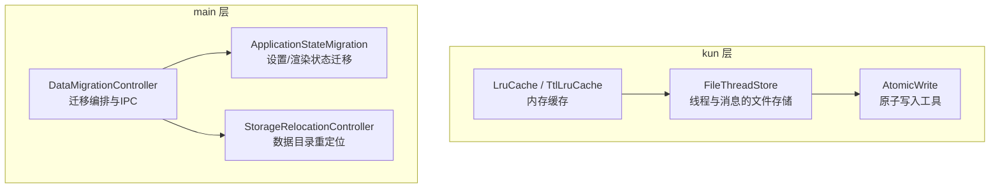
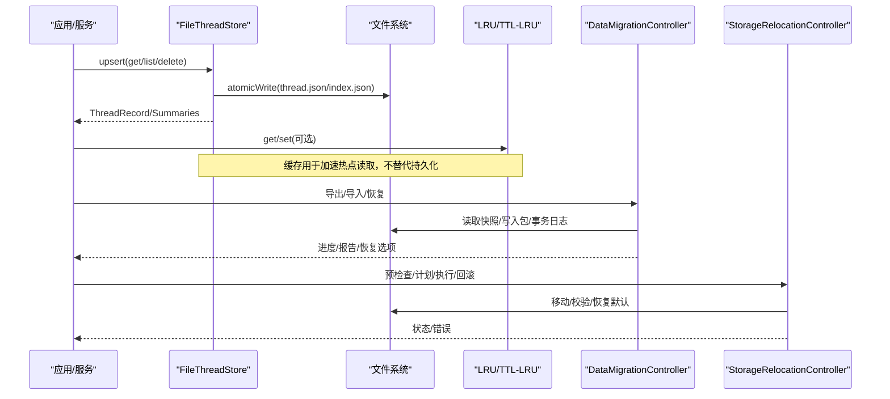
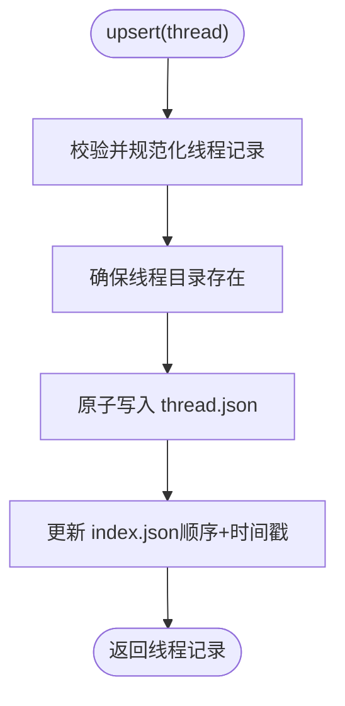
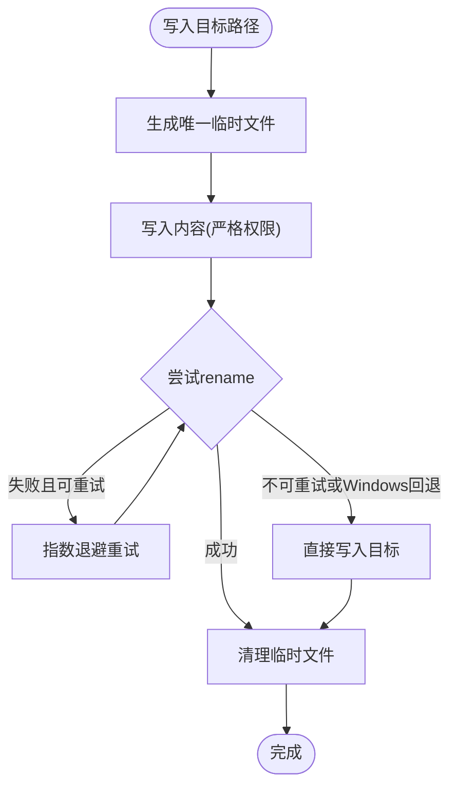
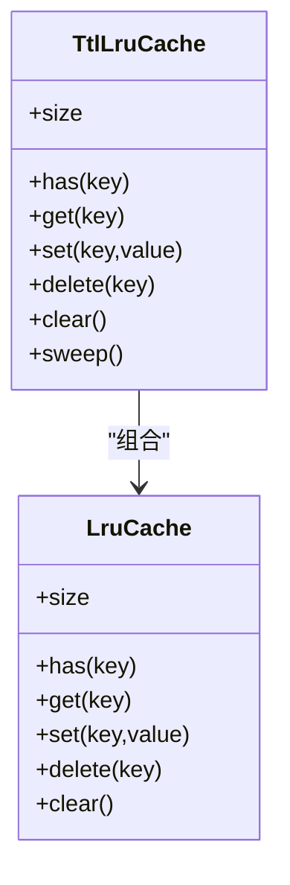
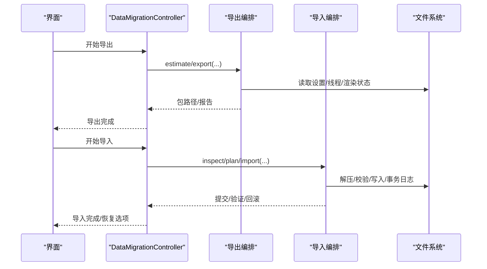
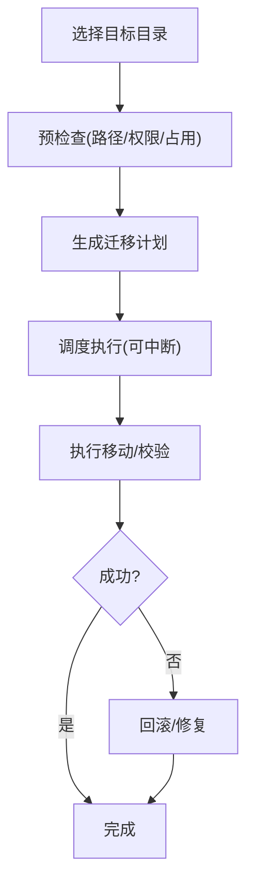
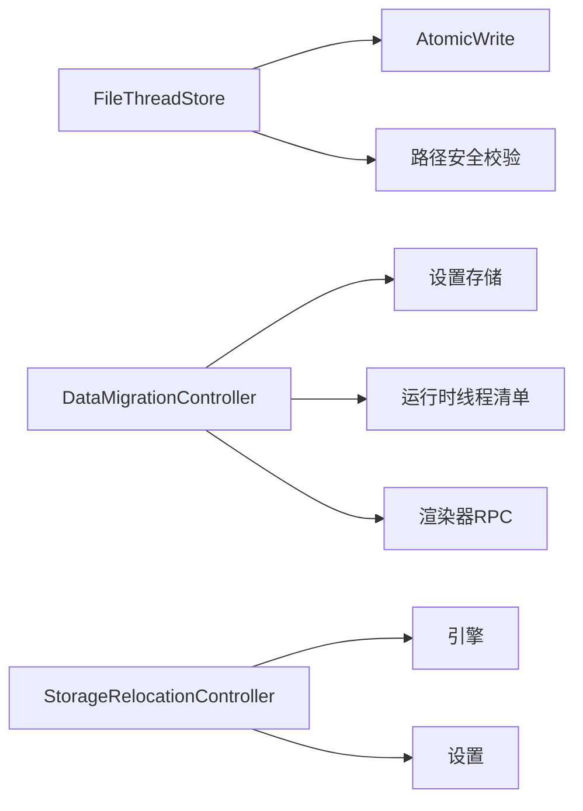

# 数据存储

<cite>
**本文引用的文件**
- [file-thread-store.ts](file://kun/src/adapters/file/file-thread-store.ts)
- [atomic-write.ts](file://kun/src/adapters/file/atomic-write.ts)
- [lru-cache.ts](file://kun/src/cache/lru-cache.ts)
- [ttl-lru-cache.ts](file://kun/src/cache/ttl-lru-cache.ts)
- [data-migration-controller.ts](file://src/main/data-migration/data-migration-controller.ts)
- [application-state-migration.ts](file://src/main/data-migration/application-state-migration.ts)
- [controller.ts](file://src/main/storage-relocation/controller.ts)
</cite>

## 目录
1. [简介](#简介)
2. [项目结构](#项目结构)
3. [核心组件](#核心组件)
4. [架构总览](#架构总览)
5. [详细组件分析](#详细组件分析)
6. [依赖关系分析](#依赖关系分析)
7. [性能考量](#性能考量)
8. [故障排除指南](#故障排除指南)
9. [结论](#结论)
10. [附录](#附录)

## 简介
本文件面向 DeepSeek-GUI 的数据存储子系统，聚焦“本地优先”策略：以文件系统为主、SQLite 为辅（由运行时服务提供），并通过迁移与重定位机制保障数据可移植性与一致性。文档覆盖会话存储、消息历史、附件存储、缓存系统、文件操作适配器、数据迁移、索引与搜索、导出导入、完整性验证与错误恢复等主题，帮助读者理解从线程到持久化的完整链路。

## 项目结构
数据存储相关代码主要分布在以下区域：
- kun 层：会话与消息的本地文件存储、原子写入、内存缓存（LRU/TTL-LRU）
- main 层：数据迁移控制器、应用状态迁移、存储位置重定位控制器
- shared/ports/contracts：跨进程契约、类型定义与诊断接口（被上层调用）

图表来源
- [file-thread-store.ts:14-143](file://kun/src/adapters/file/file-thread-store.ts#L14-L143)
- [atomic-write.ts:16-38](file://kun/src/adapters/file/atomic-write.ts#L16-L38)
- [lru-cache.ts:9-66](file://kun/src/cache/lru-cache.ts#L9-L66)
- [ttl-lru-cache.ts:12-71](file://kun/src/cache/ttl-lru-cache.ts#L12-L71)
- [data-migration-controller.ts:85-178](file://src/main/data-migration/data-migration-controller.ts#L85-L178)
- [application-state-migration.ts:19-121](file://src/main/data-migration/application-state-migration.ts#L19-L121)
- [controller.ts:23-96](file://src/main/storage-relocation/controller.ts#L23-L96)

章节来源
- [file-thread-store.ts:14-143](file://kun/src/adapters/file/file-thread-store.ts#L14-L143)
- [atomic-write.ts:16-38](file://kun/src/adapters/file/atomic-write.ts#L16-L38)
- [lru-cache.ts:9-66](file://kun/src/cache/lru-cache.ts#L9-L66)
- [ttl-lru-cache.ts:12-71](file://kun/src/cache/ttl-lru-cache.ts#L12-L71)
- [data-migration-controller.ts:85-178](file://src/main/data-migration/data-migration-controller.ts#L85-L178)
- [application-state-migration.ts:19-121](file://src/main/data-migration/application-state-migration.ts#L19-L121)
- [controller.ts:23-96](file://src/main/storage-relocation/controller.ts#L23-L96)

## 核心组件
- 线程与消息的文件存储：使用 JSON 元数据 + JSONL 事件日志，配合紧凑索引实现高效 list/get/upsert/delete。
- 原子写入：通过临时文件 + rename 保证写入原子性，并在 Windows 上具备回退策略与重试。
- 内存缓存：LRU 与 TTL-LRU 两类缓存，支持容量限制、过期清理与扫描回收。
- 数据迁移：打包/校验/计划/执行/提交/回滚/恢复全流程，支持设置、渲染状态与信任重置。
- 存储重定位：将 Kun 数据目录移动到用户指定位置，支持预检查、计划、执行与回滚。

章节来源
- [file-thread-store.ts:14-143](file://kun/src/adapters/file/file-thread-store.ts#L14-L143)
- [atomic-write.ts:16-38](file://kun/src/adapters/file/atomic-write.ts#L16-L38)
- [lru-cache.ts:9-66](file://kun/src/cache/lru-cache.ts#L9-L66)
- [ttl-lru-cache.ts:12-71](file://kun/src/cache/ttl-lru-cache.ts#L12-L71)
- [data-migration-controller.ts:85-178](file://src/main/data-migration/data-migration-controller.ts#L85-L178)
- [controller.ts:23-96](file://src/main/storage-relocation/controller.ts#L23-L96)

## 架构总览
下图展示“本地优先”的数据流：应用侧通过 FileThreadStore 读写线程与消息；原子写入确保磁盘一致性；内存缓存加速热点读取；迁移控制器负责跨版本/跨机器的数据打包、校验与导入；存储重定位控制器管理数据目录迁移。

图表来源
- [file-thread-store.ts:35-117](file://kun/src/adapters/file/file-thread-store.ts#L35-L117)
- [atomic-write.ts:16-38](file://kun/src/adapters/file/atomic-write.ts#L16-L38)
- [lru-cache.ts:28-48](file://kun/src/cache/lru-cache.ts#L28-L48)
- [ttl-lru-cache.ts:34-59](file://kun/src/cache/ttl-lru-cache.ts#L34-L59)
- [data-migration-controller.ts:110-178](file://src/main/data-migration/data-migration-controller.ts#L110-L178)
- [controller.ts:26-96](file://src/main/storage-relocation/controller.ts#L26-L96)

## 详细组件分析

### 线程与消息的文件存储（本地优先）
- 设计要点
  - 每个线程一个目录，包含 thread.json（元数据）、messages.jsonl/events.jsonl（追加式事件日志）、usage.json（用量）。
  - 根级 index.json 维护线程顺序与更新时间，list 时直接遍历索引，避免全量扫描。
  - 所有写路径均通过原子写入，避免部分写入导致损坏。
  - 读取时对 JSONL 行进行容错解析，单条损坏不影响整体回放。
- 复杂度与性能
  - list：O(N) 索引遍历 + N 次小文件读取；适合中小规模线程集合。
  - get/upsert：O(1) 文件定位 + O(1) 原子写；index 更新采用队列串行化，避免并发竞争。
  - delete：O(1) 删除目录 + O(1) 索引更新。
- 安全与健壮性
  - 线程 ID 安全校验与路径防逃逸检查，防止越权访问。
  - 目录权限设置为严格模式，降低误改风险。

图表来源
- [file-thread-store.ts:63-74](file://kun/src/adapters/file/file-thread-store.ts#L63-L74)
- [file-thread-store.ts:106-117](file://kun/src/adapters/file/file-thread-store.ts#L106-L117)
- [atomic-write.ts:16-38](file://kun/src/adapters/file/atomic-write.ts#L16-L38)

章节来源
- [file-thread-store.ts:14-143](file://kun/src/adapters/file/file-thread-store.ts#L14-L143)
- [file-thread-store.ts:149-167](file://kun/src/adapters/file/file-thread-store.ts#L149-L167)

### 原子写入与路径处理
- 原子写入
  - 先写入带 PID/时间戳/UUID 的临时文件，再原子 rename 为目标路径；失败时清理临时文件。
  - 在 Windows 上遇到特定错误码时回退为直接写入，提升兼容性。
  - 对 rename 进行有限次数重试，缓解瞬时占用导致的失败。
- 路径与权限
  - 创建目录时强制严格权限，减少越权写入。
  - 线程路径需通过安全校验，防止路径穿越。

图表来源
- [atomic-write.ts:16-38](file://kun/src/adapters/file/atomic-write.ts#L16-L38)
- [atomic-write.ts:64-91](file://kun/src/adapters/file/atomic-write.ts#L64-L91)

章节来源
- [atomic-write.ts:16-97](file://kun/src/adapters/file/atomic-write.ts#L16-L97)
- [file-thread-store.ts:119-138](file://kun/src/adapters/file/file-thread-store.ts#L119-L138)

### 缓存系统（LRU 与 TTL-LRU）
- LruCache
  - 固定容量，get/set 均会更新最近使用顺序；满时驱逐最久未使用项。
  - 不提供过期策略，适合短期热点数据。
- TtlLruCache
  - 在 LRU 基础上增加 TTL 过期；get 时若过期则视为 miss 并删除。
  - 提供 sweep 批量清理过期条目，便于后台维护。

图表来源
- [lru-cache.ts:9-66](file://kun/src/cache/lru-cache.ts#L9-L66)
- [ttl-lru-cache.ts:12-71](file://kun/src/cache/ttl-lru-cache.ts#L12-L71)

章节来源
- [lru-cache.ts:9-66](file://kun/src/cache/lru-cache.ts#L9-L66)
- [ttl-lru-cache.ts:12-71](file://kun/src/cache/ttl-lru-cache.ts#L12-L71)

### 数据迁移系统（版本升级、备份与恢复）
- 能力概览
  - 导出：估算体积、选择类别、抓取运行态线程、渲染器状态、设置等，生成可移植包。
  - 导入：检查包、制定计划、分阶段提交、验证与回滚。
  - 恢复：支持中断后继续或回滚，保留已提交变更的最小化修复。
- 关键流程
  - 估计导出：并行获取设置与线程清单，计算预估大小。
  - 检查包：校验加密、来源平台、类别、工作区映射等。
  - 计划导入：冲突解决策略、目标根目录映射、跳过项。
  - 执行导入：分阶段写入、事务日志、可恢复。
  - 应用状态迁移：安全地合并设置、渲染状态与信任重置，拒绝敏感字段。

图表来源
- [data-migration-controller.ts:110-178](file://src/main/data-migration/data-migration-controller.ts#L110-L178)
- [data-migration-controller.ts:202-298](file://src/main/data-migration/data-migration-controller.ts#L202-L298)
- [data-migration-controller.ts:300-351](file://src/main/data-migration/data-migration-controller.ts#L300-L351)
- [application-state-migration.ts:19-121](file://src/main/data-migration/application-state-migration.ts#L19-L121)

章节来源
- [data-migration-controller.ts:85-178](file://src/main/data-migration/data-migration-controller.ts#L85-L178)
- [data-migration-controller.ts:202-351](file://src/main/data-migration/data-migration-controller.ts#L202-L351)
- [application-state-migration.ts:19-121](file://src/main/data-migration/application-state-migration.ts#L19-L121)

### 存储重定位（数据目录迁移）
- 能力概览
  - 预检查：确认当前数据目录为受管路径，目标为空目录。
  - 计划：生成迁移计划，支持中断现有任务。
  - 执行：标记排空、准备重启、执行移动。
  - 回滚/恢复：支持回滚到原位置或在异常后修复位置。
- 安全与约束
  - 仅允许在受管数据目录下进行重定位，避免破坏非标准布局。
  - IPC 发送者必须可信，防止恶意调用。

图表来源
- [controller.ts:26-96](file://src/main/storage-relocation/controller.ts#L26-L96)
- [controller.ts:113-124](file://src/main/storage-relocation/controller.ts#L113-L124)

章节来源
- [controller.ts:23-96](file://src/main/storage-relocation/controller.ts#L23-L96)
- [controller.ts:113-124](file://src/main/storage-relocation/controller.ts#L113-L124)

### 索引与搜索（本地优先视角）
- 当前本地存储以 JSONL 事件日志承载消息历史，list 通过 index.json 快速枚举线程。
- 全文检索通常由运行时服务提供（例如通过 HTTP 接口查询线程列表与归档），本地侧重稳定持久与回放。
- 建议：如需本地全文检索，可在 JSONL 之上构建轻量倒排索引，结合 TTL-LRU 缓存高频查询结果。

[本节为概念性说明，不直接分析具体文件]

### 会话存储、线程管理与附件
- 会话与线程
  - 线程元数据与消息分别持久化，保证读多写少场景下的可扩展性。
  - 线程 ID 安全校验与路径隔离，避免越权访问。
- 附件存储
  - 附件与工件通常由运行时服务统一管理，迁移过程中通过快照下载与导入接口参与打包。
- 线程生命周期
  - 运行中/空闲/归档状态在迁移清单中体现，导出时可选择性包含。

章节来源
- [file-thread-store.ts:14-143](file://kun/src/adapters/file/file-thread-store.ts#L14-L143)
- [data-migration-controller.ts:447-472](file://src/main/data-migration/data-migration-controller.ts#L447-L472)

### 数据导出与导入格式规范
- 导出包
  - 包含清单、工作区目录、线程快照、渲染器状态、设置片段等。
  - 支持加密与压缩，导出前进行体积估算。
- 导入计划
  - 明确冲突解决策略（覆盖/跳过/重命名）、目标根目录映射、跳过项。
- 应用状态迁移
  - 设置迁移仅合并安全字段，自动禁用导入的工作流/定时任务，避免意外激活。
  - 渲染状态迁移会重新绑定工作区与线程引用，并报告无法解析的引用。

章节来源
- [data-migration-controller.ts:202-298](file://src/main/data-migration/data-migration-controller.ts#L202-L298)
- [application-state-migration.ts:19-121](file://src/main/data-migration/application-state-migration.ts#L19-L121)

### 数据完整性验证、错误恢复与故障排除
- 完整性验证
  - 原子写入保证文件一致性；JSONL 解析逐行容错，避免单条损坏影响整体。
  - 迁移过程使用事务日志与报告，支持断点恢复与回滚。
- 错误恢复
  - 迁移控制器支持“恢复”操作：根据日志阶段决定继续或回滚。
  - 存储重定位支持回滚与修复，确保数据目录处于一致状态。
- 常见故障
  - 磁盘空间不足：原子写入会抛出包含错误码的诊断信息，便于定位。
  - 权限问题：目录/文件严格权限，必要时检查用户权限与防病毒软件锁定。
  - 迁移中断：通过恢复流程继续或回滚，避免半完成状态。

章节来源
- [atomic-write.ts:40-62](file://kun/src/adapters/file/atomic-write.ts#L40-L62)
- [file-thread-store.ts:149-167](file://kun/src/adapters/file/file-thread-store.ts#L149-L167)
- [data-migration-controller.ts:300-351](file://src/main/data-migration/data-migration-controller.ts#L300-L351)
- [controller.ts:72-96](file://src/main/storage-relocation/controller.ts#L72-L96)

## 依赖关系分析
- 耦合关系
  - FileThreadStore 依赖原子写入与路径安全校验，形成稳定的底层 I/O 抽象。
  - 迁移控制器依赖设置存储、运行时线程清单与渲染器 RPC，协调多源数据。
  - 存储重定位控制器依赖引擎与设置，确保仅在受管目录执行。
- 外部依赖
  - Electron IPC 用于主进程与渲染进程通信。
  - Node fs/promises 用于文件操作。
  - Zod 用于输入校验与类型保护。

图表来源
- [file-thread-store.ts:1-13](file://kun/src/adapters/file/file-thread-store.ts#L1-L13)
- [data-migration-controller.ts:85-108](file://src/main/data-migration/data-migration-controller.ts#L85-L108)
- [controller.ts:23-24](file://src/main/storage-relocation/controller.ts#L23-L24)

章节来源
- [file-thread-store.ts:1-13](file://kun/src/adapters/file/file-thread-store.ts#L1-L13)
- [data-migration-controller.ts:85-108](file://src/main/data-migration/data-migration-controller.ts#L85-L108)
- [controller.ts:23-24](file://src/main/storage-relocation/controller.ts#L23-L24)

## 性能考量
- 文件存储
  - 使用 JSONL 追加写入，避免大对象频繁重写；list 通过索引减少 IO。
  - 原子写入在 Windows 上具备回退与重试，平衡兼容性与性能。
- 缓存
  - LRU 控制内存上限，TTL-LRU 支持过期清理；建议在热路径（如线程摘要、配置片段）使用。
- 迁移
  - 导出前估算体积，避免不必要的大包传输；导入分阶段提交，降低长事务风险。
- 重定位
  - 预检查与计划阶段尽早发现冲突，减少执行期失败概率。

[本节提供通用指导，不直接分析具体文件]

## 故障排除指南
- 原子写入失败
  - 检查磁盘空间与权限；查看错误码（如 ENOSPC/EACCES/EPERM）与路径信息。
- 线程列表异常
  - 检查 index.json 是否损坏；readJsonl 会跳过坏行，但需关注缺失数据。
- 迁移中断
  - 使用恢复接口：根据日志阶段选择“继续”或“回滚”，避免不一致状态。
- 存储重定位失败
  - 确认目标目录为空且可写；必要时回滚到原位置并修复权限。

章节来源
- [atomic-write.ts:40-62](file://kun/src/adapters/file/atomic-write.ts#L40-L62)
- [file-thread-store.ts:149-167](file://kun/src/adapters/file/file-thread-store.ts#L149-L167)
- [data-migration-controller.ts:300-351](file://src/main/data-migration/data-migration-controller.ts#L300-L351)
- [controller.ts:72-96](file://src/main/storage-relocation/controller.ts#L72-L96)

## 结论
DeepSeek-GUI 的数据存储采用“本地优先”的设计：以文件系统为核心，辅以内存缓存与迁移/重定位机制，确保数据的一致性、可移植性与可恢复性。线程与消息通过 JSON 元数据与 JSONL 事件日志持久化，原子写入保障写入安全；迁移控制器提供完整的导出/导入/恢复闭环；存储重定位控制器保障数据目录的可控迁移。该体系兼顾性能与可靠性，适用于桌面端复杂工作负载。

## 附录
- 术语
  - 线程：一次对话或任务的上下文单元，包含元数据与消息历史。
  - 原子写入：先写临时文件再原子替换目标文件的写入方式。
  - 迁移包：包含设置、线程快照、渲染状态等的可移植归档。
- 最佳实践
  - 在热路径使用 TTL-LRU 缓存，定期 sweep 清理过期项。
  - 避免直接绕过原子写入；如遇兼容性问题，按平台策略处理。
  - 迁移前进行估算与检查，导入时选择合适的冲突解决策略。

[本节为补充说明，不直接分析具体文件]