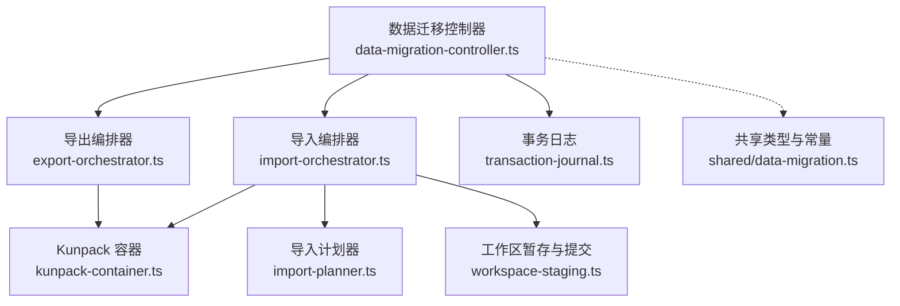
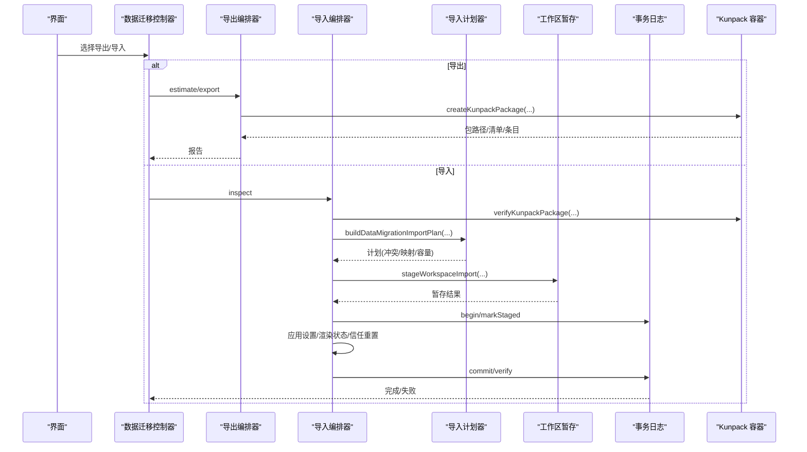
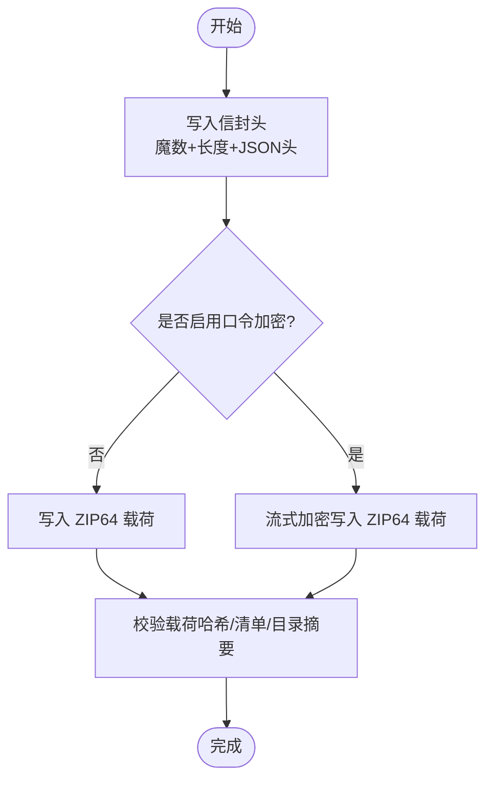
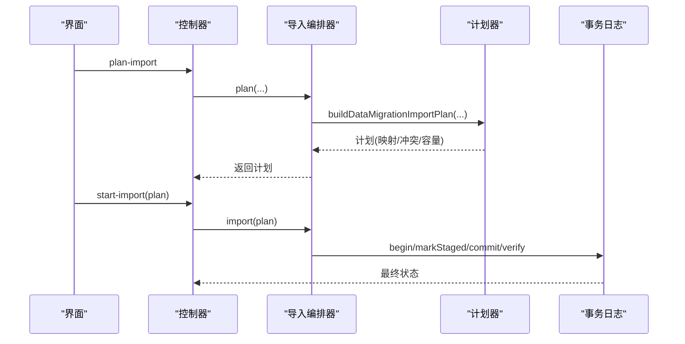
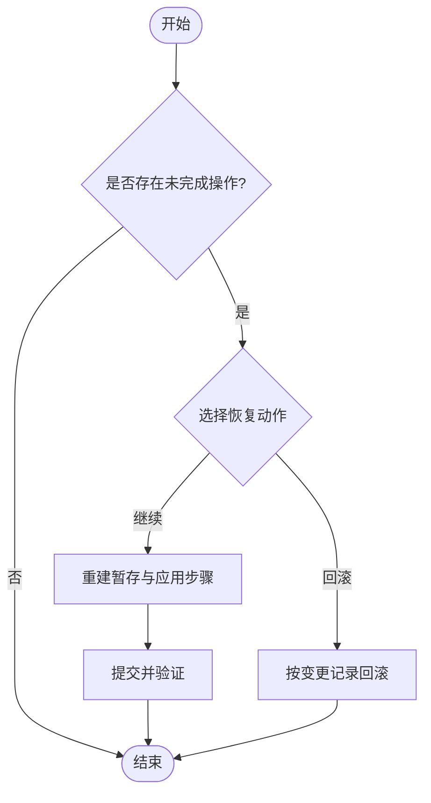
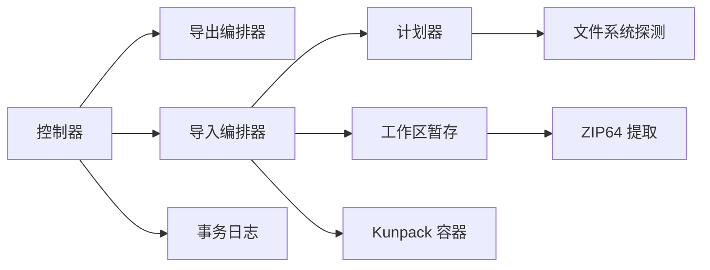

# 数据迁移

<cite>
**本文引用的文件**
- [src/shared/data-migration.ts](file://src/shared/data-migration.ts)
- [src/main/data-migration/kunpack-container.ts](file://src/main/data-migration/kunpack-container.ts)
- [src/main/data-migration/import-planner.ts](file://src/main/data-migration/import-planner.ts)
- [src/main/data-migration/export-orchestrator.ts](file://src/main/data-migration/export-orchestrator.ts)
- [src/main/data-migration/import-orchestrator.ts](file://src/main/data-migration/import-orchestrator.ts)
- [src/main/data-migration/transaction-journal.ts](file://src/main/data-migration/transaction-journal.ts)
- [src/main/data-migration/workspace-staging.ts](file://src/main/data-migration/workspace-staging.ts)
- [src/main/data-migration/data-migration-controller.ts](file://src/main/data-migration/data-migration-controller.ts)
</cite>

## 目录
1. [简介](#简介)
2. [项目结构](#项目结构)
3. [核心组件](#核心组件)
4. [架构总览](#架构总览)
5. [详细组件分析](#详细组件分析)
6. [依赖关系分析](#依赖关系分析)
7. [性能考虑](#性能考虑)
8. [故障排查指南](#故障排查指南)
9. [结论](#结论)
10. [附录](#附录)

## 简介
本文件为 DeepSeek-GUI 的数据迁移系统提供全面文档，覆盖版本检测与升级策略、Kunpack 容器格式、迁移控制器工作原理（计划生成与执行）、存储位置重定位、备份与恢复（含增量与灾难恢复）、完整性校验与错误恢复策略、配置选项与性能调优建议，以及常见问题的诊断与解决方案。目标是帮助读者在不深入源码的情况下理解并安全使用迁移能力。

## 项目结构
数据迁移由共享类型与常量、主进程控制器、导出/导入编排器、Kunpack 容器封装、导入计划器、事务日志与工作台暂存等模块组成。整体采用“编排器 + 事务日志”的强一致设计：所有跨卷变更通过暂存、原子提交、验证与回滚保证一致性。

图示来源
- [src/main/data-migration/data-migration-controller.ts:85-108](file://src/main/data-migration/data-migration-controller.ts#L85-L108)
- [src/main/data-migration/export-orchestrator.ts:89-124](file://src/main/data-migration/export-orchestrator.ts#L89-L124)
- [src/main/data-migration/import-orchestrator.ts:111-187](file://src/main/data-migration/import-orchestrator.ts#L111-L187)
- [src/main/data-migration/import-planner.ts:90-205](file://src/main/data-migration/import-planner.ts#L90-L205)
- [src/main/data-migration/workspace-staging.ts:48-96](file://src/main/data-migration/workspace-staging.ts#L48-L96)
- [src/main/data-migration/kunpack-container.ts:126-210](file://src/main/data-migration/kunpack-container.ts#L126-L210)
- [src/main/data-migration/transaction-journal.ts:82-113](file://src/main/data-migration/transaction-journal.ts#L82-L113)
- [src/shared/data-migration.ts:1-10](file://src/shared/data-migration.ts#L1-L10)

章节来源
- [src/main/data-migration/data-migration-controller.ts:85-108](file://src/main/data-migration/data-migration-controller.ts#L85-L108)
- [src/shared/data-migration.ts:1-10](file://src/shared/data-migration.ts#L1-L10)

## 核心组件
- 共享类型与常量：定义迁移包格式版本、最小读取版本、默认加密参数、预算限制、类别、冲突策略、进度与报告模型等。
- Kunpack 容器：实现 .kunpack 包的创建、信封头写入、可选口令加密、ZIP64 载荷、清单与校验目录、完整性校验。
- 导出编排器：发现工作区、扫描文件、构建运行时快照、组装清单与目录、调用容器打包。
- 导入编排器：验包、读取目录、生成计划、暂存工作区、应用设置/渲染状态/信任重置、协调运行时导入、提交与验证。
- 导入计划器：探测目标文件系统、冲突检测、路径重映射、引用重绑定、空间与兼容性评估。
- 事务日志：持久化操作阶段、变更记录、制品、错误与恢复信息；支持阶段转换约束与原子写入。
- 工作区暂存：将包内文件解压到暂存目录，处理链接、权限加固、冲突解决、原子提交与回滚。
- 控制器：对外暴露 IPC 接口，统一入口，管理并发、进度、恢复与报告。

章节来源
- [src/shared/data-migration.ts:1-10](file://src/shared/data-migration.ts#L1-L10)
- [src/main/data-migration/kunpack-container.ts:126-210](file://src/main/data-migration/kunpack-container.ts#L126-L210)
- [src/main/data-migration/export-orchestrator.ts:124-301](file://src/main/data-migration/export-orchestrator.ts#L124-L301)
- [src/main/data-migration/import-orchestrator.ts:118-335](file://src/main/data-migration/import-orchestrator.ts#L118-L335)
- [src/main/data-migration/import-planner.ts:90-205](file://src/main/data-migration/import-planner.ts#L90-L205)
- [src/main/data-migration/transaction-journal.ts:82-113](file://src/main/data-migration/transaction-journal.ts#L82-L113)
- [src/main/data-migration/workspace-staging.ts:118-335](file://src/main/data-migration/workspace-staging.ts#L118-L335)
- [src/main/data-migration/data-migration-controller.ts:110-178](file://src/main/data-migration/data-migration-controller.ts#L110-L178)

## 架构总览
数据迁移以控制器为中心，导出走“扫描→快照→打包”，导入走“验包→计划→暂存→应用→提交→验证”。所有跨卷变更通过事务日志记录与回滚保障一致性。

图示来源
- [src/main/data-migration/data-migration-controller.ts:251-298](file://src/main/data-migration/data-migration-controller.ts#L251-L298)
- [src/main/data-migration/export-orchestrator.ts:124-301](file://src/main/data-migration/export-orchestrator.ts#L124-L301)
- [src/main/data-migration/import-orchestrator.ts:118-335](file://src/main/data-migration/import-orchestrator.ts#L118-L335)
- [src/main/data-migration/import-planner.ts:90-205](file://src/main/data-migration/import-planner.ts#L90-L205)
- [src/main/data-migration/workspace-staging.ts:48-96](file://src/main/data-migration/workspace-staging.ts#L48-L96)
- [src/main/data-migration/kunpack-container.ts:126-210](file://src/main/data-migration/kunpack-container.ts#L126-L210)
- [src/main/data-migration/transaction-journal.ts:82-113](file://src/main/data-migration/transaction-journal.ts#L82-L113)

## 详细组件分析

### 数据版本管理与升级策略
- 版本常量：包含当前格式版本、最小读取版本、默认帧大小、元数据上限、条目数量上限、最低空闲比例等。
- 兼容性与降级保护：导入时校验包格式版本与组件版本，不满足最小读取版本或未知组件版本会拒绝。
- 组件版本声明：清单中记录各组件版本，导入时按描述符进行引用重绑定与校验。
- 升级策略：新版本只读旧包，不就地升级；如需升级，需重新导出为新包。

章节来源
- [src/shared/data-migration.ts:1-10](file://src/shared/data-migration.ts#L1-L10)
- [src/main/data-migration/import-orchestrator.ts:557-734](file://src/main/data-migration/import-orchestrator.ts#L557-L734)

### Kunpack 容器格式（.kunpack）
- 信封头：固定魔数+长度+JSON 头，包含载荷格式、格式版本、创建时间、明文载荷大小与哈希、加密参数。
- 载荷：ZIP64 归档，包含清单 manifest.json、校验目录 checksums.jsonl、工作区文件、运行时快照、目录 catalog/*。
- 加密：可选口令加密，基于分帧流式加密，头与载荷均受认证保护。
- 完整性：对载荷、清单、校验目录、目录摘要进行多重校验，确保端到端一致性。
- 安全：严格路径规范、禁止危险链接、限制元数据大小、仅允许安全的内部相对符号链接。

图示来源
- [src/main/data-migration/kunpack-container.ts:212-271](file://src/main/data-migration/kunpack-container.ts#L212-L271)
- [src/main/data-migration/kunpack-container.ts:333-397](file://src/main/data-migration/kunpack-container.ts#L333-L397)

章节来源
- [src/main/data-migration/kunpack-container.ts:126-210](file://src/main/data-migration/kunpack-container.ts#L126-L210)
- [src/main/data-migration/kunpack-container.ts:212-271](file://src/main/data-migration/kunpack-container.ts#L212-L271)
- [src/main/data-migration/kunpack-container.ts:273-331](file://src/main/data-migration/kunpack-container.ts#L273-L331)
- [src/main/data-migration/kunpack-container.ts:333-397](file://src/main/data-migration/kunpack-container.ts#L333-L397)

### 迁移控制器：计划生成与执行
- 计划生成：基于包目录与工作区清单，探测目标文件系统特性（大小写敏感、Unicode 规范化、符号链接支持、路径长度限制），检测冲突（名称冲突、内容差异、路径过长、不安全链接），计算峰值占用与可用空间，生成可执行的导入计划。
- 执行流程：暂存工作区→应用设置/渲染状态/信任重置→提交→验证→清理。
- 并发控制：同一时刻仅允许一个迁移操作；未完成的操作需要恢复后再启动新操作。
- 进度与恢复：通过事务日志记录阶段与变更，支持中断后恢复或回滚。

图示来源
- [src/main/data-migration/data-migration-controller.ts:230-249](file://src/main/data-migration/data-migration-controller.ts#L230-L249)
- [src/main/data-migration/import-orchestrator.ts:164-187](file://src/main/data-migration/import-orchestrator.ts#L164-L187)
- [src/main/data-migration/import-planner.ts:90-205](file://src/main/data-migration/import-planner.ts#L90-L205)
- [src/main/data-migration/transaction-journal.ts:82-113](file://src/main/data-migration/transaction-journal.ts#L82-L113)

章节来源
- [src/main/data-migration/data-migration-controller.ts:230-298](file://src/main/data-migration/data-migration-controller.ts#L230-L298)
- [src/main/data-migration/import-orchestrator.ts:164-335](file://src/main/data-migration/import-orchestrator.ts#L164-L335)
- [src/main/data-migration/import-planner.ts:90-205](file://src/main/data-migration/import-planner.ts#L90-L205)

### 数据存储位置重定位
- 自定义根路径：用户可为每个工作区指定目标根路径；未指定时自动推荐无冲突路径。
- 路径重写：工作区根、工作区文件、线程 ID、附件范围、注册表引用在导入时被重写为目标路径。
- 平台差异：根据目标平台处理大小写敏感、Unicode 规范化、保留名、路径长度与空格规则。
- 安全限制：禁止将迁移目录作为目标；避免重叠与嵌套；仅允许安全的内部相对符号链接。

章节来源
- [src/main/data-migration/import-planner.ts:90-205](file://src/main/data-migration/import-planner.ts#L90-L205)
- [src/main/data-migration/import-planner.ts:207-219](file://src/main/data-migration/import-planner.ts#L207-L219)
- [src/main/data-migration/import-planner.ts:221-287](file://src/main/data-migration/import-planner.ts#L221-L287)
- [src/main/data-migration/import-planner.ts:419-478](file://src/main/data-migration/import-planner.ts#L419-L478)

### 备份与恢复机制（含增量与灾难恢复）
- 增量备份：仅在替换或合并场景下对冲突文件创建备份，备份位于专用目录，支持按操作与工作区分组。
- 灾难恢复：若中途崩溃或失败，可通过恢复流程继续或回滚；恢复时重建暂存工作区与应用步骤，再提交或回滚。
- 幂等与原子：同卷使用原子重命名；跨卷通过事务日志与备份保证幂等；提交前验证，失败则回滚。
- 保留策略：备份保留一定天数；活动与可恢复数据不因磁盘压力被清理。

图示来源
- [src/main/data-migration/data-migration-controller.ts:310-351](file://src/main/data-migration/data-migration-controller.ts#L310-L351)
- [src/main/data-migration/workspace-staging.ts:347-387](file://src/main/data-migration/workspace-staging.ts#L347-L387)
- [src/main/data-migration/transaction-journal.ts:135-141](file://src/main/data-migration/transaction-journal.ts#L135-L141)

章节来源
- [src/main/data-migration/data-migration-controller.ts:310-351](file://src/main/data-migration/data-migration-controller.ts#L310-L351)
- [src/main/data-migration/workspace-staging.ts:347-387](file://src/main/data-migration/workspace-staging.ts#L347-L387)
- [src/main/data-migration/transaction-journal.ts:135-141](file://src/main/data-migration/transaction-journal.ts#L135-L141)

### 数据完整性验证与错误恢复策略
- 完整性校验：包载荷哈希、清单与校验目录摘要、目录项计数与展开字节、工作区条目归属与链接目标均在导入时严格校验。
- 错误分类：明确错误码、阶段、影响范围、是否可重试与下一步操作建议。
- 恢复策略：支持“继续”或“回滚”；回滚仅移除操作产生的数据且身份仍匹配；独立修改的路径会被保留并提示手动处理。
- 报告与审计：生成不可变报告，包含稳定代码、映射、计数、排除项、决策与警告，不含口令或凭据。

章节来源
- [src/main/data-migration/kunpack-container.ts:333-397](file://src/main/data-migration/kunpack-container.ts#L333-L397)
- [src/main/data-migration/import-orchestrator.ts:557-734](file://src/main/data-migration/import-orchestrator.ts#L557-L734)
- [src/shared/data-migration.ts:371-453](file://src/shared/data-migration.ts#L371-L453)
- [src/main/data-migration/transaction-journal.ts:331-347](file://src/main/data-migration/transaction-journal.ts#L331-L347)

### 配置选项与性能调优建议
- 配置项
  - 导出/导入开关、强制加密、允许导出的根路径、允许导入的根路径、最大展开字节限制。
  - 预设模式：完整/较小（较小模式排除构建产物、缓存、依赖等）。
  - 运行线程策略：等待、中断或省略。
  - 工作区冲突策略：保留两者、合并、替换、跳过。
  - 文件冲突解决：保留目标、导入为兄弟、用备份替换、跳过、重命名源。
- 性能建议
  - 使用较小预设减少扫描与打包体积。
  - 合理选择目标卷，尽量同卷以减少跨卷复制。
  - 避免大目录频繁小文件写入，必要时分批迁移。
  - 关闭不必要的类别（如不包含工作区文件或运行时历史）。
  - 利用并行度与流式处理（框架已内置），避免同时运行多个迁移任务。

章节来源
- [src/shared/data-migration.ts:455-463](file://src/shared/data-migration.ts#L455-L463)
- [src/shared/data-migration.ts:262-277](file://src/shared/data-migration.ts#L262-L277)
- [src/main/data-migration/export-orchestrator.ts:124-301](file://src/main/data-migration/export-orchestrator.ts#L124-L301)
- [src/main/data-migration/import-planner.ts:90-205](file://src/main/data-migration/import-planner.ts#L90-L205)

### 常见问题诊断与解决方案
- 包不是 .kunpack 或损坏：检查文件扩展名与完整性；重新导出。
- 需要口令或口令无效：确认包是否加密并输入正确口令；注意口令不会持久化。
- 版本不受支持：升级软件或重新导出为当前版本包。
- 路径非法/过长/不安全链接：调整目标路径或文件名；避免保留名与超长路径。
- 空间不足：释放目标卷空间或选择更大卷；注意预留安全余量。
- 冲突未解决：在工作区或文件级别选择冲突解决策略；必要时重命名源。
- 运行时繁忙：调整运行线程策略（等待/中断/省略）。
- 恢复必需：查看最近报告与日志，选择继续或回滚；不要直接删除暂存或备份目录。

章节来源
- [src/shared/data-migration.ts:371-403](file://src/shared/data-migration.ts#L371-L403)
- [src/main/data-migration/import-planner.ts:221-287](file://src/main/data-migration/import-planner.ts#L221-L287)
- [src/main/data-migration/data-migration-controller.ts:310-351](file://src/main/data-migration/data-migration-controller.ts#L310-L351)

## 依赖关系分析
- 控制器依赖导出/导入编排器、事务日志、报告存储与渲染 RPC。
- 导入编排器依赖计划器、工作区暂存、Kunpack 容器与运行时客户端。
- 计划器依赖文件系统探测、路径工具与安全校验。
- 工作区暂存依赖 ZIP 提取、链接处理与权限加固。
- 事务日志提供阶段机与原子持久化。

图示来源
- [src/main/data-migration/data-migration-controller.ts:85-108](file://src/main/data-migration/data-migration-controller.ts#L85-L108)
- [src/main/data-migration/import-orchestrator.ts:111-187](file://src/main/data-migration/import-orchestrator.ts#L111-L187)
- [src/main/data-migration/import-planner.ts:41-88](file://src/main/data-migration/import-planner.ts#L41-L88)
- [src/main/data-migration/workspace-staging.ts:48-96](file://src/main/data-migration/workspace-staging.ts#L48-L96)
- [src/main/data-migration/kunpack-container.ts:126-210](file://src/main/data-migration/kunpack-container.ts#L126-L210)
- [src/main/data-migration/transaction-journal.ts:82-113](file://src/main/data-migration/transaction-journal.ts#L82-L113)

章节来源
- [src/main/data-migration/data-migration-controller.ts:85-108](file://src/main/data-migration/data-migration-controller.ts#L85-L108)
- [src/main/data-migration/import-orchestrator.ts:111-187](file://src/main/data-migration/import-orchestrator.ts#L111-L187)
- [src/main/data-migration/import-planner.ts:41-88](file://src/main/data-migration/import-planner.ts#L41-L88)
- [src/main/data-migration/workspace-staging.ts:48-96](file://src/main/data-migration/workspace-staging.ts#L48-L96)
- [src/main/data-migration/kunpack-container.ts:126-210](file://src/main/data-migration/kunpack-container.ts#L126-L210)
- [src/main/data-migration/transaction-journal.ts:82-113](file://src/main/data-migration/transaction-journal.ts#L82-L113)

## 性能考虑
- 流式处理：导出与导入均采用流式读写与管道，降低内存峰值。
- 预检与预算：导入前估算峰值占用并检查可用空间，避免中途失败。
- 同卷优化：尽量将目标与工作区放在同一卷，利用原子重命名提升性能。
- 类别裁剪：按需选择类别，避免不必要的大对象（如附件、工件、记忆）。
- 并发限制：单实例串行迁移，避免资源争用。

[本节为通用指导，无需特定文件来源]

## 故障排查指南
- 查看最近报告：获取稳定错误码、映射、计数、排除项、决策与警告。
- 检查事务日志：确认当前阶段与变更记录，判断是否需要继续或回滚。
- 验证包完整性：重新验包，确认载荷与清单一致。
- 检查目标文件系统：确认大小写敏感、Unicode 规范化、符号链接支持与路径长度限制。
- 处理冲突：在工作区或文件级别选择合适策略，必要时重命名源。
- 恢复流程：对于中断或失败的操作，优先尝试继续；若不一致则回滚。

章节来源
- [src/main/data-migration/data-migration-controller.ts:180-200](file://src/main/data-migration/data-migration-controller.ts#L180-L200)
- [src/main/data-migration/transaction-journal.ts:120-141](file://src/main/data-migration/transaction-journal.ts#L120-L141)
- [src/main/data-migration/kunpack-container.ts:333-397](file://src/main/data-migration/kunpack-container.ts#L333-L397)
- [src/main/data-migration/import-planner.ts:41-88](file://src/main/data-migration/import-planner.ts#L41-L88)

## 结论
DeepSeek-GUI 的数据迁移系统通过严格的版本管理、安全的 Kunpack 容器格式、健壮的导入计划与事务日志、以及完善的备份与恢复机制，提供了跨平台、可恢复、可审计的数据迁移能力。建议在大规模迁移前进行预检与演练，并根据业务需求选择合适的类别与冲突策略，以获得最佳性能与可靠性。

[本节为总结性内容，无需特定文件来源]

## 附录
- 关键类型与常量参考：见共享类型文件中的版本、预算、类别、冲突策略、进度与报告定义。
- 常用 API 路径：控制器 IPC 通道用于选择文件、估计导出、验包、生成计划、启动导出/导入、取消、恢复、查询状态与报告。

章节来源
- [src/shared/data-migration.ts:1-10](file://src/shared/data-migration.ts#L1-L10)
- [src/main/data-migration/data-migration-controller.ts:110-178](file://src/main/data-migration/data-migration-controller.ts#L110-L178)