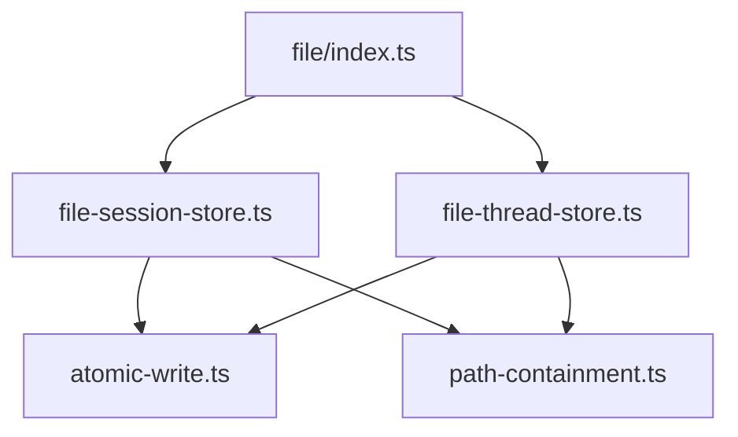
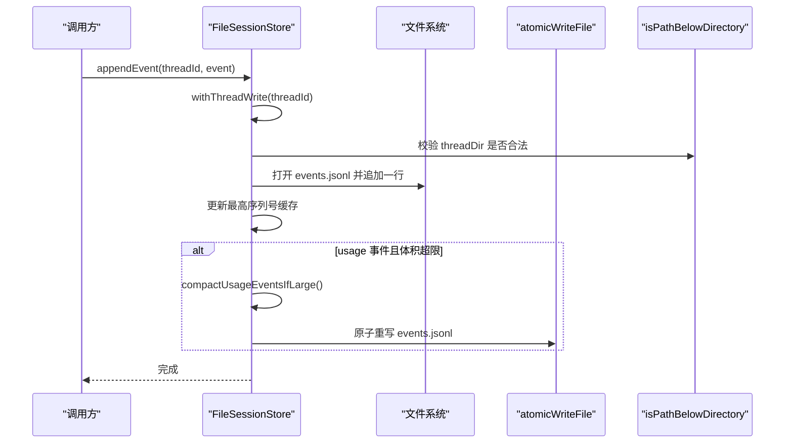
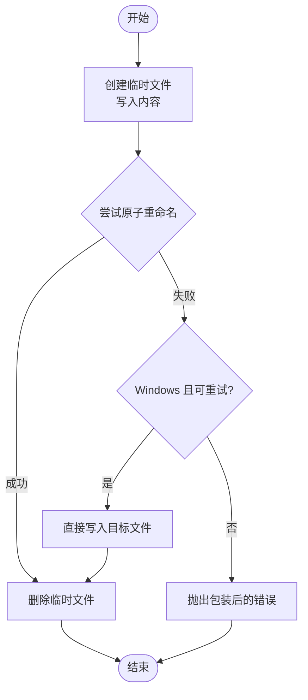
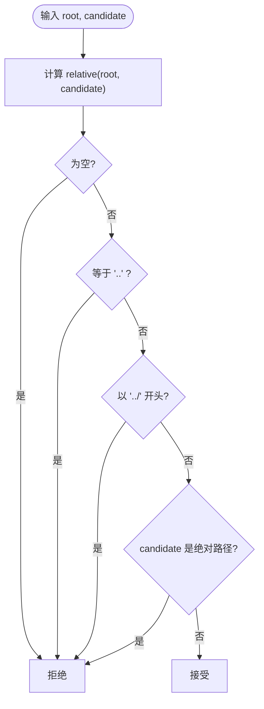
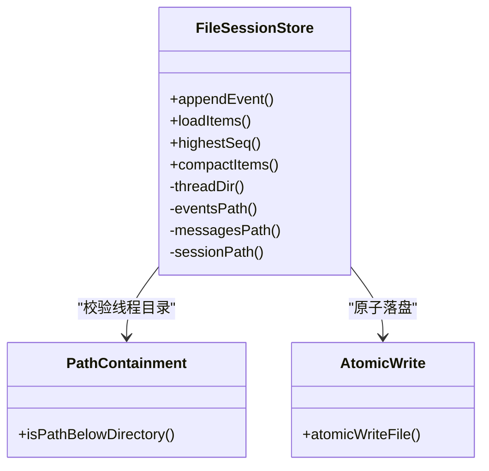
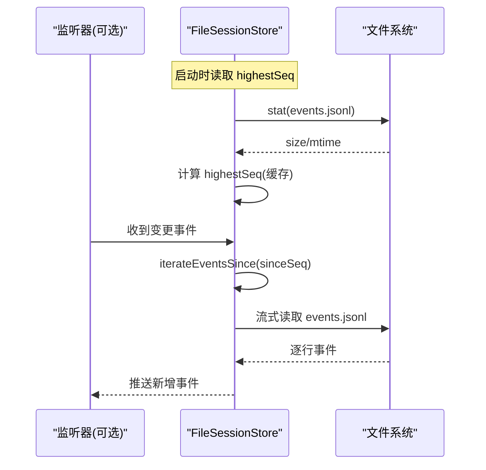
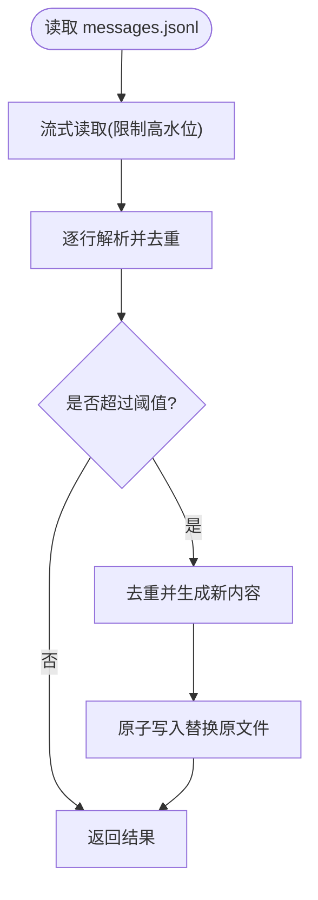
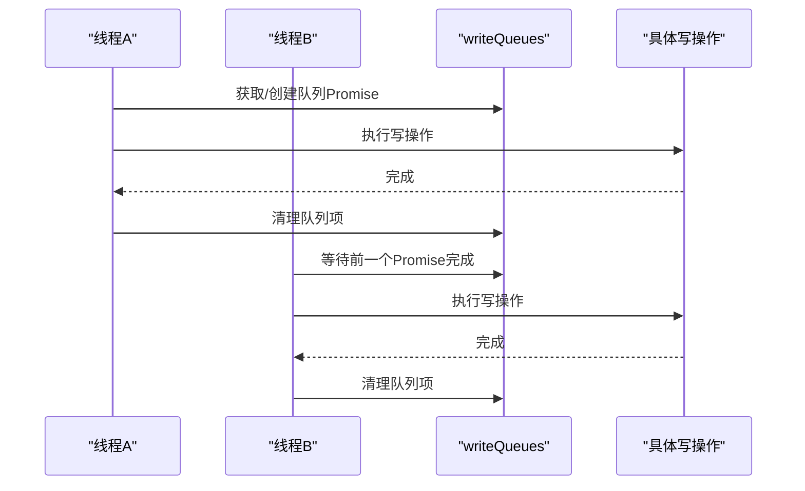
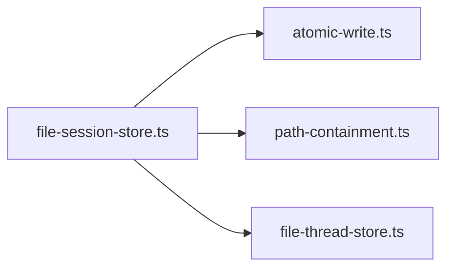

# 文件操作

<cite>
**本文引用的文件**
- [kun/src/adapters/file/atomic-write.ts](file://kun/src/adapters/file/atomic-write.ts)
- [kun/src/adapters/file/path-containment.ts](file://kun/src/adapters/file/path-containment.ts)
- [kun/src/adapters/file/file-session-store.ts](file://kun/src/adapters/file/file-session-store.ts)
- [kun/src/adapters/file/file-thread-store.ts](file://kun/src/adapters/file/file-thread-store.ts)
- [kun/src/adapters/file/index.ts](file://kun/src/adapters/file/index.ts)
</cite>

## 目录
1. [简介](#简介)
2. [项目结构](#项目结构)
3. [核心组件](#核心组件)
4. [架构总览](#架构总览)
5. [详细组件分析](#详细组件分析)
6. [依赖关系分析](#依赖关系分析)
7. [性能考虑](#性能考虑)
8. [故障排查指南](#故障排查指南)
9. [结论](#结论)
10. [附录](#附录)

## 简介
本文件为 DeepSeek-GUI 的文件操作适配器提供系统化文档，聚焦以下目标：
- 原子写入机制：确保文件写操作的完整性与一致性，避免部分写入导致的损坏。
- 路径安全控制：实现路径遍历防护与权限校验，防止越权访问。
- 工作区检查器：文件系统扫描与元数据提取（以会话存储中的线程目录为例）。
- 文件监听与变更检测：基于事件流与增量读取的实时同步思路。
- 大文件处理策略：流式读写、内存限制与压缩合并。
- 文件锁机制：按线程串行化写入，避免并发冲突。
- 性能优化与错误处理最佳实践。
- 跨平台兼容性与文件系统差异处理。

## 项目结构
文件操作适配器位于 kun/src/adapters/file 目录，包含原子写入、路径安全、会话存储与线程存储等关键模块。入口通过 index.ts 统一导出。

图表来源
- [kun/src/adapters/file/index.ts:1-3](file://kun/src/adapters/file/index.ts#L1-L3)
- [kun/src/adapters/file/file-session-store.ts:1-20](file://kun/src/adapters/file/file-session-store.ts#L1-L20)
- [kun/src/adapters/file/file-thread-store.ts:1-20](file://kun/src/adapters/file/file-thread-store.ts#L1-L20)
- [kun/src/adapters/file/atomic-write.ts:1-10](file://kun/src/adapters/file/atomic-write.ts#L1-L10)
- [kun/src/adapters/file/path-containment.ts:1-10](file://kun/src/adapters/file/path-containment.ts#L1-L10)

章节来源
- [kun/src/adapters/file/index.ts:1-3](file://kun/src/adapters/file/index.ts#L1-L3)

## 核心组件
- 原子写入器 atomicWriteFile：将内容先写入临时文件，再原子重命名为目标文件；在 Windows 上对特定错误回退到直接写入；失败时清理临时文件并保留原始错误信息。
- 路径安全 isPathBelowDirectory：严格判断候选路径是否为根目录的严格子路径，防止路径穿越。
- 会话存储 FileSessionStore：以 JSONL 追加日志持久化事件与消息，维护会话快照；提供流式回放、增量读取、历史压缩与缓存。
- 线程存储 file-thread-store：提供 JSONL 读取工具（如 readJsonl），被会话存储复用。

章节来源
- [kun/src/adapters/file/atomic-write.ts:16-38](file://kun/src/adapters/file/atomic-write.ts#L16-L38)
- [kun/src/adapters/file/path-containment.ts:11-22](file://kun/src/adapters/file/path-containment.ts#L11-L22)
- [kun/src/adapters/file/file-session-store.ts:46-124](file://kun/src/adapters/file/file-session-store.ts#L46-L124)
- [kun/src/adapters/file/file-thread-store.ts:1-20](file://kun/src/adapters/file/file-thread-store.ts#L1-L20)

## 架构总览
文件操作适配器的整体流程如下：上层调用会话存储进行事件与消息的追加、读取与压缩；会话存储通过线程级写队列保证同一线程的串行写入；所有落盘均使用原子写入；路径构造后通过路径安全检查；回放与大文件读取采用流式处理，限制单条记录大小，避免内存膨胀。

图表来源
- [kun/src/adapters/file/file-session-store.ts:98-112](file://kun/src/adapters/file/file-session-store.ts#L98-L112)
- [kun/src/adapters/file/file-session-store.ts:483-502](file://kun/src/adapters/file/file-session-store.ts#L483-L502)
- [kun/src/adapters/file/file-session-store.ts:524-536](file://kun/src/adapters/file/file-session-store.ts#L524-L536)
- [kun/src/adapters/file/atomic-write.ts:16-38](file://kun/src/adapters/file/atomic-write.ts#L16-L38)
- [kun/src/adapters/file/path-containment.ts:11-22](file://kun/src/adapters/file/path-containment.ts#L11-L22)

## 详细组件分析

### 原子写入机制
- 设计要点
  - 先创建临时文件（包含进程ID、时间戳与随机UUID），写入完成后尝试原子重命名至目标路径。
  - 重命名失败时，若为 Windows 上的可重试错误，则回退到直接写入目标文件。
  - 任何异常都会清理临时文件，并将原始错误包装为带稳定前缀的错误对象，便于定位磁盘空间不足或权限问题。
- 复杂度与性能
  - 写入复杂度 O(n)，n 为内容长度；重命名 O(1)。
  - 通过高水位标记与有限缓冲，避免一次性加载大文件。
- 错误处理
  - 捕获并重抛带有 code/errno/syscall/path 的底层错误，便于上层诊断。
  - 针对 ENOSPC、EPERM、EACCES、EBUSY 等场景提供重试与回退策略。

图表来源
- [kun/src/adapters/file/atomic-write.ts:16-38](file://kun/src/adapters/file/atomic-write.ts#L16-L38)
- [kun/src/adapters/file/atomic-write.ts:64-91](file://kun/src/adapters/file/atomic-write.ts#L64-L91)

章节来源
- [kun/src/adapters/file/atomic-write.ts:16-38](file://kun/src/adapters/file/atomic-write.ts#L16-L38)
- [kun/src/adapters/file/atomic-write.ts:40-62](file://kun/src/adapters/file/atomic-write.ts#L40-L62)
- [kun/src/adapters/file/atomic-write.ts:64-91](file://kun/src/adapters/file/atomic-write.ts#L64-L91)

### 路径安全控制
- 设计要点
  - 使用相对路径计算与绝对性检查，确保候选路径是根目录的严格子路径，拒绝“..”逃逸与绝对路径绕过。
  - 会话存储在构造线程目录时强制校验，防止恶意 threadId 导致的路径穿越。
- 适用场景
  - 所有由外部输入参与的路径构造点均应使用该函数进行校验。

图表来源
- [kun/src/adapters/file/path-containment.ts:11-22](file://kun/src/adapters/file/path-containment.ts#L11-L22)

章节来源
- [kun/src/adapters/file/path-containment.ts:11-22](file://kun/src/adapters/file/path-containment.ts#L11-L22)
- [kun/src/adapters/file/file-session-store.ts:483-490](file://kun/src/adapters/file/file-session-store.ts#L483-L490)

### 工作区检查器与元数据提取
- 功能说明
  - 会话存储以每个线程为一个子目录，包含 events.jsonl、messages.jsonl 与 session.json。
  - 通过统计文件大小、mtime、最高序列号与条目数量，可提取线程的元数据用于监控与诊断。
- 扫描与提取
  - 使用 stat 获取文件信息；通过迭代事件流计算最高 seq；通过解析 messages.jsonl 得到去重后的条目数。
  - 支持慢读告警，当冷加载耗时超过阈值时输出警告，辅助定位超大日志。

图表来源
- [kun/src/adapters/file/file-session-store.ts:46-124](file://kun/src/adapters/file/file-session-store.ts#L46-L124)
- [kun/src/adapters/file/file-session-store.ts:280-314](file://kun/src/adapters/file/file-session-store.ts#L280-L314)
- [kun/src/adapters/file/file-session-store.ts:483-518](file://kun/src/adapters/file/file-session-store.ts#L483-L518)
- [kun/src/adapters/file/path-containment.ts:11-22](file://kun/src/adapters/file/path-containment.ts#L11-L22)
- [kun/src/adapters/file/atomic-write.ts:16-38](file://kun/src/adapters/file/atomic-write.ts#L16-L38)

章节来源
- [kun/src/adapters/file/file-session-store.ts:240-278](file://kun/src/adapters/file/file-session-store.ts#L240-L278)
- [kun/src/adapters/file/file-session-store.ts:280-314](file://kun/src/adapters/file/file-session-store.ts#L280-L314)
- [kun/src/adapters/file/file-session-store.ts:483-518](file://kun/src/adapters/file/file-session-store.ts#L483-L518)

### 文件监听与变更检测
- 当前实现
  - 未内置文件系统监听器；通过迭代事件流 iterateEventsSince 从指定序列号之后回放事件，实现增量同步。
- 建议方案
  - 可在上层结合 fs.watch/fs.promises.watch 监听 events.jsonl/messages.jsonl 的变更，触发增量读取。
  - 使用 highestSeq 作为断点，避免重复消费。

图表来源
- [kun/src/adapters/file/file-session-store.ts:192-238](file://kun/src/adapters/file/file-session-store.ts#L192-L238)
- [kun/src/adapters/file/file-session-store.ts:297-314](file://kun/src/adapters/file/file-session-store.ts#L297-L314)

章节来源
- [kun/src/adapters/file/file-session-store.ts:192-238](file://kun/src/adapters/file/file-session-store.ts#L192-L238)
- [kun/src/adapters/file/file-session-store.ts:297-314](file://kun/src/adapters/file/file-session-store.ts#L297-L314)

### 大文件处理策略
- 流式读取
  - 使用 createReadStream 并以 highWaterMark 限制单次缓冲大小，避免一次性加载整个文件。
  - 对单条记录设置最大字节限制，超出即报错，防止恶意或异常记录撑爆内存。
- 压缩合并
  - 当 messages.jsonl 超过阈值时，自动去重并压缩为精简版本，减少后续读取成本。
  - 使用原子写入替换原文件，保证一致性。
- 内存控制
  - 维护 items 缓存与最高序列号缓存，限制条目数与总字节数，避免无限增长。

图表来源
- [kun/src/adapters/file/file-session-store.ts:240-278](file://kun/src/adapters/file/file-session-store.ts#L240-L278)
- [kun/src/adapters/file/file-session-store.ts:442-481](file://kun/src/adapters/file/file-session-store.ts#L442-L481)
- [kun/src/adapters/file/file-session-store.ts:638-704](file://kun/src/adapters/file/file-session-store.ts#L638-L704)

章节来源
- [kun/src/adapters/file/file-session-store.ts:240-278](file://kun/src/adapters/file/file-session-store.ts#L240-L278)
- [kun/src/adapters/file/file-session-store.ts:442-481](file://kun/src/adapters/file/file-session-store.ts#L442-L481)
- [kun/src/adapters/file/file-session-store.ts:638-704](file://kun/src/adapters/file/file-session-store.ts#L638-L704)

### 文件锁机制
- 线程级串行化
  - 通过 writeQueues Map 为每个 threadId 维护一个 Promise 链，确保同一线程的写操作串行执行，避免并发写冲突。
- 适用范围
  - 适用于 appendEvent、appendItem、rewriteItems、updateItem、compactItems 等写操作。

图表来源
- [kun/src/adapters/file/file-session-store.ts:492-502](file://kun/src/adapters/file/file-session-store.ts#L492-L502)

章节来源
- [kun/src/adapters/file/file-session-store.ts:492-502](file://kun/src/adapters/file/file-session-store.ts#L492-L502)

### 性能优化技巧
- 缓存策略
  - 维护最近触达线程的 items 缓存与最高序列号缓存，限制条目数与总字节数，降低重复 I/O。
- 压缩阈值
  - 根据文件大小决定是否压缩，避免对小文件进行不必要的开销。
- 慢读告警
  - 冷加载耗时超过阈值时输出警告，帮助定位超大日志与性能瓶颈。
- 流式回放
  - 使用迭代器按需产出事件，避免一次性加载全部数据。

章节来源
- [kun/src/adapters/file/file-session-store.ts:240-278](file://kun/src/adapters/file/file-session-store.ts#L240-L278)
- [kun/src/adapters/file/file-session-store.ts:367-401](file://kun/src/adapters/file/file-session-store.ts#L367-L401)
- [kun/src/adapters/file/file-session-store.ts:442-481](file://kun/src/adapters/file/file-session-store.ts#L442-L481)

### 错误处理最佳实践
- 原子写入错误包装
  - 保留底层错误的 code/errno/syscall/path，并添加稳定前缀，便于日志聚合与定位。
- 容忍脏数据
  - 回放与读取时对单条记录解析失败保持宽容，不影响其余记录的继续处理。
- 资源清理
  - 无论成功或失败，均确保临时文件被删除，避免残留。

章节来源
- [kun/src/adapters/file/atomic-write.ts:40-62](file://kun/src/adapters/file/atomic-write.ts#L40-L62)
- [kun/src/adapters/file/file-session-store.ts:616-631](file://kun/src/adapters/file/file-session-store.ts#L616-L631)
- [kun/src/adapters/file/file-session-store.ts:638-704](file://kun/src/adapters/file/file-session-store.ts#L638-L704)

### 跨平台兼容性
- Windows 特殊处理
  - 在 Windows 上，当重命名遇到 EPERM/EACCES/EBUSY 等可重试错误时，回退到直接写入目标文件，提高健壮性。
- 路径分隔符
  - 路径安全检查使用原生 path.sep，确保在不同系统下行为一致。

章节来源
- [kun/src/adapters/file/atomic-write.ts:89-91](file://kun/src/adapters/file/atomic-write.ts#L89-L91)
- [kun/src/adapters/file/path-containment.ts:1-10](file://kun/src/adapters/file/path-containment.ts#L1-10)

## 依赖关系分析
- 组件耦合
  - FileSessionStore 依赖 atomicWriteFile 与 isPathBelowDirectory，形成“写一致性 + 路径安全”的组合。
  - file-thread-store 提供 JSONL 读取能力，被会话存储复用。
- 外部依赖
  - Node.js 的 fs/promises、fs、perf_hooks、path 等标准库。
- 潜在循环依赖
  - 当前模块间为单向依赖，无循环引用风险。

图表来源
- [kun/src/adapters/file/file-session-store.ts:1-20](file://kun/src/adapters/file/file-session-store.ts#L1-L20)
- [kun/src/adapters/file/file-thread-store.ts:1-20](file://kun/src/adapters/file/file-thread-store.ts#L1-L20)
- [kun/src/adapters/file/atomic-write.ts:1-10](file://kun/src/adapters/file/atomic-write.ts#L1-L10)
- [kun/src/adapters/file/path-containment.ts:1-10](file://kun/src/adapters/file/path-containment.ts#L1-L10)

章节来源
- [kun/src/adapters/file/file-session-store.ts:1-20](file://kun/src/adapters/file/file-session-store.ts#L1-L20)
- [kun/src/adapters/file/file-thread-store.ts:1-20](file://kun/src/adapters/file/file-thread-store.ts#L1-L20)

## 性能考虑
- 写入路径
  - 优先使用原子重命名，失败时回退直接写入；合理设置重试次数与延迟，平衡成功率与时延。
- 读取路径
  - 使用流式读取与高水位限制，避免大文件导致的内存峰值。
  - 对超大日志启用压缩，减少后续读取成本。
- 缓存管理
  - 限制缓存条目数与总字节数，及时淘汰旧数据，防止内存泄漏。
- 监控与告警
  - 利用慢读告警与压缩失败日志，快速定位性能问题。

[本节为通用指导，不直接分析具体文件]

## 故障排查指南
- 常见问题
  - 磁盘空间不足：关注原子写入错误中的 ENOSPC，检查磁盘配额与清理策略。
  - 权限问题：EPERM/EACCES 时检查目录与文件权限，必要时调整 umask 或所有者。
  - 并发冲突：确认同一线程的写操作是否被串行化，避免多写竞争。
  - 大文件卡顿：检查 messages.jsonl 是否过大，必要时触发压缩或归档。
- 诊断步骤
  - 查看错误包装信息中的 code/errno/syscall/path，定位具体文件与系统调用。
  - 使用 highestSeq 与迭代回放验证数据一致性。
  - 观察慢读告警与压缩日志，评估是否需要调整阈值或清理策略。

章节来源
- [kun/src/adapters/file/atomic-write.ts:40-62](file://kun/src/adapters/file/atomic-write.ts#L40-L62)
- [kun/src/adapters/file/file-session-store.ts:240-278](file://kun/src/adapters/file/file-session-store.ts#L240-L278)
- [kun/src/adapters/file/file-session-store.ts:524-536](file://kun/src/adapters/file/file-session-store.ts#L524-L536)

## 结论
该文件操作适配器通过原子写入、路径安全、线程级串行化、流式读取与压缩合并等机制，提供了高可靠、高性能且可扩展的文件处理能力。其设计兼顾了跨平台兼容性与错误恢复，适合在复杂环境下保障数据一致性与系统稳定性。

[本节为总结性内容，不直接分析具体文件]

## 附录
- 配置项参考
  - 原子写入重试：attempts、baseDelayMs
  - 会话存储缓存：itemsCacheMaxBytes、ITEMS_CACHE_MAX_THREADS
  - 压缩阈值：itemHistoryCompactionMinBytes、DEFAULT_EVENT_REPLAY_MAX_RECORD_BYTES
  - 使用量事件保留：maxBytes、retentionDays

[本节为补充信息，不直接分析具体文件]