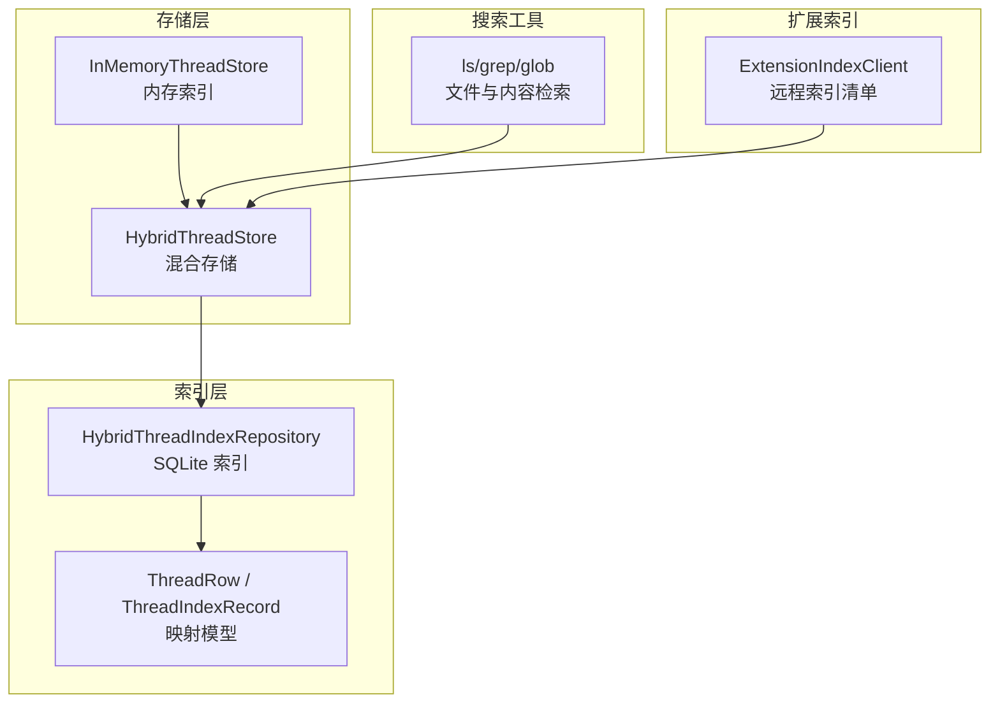
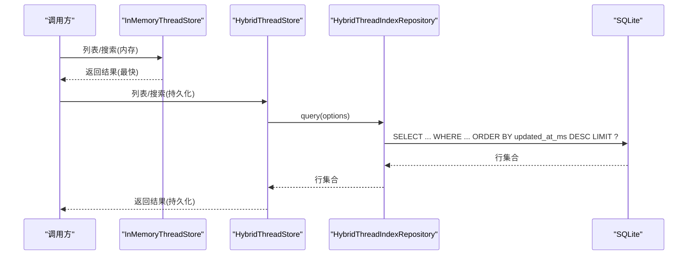
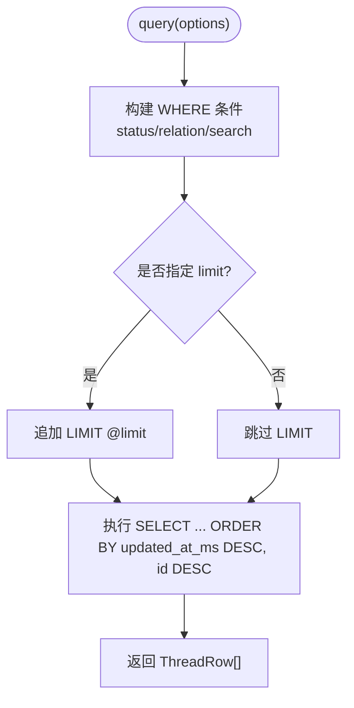
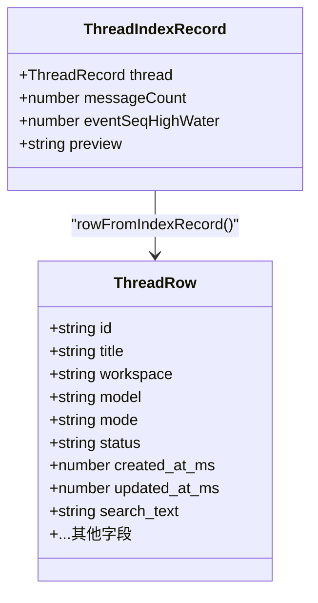
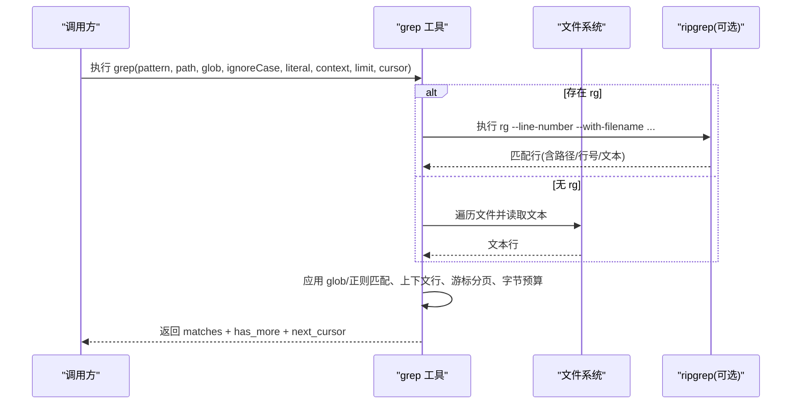
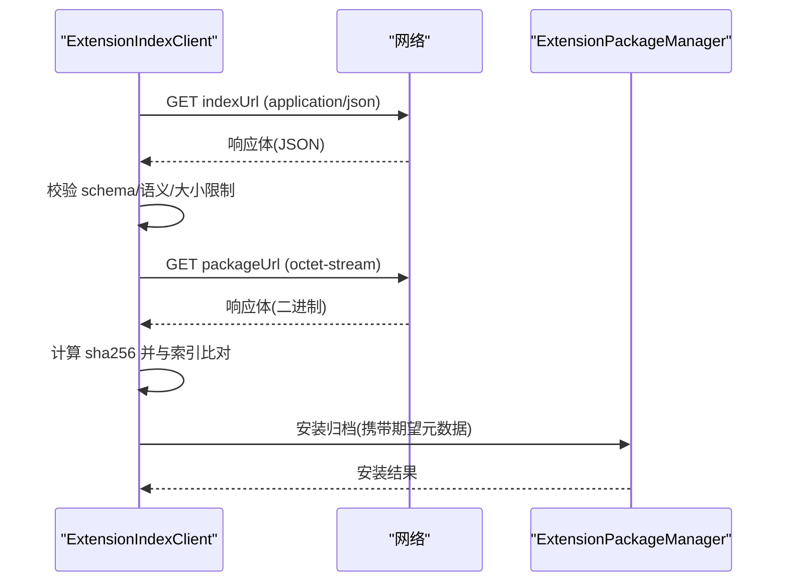
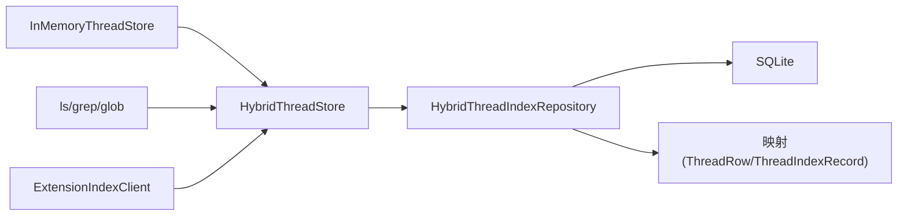

# 索引与搜索

<cite>
**本文引用的文件**
- [hybrid-thread-index.ts](file://kun/src/adapters/hybrid/hybrid-thread-index.ts)
- [hybrid-thread-index-mapping.ts](file://kun/src/adapters/hybrid/hybrid-thread-index-mapping.ts)
- [builtin-search-tools.ts](file://kun/src/adapters/tool/builtin-search-tools.ts)
- [index-client.ts](file://kun/src/extensions/index-client.ts)
- [in-memory-thread-store.ts](file://kun/src/adapters/in-memory-thread-store.ts)
- [hybrid-thread-store.ts](file://kun/src/adapters/hybrid/hybrid-thread-store.ts)
</cite>

## 目录
1. [简介](#简介)
2. [项目结构](#项目结构)
3. [核心组件](#核心组件)
4. [架构总览](#架构总览)
5. [详细组件分析](#详细组件分析)
6. [依赖关系分析](#依赖关系分析)
7. [性能考量](#性能考量)
8. [故障排查指南](#故障排查指南)
9. [结论](#结论)
10. [附录](#附录)

## 简介
本文件面向 DeepSeek-GUI 的“索引与搜索”子系统，系统性说明混合索引架构（内存索引 + 持久化索引）、索引映射机制、全文检索实现、索引构建与维护策略、查询语法与高级搜索能力、性能优化技术（压缩与缓存），以及排序过滤与健康检查修复工具的使用。文档以仓库中实际代码为依据，提供可追溯的源码路径与图示，帮助读者快速理解并高效使用该系统。

## 项目结构
围绕索引与搜索的关键代码主要分布在以下模块：
- 混合线程索引与映射：负责将线程数据投影为可查询的行记录，并提供 SQLite 上的增删改查与简单全文检索
- 内置搜索工具：提供基于工作区的文件查找与内容检索能力，支持分页游标、大小写/字面量匹配、上下文行等
- 扩展索引客户端：用于安全加载与校验远程扩展索引清单，保障安装来源可信
- 存储适配器：内存线程存储与混合线程存储分别承担热路径与冷路径的数据读写

**图表来源**
- [hybrid-thread-index.ts:9-98](file://kun/src/adapters/hybrid/hybrid-thread-index.ts#L9-L98)
- [hybrid-thread-index-mapping.ts:14-116](file://kun/src/adapters/hybrid/hybrid-thread-index-mapping.ts#L14-L116)
- [in-memory-thread-store.ts:1-200](file://kun/src/adapters/in-memory-thread-store.ts#L1-L200)
- [hybrid-thread-store.ts:1-200](file://kun/src/adapters/hybrid/hybrid-thread-store.ts#L1-L200)
- [builtin-search-tools.ts:28-464](file://kun/src/adapters/tool/builtin-search-tools.ts#L28-L464)
- [index-client.ts:44-296](file://kun/src/extensions/index-client.ts#L44-L296)

**章节来源**
- [hybrid-thread-index.ts:9-98](file://kun/src/adapters/hybrid/hybrid-thread-index.ts#L9-L98)
- [hybrid-thread-index-mapping.ts:14-116](file://kun/src/adapters/hybrid/hybrid-thread-index-mapping.ts#L14-L116)
- [builtin-search-tools.ts:28-464](file://kun/src/adapters/tool/builtin-search-tools.ts#L28-L464)
- [index-client.ts:44-296](file://kun/src/extensions/index-client.ts#L44-L296)
- [in-memory-thread-store.ts:1-200](file://kun/src/adapters/in-memory-thread-store.ts#L1-L200)
- [hybrid-thread-store.ts:1-200](file://kun/src/adapters/hybrid/hybrid-thread-store.ts#L1-L200)

## 核心组件
- 混合线程索引仓库（HybridThreadIndexRepository）
  - 职责：在 SQLite 中维护 threads 表，提供按状态、关系、搜索文本的列表查询；单条记录的查找、更新、删除；路径修复；增量 upsert
  - 关键能力：LIKE 全文检索、时间倒序排序、LIMIT 分页、事件水位合并、JSON 字段序列化/反序列化
- 索引映射（ThreadRow / ThreadIndexRecord）
  - 职责：将内存中的线程记录投影为数据库行，生成 search_text 全文片段；从行还原摘要信息
  - 关键能力：search_text 聚合（id/title/workspace/model/mode/forkedFromTitle/todos 等）、ISO 时间转毫秒、JSON 解析容错
- 内置搜索工具（ls/grep/glob）
  - 职责：在工作区范围内列出目录、按 glob 查找文件、按模式检索文件内容；支持分页游标、大小写/字面量匹配、上下文行、字节预算限制
  - 关键能力：优先调用外部 rg/fd 加速扫描，回退到 JS 遍历；结果集按 JSON 字符串排序保证稳定；游标防篡改校验
- 扩展索引客户端（ExtensionIndexClient）
  - 职责：拉取并校验远程扩展索引清单，下载包体并校验哈希，安装到本地管理器
  - 关键能力：HTTPS 强制、重定向限制、内容长度限制、Schema 强校验、语义校验（版本、权限唯一性等）

**章节来源**
- [hybrid-thread-index.ts:9-98](file://kun/src/adapters/hybrid/hybrid-thread-index.ts#L9-L98)
- [hybrid-thread-index-mapping.ts:14-116](file://kun/src/adapters/hybrid/hybrid-thread-index-mapping.ts#L14-L116)
- [builtin-search-tools.ts:28-464](file://kun/src/adapters/tool/builtin-search-tools.ts#L28-L464)
- [index-client.ts:44-296](file://kun/src/extensions/index-client.ts#L44-L296)

## 架构总览
混合索引采用“内存热路径 + SQLite 冷路径”的组合：
- 内存索引：适用于高频读写的会话级数据，响应极快，但进程重启丢失
- 持久化索引：通过 SQLite 持久化线程元数据与轻量全文片段，支持跨进程/重启后的检索与恢复
- 映射层：统一内存对象与数据库行的转换，确保一致性
- 搜索工具：对文件与内容进行补充检索，弥补元数据索引的不足

**图表来源**
- [hybrid-thread-index.ts:16-28](file://kun/src/adapters/hybrid/hybrid-thread-index.ts#L16-L28)
- [hybrid-thread-store.ts:1-200](file://kun/src/adapters/hybrid/hybrid-thread-store.ts#L1-L200)
- [in-memory-thread-store.ts:1-200](file://kun/src/adapters/in-memory-thread-store.ts#L1-L200)

## 详细组件分析

### 混合线程索引仓库（HybridThreadIndexRepository）
- 查询与过滤
  - 支持 archivedOnly/includeArchived/includeSide/search/limit 等选项
  - 使用 LIKE 进行大小写无关的模糊匹配，并对 %/_ 进行转义防止注入
  - 排序：updated_at_ms 降序，其次 id 降序；可选 LIMIT 分页
- 写入与修复
  - upsert 覆盖更新，保留 event_seq_high_water 的最大值合并策略
  - repairPaths 修正元数据/消息/事件文件路径
  - delete 同时清理 usage_events 关联数据
- 错误处理
  - 所有 SQL 操作包裹 try/catch，并通过 warn 回调上报异常，避免单点失败影响整体流程

**图表来源**
- [hybrid-thread-index.ts:16-28](file://kun/src/adapters/hybrid/hybrid-thread-index.ts#L16-L28)
- [hybrid-thread-index.ts:100-101](file://kun/src/adapters/hybrid/hybrid-thread-index.ts#L100-L101)

**章节来源**
- [hybrid-thread-index.ts:16-28](file://kun/src/adapters/hybrid/hybrid-thread-index.ts#L16-L28)
- [hybrid-thread-index.ts:30-98](file://kun/src/adapters/hybrid/hybrid-thread-index.ts#L30-L98)
- [hybrid-thread-index.ts:100-101](file://kun/src/adapters/hybrid/hybrid-thread-index.ts#L100-L101)

### 索引映射（ThreadRow / ThreadIndexRecord）
- 行构造
  - rowFromIndexRecord：将内存线程记录转换为数据库行，包含 JSON 字段序列化、布尔/数值规范化、时间戳转换、search_text 聚合
- 摘要还原
  - summaryFromRow：从数据库行还原 ThreadSummary，JSON 解析失败时降级为 null
- 过滤与搜索
  - filterThreadSummaries：在内存中对 summaries 应用 archived/side/search/limit 过滤，便于上层组合查询

**图表来源**
- [hybrid-thread-index-mapping.ts:14-68](file://kun/src/adapters/hybrid/hybrid-thread-index-mapping.ts#L14-L68)

**章节来源**
- [hybrid-thread-index-mapping.ts:14-116](file://kun/src/adapters/hybrid/hybrid-thread-index-mapping.ts#L14-L116)

### 内置搜索工具（ls/grep/glob）
- ls：列出目录条目，标记目录，支持 limit 截断
- glob/find：按 glob 模式查找文件，优先 fd/rg，回退到 JS 收集路径；支持 cursor 分页与字节预算
- grep：按正则或字面量匹配文件内容，支持 ignoreCase/literal/context/limit/glob；优先 rg，回退到 JS 逐行扫描；输出包含上下文行、跳过大文件计数、扫描字节限制命中标志

**图表来源**
- [builtin-search-tools.ts:257-464](file://kun/src/adapters/tool/builtin-search-tools.ts#L257-L464)

**章节来源**
- [builtin-search-tools.ts:28-464](file://kun/src/adapters/tool/builtin-search-tools.ts#L28-L464)

### 扩展索引客户端（ExtensionIndexClient）
- 拉取与校验
  - load：HTTPS 强制、重定向限制、内容长度限制、JSON Schema 校验、语义校验（发布者/ID/版本/权限唯一性）
- 安装流程
  - installExact：根据 index 定位精确版本，下载包体并校验 sha256，写入临时文件后交由管理器安装
- 安全与健壮性
  - 严格 URL 协议校验、最大重定向次数、下载体积上限、流式读取并累计字节限制

**图表来源**
- [index-client.ts:57-156](file://kun/src/extensions/index-client.ts#L57-L156)
- [index-client.ts:192-238](file://kun/src/extensions/index-client.ts#L192-L238)

**章节来源**
- [index-client.ts:44-296](file://kun/src/extensions/index-client.ts#L44-L296)

## 依赖关系分析
- HybridThreadIndexRepository 依赖 better-sqlite3 数据库连接与路径工厂，向上暴露统一的列表/查找/更新/删除接口
- 映射模块依赖领域契约类型，负责内存对象与数据库行之间的双向转换
- 搜索工具依赖系统命令（fd/rg）以提升性能，同时提供纯 JS 回退路径以保证可用性
- 扩展索引客户端依赖网络与安全校验逻辑，确保索引与包的完整性与合法性

**图表来源**
- [hybrid-thread-index.ts:9-98](file://kun/src/adapters/hybrid/hybrid-thread-index.ts#L9-L98)
- [hybrid-thread-index-mapping.ts:14-116](file://kun/src/adapters/hybrid/hybrid-thread-index-mapping.ts#L14-L116)
- [builtin-search-tools.ts:28-464](file://kun/src/adapters/tool/builtin-search-tools.ts#L28-L464)
- [index-client.ts:44-296](file://kun/src/extensions/index-client.ts#L44-L296)
- [hybrid-thread-store.ts:1-200](file://kun/src/adapters/hybrid/hybrid-thread-store.ts#L1-L200)
- [in-memory-thread-store.ts:1-200](file://kun/src/adapters/in-memory-thread-store.ts#L1-L200)

**章节来源**
- [hybrid-thread-index.ts:9-98](file://kun/src/adapters/hybrid/hybrid-thread-index.ts#L9-L98)
- [hybrid-thread-index-mapping.ts:14-116](file://kun/src/adapters/hybrid/hybrid-thread-index-mapping.ts#L14-L116)
- [builtin-search-tools.ts:28-464](file://kun/src/adapters/tool/builtin-search-tools.ts#L28-L464)
- [index-client.ts:44-296](file://kun/src/extensions/index-client.ts#L44-L296)
- [hybrid-thread-store.ts:1-200](file://kun/src/adapters/hybrid/hybrid-thread-store.ts#L1-L200)
- [in-memory-thread-store.ts:1-200](file://kun/src/adapters/in-memory-thread-store.ts#L1-L200)

## 性能考量
- 查询性能
  - 使用 SQLite 的 LIKE 与 ORDER BY 结合索引列（如 updated_at_ms）提升排序与过滤效率
  - 通过 LIMIT 控制返回规模，避免全表扫描
- 构建与维护
  - upsert 仅更新必要字段，event_seq_high_water 采用 MAX 合并，减少不必要重写
  - repairPaths 可在迁移或路径变更时批量修复，降低不一致风险
- 搜索性能
  - 优先调用 rg/fd 进行文件与内容检索，显著降低 CPU 与 I/O 开销
  - 游标分页与字节预算限制，避免单次响应过大导致内存压力
- 压缩与缓存
  - 当前实现未显式启用压缩；可通过调整 search_text 粒度与 JSON 字段大小间接控制体积
  - 建议在更高层引入查询结果缓存（如 LRU），对相同 options 的查询进行短期缓存

[本节为通用性能建议，不直接分析具体文件]

## 故障排查指南
- 常见错误与处理
  - 数据库操作异常：HybridThreadIndexRepository 捕获 SQL 异常并通过 warn 回调上报，需检查数据库连接与表结构
  - 搜索结果为空：确认 search_text 是否包含目标关键词；检查 includeArchived/includeSide 等过滤条件
  - 游标无效：grep/glob 的 cursor 必须来自同一查询上下文，否则会被拒绝
  - 扩展索引错误：HTTPS 要求、重定向超限、内容长度超限、Schema/语义校验失败均会抛出明确错误
- 健康检查与修复
  - 路径修复：使用 repairPaths 修正 threads 表的 metadata/messages/events 路径
  - 数据一致性：通过 summaryFromRow 的 JSON 解析容错，避免损坏数据阻断流程
  - 日志与诊断：关注 warn 回调与工具返回的 skipped_large_files/scan_byte_limit_reached/command_output_truncated 等标志位

**章节来源**
- [hybrid-thread-index.ts:30-98](file://kun/src/adapters/hybrid/hybrid-thread-index.ts#L30-L98)
- [hybrid-thread-index-mapping.ts:70-110](file://kun/src/adapters/hybrid/hybrid-thread-index-mapping.ts#L70-L110)
- [builtin-search-tools.ts:201-255](file://kun/src/adapters/tool/builtin-search-tools.ts#L201-L255)
- [index-client.ts:57-156](file://kun/src/extensions/index-client.ts#L57-L156)

## 结论
DeepSeek-GUI 的索引与搜索系统通过混合索引架构实现了高性能与高可用的平衡：内存索引满足热路径低延迟需求，SQLite 持久化索引提供跨进程/重启后的检索能力；映射层确保数据一致性与可恢复性；内置搜索工具对工作区文件与内容进行高效检索；扩展索引客户端保障外部资源的安全与完整。结合合理的查询参数、分页游标与字节预算，系统在大规模数据场景下仍保持稳定与高效。

[本节为总结性内容，不直接分析具体文件]

## 附录

### 搜索查询语法与高级功能
- 列表查询选项
  - archivedOnly/includeArchived：控制归档/非归档线程的可见性
  - includeSide：排除 side 关系线程
  - search：对 search_text 进行 LIKE 模糊匹配（已转义 %/_）
  - limit：限制返回数量
- 文件与内容检索
  - glob：支持 ** 与相对路径，自动补全为 **/pattern
  - grep：支持 ignoreCase/literal/context/limit/glob；优先 rg 加速
  - 游标分页：next_cursor 用于下一页，cursor 必须属于同一查询上下文
- 扩展索引
  - 仅 HTTPS，限制重定向次数与下载体积，严格 Schema/语义校验

**章节来源**
- [hybrid-thread-index.ts:16-28](file://kun/src/adapters/hybrid/hybrid-thread-index.ts#L16-L28)
- [hybrid-thread-index-mapping.ts:97-116](file://kun/src/adapters/hybrid/hybrid-thread-index-mapping.ts#L97-L116)
- [builtin-search-tools.ts:88-197](file://kun/src/adapters/tool/builtin-search-tools.ts#L88-L197)
- [builtin-search-tools.ts:257-464](file://kun/src/adapters/tool/builtin-search-tools.ts#L257-L464)
- [index-client.ts:57-156](file://kun/src/extensions/index-client.ts#L57-L156)

### 索引构建与维护策略
- 增量更新：upsert 仅更新变化字段，event_seq_high_water 采用 MAX 合并，减少重写成本
- 定期重建：当发生路径迁移或数据不一致时，使用 repairPaths 修复；必要时可触发全量重建流程（由上层编排）
- 健康检查：关注 warn 回调与搜索结果中的边界标志位，及时发现问题

**章节来源**
- [hybrid-thread-index.ts:50-98](file://kun/src/adapters/hybrid/hybrid-thread-index.ts#L50-L98)
- [hybrid-thread-index.ts:35-48](file://kun/src/adapters/hybrid/hybrid-thread-index.ts#L35-L48)

### 排序与过滤使用方法
- 排序：默认按 updated_at_ms 降序，其次 id 降序；如需自定义排序，可在上层对结果二次排序
- 过滤：通过 archivedOnly/includeArchived/includeSide/search 组合实现细粒度筛选
- 分页：使用 limit 控制每页大小，配合游标实现稳定分页

**章节来源**
- [hybrid-thread-index.ts:16-28](file://kun/src/adapters/hybrid/hybrid-thread-index.ts#L16-L28)
- [hybrid-thread-index-mapping.ts:97-105](file://kun/src/adapters/hybrid/hybrid-thread-index-mapping.ts#L97-L105)