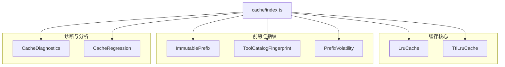
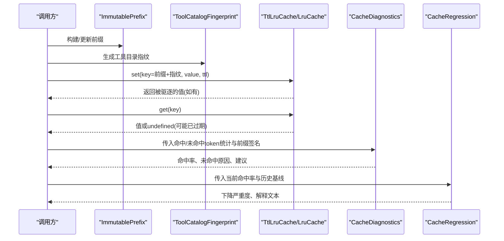
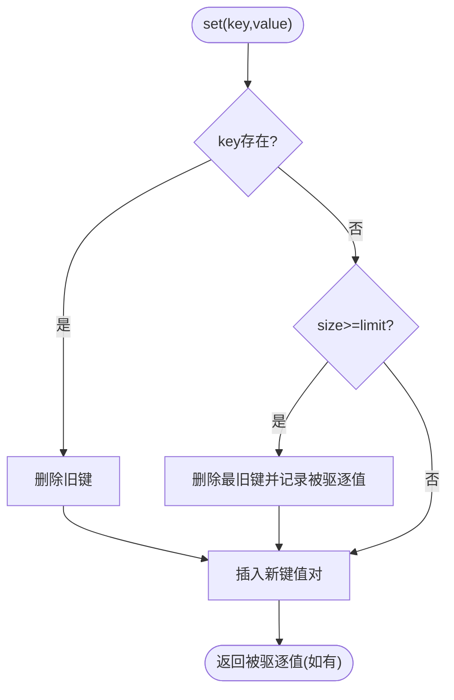
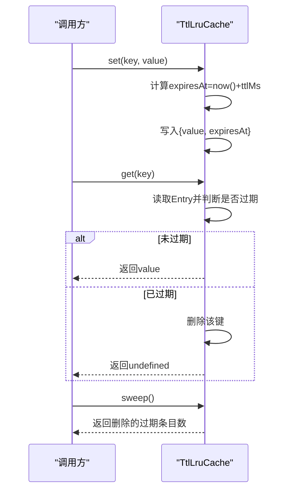
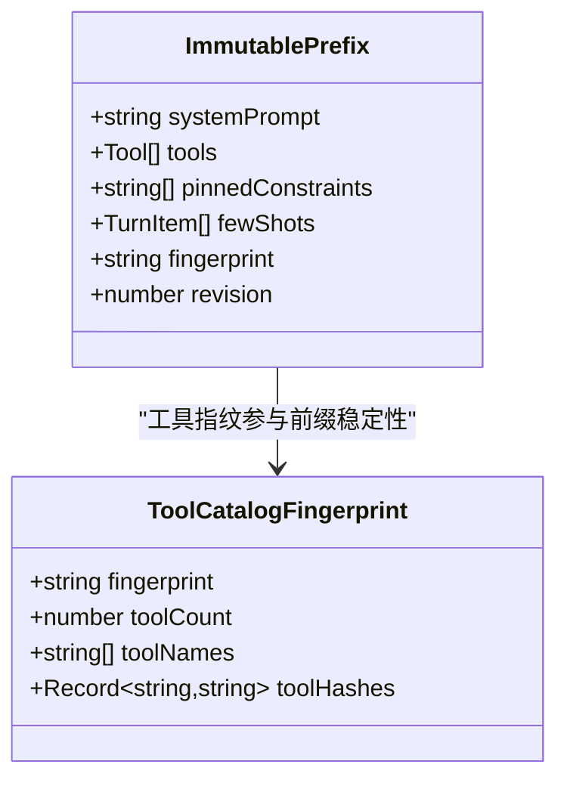
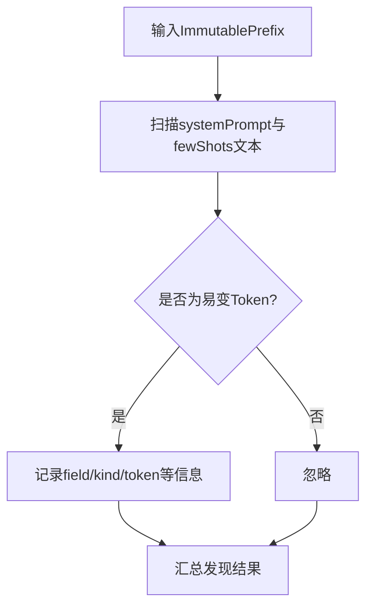
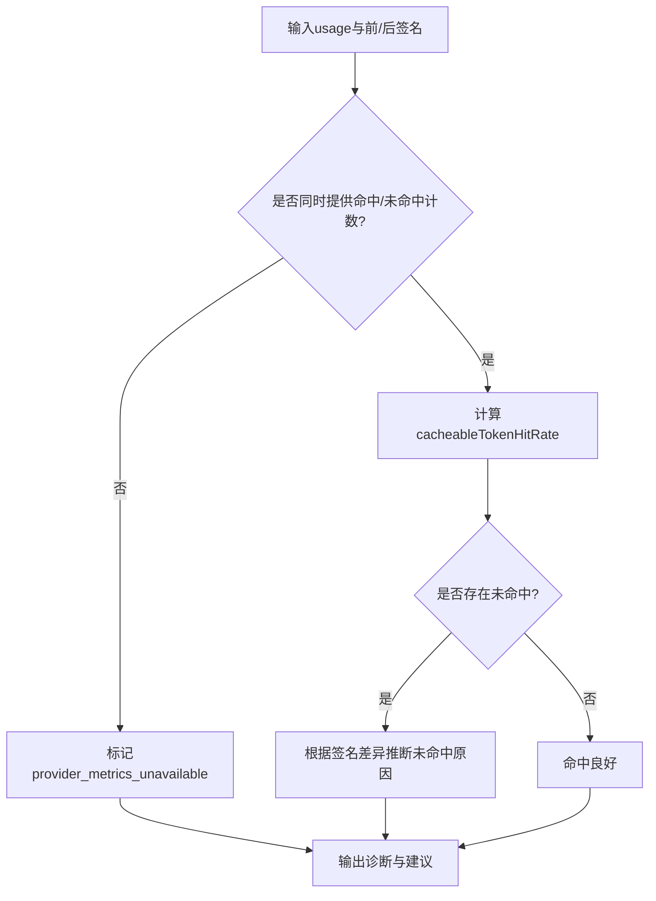
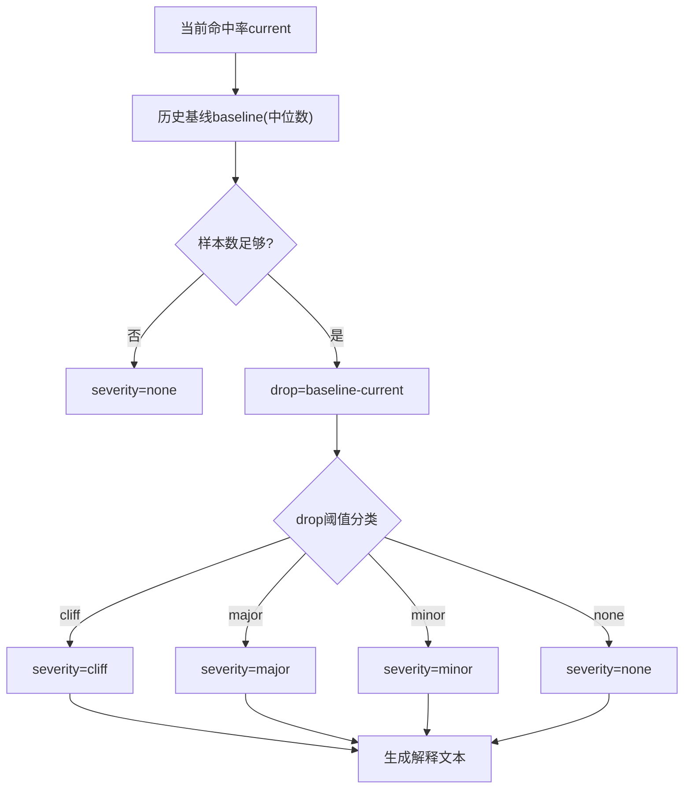
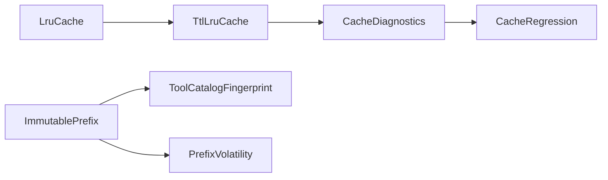

# 缓存系统

<cite>
**本文引用的文件**
- [kun/src/cache/index.ts](file://kun/src/cache/index.ts)
- [kun/src/cache/lru-cache.ts](file://kun/src/cache/lru-cache.ts)
- [kun/src/cache/ttl-lru-cache.ts](file://kun/src/cache/ttl-lru-cache.ts)
- [kun/src/cache/immutable-prefix.ts](file://kun/src/cache/immutable-prefix.ts)
- [kun/src/cache/tool-catalog-fingerprint.ts](file://kun/src/cache/tool-catalog-fingerprint.ts)
- [kun/src/cache/prefix-volatility.ts](file://kun/src/cache/prefix-volatility.ts)
- [kun/src/cache/cache-diagnostics.ts](file://kun/src/cache/cache-diagnostics.ts)
- [kun/src/cache/cache-regression.ts](file://kun/src/cache/cache-regression.ts)
- [kun/tests/cache.test.ts](file://kun/tests/cache.test.ts)
</cite>

## 目录
1. [简介](#简介)
2. [项目结构](#项目结构)
3. [核心组件](#核心组件)
4. [架构总览](#架构总览)
5. [详细组件分析](#详细组件分析)
6. [依赖关系分析](#依赖关系分析)
7. [性能考量](#性能考量)
8. [故障排查指南](#故障排查指南)
9. [结论](#结论)
10. [附录](#附录)

## 简介
本文件为 DeepSeek-GUI 的缓存系统提供全面文档，覆盖以下主题：
- LRU 缓存算法的实现原理与配置选项
- TTL（生存时间）缓存机制、过期策略与内存管理
- 缓存诊断工具的使用方法，包括命中率监控与性能分析
- 前缀化缓存策略，用于隔离不同模块的缓存数据
- 缓存失效机制，包括主动失效与被动清理
- 缓存一致性保证与数据同步策略
- 缓存性能调优最佳实践与常见问题解决方案
- 缓存系统的监控指标与调试技巧

## 项目结构
缓存子系统位于 kun/src/cache 目录下，采用分层与职责分离的设计：
- 基础数据结构：LRU 与带 TTL 的 LRU
- 前缀与指纹：不可变前缀、工具目录指纹、前缀波动性检测
- 诊断与分析：命中原因诊断、回归趋势分析
- 统一导出：index.ts 聚合对外 API

图表来源
- [kun/src/cache/index.ts:1-6](file://kun/src/cache/index.ts#L1-L6)

章节来源
- [kun/src/cache/index.ts:1-6](file://kun/src/cache/index.ts#L1-L6)

## 核心组件
- LruCache：有界 LRU 缓存，支持 get/set/delete/clear/keys/values，容量满时驱逐最久未使用项。
- TtlLruCache：在 LRU 基础上增加 TTL 过期能力，支持 sweep 批量清理过期条目。
- ImmutablePrefix：构建稳定、可哈希的前缀，包含 systemPrompt、tools、pinnedConstraints、fewShots，并提供变更追踪与校验。
- ToolCatalogFingerprint：对工具目录进行规范化与哈希，生成稳定的指纹。
- PrefixVolatility：扫描前缀中的易变内容（UUID、ISO 时间、十六进制哈希、JWT），辅助定位导致缓存失效的因素。
- CacheDiagnostics：基于提供者上报的命中/未命中 token 统计，计算命中率并给出未命中原因与建议。
- CacheRegression：对比当前命中率与历史基线，识别下降幅度与主要归因。

章节来源
- [kun/src/cache/lru-cache.ts:1-67](file://kun/src/cache/lru-cache.ts#L1-L67)
- [kun/src/cache/ttl-lru-cache.ts:1-73](file://kun/src/cache/ttl-lru-cache.ts#L1-L73)
- [kun/src/cache/immutable-prefix.ts:1-192](file://kun/src/cache/immutable-prefix.ts#L1-L192)
- [kun/src/cache/tool-catalog-fingerprint.ts:1-57](file://kun/src/cache/tool-catalog-fingerprint.ts#L1-L57)
- [kun/src/cache/prefix-volatility.ts:1-223](file://kun/src/cache/prefix-volatility.ts#L1-L223)
- [kun/src/cache/cache-diagnostics.ts:1-102](file://kun/src/cache/cache-diagnostics.ts#L1-L102)
- [kun/src/cache/cache-regression.ts:1-155](file://kun/src/cache/cache-regression.ts#L1-L155)

## 架构总览
缓存系统围绕“稳定前缀 + 有界 LRU + TTL”展开：
- 通过 ImmutablePrefix 和 ToolCatalogFingerprint 生成稳定的缓存键前缀，确保相同上下文复用缓存。
- 使用 LruCache 控制内存上限，避免无限增长；TtlLruCache 在此基础上增加 TTL 过期策略。
- 通过 CacheDiagnostics 与 CacheRegression 持续评估命中率与趋势，指导调优。
- 通过 PrefixVolatility 检测前缀中的易变片段，帮助优化前缀设计。

图表来源
- [kun/src/cache/immutable-prefix.ts:101-142](file://kun/src/cache/immutable-prefix.ts#L101-L142)
- [kun/src/cache/tool-catalog-fingerprint.ts:11-21](file://kun/src/cache/tool-catalog-fingerprint.ts#L11-L21)
- [kun/src/cache/ttl-lru-cache.ts:17-48](file://kun/src/cache/ttl-lru-cache.ts#L17-L48)
- [kun/src/cache/cache-diagnostics.ts:31-92](file://kun/src/cache/cache-diagnostics.ts#L31-L92)
- [kun/src/cache/cache-regression.ts:65-116](file://kun/src/cache/cache-regression.ts#L65-L116)

## 详细组件分析

### LRU 缓存（LruCache）
- 实现要点
  - 使用 Map 维护插入顺序，get 会提升访问到最近位置。
  - set 在达到容量时删除最旧键，返回被驱逐的值以便上层处理。
  - 不抛出异常，miss 返回 undefined。
- 复杂度
  - get/set/delete 均摊 O(1)。
- 适用场景
  - 纯内存缓存，无过期需求，需严格限制内存占用。

图表来源
- [kun/src/cache/lru-cache.ts:36-49](file://kun/src/cache/lru-cache.ts#L36-L49)

章节来源
- [kun/src/cache/lru-cache.ts:1-67](file://kun/src/cache/lru-cache.ts#L1-L67)
- [kun/tests/cache.test.ts:187-218](file://kun/tests/cache.test.ts#L187-L218)

### 带 TTL 的 LRU 缓存（TtlLruCache）
- 实现要点
  - 内部封装 LruCache，存储值为 {value, expiresAt}。
  - get 时检查是否过期，过期则删除并返回 undefined。
  - set 时写入 expiresAt = now() + ttlMs。
  - sweep 遍历所有键，删除过期项并返回删除数量。
- 过期策略
  - 惰性过期：读取时检查并清理。
  - 主动清理：sweep 批量清理。
- 内存管理
  - 结合 LRU 容量限制与 TTL 双重约束，防止内存泄漏。

图表来源
- [kun/src/cache/ttl-lru-cache.ts:17-71](file://kun/src/cache/ttl-lru-cache.ts#L17-L71)

章节来源
- [kun/src/cache/ttl-lru-cache.ts:1-73](file://kun/src/cache/ttl-lru-cache.ts#L1-L73)
- [kun/tests/cache.test.ts:220-238](file://kun/tests/cache.test.ts#L220-L238)

### 不可变前缀与指纹（ImmutablePrefix）
- 目标
  - 将 systemPrompt、tools、pinnedConstraints、fewShots 等影响缓存命中的因素标准化并生成稳定指纹。
- 关键特性
  - 工具列表按名称排序，schema 键序规范化，避免无关顺序变化导致指纹漂移。
  - fewShot 仅保留对模型可见的稳定字段，忽略运行时 id 等易变信息。
  - 每次显式变更都会递增 revision 并重新计算 fingerprint。
  - 提供 verify 与 describeDrift 辅助校验与排障。
- 前缀化缓存策略
  - 以 fingerprint 作为缓存键的一部分，实现模块间的数据隔离与复用。

图表来源
- [kun/src/cache/immutable-prefix.ts:9-19](file://kun/src/cache/immutable-prefix.ts#L9-L19)
- [kun/src/cache/tool-catalog-fingerprint.ts:4-9](file://kun/src/cache/tool-catalog-fingerprint.ts#L4-L9)

章节来源
- [kun/src/cache/immutable-prefix.ts:1-192](file://kun/src/cache/immutable-prefix.ts#L1-L192)
- [kun/src/cache/tool-catalog-fingerprint.ts:1-57](file://kun/src/cache/tool-catalog-fingerprint.ts#L1-L57)
- [kun/tests/cache.test.ts:18-139](file://kun/tests/cache.test.ts#L18-L139)

### 前缀波动性检测（PrefixVolatility）
- 功能
  - 扫描前缀中的易变片段：UUID、ISO8601 时间、十六进制哈希、JWT。
  - 输出结构化发现结果，便于定位导致缓存失效的原因。
- 价值
  - 帮助开发者从提示词或示例中剔除易变内容，提高缓存命中率。

图表来源
- [kun/src/cache/prefix-volatility.ts:24-75](file://kun/src/cache/prefix-volatility.ts#L24-L75)

章节来源
- [kun/src/cache/prefix-volatility.ts:1-223](file://kun/src/cache/prefix-volatility.ts#L1-L223)

### 缓存诊断（CacheDiagnostics）
- 输入
  - 使用快照：promptTokens、cacheHitTokens、cacheMissTokens。
  - 前后请求签名：model、providerId、endpointFormat、prefixFingerprint、toolCatalogFingerprint、activeSkillIds。
- 输出
  - cacheableTokenHitRate：可缓存 token 命中率（当双方指标齐全）。
  - totalInputTokenHitRate：总输入 token 命中率。
  - reasons：未命中原因集合（如 model_changed、stable_prefix_changed 等）。
  - suggestions：改进建议（如保持模型/提供者稳定、剔除不稳定前缀元素等）。
- 注意事项
  - 若仅提供命中或未命中一侧指标，视为不完整，不会误报完美命中率。

图表来源
- [kun/src/cache/cache-diagnostics.ts:31-92](file://kun/src/cache/cache-diagnostics.ts#L31-L92)

章节来源
- [kun/src/cache/cache-diagnostics.ts:1-102](file://kun/src/cache/cache-diagnostics.ts#L1-L102)

### 缓存回归分析（CacheRegression）
- 功能
  - 比较当前命中率与历史基线的中位数，识别下降幅度（minor/major/cliff）。
  - 依据未命中原因优先级选择主因，生成可读解释。
- 用途
  - 在 GUI 中提示用户“命中率从 X% 降至 Y%，可能原因是...”，辅助快速定位问题。

图表来源
- [kun/src/cache/cache-regression.ts:65-116](file://kun/src/cache/cache-regression.ts#L65-L116)

章节来源
- [kun/src/cache/cache-regression.ts:1-155](file://kun/src/cache/cache-regression.ts#L1-L155)

## 依赖关系分析
- LruCache 是 TtlLruCache 的基础，二者构成内存与过期控制的基石。
- ImmutablePrefix 与 ToolCatalogFingerprint 共同决定缓存键的稳定性，直接影响命中率。
- PrefixVolatility 为 ImmutablePrefix 的使用提供诊断支持。
- CacheDiagnostics 与 CacheRegression 依赖上游提供的统计与签名，形成闭环监控。

图表来源
- [kun/src/cache/lru-cache.ts:1-67](file://kun/src/cache/lru-cache.ts#L1-L67)
- [kun/src/cache/ttl-lru-cache.ts:1-73](file://kun/src/cache/ttl-lru-cache.ts#L1-L73)
- [kun/src/cache/immutable-prefix.ts:1-192](file://kun/src/cache/immutable-prefix.ts#L1-L192)
- [kun/src/cache/tool-catalog-fingerprint.ts:1-57](file://kun/src/cache/tool-catalog-fingerprint.ts#L1-L57)
- [kun/src/cache/prefix-volatility.ts:1-223](file://kun/src/cache/prefix-volatility.ts#L1-L223)
- [kun/src/cache/cache-diagnostics.ts:1-102](file://kun/src/cache/cache-diagnostics.ts#L1-L102)
- [kun/src/cache/cache-regression.ts:1-155](file://kun/src/cache/cache-regression.ts#L1-L155)

章节来源
- [kun/src/cache/index.ts:1-6](file://kun/src/cache/index.ts#L1-L6)

## 性能考量
- 容量与淘汰
  - 合理设置 limit，避免频繁淘汰导致命中率下降；过大则增加内存占用。
- TTL 设置
  - 根据业务数据变化频率设置 ttlMs；过短降低命中率，过长可能导致陈旧数据。
- 前缀稳定性
  - 避免在 systemPrompt 或 fewShots 中引入易变内容（时间戳、随机ID、会话ID等）。
  - 使用 ImmutablePrefix 的规范化能力减少无关顺序带来的指纹漂移。
- 扫描与清理
  - 定期调用 sweep 清理过期条目，避免内存膨胀。
  - 使用 PrefixVolatility 在前端或开发阶段检测易变内容。
- 监控与回归
  - 利用 CacheDiagnostics 关注 cacheableTokenHitRate 与 totalInputTokenHitRate。
  - 使用 CacheRegression 跟踪命中率趋势，及时告警。

[本节为通用性能指导，无需特定文件引用]

## 故障排查指南
- 命中率突然下降
  - 检查是否更换了 model/provider/endpoint，这些会导致新的 provider 缓存。
  - 检查 stable prefix 是否发生变化（例如新增/修改了 systemPrompt、tools、pinnedConstraints、fewShots）。
  - 检查工具目录是否变化（MCP/Skill 工具变动会影响前缀指纹）。
  - 检查 active Skill 集是否变化。
- 无法获得命中/未命中指标
  - 若提供者未上报命中/未命中 token，将无法准确评估缓存效果，需升级或切换提供者。
- 前缀中包含易变内容
  - 使用 PrefixVolatility 扫描并移除 UUID、ISO 时间、十六进制哈希、JWT 等易变片段。
- 内存占用过高
  - 调整 LRU limit，缩短 TTL，定期 sweep。
- 缓存不一致
  - 确保前缀生成逻辑一致，避免隐式变更；必要时使用 verifyImmutablePrefix 校验。

章节来源
- [kun/src/cache/cache-diagnostics.ts:31-92](file://kun/src/cache/cache-diagnostics.ts#L31-L92)
- [kun/src/cache/cache-regression.ts:39-63](file://kun/src/cache/cache-regression.ts#L39-L63)
- [kun/src/cache/prefix-volatility.ts:24-75](file://kun/src/cache/prefix-volatility.ts#L24-L75)
- [kun/src/cache/immutable-prefix.ts:163-171](file://kun/src/cache/immutable-prefix.ts#L163-L171)

## 结论
DeepSeek-GUI 的缓存系统通过“稳定前缀 + 有界 LRU + TTL”的组合，实现了高命中率与可控内存占用的平衡。借助 ImmutablePrefix 与 ToolCatalogFingerprint 保障键的稳定性，TtlLruCache 提供过期与淘汰策略，配合 CacheDiagnostics 与 CacheRegression 实现持续的命中率监控与回归分析。通过 PrefixVolatility 可提前发现并消除前缀中的易变因素，从而显著提升缓存效果。建议在工程实践中遵循前缀稳定、合理容量与 TTL、定期清理与监控的策略，以获得更优的性能表现。

[本节为总结性内容，无需特定文件引用]

## 附录

### 配置选项速查
- LruCache
  - limit：必须大于 0，控制最大条目数。
- TtlLruCache
  - limit：同上。
  - ttlMs：必须大于 0，单位毫秒。
  - now：可选的时间源，便于测试与模拟。
- ImmutablePrefix
  - systemPrompt/tools/pinnedConstraints/fewShots：影响前缀指纹的关键字段。
  - 变更方式：通过 setSystemPrompt/setTools/setPinnedConstraints/setFewShots 显式更新，自动重算指纹与版本号。
- 诊断与分析
  - diagnoseCacheUsage：需要 promptTokens、cacheHitTokens、cacheMissTokens 以及前后请求签名。
  - analyzeCacheRegression：需要当前命中率与历史基线数组，可配置最小样本数。

章节来源
- [kun/src/cache/lru-cache.ts:13-18](file://kun/src/cache/lru-cache.ts#L13-L18)
- [kun/src/cache/ttl-lru-cache.ts:17-24](file://kun/src/cache/ttl-lru-cache.ts#L17-L24)
- [kun/src/cache/immutable-prefix.ts:101-142](file://kun/src/cache/immutable-prefix.ts#L101-L142)
- [kun/src/cache/cache-diagnostics.ts:31-92](file://kun/src/cache/cache-diagnostics.ts#L31-L92)
- [kun/src/cache/cache-regression.ts:65-116](file://kun/src/cache/cache-regression.ts#L65-L116)

### 监控指标与调试技巧
- 指标
  - cacheableTokenHitRate：可缓存 token 命中率（当命中/未命中指标齐全）。
  - totalInputTokenHitRate：总输入 token 命中率。
  - reasons：未命中原因集合，用于定位问题。
  - severity/explanation：回归严重度与解释文本。
- 调试技巧
  - 使用 describeFingerprintDrift 查看前缀哪些字段发生漂移。
  - 使用 detectVolatilePrefixContent 扫描易变内容。
  - 在测试中注入 now 函数验证 TTL 行为。
  - 使用 verifyImmutablePrefix 在生产外环境强制校验前缀一致性。

章节来源
- [kun/src/cache/cache-diagnostics.ts:31-92](file://kun/src/cache/cache-diagnostics.ts#L31-L92)
- [kun/src/cache/cache-regression.ts:65-116](file://kun/src/cache/cache-regression.ts#L65-L116)
- [kun/src/cache/immutable-prefix.ts:163-191](file://kun/src/cache/immutable-prefix.ts#L163-L191)
- [kun/src/cache/prefix-volatility.ts:24-75](file://kun/src/cache/prefix-volatility.ts#L24-L75)
- [kun/tests/cache.test.ts:220-238](file://kun/tests/cache.test.ts#L220-L238)