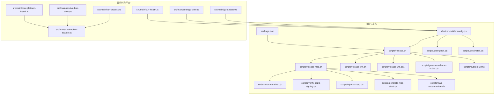
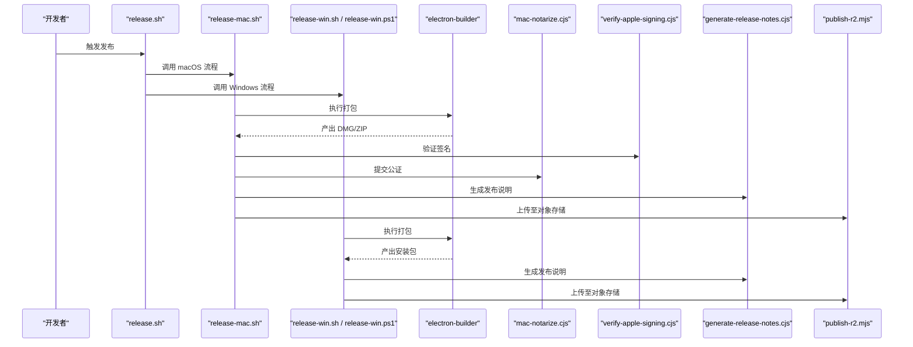
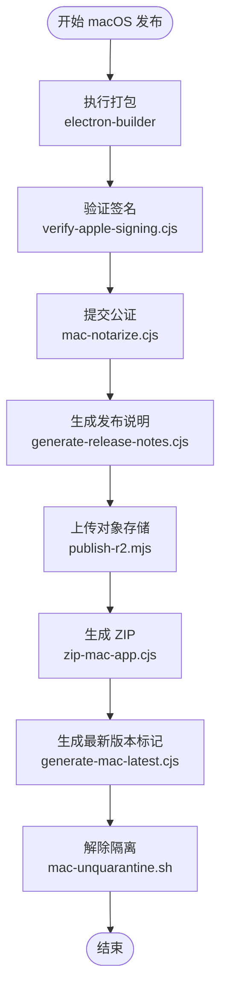
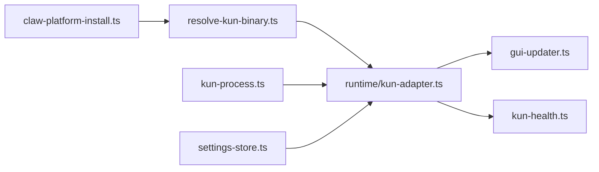
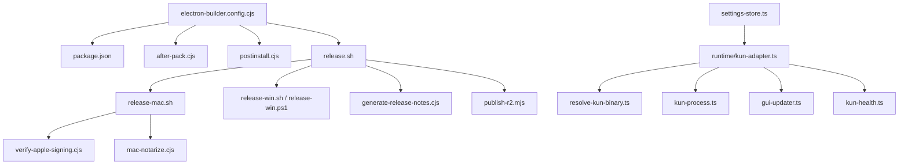

# 多平台打包

<cite>
**本文引用的文件**
- [electron-builder.config.cjs](file://electron-builder.config.cjs)
- [package.json](file://package.json)
- [scripts/release.sh](file://scripts/release.sh)
- [scripts/release-mac.sh](file://scripts/release-mac.sh)
- [scripts/release-win.sh](file://scripts/release-win.sh)
- [scripts/release-win.ps1](file://scripts/release-win.ps1)
- [scripts/mac-notarize.cjs](file://scripts/mac-notarize.cjs)
- [scripts/verify-apple-signing.cjs](file://scripts/verify-apple-signing.cjs)
- [scripts/generate-release-notes.cjs](file://scripts/generate-release-notes.cjs)
- [scripts/publish-r2.mjs](file://scripts/publish-r2.mjs)
- [scripts/lib/release-common.sh](file://scripts/lib/release-common.sh)
- [scripts/after-pack.cjs](file://scripts/after-pack.cjs)
- [scripts/postinstall.cjs](file://scripts/postinstall.cjs)
- [scripts/zip-mac-app.cjs](file://scripts/zip-mac-app.cjs)
- [scripts/generate-mac-latest.cjs](file://scripts/generate-mac-latest.cjs)
- [scripts/mac-unquarantine.sh](file://scripts/mac-unquarantine.sh)
- [src/main/claw-platform-install.ts](file://src/main/claw-platform-install.ts)
- [src/main/resolve-kun-binary.ts](file://src/main/resolve-kun-binary.ts)
- [src/main/kun-process.ts](file://src/main/kun-process.ts)
- [src/main/runtime/kun-adapter.ts](file://src/main/runtime/kun-adapter.ts)
- [src/main/gui-updater.ts](file://src/main/gui-updater.ts)
- [src/main/settings-store.ts](file://src/main/settings-store.ts)
- [src/main/kun-health.ts](file://src/main/kun-health.ts)
</cite>

## 目录
1. [简介](#简介)
2. [项目结构](#项目结构)
3. [核心组件](#核心组件)
4. [架构总览](#架构总览)
5. [详细组件分析](#详细组件分析)
6. [依赖分析](#依赖分析)
7. [性能考虑](#性能考虑)
8. [故障排查指南](#故障排查指南)
9. [结论](#结论)
10. [附录](#附录)

## 简介
本指南面向 DeepSeek GUI 的多平台打包与发布，覆盖 macOS、Windows、Linux 三大平台的打包配置、签名与公证（macOS）、自动化脚本与 CI/CD 集成、以及平台特定问题排查。文档基于仓库内现有配置与脚本进行系统化整理，帮助开发者快速完成可分发版本的构建与发布。

## 项目结构
与打包发布直接相关的目录与文件包括：
- 打包配置：electron-builder 配置文件
- 发布脚本：跨平台发布脚本与平台特定脚本
- 平台集成：Kun 运行时与本地二进制解析、平台安装器等
- 代码签名与公证：Apple 相关验证与公证脚本
- 辅助工具：发布说明生成、R2 对象存储发布、后置处理钩子等

图表来源
- [electron-builder.config.cjs](file://electron-builder.config.cjs)
- [package.json](file://package.json)
- [scripts/release.sh](file://scripts/release.sh)
- [scripts/release-mac.sh](file://scripts/release-mac.sh)
- [scripts/release-win.sh](file://scripts/release-win.sh)
- [scripts/release-win.ps1](file://scripts/release-win.ps1)
- [scripts/mac-notarize.cjs](file://scripts/mac-notarize.cjs)
- [scripts/verify-apple-signing.cjs](file://scripts/verify-apple-signing.cjs)
- [scripts/generate-release-notes.cjs](file://scripts/generate-release-notes.cjs)
- [scripts/publish-r2.mjs](file://scripts/publish-r2.mjs)
- [scripts/after-pack.cjs](file://scripts/after-pack.cjs)
- [scripts/postinstall.cjs](file://scripts/postinstall.cjs)
- [scripts/zip-mac-app.cjs](file://scripts/zip-mac-app.cjs)
- [scripts/generate-mac-latest.cjs](file://scripts/generate-mac-latest.cjs)
- [scripts/mac-unquarantine.sh](file://scripts/mac-unquarantine.sh)
- [src/main/claw-platform-install.ts](file://src/main/claw-platform-install.ts)
- [src/main/resolve-kun-binary.ts](file://src/main/resolve-kun-binary.ts)
- [src/main/kun-process.ts](file://src/main/kun-process.ts)
- [src/main/runtime/kun-adapter.ts](file://src/main/runtime/kun-adapter.ts)
- [src/main/gui-updater.ts](file://src/main/gui-updater.ts)
- [src/main/settings-store.ts](file://src/main/settings-store.ts)
- [src/main/kun-health.ts](file://src/main/kun-health.ts)

章节来源
- [electron-builder.config.cjs](file://electron-builder.config.cjs)
- [package.json](file://package.json)
- [scripts/release.sh](file://scripts/release.sh)

## 核心组件
- electron-builder 配置：定义打包目标、输出格式、签名与公证（macOS）、后置处理钩子、额外资源等。
- 发布脚本体系：统一入口脚本负责调用平台特定脚本，并集成签名、公证、发布说明生成与对象存储发布。
- 平台运行时集成：Kun 本地二进制解析、平台安装器、GUI 更新器、设置存储与健康检查，确保应用启动时具备运行环境。
- Apple 签名与公证：提供签名验证与自动公证流程，保障 macOS 分发合规性。
- 后置处理与安装辅助：afterPack、postinstall 钩子用于在打包后注入资源或执行安装逻辑。

章节来源
- [electron-builder.config.cjs](file://electron-builder.config.cjs)
- [scripts/release.sh](file://scripts/release.sh)
- [scripts/release-mac.sh](file://scripts/release-mac.sh)
- [scripts/release-win.sh](file://scripts/release-win.sh)
- [scripts/release-win.ps1](file://scripts/release-win.ps1)
- [scripts/mac-notarize.cjs](file://scripts/mac-notarize.cjs)
- [scripts/verify-apple-signing.cjs](file://scripts/verify-apple-signing.cjs)
- [scripts/generate-release-notes.cjs](file://scripts/generate-release-notes.cjs)
- [scripts/publish-r2.mjs](file://scripts/publish-r2.mjs)
- [scripts/after-pack.cjs](file://scripts/after-pack.cjs)
- [scripts/postinstall.cjs](file://scripts/postinstall.cjs)
- [src/main/claw-platform-install.ts](file://src/main/claw-platform-install.ts)
- [src/main/resolve-kun-binary.ts](file://src/main/resolve-kun-binary.ts)
- [src/main/kun-process.ts](file://src/main/kun-process.ts)
- [src/main/runtime/kun-adapter.ts](file://src/main/runtime/kun-adapter.ts)
- [src/main/gui-updater.ts](file://src/main/gui-updater.ts)
- [src/main/settings-store.ts](file://src/main/settings-store.ts)
- [src/main/kun-health.ts](file://src/main/kun-health.ts)

## 架构总览
下图展示从打包到发布的整体流程，以及与平台运行时的交互关系：

图表来源
- [scripts/release.sh](file://scripts/release.sh)
- [scripts/release-mac.sh](file://scripts/release-mac.sh)
- [scripts/release-win.sh](file://scripts/release-win.sh)
- [scripts/release-win.ps1](file://scripts/release-win.ps1)
- [electron-builder.config.cjs](file://electron-builder.config.cjs)
- [scripts/mac-notarize.cjs](file://scripts/mac-notarize.cjs)
- [scripts/verify-apple-signing.cjs](file://scripts/verify-apple-signing.cjs)
- [scripts/generate-release-notes.cjs](file://scripts/generate-release-notes.cjs)
- [scripts/publish-r2.mjs](file://scripts/publish-r2.mjs)

## 详细组件分析

### electron-builder 配置与参数说明
- 目标平台与输出格式：根据平台生成对应包体（如 macOS DMG/ZIP、Windows 安装包、Linux 应用镜像）。
- 资源与额外文件：通过额外资源注入本地运行时二进制与平台安装器，确保应用启动时具备运行环境。
- 后置处理钩子：afterPack 与 postinstall 在打包完成后执行，用于注入资源或执行安装逻辑。
- 签名与公证（macOS）：配置签名身份、公证凭据与公证流程，确保分发合规。
- 版本与元数据：读取 package.json 中的版本号与描述，作为打包产物的元数据。

章节来源
- [electron-builder.config.cjs](file://electron-builder.config.cjs)
- [package.json](file://package.json)

### macOS 打包与发布流程
- 统一入口：release.sh 调用 release-mac.sh。
- 打包：electron-builder 生成 DMG/ZIP。
- 签名验证：verify-apple-signing.cjs 检查签名有效性。
- 公证：mac-notarize.cjs 提交 Apple 公证请求并轮询状态。
- 发布说明：generate-release-notes.cjs 生成发布说明。
- 对象存储发布：publish-r2.mjs 将产物上传至对象存储。
- ZIP 与最新版本标记：zip-mac-app.cjs 生成 ZIP，generate-mac-latest.cjs 生成最新版本标记。
- 反病毒隔离解除：mac-unquarantine.sh 解除 Gatekeeper 隔离。

图表来源
- [scripts/release-mac.sh](file://scripts/release-mac.sh)
- [scripts/verify-apple-signing.cjs](file://scripts/verify-apple-signing.cjs)
- [scripts/mac-notarize.cjs](file://scripts/mac-notarize.cjs)
- [scripts/generate-release-notes.cjs](file://scripts/generate-release-notes.cjs)
- [scripts/publish-r2.mjs](file://scripts/publish-r2.mjs)
- [scripts/zip-mac-app.cjs](file://scripts/zip-mac-app.cjs)
- [scripts/generate-mac-latest.cjs](file://scripts/generate-mac-latest.cjs)
- [scripts/mac-unquarantine.sh](file://scripts/mac-unquarantine.sh)

章节来源
- [scripts/release-mac.sh](file://scripts/release-mac.sh)
- [scripts/verify-apple-signing.cjs](file://scripts/verify-apple-signing.cjs)
- [scripts/mac-notarize.cjs](file://scripts/mac-notarize.cjs)
- [scripts/generate-release-notes.cjs](file://scripts/generate-release-notes.cjs)
- [scripts/publish-r2.mjs](file://scripts/publish-r2.mjs)
- [scripts/zip-mac-app.cjs](file://scripts/zip-mac-app.cjs)
- [scripts/generate-mac-latest.cjs](file://scripts/generate-mac-latest.cjs)
- [scripts/mac-unquarantine.sh](file://scripts/mac-unquarantine.sh)

### Windows 打包与发布流程
- 统一入口：release.sh 调用 release-win.sh 或 release-win.ps1。
- 打包：electron-builder 生成 Windows 安装包。
- 发布说明与对象存储发布：与 macOS 类似，生成发布说明并上传对象存储。
- 注意事项：Windows 平台需满足代码签名要求；若启用自动更新，需配置相应的更新服务器与证书。

章节来源
- [scripts/release.sh](file://scripts/release.sh)
- [scripts/release-win.sh](file://scripts/release-win.sh)
- [scripts/release-win.ps1](file://scripts/release-win.ps1)
- [electron-builder.config.cjs](file://electron-builder.config.cjs)

### Linux 打包与发布流程
- 统一入口：release.sh 调用 Linux 发布脚本（如存在）。
- 打包：electron-builder 生成 Linux 应用镜像或安装包。
- 发布说明与对象存储发布：与 macOS/Windows 类似。
- 注意事项：Linux 平台通常无需签名与公证；需关注桌面文件与权限配置。

章节来源
- [scripts/release.sh](file://scripts/release.sh)
- [electron-builder.config.cjs](file://electron-builder.config.cjs)

### 平台运行时与本地二进制集成
- 平台安装器：claw-platform-install.ts 负责平台特定的安装与初始化。
- 本地二进制解析：resolve-kun-binary.ts 解析并定位本地运行时二进制。
- 运行时适配：kun-adapter.ts 将本地二进制与 Electron 主进程对接。
- 进程管理：kun-process.ts 管理本地二进制进程生命周期。
- 健康检查与更新：kun-health.ts 与 gui-updater.ts 确保运行时健康与更新可用。
- 设置存储：settings-store.ts 存储用户设置与运行时配置。

图表来源
- [src/main/claw-platform-install.ts](file://src/main/claw-platform-install.ts)
- [src/main/resolve-kun-binary.ts](file://src/main/resolve-kun-binary.ts)
- [src/main/kun-process.ts](file://src/main/kun-process.ts)
- [src/main/runtime/kun-adapter.ts](file://src/main/runtime/kun-adapter.ts)
- [src/main/gui-updater.ts](file://src/main/gui-updater.ts)
- [src/main/settings-store.ts](file://src/main/settings-store.ts)
- [src/main/kun-health.ts](file://src/main/kun-health.ts)

章节来源
- [src/main/claw-platform-install.ts](file://src/main/claw-platform-install.ts)
- [src/main/resolve-kun-binary.ts](file://src/main/resolve-kun-binary.ts)
- [src/main/kun-process.ts](file://src/main/kun-process.ts)
- [src/main/runtime/kun-adapter.ts](file://src/main/runtime/kun-adapter.ts)
- [src/main/gui-updater.ts](file://src/main/gui-updater.ts)
- [src/main/settings-store.ts](file://src/main/settings-store.ts)
- [src/main/kun-health.ts](file://src/main/kun-health.ts)

### 自动化打包脚本与 CI/CD 集成
- 统一入口：release.sh 作为跨平台发布入口，按平台调用相应脚本。
- 平台脚本：release-mac.sh、release-win.sh、release-win.ps1 实现平台特定流程。
- 发布说明：generate-release-notes.cjs 自动生成发布说明，便于发布渠道同步。
- 对象存储：publish-r2.mjs 将产物上传至对象存储，便于下载与分发。
- CI/CD 建议：在 CI 中设置平台专用密钥与凭据（Apple 凭证、对象存储凭据），并在成功构建后调用 release.sh。

章节来源
- [scripts/release.sh](file://scripts/release.sh)
- [scripts/release-mac.sh](file://scripts/release-mac.sh)
- [scripts/release-win.sh](file://scripts/release-win.sh)
- [scripts/release-win.ps1](file://scripts/release-win.ps1)
- [scripts/generate-release-notes.cjs](file://scripts/generate-release-notes.cjs)
- [scripts/publish-r2.mjs](file://scripts/publish-r2.mjs)

## 依赖分析
- electron-builder 配置依赖 package.json 的版本与描述，以及 scripts 中的后置处理钩子。
- 平台运行时依赖本地二进制与平台安装器，通过 resolve-kun-binary.ts 与 runtime/kun-adapter.ts 协作。
- macOS 发布链路依赖 Apple 签名与公证工具链，verify-apple-signing.cjs 与 mac-notarize.cjs 提供验证与公证能力。
- 发布说明与对象存储发布由 generate-release-notes.cjs 与 publish-r2.mjs 提供。

图表来源
- [electron-builder.config.cjs](file://electron-builder.config.cjs)
- [package.json](file://package.json)
- [scripts/release.sh](file://scripts/release.sh)
- [scripts/release-mac.sh](file://scripts/release-mac.sh)
- [scripts/release-win.sh](file://scripts/release-win.sh)
- [scripts/release-win.ps1](file://scripts/release-win.ps1)
- [scripts/verify-apple-signing.cjs](file://scripts/verify-apple-signing.cjs)
- [scripts/mac-notarize.cjs](file://scripts/mac-notarize.cjs)
- [scripts/generate-release-notes.cjs](file://scripts/generate-release-notes.cjs)
- [scripts/publish-r2.mjs](file://scripts/publish-r2.mjs)
- [scripts/after-pack.cjs](file://scripts/after-pack.cjs)
- [scripts/postinstall.cjs](file://scripts/postinstall.cjs)
- [src/main/runtime/kun-adapter.ts](file://src/main/runtime/kun-adapter.ts)
- [src/main/resolve-kun-binary.ts](file://src/main/resolve-kun-binary.ts)
- [src/main/kun-process.ts](file://src/main/kun-process.ts)
- [src/main/gui-updater.ts](file://src/main/gui-updater.ts)
- [src/main/kun-health.ts](file://src/main/kun-health.ts)
- [src/main/settings-store.ts](file://src/main/settings-store.ts)

章节来源
- [electron-builder.config.cjs](file://electron-builder.config.cjs)
- [package.json](file://package.json)
- [scripts/release.sh](file://scripts/release.sh)
- [scripts/verify-apple-signing.cjs](file://scripts/verify-apple-signing.cjs)
- [scripts/mac-notarize.cjs](file://scripts/mac-notarize.cjs)
- [scripts/generate-release-notes.cjs](file://scripts/generate-release-notes.cjs)
- [scripts/publish-r2.mjs](file://scripts/publish-r2.mjs)
- [scripts/after-pack.cjs](file://scripts/after-pack.cjs)
- [scripts/postinstall.cjs](file://scripts/postinstall.cjs)
- [src/main/runtime/kun-adapter.ts](file://src/main/runtime/kun-adapter.ts)
- [src/main/resolve-kun-binary.ts](file://src/main/resolve-kun-binary.ts)
- [src/main/kun-process.ts](file://src/main/kun-process.ts)
- [src/main/gui-updater.ts](file://src/main/gui-updater.ts)
- [src/main/kun-health.ts](file://src/main/kun-health.ts)
- [src/main/settings-store.ts](file://src/main/settings-store.ts)

## 性能考虑
- 打包体积优化：通过 electron-builder 的过滤规则减少不必要的资源进入最终包体。
- 后置处理效率：afterPack 与 postinstall 钩子应避免重复 IO，尽量一次性完成资源注入。
- 平台运行时加载：resolve-kun-binary.ts 与 runtime/kun-adapter.ts 应缓存解析结果，减少重复解析开销。
- 公证与签名：Apple 公证可能耗时较长，建议在 CI 中并行构建不同平台产物以提升吞吐。

## 故障排查指南
- macOS 签名失败
  - 使用 verify-apple-signing.cjs 检查签名有效性。
  - 确认 Apple 开发者账号、证书与团队 ID 配置正确。
- macOS 公证失败或超时
  - 检查 mac-notarize.cjs 的凭据配置与网络连通性。
  - 关注 Apple 公证服务状态，必要时重试或调整提交策略。
- Windows 安装包无法运行
  - 确认代码签名证书已正确配置。
  - 若启用自动更新，检查更新服务器可达性与证书链。
- Linux 应用图标或菜单异常
  - 检查 desktop 文件与图标路径配置。
  - 确认打包时包含必要的图标与桌面文件。
- 运行时二进制缺失或无法启动
  - 检查 resolve-kun-binary.ts 的解析逻辑与路径。
  - 确认 afterPack 钩子已正确注入本地二进制。
- 健康检查与更新异常
  - 使用 kun-health.ts 诊断运行时健康状态。
  - 检查 gui-updater.ts 的更新通道与证书配置。

章节来源
- [scripts/verify-apple-signing.cjs](file://scripts/verify-apple-signing.cjs)
- [scripts/mac-notarize.cjs](file://scripts/mac-notarize.cjs)
- [src/main/resolve-kun-binary.ts](file://src/main/resolve-kun-binary.ts)
- [scripts/after-pack.cjs](file://scripts/after-pack.cjs)
- [src/main/kun-health.ts](file://src/main/kun-health.ts)
- [src/main/gui-updater.ts](file://src/main/gui-updater.ts)

## 结论
本指南基于仓库内的打包配置与脚本，梳理了 DeepSeek GUI 在 macOS、Windows、Linux 三平台的打包与发布流程。通过统一的 release.sh 入口与平台特定脚本，结合 Apple 签名与公证、发布说明生成与对象存储发布，可实现自动化、可复现的多平台分发。同时，平台运行时集成确保应用启动时具备完整的本地二进制与安装器支持。建议在 CI/CD 中固化上述流程，并为各平台配置独立的密钥与凭据，以保障发布稳定性与安全性。

## 附录
- 发布脚本使用示例
  - macOS：执行 scripts/release.sh 后选择 macOS，或直接调用 scripts/release-mac.sh。
  - Windows：执行 scripts/release.sh 后选择 Windows，或调用 scripts/release-win.sh 或 scripts/release-win.ps1。
- CI/CD 集成要点
  - 在 CI 中设置 APPLE_ID、APPLE_APP_SPECIFIC_PASSWORD、AWS_ACCESS_KEY_ID、AWS_SECRET_ACCESS_KEY 等环境变量。
  - 使用 release.sh 作为统一入口，按平台拆分作业以提升并行度。
- 发布渠道配置
  - 对象存储：通过 publish-r2.mjs 配置桶与前缀，确保下载地址可访问。
  - 自动更新：若启用，需在 runtime/kun-adapter.ts 与 gui-updater.ts 中配置更新服务器与证书。

章节来源
- [scripts/release.sh](file://scripts/release.sh)
- [scripts/release-mac.sh](file://scripts/release-mac.sh)
- [scripts/release-win.sh](file://scripts/release-win.sh)
- [scripts/release-win.ps1](file://scripts/release-win.ps1)
- [scripts/publish-r2.mjs](file://scripts/publish-r2.mjs)
- [src/main/runtime/kun-adapter.ts](file://src/main/runtime/kun-adapter.ts)
- [src/main/gui-updater.ts](file://src/main/gui-updater.ts)