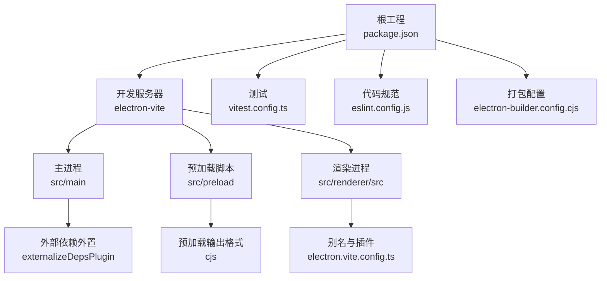
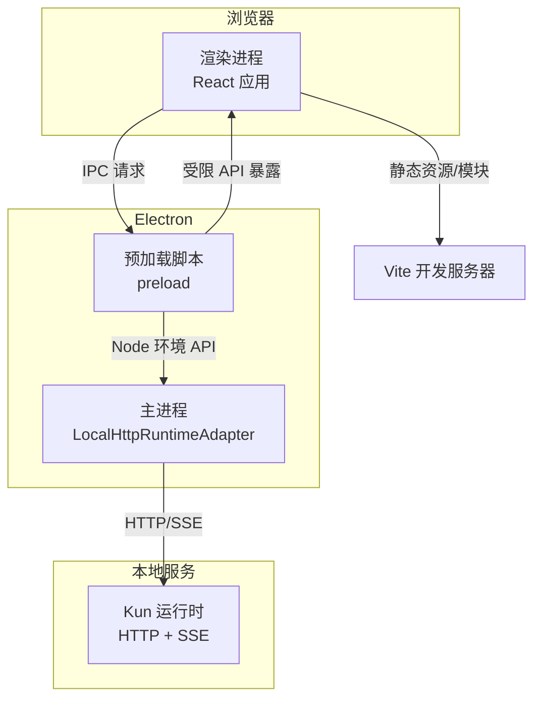
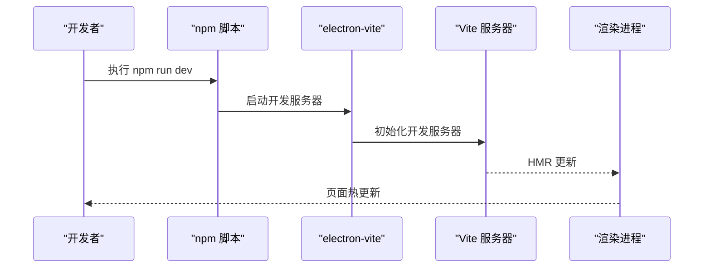
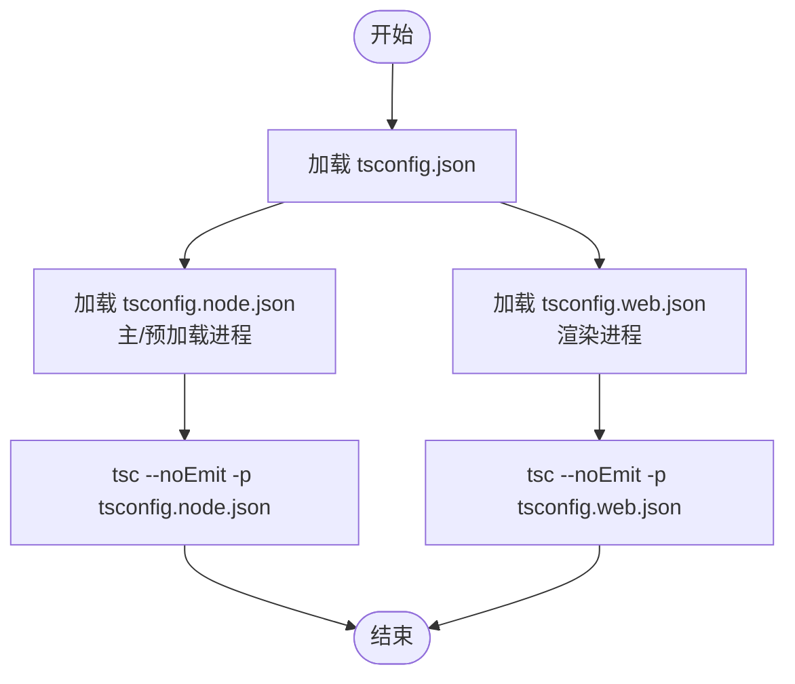
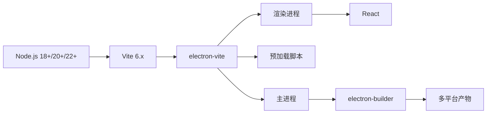

# 开发环境搭建

<cite>
**本文引用的文件**
- [package.json](file://package.json)
- [electron.vite.config.ts](file://electron.vite.config.ts)
- [tsconfig.json](file://tsconfig.json)
- [tsconfig.node.json](file://tsconfig.node.json)
- [tsconfig.web.json](file://tsconfig.web.json)
- [vitest.config.ts](file://vitest.config.ts)
- [eslint.config.js](file://eslint.config.js)
- [electron-builder.config.cjs](file://electron-builder.config.cjs)
- [README.md](file://README.md)
- [docs/DEVELOPMENT.md](file://docs/DEVELOPMENT.md)
- [src/shared/dev-preview-url.ts](file://src/shared/dev-preview-url.ts)
</cite>

## 目录
1. [简介](#简介)
2. [项目结构](#项目结构)
3. [核心组件](#核心组件)
4. [架构总览](#架构总览)
5. [详细组件分析](#详细组件分析)
6. [依赖分析](#依赖分析)
7. [性能考虑](#性能考虑)
8. [故障排查指南](#故障排查指南)
9. [结论](#结论)
10. [附录](#附录)

## 简介
本指南面向希望在本地搭建 DeepSeek GUI 开发环境的工程师，涵盖系统要求、依赖安装、开发工具配置、Vite 开发服务器启动与热重载、调试工具设置、TypeScript 与 ESLint 配置、代码格式化、常见问题排查与性能优化建议。DeepSeek GUI 采用 Electron + React + Vite 的架构，结合 electron-vite 实现主进程、预加载脚本与渲染进程的统一开发体验。

## 项目结构
- 根工程使用 npm 管理依赖与脚本，主应用位于 src/，渲染端源码位于 src/renderer/src，主/预加载进程位于 src/main 与 src/preload。
- 构建与打包通过 electron-vite 驱动，生产构建与多平台打包由 electron-builder 配合脚本完成。
- 类型检查分为 Web 与 Node 两套 tsconfig，分别约束渲染端与主/预加载进程的类型安全。

图表来源
- [package.json:1-93](file://package.json#L1-L93)
- [electron.vite.config.ts:1-38](file://electron.vite.config.ts#L1-L38)
- [vitest.config.ts:1-16](file://vitest.config.ts#L1-L16)
- [eslint.config.js:1-54](file://eslint.config.js#L1-L54)
- [electron-builder.config.cjs:1-159](file://electron-builder.config.cjs#L1-L159)

章节来源
- [package.json:1-93](file://package.json#L1-L93)
- [README.md:233-255](file://README.md#L233-L255)

## 核心组件
- 开发脚本与命令
  - dev：先构建内部 Kun 运行时，再启动 electron-vite 开发服务器。
  - build：先构建内部 Kun 运行时，再进行生产构建。
  - test/test:watch：运行单元测试。
  - lint：执行 ESLint。
  - typecheck：分别对 web 与 node 的 tsconfig 进行类型检查。
- 构建与打包
  - electron-vite：统一主/预加载/渲染三端构建与开发体验。
  - electron-builder：多平台打包与发布配置。
- 类型系统
  - tsconfig.json 作为聚合入口，分别引用 tsconfig.node.json 与 tsconfig.web.json。
  - tsconfig.node.json 限定主/预加载进程的模块解析与类型。
  - tsconfig.web.json 限定渲染端的模块解析、JSX 与别名路径。
- 测试与规范
  - vitest.config.ts：测试别名与环境配置。
  - eslint.config.js：ESLint 推荐规则与 React Hooks 规则，忽略部分目录与宽松规则。

章节来源
- [package.json:7-34](file://package.json#L7-L34)
- [tsconfig.json:1-5](file://tsconfig.json#L1-L5)
- [tsconfig.node.json:1-13](file://tsconfig.node.json#L1-L13)
- [tsconfig.web.json:1-21](file://tsconfig.web.json#L1-L21)
- [vitest.config.ts:1-16](file://vitest.config.ts#L1-L16)
- [eslint.config.js:1-54](file://eslint.config.js#L1-L54)

## 架构总览
下图展示了开发时的请求与资源流向：浏览器访问本地开发服务器，Vite 将渲染端资源按需加载；主进程通过本地 HTTP/SSE 与内部 Kun 运行时交互；预加载脚本提供受限的 IPC 能力。

图表来源
- [README.md:142-151](file://README.md#L142-L151)
- [electron.vite.config.ts:28-36](file://electron.vite.config.ts#L28-L36)

## 详细组件分析

### Vite 开发服务器与热重载
- 启动命令
  - npm run dev：先确保并构建内部 Kun 运行时，再启动 electron-vite dev。
- 配置要点
  - electron.vite.config.ts
    - 主进程：使用 externalizeDepsPlugin 外置依赖，避免打包 Electron 依赖。
    - 预加载：输出为 cjs，文件名模板为 [name].cjs。
    - 渲染进程：配置 @renderer 与 @shared 别名，启用 React 插件。
  - src/shared/dev-preview-url.ts：提供开发预览 URL 归一化与主机名校验，确保本地开发域名合法。
- 热重载机制
  - electron-vite 基于 Vite 的模块热替换（HMR）能力，对渲染端代码变更即时生效；主/预加载进程变更需重启主进程。

图表来源
- [package.json:8](file://package.json#L8)
- [electron.vite.config.ts:5-36](file://electron.vite.config.ts#L5-L36)
- [src/shared/dev-preview-url.ts:1-76](file://src/shared/dev-preview-url.ts#L1-L76)

章节来源
- [package.json:7-34](file://package.json#L7-L34)
- [electron.vite.config.ts:1-38](file://electron.vite.config.ts#L1-L38)
- [src/shared/dev-preview-url.ts:1-76](file://src/shared/dev-preview-url.ts#L1-L76)

### TypeScript 配置与类型检查
- 配置组织
  - tsconfig.json：聚合入口，引用 node 与 web 两套配置。
  - tsconfig.node.json：主/预加载进程类型约束，目标 ES2022，bundler 解析，包含 Electron 与 Vite 类型。
  - tsconfig.web.json：渲染进程类型约束，启用 JSX，配置 @renderer 与 @shared 路径别名。
- 类型检查命令
  - npm run typecheck：分别对 tsconfig.web.json 与 tsconfig.node.json 执行类型检查。

图表来源
- [tsconfig.json:1-5](file://tsconfig.json#L1-L5)
- [tsconfig.node.json:1-13](file://tsconfig.node.json#L1-L13)
- [tsconfig.web.json:1-21](file://tsconfig.web.json#L1-L21)

章节来源
- [tsconfig.json:1-5](file://tsconfig.json#L1-L5)
- [tsconfig.node.json:1-13](file://tsconfig.node.json#L1-L13)
- [tsconfig.web.json:1-21](file://tsconfig.web.json#L1-L21)
- [package.json:33](file://package.json#L33)

### ESLint 规则与代码格式化
- ESLint 配置
  - 使用 tseslint.config 组织规则，忽略 build、dist、node_modules、out、coverage 等目录。
  - 通用规则：关闭若干严格规则以降低噪音。
  - React Hooks：在渲染端启用 hooks 规则与依赖检查。
- 代码格式化
  - 仓库未提供独立的 Prettier 配置文件；建议在 IDE 中启用 ESLint 自动修复或引入 Prettier 并与 ESLint 协同。
  - 保持与现有 ESLint 规则一致，避免格式化冲突。

章节来源
- [eslint.config.js:1-54](file://eslint.config.js#L1-L54)

### 调试工具设置
- 渲染端调试
  - 使用浏览器开发者工具检查 React 组件、网络请求与 HMR 日志。
- 主进程调试
  - 在 IDE 中附加 Electron 主进程调试（例如 VS Code 的 Electron 启动配置），或通过 electron-vite 的调试参数启动。
- 预加载脚本调试
  - 在预加载脚本中设置断点，结合主进程日志定位 IPC 问题。
- 运行时调试
  - 通过设置页启用 GUI 更新与本地错误日志，观察运行时状态与能力上报。

章节来源
- [README.md:279-289](file://README.md#L279-L289)

### 测试配置
- Vitest
  - 别名与测试环境：与 electron-vite 保持一致的 @renderer 与 @shared 别名，测试环境为 node。
  - 测试范围：src/**/*.test.ts。
- 运行方式
  - npm run test：一次性运行所有测试。
  - npm run test:watch：监听文件变更并增量运行测试。

章节来源
- [vitest.config.ts:1-16](file://vitest.config.ts#L1-L16)
- [package.json:12-13](file://package.json#L12-L13)

### 打包与分发
- electron-builder 配置要点
  - asar 打包、npmRebuild、asarUnpack 与 files 白名单，确保 Kun 与依赖正确打包。
  - 多平台目标：macOS dmg/zip（arm64/x64）、Windows NSIS、Linux AppImage。
  - 发布通道与更新 URL：支持稳定与 frontier 通道，可通过环境变量配置。
- 常用命令
  - npm run dist：通用打包。
  - npm run dist:mac/win/linux：针对平台的打包命令。
  - npm run release:mac/win：在对应平台构建并上传发布资源。

章节来源
- [electron-builder.config.cjs:69-159](file://electron-builder.config.cjs#L69-L159)
- [package.json:14-29](file://package.json#L14-L29)

## 依赖分析
- Node.js 版本要求
  - Vite 6.x 要求 Node.js 18/20/22+，仓库脚本与引擎声明遵循此范围。
- 关键依赖
  - electron-vite：统一主/预加载/渲染三端开发与构建。
  - vite：开发服务器与 HMR。
  - react/react-dom：渲染端框架。
  - vitest：单元测试。
  - electron-builder：多平台打包。
- 内部依赖
  - 内部 Kun 运行时通过 npm run build:kun 与脚本 ensure-kun-install.cjs 确保可用。

图表来源
- [package.json:76-84](file://package.json#L76-L84)
- [README.md:244-248](file://README.md#L244-L248)

章节来源
- [package.json:76-84](file://package.json#L76-L84)
- [README.md:244-248](file://README.md#L244-L248)

## 性能考虑
- 依赖外置与按需打包
  - 主进程使用 externalizeDepsPlugin，避免将 Electron 等大型依赖打入包体，缩短构建时间。
- 模块解析与别名
  - electron-vite 配置 @renderer 与 @shared 别名，减少路径解析开销，提升 HMR 速度。
- 类型检查分离
  - 将渲染端与主/预加载进程类型检查分离，避免单次类型检查负担过重。
- 测试隔离
  - 测试环境为 node，避免浏览器环境带来的额外开销。

章节来源
- [electron.vite.config.ts:6-36](file://electron.vite.config.ts#L6-L36)
- [tsconfig.node.json:1-13](file://tsconfig.node.json#L1-L13)
- [tsconfig.web.json:1-21](file://tsconfig.web.json#L1-L21)
- [vitest.config.ts:1-16](file://vitest.config.ts#L1-L16)

## 故障排查指南
- 依赖安装失败或冲突
  - 使用 npm ci 或清理缓存后重装依赖。
  - 若网络受限，可配置 npm 镜像源。
- Vite 启动异常
  - 确认 Node.js 版本满足 Vite 6.x 要求。
  - 检查 electron.vite.config.ts 中的别名与插件配置是否正确。
- 热重载不生效
  - 确认渲染端代码变更被识别；主/预加载进程变更需重启主进程。
  - 检查 src/shared/dev-preview-url.ts 中的主机名与协议合法性。
- 类型检查报错
  - 分别执行 npm run typecheck，定位渲染端与主/预加载进程的类型问题。
- ESLint 报错
  - 使用 npm run lint 修复可自动修复的问题；对 React Hooks 依赖警告进行针对性修正。
- 测试失败
  - 使用 npm run test:watch 查看失败用例并逐项修复。
- 打包失败
  - 检查 electron-builder 配置中的 asar、files 白名单与 asarUnpack 列表，确保 Kun 与关键依赖被打包。

章节来源
- [README.md:250-254](file://README.md#L250-L254)
- [electron.vite.config.ts:28-36](file://electron.vite.config.ts#L28-L36)
- [src/shared/dev-preview-url.ts:1-76](file://src/shared/dev-preview-url.ts#L1-L76)
- [eslint.config.js:1-54](file://eslint.config.js#L1-L54)
- [electron-builder.config.cjs:69-159](file://electron-builder.config.cjs#L69-L159)

## 结论
通过以上配置与实践，开发者可以在本地快速搭建 DeepSeek GUI 的开发环境，利用 electron-vite 的统一开发体验与 Vite 的热重载能力高效迭代；借助完善的 TypeScript、ESLint 与 Vitest 配置保障代码质量；最后通过 electron-builder 完成多平台的生产构建与分发。

## 附录
- 快速开始
  - 克隆仓库后执行 npm install，随后 npm run dev 启动开发服务器。
- 开发流程参考
  - 参考 docs/DEVELOPMENT.md 中的分支策略与 PR 要求，确保代码质量与协作效率。

章节来源
- [README.md:233-242](file://README.md#L233-L242)
- [docs/DEVELOPMENT.md:61-77](file://docs/DEVELOPMENT.md#L61-L77)