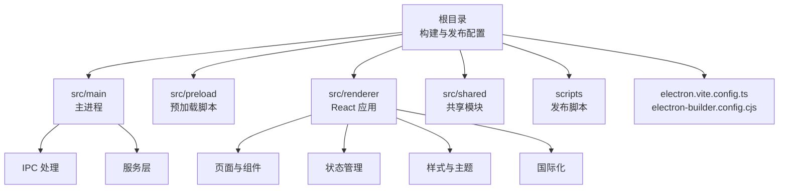
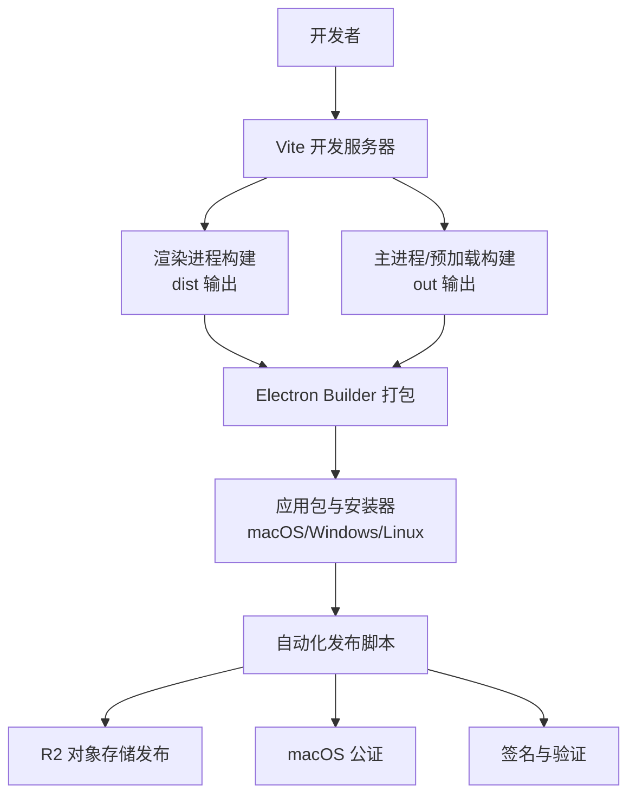
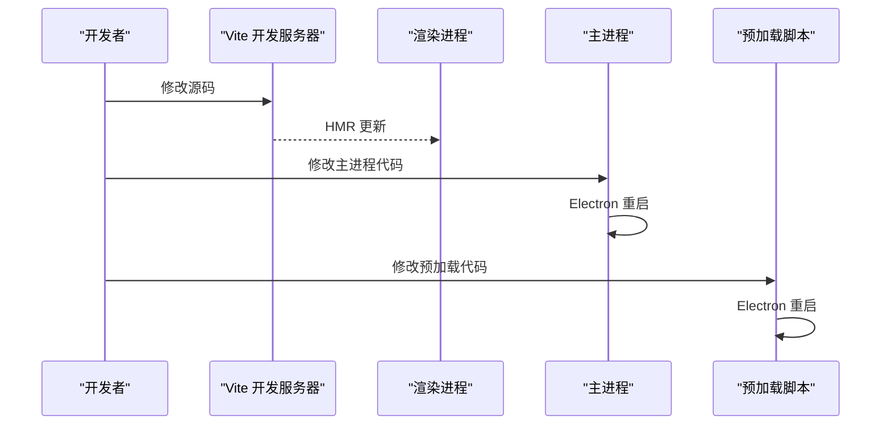
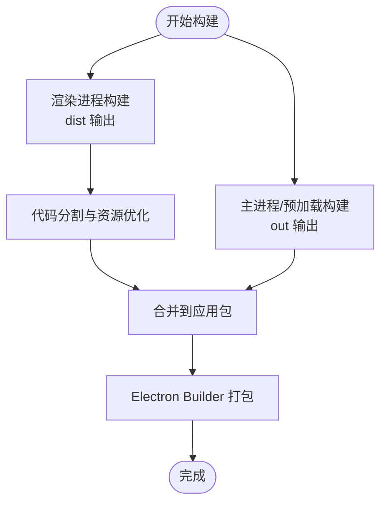
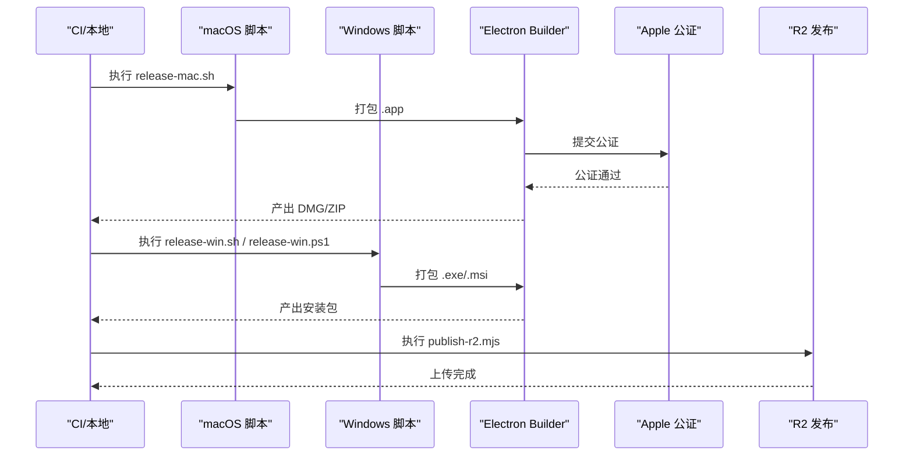
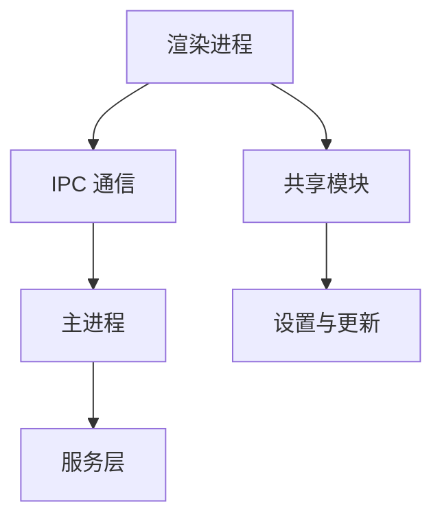

# 构建与部署

<cite>
**本文引用的文件**
- [package.json](file://package.json)
- [electron.vite.config.ts](file://electron.vite.config.ts)
- [electron-builder.config.cjs](file://electron-builder.config.cjs)
- [scripts/release.sh](file://scripts/release.sh)
- [scripts/release-mac.sh](file://scripts/release-mac.sh)
- [scripts/release-win.sh](file://scripts/release-win.sh)
- [scripts/release-win.ps1](file://scripts/release-win.ps1)
- [scripts/mac-notarize.cjs](file://scripts/mac-notarize.cjs)
- [scripts/zip-mac-app.cjs](file://scripts/zip-mac-app.cjs)
- [scripts/generate-release-notes.cjs](file://scripts/generate-release-notes.cjs)
- [scripts/publish-r2.mjs](file://scripts/publish-r2.mjs)
- [src/main/index.ts](file://src/main/index.ts)
- [src/renderer/src/main.tsx](file://src/renderer/src/main.tsx)
- [src/preload/index.ts](file://src/preload/index.ts)
- [src/shared/ds-gui-api.ts](file://src/shared/ds-gui-api.ts)
- [src/shared/app-settings.ts](file://src/shared/app-settings.ts)
- [src/shared/gui-update.ts](file://src/shared/gui-update.ts)
- [src/main/gui-updater.ts](file://src/main/gui-updater.ts)
- [src/main/kun-health.ts](file://src/main/kun-health.ts)
- [src/main/kun-process.ts](file://src/main/kun-process.ts)
- [src/main/settings-store.ts](file://src/main/settings-store.ts)
- [src/main/ipc/register-app-ipc-handlers.ts](file://src/main/ipc/register-app-ipc-handlers.ts)
- [src/main/services/workspace-service.ts](file://src/main/services/workspace-service.ts)
- [src/main/services/skill-service.ts](file://src/main/services/skill-service.ts)
- [src/main/services/write-export-service.ts](file://src/main/services/write-export-service.ts)
- [src/main/services/write-inline-completion-service.ts](file://src/main/services/write-inline-completion-service.ts)
- [src/main/services/write-retrieval-service.ts](file://src/main/services/write-retrieval-service.ts)
- [src/renderer/src/App.tsx](file://src/renderer/src/App.tsx)
- [src/renderer/src/store/chat-store.ts](file://src/renderer/src/store/chat-store.ts)
- [src/renderer/src/components/chat/FloatingComposer.tsx](file://src/renderer/src/components/chat/FloatingComposer.tsx)
- [src/renderer/src/components/chat/Sidebar.tsx](file://src/renderer/src/components/chat/Sidebar.tsx)
- [src/renderer/src/components/chat/MessageTimeline.tsx](file://src/renderer/src/components/chat/MessageTimeline.tsx)
- [src/renderer/src/components/write/WriteWorkspaceView.tsx](file://src/renderer/src/components/write/WriteWorkspaceView.tsx)
- [src/renderer/src/lib/editor-preferences.ts](file://src/renderer/src/lib/editor-preferences.ts)
- [src/renderer/src/hooks/use-model-usage.ts](file://src/renderer/src/hooks/use-model-usage.ts)
- [src/renderer/src/hooks/use-thread-usage.ts](file://src/renderer/src/hooks/use-thread-usage.ts)
- [src/renderer/src/locales/en/common.json](file://src/renderer/src/locales/en/common.json)
- [src/renderer/src/locales/zh/common.json](file://src/renderer/src/locales/zh/common.json)
- [src/renderer/src/styles/base-shell.css](file://src/renderer/src/styles/base-shell.css)
- [src/renderer/src/styles/markdown-code.css](file://src/renderer/src/styles/markdown-code.css)
- [src/renderer/src/styles/surfaces-write.css](file://src/renderer/src/styles/surfaces-write.css)
- [src/renderer/src/styles/write-editor.css](file://src/renderer/src/styles/write-editor.css)
- [src/renderer/src/vite-env.d.ts](file://src/renderer/src/vite-env.d.ts)
- [src/renderer/index.html](file://src/renderer/index.html)
- [tsconfig.json](file://tsconfig.json)
- [tsconfig.node.json](file://tsconfig.node.json)
- [tsconfig.web.json](file://tsconfig.web.json)
- [eslint.config.js](file://eslint.config.js)
- [postcss.config.js](file://postcss.config.js)
- [tailwind.config.js](file://tailwind.config.js)
- [vitest.config.ts](file://vitest.config.ts)
- [kun/package.json](file://kun/package.json)
- [kun/tsconfig.json](file://kun/tsconfig.json)
- [kun/tsconfig.build.json](file://kun/tsconfig.build.json)
- [kun/vitest.config.ts](file://kun/vitest.config.ts)
</cite>

## 目录
1. [简介](#简介)
2. [项目结构](#项目结构)
3. [核心组件](#核心组件)
4. [架构总览](#架构总览)
5. [详细组件分析](#详细组件分析)
6. [依赖分析](#依赖分析)
7. [性能考虑](#性能考虑)
8. [故障排查指南](#故障排查指南)
9. [结论](#结论)
10. [附录](#附录)

## 简介
本指南面向 DeepSeek GUI 的构建与部署，覆盖开发环境搭建、依赖安装、开发服务器启动与热重载、生产构建流程（含代码分割、资源优化、依赖打包）、多平台打包（macOS、Windows、Linux）与发布流程、自动化发布配置、版本管理与回滚策略、构建优化技巧、性能监控与部署最佳实践。文档基于仓库中的实际构建配置与脚本进行梳理，并通过图示帮助读者快速理解系统架构与构建流程。

## 项目结构
DeepSeek GUI 采用 Electron + React 技术栈，前端使用 Vite 进行开发与构建，后端主进程负责系统集成、IPC 通信与打包发布。项目主要目录与职责如下：
- 根目录：构建配置、打包配置、发布脚本、根级依赖与类型配置
- src/main：Electron 主进程入口、IPC 处理、服务层（工作区、技能、导出等）
- src/preload：预加载脚本，为渲染进程提供受限 API
- src/renderer：React 前端应用源码，包含页面组件、状态管理、样式与国际化
- src/shared：跨进程共享的 API、设置、更新逻辑等
- scripts：自动化发布脚本（macOS、Windows、通用发布与 R2 上传）
- electron.vite.config.ts：Vite 配置（区分主进程、预加载与渲染进程）
- electron-builder.config.cjs：应用打包与分发配置
- package.json：根级依赖与脚本命令

**图表来源**
- [package.json:1-200](file://package.json#L1-L200)
- [electron.vite.config.ts:1-200](file://electron.vite.config.ts#L1-L200)
- [electron-builder.config.cjs:1-200](file://electron-builder.config.cjs#L1-L200)

**章节来源**
- [package.json:1-200](file://package.json#L1-L200)
- [electron.vite.config.ts:1-200](file://electron.vite.config.ts#L1-L200)
- [electron-builder.config.cjs:1-200](file://electron-builder.config.cjs#L1-L200)

## 核心组件
- 构建与打包配置
  - Vite 配置：区分主进程、预加载与渲染进程的构建目标，支持开发服务器与热重载
  - Electron Builder：定义应用元数据、图标、签名、打包输出与多平台分发
- 开发服务器与热重载
  - Vite 开发服务器：监听源码变更，自动刷新渲染进程；主进程与预加载进程通过 Electron 重启实现热重载
- 生产构建
  - 渲染进程：产物输出到 dist 目录，包含 HTML、JS、CSS、静态资源
  - 主进程与预加载：编译到 out 目录，配合 Electron Builder 打包
- 发布与自动化
  - 跨平台发布脚本：macOS、Windows、通用发布与 R2 对象存储发布
  - Apple Notarization：macOS 安装包公证流程
  - 版本生成与发布说明：自动生成版本号与发布说明

**章节来源**
- [electron.vite.config.ts:1-200](file://electron.vite.config.ts#L1-L200)
- [electron-builder.config.cjs:1-200](file://electron-builder.config.cjs#L1-L200)
- [scripts/release.sh:1-200](file://scripts/release.sh#L1-L200)
- [scripts/release-mac.sh:1-200](file://scripts/release-mac.sh#L1-L200)
- [scripts/release-win.sh:1-200](file://scripts/release-win.sh#L1-L200)
- [scripts/release-win.ps1:1-200](file://scripts/release-win.ps1#L1-L200)
- [scripts/mac-notarize.cjs:1-200](file://scripts/mac-notarize.cjs#L1-L200)
- [scripts/zip-mac-app.cjs:1-200](file://scripts/zip-mac-app.cjs#L1-L200)
- [scripts/generate-release-notes.cjs:1-200](file://scripts/generate-release-notes.cjs#L1-L200)
- [scripts/publish-r2.mjs:1-200](file://scripts/publish-r2.mjs#L1-L200)

## 架构总览
下图展示了从源码到可执行应用与分发的总体流程，涵盖开发、构建、打包与发布的各个环节。

**图表来源**
- [electron.vite.config.ts:1-200](file://electron.vite.config.ts#L1-L200)
- [electron-builder.config.cjs:1-200](file://electron-builder.config.cjs#L1-L200)
- [scripts/release.sh:1-200](file://scripts/release.sh#L1-L200)
- [scripts/publish-r2.mjs:1-200](file://scripts/publish-r2.mjs#L1-L200)
- [scripts/mac-notarize.cjs:1-200](file://scripts/mac-notarize.cjs#L1-L200)

## 详细组件分析

### 开发环境搭建与依赖安装
- Node.js 与包管理器
  - 使用 npm（package-lock.json 已存在），确保版本兼容性
- 依赖安装
  - 根依赖：运行安装命令以安装主工程依赖
  - 子模块依赖：kun 子包独立维护其依赖与构建配置
- TypeScript 与 ESLint
  - 项目包含 tsconfig.* 与 eslint 配置，建议在编辑器中启用 TS/ESLint 支持
- 开发服务器启动
  - 使用 Vite 启动开发服务器，支持渲染进程热重载；主进程与预加载进程通过 Electron 重启实现热重载

**章节来源**
- [package.json:1-200](file://package.json#L1-L200)
- [kun/package.json:1-200](file://kun/package.json#L1-L200)
- [tsconfig.json:1-200](file://tsconfig.json#L1-L200)
- [eslint.config.js:1-200](file://eslint.config.js#L1-L200)

### 开发服务器与热重载
- Vite 配置
  - electron.vite.config.ts 中定义了主进程、预加载与渲染进程的构建入口与输出路径
  - 开发模式下，Vite 提供 HMR（热模块替换）能力，渲染进程即时刷新
- Electron 重启
  - 主进程与预加载进程修改后，Electron 将重启以应用新代码
- 入口文件
  - 主进程入口：src/main/index.ts
  - 预加载入口：src/preload/index.ts
  - 渲染进程入口：src/renderer/src/main.tsx

**图表来源**
- [electron.vite.config.ts:1-200](file://electron.vite.config.ts#L1-L200)
- [src/main/index.ts:1-200](file://src/main/index.ts#L1-L200)
- [src/preload/index.ts:1-200](file://src/preload/index.ts#L1-L200)
- [src/renderer/src/main.tsx:1-200](file://src/renderer/src/main.tsx#L1-L200)

**章节来源**
- [electron.vite.config.ts:1-200](file://electron.vite.config.ts#L1-L200)
- [src/main/index.ts:1-200](file://src/main/index.ts#L1-L200)
- [src/preload/index.ts:1-200](file://src/preload/index.ts#L1-L200)
- [src/renderer/src/main.tsx:1-200](file://src/renderer/src/main.tsx#L1-L200)

### 生产构建流程
- 渲染进程构建
  - 输出目录：dist（HTML、JS、CSS、静态资源）
  - 支持代码分割与资源优化（由 Vite 与 Tailwind/CSS 配置共同作用）
- 主进程与预加载构建
  - 输出目录：out
  - Electron Builder 将 out 与 dist 合并为最终应用包
- 构建配置
  - electron.vite.config.ts：定义三类入口与输出
  - electron-builder.config.cjs：定义应用元信息、图标、签名、输出格式与平台配置
- 代码分割与资源优化
  - 通过 Vite 的动态导入实现按需加载
  - Tailwind 与 CSS 模块化减少冗余样式
  - 图标与图片资源在构建时被优化与压缩

**图表来源**
- [electron.vite.config.ts:1-200](file://electron.vite.config.ts#L1-L200)
- [electron-builder.config.cjs:1-200](file://electron-builder.config.cjs#L1-L200)

**章节来源**
- [electron.vite.config.ts:1-200](file://electron.vite.config.ts#L1-L200)
- [electron-builder.config.cjs:1-200](file://electron-builder.config.cjs#L1-L200)

### 多平台打包与发布流程
- macOS
  - 使用 release-mac.sh 与 zip-mac-app.cjs 进行打包与归档
  - mac-notarize.cjs 执行 Apple 公证流程，确保安装安全
- Windows
  - 使用 release-win.sh 与 release-win.ps1 进行打包与发布
- Linux
  - electron-builder.config.cjs 中包含 Linux 平台配置，可直接使用
- 自动化发布
  - release.sh 统一入口，调用各平台脚本
  - publish-r2.mjs 将构建产物上传至 R2 对象存储，便于分发与回滚

**图表来源**
- [scripts/release-mac.sh:1-200](file://scripts/release-mac.sh#L1-L200)
- [scripts/zip-mac-app.cjs:1-200](file://scripts/zip-mac-app.cjs#L1-L200)
- [scripts/mac-notarize.cjs:1-200](file://scripts/mac-notarize.cjs#L1-L200)
- [scripts/release-win.sh:1-200](file://scripts/release-win.sh#L1-L200)
- [scripts/release-win.ps1:1-200](file://scripts/release-win.ps1#L1-L200)
- [scripts/release.sh:1-200](file://scripts/release.sh#L1-L200)
- [scripts/publish-r2.mjs:1-200](file://scripts/publish-r2.mjs#L1-L200)
- [electron-builder.config.cjs:1-200](file://electron-builder.config.cjs#L1-L200)

**章节来源**
- [scripts/release-mac.sh:1-200](file://scripts/release-mac.sh#L1-L200)
- [scripts/zip-mac-app.cjs:1-200](file://scripts/zip-mac-app.cjs#L1-L200)
- [scripts/mac-notarize.cjs:1-200](file://scripts/mac-notarize.cjs#L1-L200)
- [scripts/release-win.sh:1-200](file://scripts/release-win.sh#L1-L200)
- [scripts/release-win.ps1:1-200](file://scripts/release-win.ps1#L1-L200)
- [scripts/release.sh:1-200](file://scripts/release.sh#L1-L200)
- [scripts/publish-r2.mjs:1-200](file://scripts/publish-r2.mjs#L1-L200)
- [electron-builder.config.cjs:1-200](file://electron-builder.config.cjs#L1-L200)

### 自动化发布、版本管理与回滚
- 版本生成与发布说明
  - generate-release-notes.cjs 自动生成发布说明，便于追踪变更
- 发布流程
  - release.sh 作为统一入口，协调各平台脚本
  - publish-r2.mjs 将产物上传至 R2，便于快速回滚与分发
- 回滚机制
  - R2 保留历史版本，可通过版本标签或时间戳回退到指定版本
  - 安装包与 DMG/ZIP 文件同样可保留，用于本地回滚

**章节来源**
- [scripts/generate-release-notes.cjs:1-200](file://scripts/generate-release-notes.cjs#L1-L200)
- [scripts/release.sh:1-200](file://scripts/release.sh#L1-L200)
- [scripts/publish-r2.mjs:1-200](file://scripts/publish-r2.mjs#L1-L200)

### 构建优化技巧
- 代码分割
  - 使用动态导入实现按需加载，减少首屏体积
- 资源优化
  - Tailwind 与 CSS 模块化减少冗余样式
  - 图片与图标在构建时被优化与压缩
- 缓存与持久化
  - 预加载与主进程缓存策略，提升启动与运行效率
- 类型与规范
  - TypeScript 严格模式与 ESLint 规则保障代码质量与一致性

**章节来源**
- [electron.vite.config.ts:1-200](file://electron.vite.config.ts#L1-L200)
- [tailwind.config.js:1-200](file://tailwind.config.js#L1-L200)
- [postcss.config.js:1-200](file://postcss.config.js#L1-L200)
- [tsconfig.json:1-200](file://tsconfig.json#L1-L200)
- [eslint.config.js:1-200](file://eslint.config.js#L1-L200)

### 性能监控与部署最佳实践
- 性能监控
  - 使用内置计数器与遥测模块记录使用情况与缓存命中率
- 部署最佳实践
  - 使用 R2 进行对象存储分发，结合版本标签实现灰度与回滚
  - macOS 安装包必须完成公证，确保用户信任与安全
  - Windows 安装包建议启用数字签名，提升可信度

**章节来源**
- [src/shared/gui-update.ts:1-200](file://src/shared/gui-update.ts#L1-L200)
- [src/main/gui-updater.ts:1-200](file://src/main/gui-updater.ts#L1-L200)
- [src/main/kun-health.ts:1-200](file://src/main/kun-health.ts#L1-L200)
- [src/main/kun-process.ts:1-200](file://src/main/kun-process.ts#L1-L200)
- [scripts/publish-r2.mjs:1-200](file://scripts/publish-r2.mjs#L1-L200)
- [scripts/mac-notarize.cjs:1-200](file://scripts/mac-notarize.cjs#L1-L200)

## 依赖分析
- 内部模块耦合
  - 渲染进程通过 IPC 与主进程交互，主进程提供系统能力与服务
  - 共享模块（如 ds-gui-api、app-settings、gui-update）在主/渲染间传递
- 外部依赖
  - Electron、React、Vite、Tailwind、TypeScript、ESLint 等
- 潜在循环依赖
  - 通过模块拆分与接口抽象降低耦合，避免主/渲染直接互相引用

**图表来源**
- [src/main/ipc/register-app-ipc-handlers.ts:1-200](file://src/main/ipc/register-app-ipc-handlers.ts#L1-L200)
- [src/shared/ds-gui-api.ts:1-200](file://src/shared/ds-gui-api.ts#L1-L200)
- [src/shared/app-settings.ts:1-200](file://src/shared/app-settings.ts#L1-L200)
- [src/shared/gui-update.ts:1-200](file://src/shared/gui-update.ts#L1-L200)
- [src/main/services/workspace-service.ts:1-200](file://src/main/services/workspace-service.ts#L1-L200)
- [src/main/services/skill-service.ts:1-200](file://src/main/services/skill-service.ts#L1-L200)

**章节来源**
- [src/main/ipc/register-app-ipc-handlers.ts:1-200](file://src/main/ipc/register-app-ipc-handlers.ts#L1-L200)
- [src/shared/ds-gui-api.ts:1-200](file://src/shared/ds-gui-api.ts#L1-L200)
- [src/shared/app-settings.ts:1-200](file://src/shared/app-settings.ts#L1-L200)
- [src/shared/gui-update.ts:1-200](file://src/shared/gui-update.ts#L1-L200)
- [src/main/services/workspace-service.ts:1-200](file://src/main/services/workspace-service.ts#L1-L200)
- [src/main/services/skill-service.ts:1-200](file://src/main/services/skill-service.ts#L1-L200)

## 性能考虑
- 启动性能
  - 通过代码分割与懒加载减少首屏 JS 体积
- 运行性能
  - Tailwind 与 CSS 模块化减少样式计算开销
  - 预加载脚本限制权限，避免不必要的上下文切换
- 资源优化
  - 图片与图标在构建阶段优化，减少网络传输时间
- 监控与反馈
  - 使用使用量统计与缓存遥测模块，持续优化用户体验

**章节来源**
- [src/renderer/src/lib/editor-preferences.ts:1-200](file://src/renderer/src/lib/editor-preferences.ts#L1-L200)
- [src/renderer/src/hooks/use-model-usage.ts:1-200](file://src/renderer/src/hooks/use-model-usage.ts#L1-L200)
- [src/renderer/src/hooks/use-thread-usage.ts:1-200](file://src/renderer/src/hooks/use-thread-usage.ts#L1-L200)
- [src/main/kun-health.ts:1-200](file://src/main/kun-health.ts#L1-L200)

## 故障排查指南
- 开发服务器无法热重载
  - 检查 Vite 配置与入口文件是否正确
  - 确认主进程/预加载修改后 Electron 是否正常重启
- 打包失败或平台特定错误
  - 检查 electron-builder.config.cjs 的平台配置与签名设置
  - macOS 需要完成公证；Windows 需要数字签名
- 发布失败
  - 检查 R2 凭据与网络连接
  - 确认 release.sh 调用链路与各平台脚本执行权限
- 设置与更新问题
  - 检查 settings-store 与 gui-update 的状态同步

**章节来源**
- [electron.vite.config.ts:1-200](file://electron.vite.config.ts#L1-L200)
- [electron-builder.config.cjs:1-200](file://electron-builder.config.cjs#L1-L200)
- [scripts/release.sh:1-200](file://scripts/release.sh#L1-L200)
- [scripts/publish-r2.mjs:1-200](file://scripts/publish-r2.mjs#L1-L200)
- [src/main/settings-store.ts:1-200](file://src/main/settings-store.ts#L1-L200)
- [src/shared/gui-update.ts:1-200](file://src/shared/gui-update.ts#L1-L200)

## 结论
本指南基于仓库中的实际配置与脚本，系统性地梳理了 DeepSeek GUI 的构建与部署流程。通过 Vite 的开发体验、Electron Builder 的多平台打包能力、以及自动化发布脚本与 R2 分发，项目实现了高效、可重复且可回滚的交付体系。建议在团队内标准化开发与发布流程，持续优化构建性能与安全性。

## 附录
- 关键文件清单
  - 构建配置：electron.vite.config.ts、electron-builder.config.cjs
  - 发布脚本：scripts/release*.sh、scripts/*.cjs、scripts/*.mjs
  - 入口文件：src/main/index.ts、src/preload/index.ts、src/renderer/src/main.tsx
  - 共享模块：src/shared/*、src/main/services/*
- 最佳实践建议
  - 在 CI 中执行发布脚本，确保一致的构建与签名环境
  - 为每个版本打上语义化标签，便于回滚与审计
  - 对 macOS 安装包启用公证与沙箱策略，提升用户信任