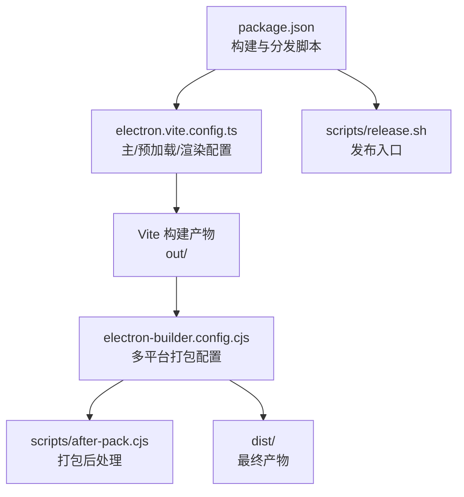
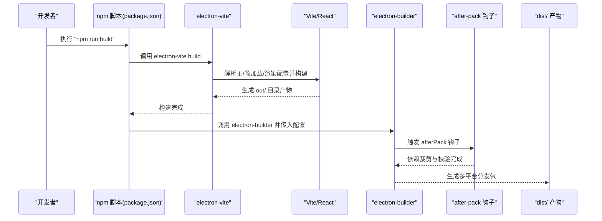
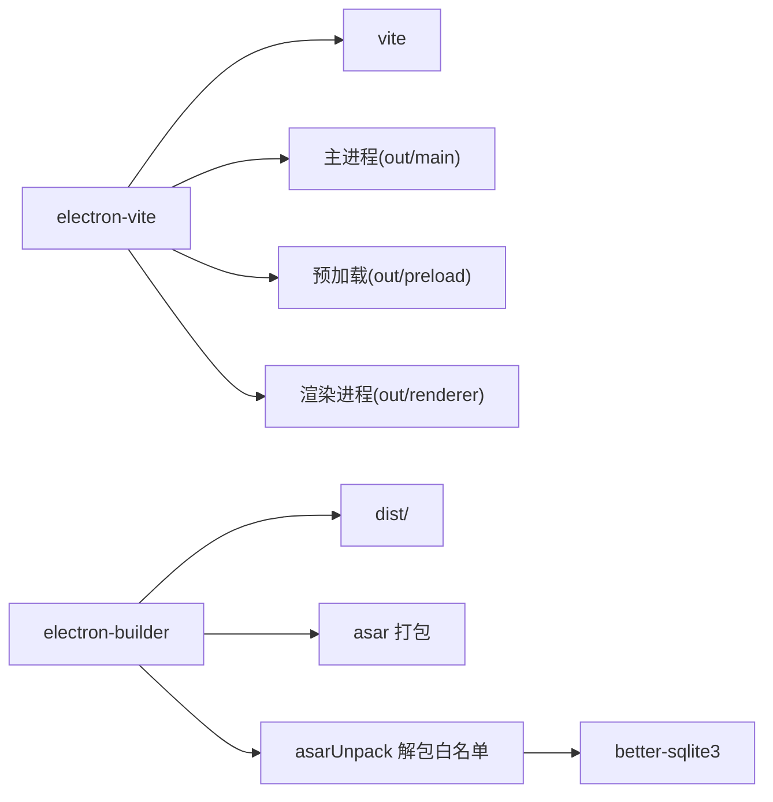

# 生产构建

<cite>
**本文引用的文件**
- [electron.vite.config.ts](file://electron.vite.config.ts)
- [package.json](file://package.json)
- [electron-builder.config.cjs](file://electron-builder.config.cjs)
- [scripts/after-pack.cjs](file://scripts/after-pack.cjs)
- [scripts/release.sh](file://scripts/release.sh)
</cite>

## 目录
1. [简介](#简介)
2. [项目结构](#项目结构)
3. [核心组件](#核心组件)
4. [架构总览](#架构总览)
5. [详细组件分析](#详细组件分析)
6. [依赖分析](#依赖分析)
7. [性能考虑](#性能考虑)
8. [故障排查指南](#故障排查指南)
9. [结论](#结论)
10. [附录](#附录)

## 简介
本文件面向生产环境，系统化阐述 DeepSeek GUI 的构建与发布流程，涵盖构建配置参数、代码分割策略、资源优化技术、Vite 构建流程、打包优化与静态资源处理、构建产物分析与性能指标监控、构建时间优化技巧、构建失败排查方法、缓存清理策略与增量构建配置，以及产物验证与质量检查流程。目标是帮助工程团队在保证质量的前提下，稳定、高效地产出跨平台可分发的应用包。

## 项目结构
本项目采用 Electron + React 的主进程/渲染进程分离架构，并通过 electron-vite 提供开发与构建支持。生产构建由以下关键要素协同完成：
- 构建入口与脚本：根目录 package.json 定义了开发、构建、打包与分发命令。
- 构建配置：electron.vite.config.ts 配置主进程、预加载与渲染进程的输入输出与插件。
- 打包配置：electron-builder.config.cjs 定义多平台打包规则、签名与上架策略。
- 后处理钩子：scripts/after-pack.cjs 在打包完成后进行依赖裁剪与校验。
- 发布脚本：scripts/release.sh 聚合 macOS 发布流程。

图表来源
- [package.json:7-34](file://package.json#L7-L34)
- [electron.vite.config.ts:5-37](file://electron.vite.config.ts#L5-L37)
- [electron-builder.config.cjs:69-158](file://electron-builder.config.cjs#L69-L158)
- [scripts/after-pack.cjs:115-119](file://scripts/after-pack.cjs#L115-L119)

章节来源
- [package.json:7-34](file://package.json#L7-L34)
- [electron.vite.config.ts:5-37](file://electron.vite.config.ts#L5-L37)

## 核心组件
- 构建脚本与命令
  - 开发模式：先构建内部子模块再启动开发服务器。
  - 生产构建：先确保内部子模块已构建，再执行生产构建。
  - 分发打包：统一调用 electron-builder 并传入配置文件。
  - 平台特定分发：提供 macOS、Windows、Linux 的便捷脚本与参数组合。
- 构建配置
  - 主进程：定义多个入口（如主入口与 MCP 调度节点入口），使用外部化依赖插件减少打包体积。
  - 预加载：设置 CommonJS 输出格式与命名规则，便于安全注入。
  - 渲染进程：启用 React 插件与路径别名，提升开发体验与模块解析效率。
- 打包配置
  - asar 打包与 asarUnpack 白名单，确保原生模块与运行时资源正确解包。
  - 多平台目标：macOS（dmg/zip 双架构）、Windows（NSIS）、Linux（AppImage）。
  - 更新通道与 R2 发布地址：支持稳定与前沿通道，自定义发布前缀与基础 URL。
  - 签名与公证：macOS 支持开发者 ID 签名与脚本驱动的公证流程。
- 打包后处理
  - 对嵌入的 Kun 运行时进行依赖裁剪，移除开发依赖并保留必要运行时文件。
  - 校验关键运行时文件是否存在，避免缺失导致运行时错误。
  - 在未启用正式签名时，对 macOS 应用执行临时签名以满足 Gatekeeper 要求。

章节来源
- [package.json:7-34](file://package.json#L7-L34)
- [electron.vite.config.ts:5-37](file://electron.vite.config.ts#L5-L37)
- [electron-builder.config.cjs:69-158](file://electron-builder.config.cjs#L69-L158)
- [scripts/after-pack.cjs:49-86](file://scripts/after-pack.cjs#L49-L86)

## 架构总览
下图展示从源码到最终分发产物的端到端流程，包括 Vite 构建、electron-builder 打包与后处理阶段。

图表来源
- [package.json:7-14](file://package.json#L7-L14)
- [electron.vite.config.ts:5-37](file://electron.vite.config.ts#L5-L37)
- [electron-builder.config.cjs:69-158](file://electron-builder.config.cjs#L69-L158)
- [scripts/after-pack.cjs:115-119](file://scripts/after-pack.cjs#L115-L119)

## 详细组件分析

### Vite 构建配置与代码分割策略
- 主进程构建
  - 多入口：包含主应用入口与 MCP 调度节点入口，便于按需加载与独立调试。
  - 外部化依赖：通过 externalizeDepsPlugin 将第三方依赖排除在打包之外，显著降低体积与构建时间。
- 预加载构建
  - CommonJS 输出：确保与主进程安全通信的预加载脚本符合 CJS 规范。
  - 命名规则：固定输出文件名后缀，便于后续注入与定位。
- 渲染进程构建
  - React 插件：启用 JSX 与热更新能力，提升开发效率。
  - 路径别名：为渲染侧与共享层提供清晰的模块解析路径，降低相对路径复杂度。
- 代码分割建议
  - 按路由或功能模块拆分渲染侧代码，结合动态导入实现懒加载。
  - 将不常变更的第三方库放入单独 chunk，提升浏览器缓存命中率。
  - 对主进程入口进行拆分，避免单入口过大影响冷启动。

章节来源
- [electron.vite.config.ts:5-37](file://electron.vite.config.ts#L5-L37)

### 打包优化与静态资源处理
- asar 打包与解包白名单
  - asar：启用应用包压缩，提升分发与安装效率。
  - asarUnpack：对原生模块（如 better-sqlite3）与运行时必需文件进行解包，确保 ABI 兼容与运行时可用性。
- 文件过滤
  - 排除源码映射、类型声明与无关文档，减小包体并提升安全性。
- 平台目标
  - macOS：同时产出 dmg 与 zip，双架构（arm64/x64）覆盖更广硬件生态。
  - Windows：NSIS 安装器，支持更改安装目录与管理员权限提示。
  - Linux：AppImage，便于分发与免安装运行。

章节来源
- [electron-builder.config.cjs:72-99](file://electron-builder.config.cjs#L72-L99)
- [electron-builder.config.cjs:109-149](file://electron-builder.config.cjs#L109-L149)

### 构建产物分析与性能指标监控
- 产物结构
  - out/：Vite 构建输出，包含主进程、预加载与渲染进程产物。
  - dist/：electron-builder 产出的多平台安装包与元数据。
- 体积与缓存策略
  - 通过外部化依赖与 asar 解包白名单控制体积。
  - 使用 CDN 或对象存储（如 R2）分发更新与资源，结合版本前缀与通道管理。
- 性能指标建议
  - 记录构建时间、产物体积、首次启动时间与内存占用。
  - 对关键页面与路由进行首屏加载耗时统计，结合浏览器性能面板与日志分析。

章节来源
- [electron-builder.config.cjs:82-89](file://electron-builder.config.cjs#L82-L89)
- [electron-builder.config.cjs:52-55](file://electron-builder.config.cjs#L52-L55)

### 构建时间优化技巧
- 并行构建：利用多核 CPU 并行编译不同入口与平台。
- 缓存策略：启用 Vite 与 TypeScript 编译缓存，减少重复计算。
- 依赖外部化：将稳定第三方库外部化，避免重复打包。
- 增量构建：仅对变更模块重新构建，结合 CI 的缓存与增量上传。
- 选择性打包：仅包含运行所需文件，剔除测试与文档。

章节来源
- [electron.vite.config.ts:7-8](file://electron.vite.config.ts#L7-L8)
- [electron-builder.config.cjs:72-80](file://electron-builder.config.cjs#L72-L80)

### 构建失败排查方法
- 常见问题定位
  - 依赖缺失：确认 asarUnpack 中原生模块与运行时文件存在。
  - 签名与公证：检查 macOS 签名凭据与 Apple API 密钥配置。
  - 平台工具链：确保 NSIS/AppImage 工具链可用。
- 快速复现
  - 使用最小化命令复现：先执行构建，再执行打包。
  - 查看 after-pack 阶段日志，定位裁剪与校验失败点。
- 回滚与降级
  - 切换到上一稳定版本的 electron-builder 版本或配置分支。
  - 临时关闭 asar 或调整解包白名单以隔离问题。

章节来源
- [scripts/after-pack.cjs:33-37](file://scripts/after-pack.cjs#L33-L37)
- [scripts/after-pack.cjs:68-75](file://scripts/after-pack.cjs#L68-L75)
- [electron-builder.config.cjs:33-44](file://electron-builder.config.cjs#L33-L44)

### 缓存清理策略与增量构建配置
- 缓存清理
  - 清理 Vite 编译缓存与依赖缓存，避免陈旧缓存导致的构建异常。
  - 清理 node_modules/.vite 与 TypeScript 编译输出目录。
- 增量构建
  - 在 CI 中启用增量构建与缓存，仅对变更文件重新打包。
  - 对主进程与渲染进程分别进行增量构建，缩短整体构建时间。

章节来源
- [package.json:7-14](file://package.json#L7-L14)

### 产物验证与质量检查流程
- 自动化校验
  - after-pack 钩子中对关键运行时文件进行断言，确保打包完整性。
  - 校验原生模块存在性，避免运行时崩溃。
- 人工验收
  - 多平台自测：在目标平台上启动应用，验证核心功能与界面。
  - 更新通道验证：确认更新 URL 与通道配置正确，应用可正常检查更新。
- 质量门禁
  - 引入 Lint 与单元测试作为构建前置条件。
  - 对产物进行体积与启动时间阈值检查，超限则阻断发布。

章节来源
- [scripts/after-pack.cjs:77-86](file://scripts/after-pack.cjs#L77-L86)
- [electron-builder.config.cjs:101-106](file://electron-builder.config.cjs#L101-L106)

## 依赖分析
- 构建工具链
  - electron-vite：统一主/预加载/渲染三类进程的构建与开发体验。
  - vite：现代化前端构建引擎，配合 React 插件提升开发效率。
  - electron-builder：多平台打包与分发，支持签名与公证。
- 运行时与原生模块
  - better-sqlite3：需要解包以适配 Electron ABI。
  - 其他原生依赖：通过 asarUnpack 白名单纳入解包范围。
- 第三方 SDK 与 UI 组件
  - React、Codemirror、Shiki 等：通过外部化依赖减少打包体积。

图表来源
- [electron.vite.config.ts:5-37](file://electron.vite.config.ts#L5-L37)
- [electron-builder.config.cjs:72-80](file://electron-builder.config.cjs#L72-L80)
- [electron-builder.config.cjs:82-99](file://electron-builder.config.cjs#L82-L99)

章节来源
- [electron.vite.config.ts:5-37](file://electron.vite.config.ts#L5-L37)
- [electron-builder.config.cjs:72-99](file://electron-builder.config.cjs#L72-L99)

## 性能考虑
- 构建性能
  - 外部化依赖与 asar 解包白名单减少打包体积与时间。
  - 多平台并行构建与缓存复用缩短 CI 时间。
- 运行性能
  - 代码分割与懒加载降低首屏负载。
  - CDN 分发与版本化前缀提升资源加载速度与缓存命中率。
- 监控与优化
  - 建立构建时间与产物体积基线，持续优化。
  - 对关键页面进行首屏加载耗时与内存占用监控。

## 故障排查指南
- 构建阶段
  - 检查 electron-vite 配置是否正确解析入口与别名。
  - 确认 React 插件与 TypeScript 配置兼容。
- 打包阶段
  - 校验 asar 与 asarUnpack 配置，确保原生模块与运行时文件完整。
  - 检查平台目标与安装器参数（如 NSIS 选项）。
- 后处理阶段
  - 关注 after-pack 日志，定位裁剪与校验失败原因。
  - 若出现签名问题，检查 macOS 凭据与公证配置。
- 发布阶段
  - 校验 R2 发布 URL 与通道配置，确保更新可用。
  - 使用 release.sh 脚本统一入口，避免参数遗漏。

章节来源
- [electron.vite.config.ts:5-37](file://electron.vite.config.ts#L5-L37)
- [electron-builder.config.cjs:69-158](file://electron-builder.config.cjs#L69-L158)
- [scripts/after-pack.cjs:115-119](file://scripts/after-pack.cjs#L115-L119)
- [scripts/release.sh:1-26](file://scripts/release.sh#L1-L26)

## 结论
本生产构建体系通过 electron-vite 与 electron-builder 的协同，实现了跨平台、可扩展且可验证的构建与分发流程。借助外部化依赖、asar 解包白名单、平台化打包与后处理钩子，既能保证运行时稳定性，又能有效控制产物体积与构建时间。建议在 CI 中引入缓存与增量构建，并建立完善的产物校验与性能监控机制，持续提升交付质量与效率。

## 附录
- 发布脚本入口
  - macOS 发布：通过 scripts/release.sh 统一入口，支持 R2 与签名配置。
- 配置要点速查
  - 更新通道与 R2 基础 URL：通过环境变量控制。
  - asar 与 asarUnpack：根据原生模块与运行时需求调整。
  - 平台目标：按需开启 dmg/zip、NSIS、AppImage 等目标。

章节来源
- [scripts/release.sh:1-26](file://scripts/release.sh#L1-L26)
- [electron-builder.config.cjs:46-55](file://electron-builder.config.cjs#L46-L55)
- [electron-builder.config.cjs:72-99](file://electron-builder.config.cjs#L72-L99)
- [electron-builder.config.cjs:109-149](file://electron-builder.config.cjs#L109-L149)