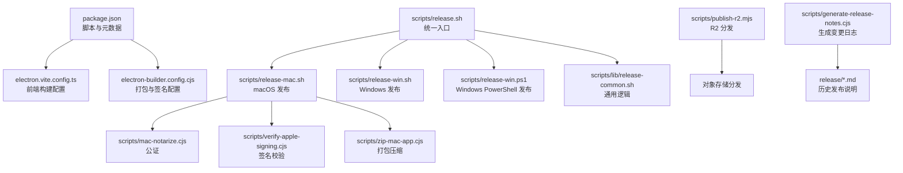
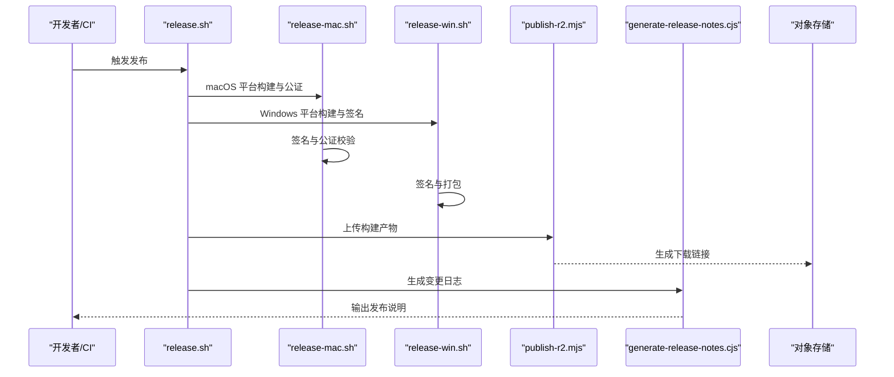
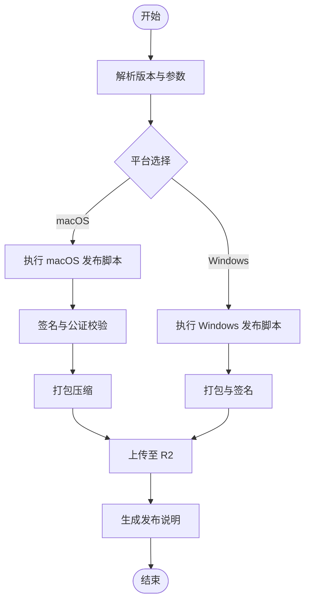
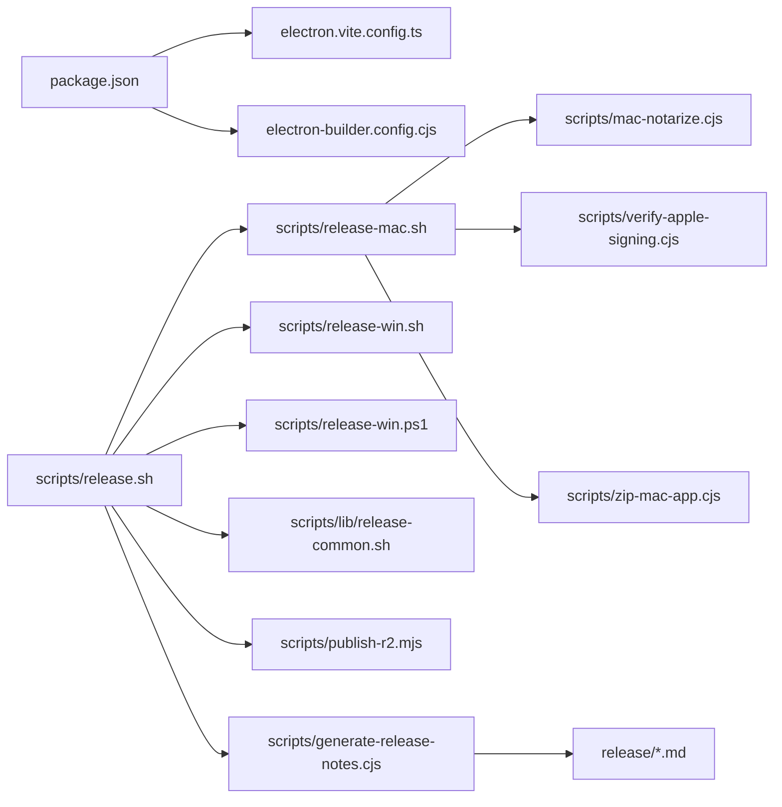

# 自动化发布

<cite>
**本文引用的文件**
- [package.json](file://package.json)
- [electron.vite.config.ts](file://electron.vite.config.ts)
- [electron-builder.config.cjs](file://electron-builder.config.cjs)
- [scripts/release.sh](file://scripts/release.sh)
- [scripts/release-mac.sh](file://scripts/release-mac.sh)
- [scripts/release-all-mac.sh](file://scripts/release-all-mac.sh)
- [scripts/release-win.sh](file://scripts/release-win.sh)
- [scripts/release-win.ps1](file://scripts/release-win.ps1)
- [scripts/lib/release-common.sh](file://scripts/lib/release-common.sh)
- [scripts/publish-r2.mjs](file://scripts/publish-r2.mjs)
- [scripts/generate-release-notes.cjs](file://scripts/generate-release-notes.cjs)
- [scripts/mac-notarize.cjs](file://scripts/mac-notarize.cjs)
- [scripts/verify-apple-signing.cjs](file://scripts/verify-apple-signing.cjs)
- [scripts/zip-mac-app.cjs](file://scripts/zip-mac-app.cjs)
- [scripts/after-pack.cjs](file://scripts/after-pack.cjs)
- [scripts/ensure-kun-install.cjs](file://scripts/ensure-kun-install.cjs)
- [scripts/generate-mac-latest.cjs](file://scripts/generate-mac-latest.cjs)
- [scripts/mac-unquarantine.sh](file://scripts/mac-unquarantine.sh)
- [release/release-v0.2.0.md](file://release/release-v0.2.0.md)
- [release/release-v0.2.1.md](file://release/release-v0.2.1.md)
- [release/release-v0.2.2.md](file://release/release-v0.2.2.md)
</cite>

## 目录
1. [简介](#简介)
2. [项目结构](#项目结构)
3. [核心组件](#核心组件)
4. [架构总览](#架构总览)
5. [详细组件分析](#详细组件分析)
6. [依赖关系分析](#依赖关系分析)
7. [性能考虑](#性能考虑)
8. [故障排除指南](#故障排除指南)
9. [结论](#结论)
10. [附录](#附录)

## 简介
本文件面向 DeepSeek GUI 的自动化发布流程，系统性阐述版本管理策略、发布脚本配置、自动化测试集成、发布前检查清单与质量门禁、回滚机制、GitHub Actions 配置建议、发布标签管理与变更日志生成、发布监控与错误处理、通知机制以及发布后验证与用户反馈收集。内容基于仓库中现有的发布脚本、构建配置与历史发布记录进行归纳总结，并提供可操作的实施建议。

## 项目结构
本项目采用 Electron + Vite 的桌面应用架构，发布流程围绕以下关键要素组织：
- 构建与打包：通过 electron-vite 和 electron-builder 进行多平台打包与签名。
- 发布脚本：按平台拆分（macOS、Windows），统一入口脚本协调通用逻辑。
- 资源发布：支持 R2 对象存储分发与 macOS 原生公证流程。
- 变更日志：自动生成各版本发布说明。

**图表来源**
- [package.json](file://package.json)
- [electron.vite.config.ts](file://electron.vite.config.ts)
- [electron-builder.config.cjs](file://electron-builder.config.cjs)
- [scripts/release.sh](file://scripts/release.sh)
- [scripts/release-mac.sh](file://scripts/release-mac.sh)
- [scripts/release-win.sh](file://scripts/release-win.sh)
- [scripts/release-win.ps1](file://scripts/release-win.ps1)
- [scripts/lib/release-common.sh](file://scripts/lib/release-common.sh)
- [scripts/mac-notarize.cjs](file://scripts/mac-notarize.cjs)
- [scripts/verify-apple-signing.cjs](file://scripts/verify-apple-signing.cjs)
- [scripts/zip-mac-app.cjs](file://scripts/zip-mac-app.cjs)
- [scripts/publish-r2.mjs](file://scripts/publish-r2.mjs)
- [scripts/generate-release-notes.cjs](file://scripts/generate-release-notes.cjs)
- [release/release-v0.2.0.md](file://release/release-v0.2.0.md)

**章节来源**
- [package.json](file://package.json)
- [electron.vite.config.ts](file://electron.vite.config.ts)
- [electron-builder.config.cjs](file://electron-builder.config.cjs)

## 核心组件
- 统一发布入口脚本：协调平台差异，执行通用前置检查与环境准备。
- 平台专用脚本：分别处理 macOS 与 Windows 的打包、签名、公证与分发。
- 通用库脚本：封装版本号解析、环境变量加载、错误处理等公共逻辑。
- 打包与签名配置：定义构建产物、目标平台、签名证书与权限。
- 对象存储分发：将构建产物上传至 R2 并生成下载链接。
- 变更日志生成：根据提交信息生成版本发布说明。
- 历史发布记录：维护各版本的发布说明，便于追溯与对比。

**章节来源**
- [scripts/release.sh](file://scripts/release.sh)
- [scripts/release-mac.sh](file://scripts/release-mac.sh)
- [scripts/release-win.sh](file://scripts/release-win.sh)
- [scripts/release-win.ps1](file://scripts/release-win.ps1)
- [scripts/lib/release-common.sh](file://scripts/lib/release-common.sh)
- [electron-builder.config.cjs](file://electron-builder.config.cjs)
- [scripts/publish-r2.mjs](file://scripts/publish-r2.mjs)
- [scripts/generate-release-notes.cjs](file://scripts/generate-release-notes.cjs)
- [release/release-v0.2.0.md](file://release/release-v0.2.0.md)

## 架构总览
下图展示从触发到分发的完整发布链路，包括本地构建、平台特定处理、公证与签名验证、对象存储分发以及发布说明生成。

**图表来源**
- [scripts/release.sh](file://scripts/release.sh)
- [scripts/release-mac.sh](file://scripts/release-mac.sh)
- [scripts/release-win.sh](file://scripts/release-win.sh)
- [scripts/publish-r2.mjs](file://scripts/publish-r2.mjs)
- [scripts/generate-release-notes.cjs](file://scripts/generate-release-notes.cjs)

## 详细组件分析

### 版本管理策略
- 版本号来源：统一在项目元数据中声明，构建与打包配置读取该版本号用于产物命名与标识。
- 版本语义：遵循语义化版本规范，主/次/修订号递增规则由团队约定并在发布脚本中体现。
- 标签管理：建议在 Git 中以 v<version> 形式创建轻量标签，配合发布说明文件归档。

实践要点
- 在统一入口脚本中解析版本号并传递给打包工具。
- 将版本号注入构建产物的元数据（如应用内版本显示）。
- 发布说明文件按版本命名并归档，便于回溯。

**章节来源**
- [package.json](file://package.json)
- [electron-builder.config.cjs](file://electron-builder.config.cjs)
- [release/release-v0.2.0.md](file://release/release-v0.2.0.md)

### 发布脚本配置
- 统一入口：release.sh 负责参数解析、环境准备与平台分发。
- macOS 流程：release-mac.sh 调用签名、公证、打包与压缩脚本，确保符合 Apple 分发要求。
- Windows 流程：release-win.sh 与 release-win.ps1 提供 Bash 与 PowerShell 两种实现，覆盖不同 CI 环境。
- 通用库：release-common.sh 提供版本解析、环境变量加载、错误处理等共享逻辑。

**图表来源**
- [scripts/release.sh](file://scripts/release.sh)
- [scripts/release-mac.sh](file://scripts/release-mac.sh)
- [scripts/release-win.sh](file://scripts/release-win.sh)
- [scripts/release-win.ps1](file://scripts/release-win.ps1)
- [scripts/lib/release-common.sh](file://scripts/lib/release-common.sh)

**章节来源**
- [scripts/release.sh](file://scripts/release.sh)
- [scripts/release-mac.sh](file://scripts/release-mac.sh)
- [scripts/release-win.sh](file://scripts/release-win.sh)
- [scripts/release-win.ps1](file://scripts/release-win.ps1)
- [scripts/lib/release-common.sh](file://scripts/lib/release-common.sh)

### 自动化测试集成
- 单元测试：项目包含大量测试文件，建议在发布前执行测试，失败则阻断发布。
- 集成测试：对关键发布流程（签名、公证、打包）进行端到端验证。
- 质量门禁：在 CI 中设置测试通过率阈值与安全扫描，未达标禁止进入发布阶段。

最佳实践
- 在统一入口脚本中加入测试执行步骤。
- 将测试报告与覆盖率指标作为发布制品的一部分存档。
- 对关键平台（macOS/Windows）分别运行平台特定测试。

**章节来源**
- [scripts/release.sh](file://scripts/release.sh)

### 发布前检查清单与质量门禁
- 代码审查与合并：确保 PR 已通过审查与 CI。
- 版本一致性：确认版本号在所有配置与脚本中一致。
- 环境变量：检查签名证书、Apple ID、R2 凭据等敏感信息是否正确配置。
- 产物完整性：验证构建产物包含必要文件且无缺失。
- 公证与签名：macOS 必须完成公证并通过签名校验。
- 回滚准备：保留上一版本制品与发布说明，以便快速回滚。

**章节来源**
- [scripts/release-mac.sh](file://scripts/release-mac.sh)
- [scripts/verify-apple-signing.cjs](file://scripts/verify-apple-signing.cjs)
- [scripts/lib/release-common.sh](file://scripts/lib/release-common.sh)

### 回滚机制
- 制品保留：发布前备份上一版本的安装包与发布说明。
- 标签回退：若问题紧急，可删除错误标签并重新打回滚标签。
- 用户提示：在应用内或公告中提示用户回滚到稳定版本。
- 快速修复：针对已知问题发布热修复版本并替换分发链接。

**章节来源**
- [release/release-v0.2.0.md](file://release/release-v0.2.0.md)
- [release/release-v0.2.1.md](file://release/release-v0.2.1.md)
- [release/release-v0.2.2.md](file://release/release-v0.2.2.md)

### GitHub Actions 配置建议
- 触发条件：在创建标签或推送分支时触发工作流。
- 步骤分解：检出代码 → 安装依赖 → 运行测试 → 构建与打包 → 签名与公证（macOS）→ 上传制品 → 生成发布说明 → 创建/更新发布。
- 安全密钥：将签名证书、Apple ID、R2 凭据等作为加密机密配置。
- 缓存优化：启用 npm/yarn 缓存减少重复安装时间。
- 多平台并行：macOS 与 Windows 构建并行执行以缩短总时长。

[本节为概念性建议，不直接分析具体文件，故不附加“章节来源”]

### 发布标签管理与变更日志生成
- 标签命名：使用 v<版本号>，与构建版本保持一致。
- 变更日志：通过 generate-release-notes.cjs 基于提交信息生成，结合 release 目录中的历史说明文件进行维护。
- 发布说明：将生成的说明与制品一同上传至发布页面或对象存储。

**章节来源**
- [scripts/generate-release-notes.cjs](file://scripts/generate-release-notes.cjs)
- [release/release-v0.2.0.md](file://release/release-v0.2.0.md)
- [release/release-v0.2.1.md](file://release/release-v0.2.1.md)
- [release/release-v0.2.2.md](file://release/release-v0.2.2.md)

### 发布监控、错误处理与通知机制
- 监控指标：构建时长、测试通过率、签名/公证成功率、分发成功率。
- 错误处理：在脚本中捕获异常并输出详细日志；对可恢复错误提供重试机制。
- 通知渠道：在 CI 中集成邮件、IM 或工单系统，在失败时自动通知责任人。

**章节来源**
- [scripts/lib/release-common.sh](file://scripts/lib/release-common.sh)
- [scripts/release.sh](file://scripts/release.sh)

### 发布后验证与用户反馈收集
- 自动验证：启动安装包进行基本功能验证（如启动、基本对话）。
- 用户反馈：在应用内或官网提供反馈入口，收集崩溃日志与使用体验。
- 数据分析：统计安装量、崩溃率与用户留存，持续改进发布质量。

[本节为概念性建议，不直接分析具体文件，故不附加“章节来源”]

## 依赖关系分析
发布流程涉及多个脚本与配置文件之间的耦合关系，下图展示主要依赖：

**图表来源**
- [package.json](file://package.json)
- [electron.vite.config.ts](file://electron.vite.config.ts)
- [electron-builder.config.cjs](file://electron-builder.config.cjs)
- [scripts/release.sh](file://scripts/release.sh)
- [scripts/release-mac.sh](file://scripts/release-mac.sh)
- [scripts/release-win.sh](file://scripts/release-win.sh)
- [scripts/release-win.ps1](file://scripts/release-win.ps1)
- [scripts/lib/release-common.sh](file://scripts/lib/release-common.sh)
- [scripts/mac-notarize.cjs](file://scripts/mac-notarize.cjs)
- [scripts/verify-apple-signing.cjs](file://scripts/verify-apple-signing.cjs)
- [scripts/zip-mac-app.cjs](file://scripts/zip-mac-app.cjs)
- [scripts/publish-r2.mjs](file://scripts/publish-r2.mjs)
- [scripts/generate-release-notes.cjs](file://scripts/generate-release-notes.cjs)
- [release/release-v0.2.0.md](file://release/release-v0.2.0.md)

**章节来源**
- [package.json](file://package.json)
- [electron.vite.config.ts](file://electron.vite.config.ts)
- [electron-builder.config.cjs](file://electron-builder.config.cjs)
- [scripts/release.sh](file://scripts/release.sh)

## 性能考虑
- 并行构建：macOS 与 Windows 构建并行执行，缩短整体耗时。
- 缓存策略：复用依赖缓存与构建缓存，减少重复计算。
- 产物压缩：对 macOS 应用进行压缩以降低分发体积。
- 分发优化：使用 CDN 或对象存储直链，提升下载速度。

[本节提供一般性指导，不直接分析具体文件，故不附加“章节来源”]

## 故障排除指南
常见问题与处理
- 签名失败：检查证书与权限配置，确保 Apple ID 与团队权限正确。
- 公证失败：确认公证凭据有效，网络可达，重试或更换公证服务节点。
- 打包失败：检查构建产物完整性与依赖安装状态。
- 分发失败：核对 R2 凭据与桶权限，确认网络连通性。
- 版本不一致：统一在入口脚本中解析版本号并传递给各子流程。

**章节来源**
- [scripts/release-mac.sh](file://scripts/release-mac.sh)
- [scripts/verify-apple-signing.cjs](file://scripts/verify-apple-signing.cjs)
- [scripts/mac-notarize.cjs](file://scripts/mac-notarize.cjs)
- [scripts/publish-r2.mjs](file://scripts/publish-r2.mjs)

## 结论
本发布体系以统一入口脚本为核心，结合平台专用脚本与通用库，实现了跨平台的自动化打包、签名、公证与分发。通过引入测试门禁、发布说明生成与回滚机制，能够有效保障发布质量与可追溯性。建议在 CI 中进一步完善监控与通知，持续优化构建与分发性能，并建立完善的用户反馈闭环。

## 附录
- 历史发布说明可用于评估回归风险与用户影响范围。
- 建议将发布流程文档化并与团队共享，确保新成员快速上手。

**章节来源**
- [release/release-v0.2.0.md](file://release/release-v0.2.0.md)
- [release/release-v0.2.1.md](file://release/release-v0.2.1.md)
- [release/release-v0.2.2.md](file://release/release-v0.2.2.md)