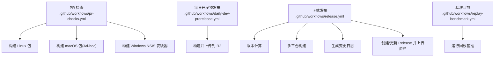
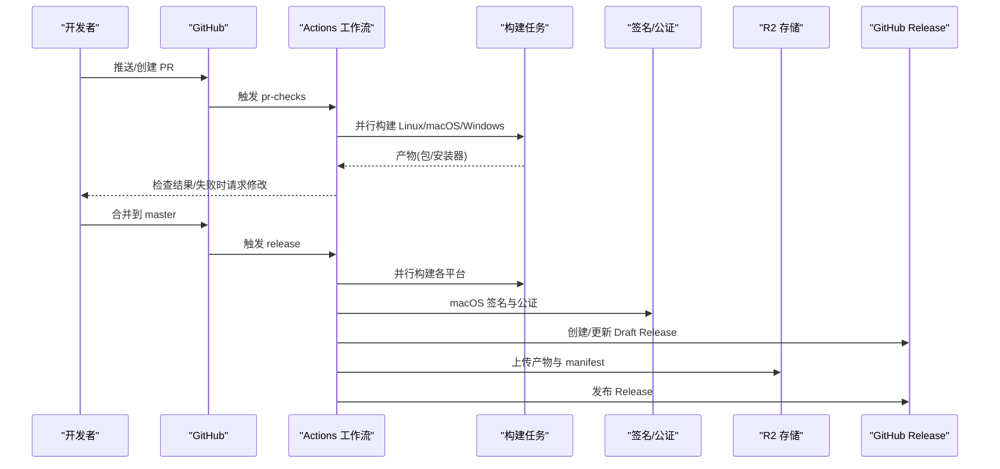
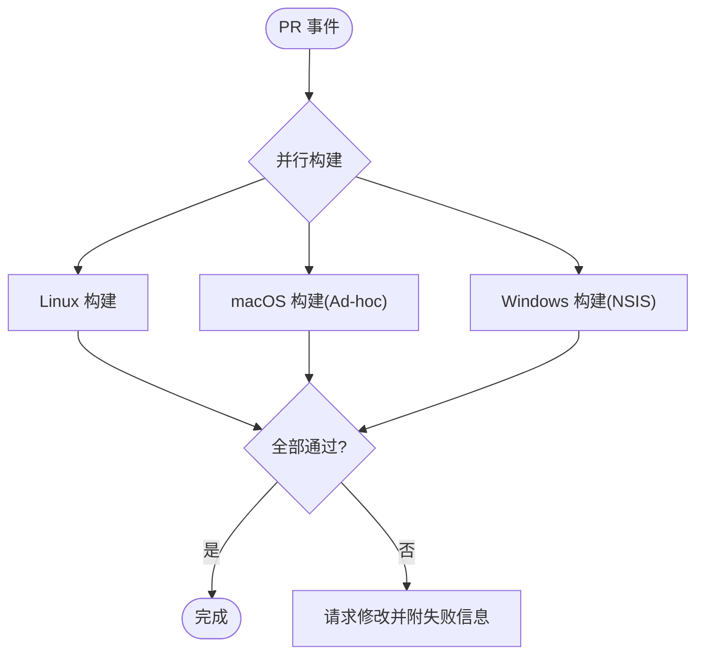
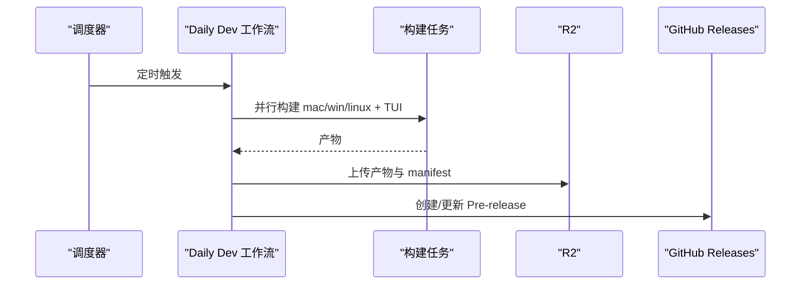
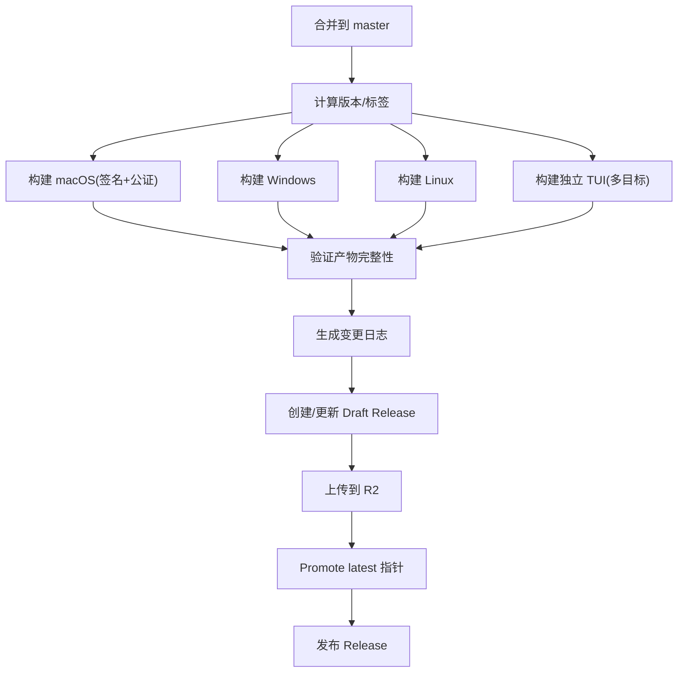
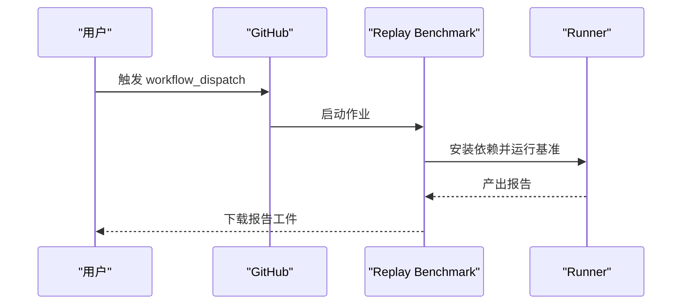
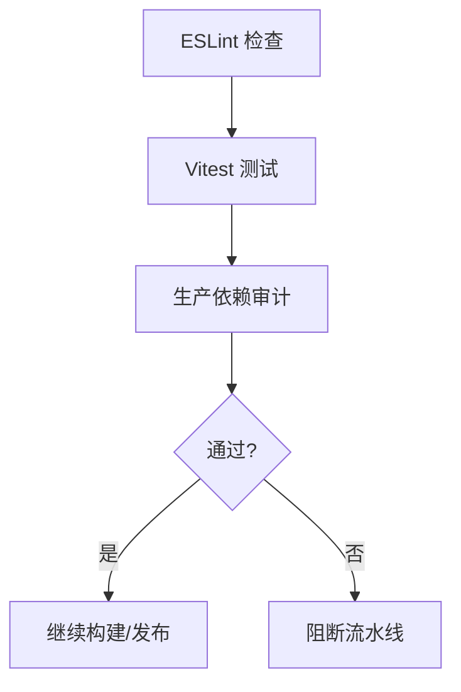
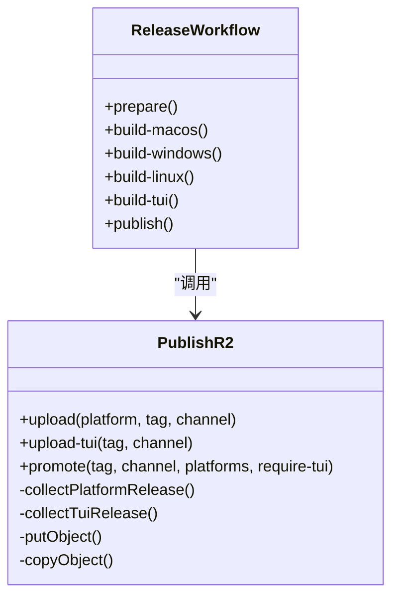
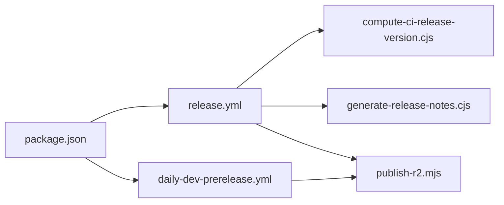

# CI/CD流水线

<cite>
**本文引用的文件**
- [pr-checks.yml](file://.github/workflows/pr-checks.yml)
- [release.yml](file://.github/workflows/release.yml)
- [daily-dev-prerelease.yml](file://.github/workflows/daily-dev-prerelease.yml)
- [replay-benchmark.yml](file://.github/workflows/replay-benchmark.yml)
- [package.json](file://package.json)
- [eslint.config.js](file://eslint.config.js)
- [vitest.config.ts](file://vitest.config.ts)
- [compute-ci-release-version.cjs](file://scripts/compute-ci-release-version.cjs)
- [generate-release-notes.cjs](file://scripts/generate-release-notes.cjs)
- [publish-r2.mjs](file://scripts/publish-r2.mjs)
</cite>

## 目录
1. [简介](#简介)
2. [项目结构](#项目结构)
3. [核心组件](#核心组件)
4. [架构总览](#架构总览)
5. [详细组件分析](#详细组件分析)
6. [依赖关系分析](#依赖关系分析)
7. [性能考虑](#性能考虑)
8. [故障排除指南](#故障排除指南)
9. [结论](#结论)
10. [附录](#附录)

## 简介
本文件为 DeepSeek-GUI（Kun）的持续集成与持续交付（CI/CD）流水线提供完整说明。内容覆盖：
- GitHub Actions 工作流配置与触发策略
- 自动化测试、代码质量门禁与构建任务
- 并行执行策略与产物管理
- 发布自动化（版本计算、变更日志生成、R2 归档与发布）
- 本地模拟 CI 环境的工具与技巧
- 常见问题排查与性能优化建议

## 项目结构
仓库采用多工作区结构，根 package.json 定义了统一的脚本入口；GitHub Actions 位于 .github/workflows；构建与发布脚本集中在 scripts 目录；测试框架使用 Vitest，ESLint 用于代码质量检查。

**图示来源**
- [pr-checks.yml:1-204](file://.github/workflows/pr-checks.yml#L1-L204)
- [daily-dev-prerelease.yml:1-459](file://.github/workflows/daily-dev-prerelease.yml#L1-L459)
- [release.yml:1-500](file://.github/workflows/release.yml#L1-L500)
- [replay-benchmark.yml:1-133](file://.github/workflows/replay-benchmark.yml#L1-L133)

**章节来源**
- [package.json:14-88](file://package.json#L14-L88)
- [eslint.config.js:1-64](file://eslint.config.js#L1-L64)
- [vitest.config.ts:1-20](file://vitest.config.ts#L1-L20)

## 核心组件
- 工作流
  - PR 检查：在 Pull Request 打开/同步/重新打开/可评审时触发，并行构建 Linux/macOS/Windows 安装包，失败时请求修改。
  - 每日开发预发布：定时或手动触发，基于 develop 分支构建并上传至 R2，标记为预发布。
  - 正式发布：当合并 PR 到 master 时触发，计算版本、签名打包、生成变更日志、创建/更新 GitHub Release 并上传到 R2。
  - 回放基准：按需触发，运行 Kun 回放基准并产出报告。
- 脚本
  - 版本计算：根据 Git 标签与 package.json 计算发布版本号与标签。
  - 变更日志：基于 Conventional Commits 规范生成中文变更摘要。
  - R2 发布：将产物按渠道与平台归档，生成 manifest，支持 promote 操作。
- 质量与测试
  - ESLint：统一 JS/TS/TSX 规则，忽略构建输出与 node_modules。
  - Vitest：以 Node 环境运行 src/**/*.test.ts，支持别名与超时设置。

**章节来源**
- [pr-checks.yml:1-204](file://.github/workflows/pr-checks.yml#L1-L204)
- [daily-dev-prerelease.yml:1-459](file://.github/workflows/daily-dev-prerelease.yml#L1-L459)
- [release.yml:1-500](file://.github/workflows/release.yml#L1-L500)
- [replay-benchmark.yml:1-133](file://.github/workflows/replay-benchmark.yml#L1-L133)
- [compute-ci-release-version.cjs:1-162](file://scripts/compute-ci-release-version.cjs#L1-L162)
- [generate-release-notes.cjs:1-126](file://scripts/generate-release-notes.cjs#L1-L126)
- [publish-r2.mjs:1-800](file://scripts/publish-r2.mjs#L1-L800)
- [eslint.config.js:1-64](file://eslint.config.js#L1-L64)
- [vitest.config.ts:1-20](file://vitest.config.ts#L1-L20)

## 架构总览
下图展示了从提交到发布的端到端流程，包括并行构建、签名、制品归档与发布。

**图示来源**
- [pr-checks.yml:21-152](file://.github/workflows/pr-checks.yml#L21-L152)
- [release.yml:22-185](file://.github/workflows/release.yml#L22-L185)
- [release.yml:186-318](file://.github/workflows/release.yml#L186-L318)
- [release.yml:310-500](file://.github/workflows/release.yml#L310-L500)

## 详细组件分析

### PR 检查流水线
- 触发条件：Pull Request 的 opened/synchronize/reopened/ready_for_review。
- 并发控制：按 PR 号分组，重复构建会取消进行中的任务。
- 任务
  - 构建 Linux AppImage/deb，上传产物。
  - 构建 macOS dmg/zip（Ad-hoc 签名），上传产物。
  - 构建 Windows NSIS 安装器，同时构建独立 TUI（Windows）。
  - 任一失败时，自动在 PR 上“请求更改”。

**图示来源**
- [pr-checks.yml:1-204](file://.github/workflows/pr-checks.yml#L1-L204)

**章节来源**
- [pr-checks.yml:1-204](file://.github/workflows/pr-checks.yml#L1-L204)

### 每日开发预发布流水线
- 触发条件：定时（UTC 04:00/16:00）或手动触发。
- 版本策略：基于时间戳生成 dev 版本与应用版本，打上 dev-YYYYMMDD.HHMM 标签。
- 构建与发布：并行构建 GUI 与独立 TUI，上传到 R2 并创建/更新 GitHub Pre-release。

**图示来源**
- [daily-dev-prerelease.yml:1-459](file://.github/workflows/daily-dev-prerelease.yml#L1-L459)

**章节来源**
- [daily-dev-prerelease.yml:1-459](file://.github/workflows/daily-dev-prerelease.yml#L1-L459)

### 正式发布流水线
- 触发条件：合并 PR 到 master（特定 head/base 分支校验）。
- 版本计算：读取所有 v* 标签与 HEAD 指向的标签，决定新版本与 previous_tag。
- 构建与签名：macOS 使用 Developer ID 签名与公证；Windows/Linux 构建安装包。
- 产物验证：校验必需文件是否存在（dmg/zip/exe/AppImage/deb、latest*.yml、TUI 压缩包等）。
- 变更日志：基于 Conventional Commits 生成中文摘要。
- 发布：创建/更新 Draft Release，上传资产到 GitHub 与 R2，promote latest 指针，最终发布。

**图示来源**
- [release.yml:22-185](file://.github/workflows/release.yml#L22-L185)
- [release.yml:186-318](file://.github/workflows/release.yml#L186-L318)
- [release.yml:310-500](file://.github/workflows/release.yml#L310-L500)
- [compute-ci-release-version.cjs:64-87](file://scripts/compute-ci-release-version.cjs#L64-L87)
- [generate-release-notes.cjs:72-123](file://scripts/generate-release-notes.cjs#L72-L123)
- [publish-r2.mjs:610-685](file://scripts/publish-r2.mjs#L610-L685)

**章节来源**
- [release.yml:1-500](file://.github/workflows/release.yml#L1-L500)
- [compute-ci-release-version.cjs:1-162](file://scripts/compute-ci-release-version.cjs#L1-L162)
- [generate-release-notes.cjs:1-126](file://scripts/generate-release-notes.cjs#L1-L126)
- [publish-r2.mjs:1-800](file://scripts/publish-r2.mjs#L1-L800)

### 回放基准流水线
- 触发方式：手动触发，支持传入套件路径、运行时地址、并发度、基线比较策略等参数。
- 执行：在 Ubuntu Runner 上安装依赖后运行回放基准，产出 JSON 与 Markdown 报告。
- 结果：始终上传报告作为工件。

**图示来源**
- [replay-benchmark.yml:1-133](file://.github/workflows/replay-benchmark.yml#L1-L133)

**章节来源**
- [replay-benchmark.yml:1-133](file://.github/workflows/replay-benchmark.yml#L1-L133)

### 测试与代码质量
- 单元测试与集成测试
  - 使用 Vitest，默认运行 src/**/*.test.ts，Node 环境，支持别名 @renderer/@shared。
  - 根脚本 test 会先运行扩展测试与 kun 子模块测试，再运行主仓库测试。
- 代码质量门禁
  - ESLint 配置启用推荐规则与 React Hooks 规则，忽略构建输出与 node_modules。
  - 可通过 npm run lint 执行检查。
- 安全审计与依赖漏洞扫描
  - 提供 audit:production 脚本，可在 CI 中调用以执行生产依赖审计。

**图示来源**
- [eslint.config.js:1-64](file://eslint.config.js#L1-L64)
- [vitest.config.ts:1-20](file://vitest.config.ts#L1-L20)
- [package.json:57-62](file://package.json#L57-L62)

**章节来源**
- [eslint.config.js:1-64](file://eslint.config.js#L1-L64)
- [vitest.config.ts:1-20](file://vitest.config.ts#L1-L20)
- [package.json:57-62](file://package.json#L57-L62)

### 发布产物管理与 R2 归档
- 产物收集：每个平台构建完成后上传到 GitHub Actions 工件，发布阶段汇总。
- R2 归档：按渠道（frontier/stable）与平台组织路径，上传二进制与 manifest，支持并发上传。
- Promote：将指定 tag 的最新指针提升到 latest，确保 GUI 与 TUI 一致推进。
- 校验：严格校验 update yml 版本、文件名模式、SHA256/SHA516、文件大小与目标集合。

**图示来源**
- [publish-r2.mjs:237-278](file://scripts/publish-r2.mjs#L237-L278)
- [publish-r2.mjs:387-492](file://scripts/publish-r2.mjs#L387-L492)
- [publish-r2.mjs:494-571](file://scripts/publish-r2.mjs#L494-L571)
- [publish-r2.mjs:610-685](file://scripts/publish-r2.mjs#L610-L685)
- [publish-r2.mjs:776-800](file://scripts/publish-r2.mjs#L776-L800)
- [release.yml:310-500](file://.github/workflows/release.yml#L310-L500)

**章节来源**
- [publish-r2.mjs:1-800](file://scripts/publish-r2.mjs#L1-L800)
- [release.yml:310-500](file://.github/workflows/release.yml#L310-L500)

## 依赖关系分析
- 工作流间依赖
  - release 的 build-* 任务依赖 prepare 输出的版本与标签。
  - publish 任务依赖所有构建任务成功。
- 脚本依赖
  - compute-ci-release-version.cjs 被 release 的 prepare 调用。
  - generate-release-notes.cjs 在 publish 阶段生成变更日志。
  - publish-r2.mjs 负责上传与 promote，被 release 与 daily-dev 调用。
- 构建脚本依赖
  - package.json 中的 dist:* 与 package:tui 等脚本驱动 electron-builder 与 TUI 打包。

**图示来源**
- [release.yml:22-50](file://.github/workflows/release.yml#L22-L50)
- [release.yml:310-500](file://.github/workflows/release.yml#L310-L500)
- [daily-dev-prerelease.yml:21-56](file://.github/workflows/daily-dev-prerelease.yml#L21-L56)
- [package.json:63-80](file://package.json#L63-L80)

**章节来源**
- [release.yml:1-500](file://.github/workflows/release.yml#L1-L500)
- [daily-dev-prerelease.yml:1-459](file://.github/workflows/daily-dev-prerelease.yml#L1-L459)
- [package.json:63-80](file://package.json#L63-L80)

## 性能考虑
- 并行化
  - PR 检查与发布均使用多平台并行构建，缩短整体耗时。
  - R2 上传支持并发（可通过环境变量控制），提升大文件上传吞吐。
- 缓存
  - setup-node 启用 npm 缓存，减少依赖安装时间。
  - 针对 kun 子模块也单独缓存其 lock 文件。
- 资源与超时
  - 各作业设置 timeout-minutes，避免长时间占用 runner。
  - 大型构建建议使用专用 runner 或自托管 runner 以提升稳定性。
- 产物体积
  - 构建后执行包大小检查脚本，防止意外膨胀。

[本节为通用指导，不直接分析具体文件]

## 故障排除指南
- 常见失败点
  - 缺失签名凭据：macOS 构建需要有效的 P12 与 API Key，若缺失会在解码步骤报错。
  - 产物不完整：发布前会校验必需文件，缺失时会列出实际文件并中止。
  - R2 配置错误：缺少 endpoint/accountId/密钥或公共域名未替换会导致上传失败。
  - 版本不一致：update yml 的版本必须与 tag 对应，否则拒绝发布。
- 定位方法
  - 查看 Actions 运行详情与失败步骤日志。
  - 下载工件查看实际产物清单。
  - 使用 dry-run 模式验证 R2 上传逻辑（publish-r2.mjs 支持 --dry-run）。
- 修复建议
  - 补充 Secrets 与环境变量。
  - 重新构建并确保产物齐全。
  - 修正版本与标签一致性。
  - 调整并发与超时以适应网络与资源限制。

**章节来源**
- [release.yml:88-127](file://.github/workflows/release.yml#L88-L127)
- [release.yml:365-393](file://.github/workflows/release.yml#L365-L393)
- [publish-r2.mjs:237-278](file://scripts/publish-r2.mjs#L237-L278)
- [publish-r2.mjs:387-492](file://scripts/publish-r2.mjs#L387-L492)

## 结论
DeepSeek-GUI 的 CI/CD 流水线通过多工作流协作实现了从 PR 检查、每日预发布到正式发布的完整闭环。借助并行构建、严格的产物校验、规范的版本与变更日志生成，以及 R2 归档与 promote 机制，确保了高质量、可追溯且稳定的交付能力。配合本地脚本与测试配置，团队可以在本地高效模拟 CI 行为并进行问题定位与优化。

## 附录
- 本地模拟 CI 的技巧
  - 使用相同 Node 版本与缓存策略，复现依赖安装过程。
  - 通过环境变量注入 Secrets 与 R2 配置，使用 publish-r2.mjs 的 dry-run 验证上传逻辑。
  - 使用 vitest 与 eslint 在本地快速反馈测试与代码风格问题。
- 常用命令参考
  - 构建与打包：npm run dist:*（见 package.json 中的 dist 相关脚本）
  - 测试：npm run test（包含扩展与子模块测试）
  - 代码质量：npm run lint
  - 审计：npm run audit:production

**章节来源**
- [package.json:63-80](file://package.json#L63-L80)
- [package.json:57-62](file://package.json#L57-L62)
- [publish-r2.mjs:40-59](file://scripts/publish-r2.mjs#L40-L59)