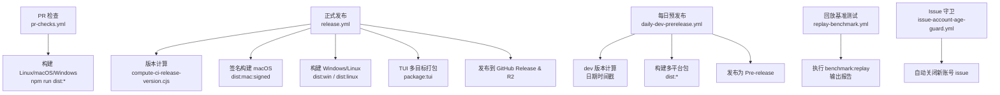
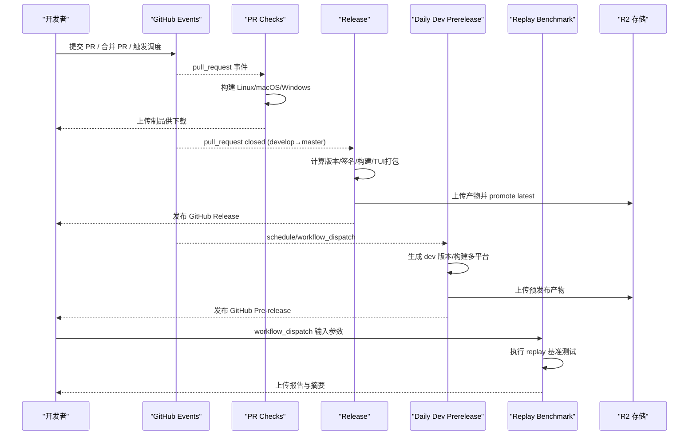
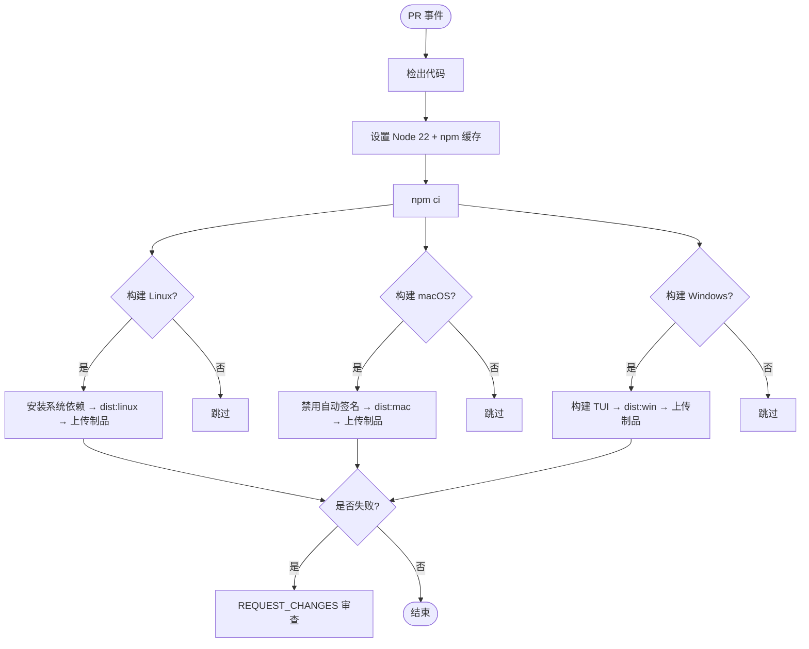
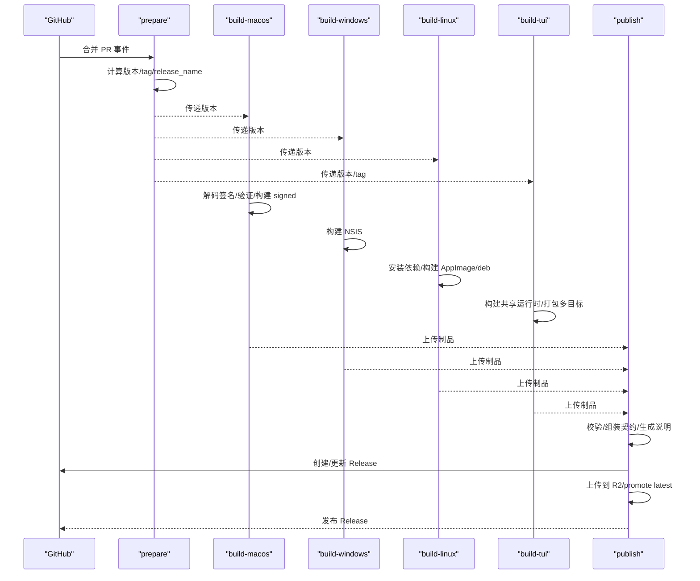
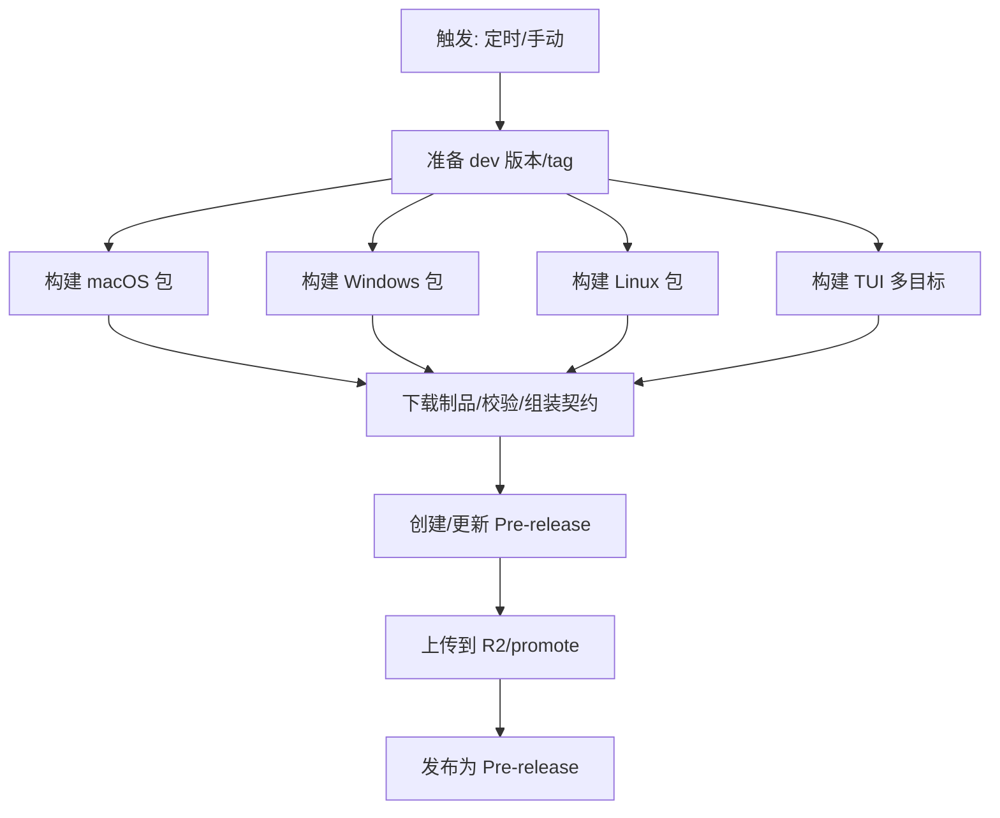
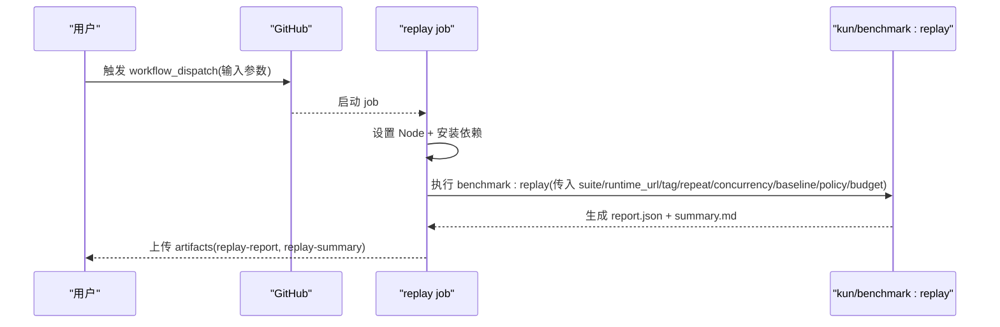
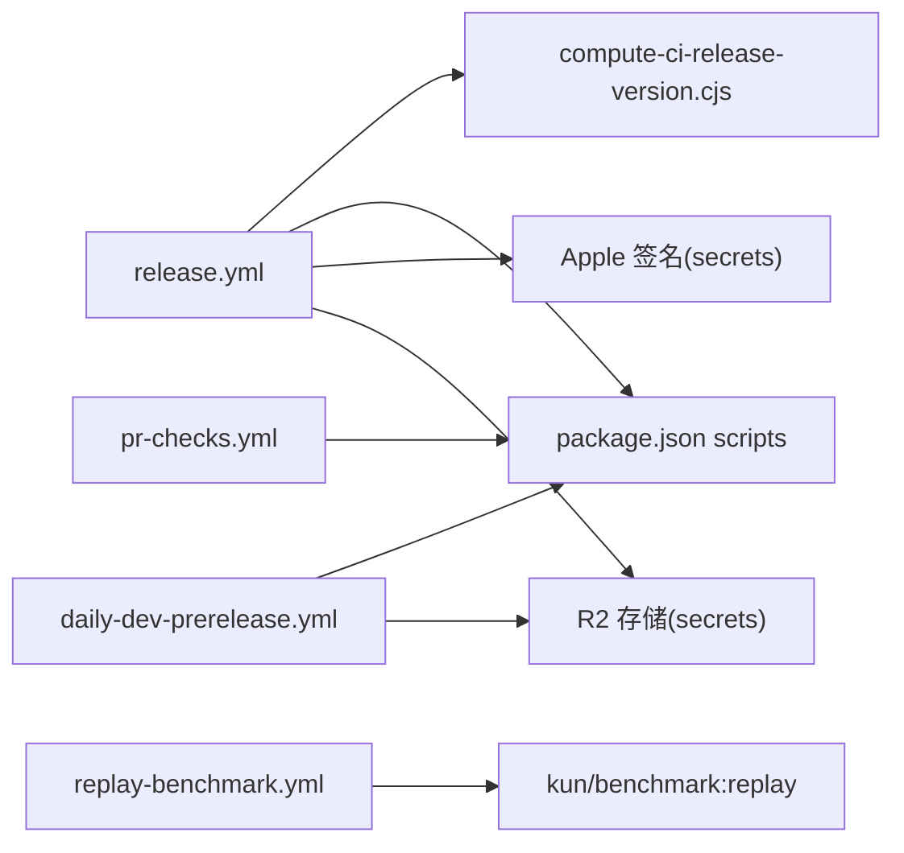

# GitHub Actions工作流

<cite>
**本文引用的文件**
- [pr-checks.yml](file://.github/workflows/pr-checks.yml)
- [release.yml](file://.github/workflows/release.yml)
- [daily-dev-prerelease.yml](file://.github/workflows/daily-dev-prerelease.yml)
- [replay-benchmark.yml](file://.github/workflows/replay-benchmark.yml)
- [issue-account-age-guard.yml](file://.github/workflows/issue-account-age-guard.yml)
- [package.json](file://package.json)
- [compute-ci-release-version.cjs](file://scripts/compute-ci-release-version.cjs)
</cite>

## 目录
1. [简介](#简介)
2. [项目结构](#项目结构)
3. [核心组件](#核心组件)
4. [架构总览](#架构总览)
5. [详细组件分析](#详细组件分析)
6. [依赖关系分析](#依赖关系分析)
7. [性能与缓存优化](#性能与缓存优化)
8. [故障排除指南](#故障排除指南)
9. [结论](#结论)
10. [附录：自定义与扩展指南](#附录自定义与扩展指南)

## 简介
本文件为 DeepSeek-GUI（Kun）项目的 GitHub Actions 工作流提供系统化文档，覆盖以下工作流：
- PR 检查（pr-checks.yml）：在 Pull Request 打开、同步、重新打开、可评审时触发，构建 Linux/macOS/Windows 安装包并上传制品。
- 正式发布（release.yml）：当 develop→master 的合并 PR 关闭后触发，计算版本、签名构建 macOS、构建 Windows/Linux、打包 TUI、发布到 GitHub Release 和 R2。
- 每日预发布（daily-dev-prerelease.yml）：定时或手动触发，基于 develop 分支生成 dev 版本号，构建多平台包并发布为 GitHub Pre-release。
- 回放基准测试（replay-benchmark.yml）：通过 workflow_dispatch 输入参数运行 replay 基准测试，产出报告与摘要。
- Issue 账户年龄守卫（issue-account-age-guard.yml）：自动关闭新注册账号创建的 issue，减少垃圾信息。

## 项目结构
GitHub Actions 工作流位于 .github/workflows 目录下，每个 yml 文件对应一个独立的工作流。工作流通过 npm scripts 调用根 package.json 中的构建与打包命令，并使用 Node.js 脚本完成版本计算、产物校验、发布等逻辑。

图表来源
- [pr-checks.yml:1-204](file://.github/workflows/pr-checks.yml#L1-L204)
- [release.yml:1-500](file://.github/workflows/release.yml#L1-L500)
- [daily-dev-prerelease.yml:1-459](file://.github/workflows/daily-dev-prerelease.yml#L1-L459)
- [replay-benchmark.yml:1-133](file://.github/workflows/replay-benchmark.yml#L1-L133)
- [issue-account-age-guard.yml:1-90](file://.github/workflows/issue-account-age-guard.yml#L1-L90)
- [package.json:14-88](file://package.json#L14-L88)
- [compute-ci-release-version.cjs:64-145](file://scripts/compute-ci-release-version.cjs#L64-L145)

章节来源
- [pr-checks.yml:1-204](file://.github/workflows/pr-checks.yml#L1-L204)
- [release.yml:1-500](file://.github/workflows/release.yml#L1-L500)
- [daily-dev-prerelease.yml:1-459](file://.github/workflows/daily-dev-prerelease.yml#L1-L459)
- [replay-benchmark.yml:1-133](file://.github/workflows/replay-benchmark.yml#L1-L133)
- [issue-account-age-guard.yml:1-90](file://.github/workflows/issue-account-age-guard.yml#L1-L90)
- [package.json:14-88](file://package.json#L14-L88)
- [compute-ci-release-version.cjs:64-145](file://scripts/compute-ci-release-version.cjs#L64-L145)

## 核心组件
- 触发器与权限控制：各工作流通过 on 字段定义触发条件；permissions 限制最小权限原则。
- 并发控制：concurrency 防止重复运行冲突，部分工作流允许取消进行中任务。
- 环境变量：NODE_VERSION、RELEASE_CHANNEL、KUN_APP_VERSION、DEEPSEEK_GUI_* 等用于统一构建行为。
- 依赖安装策略：使用 actions/setup-node@v4 配置 Node 版本与 npm 缓存；Linux 构建前安装系统依赖。
- 构建与打包：通过 npm run dist:* 与 package:tui 实现跨平台产物生成。
- 制品上传与验证：actions/upload-artifact 与下载后校验必需文件存在。
- 发布流程：创建/更新 GitHub Release/Pre-release，上传资产，推送至 R2 并 promote latest。

章节来源
- [pr-checks.yml:11-20](file://.github/workflows/pr-checks.yml#L11-L20)
- [release.yml:17-20](file://.github/workflows/release.yml#L17-L20)
- [daily-dev-prerelease.yml:16-19](file://.github/workflows/daily-dev-prerelease.yml#L16-L19)
- [replay-benchmark.yml:52-57](file://.github/workflows/replay-benchmark.yml#L52-L57)
- [package.json:63-75](file://package.json#L63-L75)

## 架构总览
下图展示了四个主要工作流的协作关系与数据流：

图表来源
- [pr-checks.yml:3-16](file://.github/workflows/pr-checks.yml#L3-L16)
- [release.yml:3-20](file://.github/workflows/release.yml#L3-L20)
- [daily-dev-prerelease.yml:3-19](file://.github/workflows/daily-dev-prerelease.yml#L3-L19)
- [replay-benchmark.yml:3-57](file://.github/workflows/replay-benchmark.yml#L3-L57)

## 详细组件分析

### PR 检查（pr-checks.yml）
- 触发条件：pull_request 的 opened、synchronize、reopened、ready_for_review。
- 并发控制：按 PR 号或 ref 分组，允许取消进行中任务。
- 环境：Node 22；Linux/macOS/Windows 三平台并行构建。
- 阶段与步骤：
  - 检出仓库、设置 Node、安装依赖（npm ci）。
  - Linux：安装系统依赖（libarchive-tools、rpm、fakeroot、dpkg、build-essential、python3），构建 AppImage/deb，上传制品。
  - macOS：禁用自动签名发现（ad-hoc），构建 dmg/zip，上传制品。
  - Windows：构建独立 TUI（host-native），再构建 NSIS 安装包，上传制品。
  - 失败请求变更：任一平台构建失败时，使用 GitHub Script 对 PR 发起 REQUEST_CHANGES 审查。
- 缓存机制：setup-node 启用 npm 缓存，路径包含根与 kun 子包的 lock 文件。
- 超时：各 job 设置 timeout-minutes 避免长时间占用 runner。

图表来源
- [pr-checks.yml:21-152](file://.github/workflows/pr-checks.yml#L21-L152)
- [pr-checks.yml:153-204](file://.github/workflows/pr-checks.yml#L153-L204)

章节来源
- [pr-checks.yml:1-204](file://.github/workflows/pr-checks.yml#L1-L204)

### 正式发布（release.yml）
- 触发条件：当来自 develop 分支合并到 master 的 PR 被关闭（merged）时触发。
- 版本计算：调用 compute-ci-release-version.cjs 计算语义化版本、tag、release_name、previous_tag。
- 构建阶段：
  - macOS：解码 Apple 签名凭据（P12、p8），验证签名与公证能力，执行 dist:mac:signed，上传制品。
  - Windows：构建 NSIS 安装包，上传制品。
  - Linux：安装系统依赖，构建 AppImage/deb，上传制品。
  - TUI：矩阵构建多目标（darwin-arm64/x64、win32-x64、linux-x64），构建共享运行时并打包。
- 发布阶段：
  - 下载所有 release-* 制品，重建共享运行时身份，校验必需文件。
  - 组装 TUI 发布契约，生成发布说明，确保 tag 存在并推送。
  - 创建或更新 draft GitHub Release，上传资产。
  - 上传产物到 R2 并 promote latest。
  - 将 Release 标记为正式且最新。
- 环境变量：稳定通道 stable，注入 KUN_APP_VERSION、DEEPSEEK_GUI_*、RELEASE_CHANNEL 等。
- 安全：Apple 签名凭据通过 secrets 管理，严格校验缺失项。

图表来源
- [release.yml:22-51](file://.github/workflows/release.yml#L22-L51)
- [release.yml:52-142](file://.github/workflows/release.yml#L52-L142)
- [release.yml:143-185](file://.github/workflows/release.yml#L143-L185)
- [release.yml:186-236](file://.github/workflows/release.yml#L186-L236)
- [release.yml:237-309](file://.github/workflows/release.yml#L237-L309)
- [release.yml:310-500](file://.github/workflows/release.yml#L310-L500)
- [compute-ci-release-version.cjs:64-145](file://scripts/compute-ci-release-version.cjs#L64-L145)

章节来源
- [release.yml:1-500](file://.github/workflows/release.yml#L1-L500)
- [compute-ci-release-version.cjs:1-162](file://scripts/compute-ci-release-version.cjs#L1-L162)

### 每日预发布（daily-dev-prerelease.yml）
- 触发条件：workflow_dispatch 或 cron（UTC 4:00 与 16:00，对应北京时间 12:00 与次日 00:00）。
- 版本策略：基于当前时间生成 dev 版本号（YYYYMMDD.HHMM），应用版本为 0.0.0-dev-YYYYMMDD-HHMM，tag 为 dev-YYYYMMDD.HHMM。
- 构建阶段：
  - macOS：构建 dmg/zip，上传制品。
  - Windows：构建 NSIS，上传制品。
  - Linux：安装系统依赖，构建 AppImage/deb，上传制品。
  - TUI：矩阵构建多目标，构建共享运行时并打包。
- 发布阶段：
  - 下载 daily-dev-* 制品，重建共享运行时身份，校验必需文件。
  - 组装 TUI 预发布契约，生成预发布说明。
  - 确保 tag 存在并推送，创建或更新 draft GitHub Pre-release。
  - 上传产物到 R2 并 promote latest。
  - 发布为 Pre-release（非 latest）。
- 环境变量：frontier 通道，注入 KUN_APP_VERSION、KUN_ARTIFACT_VERSION、DEEPSEEK_GUI_*、RELEASE_CHANNEL。

图表来源
- [daily-dev-prerelease.yml:21-59](file://.github/workflows/daily-dev-prerelease.yml#L21-L59)
- [daily-dev-prerelease.yml:61-201](file://.github/workflows/daily-dev-prerelease.yml#L61-L201)
- [daily-dev-prerelease.yml:202-274](file://.github/workflows/daily-dev-prerelease.yml#L202-L274)
- [daily-dev-prerelease.yml:275-459](file://.github/workflows/daily-dev-prerelease.yml#L275-L459)

章节来源
- [daily-dev-prerelease.yml:1-459](file://.github/workflows/daily-dev-prerelease.yml#L1-L459)

### 回放基准测试（replay-benchmark.yml）
- 触发条件：workflow_dispatch，支持多个输入参数（suite、runtime_url、tag、repeat、concurrency、baseline、comparison_policy、budget、fail_on_regression、fail_on_budget）。
- 执行流程：
  - 检出仓库、设置 Node 22、安装依赖。
  - 根据输入参数构造命令行参数，执行 npm --prefix kun run benchmark:replay。
  - 输出 replay-report.json 与 replay-summary.md 到 replay-artifacts。
  - 始终上传报告（即使失败也保留结果）。
- 环境变量：KUN_RUNTIME_TOKEN 用于访问运行时。

图表来源
- [replay-benchmark.yml:3-57](file://.github/workflows/replay-benchmark.yml#L3-L57)
- [replay-benchmark.yml:59-133](file://.github/workflows/replay-benchmark.yml#L59-L133)

章节来源
- [replay-benchmark.yml:1-133](file://.github/workflows/replay-benchmark.yml#L1-L133)

### Issue 账户年龄守卫（issue-account-age-guard.yml）
- 触发条件：issues.opened。
- 策略：若作者账户年龄小于阈值（默认 180 天），则自动关闭 issue 并添加标签 auto-closed: new-account，同时评论双语说明。维护者、成员、协作者及机器人不受限。
- 容错：查询用户信息失败时不关闭 issue（fail-open）。

章节来源
- [issue-account-age-guard.yml:1-90](file://.github/workflows/issue-account-age-guard.yml#L1-L90)

## 依赖关系分析
- 工作流与脚本：
  - release.yml 依赖 compute-ci-release-version.cjs 进行版本计算。
  - 所有构建工作流依赖 package.json 中定义的 dist:* 与 package:tui 脚本。
- 外部服务：
  - Apple 签名与公证：通过 secrets 注入证书与 API Key。
  - R2 对象存储：通过 secrets 注入桶、账户、端点、密钥与公开基础 URL。
- 平台差异：
  - Linux 需要系统级打包工具链。
  - macOS 需要 brew cmake（Whisper 构建）与签名凭据。
  - Windows 使用 PowerShell 执行特定脚本。

图表来源
- [release.yml:48-51](file://.github/workflows/release.yml#L48-L51)
- [package.json:63-88](file://package.json#L63-L88)
- [daily-dev-prerelease.yml:202-274](file://.github/workflows/daily-dev-prerelease.yml#L202-L274)
- [pr-checks.yml:39-49](file://.github/workflows/pr-checks.yml#L39-L49)
- [replay-benchmark.yml:79-123](file://.github/workflows/replay-benchmark.yml#L79-L123)

章节来源
- [release.yml:1-500](file://.github/workflows/release.yml#L1-L500)
- [package.json:63-88](file://package.json#L63-L88)
- [daily-dev-prerelease.yml:1-459](file://.github/workflows/daily-dev-prerelease.yml#L1-L459)
- [pr-checks.yml:1-204](file://.github/workflows/pr-checks.yml#L1-L204)
- [replay-benchmark.yml:1-133](file://.github/workflows/replay-benchmark.yml#L1-L133)

## 性能与缓存优化
- Node 模块缓存：
  - 使用 actions/setup-node@v4 的 cache: npm，并在 cache-dependency-path 指定 package-lock.json 与 kun/package-lock.json，加速依赖安装。
- 并行构建：
  - pr-checks 与 release/daily 工作流在多平台并行构建，缩短整体耗时。
- 超时控制：
  - 各 job 设置 timeout-minutes，避免长时间占用 runner。
- 制品生命周期：
  - PR 制品 retention-days=3，发布制品 retention-days=7，平衡存储成本与可用性。
- 系统依赖缓存：
  - Linux 构建前 apt-get update/install，建议结合容器镜像层缓存以减少网络开销。
- 推荐优化：
  - 将常用系统依赖（如 build-essential、python3）放入自定义 Docker 镜像或使用 cached layers。
  - 对大型依赖（如 Electron）启用更细粒度的缓存键（例如基于 lock 文件的哈希）。
  - 对 TUI 构建使用独立的 runner 与缓存隔离，避免相互影响。

[本节为通用指导，无需具体文件引用]

## 故障排除指南
- Apple 签名失败：
  - 检查 secrets 是否包含 MAC_CODESIGN_P12_BASE64、APPLE_API_KEY_BASE64、CSC_KEY_PASSWORD、APPLE_API_KEY_ID、APPLE_API_ISSUER。
  - 确认 verify:apple 步骤成功，必要时在本地复现签名流程。
- R2 上传失败：
  - 检查 R2_BUCKET、R2_ACCOUNT_ID、R2_ENDPOINT、R2_ACCESS_KEY_ID、R2_SECRET_ACCESS_KEY、R2_PUBLIC_BASE_URL、R2_RELEASE_PREFIX。
  - 确认网络可达性与权限策略。
- 制品缺失：
  - 发布阶段会校验必需文件（dmg、exe、AppImage、latest*.yml、TUI 压缩包等），若缺失会报错并列出实际文件。
  - 检查 dist 目录生成规则与 electron-builder 配置。
- 版本计算异常：
  - compute-ci-release-version.cjs 要求 package.json version 为 x.y.z 或存在 v* 标签；若无合法标签，将基于 package.json 递增 patch。
  - 检查 git tags 与 HEAD 指向是否正确。
- 基准测试失败：
  - 确认 KUN_RUNTIME_TOKEN 有效，runtime_url 可从 runner 访问。
  - 检查 suite JSON 路径与 tag 过滤是否正确。
  - 查看 replay-report.json 与 replay-summary.md 定位问题。

章节来源
- [release.yml:88-127](file://.github/workflows/release.yml#L88-L127)
- [release.yml:365-393](file://.github/workflows/release.yml#L365-L393)
- [release.yml:482-499](file://.github/workflows/release.yml#L482-L499)
- [compute-ci-release-version.cjs:64-145](file://scripts/compute-ci-release-version.cjs#L64-L145)
- [replay-benchmark.yml:64-133](file://.github/workflows/replay-benchmark.yml#L64-L133)

## 结论
DeepSeek-GUI 的 GitHub Actions 工作流覆盖了从 PR 检查、正式发布、每日预发布到性能基准测试的全链路自动化。通过严格的版本计算、多平台并行构建、签名与公证、制品校验与发布到 R2，确保了交付质量与效率。配合 Issue 账户年龄守卫，进一步提升了仓库安全性。建议在后续迭代中持续优化缓存策略、细化错误提示，并扩展更多质量门禁（如覆盖率、安全扫描）。

[本节为总结性内容，无需具体文件引用]

## 附录：自定义与扩展指南
- 添加新的检查任务：
  - 在 pr-checks.yml 新增 job，复用 setup-node 与 npm ci，执行自定义 lint/test/build 命令。
  - 在 request-changes-on-failure 中纳入新 job 的结果判断。
- 优化现有流程：
  - 调整 concurrency group 与 cancel-in-progress 策略以匹配团队节奏。
  - 增加 cache-dependency-path 的粒度，提升缓存命中率。
  - 引入并行矩阵（matrix）以覆盖更多 Node 版本或平台组合。
- 扩展发布渠道：
  - 在 release.yml 中添加新的 platform 构建 job，遵循现有 artifact 命名与校验模式。
  - 在 publish 阶段加入新的 upload/promote 步骤。
- 调试技巧：
  - 使用 actions/upload-artifact 保存中间产物（如日志、构建输出）。
  - 在关键步骤前后打印环境变量与文件列表，便于定位问题。
  - 使用 if: always() 确保失败时仍收集诊断信息。
- 故障排除：
  - 参考“故障排除指南”逐项核对 secrets、依赖与环境变量。
  - 对于签名与公证问题，优先在本地复现并验证工具链。

[本节为通用指导，无需具体文件引用]