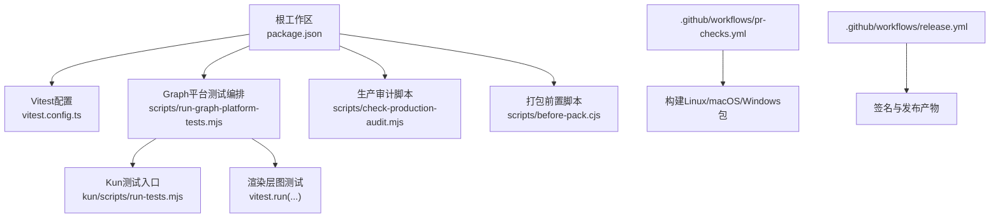
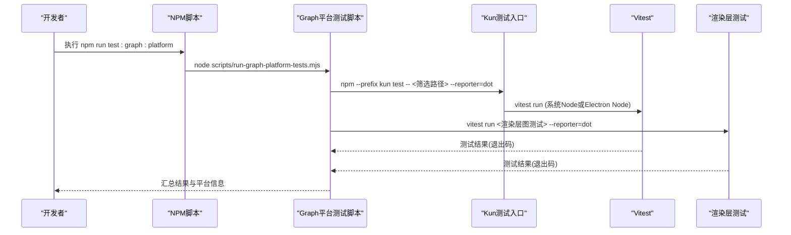
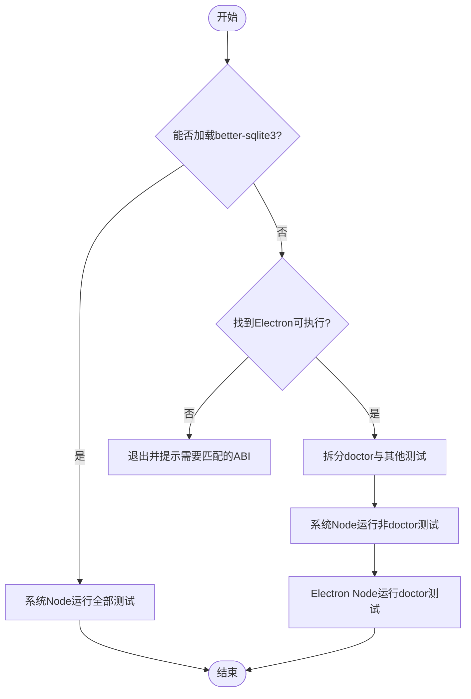
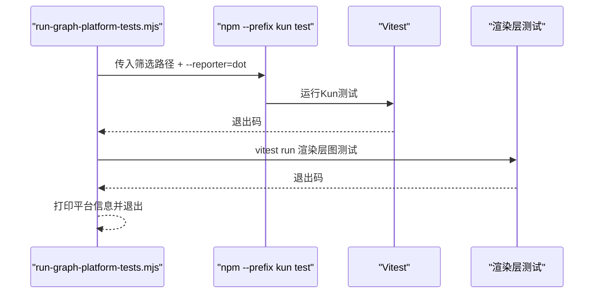
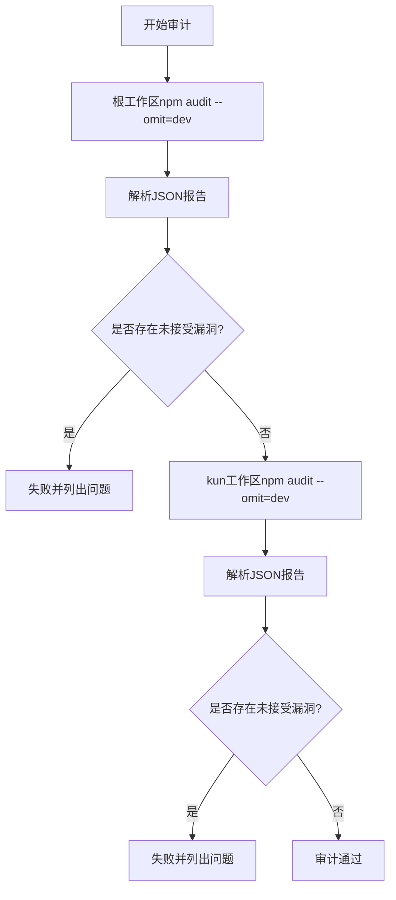
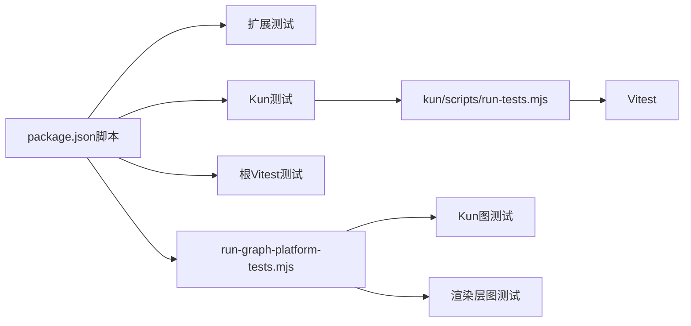

# 自动化测试执行

<cite>
**本文引用的文件**
- [package.json](file://package.json)
- [vitest.config.ts](file://vitest.config.ts)
- [kun/vitest.config.ts](file://kun/vitest.config.ts)
- [scripts/run-graph-platform-tests.mjs](file://scripts/run-graph-platform-tests.mjs)
- [scripts/check-production-audit.mjs](file://scripts/check-production-audit.mjs)
- [scripts/before-pack.cjs](file://scripts/before-pack.cjs)
- [.github/workflows/pr-checks.yml](file://.github/workflows/pr-checks.yml)
- [.github/workflows/release.yml](file://.github/workflows/release.yml)
- [kun/scripts/run-tests.mjs](file://kun/scripts/run-tests.mjs)
</cite>

## 目录
1. [简介](#简介)
2. [项目结构](#项目结构)
3. [核心组件](#核心组件)
4. [架构总览](#架构总览)
5. [详细组件分析](#详细组件分析)
6. [依赖关系分析](#依赖关系分析)
7. [性能与并行优化](#性能与并行优化)
8. [故障诊断与调试](#故障诊断与调试)
9. [结论](#结论)
10. [附录](#附录)

## 简介
本文件面向DeepSeek-GUI的自动化测试执行，覆盖单元测试、集成测试、端到端测试的组织与策略；重点说明graph平台测试的执行流程（环境准备、并行策略、结果收集）；介绍生产环境审计检查（安全漏洞扫描、依赖检查、代码质量验证）；提供本地测试执行指南（覆盖率报告、性能基准）；并给出失败诊断、调试技巧以及在CI中优化测试执行效率的建议。

## 项目结构
仓库采用多工作区与分层测试组织：
- 根工作区负责Electron桌面应用与渲染层测试，使用Vitest在Node环境下运行。
- kun子工作区包含Kun运行时与工具链，测试通过自定义脚本run-tests.mjs统一入口，自动处理better-sqlite3在系统Node与Electron Node之间的差异。
- graph平台测试由专用脚本run-graph-platform-tests.mjs编排，分别调用kun工作区的测试与渲染层图相关测试。
- CI通过GitHub Actions在PR与发布流水线中执行打包与校验任务。

**图示来源**
- [package.json:14-88](file://package.json#L14-L88)
- [vitest.config.ts:1-20](file://vitest.config.ts#L1-L20)
- [scripts/run-graph-platform-tests.mjs:1-80](file://scripts/run-graph-platform-tests.mjs#L1-L80)
- [scripts/check-production-audit.mjs:1-114](file://scripts/check-production-audit.mjs#L1-L114)
- [scripts/before-pack.cjs:1-63](file://scripts/before-pack.cjs#L1-L63)
- [.github/workflows/pr-checks.yml:21-152](file://.github/workflows/pr-checks.yml#L21-L152)
- [.github/workflows/release.yml:52-500](file://.github/workflows/release.yml#L52-L500)

**章节来源**
- [package.json:14-88](file://package.json#L14-L88)
- [vitest.config.ts:1-20](file://vitest.config.ts#L1-L20)
- [kun/vitest.config.ts:1-26](file://kun/vitest.config.ts#L1-L26)
- [scripts/run-graph-platform-tests.mjs:1-80](file://scripts/run-graph-platform-tests.mjs#L1-L80)
- [scripts/check-production-audit.mjs:1-114](file://scripts/check-production-audit.mjs#L1-L114)
- [scripts/before-pack.cjs:1-63](file://scripts/before-pack.cjs#L1-L63)
- [.github/workflows/pr-checks.yml:21-152](file://.github/workflows/pr-checks.yml#L21-L152)
- [.github/workflows/release.yml:52-500](file://.github/workflows/release.yml#L52-L500)

## 核心组件
- 测试框架与配置
  - 根工作区使用Vitest，设置Node环境、别名、包含规则与平台相关的并行度/超时。
  - kun工作区同样使用Vitest，但通过自定义脚本统一入口，自动区分系统Node与Electron Node以运行SQLite相关测试。
- Graph平台测试编排
  - 将graph相关测试分为“Kun侧”和“渲染层侧”，分别调用npm test与vitest run，并以dot报告器输出。
- 生产审计
  - 对根与kun两个工作区执行npm audit --omit=dev，严格拒绝high/critical，并对moderate白名单进行限制。
- 打包前置
  - before-pack阶段准备Whisper与OfficeCLI资源，确保产物完整性。

**章节来源**
- [vitest.config.ts:1-20](file://vitest.config.ts#L1-L20)
- [kun/vitest.config.ts:1-26](file://kun/vitest.config.ts#L1-L26)
- [scripts/run-graph-platform-tests.mjs:1-80](file://scripts/run-graph-platform-tests.mjs#L1-L80)
- [scripts/check-production-audit.mjs:1-114](file://scripts/check-production-audit.mjs#L1-L114)
- [scripts/before-pack.cjs:1-63](file://scripts/before-pack.cjs#L1-L63)

## 架构总览
下图展示从命令到测试执行的完整链路，包括graph平台测试的并行与结果汇总。

**图示来源**
- [package.json:57-62](file://package.json#L57-L62)
- [scripts/run-graph-platform-tests.mjs:8-62](file://scripts/run-graph-platform-tests.mjs#L8-L62)
- [kun/scripts/run-tests.mjs:38-91](file://kun/scripts/run-tests.mjs#L38-L91)

**章节来源**
- [package.json:57-62](file://package.json#L57-L62)
- [scripts/run-graph-platform-tests.mjs:8-62](file://scripts/run-graph-platform-tests.mjs#L8-L62)
- [kun/scripts/run-tests.mjs:38-91](file://kun/scripts/run-tests.mjs#L38-L91)

## 详细组件分析

### 单元测试与集成测试组织
- 根工作区
  - 测试入口：npm test会依次执行扩展测试、Kun测试与根Vitest测试。
  - 配置要点：Node环境、别名映射、包含src/**/*.test.ts、Windows下降低并发与增加超时。
- Kun工作区
  - 测试入口：npm --prefix kun test，内部由run-tests.mjs决定使用系统Node还是Electron Node运行Vitest。
  - SQLite兼容：当系统Node无法加载better-sqlite3时，回退到Electron Node仅运行doctor类测试。
- 示例测试
  - PPT Master工具测试展示了工具执行、审批令牌、路径约束与错误处理的断言方式。

**图示来源**
- [kun/scripts/run-tests.mjs:8-91](file://kun/scripts/run-tests.mjs#L8-L91)

**章节来源**
- [package.json:57-62](file://package.json#L57-L62)
- [vitest.config.ts:1-20](file://vitest.config.ts#L1-L20)
- [kun/vitest.config.ts:1-26](file://kun/vitest.config.ts#L1-L26)
- [kun/scripts/run-tests.mjs:8-91](file://kun/scripts/run-tests.mjs#L8-L91)

### Graph平台测试执行流程
- 测试范围
  - Kun侧：contracts/graph.test.ts、graph目录、多个tool与runtime测试、server路由测试、tui控制器等。
  - 渲染层侧：Graph模式面板、节点检查器、运行画布、工作区布局等。
- 执行策略
  - 使用dot报告器快速反馈。
  - 先执行Kun测试，再执行渲染层测试，任一失败即终止并返回非零退出码。
- 结果收集
  - 控制台输出平台信息与成功/失败状态，便于CI记录。

**图示来源**
- [scripts/run-graph-platform-tests.mjs:8-62](file://scripts/run-graph-platform-tests.mjs#L8-L62)

**章节来源**
- [scripts/run-graph-platform-tests.mjs:8-62](file://scripts/run-graph-platform-tests.mjs#L8-L62)

### 生产环境审计检查
- 安全漏洞扫描
  - 对根与kun分别执行npm audit --omit=dev，解析JSON报告。
  - 拒绝high/critical；moderate仅在白名单内允许；advisory需匹配已审核列表。
- 依赖检查
  - 通过before-pack阶段准备Whisper与OfficeCLI资源，避免运行时缺失。
- 代码质量
  - 通过lint与类型检查脚本（见package.json中的typecheck/lint），结合ESLint与TypeScript编译检查。

**图示来源**
- [scripts/check-production-audit.mjs:33-104](file://scripts/check-production-audit.mjs#L33-L104)

**章节来源**
- [scripts/check-production-audit.mjs:1-114](file://scripts/check-production-audit.mjs#L1-L114)
- [scripts/before-pack.cjs:19-56](file://scripts/before-pack.cjs#L19-L56)
- [package.json:57-88](file://package.json#L57-L88)

### 端到端与冒烟测试
- 冒烟测试脚本
  - 提供standalone TUI、双运行时、打包产物等冒烟用例，用于快速验证关键路径。
- CI集成
  - PR检查流水线构建Linux/macOS/Windows包并上传制品；发布流水线执行签名、归档与发布。

**章节来源**
- [package.json:25-55](file://package.json#L25-L55)
- [.github/workflows/pr-checks.yml:21-152](file://.github/workflows/pr-checks.yml#L21-L152)
- [.github/workflows/release.yml:52-500](file://.github/workflows/release.yml#L52-L500)

## 依赖关系分析
- 测试与脚本耦合
  - package.json脚本串联扩展测试、Kun测试与根Vitest测试。
  - run-graph-platform-tests.mjs依赖npm与vitest可执行路径，并通过spawnSync顺序执行两类测试。
- 外部依赖
  - better-sqlite3在系统Node与Electron Node之间需要ABI匹配，由run-tests.mjs自动处理。
  - Whisper与OfficeCLI资源在打包前准备，影响产物可用性。

**图示来源**
- [package.json:57-62](file://package.json#L57-L62)
- [scripts/run-graph-platform-tests.mjs:8-62](file://scripts/run-graph-platform-tests.mjs#L8-L62)
- [kun/scripts/run-tests.mjs:38-91](file://kun/scripts/run-tests.mjs#L38-L91)

**章节来源**
- [package.json:57-62](file://package.json#L57-L62)
- [scripts/run-graph-platform-tests.mjs:8-62](file://scripts/run-graph-platform-tests.mjs#L8-L62)
- [kun/scripts/run-tests.mjs:38-91](file://kun/scripts/run-tests.mjs#L38-L91)

## 性能与并行优化
- 本地并行
  - 根Vitest在非Windows平台默认使用CPU核数并行；Windows平台显式限制maxWorkers为2并提高超时。
  - Kun工作区在Windows平台将maxWorkers设为1并提升hookTimeout，避免原生模块竞争。
- CI并行
  - PR检查流水线并行构建Linux/macOS/Windows包，缩短整体耗时。
  - 发布流水线分阶段构建macOS/Windows/Linux/TUI，最后合并产物。
- 建议
  - 针对慢测试按功能域拆分集，减少单集规模。
  - 使用Vitest的--reporter=verbose或json输出以便定位瓶颈。
  - 在CI中缓存node_modules与构建产物，减少安装时间。

**章节来源**
- [vitest.config.ts:11-18](file://vitest.config.ts#L11-L18)
- [kun/vitest.config.ts:10-24](file://kun/vitest.config.ts#L10-L24)
- [.github/workflows/pr-checks.yml:21-152](file://.github/workflows/pr-checks.yml#L21-L152)
- [.github/workflows/release.yml:52-500](file://.github/workflows/release.yml#L52-L500)

## 故障诊断与调试
- 常见失败原因
  - better-sqlite3 ABI不匹配：系统Node无法加载时，需安装匹配的Electron版本或使用run-tests.mjs自动回退。
  - 路径与权限：工具测试中对项目与输出路径有严格约束，越界将直接报错。
  - 审批令牌：PPT Master流程要求设计确认令牌，缺少或过期将导致失败。
- 调试技巧
  - 使用Vitest的--reporter=verbose查看详细日志。
  - 在run-graph-platform-tests.mjs中逐步注释测试路径，缩小问题范围。
  - 在CI中下载制品与日志，复现平台相关问题。
- 审计失败
  - 检查npm audit JSON输出，确认是否出现新的moderate或high/critical漏洞。
  - 更新白名单或升级依赖以消除风险。

**章节来源**
- [kun/scripts/run-tests.mjs:8-91](file://kun/scripts/run-tests.mjs#L8-L91)
- [scripts/run-graph-platform-tests.mjs:68-79](file://scripts/run-graph-platform-tests.mjs#L68-L79)
- [scripts/check-production-audit.mjs:69-104](file://scripts/check-production-audit.mjs#L69-L104)

## 结论
DeepSeek-GUI的自动化测试体系通过分层配置与脚本编排，实现了单元、集成与端到端测试的统一管理。graph平台测试通过专用脚本清晰划分Kun与渲染层职责，并在CI中并行执行以提升效率。生产审计脚本严格把控依赖安全，配合打包前置脚本保障产物完整性。遵循本文指南可在本地高效执行测试、生成报告与定位问题，并在CI中持续优化执行速度与稳定性。

## 附录
- 常用命令
  - 运行全部测试：npm test
  - 运行Kun测试：npm run test:kun
  - 运行graph平台测试：npm run test:graph:platform
  - 生产审计：npm run audit:production
- 覆盖率与基准
  - 覆盖率：可通过Vitest的coverage选项启用（需在配置中开启）。
  - 基准：仓库包含benchmark数据与重放基准测试，可用于回归监控。

**章节来源**
- [package.json:57-88](file://package.json#L57-L88)
- [vitest.config.ts:11-18](file://vitest.config.ts#L11-L18)
- [kun/vitest.config.ts:10-24](file://kun/vitest.config.ts#L10-L24)