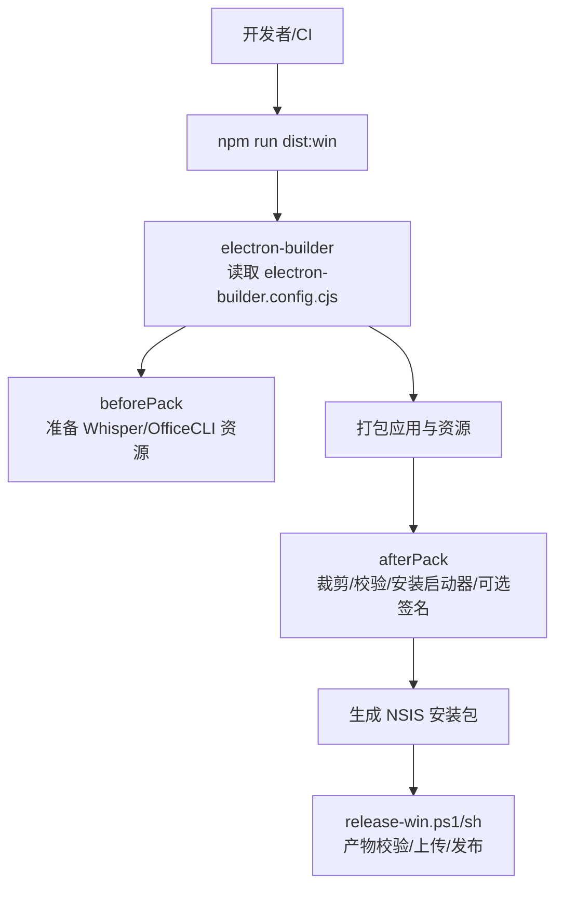
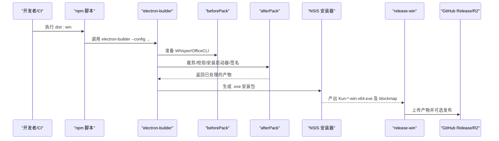
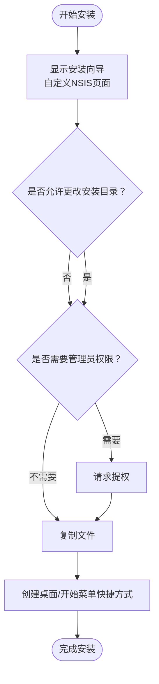
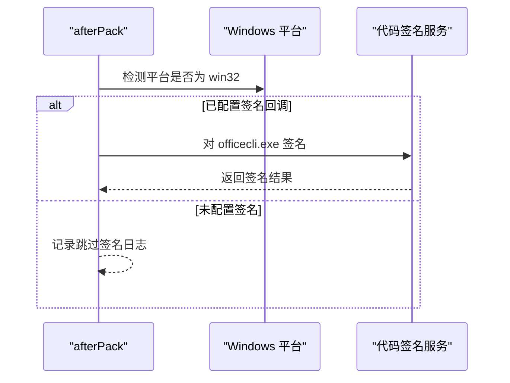
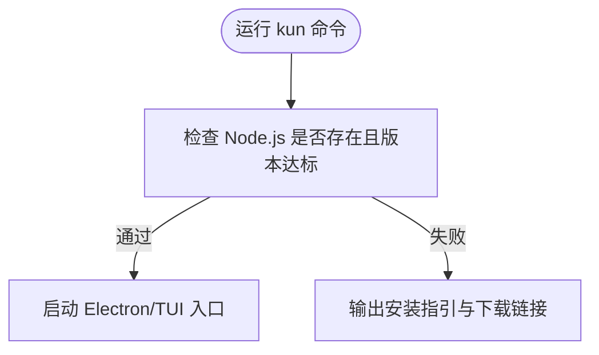
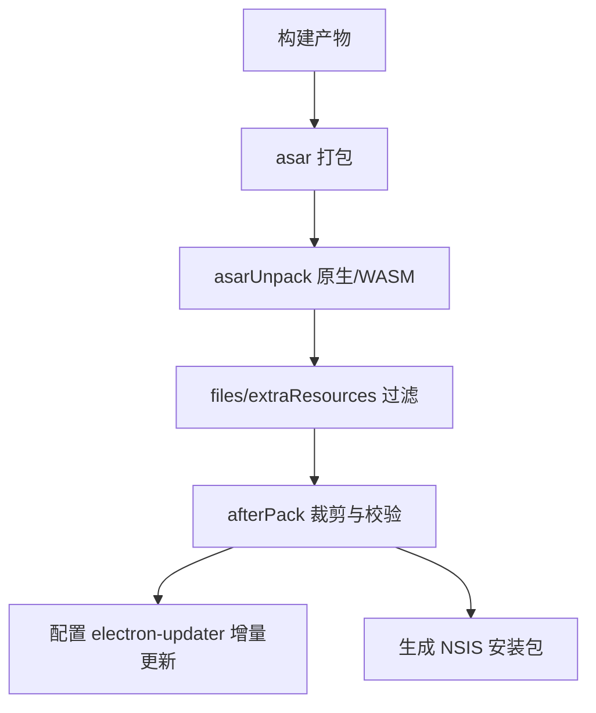
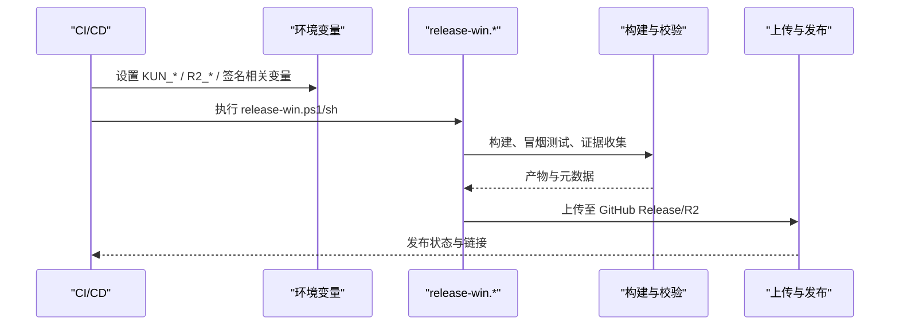
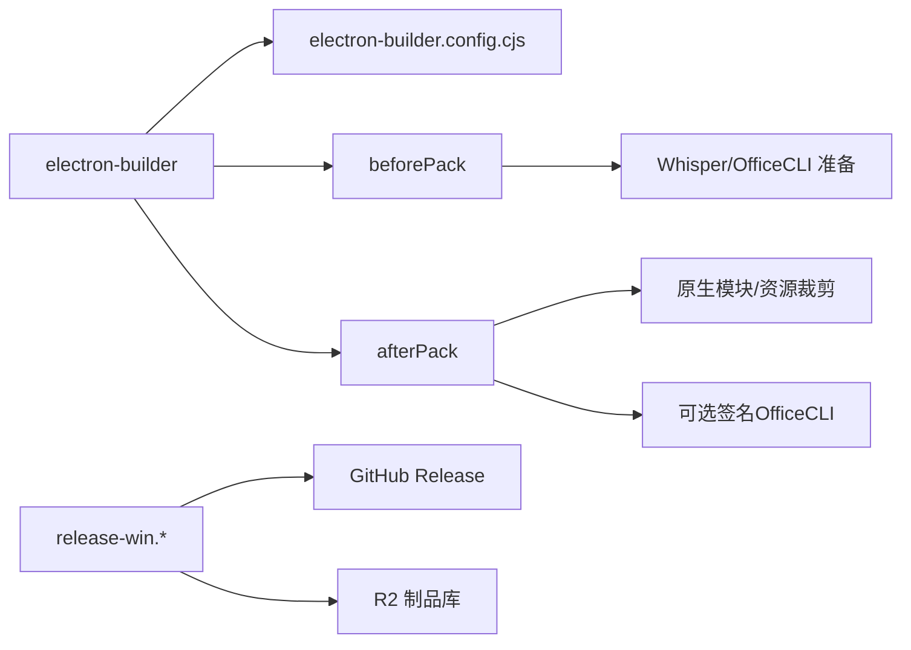

# Windows平台打包

<cite>
**本文引用的文件**
- [electron-builder.config.cjs](file://electron-builder.config.cjs)
- [package.json](file://package.json)
- [scripts/release-win.ps1](file://scripts/release-win.ps1)
- [scripts/release-win.sh](file://scripts/release-win.sh)
- [scripts/before-pack.cjs](file://scripts/before-pack.cjs)
- [scripts/after-pack.cjs](file://scripts/after-pack.cjs)
- [scripts/check-windows-installer-syntax.cjs](file://scripts/check-windows-installer-syntax.cjs)
</cite>

## 目录
1. [简介](#简介)
2. [项目结构](#项目结构)
3. [核心组件](#核心组件)
4. [架构总览](#架构总览)
5. [详细组件分析](#详细组件分析)
6. [依赖关系分析](#依赖关系分析)
7. [性能与体积优化](#性能与体积优化)
8. [故障排除指南](#故障排除指南)
9. [结论](#结论)
10. [附录：环境变量与CI/CD集成](#附录环境变量与cicd集成)

## 简介
本文件面向DeepSeek-GUI在Windows平台的打包与发布，聚焦以下目标：
- NSIS安装包配置选项：界面定制、安装目录策略、快捷方式创建与卸载行为。
- 数字签名流程：代码签名证书配置、验证步骤与注意事项（含内置OfficeCLI可执行文件的签名）。
- Windows兼容性设置：UAC权限处理、系统依赖检查与环境适配。
- 安装包优化：文件压缩、按需资源裁剪、增量更新与卸载程序配置。
- 构建环境变量与CI/CD集成：本地与流水线环境准备、产物上传与发布流程。
- 常见问题排查：权限问题、依赖缺失、兼容性问题等。

## 项目结构
本项目使用Electron + electron-builder进行跨平台打包，Windows端采用NSIS生成安装包。关键入口与脚本如下：
- 打包配置：electron-builder.config.cjs
- 构建脚本：scripts/before-pack.cjs、scripts/after-pack.cjs
- Windows发布脚本：scripts/release-win.ps1（PowerShell）与 scripts/release-win.sh（Bash/MSYS）
- 包脚本定义：package.json中的dist:win等命令
- 安装器语法校验：scripts/check-windows-installer-syntax.cjs

图表来源
- [electron-builder.config.cjs:236-294](file://electron-builder.config.cjs#L236-L294)
- [scripts/before-pack.cjs:19-56](file://scripts/before-pack.cjs#L19-L56)
- [scripts/after-pack.cjs:750-764](file://scripts/after-pack.cjs#L750-L764)
- [scripts/release-win.ps1:201-279](file://scripts/release-win.ps1#L201-L279)

章节来源
- [electron-builder.config.cjs:113-294](file://electron-builder.config.cjs#L113-L294)
- [package.json:63-79](file://package.json#L63-L79)

## 核心组件
- 打包配置（electron-builder.config.cjs）
  - 指定Windows目标为NSIS，x64架构；设置语言包、图标、快捷方式、卸载名等。
  - 通过nsis.include引入自定义NSIS脚本以增强安装体验。
  - beforePack/afterPack钩子用于资源准备与产物后处理。
- 预打包脚本（scripts/before-pack.cjs）
  - 根据目标平台与架构准备Whisper运行器与OfficeCLI二进制。
- 后打包脚本（scripts/after-pack.cjs）
  - 裁剪不必要的依赖与资源，校验产物完整性，安装CLI启动器，必要时对OfficeCLI进行签名。
- Windows发布脚本（scripts/release-win.ps1 / release-win.sh）
  - 统一版本与通道，执行构建、冒烟测试、证据收集、上传至GitHub Release与R2，并可选择发布。

章节来源
- [electron-builder.config.cjs:267-294](file://electron-builder.config.cjs#L267-L294)
- [scripts/before-pack.cjs:19-56](file://scripts/before-pack.cjs#L19-L56)
- [scripts/after-pack.cjs:750-764](file://scripts/after-pack.cjs#L750-L764)
- [scripts/release-win.ps1:15-25](file://scripts/release-win.ps1#L15-L25)

## 架构总览
下图展示Windows打包从构建到发布的端到端流程，包括NSIS安装包的生成与后续产物管理。

图表来源
- [package.json:63-79](file://package.json#L63-L79)
- [electron-builder.config.cjs:236-294](file://electron-builder.config.cjs#L236-L294)
- [scripts/before-pack.cjs:19-56](file://scripts/before-pack.cjs#L19-L56)
- [scripts/after-pack.cjs:750-764](file://scripts/after-pack.cjs#L750-L764)
- [scripts/release-win.ps1:201-279](file://scripts/release-win.ps1#L201-L279)

## 详细组件分析

### NSIS安装包配置与界面定制
- 目标与架构
  - Windows目标为NSIS，仅x64架构。
- 安装界面与交互
  - 非一键安装，允许用户选择安装路径（默认关闭“允许更改安装目录”由自定义NSIS页面接管），支持提权安装。
  - 通过include引入build/installer.nsh实现更丰富的安装页与迁移逻辑。
- 快捷方式与卸载
  - 桌面快捷方式始终创建，开始菜单快捷方式启用，卸载显示名称与应用名一致。
  - 卸载时不删除应用数据目录，便于升级保留用户配置。
- 图标与语言
  - 使用多尺寸ico作为应用图标，确保桌面/任务栏/开始菜单清晰显示。
  - 注入Chromium多语言包，提升界面本地化能力。

图表来源
- [electron-builder.config.cjs:267-294](file://electron-builder.config.cjs#L267-L294)

章节来源
- [electron-builder.config.cjs:267-294](file://electron-builder.config.cjs#L267-L294)

### 数字签名流程（代码签名证书与验证）
- 应用签名
  - macOS侧有明确的签名与公证流程；Windows侧未强制要求应用签名，但建议在生产环境配置代码签名以提升可信度。
- 内置OfficeCLI可执行文件签名
  - afterPack中针对Windows平台检测packager的signIf回调，若可用则对officecli.exe进行签名；否则跳过并记录日志。
- 验证步骤
  - 可在CI中增加签名验证步骤（例如使用signtool或第三方工具）确认签名链有效。
  - 结合release流程，将签名后的产物一并上传至Release与R2。

图表来源
- [scripts/after-pack.cjs:478-493](file://scripts/after-pack.cjs#L478-L493)

章节来源
- [scripts/after-pack.cjs:478-493](file://scripts/after-pack.cjs#L478-L493)

### Windows兼容性设置（UAC、依赖与环境）
- UAC权限处理
  - 安装器允许提权（allowElevation），并在需要时请求管理员权限，确保写入系统级位置或注册表项成功。
- 系统依赖检查
  - CLI启动器在安装后提供命令行入口，首次运行时会检查Node.js是否满足最低版本要求，如缺失则给出明确提示与安装指引。
- 环境适配
  - 通过beforePack/afterPack在不同平台下准备特定资源（如Whisper、OfficeCLI），并对可执行权限进行修正，保证终端功能正常。

图表来源
- [scripts/after-pack.cjs:591-631](file://scripts/after-pack.cjs#L591-L631)

章节来源
- [electron-builder.config.cjs:267-294](file://electron-builder.config.cjs#L267-L294)
- [scripts/after-pack.cjs:591-631](file://scripts/after-pack.cjs#L591-L631)

### 安装包优化策略（压缩、增量更新、卸载程序）
- 文件压缩与打包
  - 使用asar打包应用，并通过asarUnpack列出必须解包的原生模块与WASM资源，避免运行时加载失败。
  - files白名单与extraResources精确控制纳入包的内容，减少冗余。
- 增量更新
  - 通过electron-updater与generic provider指向更新服务器URL，配合blockmap实现增量更新。
- 卸载程序配置
  - 卸载显示名称与应用名一致；默认不删除用户数据目录，保障升级安全。
- 体积裁剪
  - afterPack会移除不必要的构建中间产物、非目标平台资源与大型可选依赖，显著减小安装包体积。

图表来源
- [electron-builder.config.cjs:122-192](file://electron-builder.config.cjs#L122-L192)
- [electron-builder.config.cjs:225-235](file://electron-builder.config.cjs#L225-L235)
- [scripts/after-pack.cjs:215-262](file://scripts/after-pack.cjs#L215-L262)

章节来源
- [electron-builder.config.cjs:122-192](file://electron-builder.config.cjs#L122-L192)
- [electron-builder.config.cjs:225-235](file://electron-builder.config.cjs#L225-L235)
- [scripts/after-pack.cjs:215-262](file://scripts/after-pack.cjs#L215-L262)

### 构建环境变量与CI/CD集成
- 本地与CI环境变量
  - 支持KUN_*前缀与旧DEEPSEEK_GUI_*前缀的兼容读取，便于平滑迁移。
  - 关键变量包括：KUN_RELEASE_ENV、KUN_UPDATE_CHANNEL、KUN_APP_VERSION、KUN_ARTIFACT_VERSION、R2_PUBLIC_BASE_URL、R2_RELEASE_PREFIX等。
- 发布流程
  - PowerShell/Bash脚本统一版本与通道，执行构建、冒烟测试、证据收集、上传至GitHub Release与R2，并可选择发布。
  - 构建缓存目录ELECTRON_BUILDER_CACHE可配置，加速重复构建。
- CI集成建议
  - 在CI中安装Node/npm/gh CLI，设置仓库认证，执行release-win脚本，并将产物归档。
  - 如需签名，注入签名证书与密码环境变量，并确保afterPack能访问签名回调。

图表来源
- [electron-builder.config.cjs:7-13](file://electron-builder.config.cjs#L7-L13)
- [electron-builder.config.cjs:15-43](file://electron-builder.config.cjs#L15-L43)
- [scripts/release-win.ps1:54-81](file://scripts/release-win.ps1#L54-L81)
- [scripts/release-win.ps1:178-179](file://scripts/release-win.ps1#L178-L179)

章节来源
- [electron-builder.config.cjs:7-13](file://electron-builder.config.cjs#L7-L13)
- [electron-builder.config.cjs:15-43](file://electron-builder.config.cjs#L15-L43)
- [scripts/release-win.ps1:54-81](file://scripts/release-win.ps1#L54-L81)
- [scripts/release-win.ps1:178-179](file://scripts/release-win.ps1#L178-L179)

## 依赖关系分析
- 打包阶段依赖
  - electron-builder负责整体打包流程，通过配置文件驱动各平台目标。
  - beforePack/afterPack钩子扩展构建生命周期，完成资源准备与产物校验。
- 运行时依赖
  - 原生模块（如better-sqlite3、node-pty、@computer-use/*、sharp等）需asarUnpack以避免加载失败。
  - Tesseract.js核心与模型按目标裁剪，减少体积。
- 外部依赖
  - GitHub CLI（gh）用于Release上传；R2脚本用于制品管理与发布。

图表来源
- [electron-builder.config.cjs:236-294](file://electron-builder.config.cjs#L236-L294)
- [scripts/before-pack.cjs:19-56](file://scripts/before-pack.cjs#L19-L56)
- [scripts/after-pack.cjs:750-764](file://scripts/after-pack.cjs#L750-L764)
- [scripts/release-win.ps1:201-279](file://scripts/release-win.ps1#L201-L279)

章节来源
- [electron-builder.config.cjs:236-294](file://electron-builder.config.cjs#L236-L294)
- [scripts/release-win.ps1:201-279](file://scripts/release-win.ps1#L201-L279)

## 性能与体积优化
- 资源裁剪
  - 移除Claude Code二进制包（按需下载）、Tesseract非LSTM核心、better-sqlite3构建中间产物等。
- 按需加载
  - 部分大型依赖通过运行时按需获取，降低安装包体积。
- 语言包精简
  - 仅包含必要的Chromium语言包，减少国际化资源体积。
- 增量更新
  - 启用blockmap与generic provider，支持增量更新，缩短升级时间。

章节来源
- [scripts/after-pack.cjs:215-262](file://scripts/after-pack.cjs#L215-L262)
- [electron-builder.config.cjs:122-192](file://electron-builder.config.cjs#L122-L192)
- [electron-builder.config.cjs:225-235](file://electron-builder.config.cjs#L225-L235)

## 故障排除指南
- 权限问题
  - 现象：安装或运行时报权限不足。
  - 处理：确认安装器允许提权；在需要写入系统目录时以管理员身份运行；检查UAC策略。
- 依赖缺失
  - 现象：终端无法启动或某些功能不可用。
  - 处理：安装Node.js并确保版本满足最低要求；检查asarUnpack列表是否包含必需的原生模块；确认Whisper/OfficeCLI资源已正确准备。
- 兼容性问题
  - 现象：在某些Windows版本上安装失败或运行异常。
  - 处理：使用最新版本的electron-builder与NSIS；检查系统语言包与区域设置；在CI中使用稳定的Windows镜像。
- 安装器语法错误
  - 现象：构建时报PowerShell解析错误。
  - 处理：使用check-windows-installer-syntax脚本定位错误行；修复installer.nsh或相关脚本。

章节来源
- [scripts/check-windows-installer-syntax.cjs:28-95](file://scripts/check-windows-installer-syntax.cjs#L28-L95)
- [scripts/after-pack.cjs:591-631](file://scripts/after-pack.cjs#L591-L631)
- [electron-builder.config.cjs:267-294](file://electron-builder.config.cjs#L267-L294)

## 结论
本项目基于electron-builder与NSIS实现了稳定、可维护的Windows打包流程。通过beforePack/afterPack钩子与release脚本，完成了资源准备、产物校验、增量更新与发布闭环。建议在生产环境中启用代码签名，并结合CI/CD实现自动化构建与发布，同时持续监控安装包体积与更新效率。

## 附录：环境变量与CI/CD集成
- 关键环境变量
  - KUN_RELEASE_ENV：本地发布环境文件路径（兼容旧前缀）。
  - KUN_UPDATE_CHANNEL：更新通道（stable/frontier）。
  - KUN_APP_VERSION / KUN_ARTIFACT_VERSION：应用与制品版本号。
  - R2_PUBLIC_BASE_URL / R2_RELEASE_PREFIX：更新服务器地址与制品前缀。
- CI/CD建议
  - 安装Node.js、npm、gh CLI；设置仓库认证。
  - 执行release-win脚本，传入Tag与Channel，完成构建、校验、上传与发布。
  - 如需签名，注入签名证书与密码，并确保afterPack能访问签名回调。

章节来源
- [electron-builder.config.cjs:7-13](file://electron-builder.config.cjs#L7-L13)
- [electron-builder.config.cjs:15-43](file://electron-builder.config.cjs#L15-L43)
- [scripts/release-win.ps1:54-81](file://scripts/release-win.ps1#L54-L81)
- [scripts/release-win.ps1:178-179](file://scripts/release-win.ps1#L178-L179)