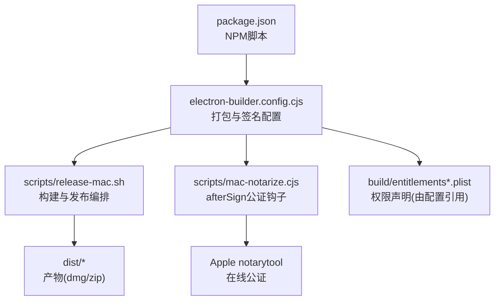
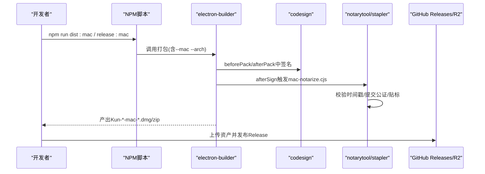
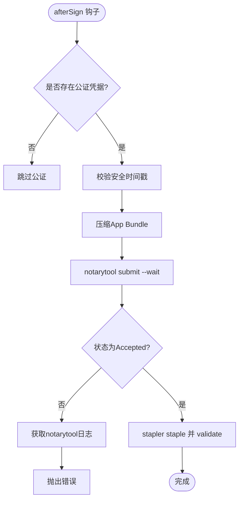
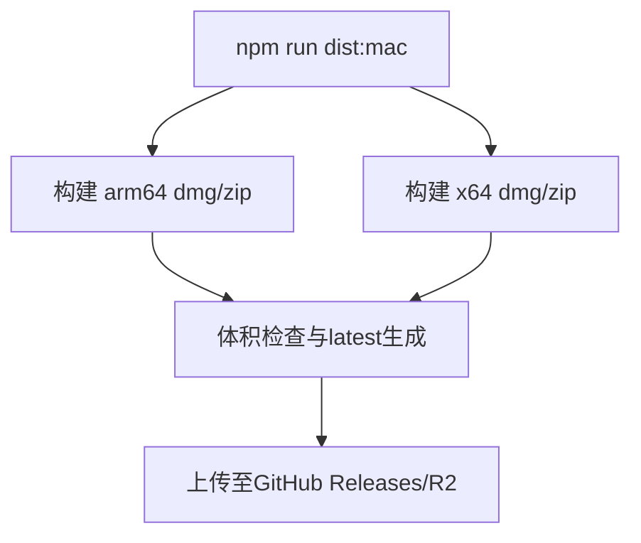
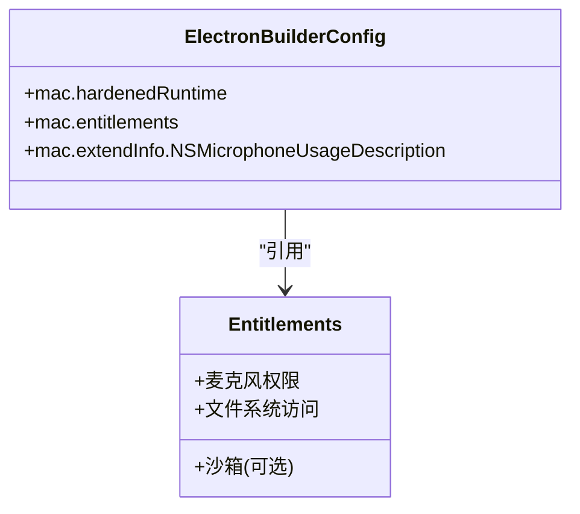
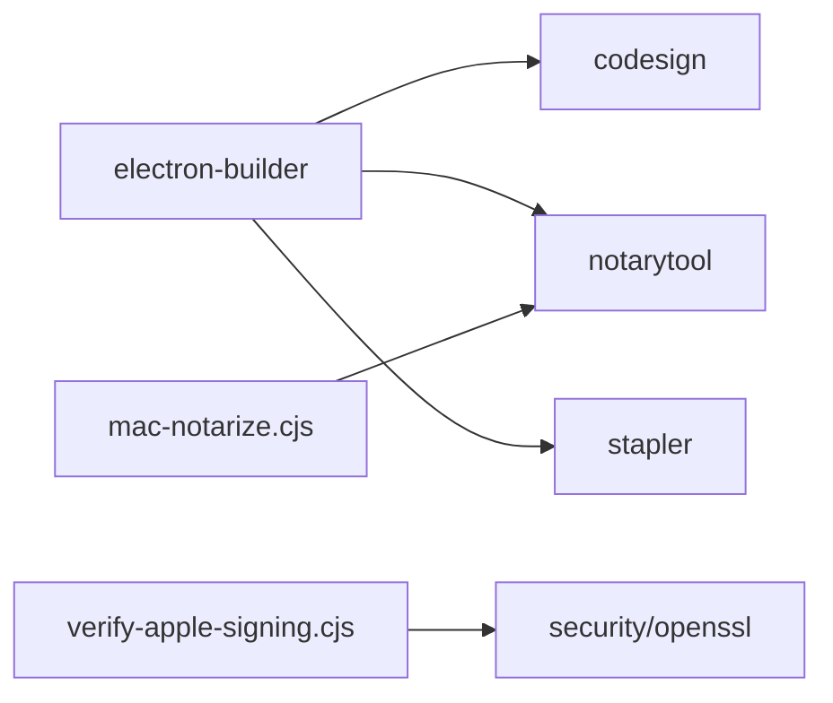

# macOS平台打包

<cite>
**本文引用的文件**
- [electron-builder.config.cjs](file://electron-builder.config.cjs)
- [package.json](file://package.json)
- [scripts/release-mac.sh](file://scripts/release-mac.sh)
- [scripts/mac-notarize.cjs](file://scripts/mac-notarize.cjs)
- [scripts/verify-apple-signing.cjs](file://scripts/verify-apple-signing.cjs)
- [scripts/mac-unquarantine.sh](file://scripts/mac-unquarantine.sh)
- [scripts/release-all-mac.sh](file://scripts/release-all-mac.sh)
- [scripts/release.local.env.example](file://scripts/release.local.env.example)
</cite>

## 目录
1. [简介](#简介)
2. [项目结构](#项目结构)
3. [核心组件](#核心组件)
4. [架构总览](#架构总览)
5. [详细组件分析](#详细组件分析)
6. [依赖关系分析](#依赖关系分析)
7. [性能与体积考量](#性能与体积考量)
8. [故障排查指南](#故障排查指南)
9. [结论](#结论)
10. [附录：环境变量清单](#附录环境变量清单)

## 简介
本文件面向DeepSeek-GUI在macOS平台的打包、签名、公证与发布全流程，覆盖以下主题：
- 开发者证书配置与代码签名
- Apple公证（notarytool）与自动化流程
- App Store发布准备（元数据、截图、审核要点）
- 通用二进制策略（Intel x64与Apple Silicon arm64）
- macOS权限配置（麦克风、文件系统、沙箱）
- 构建脚本与环境变量
- 常见问题定位与解决

## 项目结构
本项目基于Electron + electron-builder进行桌面端打包。macOS相关的关键位置如下：
- 打包配置：electron-builder.config.cjs
- 构建脚本与流水线：scripts/release-mac.sh、scripts/release-all-mac.sh
- 签名验证与公证：scripts/mac-notarize.cjs、scripts/verify-apple-signing.cjs
- 解除隔离：scripts/mac-unquarantine.sh
- 环境变量模板：scripts/release.local.env.example
- NPM脚本入口：package.json

图表来源
- [electron-builder.config.cjs:236-262](file://electron-builder.config.cjs#L236-L262)
- [scripts/release-mac.sh:80-83](file://scripts/release-mac.sh#L80-L83)
- [scripts/mac-notarize.cjs:116-182](file://scripts/mac-notarize.cjs#L116-L182)

章节来源
- [electron-builder.config.cjs:1-324](file://electron-builder.config.cjs#L1-L324)
- [package.json:14-88](file://package.json#L14-L88)

## 核心组件
- 打包配置中心：electron-builder.config.cjs
  - 定义应用标识、资源、目标平台与产物格式
  - 启用macOS硬运行时、时间戳、权限列表与扩展信息
  - 通过beforePack/afterPack/afterSign接入自定义逻辑
- 发布编排脚本：scripts/release-mac.sh
  - 串行构建x64与arm64，执行冒烟测试，生成GitHub Release并上传资产
  - 支持R2元数据上传与通道选择
- 公证钩子：scripts/mac-notarize.cjs
  - 读取API密钥凭证，校验签名时间戳，提交notarytool，stapler贴标
- 签名验证工具：scripts/verify-apple-signing.cjs
  - 校验P12/P8、导入临时keychain、可选在线验证notarytool凭据
- 解除隔离：scripts/mac-unquarantine.sh
  - 移除下载后的隔离属性，便于本地运行未公证包

章节来源
- [electron-builder.config.cjs:45-56](file://electron-builder.config.cjs#L45-L56)
- [electron-builder.config.cjs:236-262](file://electron-builder.config.cjs#L236-L262)
- [scripts/release-mac.sh:80-83](file://scripts/release-mac.sh#L80-L83)
- [scripts/mac-notarize.cjs:6-30](file://scripts/mac-notarize.cjs#L6-L30)
- [scripts/verify-apple-signing.cjs:317-388](file://scripts/verify-apple-signing.cjs#L317-L388)
- [scripts/mac-unquarantine.sh:1-11](file://scripts/mac-unquarantine.sh#L1-L11)

## 架构总览
下图展示从构建到发布的整体流程，包括签名、公证与产物归档。

图表来源
- [package.json:63-78](file://package.json#L63-L78)
- [electron-builder.config.cjs:236-262](file://electron-builder.config.cjs#L236-L262)
- [scripts/mac-notarize.cjs:116-182](file://scripts/mac-notarize.cjs#L116-L182)
- [scripts/release-mac.sh:196-200](file://scripts/release-mac.sh#L196-L200)

## 详细组件分析

### 代码签名与公证流程
- 签名开关与凭据
  - 当存在显式签名环境时启用硬运行时、强制签名与时间戳；否则跳过以加速开发。
  - 公证凭据来自APPLE_API_KEY_ID、APPLE_API_ISSUER、APPLE_API_KEY或APPLE_API_KEY_BASE64。
- 公证步骤
  - 校验App Bundle的深签与严格模式
  - 收集需公证的二进制与bundle
  - 使用notarytool提交并等待结果，失败时拉取开发者日志
  - 使用stapler贴标并验证

图表来源
- [scripts/mac-notarize.cjs:6-30](file://scripts/mac-notarize.cjs#L6-L30)
- [scripts/mac-notarize.cjs:99-114](file://scripts/mac-notarize.cjs#L99-L114)
- [scripts/mac-notarize.cjs:134-179](file://scripts/mac-notarize.cjs#L134-L179)

章节来源
- [electron-builder.config.cjs:45-56](file://electron-builder.config.cjs#L45-L56)
- [electron-builder.config.cjs:236-262](file://electron-builder.config.cjs#L236-L262)
- [scripts/mac-notarize.cjs:116-182](file://scripts/mac-notarize.cjs#L116-L182)

### 通用二进制与多架构打包
- 目标架构
  - 同时输出arm64与x64的dmg与zip，适配Apple Silicon与Intel Mac。
- 构建顺序
  - 发布脚本按架构串行构建，确保原生依赖正确编译与验证。
- 产物命名
  - 遵循Kun-${version}-mac-${arch}.dmg|zip约定，便于后续上传与分发。

图表来源
- [electron-builder.config.cjs:258-262](file://electron-builder.config.cjs#L258-L262)
- [scripts/release-mac.sh:80-83](file://scripts/release-mac.sh#L80-L83)
- [scripts/release-mac.sh:256-262](file://scripts/release-mac.sh#L256-L262)

章节来源
- [electron-builder.config.cjs:258-262](file://electron-builder.config.cjs#L258-L262)
- [scripts/release-mac.sh:80-83](file://scripts/release-mac.sh#L80-L83)
- [scripts/release-mac.sh:256-262](file://scripts/release-mac.sh#L256-L262)

### 权限与沙箱配置
- 权限声明
  - 通过entitlements与extendInfo声明系统能力，例如麦克风访问说明。
- 硬运行时
  - 启用hardenedRuntime以获得更严格的执行策略，配合公证提升Gatekeeper通过率。
- 沙箱限制
  - 当前配置未启用App Sandbox；如需上架App Store，需在entitlements中开启并调整权限。

图表来源
- [electron-builder.config.cjs:246-255](file://electron-builder.config.cjs#L246-L255)

章节来源
- [electron-builder.config.cjs:246-255](file://electron-builder.config.cjs#L246-L255)

### App Store发布准备
- 元数据
  - 应用ID、产品名称、版本与更新通道由配置与NPM脚本注入。
- 截图要求
  - 建议提供不同分辨率的预览图，满足App Store审查与展示需求。
- 审核指南
  - 若启用沙箱，需确保所有敏感权限均有合理用途并在隐私描述中说明。
  - 保持最小权限原则，避免不必要的系统接口调用。

章节来源
- [electron-builder.config.cjs:113-121](file://electron-builder.config.cjs#L113-L121)
- [electron-builder.config.cjs:314-322](file://electron-builder.config.cjs#L314-L322)

### 构建脚本详解与环境变量
- 常用命令
  - 本地构建：npm run dist:mac
  - 带签名构建：MAC_SIGN=1 npm run dist:mac
  - 仅构建指定架构：npm run dist:mac:x64 / npm run dist:mac:arm64
  - 完整发布：npm run release:mac
- 关键环境变量
  - 签名：CSC_LINK/CSC_NAME/CSC_KEY_PASSWORD/MAC_SIGN
  - 公证：APPLE_API_KEY_ID/APPLE_API_ISSUER/APPLE_API_KEY(APPLE_API_KEY_BASE64)
  - 渠道与版本：KUN_UPDATE_CHANNEL/KUN_APP_VERSION/KUN_ARTIFACT_VERSION
  - 存储与域名：R2_PUBLIC_BASE_URL/R2_RELEASE_PREFIX
- 本地环境文件
  - 可复制release.local.env.example到scripts/release.local.env进行本地覆盖

章节来源
- [package.json:63-88](file://package.json#L63-L88)
- [electron-builder.config.cjs:15-43](file://electron-builder.config.cjs#L15-L43)
- [scripts/release.local.env.example:1-25](file://scripts/release.local.env.example#L1-L25)

## 依赖关系分析
- 构建阶段依赖
  - electron-builder负责打包、签名与产物生成
  - 脚本层通过beforePack/afterPack/afterSign注入自定义逻辑
- 外部工具链
  - codesign用于签名与校验
  - notarytool用于在线公证
  - stapler用于贴标
  - security/openssl用于证书与钥匙串操作

图表来源
- [electron-builder.config.cjs:236-262](file://electron-builder.config.cjs#L236-L262)
- [scripts/mac-notarize.cjs:116-182](file://scripts/mac-notarize.cjs#L116-L182)
- [scripts/verify-apple-signing.cjs:317-388](file://scripts/verify-apple-signing.cjs#L317-L388)

章节来源
- [electron-builder.config.cjs:236-262](file://electron-builder.config.cjs#L236-L262)
- [scripts/mac-notarize.cjs:116-182](file://scripts/mac-notarize.cjs#L116-L182)
- [scripts/verify-apple-signing.cjs:317-388](file://scripts/verify-apple-signing.cjs#L317-L388)

## 性能与体积考量
- 产物体积
  - 通过asar与asarUnpack控制打包范围，剥离调试符号与不必要文件
  - 对原生模块与WASM等必须外置的资源进行白名单管理
- 构建速度
  - 开发模式关闭签名与公证以提升迭代效率
  - 并行上传与并发控制优化发布阶段吞吐

章节来源
- [electron-builder.config.cjs:122-158](file://electron-builder.config.cjs#L122-L158)
- [scripts/release-mac.sh:264-304](file://scripts/release-mac.sh#L264-L304)

## 故障排查指南
- 签名失败
  - 检查P12密码与CN类型是否匹配Developer ID Application
  - 使用verify-apple-signing.cjs进行本地验证
- 公证拒绝
  - 确认已启用时间戳与硬运行时
  - 查看notarytool日志URL定位问题
- 权限错误
  - 核对entitlements与extendInfo中的权限描述
  - 若启用了沙箱，确保所有必要权限均已声明
- Gatekeeper拦截
  - 首次运行被阻止时，可使用mac-unquarantine.sh移除隔离属性
- 架构不匹配
  - 确保原生依赖针对对应架构构建并通过验证

章节来源
- [scripts/verify-apple-signing.cjs:317-388](file://scripts/verify-apple-signing.cjs#L317-L388)
- [scripts/mac-notarize.cjs:99-114](file://scripts/mac-notarize.cjs#L99-L114)
- [scripts/mac-notarize.cjs:141-175](file://scripts/mac-notarize.cjs#L141-L175)
- [scripts/mac-unquarantine.sh:1-11](file://scripts/mac-unquarantine.sh#L1-L11)
- [electron-builder.config.cjs:246-255](file://electron-builder.config.cjs#L246-L255)

## 结论
本项目提供了完善的macOS打包、签名与公证方案，支持双架构产物与自动化发布。通过合理的权限声明与硬运行时配置，可在非App Store渠道获得良好的用户体验。若计划上架App Store，建议在entitlements中启用沙箱并按审核指南调整权限与隐私描述。

## 附录：环境变量清单
- 签名相关
  - CSC_LINK、CSC_NAME、CSC_KEY_PASSWORD、MAC_SIGN
- 公证相关
  - APPLE_API_KEY_ID、APPLE_API_ISSUER、APPLE_API_KEY或APPLE_API_KEY_BASE64
- 版本与渠道
  - KUN_APP_VERSION、KUN_ARTIFACT_VERSION、KUN_UPDATE_CHANNEL
- 存储与域名
  - R2_PUBLIC_BASE_URL、R2_RELEASE_PREFIX
- 本地覆盖
  - scripts/release.local.env（从release.local.env.example复制）

章节来源
- [scripts/release.local.env.example:1-25](file://scripts/release.local.env.example#L1-L25)
- [electron-builder.config.cjs:15-43](file://electron-builder.config.cjs#L15-L43)
- [scripts/release-mac.sh:38-46](file://scripts/release-mac.sh#L38-L46)