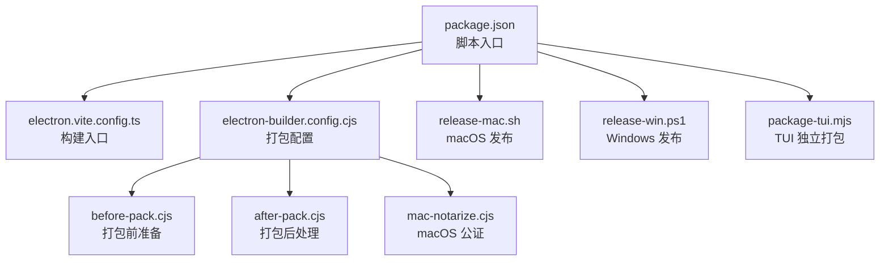
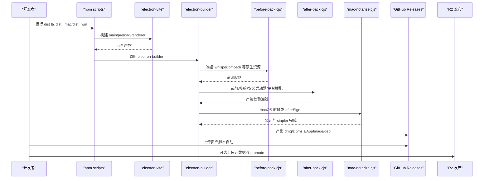
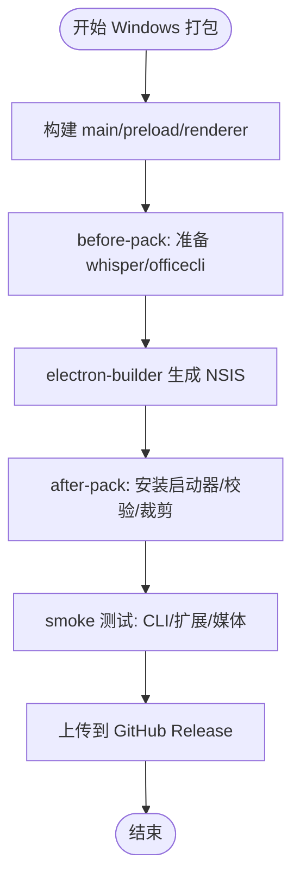
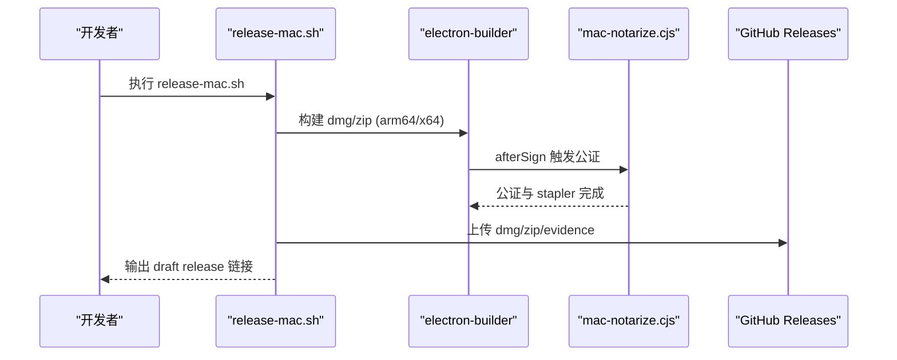
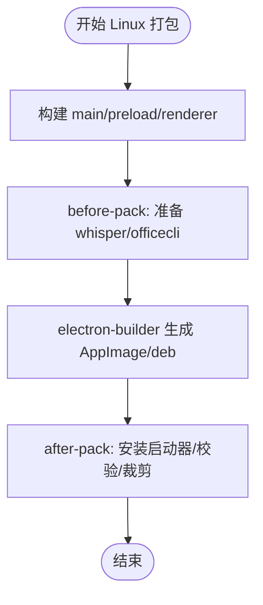
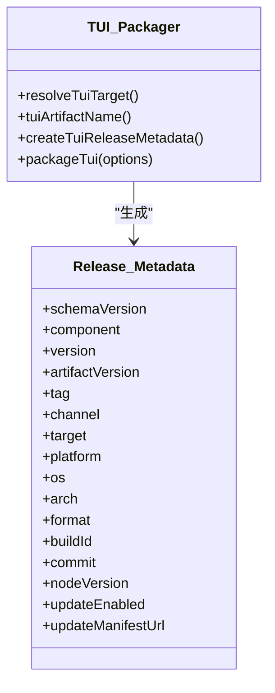
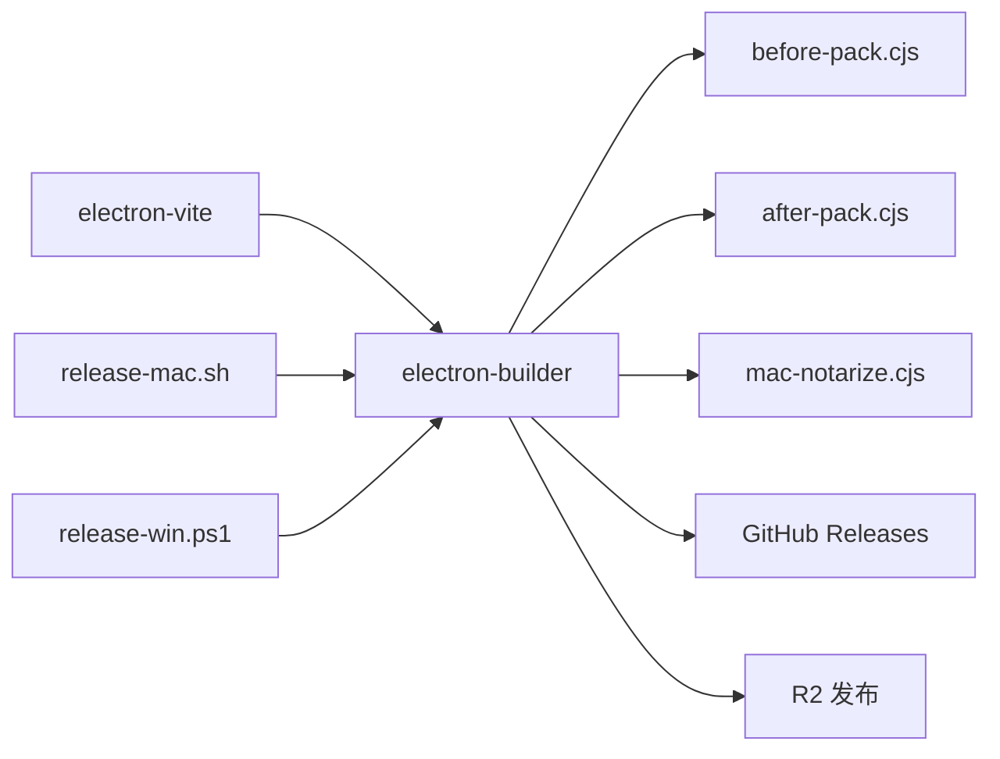

# 多平台打包

<cite>
**本文引用的文件**
- [package.json](file://package.json)
- [electron-builder.config.cjs](file://electron-builder.config.cjs)
- [electron.vite.config.ts](file://electron.vite.config.ts)
- [scripts/before-pack.cjs](file://scripts/before-pack.cjs)
- [scripts/after-pack.cjs](file://scripts/after-pack.cjs)
- [scripts/mac-notarize.cjs](file://scripts/mac-notarize.cjs)
- [scripts/release-mac.sh](file://scripts/release-mac.sh)
- [scripts/release-win.ps1](file://scripts/release-win.ps1)
- [scripts/package-tui.mjs](file://scripts/package-tui.mjs)
- [scripts/electron-native-build-env.cjs](file://scripts/electron-native-build-env.cjs)
- [scripts/ensure-macos-native-dependencies.cjs](file://scripts/ensure-macos-native-dependencies.cjs)
</cite>

## 目录
1. [简介](#简介)
2. [项目结构](#项目结构)
3. [核心组件](#核心组件)
4. [架构总览](#架构总览)
5. [详细组件分析](#详细组件分析)
6. [依赖分析](#依赖分析)
7. [性能考虑](#性能考虑)
8. [故障排除指南](#故障排除指南)
9. [结论](#结论)
10. [附录](#附录)

## 简介
本文件面向 DeepSeek-GUI（Kun）的多平台打包与发布，覆盖 Windows、macOS、Linux 以及 TUI 独立版本。内容基于仓库中的构建脚本与 electron-builder 配置，提供从构建产物到签名、公证、分发与验证的完整流程说明，并给出跨平台测试与问题排查建议。

## 项目结构
本项目使用 electron-vite 进行前端与主进程构建，通过 electron-builder 完成各平台安装包生成；同时提供 macOS、Windows 的发布脚本与 TUI 独立打包脚本。关键入口如下：
- 应用构建与打包命令集中在 package.json 的 scripts 中
- electron-builder 配置位于 electron-builder.config.cjs
- Vite 构建入口在 electron.vite.config.ts
- 打包前后处理逻辑在 before-pack.cjs 与 after-pack.cjs
- macOS 公证与签名在 mac-notarize.cjs
- 平台发布脚本：release-mac.sh、release-win.ps1
- TUI 独立打包：package-tui.mjs

**图表来源**
- [package.json:14-88](file://package.json#L14-L88)
- [electron.vite.config.ts:5-53](file://electron.vite.config.ts#L5-L53)
- [electron-builder.config.cjs:113-323](file://electron-builder.config.cjs#L113-L323)
- [scripts/before-pack.cjs:19-56](file://scripts/before-pack.cjs#L19-L56)
- [scripts/after-pack.cjs:750-764](file://scripts/after-pack.cjs#L750-L764)
- [scripts/mac-notarize.cjs:116-183](file://scripts/mac-notarize.cjs#L116-L183)
- [scripts/release-mac.sh:80-197](file://scripts/release-mac.sh#L80-L197)
- [scripts/release-win.ps1:178-239](file://scripts/release-win.ps1#L178-L239)
- [scripts/package-tui.mjs:113-222](file://scripts/package-tui.mjs#L113-L222)

**章节来源**
- [package.json:14-88](file://package.json#L14-L88)
- [electron.vite.config.ts:5-53](file://electron.vite.config.ts#L5-L53)
- [electron-builder.config.cjs:113-323](file://electron-builder.config.cjs#L113-L323)

## 核心组件
- 构建与打包编排：通过 npm scripts 串联 electron-vite 构建与 electron-builder 打包，统一输出到 dist 目录。
- 平台特定配置：electron-builder.config.cjs 定义 appId、productName、asar/unpack、extraResources、target、publish、beforePack/afterPack/afterSign 等。
- 原生模块与资源：before-pack 准备 whisper/officecli 等资源；after-pack 裁剪体积、校验产物、安装 CLI 启动器、处理 Linux 可执行包装。
- macOS 签名与公证：mac-notarize.cjs 在 afterSign 阶段执行，支持 API Key Base64 注入临时文件并提交 notarytool。
- 发布流水线：release-mac.sh 负责 macOS 构建、smoke 测试、创建 GitHub Release 并上传资产；release-win.ps1 负责 Windows NSIS 安装器构建、smoke 测试、上传资产与可选 R2 发布。
- TUI 独立打包：package-tui.mjs 生成跨平台 tar.gz/zip，包含 release.json 元数据与 sha256 校验文件。

**章节来源**
- [package.json:14-88](file://package.json#L14-L88)
- [electron-builder.config.cjs:113-323](file://electron-builder.config.cjs#L113-L323)
- [scripts/before-pack.cjs:19-56](file://scripts/before-pack.cjs#L19-L56)
- [scripts/after-pack.cjs:750-764](file://scripts/after-pack.cjs#L750-L764)
- [scripts/mac-notarize.cjs:116-183](file://scripts/mac-notarize.cjs#L116-L183)
- [scripts/release-mac.sh:80-197](file://scripts/release-mac.sh#L80-L197)
- [scripts/release-win.ps1:178-239](file://scripts/release-win.ps1#L178-L239)
- [scripts/package-tui.mjs:113-222](file://scripts/package-tui.mjs#L113-L222)

## 架构总览
下图展示了从构建到发布的整体流程，包括平台差异与关键钩子。

**图表来源**
- [package.json:63-78](file://package.json#L63-L78)
- [electron.vite.config.ts:5-53](file://electron.vite.config.ts#L5-L53)
- [electron-builder.config.cjs:225-306](file://electron-builder.config.cjs#L225-L306)
- [scripts/before-pack.cjs:19-56](file://scripts/before-pack.cjs#L19-L56)
- [scripts/after-pack.cjs:750-764](file://scripts/after-pack.cjs#L750-L764)
- [scripts/mac-notarize.cjs:116-183](file://scripts/mac-notarize.cjs#L116-L183)
- [scripts/release-mac.sh:203-346](file://scripts/release-mac.sh#L203-L346)
- [scripts/release-win.ps1:201-329](file://scripts/release-win.ps1#L201-L329)

## 详细组件分析

### Windows 平台打包
- 目标与产物：NSIS 安装器（x64），产物命名遵循 artifactName 模板。
- 安装器行为：非一键安装、允许提升权限、创建桌面与开始菜单快捷方式、卸载不删除用户数据。
- 资源与依赖：
  - extraResources 包含 whisper、officecli 等第三方资源。
  - asarUnpack 列出必须解包的原生模块与运行时资源（如 better-sqlite3、node-pty、sharp、tesseract.js 等）。
- 构建钩子：
  - before-pack 准备 whisper 与 officecli 二进制。
  - after-pack 安装 CLI 启动器（Windows .cmd）、校验产物、清理多余资源。
- 发布流程：
  - release-win.ps1 构建 NSIS 安装器，执行多项 smoke 测试，记录 native evidence，上传至 GitHub Release，并可同步 R2 元数据与 promote。
- 数字签名与兼容性：
  - 配置文件未启用强制签名；如需签名，需在环境变量中提供证书信息或通过 packager.signIf 回调（after-pack 中对 OfficeCLI 可执行文件签名）。
  - 兼容设置：NSIS 禁用修改安装目录、始终创建快捷方式、卸载保留用户数据。

**图表来源**
- [package.json:74-78](file://package.json#L74-L78)
- [electron-builder.config.cjs:267-294](file://electron-builder.config.cjs#L267-L294)
- [scripts/before-pack.cjs:19-56](file://scripts/before-pack.cjs#L19-L56)
- [scripts/after-pack.cjs:591-686](file://scripts/after-pack.cjs#L591-L686)
- [scripts/release-win.ps1:201-329](file://scripts/release-win.ps1#L201-L329)

**章节来源**
- [electron-builder.config.cjs:267-294](file://electron-builder.config.cjs#L267-L294)
- [scripts/before-pack.cjs:19-56](file://scripts/before-pack.cjs#L19-L56)
- [scripts/after-pack.cjs:591-686](file://scripts/after-pack.cjs#L591-L686)
- [scripts/release-win.ps1:201-329](file://scripts/release-win.ps1#L201-L329)

### macOS 平台打包
- 目标与产物：dmg 与 zip（arm64 与 x64），语言本地化按 Chromium Mac 语言列表。
- 签名与公证：
  - 若检测到显式签名身份或 MAC_SIGN=1，则启用 hardenedRuntime、forceCodeSigning、timestamp。
  - afterSign 调用 mac-notarize.cjs，支持 APPLE_API_KEY_BASE64 临时写入 p8 文件，提交 notarytool 并 staple。
- 资源与依赖：
  - extraResources 包含 whisper、officecli 等。
  - asarUnpack 确保原生模块与运行时资源不被压缩。
- 构建钩子：
  - before-pack 准备 whisper/officecli。
  - after-pack 安装 CLI 启动器、可能 ad-hoc 签名、校验产物、裁剪资源。
- 发布流程：
  - release-mac.sh 串行构建 arm64/x64，执行架构与扩展 smoke 测试，创建 GitHub Release 并上传资产，可选 R2 元数据上传。

**图表来源**
- [electron-builder.config.cjs:239-266](file://electron-builder.config.cjs#L239-L266)
- [scripts/mac-notarize.cjs:116-183](file://scripts/mac-notarize.cjs#L116-L183)
- [scripts/release-mac.sh:80-197](file://scripts/release-mac.sh#L80-L197)
- [scripts/release-mac.sh:203-346](file://scripts/release-mac.sh#L203-L346)

**章节来源**
- [electron-builder.config.cjs:239-266](file://electron-builder.config.cjs#L239-L266)
- [scripts/mac-notarize.cjs:116-183](file://scripts/mac-notarize.cjs#L116-L183)
- [scripts/release-mac.sh:80-197](file://scripts/release-mac.sh#L80-L197)
- [scripts/release-mac.sh:203-346](file://scripts/release-mac.sh#L203-L346)

### Linux 平台打包
- 目标与产物：AppImage 与 deb（x64），类别为 Development。
- 沙箱与启动器：
  - appImage 添加 --disable-setuid-sandbox 与 --no-first-run。
  - after-pack 将真实 Electron 可执行重命名为 *.electron-bin，并写入 shell 启动器以注入参数，兼容 AppImage 与 deb 入口。
- 资源与依赖：
  - extraResources 包含 whisper、officecli 等。
  - asarUnpack 确保原生模块与运行时资源不被压缩。
- 构建钩子：
  - before-pack 准备 whisper/officecli。
  - after-pack 安装 CLI 启动器、校验产物、裁剪资源。
- 发行版适配：
  - AppImage 适用于通用 Linux 环境。
  - deb 适用于 Debian/Ubuntu/openKylin 等期望 apt/software-store 包的环境。

**图表来源**
- [electron-builder.config.cjs:295-313](file://electron-builder.config.cjs#L295-L313)
- [scripts/before-pack.cjs:19-56](file://scripts/before-pack.cjs#L19-L56)
- [scripts/after-pack.cjs:702-730](file://scripts/after-pack.cjs#L702-L730)

**章节来源**
- [electron-builder.config.cjs:295-313](file://electron-builder.config.cjs#L295-L313)
- [scripts/before-pack.cjs:19-56](file://scripts/before-pack.cjs#L19-L56)
- [scripts/after-pack.cjs:702-730](file://scripts/after-pack.cjs#L702-L730)

### TUI 独立打包与分发
- 目标与产物：darwin-arm64/darwin-x64/linux-x64（tar.gz）、win32-x64（zip），文件名遵循 Kun-TUI-<artifactVersion>-<os>-<arch>.<format>。
- 构建要求：
  - 固定 Node 版本（TUI_NODE_VERSION），当前为 22.23.1。
  - 要求 host-native 构建，禁止跨架构打包。
- 产物结构：
  - bin/kun（或 kun.cmd）作为启动器，runtime/node 作为运行时。
  - release.json 包含版本、通道、目标、commit、buildId 等元数据。
  - 生成 .sha256 校验文件。
- 工作区依赖：
  - 复制 extension-api/provider-catalog/create-kun-extension 到 app/packages，并在 packaged kun 下安装依赖。
- 分发策略：
  - 与 GUI 发布协同，release-win.ps1 会检查 TUI 资产是否齐全，支持 R2 元数据上传与 promote。

**图表来源**
- [scripts/package-tui.mjs:31-111](file://scripts/package-tui.mjs#L31-L111)
- [scripts/package-tui.mjs:113-222](file://scripts/package-tui.mjs#L113-L222)

**章节来源**
- [scripts/package-tui.mjs:31-111](file://scripts/package-tui.mjs#L31-L111)
- [scripts/package-tui.mjs:113-222](file://scripts/package-tui.mjs#L113-L222)
- [scripts/release-win.ps1:293-307](file://scripts/release-win.ps1#L293-L307)

### 平台特定的依赖管理与原生模块处理
- asar 解包：electron-builder.config.cjs 明确列出需要 asarUnpack 的模块与资源，避免原生绑定无法加载。
- 原生模块重建：npmRebuild=true，electron-native-build-env.cjs 为 Linux 添加编译器标志以规避 V8 弃用警告导致的编译错误。
- macOS 原生依赖：ensure-macos-native-dependencies.cjs 针对 sharp、canvas、cursor SDK 按架构安装并复制到正确位置，保证产物仅包含目标架构。
- 资源裁剪：after-pack 移除不必要的 Whisper 资源、Tesseract 模型、better-sqlite3 构建中间件，减小包体并提高稳定性。

**章节来源**
- [electron-builder.config.cjs:122-158](file://electron-builder.config.cjs#L122-L158)
- [scripts/electron-native-build-env.cjs:9-22](file://scripts/electron-native-build-env.cjs#L9-L22)
- [scripts/ensure-macos-native-dependencies.cjs:34-147](file://scripts/ensure-macos-native-dependencies.cjs#L34-L147)
- [scripts/after-pack.cjs:215-256](file://scripts/after-pack.cjs#L215-L256)
- [scripts/after-pack.cjs:738-748](file://scripts/after-pack.cjs#L738-L748)

## 依赖分析
- 构建工具链：electron-vite 负责多入口构建（main、preload、renderer），electron-builder 负责打包与发布。
- 平台脚本：release-mac.sh 与 release-win.ps1 分别管理 macOS 与 Windows 的发布流程，包含校验、smoke 测试与上传。
- 原生模块：sharp、@napi-rs/canvas、better-sqlite3、node-pty、tesseract.js 等通过 asarUnpack 与平台脚本确保正确加载。
- 外部服务：GitHub Releases 用于资产托管，R2 用于更新元数据与渠道发布。

**图表来源**
- [electron.vite.config.ts:5-53](file://electron.vite.config.ts#L5-L53)
- [electron-builder.config.cjs:225-306](file://electron-builder.config.cjs#L225-L306)
- [scripts/release-mac.sh:80-197](file://scripts/release-mac.sh#L80-L197)
- [scripts/release-win.ps1:178-239](file://scripts/release-win.ps1#L178-L239)

**章节来源**
- [electron.vite.config.ts:5-53](file://electron.vite.config.ts#L5-L53)
- [electron-builder.config.cjs:225-306](file://electron-builder.config.cjs#L225-L306)
- [scripts/release-mac.sh:80-197](file://scripts/release-mac.sh#L80-L197)
- [scripts/release-win.ps1:178-239](file://scripts/release-win.ps1#L178-L239)

## 性能考虑
- 产物体积优化：after-pack 主动裁剪不必要的资源（Whisper 多架构、Tesseract 非 LSTM 核心、better-sqlite3 构建中间件），显著减小包体。
- 原生模块按需加载：asars 解包确保原生模块直接访问文件系统，避免加载失败与性能损耗。
- 并行上传：macOS 发布脚本支持并发上传 GitHub 资产，缩短发布耗时。
- 缓存与增量：electron-builder 缓存目录可通过环境变量控制，减少重复构建时间。

[本节为通用指导，无需具体文件引用]

## 故障排除指南
- macOS Gatekeeper 阻止首次运行：
  - 若未签名，脚本会在发布说明中提示使用 xattr 清除隔离属性或执行 mac:unquarantine。
  - 公证失败时，mac-notarize.cjs 会尝试获取详细日志 URL。
- Linux 终端无法启动：
  - after-pack 会为 node-pty 的 spawn-helper 重新设置执行位，若仍失败需检查 prebuilds 目录权限。
- 原生模块加载失败：
  - 确认 asarUnpack 已包含对应模块；Linux 上检查 electron-native-build-env.cjs 的编译器标志是否正确注入。
- 产物校验失败：
  - after-pack 会断言关键路径存在且大小/哈希匹配，若失败需检查 before-pack 资源准备与裁剪逻辑。

**章节来源**
- [scripts/release-mac.sh:306-327](file://scripts/release-mac.sh#L306-L327)
- [scripts/mac-notarize.cjs:141-179](file://scripts/mac-notarize.cjs#L141-L179)
- [scripts/after-pack.cjs:530-547](file://scripts/after-pack.cjs#L530-L547)
- [scripts/after-pack.cjs:270-322](file://scripts/after-pack.cjs#L270-L322)

## 结论
DeepSeek-GUI 的多平台打包体系围绕 electron-vite 与 electron-builder 构建，结合平台脚本实现签名、公证、资源裁剪与发布。Windows 使用 NSIS 安装器，macOS 支持签名与公证并通过 GitHub Release 分发，Linux 提供 AppImage 与 deb 两种格式。TUI 独立版本通过专用脚本生成带元数据的压缩包，并与 GUI 发布流程协同。建议在 CI 中复用现有脚本，确保一致性、可追溯性与安全性。

[本节为总结性内容，无需具体文件引用]

## 附录
- 常用命令参考：
  - 构建与打包：dist、dist:mac、dist:win、dist:linux
  - TUI 打包：package:tui、assemble:tui-release
  - 发布：release:mac、release:win
- 环境变量要点：
  - KUN_UPDATE_CHANNEL、KUN_APP_FLAVOR、KUN_DIST_DIR
  - APPLE_API_KEY_ID、APPLE_API_ISSUER、APPLE_API_KEY_BASE64
  - CSC_LINK、CSC_NAME、CSC_KEY_PASSWORD、MAC_SIGN

[本节为补充信息，无需具体文件引用]