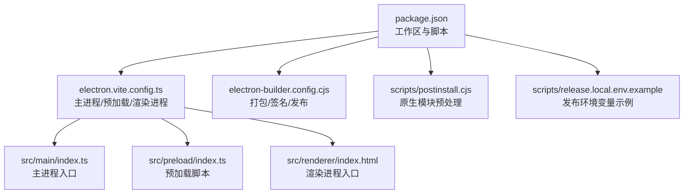
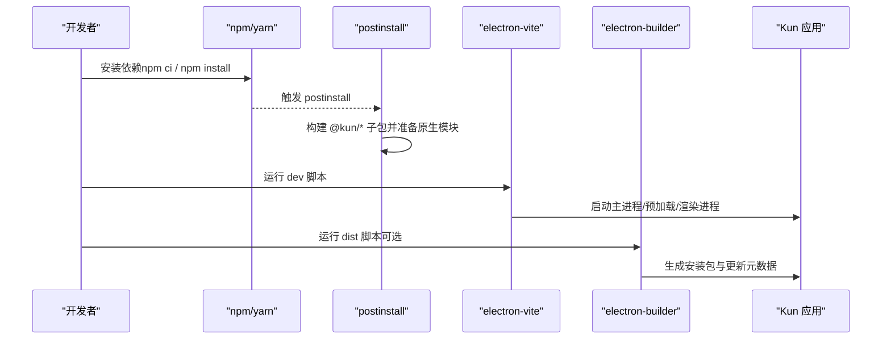
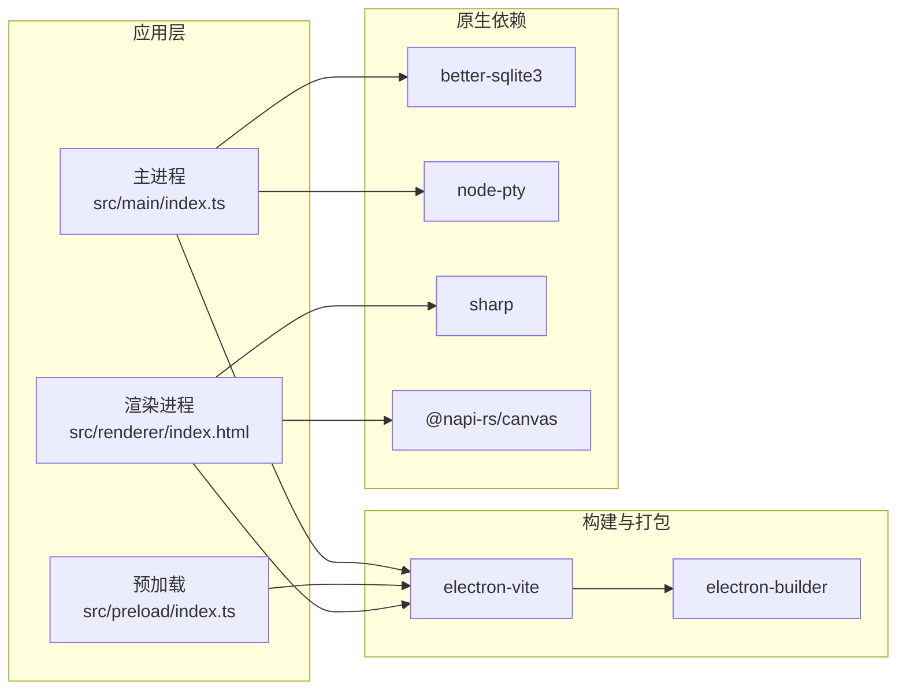

# 开发环境搭建

<cite>
**本文引用的文件**
- [package.json](file://package.json)
- [README.md](file://README.md)
- [electron.vite.config.ts](file://electron.vite.config.ts)
- [tsconfig.json](file://tsconfig.json)
- [electron-builder.config.cjs](file://electron-builder.config.cjs)
- [scripts/postinstall.cjs](file://scripts/postinstall.cjs)
- [scripts/release.local.env.example](file://scripts/release.local.env.example)
- [docs/DEVELOPMENT.zh-CN.md](file://docs/DEVELOPMENT.zh-CN.md)
</cite>

## 目录
1. [简介](#简介)
2. [项目结构](#项目结构)
3. [核心组件](#核心组件)
4. [架构总览](#架构总览)
5. [详细组件分析](#详细组件分析)
6. [依赖关系分析](#依赖关系分析)
7. [性能注意事项](#性能注意事项)
8. [故障排除指南](#故障排除指南)
9. [结论](#结论)
10. [附录](#附录)

## 简介
本指南面向首次参与 DeepSeek-GUI（Kun）桌面端开发的工程师，目标是帮助你从零开始搭建可运行的本地开发环境。内容涵盖 Node.js 版本要求与安装方式、依赖安装流程与网络问题处理、IDE 配置建议（含 TypeScript 与 Electron 调试）、环境变量配置（构建与发布相关），以及常见环境问题排查和最佳实践。

## 项目结构
本项目采用 Electron + Vite 的桌面应用架构，主进程、预加载脚本与渲染进程分别由 electron-vite 管理；同时通过 npm workspaces 组织子包，并使用 electron-builder 进行打包与分发。根目录下的 package.json 定义了运行环境与脚本命令，electron.vite.config.ts 定义了三端入口与别名，electron-builder.config.cjs 控制产物、平台目标与发布渠道。

图表来源
- [package.json:1-88](file://package.json#L1-L88)
- [electron.vite.config.ts:1-55](file://electron.vite.config.ts#L1-L55)
- [electron-builder.config.cjs:1-120](file://electron-builder.config.cjs#L1-L120)
- [scripts/postinstall.cjs:1-85](file://scripts/postinstall.cjs#L1-L85)
- [scripts/release.local.env.example:1-25](file://scripts/release.local.env.example#L1-L25)

章节来源
- [package.json:1-88](file://package.json#L1-L88)
- [electron.vite.config.ts:1-55](file://electron.vite.config.ts#L1-L55)
- [electron-builder.config.cjs:1-120](file://electron-builder.config.cjs#L1-L120)

## 核心组件
- Node.js 与包管理器：项目要求 Node.js 22.19+，npm 随 Node 安装。推荐使用 nvm 管理多版本，或使用 npx 执行一次性工具。
- 构建与开发：使用 electron-vite 驱动开发服务器与生产构建；TypeScript 通过 tsconfig.node.json 与 tsconfig.web.json 分别编译主进程与 Web 侧代码。
- 打包与发布：electron-builder 负责多平台打包与签名；支持 macOS、Windows、Linux 的目标产物与更新通道。
- 原生依赖：postinstall 会尝试为 better-sqlite3 与 node-pty 准备 Electron ABI 兼容的原生二进制，确保终端与数据库能力可用。
- 环境变量：构建与发布阶段读取 KUN_* 或旧版 DEEPSEEK_GUI_* 前缀的环境变量，用于版本号、更新通道、签名与 R2 上传等。

章节来源
- [package.json:1-88](file://package.json#L1-L88)
- [tsconfig.json:1-5](file://tsconfig.json#L1-L5)
- [scripts/postinstall.cjs:1-85](file://scripts/postinstall.cjs#L1-L85)
- [electron-builder.config.cjs:1-120](file://electron-builder.config.cjs#L1-L120)

## 架构总览
下图展示了开发到打包的关键路径：Node 环境 -> 依赖安装 -> 构建扩展与运行时 -> 启动开发服务器 -> 打包产物 -> 可选发布。

图表来源
- [package.json:14-88](file://package.json#L14-L88)
- [scripts/postinstall.cjs:11-85](file://scripts/postinstall.cjs#L11-L85)
- [electron.vite.config.ts:5-55](file://electron.vite.config.ts#L5-L55)
- [electron-builder.config.cjs:113-324](file://electron-builder.config.cjs#L113-L324)

## 详细组件分析

### Node.js 版本与安装
- 最低版本：Node.js 22.19+（由 engines 字段约束）。
- 推荐方式：
  - 使用 nvm 切换并锁定 Node 版本，避免系统全局版本冲突。
  - 使用 npx 执行一次性工具（如 prebuild-install、electron-builder），无需全局安装。
- 验证：在仓库根目录执行 node -v 与 npm -v，确认满足要求。

章节来源
- [package.json:6-8](file://package.json#L6-L8)

### 依赖安装流程与网络问题
- 标准安装：在项目根目录执行 npm ci 以基于 lockfile 精确安装。
- 中国大陆镜像加速：若下载缓慢，可使用 npm 镜像源参数指定 registry。
- 原生模块预处理：postinstall 会尝试为 better-sqlite3 与 node-pty 获取 Electron ABI 兼容的二进制；若失败会降级或保留内置二进制，通常不影响基本功能。
- 常见问题：
  - 权限错误：macOS/Linux 下如遇权限不足，检查用户权限与目录写入权限；必要时使用 sudo 或调整权限。
  - 网络超时：更换镜像源或代理；确保防火墙允许访问 npm 与 GitHub 资源。
  - 原生编译失败：确保已安装系统级构建工具链（C/C++ 编译器、Python 等）；或依赖 postinstall 的预构建二进制。

章节来源
- [README.md:201-228](file://README.md#L201-L228)
- [scripts/postinstall.cjs:20-85](file://scripts/postinstall.cjs#L20-L85)

### IDE 配置建议（VS Code）
- TypeScript 支持：
  - 项目使用多 tsconfig 引用（node/web），VS Code 会自动识别引用图；确保启用 TS 语言服务。
  - 建议在 VS Code 设置中开启“自动类型检查”和“保存时格式化”。
- ESLint：
  - 根目录包含 eslint.config.js，建议安装 ESLint 插件并在保存时自动修复。
- Electron 调试：
  - 使用 VS Code 的 Electron 调试配置（例如 “Electron: Main”、“Electron: Renderer”），配合 electron-vite 的开发服务器进行断点调试。
  - 渲染进程可通过浏览器开发者工具调试；主进程可在 VS Code 中附加调试器。
- 别名与路径：
  - electron.vite.config.ts 定义了 @renderer 与 @shared 的别名，确保 IDE 能正确解析导入路径。

章节来源
- [tsconfig.json:1-5](file://tsconfig.json#L1-L5)
- [electron.vite.config.ts:34-52](file://electron.vite.config.ts#L34-L52)

### 环境变量配置
- 构建与发布：
  - electron-builder.config.cjs 读取 KUN_* 或旧版 DEEPSEEK_GUI_* 前缀的环境变量，包括应用版本、制品版本、更新通道、输出目录、签名与公证信息、R2 存储桶与公开域名等。
  - scripts/release.local.env.example 提供了本地发布环境变量的模板，复制到 scripts/release.local.env 后生效（该文件被忽略，适合本地使用）。
- 常用变量说明：
  - KUN_APP_VERSION / KUN_ARTIFACT_VERSION：应用与制品版本号。
  - KUN_UPDATE_CHANNEL：更新通道（stable/frontier）。
  - KUN_DIST_DIR：构建输出目录。
  - R2_PUBLIC_BASE_URL / R2_RELEASE_PREFIX：更新元数据的公开域名与发布前缀。
  - 签名相关：P12_PATH、P12_PASSWORD、P8_PATH、KEY_ID、ISSUER（macOS 签名与公证）。
- 注意：
  - 环境变量优先级：显式传入 > release.local.env > 默认值。
  - 发布前请校验版本号格式与通道合法性，否则构建会报错。

章节来源
- [electron-builder.config.cjs:7-111](file://electron-builder.config.cjs#L7-L111)
- [scripts/release.local.env.example:1-25](file://scripts/release.local.env.example#L1-L25)

### 开发命令与工作流
- 开发模式：
  - npm run dev：构建 Kun 运行时与扩展，并启动 Electron 开发环境。
  - npm run dev:tui：单独启动 TUI 开发模式。
- 类型检查与测试：
  - npm run typecheck：执行 TypeScript 类型检查。
  - npm run test：运行测试套件。
- 构建与打包：
  - npm run build：生产构建。
  - npm run dist:mac / dist:win / dist:linux：构建对应平台的安装包。
- 质量门禁：
  - PR 前应至少执行 typecheck、build、test，并根据改动范围手动验证 UI 与运行时行为。

章节来源
- [package.json:14-88](file://package.json#L14-L88)
- [docs/DEVELOPMENT.zh-CN.md:61-77](file://docs/DEVELOPMENT.zh-CN.md#L61-L77)

## 依赖关系分析
- 工作区与子包：
  - 通过 workspaces 管理 packages/* 下的子包（如 extension-api、provider-catalog 等），构建时会优先构建这些依赖。
- 主进程与渲染进程：
  - electron.vite.config.ts 将 src/main/index.ts 作为主进程入口，src/preload/index.ts 作为预加载入口，src/renderer/index.html 作为渲染入口。
- 原生模块：
  - better-sqlite3、node-pty、sharp、@napi-rs/canvas 等原生模块需要与 Electron ABI 匹配；postinstall 会尝试预构建或修复权限。
- 打包与发布：
  - electron-builder.config.cjs 控制 asar 打包、额外资源、平台目标、签名与公证、更新通道与发布地址。

图表来源
- [electron.vite.config.ts:5-55](file://electron.vite.config.ts#L5-L55)
- [scripts/postinstall.cjs:20-85](file://scripts/postinstall.cjs#L20-L85)
- [electron-builder.config.cjs:120-158](file://electron-builder.config.cjs#L120-L158)

章节来源
- [package.json:11-13](file://package.json#L11-L13)
- [electron.vite.config.ts:5-55](file://electron.vite.config.ts#L5-L55)
- [scripts/postinstall.cjs:20-85](file://scripts/postinstall.cjs#L20-L85)
- [electron-builder.config.cjs:120-158](file://electron-builder.config.cjs#L120-L158)

## 性能注意事项
- 依赖安装：
  - 使用 npm ci 而非 npm install，以获得更快且可重复的安装体验。
  - 合理配置镜像源以减少网络延迟。
- 构建优化：
  - 开发时使用 electron-vite 的热重载；生产构建时按需排除无关文件（electron-builder 已配置排除 .map、.d.ts、.ts 等）。
- 原生模块：
  - 尽量使用预构建二进制，减少编译时间；如遇 ABI 不匹配，优先升级 Node/Electron 版本或重新安装依赖。
- 内存与磁盘：
  - 大型依赖（如 PDF、OCR、视频编辑相关）会增加包体积与启动时间；按需启用功能与资源。

[本节提供通用指导，不直接分析具体文件]

## 故障排除指南
- Node.js 版本不符：
  - 现象：安装或构建时报版本错误。
  - 解决：使用 nvm 切换到 22.19+ 版本。
- 依赖安装失败：
  - 现象：网络超时或下载失败。
  - 解决：配置 npm registry 镜像；检查代理与防火墙；清理缓存后重试。
- 原生模块加载失败：
  - 现象：终端无法启动或数据库异常。
  - 解决：确保 postinstall 成功；必要时手动安装系统构建工具链；检查 Electron ABI 是否匹配。
- 权限问题：
  - 现象：chmod 失败或写入目录无权限。
  - 解决：检查用户权限；在 macOS/Linux 上可能需要管理员权限；避免在受保护目录操作。
- 路径问题：
  - 现象：别名解析错误或找不到入口文件。
  - 解决：确认 VS Code 已识别 tsconfig 引用；检查 electron.vite.config.ts 中的别名配置。
- 环境变量未生效：
  - 现象：构建产物版本或发布地址不正确。
  - 解决：检查 KUN_* 或 DEEPSEEK_GUI_* 环境变量；确认 release.local.env 已正确加载。

章节来源
- [scripts/postinstall.cjs:20-85](file://scripts/postinstall.cjs#L20-L85)
- [electron-builder.config.cjs:7-111](file://electron-builder.config.cjs#L7-L111)

## 结论
通过遵循本指南，你可以在本地快速搭建 DeepSeek-GUI 的开发环境，完成依赖安装、开发启动、类型检查与打包发布。建议结合 VS Code 的 TypeScript 与 Electron 调试能力，提升开发与排错效率。遇到问题时，优先检查 Node 版本、网络与原生模块状态，再逐步定位环境变量与构建配置。

[本节总结性内容，不直接分析具体文件]

## 附录
- 常用命令速查：
  - 开发：npm run dev、npm run dev:tui
  - 类型检查：npm run typecheck
  - 测试：npm run test
  - 构建：npm run build
  - 打包：npm run dist:mac / npm run dist:win / npm run dist:linux
- 参考文档：
  - 开发流程与质量标准见 docs/DEVELOPMENT.zh-CN.md。
  - README.md 提供了从源码运行的基础步骤与常用命令。

章节来源
- [docs/DEVELOPMENT.zh-CN.md:61-77](file://docs/DEVELOPMENT.zh-CN.md#L61-L77)
- [README.md:201-242](file://README.md#L201-L242)