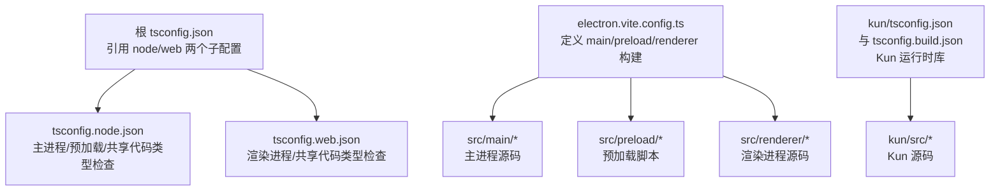
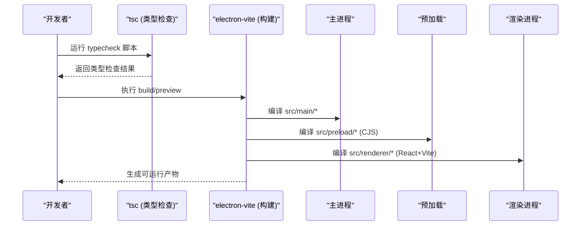
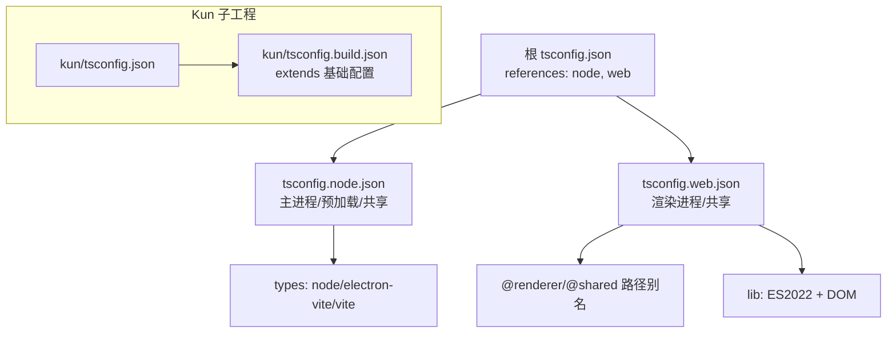
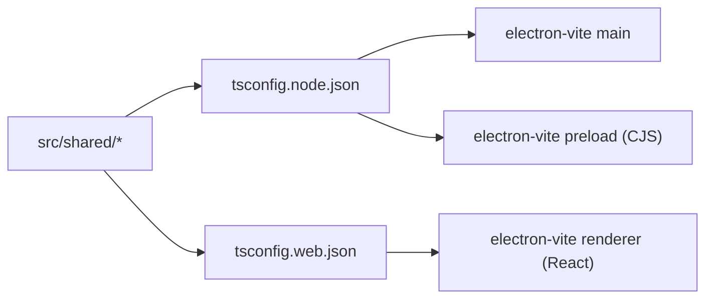
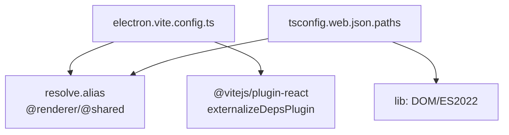
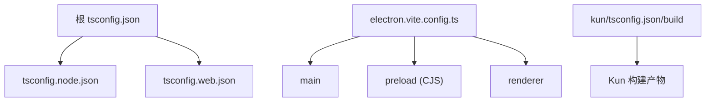

# TypeScript编译配置

<cite>
**本文引用的文件**
- [tsconfig.json](file://tsconfig.json)
- [tsconfig.node.json](file://tsconfig.node.json)
- [tsconfig.web.json](file://tsconfig.web.json)
- [electron.vite.config.ts](file://electron.vite.config.ts)
- [package.json](file://package.json)
- [kun/tsconfig.json](file://kun/tsconfig.json)
- [kun/tsconfig.build.json](file://kun/tsconfig.build.json)
- [examples/extensions/hello-sidebar/tsconfig.json](file://examples/extensions/hello-sidebar/tsconfig.json)
- [examples/extensions/kun-video-editor/tsconfig.host.json](file://examples/extensions/kun-video-editor/tsconfig.host.json)
- [examples/extensions/kun-video-editor/tsconfig.webview.json](file://examples/extensions/kun-video-editor/tsconfig.webview.json)
- [examples/extensions/kun-video-editor/vite.host.config.ts](file://examples/extensions/kun-video-editor/vite.host.config.ts)
</cite>

## 目录
1. [简介](#简介)
2. [项目结构](#项目结构)
3. [核心组件](#核心组件)
4. [架构总览](#架构总览)
5. [详细组件分析](#详细组件分析)
6. [依赖关系分析](#依赖关系分析)
7. [性能考虑](#性能考虑)
8. [故障排查指南](#故障排查指南)
9. [结论](#结论)
10. [附录](#附录)

## 简介
本文件面向DeepSeek-GUI的TypeScript编译配置，聚焦多目标编译策略（主进程、预加载、渲染进程与共享代码）、tsconfig层次结构与继承、类型检查与第三方类型处理、Vite/electron-vite集成（模块解析、路径别名、插件），以及编译性能优化与常见问题排查。文档基于仓库中的实际配置文件进行说明，帮助读者快速理解并高效维护项目的构建与类型检查流程。

## 项目结构
本项目采用“根级聚合 + 子工程”的结构：
- 根目录提供Electron应用的多目标TS配置与Vite/electron-vite构建入口
- kun子工程提供运行时库，拥有独立的tsconfig与构建脚本
- examples下的扩展示例展示了不同目标的独立tsconfig与Vite配置实践

图表来源
- [tsconfig.json:1-5](file://tsconfig.json#L1-L5)
- [tsconfig.node.json:1-13](file://tsconfig.node.json#L1-L13)
- [tsconfig.web.json:1-21](file://tsconfig.web.json#L1-L21)
- [electron.vite.config.ts:1-55](file://electron.vite.config.ts#L1-L55)
- [kun/tsconfig.json:1-29](file://kun/tsconfig.json#L1-L29)
- [kun/tsconfig.build.json:1-17](file://kun/tsconfig.build.json#L1-L17)

章节来源
- [tsconfig.json:1-5](file://tsconfig.json#L1-L5)
- [tsconfig.node.json:1-13](file://tsconfig.node.json#L1-L13)
- [tsconfig.web.json:1-21](file://tsconfig.web.json#L1-L21)
- [electron.vite.config.ts:1-55](file://electron.vite.config.ts#L1-L55)
- [package.json:14-89](file://package.json#L14-L89)
- [kun/tsconfig.json:1-29](file://kun/tsconfig.json#L1-L29)
- [kun/tsconfig.build.json:1-17](file://kun/tsconfig.build.json#L1-L17)

## 核心组件
- 根级tsconfig聚合器：通过references将node与web两类目标解耦，便于并行类型检查与按需编译
- Node侧tsconfig：覆盖主进程、预加载与共享代码的类型检查，启用Node/Electron/Vite类型，关闭emit以仅做类型检查
- Web侧tsconfig：覆盖渲染进程与共享代码，开启DOM库、React JSX、JSON模块解析与路径别名
- electron-vite配置：分别定义main、preload、renderer三端的输入、输出格式与插件；preload使用CommonJS输出以适配Electron
- Kun子工程：独立的tsconfig与build配置，支持声明文件与sourcemap生成，并通过extends复用基础设置

章节来源
- [tsconfig.json:1-5](file://tsconfig.json#L1-L5)
- [tsconfig.node.json:1-13](file://tsconfig.node.json#L1-L13)
- [tsconfig.web.json:1-21](file://tsconfig.web.json#L1-L21)
- [electron.vite.config.ts:1-55](file://electron.vite.config.ts#L1-L55)
- [kun/tsconfig.json:1-29](file://kun/tsconfig.json#L1-L29)
- [kun/tsconfig.build.json:1-17](file://kun/tsconfig.build.json#L1-L17)

## 架构总览
下图展示TypeScript与Vite在Electron多目标中的协作关系：根tsconfig作为类型检查入口，electron-vite负责打包各端产物，Kun子工程通过独立tsconfig参与构建。

图表来源
- [package.json:14-89](file://package.json#L14-L89)
- [electron.vite.config.ts:1-55](file://electron.vite.config.ts#L1-L55)

## 详细组件分析

### tsconfig层次结构与继承
- 根tsconfig不直接包含任何源文件，而是通过references聚合node与web两个子配置，实现按目标拆分类型检查
- tsconfig.node.json：
  - target/module/lib：针对Node环境，启用bundler解析，严格模式，跳过库检查
  - types：引入node、electron-vite/node、vite/client等类型
  - include：覆盖主进程、预加载与共享代码
- tsconfig.web.json：
  - lib：增加DOM/DOM.Iterable，适配浏览器API
  - jsx：启用react-jsx
  - paths：定义@renderer与@shared路径别名，便于跨端引用
  - include：覆盖渲染进程与共享代码，以及preload的类型声明
- Kun子工程：
  - tsconfig.json：基础类型检查配置，启用strict、isolatedModules、declarationMap、sourceMap等
  - tsconfig.build.json：通过extends复用基础配置，关闭noEmit并指定outDir/rootDir，用于实际构建

图表来源
- [tsconfig.json:1-5](file://tsconfig.json#L1-L5)
- [tsconfig.node.json:1-13](file://tsconfig.node.json#L1-L13)
- [tsconfig.web.json:1-21](file://tsconfig.web.json#L1-L21)
- [kun/tsconfig.json:1-29](file://kun/tsconfig.json#L1-L29)
- [kun/tsconfig.build.json:1-17](file://kun/tsconfig.build.json#L1-L17)

章节来源
- [tsconfig.json:1-5](file://tsconfig.json#L1-L5)
- [tsconfig.node.json:1-13](file://tsconfig.node.json#L1-L13)
- [tsconfig.web.json:1-21](file://tsconfig.web.json#L1-L21)
- [kun/tsconfig.json:1-29](file://kun/tsconfig.json#L1-L29)
- [kun/tsconfig.build.json:1-17](file://kun/tsconfig.build.json#L1-L17)

### 多目标编译策略（主进程、预加载、渲染进程、共享）
- 主进程（main）：
  - 由electron-vite的main段定义输入入口，使用externalizeDepsPlugin将外部依赖外置，减小包体并提升启动速度
  - 类型检查由tsconfig.node.json覆盖
- 预加载（preload）：
  - 输出为CommonJS（cjs），符合Electron对preload的要求
  - 同样使用externalizeDepsPlugin
  - 类型检查由tsconfig.node.json覆盖
- 渲染进程（renderer）：
  - 使用React插件与Vite开发服务器，支持热更新与资源处理
  - 路径别名在Vite resolve.alias中定义，与tsconfig.web.json的paths保持一致
  - 类型检查由tsconfig.web.json覆盖
- 共享代码（shared）：
  - 被node与web两端同时引用，确保类型一致性与跨端复用
  - 两端各自include共享目录，避免重复配置

图表来源
- [tsconfig.node.json:1-13](file://tsconfig.node.json#L1-L13)
- [tsconfig.web.json:1-21](file://tsconfig.web.json#L1-L21)
- [electron.vite.config.ts:1-55](file://electron.vite.config.ts#L1-L55)

章节来源
- [electron.vite.config.ts:1-55](file://electron.vite.config.ts#L1-L55)
- [tsconfig.node.json:1-13](file://tsconfig.node.json#L1-L13)
- [tsconfig.web.json:1-21](file://tsconfig.web.json#L1-L21)

### 类型检查配置与第三方类型处理
- 严格模式：
  - node与web均启用strict，保证强类型约束
- 跳过库检查：
  - 两端均启用skipLibCheck，加速类型检查并减少第三方库类型差异带来的噪音
- 类型声明：
  - node侧引入node、electron-vite/node、vite/client类型，满足Electron与Vite环境
  - web侧引入vite/client类型，满足浏览器环境与Vite客户端类型
- JSON模块：
  - web侧启用resolveJsonModule，允许导入JSON资源
- 隔离模块：
  - Kun子工程启用isolatedModules，配合Vite/Turbo等工具进行增量编译

章节来源
- [tsconfig.node.json:1-13](file://tsconfig.node.json#L1-L13)
- [tsconfig.web.json:1-21](file://tsconfig.web.json#L1-L21)
- [kun/tsconfig.json:1-29](file://kun/tsconfig.json#L1-L29)

### Vite集成配置（模块解析、路径别名、插件）
- 模块解析：
  - 根级别使用bundler解析策略，简化依赖解析并与Vite生态对齐
- 路径别名：
  - electron-vite renderer.resolve.alias定义@renderer与@shared
  - tsconfig.web.json.paths同步定义相同别名，保证编辑器与构建一致性
- 插件：
  - @vitejs/plugin-react用于渲染进程的React支持
  - externalizeDepsPlugin用于主进程与预加载的外部依赖外置
- 开发服务器：
  - renderer.server.host设置为127.0.0.1，便于本地调试

图表来源
- [electron.vite.config.ts:1-55](file://electron.vite.config.ts#L1-L55)
- [tsconfig.web.json:1-21](file://tsconfig.web.json#L1-L21)

章节来源
- [electron.vite.config.ts:1-55](file://electron.vite.config.ts#L1-L55)
- [tsconfig.web.json:1-21](file://tsconfig.web.json#L1-L21)

### 扩展示例的多目标实践
- hello-sidebar：
  - 单一tsconfig，target为ES2022，moduleResolution为Bundler，适合简单Webview场景
- kun-video-editor：
  - tsconfig.host.json：NodeNext模块解析，适用于Host端（Node环境）
  - tsconfig.webview.json：Bundler解析，React JSX，适用于Webview端
  - vite.host.config.ts：SSR构建，指定noExternal与输出文件名，确保宿主入口独立

章节来源
- [examples/extensions/hello-sidebar/tsconfig.json:1-15](file://examples/extensions/hello-sidebar/tsconfig.json#L1-L15)
- [examples/extensions/kun-video-editor/tsconfig.host.json:1-14](file://examples/extensions/kun-video-editor/tsconfig.host.json#L1-L14)
- [examples/extensions/kun-video-editor/tsconfig.webview.json:1-16](file://examples/extensions/kun-video-editor/tsconfig.webview.json#L1-L16)
- [examples/extensions/kun-video-editor/vite.host.config.ts:1-22](file://examples/extensions/kun-video-editor/vite.host.config.ts#L1-L22)

## 依赖关系分析
- 根tsconfig通过references关联node与web，形成类型检查的图结构
- electron-vite将main、preload、renderer三段分别构建，preload输出CJS
- Kun子工程通过独立的tsconfig与构建脚本参与整体构建链

图表来源
- [tsconfig.json:1-5](file://tsconfig.json#L1-L5)
- [electron.vite.config.ts:1-55](file://electron.vite.config.ts#L1-L55)
- [kun/tsconfig.json:1-29](file://kun/tsconfig.json#L1-L29)
- [kun/tsconfig.build.json:1-17](file://kun/tsconfig.build.json#L1-L17)

章节来源
- [tsconfig.json:1-5](file://tsconfig.json#L1-L5)
- [electron.vite.config.ts:1-55](file://electron.vite.config.ts#L1-L55)
- [kun/tsconfig.json:1-29](file://kun/tsconfig.json#L1-L29)
- [kun/tsconfig.build.json:1-17](file://kun/tsconfig.build.json#L1-L17)

## 性能考虑
- 增量编译与并行构建：
  - 使用tsc --noEmit进行纯类型检查，结合references拆分目标，可并行执行typecheck脚本
  - Kun子工程启用isolatedModules，利于Vite/Turbo等工具的增量编译
- 外部依赖外置：
  - electron-vite的externalizeDepsPlugin将主进程与预加载的外部依赖外置，减少包体积并加快启动
- 跳过库检查：
  - skipLibCheck减少第三方库类型检查开销
- 路径别名与模块解析：
  - 统一使用bundler解析与一致的别名配置，减少解析歧义与重复计算

[本节为通用指导，无需具体文件引用]

## 故障排查指南
- 类型检查失败：
  - 确认node与web两端include范围正确，未遗漏共享代码或误包含测试文件
  - 检查types字段是否包含所需的环境类型（如electron-vite/node、vite/client）
- 路径别名不生效：
  - 确保electron-vite.resolve.alias与tsconfig.web.json.paths保持一致
- 预加载模块格式错误：
  - 确认preload输出格式为CJS，并在electron-vite中配置entryFileNames
- 外部依赖导致包过大或启动慢：
  - 检查是否在main/preload中启用了externalizeDepsPlugin
- 构建产物缺失或路径错误：
  - 核对electron-vite.rollupOptions.input指向正确的入口文件
  - 检查Kun子工程的tsconfig.build.json的outDir与rootDir

章节来源
- [tsconfig.node.json:1-13](file://tsconfig.node.json#L1-L13)
- [tsconfig.web.json:1-21](file://tsconfig.web.json#L1-L21)
- [electron.vite.config.ts:1-55](file://electron.vite.config.ts#L1-L55)
- [kun/tsconfig.build.json:1-17](file://kun/tsconfig.build.json#L1-L17)

## 结论
本项目通过根级tsconfig聚合与electron-vite多端构建，实现了清晰的主进程、预加载、渲染进程与共享代码的编译边界。严格的类型检查、合理的第三方类型处理、一致的模块解析与路径别名，以及外部依赖外置与增量编译策略，共同保障了构建效率与类型安全。参考扩展示例可进一步学习在不同目标下的最佳实践。

[本节为总结性内容，无需具体文件引用]

## 附录
- 常用命令：
  - 类型检查：通过package.json的typecheck脚本并行执行node与web两端类型检查
  - 构建：通过electron-vite构建主进程、预加载与渲染进程
  - 预览：使用electron-vite preview进行本地预览
- 相关脚本位置：
  - package.json scripts段定义了完整的开发与构建流程

章节来源
- [package.json:14-89](file://package.json#L14-L89)