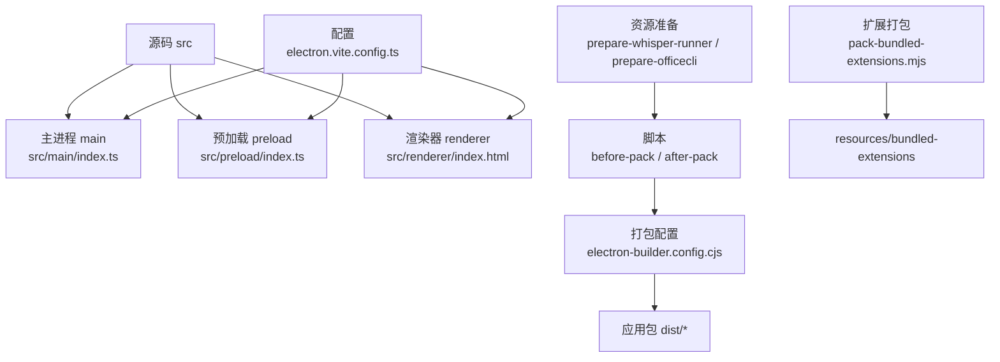
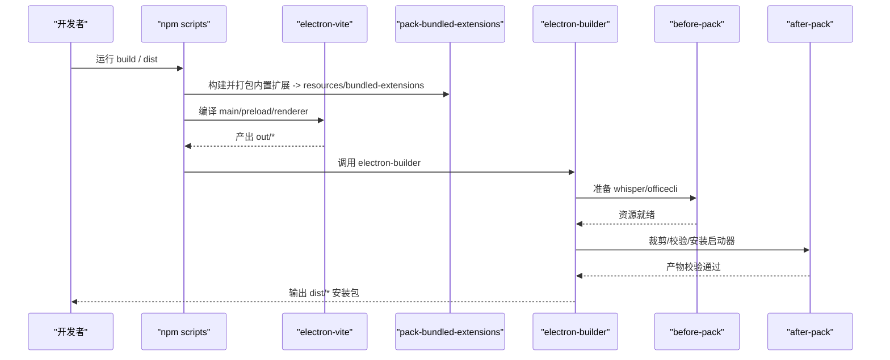
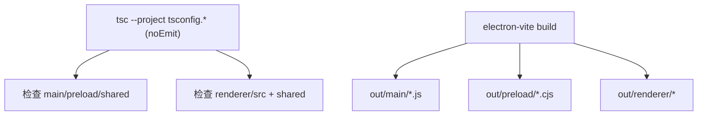
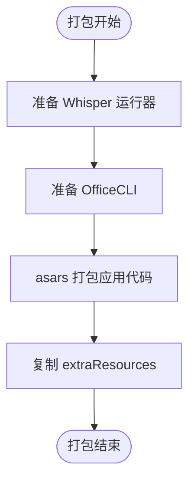
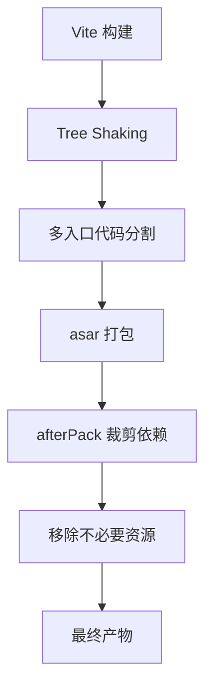
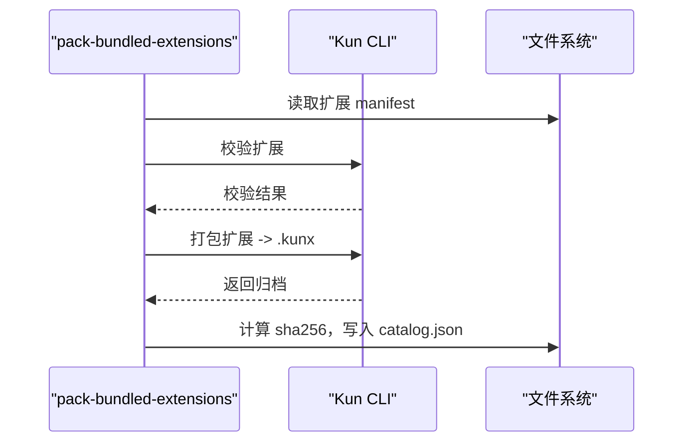
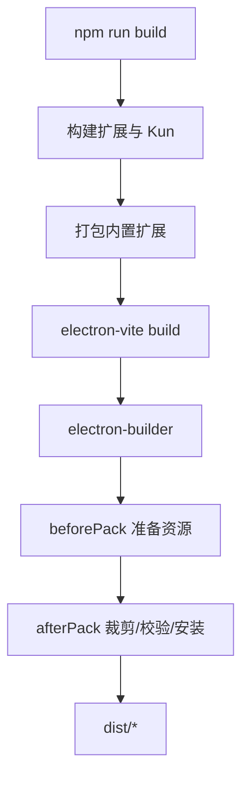
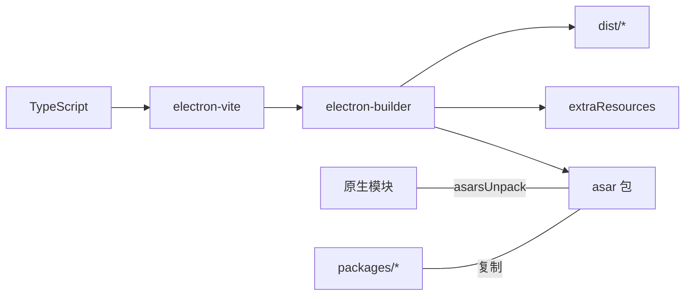

# 构建流程

<cite>
**本文引用的文件**
- [package.json](file://package.json)
- [electron.vite.config.ts](file://electron.vite.config.ts)
- [tsconfig.json](file://tsconfig.json)
- [tsconfig.node.json](file://tsconfig.node.json)
- [tsconfig.web.json](file://tsconfig.web.json)
- [electron-builder.config.cjs](file://electron-builder.config.cjs)
- [scripts/pack-bundled-extensions.mjs](file://scripts/pack-bundled-extensions.mjs)
- [scripts/before-pack.cjs](file://scripts/before-pack.cjs)
- [scripts/after-pack.cjs](file://scripts/after-pack.cjs)
- [scripts/prepare-whisper-runner.cjs](file://scripts/prepare-whisper-runner.cjs)
- [scripts/prepare-officecli.cjs](file://scripts/prepare-officecli.cjs)
- [postcss.config.js](file://postcss.config.js)
- [tailwind.config.js](file://tailwind.config.js)
</cite>

## 目录
1. [简介](#简介)
2. [项目结构](#项目结构)
3. [核心组件](#核心组件)
4. [架构总览](#架构总览)
5. [详细组件分析](#详细组件分析)
6. [依赖关系分析](#依赖关系分析)
7. [性能考量](#性能考量)
8. [故障排查指南](#故障排查指南)
9. [结论](#结论)
10. [附录](#附录)

## 简介
本文件面向 DeepSeek-GUI（Kun GUI）的构建与打包，系统性说明 TypeScript 编译、资源打包、代码优化、扩展打包、脚本执行顺序与依赖关系，并提供性能优化技巧与常见问题解决方案。文档同时给出自定义构建配置的指导，帮助你在不破坏发布产物一致性的前提下进行本地化调整。

## 项目结构
DeepSeek-GUI 采用多目标构建：主进程、预加载脚本、渲染进程分别独立编译；通过 electron-vite 统一编排，再由 electron-builder 完成平台打包与产物校验。TypeScript 通过多配置文件实现 Node/Web 双目标的类型检查与路径别名。

图表来源
- [electron.vite.config.ts:5-53](file://electron.vite.config.ts#L5-L53)
- [electron-builder.config.cjs:113-323](file://electron-builder.config.cjs#L113-L323)
- [scripts/before-pack.cjs:19-56](file://scripts/before-pack.cjs#L19-L56)
- [scripts/after-pack.cjs:750-764](file://scripts/after-pack.cjs#L750-L764)
- [scripts/pack-bundled-extensions.mjs:105-116](file://scripts/pack-bundled-extensions.mjs#L105-L116)

章节来源
- [package.json:14-88](file://package.json#L14-L88)
- [electron.vite.config.ts:5-53](file://electron.vite.config.ts#L5-L53)
- [electron-builder.config.cjs:113-323](file://electron-builder.config.cjs#L113-L323)

## 核心组件
- 多目标 TypeScript 编译与类型检查
  - 主进程与预加载使用 Node 目标（ES2022 + bundler 解析），仅做类型检查（noEmit）。
  - 渲染器使用 Web 目标（DOM 库、React JSX），同样仅做类型检查。
  - 根 tsconfig 通过 references 聚合两个子配置，便于统一 typecheck。
- Vite/Electron 构建
  - electron-vite 定义 main、preload、renderer 三个入口，preload 输出 CommonJS 以适配 Electron 环境。
  - 渲染器启用 React 插件，并设置 @renderer/@shared 路径别名。
- 打包与产物校验
  - electron-builder 负责 asar 打包、额外资源注入、平台签名与发布元数据。
  - beforePack 在打包前准备 Whisper 运行器和 OfficeCLI。
  - afterPack 裁剪依赖、验证内置扩展清单与二进制完整性、安装 CLI 启动器、处理 Linux 沙箱参数等。
- 内置扩展打包
  - pack-bundled-extensions.mjs 对示例扩展执行构建、校验、打包为 .kunx，生成确定性摘要并写入 catalog.json。
  - afterPack 严格校验 catalog 内容与归档一致性。

章节来源
- [tsconfig.json:1-5](file://tsconfig.json#L1-L5)
- [tsconfig.node.json:1-12](file://tsconfig.node.json#L1-L12)
- [tsconfig.web.json:1-21](file://tsconfig.web.json#L1-L21)
- [electron.vite.config.ts:5-53](file://electron.vite.config.ts#L5-L53)
- [electron-builder.config.cjs:113-323](file://electron-builder.config.cjs#L113-L323)
- [scripts/pack-bundled-extensions.mjs:105-116](file://scripts/pack-bundled-extensions.mjs#L105-L116)
- [scripts/after-pack.cjs:341-413](file://scripts/after-pack.cjs#L341-L413)

## 架构总览
下图展示了从源码到最终可分发的应用包的完整流水线，包括 TypeScript 类型检查、Vite 构建、扩展打包、资源准备、asar 打包与后处理校验。

图表来源
- [package.json:14-88](file://package.json#L14-L88)
- [scripts/pack-bundled-extensions.mjs:105-116](file://scripts/pack-bundled-extensions.mjs#L105-L116)
- [electron.vite.config.ts:5-53](file://electron.vite.config.ts#L5-L53)
- [scripts/before-pack.cjs:19-56](file://scripts/before-pack.cjs#L19-L56)
- [scripts/after-pack.cjs:750-764](file://scripts/after-pack.cjs#L750-L764)

## 详细组件分析

### TypeScript 编译与类型检查
- 多目标配置
  - Node 目标：target ES2022，module ESNext，moduleResolution bundler，strict 开启，noEmit 仅类型检查。包含 main、preload、shared。
  - Web 目标：增加 DOM/DOM.Iterable 库，启用 react-jsx，baseUrl 与 paths 映射 @renderer 与 @shared。
  - 根配置通过 references 引用两个子配置，统一 typecheck。
- 与 Vite 的关系
  - electron-vite 的 main/preload 使用 externalizeDepsPlugin 将运行时依赖外置，减少打包体积。
  - preload 输出 cjs，文件名带 .cjs 后缀，确保 Electron 正确加载。
  - renderer 使用 React 插件，并配置开发服务器 host。

图表来源
- [tsconfig.json:1-5](file://tsconfig.json#L1-L5)
- [tsconfig.node.json:1-12](file://tsconfig.node.json#L1-L12)
- [tsconfig.web.json:1-21](file://tsconfig.web.json#L1-L21)
- [electron.vite.config.ts:5-53](file://electron.vite.config.ts#L5-L53)

章节来源
- [tsconfig.json:1-5](file://tsconfig.json#L1-L5)
- [tsconfig.node.json:1-12](file://tsconfig.node.json#L1-L12)
- [tsconfig.web.json:1-21](file://tsconfig.web.json#L1-L21)
- [electron.vite.config.ts:5-53](file://electron.vite.config.ts#L5-L53)

### 资源打包流程
- 静态资源与语言包
  - electron-builder 通过 extraResources 将 bundled-extensions、whisper、officecli 等复制到应用资源目录。
  - Chromium 语言包通过 electronLanguages 指定，Windows/Linux 使用 BCP 47 名称，macOS 使用 .lproj 命名。
- 图标与平台差异
  - macOS 使用圆角 PNG 作为应用图标；Windows 提供多尺寸 ICO；Linux 使用 PNG。
- Whisper 运行器
  - beforePack 调用 prepare-whisper-runner.cjs 按平台/架构准备 whisper-cli，支持缓存与可选跳过。
- OfficeCLI
  - beforePack 调用 prepare-officecli.cjs 下载并校验目标平台二进制，写入 selected.json。

图表来源
- [electron-builder.config.cjs:193-224](file://electron-builder.config.cjs#L193-L224)
- [scripts/before-pack.cjs:19-56](file://scripts/before-pack.cjs#L19-L56)
- [scripts/prepare-whisper-runner.cjs:191-207](file://scripts/prepare-whisper-runner.cjs#L191-L207)
- [scripts/prepare-officecli.cjs:61-107](file://scripts/prepare-officecli.cjs#L61-L107)

章节来源
- [electron-builder.config.cjs:193-224](file://electron-builder.config.cjs#L193-L224)
- [scripts/before-pack.cjs:19-56](file://scripts/before-pack.cjs#L19-L56)
- [scripts/prepare-whisper-runner.cjs:191-207](file://scripts/prepare-whisper-runner.cjs#L191-L207)
- [scripts/prepare-officecli.cjs:61-107](file://scripts/prepare-officecli.cjs#L61-L107)

### 代码优化策略
- Tree Shaking 与外部依赖
  - main/preload 使用 externalizeDepsPlugin 将 node_modules 依赖外置，减小 asar 体积并提升加载速度。
- 代码分割
  - renderer 与 preload 均定义多个入口（如 extension-view、tray-quota），天然形成按需加载的代码块。
- 压缩与产物裁剪
  - electron-builder files 排除 map/d.ts/ts 源文件与 README/CHANGELOG，减少产物体积。
  - afterPack 中 prunePackedKunDependencies 基于目标平台/架构裁剪 kun 工作区依赖；移除不必要的 Claude Code 平台二进制、better-sqlite3 构建中间产物、Tesseract 非 LSTM 核心与模型。
- CSS 与样式
  - Tailwind 通过 content 扫描限定范围，避免无用样式进入产物；PostCSS 启用 autoprefixer。

图表来源
- [electron.vite.config.ts:5-53](file://electron.vite.config.ts#L5-L53)
- [electron-builder.config.cjs:163-192](file://electron-builder.config.cjs#L163-L192)
- [scripts/after-pack.cjs:150-262](file://scripts/after-pack.cjs#L150-L262)
- [postcss.config.js:1-7](file://postcss.config.js#L1-L7)
- [tailwind.config.js:1-77](file://tailwind.config.js#L1-L77)

章节来源
- [electron.vite.config.ts:5-53](file://electron.vite.config.ts#L5-L53)
- [electron-builder.config.cjs:163-192](file://electron-builder.config.cjs#L163-L192)
- [scripts/after-pack.cjs:150-262](file://scripts/after-pack.cjs#L150-L262)
- [postcss.config.js:1-7](file://postcss.config.js#L1-L7)
- [tailwind.config.js:1-77](file://tailwind.config.js#L1-L77)

### 扩展打包机制
- 内置扩展预编译与打包
  - pack-bundled-extensions.mjs 遍历 BUNDLED_EXTENSION_DEFINITIONS，执行各扩展的 npm build，再通过 Kun CLI 校验并打包为 .kunx。
  - 两次打包对比哈希，确保产物确定性；生成 catalog.json 记录 id、版本、归档名、sha256、权限、引擎兼容信息等。
- 动态加载与校验
  - afterPack 读取 catalog.json，逐项校验归档存在性、大小与 sha256，并强制要求特定扩展 ID 存在，防止遗漏或意外扩展混入。
  - 废弃扩展 ID 通过 retiredExtensions 标记，避免冲突。

图表来源
- [scripts/pack-bundled-extensions.mjs:105-169](file://scripts/pack-bundled-extensions.mjs#L105-L169)
- [scripts/after-pack.cjs:341-413](file://scripts/after-pack.cjs#L341-L413)

章节来源
- [scripts/pack-bundled-extensions.mjs:105-169](file://scripts/pack-bundled-extensions.mjs#L105-L169)
- [scripts/after-pack.cjs:341-413](file://scripts/after-pack.cjs#L341-L413)

### 构建脚本执行顺序与依赖关系
- 顶层脚本链
  - build: 先构建扩展与 Kun 运行时，再打包内置扩展，然后 electron-vite 构建，最后检查打包后的运行时依赖。
  - dev: 类似 build 但进入 electron-vite dev 模式。
  - dist: 执行 Windows 安装程序语法检查、build，再调用 electron-builder 生成安装包。
- 打包钩子
  - beforePack：准备 whisper/officecli。
  - afterPack：裁剪依赖、验证产物、安装 CLI 启动器、处理 Linux 沙箱参数、可选签名。

图表来源
- [package.json:14-88](file://package.json#L14-L88)
- [scripts/before-pack.cjs:19-56](file://scripts/before-pack.cjs#L19-L56)
- [scripts/after-pack.cjs:750-764](file://scripts/after-pack.cjs#L750-L764)

章节来源
- [package.json:14-88](file://package.json#L14-L88)
- [scripts/before-pack.cjs:19-56](file://scripts/before-pack.cjs#L19-L56)
- [scripts/after-pack.cjs:750-764](file://scripts/after-pack.cjs#L750-L764)

## 依赖关系分析
- 构建工具链
  - electron-vite 协调 main/preload/renderer 三端构建；TypeScript 负责类型检查；Tailwind/PostCSS 处理样式。
- 运行时依赖
  - better-sqlite3、node-pty、bindings、sharp、tesseract.js 等原生模块在 asarUnpack 中显式排除，保证运行时可加载。
- 扩展与工作区
  - packages/* 中的扩展 API、提供者目录、脚手架模板被复制到应用内，供运行时与 CLI 使用。

图表来源
- [electron-builder.config.cjs:123-158](file://electron-builder.config.cjs#L123-L158)
- [electron-builder.config.cjs:163-192](file://electron-builder.config.cjs#L163-L192)

章节来源
- [electron-builder.config.cjs:123-158](file://electron-builder.config.cjs#L123-L158)
- [electron-builder.config.cjs:163-192](file://electron-builder.config.cjs#L163-L192)

## 性能考量
- 缩短冷启动与首次加载
  - 使用 externalizeDepsPlugin 将大依赖外置，减少 asar 解压开销。
  - 多入口代码分割，按需加载扩展视图与托盘配额页面。
- 减小安装包体积
  - files 排除调试与源文件；afterPack 裁剪 kun 依赖、移除不必要的平台二进制与构建中间产物。
  - 仅保留 Tesseract LSTM 核心与必要模型，剔除多余语言数据。
- 并行与缓存
  - Whisper 构建使用缓存目录，避免重复克隆与编译；OfficeCLI 下载命中则跳过。
  - 构建命令可通过环境变量控制是否跳过 Whisper runner。

[本节为通用性能建议，无需具体文件引用]

## 故障排查指南
- 类型检查失败
  - 确认 tsconfig.node.json 与 tsconfig.web.json 的 include 覆盖所有需要检查的文件；必要时调整 baseUrl/paths。
  - 若第三方库缺少类型，可在 web/node 目标 types 中添加相应声明。
- 预加载加载失败
  - 检查 preload 输出是否为 cjs 且文件名带 .cjs；确保 electron-vite 配置未误改 output.format。
- 原生模块加载异常
  - 确认 asarUnpack 列表包含必要的原生模块目录；若新增依赖，需同步更新 asarUnpack。
- 内置扩展缺失或校验失败
  - 检查 resources/bundled-extensions/catalog.json 是否存在且格式正确；确认 required 扩展 ID 已包含。
  - 若扩展打包非确定性，检查构建脚本是否引入时间戳或随机值。
- Whisper/OfficeCLI 准备失败
  - 检查网络与代理；确认系统具备 git/cmake（Whisper）或下载权限（OfficeCLI）。
  - 可使用环境变量跳过 Whisper 准备或强制重新构建。
- Linux 沙箱问题
  - afterPack 会重命名真实可执行并注入启动器；若手动修改产物，请保留 --disable-setuid-sandbox 标志。

章节来源
- [tsconfig.node.json:1-12](file://tsconfig.node.json#L1-L12)
- [tsconfig.web.json:1-21](file://tsconfig.web.json#L1-L21)
- [electron.vite.config.ts:17-32](file://electron.vite.config.ts#L17-L32)
- [electron-builder.config.cjs:123-158](file://electron-builder.config.cjs#L123-L158)
- [scripts/after-pack.cjs:341-413](file://scripts/after-pack.cjs#L341-L413)
- [scripts/prepare-whisper-runner.cjs:191-207](file://scripts/prepare-whisper-runner.cjs#L191-L207)
- [scripts/prepare-officecli.cjs:61-107](file://scripts/prepare-officecli.cjs#L61-L107)
- [scripts/after-pack.cjs:702-730](file://scripts/after-pack.cjs#L702-L730)

## 结论
DeepSeek-GUI 的构建体系围绕 electron-vite 与 electron-builder 展开，结合多目标 TypeScript 配置、严格的 afterPack 校验与可扩展的内置扩展打包流程，实现了跨平台、可验证、可优化的应用分发。通过合理配置 with externalizeDepsPlugin、代码分割与依赖裁剪，可以在保证功能完整性的同时显著降低包体与启动开销。对于自定义需求，建议在保持现有钩子与校验逻辑的前提下进行最小改动，以确保发布产物的一致性与可维护性。

## 附录

### 常用构建命令速查
- 开发与预览
  - dev：开发模式（构建扩展与 Kun、打包内置扩展、electron-vite dev）
  - preview：预览构建产物
- 构建与打包
  - build：生产构建（扩展/Kun/内置扩展/Vite/electron-builder）
  - dist：生成安装包（含 Windows 安装程序语法检查）
  - dist:mac / dist:win / dist:linux：平台专用打包
- 类型检查
  - typecheck：全量类型检查（扩展/Kun/Web/Node）

章节来源
- [package.json:14-88](file://package.json#L14-L88)

### 自定义构建配置指导
- 切换应用风味
  - 通过环境变量 KUN_APP_FLAVOR=development|production 切换 appId/productName 与发布行为。
- 控制更新通道与版本
  - KUN_UPDATE_CHANNEL 指定 stable/frontier；KUN_APP_VERSION/KUN_ARTIFACT_VERSION 控制版本号与制品名。
- 跳过 Whisper 准备
  - KUN_SKIP_WHISPER_RUNNER=1 可跳过 Whisper 运行器准备，适用于 CI 或离线场景。
- 调整语言包
  - 修改 electronLanguages 数组以增减 Chromium 语言资源；注意不同平台的命名约定。
- 扩展资源与 asar 排除
  - 新增原生依赖时，务必在 asarUnpack 中添加对应路径；files 中可按需排除调试信息。
- 样式与主题
  - Tailwind content 路径决定样式扫描范围；postcss.config.js 可添加更多处理器。

章节来源
- [electron-builder.config.cjs:67-88](file://electron-builder.config.cjs#L67-L88)
- [electron-builder.config.cjs:123-158](file://electron-builder.config.cjs#L123-L158)
- [electron-builder.config.cjs:193-224](file://electron-builder.config.cjs#L193-L224)
- [postcss.config.js:1-7](file://postcss.config.js#L1-L7)
- [tailwind.config.js:1-77](file://tailwind.config.js#L1-L77)