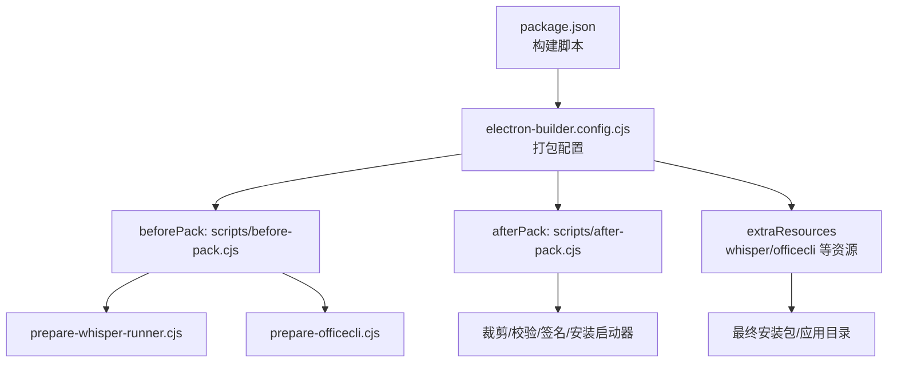
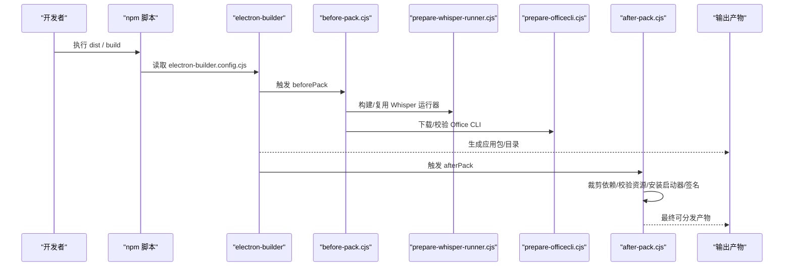
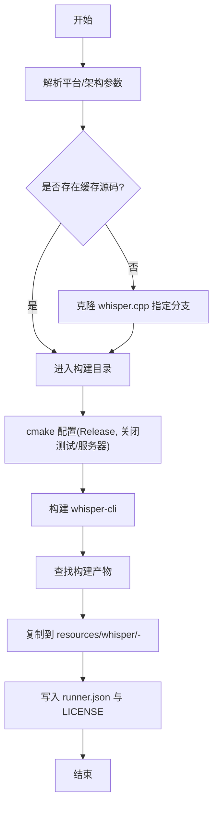
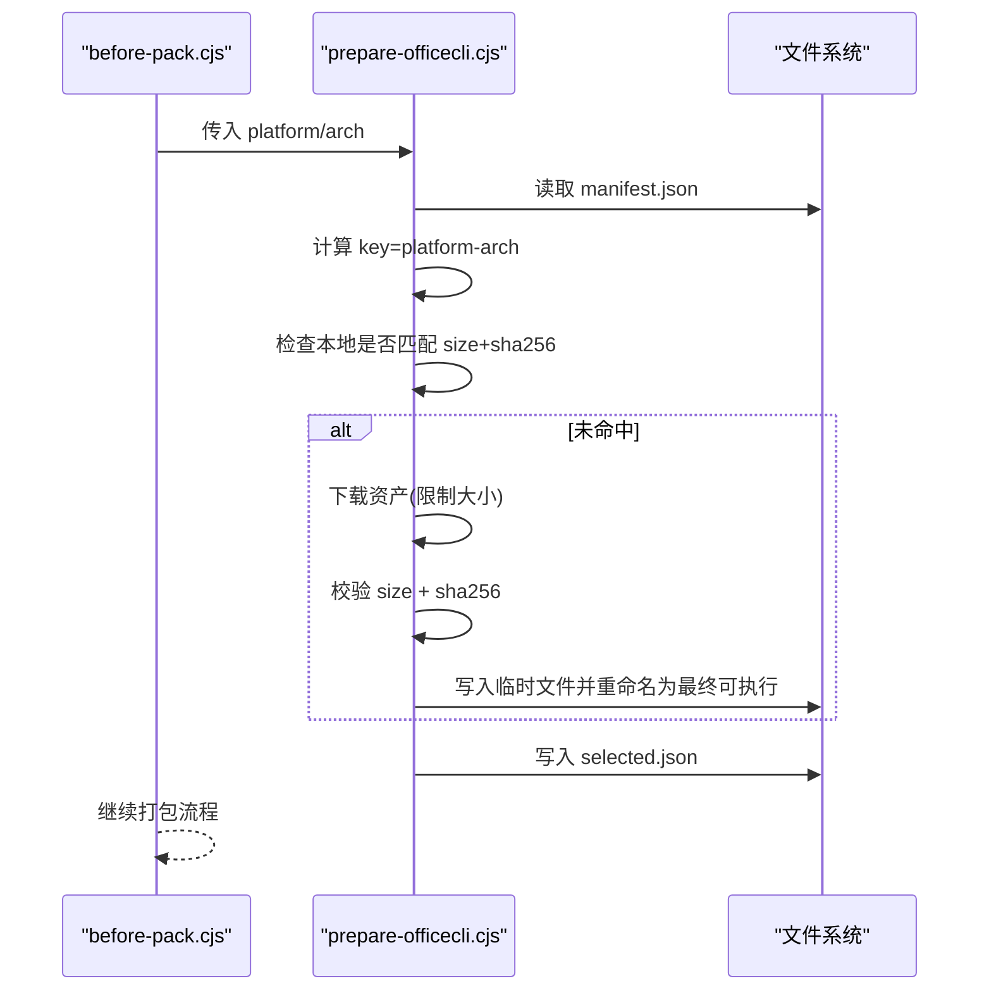
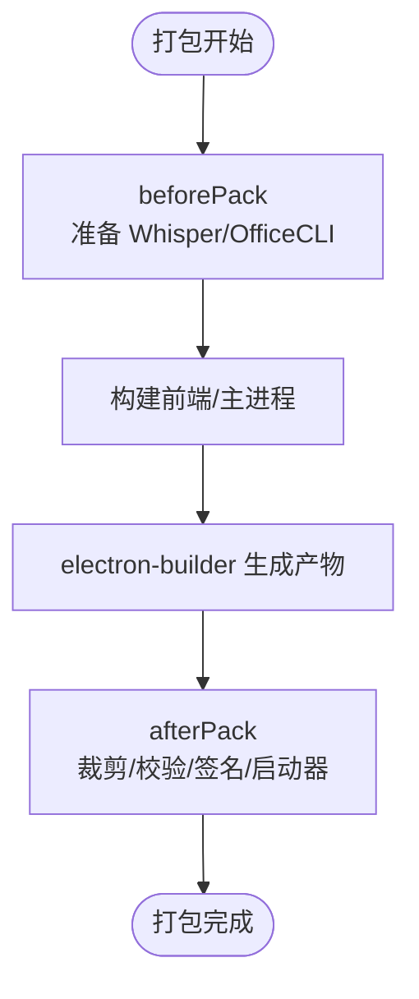
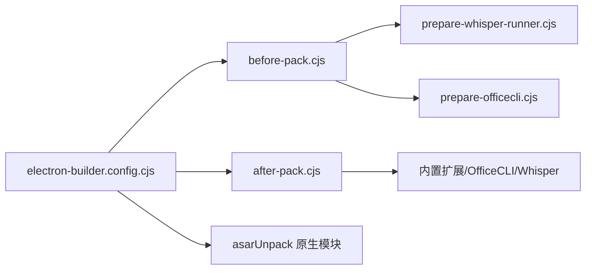

# 资源打包处理

<cite>
**本文引用的文件**
- [electron-builder.config.cjs](file://electron-builder.config.cjs)
- [package.json](file://package.json)
- [scripts/before-pack.cjs](file://scripts/before-pack.cjs)
- [scripts/after-pack.cjs](file://scripts/after-pack.cjs)
- [scripts/prepare-whisper-runner.cjs](file://scripts/prepare-whisper-runner.cjs)
- [scripts/prepare-officecli.cjs](file://scripts/prepare-officecli.cjs)
- [resources/officecli/manifest.json](file://resources/officecli/manifest.json)
- [resources/whisper/LICENSE.whisper.cpp](file://resources/whisper/LICENSE.whisper.cpp)
</cite>

## 目录
1. [简介](#简介)
2. [项目结构](#项目结构)
3. [核心组件](#核心组件)
4. [架构总览](#架构总览)
5. [详细组件分析](#详细组件分析)
6. [依赖关系分析](#依赖关系分析)
7. [性能考虑](#性能考虑)
8. [故障排查指南](#故障排查指南)
9. [结论](#结论)
10. [附录](#附录)

## 简介
本文件面向 DeepSeek-GUI 的资源打包与处理，聚焦以下目标：
- 静态资源（图片、字体、样式）的构建与压缩策略
- 平台特定资源的准备与适配（Whisper 运行器、Office CLI）
- 资源生命周期管理（预打包 beforePack、后处理 afterPack）
- 版本管理与更新策略（应用版本、制品版本、渠道）
- 完整性校验（哈希、大小、权限、签名）
- 打包性能优化与常见问题排障

## 项目结构
DeepSeek-GUI 使用 electron-builder 进行桌面端打包，并通过自定义钩子脚本在打包前后执行资源准备与清理校验。关键目录与职责如下：
- resources：存放第三方二进制与许可证等“额外资源”
  - whisper：按平台-架构组织 Whisper 运行器及元数据
  - officecli：Office CLI 清单、法律文本与当前选定的可执行文件
- scripts：构建期脚本
  - prepare-whisper-runner.cjs：拉取并编译 whisper.cpp，产出平台二进制
  - prepare-officecli.cjs：下载并校验 Office CLI 二进制
  - before-pack.cjs：在打包前调用上述两个准备脚本
  - after-pack.cjs：在打包后裁剪体积、校验产物、安装启动器与签名
- electron-builder.config.cjs：打包配置，声明 extraResources、asarUnpack、语言包、发布渠道等
- package.json：npm 脚本入口，串联构建、打包、测试与发布流程

图表来源
- [electron-builder.config.cjs:113-224](file://electron-builder.config.cjs#L113-L224)
- [scripts/before-pack.cjs:19-56](file://scripts/before-pack.cjs#L19-L56)
- [scripts/after-pack.cjs:750-764](file://scripts/after-pack.cjs#L750-L764)

章节来源
- [electron-builder.config.cjs:113-224](file://electron-builder.config.cjs#L113-L224)
- [package.json:14-88](file://package.json#L14-L88)

## 核心组件
- 打包配置中心：electron-builder.config.cjs
  - 定义 asar 与 asarUnpack，控制原生模块与运行时必需文件不被压缩或需保持路径
  - 通过 extraResources 将 whisper、officecli、法律文本等复制到应用资源目录
  - 设置多平台语言包、图标、目标格式（dmg/zip/nsis/AppImage/deb）
  - 注入 extraMetadata（版本号、渠道、构建提示）
- 预打包阶段：scripts/before-pack.cjs
  - 根据目标平台与架构，调用 prepare-whisper-runner.cjs 与 prepare-officecli.cjs
  - 支持跳过 Whisper 构建的环境变量开关
- 后处理阶段：scripts/after-pack.cjs
  - 裁剪 Kun 运行时依赖、移除不需要的二进制与构建中间产物
  - 校验内置扩展、Office CLI、Tesseract、SQLite 等关键资源存在性与一致性
  - 安装跨平台 CLI 启动器、Linux 包装器、macOS 临时签名、Windows 代码签名
  - 仅保留目标平台的 Whisper 资源，删除其他平台目录以减小体积

章节来源
- [electron-builder.config.cjs:113-224](file://electron-builder.config.cjs#L113-L224)
- [scripts/before-pack.cjs:19-56](file://scripts/before-pack.cjs#L19-L56)
- [scripts/after-pack.cjs:140-262](file://scripts/after-pack.cjs#L140-L262)
- [scripts/after-pack.cjs:324-476](file://scripts/after-pack.cjs#L324-L476)
- [scripts/after-pack.cjs:738-764](file://scripts/after-pack.cjs#L738-L764)

## 架构总览
资源打包的整体流程分为“预打包—构建—后处理—发布”四个阶段，其中资源准备与校验贯穿始终。

图表来源
- [electron-builder.config.cjs:236-238](file://electron-builder.config.cjs#L236-L238)
- [scripts/before-pack.cjs:19-56](file://scripts/before-pack.cjs#L19-L56)
- [scripts/after-pack.cjs:750-764](file://scripts/after-pack.cjs#L750-L764)

## 详细组件分析

### Whisper 运行器准备与打包
- 作用：为 whisper.cpp 构建平台特定的 whisper-cli 二进制，并写入 runner.json 元数据
- 关键点：
  - 支持指定仓库引用（KUN_WHISPER_CPP_REF），默认固定版本
  - 仅在目标平台-架构上本地构建，禁止交叉构建
  - 构建产物复制至 resources/whisper/<platform>-<arch>/，并附带 LICENSE
  - beforePack 中自动调用；afterPack 仅保留目标平台目录，删除其余平台目录
- 复杂度与性能：
  - 首次构建耗时较长，后续若存在则直接复用
  - 通过并行构建目标与禁用不必要的特性（如 OpenMP、本机 CPU 指令集）降低构建成本

图表来源
- [scripts/prepare-whisper-runner.cjs:86-188](file://scripts/prepare-whisper-runner.cjs#L86-L188)
- [scripts/before-pack.cjs:19-39](file://scripts/before-pack.cjs#L19-L39)
- [scripts/after-pack.cjs:738-748](file://scripts/after-pack.cjs#L738-L748)

章节来源
- [scripts/prepare-whisper-runner.cjs:22-76](file://scripts/prepare-whisper-runner.cjs#L22-L76)
- [scripts/prepare-whisper-runner.cjs:94-188](file://scripts/prepare-whisper-runner.cjs#L94-L188)
- [scripts/before-pack.cjs:19-39](file://scripts/before-pack.cjs#L19-L39)
- [scripts/after-pack.cjs:738-748](file://scripts/after-pack.cjs#L738-L748)
- [resources/whisper/LICENSE.whisper.cpp:1-22](file://resources/whisper/LICENSE.whisper.cpp#L1-L22)

### Office CLI 准备与打包
- 作用：从官方发布页下载指定平台-架构的二进制，校验大小与 SHA-256，写入 selected.json
- 关键点：
  - manifest.json 声明各平台资产 URL、大小、哈希
  - 下载过程限制最大字节数，避免异常大响应
  - 原子写入临时文件后重命名，保证幂等与一致性
  - afterPack 校验 selected.json 与 manifest 的一致性，并确保可执行权限
- 版本管理：
  - 通过 manifest.version 与 releaseTag 锁定版本
  - schemaCrc 用于校验清单结构变更

图表来源
- [scripts/prepare-officecli.cjs:29-106](file://scripts/prepare-officecli.cjs#L29-L106)
- [scripts/before-pack.cjs:41-54](file://scripts/before-pack.cjs#L41-L54)
- [resources/officecli/manifest.json:1-34](file://resources/officecli/manifest.json#L1-L34)

章节来源
- [scripts/prepare-officecli.cjs:11-106](file://scripts/prepare-officecli.cjs#L11-L106)
- [scripts/before-pack.cjs:41-54](file://scripts/before-pack.cjs#L41-L54)
- [resources/officecli/manifest.json:1-34](file://resources/officecli/manifest.json#L1-L34)

### 静态资源处理（图片、字体、样式）
- 构建系统：基于 Vite/Electron-Vite 的前端构建管线，配合 PostCSS/Tailwind 处理样式
- 打包策略：
  - 前端资源经构建工具压缩与哈希化，减少体积并提升缓存命中率
  - Electron 应用内资源通过 asar 归档，部分原生绑定与 WASM 通过 asarUnpack 保持独立路径以便运行时加载
- 注意事项：
  - 确保图片/字体/样式未被误排除或重复打包
  - 对大型媒体资源建议按需加载或外部托管

章节来源
- [electron-builder.config.cjs:123-158](file://electron-builder.config.cjs#L123-L158)
- [package.json:14-23](file://package.json#L14-L23)

### 平台特定资源与适配
- macOS：
  - 设置圆角图标、硬编码运行时签名、ad-hoc 签名兜底
  - 语言包使用 mac 风格 locale 名称
- Windows：
  - NSIS 安装器创建快捷方式，注入 CLI 启动批处理
  - Office CLI 可执行文件在打包后进行签名
- Linux：
  - AppImage/Deb 目标，AppImage 附加启动参数禁用 setuid sandbox
  - 重写 Electron 可执行名为真实 ELF，并安装 shell 启动器注入必要参数

章节来源
- [electron-builder.config.cjs:239-306](file://electron-builder.config.cjs#L239-L306)
- [scripts/after-pack.cjs:503-528](file://scripts/after-pack.cjs#L503-L528)
- [scripts/after-pack.cjs:549-730](file://scripts/after-pack.cjs#L549-L730)

### 资源生命周期管理（预打包与后处理）
- 预打包（beforePack）：
  - 准备 Whisper 运行器（可跳过）
  - 准备 Office CLI（下载与校验）
- 后处理（afterPack）：
  - 裁剪 Kun 运行时依赖与多余二进制
  - 校验内置扩展、Office CLI、Tesseract、SQLite 等
  - 安装 CLI 启动器、Linux 包装器、macOS 签名、Windows 签名
  - 仅保留目标平台 Whisper 资源

图表来源
- [electron-builder.config.cjs:236-238](file://electron-builder.config.cjs#L236-L238)
- [scripts/before-pack.cjs:19-56](file://scripts/before-pack.cjs#L19-L56)
- [scripts/after-pack.cjs:750-764](file://scripts/after-pack.cjs#L750-L764)

章节来源
- [scripts/before-pack.cjs:19-56](file://scripts/before-pack.cjs#L19-L56)
- [scripts/after-pack.cjs:140-262](file://scripts/after-pack.cjs#L140-L262)
- [scripts/after-pack.cjs:324-476](file://scripts/after-pack.cjs#L324-L476)
- [scripts/after-pack.cjs:738-764](file://scripts/after-pack.cjs#L738-L764)

### 版本管理与更新策略
- 应用版本与制品版本：
  - KUN_APP_VERSION / DEEPSEEK_GUI_APP_VERSION：应用 semver 版本
  - KUN_ARTIFACT_VERSION / DEEPSEEK_GUI_ARTIFACT_VERSION：制品标识符
- 更新渠道：
  - KUN_UPDATE_CHANNEL：stable/frontier
  - R2_PUBLIC_BASE_URL / R2_RELEASE_PREFIX：更新源地址与前缀
- 构建提示：
  - extraMetadata 中记录 macSigningEnabled、notarizationEnabled 等构建上下文

章节来源
- [electron-builder.config.cjs:58-111](file://electron-builder.config.cjs#L58-L111)
- [electron-builder.config.cjs:314-322](file://electron-builder.config.cjs#L314-L322)

### 资源验证与完整性检查
- Office CLI：
  - 校验 manifest.schemaVersion、version、schemaCrc
  - 校验 selected.json 与 manifest 对应资产的大小与 SHA-256
  - 校验可执行文件存在、非符号链接、权限正确
- Whisper：
  - 仅保留目标平台目录，删除其他平台目录
- 内置扩展：
  - 校验 catalog.json 结构与每个扩展的 sha256
  - 强制包含/废弃扩展 ID 列表
- Tesseract/SQLite：
  - 保留 LSTM 核心与英文模型，删除无关模型与构建中间产物
  - 校验 better-sqlite3 原生绑定存在且无构建残留

章节来源
- [scripts/after-pack.cjs:324-476](file://scripts/after-pack.cjs#L324-L476)
- [scripts/after-pack.cjs:233-262](file://scripts/after-pack.cjs#L233-L262)
- [scripts/after-pack.cjs:738-748](file://scripts/after-pack.cjs#L738-L748)

## 依赖关系分析
- 构建脚本依赖：
  - beforePack 依赖 prepare-whisper-runner.cjs 与 prepare-officecli.cjs
  - afterPack 依赖 Node.js 标准库与 npm prune 命令
- 运行时依赖：
  - asarUnpack 中的原生模块（better-sqlite3、node-pty、sharp、tesseract.js 等）必须在运行时以文件系统路径加载
- 外部依赖：
  - whisper.cpp 仓库与 Office CLI 发布页

图表来源
- [electron-builder.config.cjs:123-158](file://electron-builder.config.cjs#L123-L158)
- [scripts/before-pack.cjs:19-56](file://scripts/before-pack.cjs#L19-L56)
- [scripts/after-pack.cjs:750-764](file://scripts/after-pack.cjs#L750-L764)

章节来源
- [electron-builder.config.cjs:123-158](file://electron-builder.config.cjs#L123-L158)
- [scripts/before-pack.cjs:19-56](file://scripts/before-pack.cjs#L19-L56)
- [scripts/after-pack.cjs:750-764](file://scripts/after-pack.cjs#L750-L764)

## 性能考虑
- 构建阶段
  - 使用缓存的 whisper.cpp 源码与构建产物，避免重复构建
  - 关闭不必要的特性（OpenMP、本机 CPU 指令集）以降低构建时间
- 打包阶段
  - 通过 asarUnpack 精确列出需要解包的模块，减少解压开销
  - 使用 extraResources 仅拷贝必需文件，避免冗余
- 后处理阶段
  - 裁剪 Tesseract 模型与构建中间产物，显著减小体积
  - 删除非目标平台 Whisper 资源，避免安装包膨胀
- 运行时
  - 原生模块保持独立路径，避免 asar 解压带来的性能损耗

[本节提供通用指导，无需具体文件引用]

## 故障排查指南
- 无法找到 Whisper 运行器
  - 现象：打包时报缺少 whisper-cli 或目标平台目录不存在
  - 排查：确认 beforePack 已执行；检查 KUN_SKIP_WHISPER_RUNNER 是否被设置为 1；查看 prepare-whisper-runner 日志
- Office CLI 校验失败
  - 现象：size 或 sha256 不匹配
  - 排查：检查 manifest.json 中对应资产的 size/sha256；确认网络下载完整；查看 prepare-officecli 日志
- 内置扩展缺失或哈希不一致
  - 现象：afterPack 报无效或意外扩展
  - 排查：确认 pack-bundled-extensions 已生成 catalog.json；检查 required/retired 扩展 ID 列表
- Linux 启动失败
  - 现象：Electron 无法启动或终端不可用
  - 排查：确认 afterPack 已安装 Linux 包装器；检查可执行文件是否为 ELF；确认 node-pty spawn-helper 具备执行权限
- macOS 签名问题
  - 现象：应用无法运行或被拒绝
  - 排查：确认 CSC_* 环境变量或 MAC_SIGN；必要时启用 ad-hoc 签名

章节来源
- [scripts/prepare-whisper-runner.cjs:65-84](file://scripts/prepare-whisper-runner.cjs#L65-L84)
- [scripts/prepare-officecli.cjs:44-81](file://scripts/prepare-officecli.cjs#L44-L81)
- [scripts/after-pack.cjs:324-476](file://scripts/after-pack.cjs#L324-L476)
- [scripts/after-pack.cjs:549-730](file://scripts/after-pack.cjs#L549-L730)
- [scripts/after-pack.cjs:503-528](file://scripts/after-pack.cjs#L503-L528)

## 结论
DeepSeek-GUI 的资源打包体系围绕 electron-builder 的 beforePack/afterPack 钩子展开，实现了：
- 平台特定二进制（Whisper、Office CLI）的自动化准备与校验
- 严格的完整性检查与体积裁剪策略
- 跨平台启动器与签名流程
- 清晰的版本与更新渠道管理

遵循本文档的流程与最佳实践，可在保证安全与一致性的前提下，获得高效稳定的打包体验。

## 附录
- 常用 npm 脚本
  - 构建与打包：build、dist、dist:mac、dist:win、dist:linux
  - 资源准备：prepare:whisper、prepare:officecli
  - 质量门禁：check:packaged-runtime-deps、verify:packaged-macos-native
- 环境变量参考
  - KUN_APP_VERSION、KUN_ARTIFACT_VERSION、KUN_UPDATE_CHANNEL
  - R2_PUBLIC_BASE_URL、R2_RELEASE_PREFIX
  - KUN_SKIP_WHISPER_RUNNER（跳过 Whisper 构建）

章节来源
- [package.json:14-88](file://package.json#L14-L88)
- [electron-builder.config.cjs:58-111](file://electron-builder.config.cjs#L58-L111)