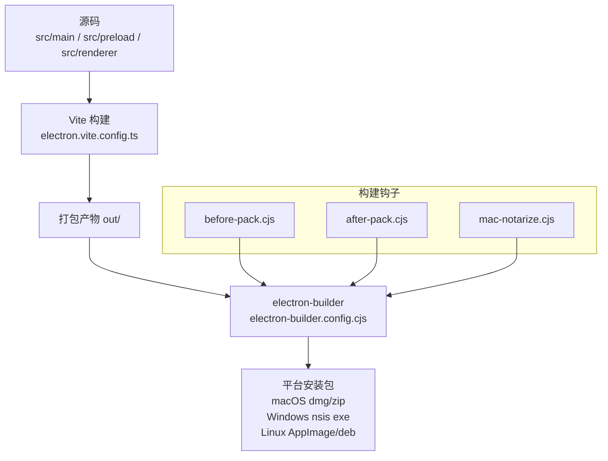
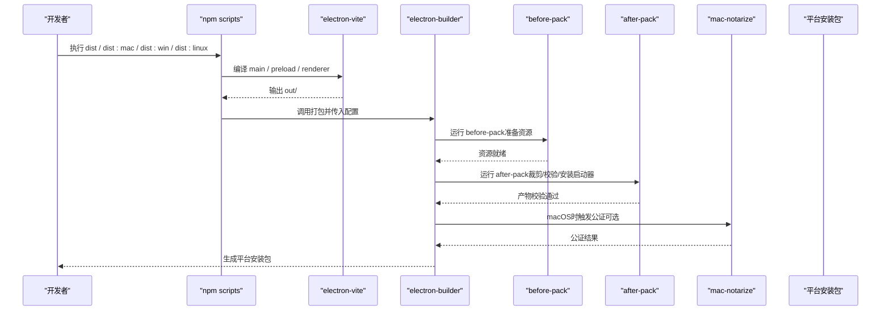
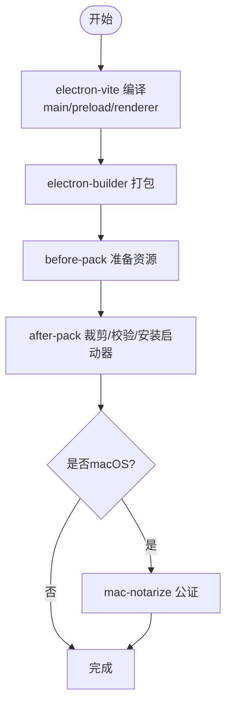
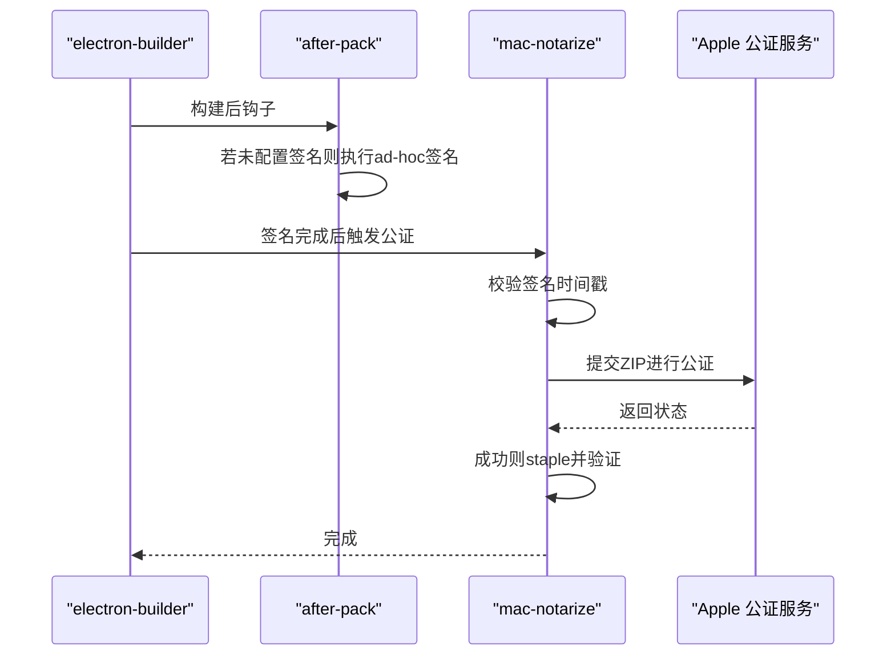
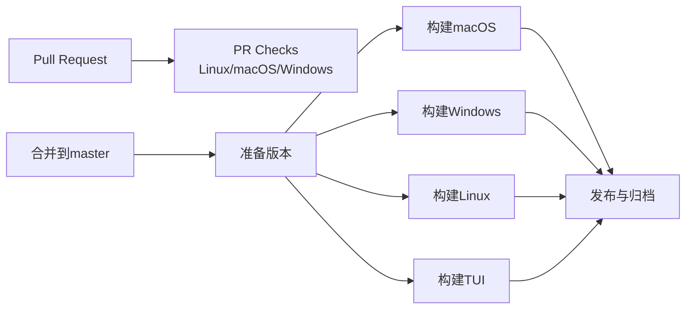
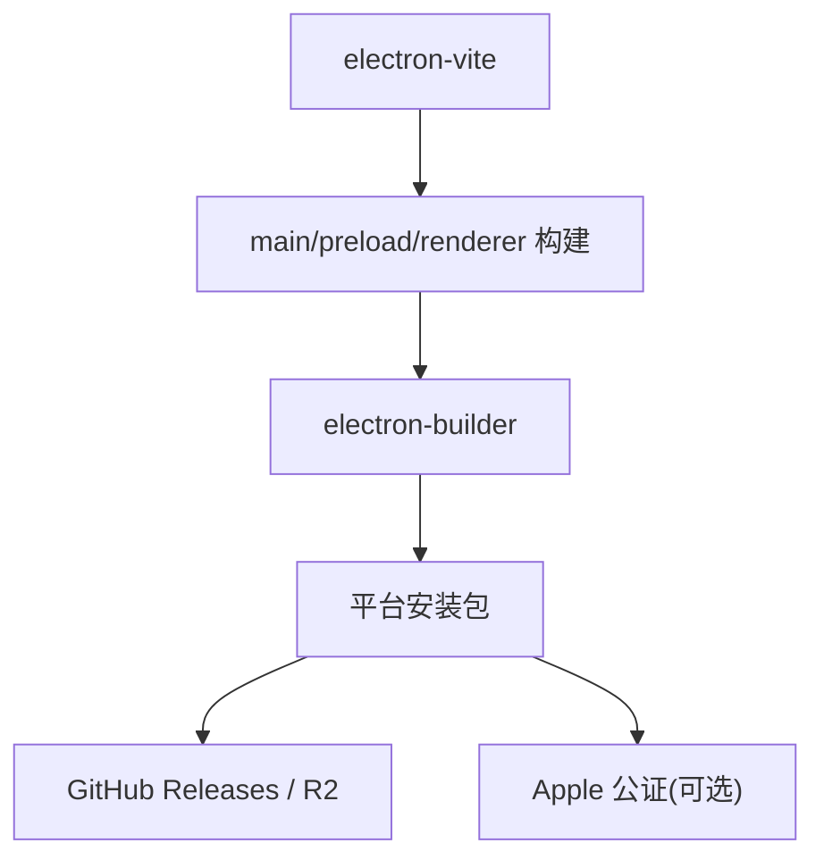

# 构建部署

<cite>
**本文引用的文件**
- [package.json](file://package.json)
- [electron-builder.config.cjs](file://electron-builder.config.cjs)
- [electron.vite.config.ts](file://electron.vite.config.ts)
- [tsconfig.json](file://tsconfig.json)
- [tsconfig.node.json](file://tsconfig.node.json)
- [tsconfig.web.json](file://tsconfig.web.json)
- [.github/workflows/release.yml](file://.github/workflows/release.yml)
- [.github/workflows/pr-checks.yml](file://.github/workflows/pr-checks.yml)
- [scripts/before-pack.cjs](file://scripts/before-pack.cjs)
- [scripts/after-pack.cjs](file://scripts/after-pack.cjs)
- [scripts/mac-notarize.cjs](file://scripts/mac-notarize.cjs)
- [scripts/release-mac.sh](file://scripts/release-mac.sh)
- [scripts/release-win.ps1](file://scripts/release-win.ps1)
</cite>

## 目录
1. [简介](#简介)
2. [项目结构](#项目结构)
3. [核心组件](#核心组件)
4. [架构总览](#架构总览)
5. [详细组件分析](#详细组件分析)
6. [依赖关系分析](#依赖关系分析)
7. [性能考虑](#性能考虑)
8. [故障排除指南](#故障排除指南)
9. [结论](#结论)
10. [附录](#附录)

## 简介
本文件面向DeepSeek-GUI（Kun GUI）的构建与部署系统，覆盖开发环境搭建、构建流程、多平台打包配置、签名与公证、CI/CD流水线、版本管理策略、本地调试技巧与故障排除。目标是帮助开发者在本地高效构建，并在CI中稳定产出可发布的跨平台安装包。

## 项目结构
本项目采用Electron + Vite + TypeScript的多包工作区结构：
- 根目录通过npm workspaces管理多个子包（packages/*）。
- Electron主进程与预加载脚本由electron-vite统一构建，渲染层使用React + Vite。
- 打包产物由electron-builder生成，支持macOS、Windows、Linux。
- CI通过GitHub Actions完成PR检查与发布流水线。

图表来源
- [electron.vite.config.ts:1-55](file://electron.vite.config.ts#L1-L55)
- [electron-builder.config.cjs:113-324](file://electron-builder.config.cjs#L113-L324)
- [scripts/before-pack.cjs:19-56](file://scripts/before-pack.cjs#L19-L56)
- [scripts/after-pack.cjs:750-764](file://scripts/after-pack.cjs#L750-L764)
- [scripts/mac-notarize.cjs:116-183](file://scripts/mac-notarize.cjs#L116-L183)

章节来源
- [package.json:14-88](file://package.json#L14-L88)
- [electron.vite.config.ts:1-55](file://electron.vite.config.ts#L1-L55)
- [electron-builder.config.cjs:113-324](file://electron-builder.config.cjs#L113-L324)

## 核心组件
- 开发与构建入口
  - Node.js版本要求：>=22.19.0（见engines字段）。
  - 常用脚本：dev、build、dist、dist:mac、dist:win、dist:linux等。
- 构建工具链
  - electron-vite：负责main、preload、renderer三端构建与热重载。
  - TypeScript：分node/web两套tsconfig，严格模式，无emit（noEmit），类型检查由tsc完成。
- 打包器
  - electron-builder：定义asar打包、资源包含、平台目标、签名与公证钩子。
- 构建钩子
  - before-pack：准备whisper与officecli资源。
  - after-pack：裁剪依赖、校验产物、安装CLI启动器、处理Linux沙箱标志、macOS ad-hoc签名。
  - mac-notarize：Apple公证流程（notarytool + stapler）。

章节来源
- [package.json:6-8](file://package.json#L6-L8)
- [package.json:14-88](file://package.json#L14-L88)
- [electron.vite.config.ts:1-55](file://electron.vite.config.ts#L1-L55)
- [tsconfig.json:1-5](file://tsconfig.json#L1-L5)
- [tsconfig.node.json:1-13](file://tsconfig.node.json#L1-L13)
- [tsconfig.web.json:1-21](file://tsconfig.web.json#L1-L21)
- [electron-builder.config.cjs:113-324](file://electron-builder.config.cjs#L113-L324)
- [scripts/before-pack.cjs:19-56](file://scripts/before-pack.cjs#L19-L56)
- [scripts/after-pack.cjs:750-764](file://scripts/after-pack.cjs#L750-L764)
- [scripts/mac-notarize.cjs:116-183](file://scripts/mac-notarize.cjs#L116-L183)

## 架构总览
下图展示从源码到最终安装包的关键阶段与交互：

图表来源
- [package.json:63-78](file://package.json#L63-L78)
- [electron.vite.config.ts:5-53](file://electron.vite.config.ts#L5-L53)
- [electron-builder.config.cjs:226-238](file://electron-builder.config.cjs#L226-L238)
- [scripts/before-pack.cjs:19-56](file://scripts/before-pack.cjs#L19-L56)
- [scripts/after-pack.cjs:750-764](file://scripts/after-pack.cjs#L750-L764)
- [scripts/mac-notarize.cjs:116-183](file://scripts/mac-notarize.cjs#L116-L183)

## 详细组件分析

### 开发环境搭建
- Node.js版本：>=22.19.0（由engines约束）。
- 依赖安装：推荐使用npm ci或npm install；仓库使用workspaces，需确保根目录安装完整。
- IDE配置：启用TypeScript严格模式；使用vite/electron-vite插件进行前端开发体验；ESLint已集成。
- 环境变量：
  - KUN_APP_FLAVOR：development/production（影响appId与更新通道）。
  - KUN_UPDATE_CHANNEL：stable/frontier（控制更新通道）。
  - R2_PUBLIC_BASE_URL/R2_RELEASE_PREFIX：用于更新元数据与制品分发。

章节来源
- [package.json:6-8](file://package.json#L6-L8)
- [electron-builder.config.cjs:61-87](file://electron-builder.config.cjs#L61-L87)

### 构建流程（TypeScript编译、资源打包、代码优化）
- 编译阶段
  - electron-vite分别构建main、preload、renderer，preload输出为CommonJS以兼容Node模块。
  - TypeScript通过tsconfig.node.json与tsconfig.web.json分别约束Node端与Web端类型与特性。
- 资源打包
  - electron-builder将out、kun/dist、packages/*等纳入产物，同时通过extraResources注入whisper、officecli等资源。
  - asarUnpack列表保留原生模块与WASM资源不被压缩，保证运行时可加载。
- 代码优化
  - after-pack会裁剪不必要的依赖（如Claude Code二进制按需下载、Tesseract非LSTM核心移除、better-sqlite3构建中间产物清理）。
  - 仅保留目标平台的whisper资源，减少包体大小。
  - Linux安装自定义启动器以禁用setuid沙箱，提升兼容性。

图表来源
- [electron.vite.config.ts:5-53](file://electron.vite.config.ts#L5-L53)
- [electron-builder.config.cjs:122-224](file://electron-builder.config.cjs#L122-L224)
- [scripts/before-pack.cjs:19-56](file://scripts/before-pack.cjs#L19-L56)
- [scripts/after-pack.cjs:750-764](file://scripts/after-pack.cjs#L750-L764)
- [scripts/mac-notarize.cjs:116-183](file://scripts/mac-notarize.cjs#L116-L183)

章节来源
- [electron.vite.config.ts:5-53](file://electron.vite.config.ts#L5-L53)
- [electron-builder.config.cjs:122-224](file://electron-builder.config.cjs#L122-L224)
- [scripts/after-pack.cjs:215-262](file://scripts/after-pack.cjs#L215-L262)
- [scripts/after-pack.cjs:738-748](file://scripts/after-pack.cjs#L738-L748)
- [scripts/after-pack.cjs:702-730](file://scripts/after-pack.cjs#L702-L730)

### 多平台打包配置
- macOS
  - 目标：dmg与zip，支持arm64与x64。
  - 语言：Chromium locales按mac格式配置。
  - 签名与公证：支持Developer ID签名与notarytool公证；未配置时自动ad-hoc签名以便PR验证。
  - 图标与权限：提供圆角图标与麦克风使用说明。
- Windows
  - 目标：NSIS安装包（x64）。
  - 图标：多尺寸ico。
  - 快捷方式：桌面与开始菜单快捷方式创建策略。
- Linux
  - 目标：AppImage与deb（x64）。
  - 沙箱：通过自定义启动器禁用setuid沙箱以提升兼容性。
  - 语言：Chromium .pak语言包。

章节来源
- [electron-builder.config.cjs:239-313](file://electron-builder.config.cjs#L239-L313)

### 签名与公证流程（macOS）
- 签名
  - 通过CSC_LINK/CSC_NAME/CSC_KEY_PASSWORD或MAC_SIGN=1启用签名。
  - 未配置时after-pack会对应用bundle执行ad-hoc签名，便于测试。
- 公证
  - 通过APPLE_API_KEY_ID/APPLE_API_ISSUER/APPLE_API_KEY或BASE64变体配置。
  - mac-notarize会校验时间戳、提交notarytool、staple并验证。
- 安全增强
  - hardenedRuntime与entitlements启用，限制能力并声明用途。

图表来源
- [scripts/after-pack.cjs:503-528](file://scripts/after-pack.cjs#L503-L528)
- [scripts/mac-notarize.cjs:99-114](file://scripts/mac-notarize.cjs#L99-L114)
- [scripts/mac-notarize.cjs:137-178](file://scripts/mac-notarize.cjs#L137-L178)
- [electron-builder.config.cjs:239-251](file://electron-builder.config.cjs#L239-L251)

章节来源
- [scripts/mac-notarize.cjs:116-183](file://scripts/mac-notarize.cjs#L116-L183)
- [scripts/after-pack.cjs:503-528](file://scripts/after-pack.cjs#L503-L528)
- [electron-builder.config.cjs:239-251](file://electron-builder.config.cjs#L239-L251)

### CI/CD流水线
- PR检查
  - 并行构建Linux AppImage/deb、macOS ad-hoc包、Windows NSIS安装包。
  - 失败时在PR上请求变更。
- 发布流水线
  - 合并至master后计算版本号、构建各平台安装包、上传制品、生成release notes、创建/更新GitHub Release、上传R2并promote latest。
  - TUI独立构建与发布，确保GUI/TUI一致性。

图表来源
- [.github/workflows/pr-checks.yml:22-151](file://.github/workflows/pr-checks.yml#L22-L151)
- [.github/workflows/release.yml:22-500](file://.github/workflows/release.yml#L22-L500)

章节来源
- [.github/workflows/pr-checks.yml:22-151](file://.github/workflows/pr-checks.yml#L22-L151)
- [.github/workflows/release.yml:22-500](file://.github/workflows/release.yml#L22-L500)

### 版本管理策略
- 语义化版本
  - 发布脚本强制校验X.Y.Z格式，避免四段版本导致electron-updater解析失败。
  - electron-builder配置中校验semver与artifact版本格式。
- 变更日志
  - 发布流程根据previous tag自动生成release notes，附加构建信息。
- 回滚机制
  - GitHub Release支持draft与publish切换；R2支持promote指定tag为latest，便于快速回滚到历史版本。

章节来源
- [scripts/release-win.ps1:33-45](file://scripts/release-win.ps1#L33-L45)
- [electron-builder.config.cjs:71-111](file://electron-builder.config.cjs#L71-L111)
- [.github/workflows/release.yml:408-430](file://.github/workflows/release.yml#L408-L430)
- [.github/workflows/release.yml:482-499](file://.github/workflows/release.yml#L482-L499)

### 本地调试技巧
- 热重载与预览
  - 使用dev脚本启动开发服务器，支持热重载；preview用于预览构建产物。
- 日志查看
  - 通过控制台与平台日志查看错误；Linux下注意自定义启动器参数。
- 性能分析
  - 使用Vite与浏览器开发者工具分析渲染性能；关注after-pack裁剪对包体的影响。
- 扩展与资源
  - 可通过环境变量跳过某些资源打包（如KUN_SKIP_WHISPER_RUNNER）加速迭代。

章节来源
- [package.json:14-21](file://package.json#L14-L21)
- [electron.vite.config.ts:41-43](file://electron.vite.config.ts#L41-L43)
- [scripts/before-pack.cjs:22-24](file://scripts/before-pack.cjs#L22-L24)

## 依赖关系分析
- 构建依赖
  - electron-vite、typescript、vite、eslint、vitest等。
- 运行时依赖
  - Electron、react、electron-store、electron-updater、better-sqlite3、node-pty、sharp、tesseract.js等。
- 外部集成
  - GitHub Actions、R2对象存储、Apple公证服务。

图表来源
- [package.json:90-181](file://package.json#L90-L181)
- [.github/workflows/release.yml:310-500](file://.github/workflows/release.yml#L310-L500)
- [scripts/mac-notarize.cjs:116-183](file://scripts/mac-notarize.cjs#L116-L183)

章节来源
- [package.json:90-181](file://package.json#L90-L181)
- [.github/workflows/release.yml:310-500](file://.github/workflows/release.yml#L310-L500)

## 性能考虑
- 包体优化
  - 移除不必要的Tesseract核心与模型、Claude Code二进制按需下载、better-sqlite3构建中间产物清理。
  - 仅保留目标平台whisper资源。
- 构建速度
  - 使用缓存（npm cache）、并行任务（CI矩阵）、跳过不必要步骤（如KUN_SKIP_WHISPER_RUNNER）。
- 运行时性能
  - Linux禁用setuid沙箱提升兼容性；preload输出cjs减少转换开销。

[本节为通用指导，不直接分析具体文件]

## 故障排除指南
- macOS无法首次启动
  - 未签名或未公证：使用xattr清除隔离属性或重新签名与公证。
  - 参考命令与说明见发布脚本中的提示。
- 公证失败
  - 检查APPLE_API_KEY_ID、APPLE_API_ISSUER、APPLE_API_KEY或BASE64变体是否正确；确认时间戳已启用。
- 包体积过大
  - 检查after-pack是否生效；确认Tesseract与Claude Code相关裁剪逻辑。
- Linux终端无法启动
  - 确认自定义启动器已安装且具备执行权限；检查--disable-setuid-sandbox参数。
- 扩展或资源缺失
  - 检查bundled-extensions目录与catalog.json完整性；验证sha256与必需扩展ID。

章节来源
- [scripts/release-mac.sh:306-324](file://scripts/release-mac.sh#L306-L324)
- [scripts/mac-notarize.cjs:99-114](file://scripts/mac-notarize.cjs#L99-L114)
- [scripts/after-pack.cjs:233-256](file://scripts/after-pack.cjs#L233-L256)
- [scripts/after-pack.cjs:702-730](file://scripts/after-pack.cjs#L702-L730)
- [scripts/after-pack.cjs:341-413](file://scripts/after-pack.cjs#L341-L413)

## 结论
DeepSeek-GUI的构建与部署系统围绕electron-vite与electron-builder构建，结合严格的after-pack校验与macOS签名公证流程，确保跨平台一致性与安全性。CI/CD自动化了PR检查与发布流程，配合语义化版本与R2发布策略，实现可靠的持续交付。遵循本文档的环境与流程指引，可在本地高效构建并在CI中稳定发布。

## 附录
- 常用命令速查
  - 开发：npm run dev
  - 构建：npm run build
  - 打包：npm run dist / dist:mac / dist:win / dist:linux
  - 预览：npm run preview
- 关键环境变量
  - KUN_APP_FLAVOR、KUN_UPDATE_CHANNEL、R2_*、CSC_*、APPLE_API_*

[本节为补充信息，不直接分析具体文件]