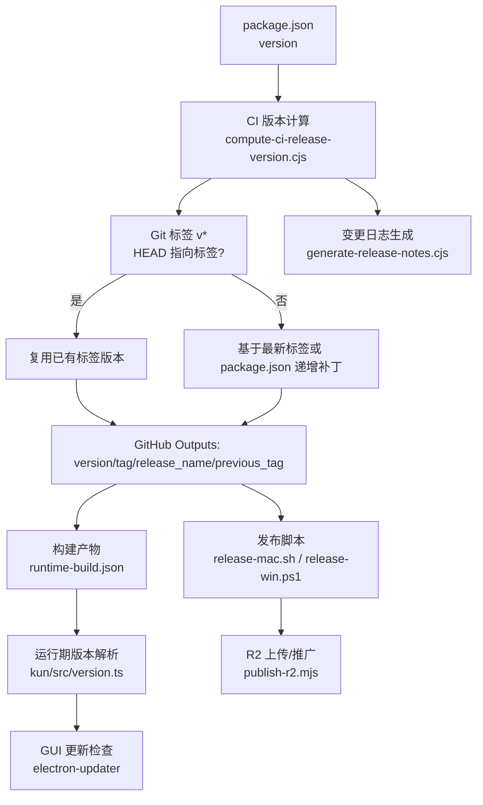
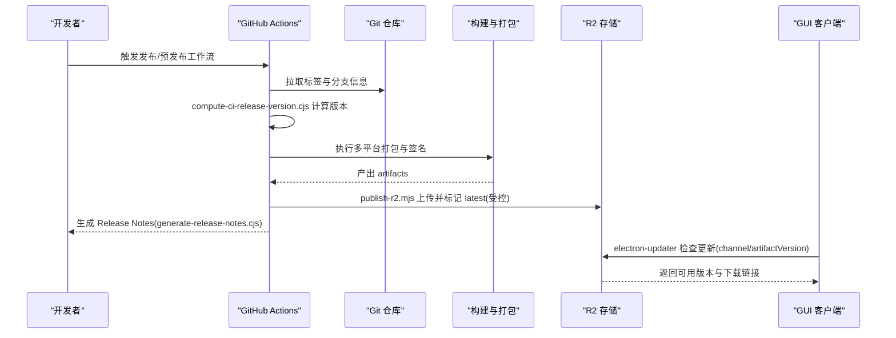
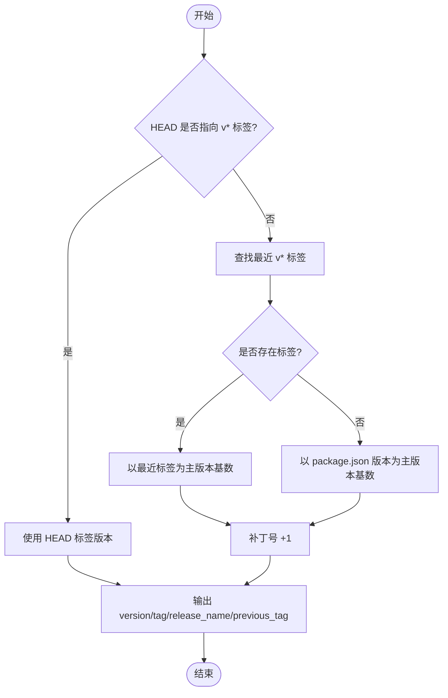
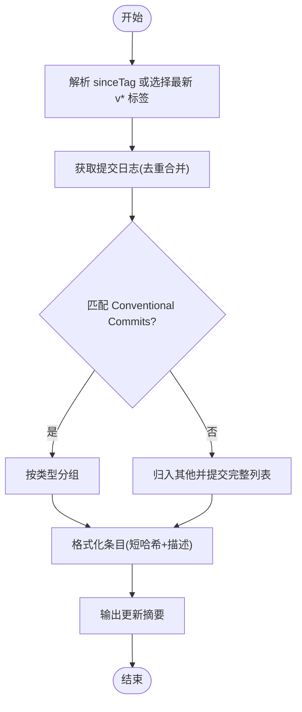
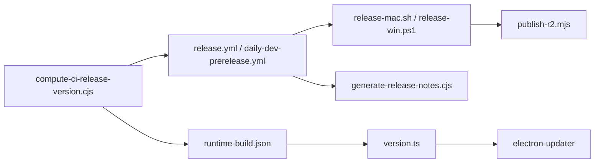

# 版本管理

<cite>
**本文引用的文件**
- [package.json](file://package.json)
- [scripts/compute-ci-release-version.cjs](file://scripts/compute-ci-release-version.cjs)
- [scripts/generate-release-notes.cjs](file://scripts/generate-release-notes.cjs)
- [scripts/release.sh](file://scripts/release.sh)
- [scripts/release-mac.sh](file://scripts/release-mac.sh)
- [scripts/release-win.ps1](file://scripts/release-win.ps1)
- [scripts/publish-r2.mjs](file://scripts/publish-r2.mjs)
- [scripts/assemble-tui-release.mjs](file://scripts/assemble-tui-release.mjs)
- [scripts/smoke-packaged-cli.cjs](file://scripts/smoke-packaged-cli.cjs)
- [scripts/package-tui.mjs](file://scripts/package-tui.mjs)
- [scripts/lib/release-common.sh](file://scripts/lib/release-common.sh)
- [kun/src/version.ts](file://kun/src/version.ts)
- [src/shared/extension-signature.ts](file://src/shared/extension-signature.ts)
- [packages/extension-api/src/common.ts](file://packages/extension-api/src/common.ts)
- [.github/workflows/release.yml](file:.github/workflows/release.yml)
- [.github/workflows/daily-dev-prerelease.yml](file:.github/workflows/daily-dev-prerelease.yml)
- [docs/extensions/release-troubleshooting-changelog.md](file://docs/extensions/release-troubleshooting-changelog.md)
</cite>

## 目录
1. [简介](#简介)
2. [项目结构](#项目结构)
3. [核心组件](#核心组件)
4. [架构总览](#架构总览)
5. [详细组件分析](#详细组件分析)
6. [依赖关系分析](#依赖关系分析)
7. [性能与可靠性考虑](#性能与可靠性考虑)
8. [故障排查指南](#故障排查指南)
9. [结论](#结论)
10. [附录](#附录)

## 简介
本文件为 DeepSeek-GUI（Kun GUI）的版本管理文档，覆盖语义化版本策略、版本计算逻辑、变更日志生成、回滚机制、发布候选版本管理以及团队协作最佳实践。内容基于仓库中实际的脚本、工作流与运行时版本解析实现，确保可操作、可追溯、可自动化。

## 项目结构
DeepSeek-GUI 的版本管理由“根包版本 + CI 标签解析 + 构建产物元数据 + 发布脚本 + 更新通道”共同构成：
- 根包版本：package.json 中的 version 作为开发基线。
- CI 版本计算：compute-ci-release-version.cjs 从 Git 标签或 package.json 推导最终版本号与 Release 名称。
- 运行期版本：kun/src/version.ts 读取 runtime-build.json 并校验 SemVer，暴露服务版本、渠道、制品版本等。
- 变更日志：generate-release-notes.cjs 基于 Conventional Commits 自动生成更新摘要。
- 发布流程：release.sh / release-mac.sh / release-win.ps1 驱动多平台打包、签名、上传与推广；publish-r2.mjs 负责 R2 存储的上传与 promote。
- 预发布与稳定版：daily-dev-prerelease.yml 与 release.yml 分别处理每日预发布与正式发布的打标签与发布动作。
- 客户端更新：electron-updater 集成在 GUI 中，结合 channel 与制品版本进行更新检查。

**图示来源**
- [scripts/compute-ci-release-version.cjs:64-87](file://scripts/compute-ci-release-version.cjs#L64-L87)
- [scripts/generate-release-notes.cjs:72-123](file://scripts/generate-release-notes.cjs#L72-L123)
- [scripts/release.sh:17-25](file://scripts/release.sh#L17-L25)
- [scripts/release-mac.sh:1-200](file://scripts/release-mac.sh#L1-L200)
- [scripts/release-win.ps1:1-200](file://scripts/release-win.ps1#L1-L200)
- [scripts/publish-r2.mjs:1-200](file://scripts/publish-r2.mjs#L1-L200)
- [kun/src/version.ts:23-72](file://kun/src/version.ts#L23-L72)

**章节来源**
- [package.json:1-89](file://package.json#L1-L89)
- [scripts/compute-ci-release-version.cjs:1-162](file://scripts/compute-ci-release-version.cjs#L1-L162)
- [scripts/generate-release-notes.cjs:1-126](file://scripts/generate-release-notes.cjs#L1-L126)
- [scripts/release.sh:1-26](file://scripts/release.sh#L1-L26)

## 核心组件
- 语义化版本策略
  - 主版本：破坏性 API/行为变更时提升。
  - 次版本：向后兼容的功能增强。
  - 补丁版本：缺陷修复、安全加固、小改进。
  - 预发布标识：遵循 SemVer 规范（如 alpha/beta/rc），用于 Beta 测试与候选发布。
- 版本计算逻辑
  - 若 HEAD 已存在 v* 标签，则复用该标签版本。
  - 否则取最近 v* 标签或 package.json 的 x.y.z，自动递增补丁号。
  - 输出 GitHub Actions 变量：version、tag、release_name、previous_tag、existing_tag。
- 变更日志生成
  - 基于 Conventional Commits 类型：feat、fix、perf、refactor、docs、chore/test/build/ci。
  - 按组分类输出中文标题，支持指定 sinceTag 或自动选择最新 v* 标签。
- 运行期版本与渠道
  - 从 runtime-build.json 解析 serviceVersion、channel、artifactVersion、nodeVersion。
  - 默认渠道 stable，仅 frontier 显式切换。
- 发布与回滚
  - 多平台脚本统一入口，macOS 通过 release-mac.sh，Windows 通过 release-win.ps1。
  - R2 存储上传与 promote 分离，保证三平台证据齐全后再推广 latest。
  - 历史版本维护通过 Git 标签与 Release assets 保留；回滚使用兼容快照与向前迁移。

**章节来源**
- [scripts/compute-ci-release-version.cjs:12-87](file://scripts/compute-ci-release-version.cjs#L12-L87)
- [scripts/generate-release-notes.cjs:14-24](file://scripts/generate-release-notes.cjs#L14-L24)
- [scripts/generate-release-notes.cjs:30-47](file://scripts/generate-release-notes.cjs#L30-L47)
- [scripts/generate-release-notes.cjs:72-123](file://scripts/generate-release-notes.cjs#L72-L123)
- [kun/src/version.ts:21-72](file://kun/src/version.ts#L21-L72)
- [docs/extensions/release-troubleshooting-changelog.md:174-177](file://docs/extensions/release-troubleshooting-changelog.md#L174-L177)

## 架构总览
版本管理的端到端流程如下：

**图示来源**
- [.github/workflows/release.yml:430-450](file:.github/workflows/release.yml#L430-L450)
- [.github/workflows/daily-dev-prerelease.yml:390-410](file:.github/workflows/daily-dev-prerelease.yml#L390-L410)
- [scripts/compute-ci-release-version.cjs:89-145](file://scripts/compute-ci-release-version.cjs#L89-L145)
- [scripts/generate-release-notes.cjs:72-123](file://scripts/generate-release-notes.cjs#L72-L123)
- [scripts/publish-r2.mjs:1-200](file://scripts/publish-r2.mjs#L1-L200)
- [package.json:104-105](file://package.json#L104-L105)

## 详细组件分析

### 语义化版本控制策略
- 主版本（Major）
  - 适用场景：破坏性 API 变更、不兼容的运行时行为调整、重大架构演进。
  - 要求：同步更新 API Changelog、兼容性矩阵、迁移指南与测试用例。
- 次版本（Minor）
  - 适用场景：新增功能但保持向后兼容；扩展能力但不改变既有契约。
  - 要求：更新文档与示例，确保旧版本扩展仍可工作。
- 补丁版本（Patch）
  - 适用场景：缺陷修复、安全加固、性能优化、配置修正。
  - 要求：最小变更范围，附带回归测试与验证。
- 预发布版本
  - 格式：x.y.z-alpha、x.y.z-beta、x.y.z-rc.N。
  - 用途：Beta 测试、反馈收集、灰度发布；通过渠道（stable/frontier）控制可见性。

**章节来源**
- [scripts/compute-ci-release-version.cjs:9-10](file://scripts/compute-ci-release-version.cjs#L9-L10)
- [scripts/compute-ci-release-version.cjs:64-87](file://scripts/compute-ci-release-version.cjs#L64-L87)
- [docs/extensions/release-troubleshooting-changelog.md:192-348](file://docs/extensions/release-troubleshooting-changelog.md#L192-L348)

### 版本计算逻辑
- 输入来源
  - Git 标签：v* 列表与 HEAD 指向的标签。
  - package.json：当无标签时的基线版本。
- 算法要点
  - 若 HEAD 存在 v* 标签，直接复用该版本。
  - 否则取最近 v* 标签或 package.json 的 x.y.z，将补丁号 +1。
  - 输出 GitHub Actions 变量供后续步骤使用。
- 校验规则
  - 严格匹配 SemVer 正则，非法版本将抛出错误。
  - 对 artifactVersion 与 nodeVersion 也进行格式校验。

**图示来源**
- [scripts/compute-ci-release-version.cjs:52-87](file://scripts/compute-ci-release-version.cjs#L52-L87)
- [scripts/compute-ci-release-version.cjs:89-145](file://scripts/compute-ci-release-version.cjs#L89-L145)

**章节来源**
- [scripts/compute-ci-release-version.cjs:12-87](file://scripts/compute-ci-release-version.cjs#L12-L87)
- [scripts/compute-ci-release-version.cjs:89-145](file://scripts/compute-ci-release-version.cjs#L89-L145)

### 变更日志生成流程
- 提交消息规范
  - 采用 Conventional Commits：type(scope): description。
  - 支持类型：feat、fix、perf、refactor、docs、chore、test、build、ci。
- 分组与格式化
  - 按类型分组输出中文标题：新功能、修复、性能、重构、文档、其他。
  - 未匹配规范的提交归入“其他”，并列出完整 commit 列表。
- 范围与基准
  - 可指定 sinceTag 或自动选择最新 v* 标签。
  - 输出包含自上次版本的对比链接。

**图示来源**
- [scripts/generate-release-notes.cjs:14-24](file://scripts/generate-release-notes.cjs#L14-L24)
- [scripts/generate-release-notes.cjs:30-47](file://scripts/generate-release-notes.cjs#L30-L47)
- [scripts/generate-release-notes.cjs:72-123](file://scripts/generate-release-notes.cjs#L72-L123)

**章节来源**
- [scripts/generate-release-notes.cjs:1-126](file://scripts/generate-release-notes.cjs#L1-L126)

### 回滚机制
- 历史版本维护
  - 通过 Git 标签与 Release assets 保留各版本产物。
  - 三平台证据 JSON 绑定 commit、CI run、artifact、SHA-256，确保可追溯。
- 热修复流程
  - 针对生产问题创建 hotfix 分支，修复后打新补丁标签。
  - 重新执行 CI，生成新的补丁版本与 Release Notes。
- 降级策略
  - 使用兼容快照进行回滚；禁止反向迁移，仅向前修复。
  - 发布前完成 rollback fixture 与兼容性测试。

**章节来源**
- [docs/extensions/release-troubleshooting-changelog.md:174-177](file://docs/extensions/release-troubleshooting-changelog.md#L174-L177)
- [docs/extensions/release-troubleshooting-changelog.md:36-46](file://docs/extensions/release-troubleshooting-changelog.md#L36-L46)

### 发布候选版本管理
- Beta 测试
  - 使用预发布标签（如 beta/rc）进行灰度发布。
  - 通过 daily-dev-prerelease.yml 自动打标签与创建草稿 Release。
- 反馈收集
  - 提供 doctor/logs 命令与脱敏日志收集指引。
  - 要求用户提交扩展 SHA-256、复现步骤与期望/实际结果。
- 正式发布
  - 三平台 smoke 通过后，再执行 R2 上传与 promote。
  - 严格校验 artifact 数量、大小、SHA-256 与签名。

**章节来源**
- [.github/workflows/daily-dev-prerelease.yml:395-404](file:.github/workflows/daily-dev-prerelease.yml#L395-L404)
- [docs/extensions/release-troubleshooting-changelog.md:178-191](file://docs/extensions/release-troubleshooting-changelog.md#L178-L191)
- [docs/extensions/release-troubleshooting-changelog.md:34-35](file://docs/extensions/release-troubleshooting-changelog.md#L34-L35)

### 版本相关的最佳实践与团队协作规范
- 提交规范
  - 强制 Conventional Commits，便于自动生成变更日志。
  - 变更需关联 Issue/PR，并在 PR 描述中说明影响范围。
- 分支策略
  - main 仅接受经过完整门禁与 smoke 的发布分支。
  - 特性分支命名清晰，合并前完成类型检查与测试。
- 发布门禁
  - 必须通过 extension-release-gate、三平台 smoke、证据生成与校验。
  - 任何失败项不得继续上传或推广 latest。
- 文档同步
  - API 变更需同步 API Reference、Changelog、中英文文档与兼容矩阵。
  - 只改摘要值而不记录兼容性影响不算完成发布审查。

**章节来源**
- [scripts/check-extension-release-gate.mjs:1-200](file://scripts/check-extension-release-gate.mjs#L1-L200)
- [docs/extensions/release-troubleshooting-changelog.md:192-348](file://docs/extensions/release-troubleshooting-changelog.md#L192-L348)

### 版本管理工具的自定义配置方法
- 根包版本
  - 修改 package.json 的 version 字段作为开发基线。
- CI 版本计算
  - 可通过环境变量控制 fetch 行为；输出变量供后续步骤使用。
- 运行期版本
  - 构建阶段写入 runtime-build.json，包含 serviceVersion、channel、artifactVersion、nodeVersion。
  - 运行期通过 kun/src/version.ts 解析并校验。
- 更新渠道
  - electron-updater 根据 channel 与 artifactVersion 检查更新。
  - 可通过 publish-r2.mjs 控制上传与 promote。

**章节来源**
- [package.json:104-105](file://package.json#L104-L105)
- [scripts/compute-ci-release-version.cjs:117-145](file://scripts/compute-ci-release-version.cjs#L117-L145)
- [kun/src/version.ts:40-72](file://kun/src/version.ts#L40-L72)
- [scripts/publish-r2.mjs:1-200](file://scripts/publish-r2.mjs#L1-L200)

## 依赖关系分析
版本管理涉及的模块耦合与职责边界如下：
- 低耦合
  - 版本计算脚本独立于构建与发布，仅依赖 Git 与 package.json。
  - 变更日志生成脚本独立，仅依赖 Git 日志。
- 高内聚
  - 运行期版本解析集中在 kun/src/version.ts，集中处理校验与默认值。
  - 发布脚本围绕多平台打包、签名、上传与推广形成闭环。
- 外部依赖
  - GitHub Actions 工作流触发 CI 流程。
  - R2 存储用于制品托管与分发。
  - electron-updater 用于客户端更新检查。

**图示来源**
- [scripts/compute-ci-release-version.cjs:89-145](file://scripts/compute-ci-release-version.cjs#L89-L145)
- [scripts/generate-release-notes.cjs:72-123](file://scripts/generate-release-notes.cjs#L72-L123)
- [scripts/release-mac.sh:1-200](file://scripts/release-mac.sh#L1-L200)
- [scripts/release-win.ps1:1-200](file://scripts/release-win.ps1#L1-L200)
- [scripts/publish-r2.mjs:1-200](file://scripts/publish-r2.mjs#L1-L200)
- [kun/src/version.ts:40-72](file://kun/src/version.ts#L40-L72)
- [package.json:104-105](file://package.json#L104-L105)

**章节来源**
- [scripts/compute-ci-release-version.cjs:1-162](file://scripts/compute-ci-release-version.cjs#L1-L162)
- [scripts/generate-release-notes.cjs:1-126](file://scripts/generate-release-notes.cjs#L1-L126)
- [scripts/release-mac.sh:1-200](file://scripts/release-mac.sh#L1-L200)
- [scripts/release-win.ps1:1-200](file://scripts/release-win.ps1#L1-L200)
- [scripts/publish-r2.mjs:1-200](file://scripts/publish-r2.mjs#L1-L200)
- [kun/src/version.ts:1-73](file://kun/src/version.ts#L1-L73)
- [package.json:104-105](file://package.json#L104-L105)

## 性能与可靠性考虑
- 版本计算与日志生成均为轻量脚本，耗时可控。
- 构建与签名阶段可能成为瓶颈，建议并行化平台任务。
- 网络请求（fetch tags、upload to R2）应设置超时与重试策略。
- 产物校验（size、SHA-256、签名）应在上传前完成，避免无效制品进入分发链路。

[本节为通用指导，无需具体文件引用]

## 故障排查指南
- 常见问题
  - 版本计算失败：检查 Git 标签格式与 package.json 版本是否符合 SemVer。
  - 变更日志为空：确认提交消息符合 Conventional Commits 规范。
  - 发布失败：查看三平台 smoke 与证据生成结果，定位缺失或错误的 artifact。
  - 客户端无法更新：检查 channel 与 artifactVersion 是否匹配，确认 R2 存储可达。
- 诊断工具
  - 使用 kun extension doctor/logs 收集结构化信息与脱敏日志。
  - 通过 verify-extension-native-evidence.mjs 校验三平台证据。
- 回滚与降级
  - 使用兼容快照进行回滚；禁止反向迁移。
  - 发布前完成 rollback fixture 与兼容性测试。

**章节来源**
- [scripts/compute-ci-release-version.cjs:29-42](file://scripts/compute-ci-release-version.cjs#L29-L42)
- [scripts/generate-release-notes.cjs:49-70](file://scripts/generate-release-notes.cjs#L49-L70)
- [docs/extensions/release-troubleshooting-changelog.md:118-177](file://docs/extensions/release-troubleshooting-changelog.md#L118-L177)

## 结论
DeepSeek-GUI 的版本管理以语义化版本为核心，结合 CI 自动化、多平台发布与严格的门禁校验，确保版本可追溯、可回滚、可分发。通过 Conventional Commits 与变更日志生成，团队能高效协作与维护产品生命周期。建议持续完善预发布流程与反馈收集机制，进一步提升发布质量与用户体验。

[本节为总结，无需具体文件引用]

## 附录
- 常用命令
  - 计算版本：node scripts/compute-ci-release-version.cjs
  - 生成变更日志：node scripts/generate-release-notes.cjs [sinceTag]
  - 本地打包：npm run dist
  - 上传与推广：node scripts/publish-r2.mjs upload/promote
- 参考文件
  - 根包版本：package.json
  - CI 版本计算：scripts/compute-ci-release-version.cjs
  - 变更日志：scripts/generate-release-notes.cjs
  - 运行期版本：kun/src/version.ts
  - 发布脚本：scripts/release.sh / scripts/release-mac.sh / scripts/release-win.ps1
  - 存储发布：scripts/publish-r2.mjs
  - 工作流：.github/workflows/release.yml / .github/workflows/daily-dev-prerelease.yml

[本节为附录，无需具体文件引用]