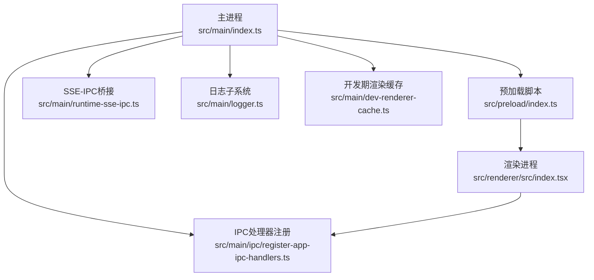
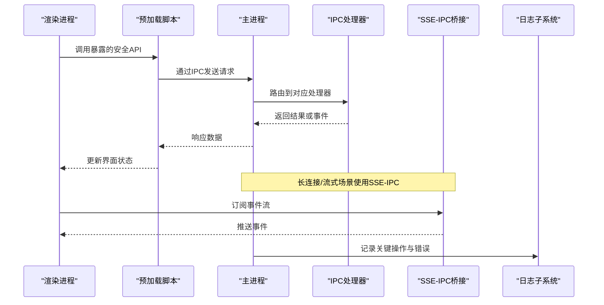
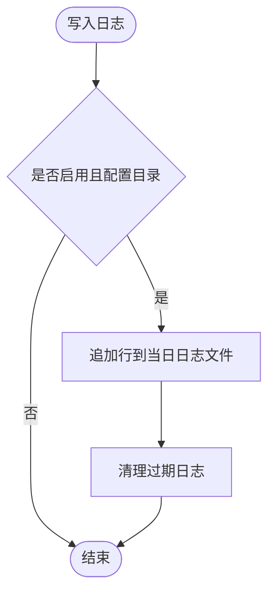
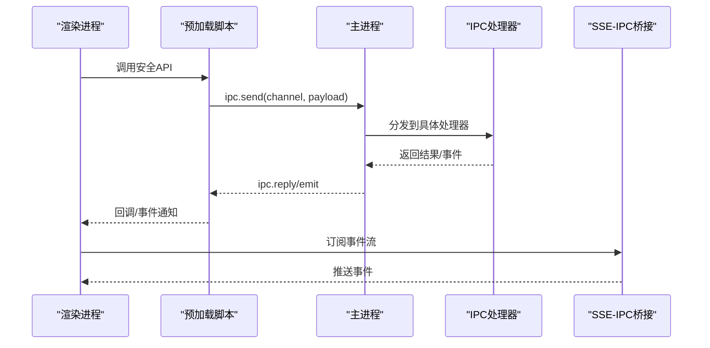
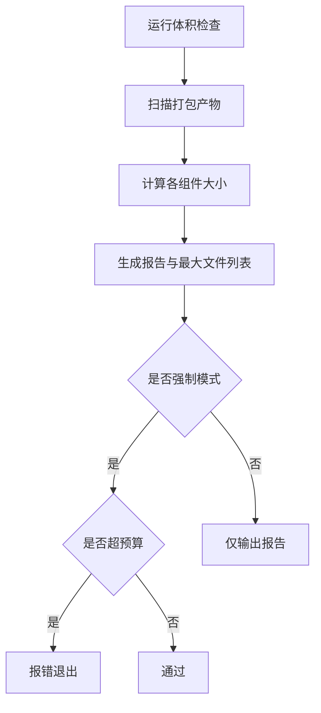
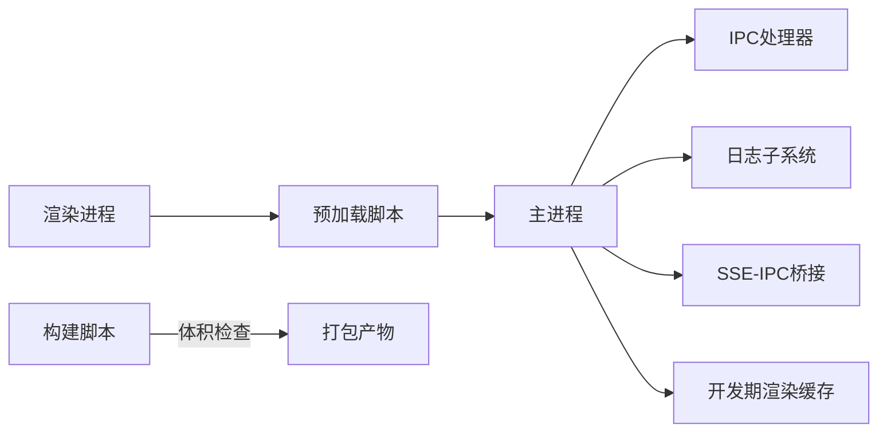

# 调试与性能分析

<cite>
**本文引用的文件**
- [src/main/logger.ts](file://src/main/logger.ts)
- [scripts/check-package-size.cjs](file://scripts/check-package-size.cjs)
- [kun/scripts/run-memory-growth-regression.mjs](file://kun/scripts/run-memory-growth-regression.mjs)
- [electron.vite.config.ts](file://electron.vite.config.ts)
- [package.json](file://package.json)
- [src/main/index.ts](file://src/main/index.ts)
- [src/preload/index.ts](file://src/preload/index.ts)
- [src/renderer/src/index.tsx](file://src/renderer/src/index.tsx)
- [src/main/ipc/register-app-ipc-handlers.ts](file://src/main/ipc/register-app-ipc-handlers.ts)
- [src/shared/extension-ipc.ts](file://src/shared/extension-ipc.ts)
- [src/main/runtime-sse-ipc.ts](file://src/main/runtime-sse-ipc.ts)
- [src/main/dev-renderer-cache.ts](file://src/main/dev-renderer-cache.ts)
</cite>

## 目录
1. [简介](#简介)
2. [项目结构](#项目结构)
3. [核心组件](#核心组件)
4. [架构总览](#架构总览)
5. [详细组件分析](#详细组件分析)
6. [依赖分析](#依赖分析)
7. [性能考量](#性能考量)
8. [故障排查指南](#故障排查指南)
9. [结论](#结论)
10. [附录](#附录)

## 简介
本文件面向DeepSeek-GUI在开发阶段的调试与性能分析，覆盖以下主题：
- Electron主进程与渲染进程的调试方法
- IPC通信调试（应用内、扩展、SSE）
- 日志系统使用（级别、结构化输出、聚合清理）
- 性能分析工具（内存监控、CPU分析、启动时间优化）
- 包大小分析与体积优化策略
- 内存泄漏检测（堆快照、回归测试、定位技巧）
- 性能优化最佳实践与常见问题解决方案

## 项目结构
本项目采用Electron多进程架构：
- 主进程：负责窗口管理、IPC路由、资源与运行时生命周期
- 预加载脚本：暴露安全API给渲染进程
- 渲染进程：前端界面与交互逻辑
- 共享层：类型定义、通用工具、IPC契约
- 构建与脚本：打包、体积检查、内存回归测试等

**图表来源**
- [src/main/index.ts:1-200](file://src/main/index.ts#L1-L200)
- [src/preload/index.ts:1-200](file://src/preload/index.ts#L1-L200)
- [src/renderer/src/index.tsx:1-200](file://src/renderer/src/index.tsx#L1-L200)
- [src/main/ipc/register-app-ipc-handlers.ts:1-200](file://src/main/ipc/register-app-ipc-handlers.ts#L1-L200)
- [src/main/runtime-sse-ipc.ts:1-200](file://src/main/runtime-sse-ipc.ts#L1-L200)
- [src/main/logger.ts:1-120](file://src/main/logger.ts#L1-L120)
- [src/main/dev-renderer-cache.ts:1-200](file://src/main/dev-renderer-cache.ts#L1-L200)

**章节来源**
- [src/main/index.ts:1-200](file://src/main/index.ts#L1-L200)
- [src/preload/index.ts:1-200](file://src/preload/index.ts#L1-L200)
- [src/renderer/src/index.tsx:1-200](file://src/renderer/src/index.tsx#L1-L200)
- [src/main/ipc/register-app-ipc-handlers.ts:1-200](file://src/main/ipc/register-app-ipc-handlers.ts#L1-L200)
- [src/main/runtime-sse-ipc.ts:1-200](file://src/main/runtime-sse-ipc.ts#L1-L200)
- [src/main/logger.ts:1-120](file://src/main/logger.ts#L1-L120)
- [src/main/dev-renderer-cache.ts:1-200](file://src/main/dev-renderer-cache.ts#L1-L200)

## 核心组件
- 日志子系统：提供结构化日志写入、保留策略与启动清理
- IPC通道：应用内IPC、扩展IPC、SSE-IPC桥接
- 构建与脚本：包体积检查、内存增长回归测试
- 开发期支持：渲染缓存、Vite配置集成

**章节来源**
- [src/main/logger.ts:1-120](file://src/main/logger.ts#L1-L120)
- [src/main/ipc/register-app-ipc-handlers.ts:1-200](file://src/main/ipc/register-app-ipc-handlers.ts#L1-L200)
- [src/shared/extension-ipc.ts:1-200](file://src/shared/extension-ipc.ts#L1-L200)
- [src/main/runtime-sse-ipc.ts:1-200](file://src/main/runtime-sse-ipc.ts#L1-L200)
- [scripts/check-package-size.cjs:1-228](file://scripts/check-package-size.cjs#L1-L228)
- [kun/scripts/run-memory-growth-regression.mjs:1-24](file://kun/scripts/run-memory-growth-regression.mjs#L1-L24)

## 架构总览
下图展示主进程、预加载、渲染进程与IPC/SSE的交互关系，以及日志与构建脚本的集成点。

**图表来源**
- [src/main/ipc/register-app-ipc-handlers.ts:1-200](file://src/main/ipc/register-app-ipc-handlers.ts#L1-L200)
- [src/main/runtime-sse-ipc.ts:1-200](file://src/main/runtime-sse-ipc.ts#L1-L200)
- [src/main/logger.ts:1-120](file://src/main/logger.ts#L1-L120)

## 详细组件分析

### 日志子系统
- 功能要点
  - 支持error/warn/info三级日志
  - 按日期分文件存储，带前缀区分不同模块
  - 每次写入后尝试清理过期日志，避免磁盘膨胀
  - 启动时执行一次清理并记录日志
- 使用建议
  - 在关键路径（初始化、网络请求、异常捕获）记录info/warn/error
  - 对敏感信息做脱敏后再写入
  - 结合外部日志聚合系统（如ELK/云日志服务）进行集中分析

**图表来源**
- [src/main/logger.ts:1-120](file://src/main/logger.ts#L1-L120)

**章节来源**
- [src/main/logger.ts:1-120](file://src/main/logger.ts#L1-L120)

### IPC通信调试
- 应用内IPC
  - 主进程统一注册处理器，渲染进程通过预加载暴露的API调用
  - 建议在处理器入口与出口处记录结构化日志，便于追踪
- 扩展IPC
  - 通过共享层定义契约，确保主进程与扩展之间接口稳定
- SSE-IPC
  - 适用于长连接与流式数据，注意断线重连与背压处理

**图表来源**
- [src/main/ipc/register-app-ipc-handlers.ts:1-200](file://src/main/ipc/register-app-ipc-handlers.ts#L1-L200)
- [src/shared/extension-ipc.ts:1-200](file://src/shared/extension-ipc.ts#L1-L200)
- [src/main/runtime-sse-ipc.ts:1-200](file://src/main/runtime-sse-ipc.ts#L1-L200)

**章节来源**
- [src/main/ipc/register-app-ipc-handlers.ts:1-200](file://src/main/ipc/register-app-ipc-handlers.ts#L1-L200)
- [src/shared/extension-ipc.ts:1-200](file://src/shared/extension-ipc.ts#L1-L200)
- [src/main/runtime-sse-ipc.ts:1-200](file://src/main/runtime-sse-ipc.ts#L1-L200)

### 构建与体积分析
- 包体积检查脚本
  - 统计应用、asar/unpacked、额外资源、第三方库等组件大小
  - 输出最大文件列表，辅助定位体积热点
  - 支持强制模式，超过预算时报错
- 使用建议
  - 在CI中运行体积检查，防止增量膨胀
  - 针对大文件进行按需加载或分包优化

**图表来源**
- [scripts/check-package-size.cjs:1-228](file://scripts/check-package-size.cjs#L1-L228)

**章节来源**
- [scripts/check-package-size.cjs:1-228](file://scripts/check-package-size.cjs#L1-L228)

### 内存增长回归测试
- 目的
  - 在固定内存限制下运行特定测试，检测内存增长异常
- 使用建议
  - 将关键流程纳入回归测试，定期执行
  - 结合堆快照对比，定位新增引用链

**章节来源**
- [kun/scripts/run-memory-growth-regression.mjs:1-24](file://kun/scripts/run-memory-growth-regression.mjs#L1-L24)

## 依赖分析
- 主进程依赖IPC处理器、日志、SSE-IPC桥接与开发期缓存
- 渲染进程通过预加载脚本访问主进程能力
- 构建脚本独立于运行时，用于质量门禁

**图表来源**
- [src/main/index.ts:1-200](file://src/main/index.ts#L1-L200)
- [src/main/ipc/register-app-ipc-handlers.ts:1-200](file://src/main/ipc/register-app-ipc-handlers.ts#L1-L200)
- [src/main/logger.ts:1-120](file://src/main/logger.ts#L1-L120)
- [src/main/runtime-sse-ipc.ts:1-200](file://src/main/runtime-sse-ipc.ts#L1-L200)
- [src/main/dev-renderer-cache.ts:1-200](file://src/main/dev-renderer-cache.ts#L1-L200)
- [scripts/check-package-size.cjs:1-228](file://scripts/check-package-size.cjs#L1-L228)

**章节来源**
- [src/main/index.ts:1-200](file://src/main/index.ts#L1-L200)
- [src/main/ipc/register-app-ipc-handlers.ts:1-200](file://src/main/ipc/register-app-ipc-handlers.ts#L1-L200)
- [src/main/logger.ts:1-120](file://src/main/logger.ts#L1-L120)
- [src/main/runtime-sse-ipc.ts:1-200](file://src/main/runtime-sse-ipc.ts#L1-L200)
- [src/main/dev-renderer-cache.ts:1-200](file://src/main/dev-renderer-cache.ts#L1-L200)
- [scripts/check-package-size.cjs:1-228](file://scripts/check-package-size.cjs#L1-L228)

## 性能考量
- 启动时间优化
  - 延迟加载非关键模块
  - 减少主进程初始化开销，拆分重型任务
  - 利用开发期渲染缓存加速热重载
- CPU性能分析
  - 使用浏览器性能面板录制用户操作，识别长任务与阻塞点
  - 在主进程中避免长时间同步I/O，改用异步与队列
- 内存使用监控
  - 定期采集堆快照，关注对象增长趋势
  - 对长生命周期对象建立释放策略，避免隐式引用
- 包体积优化
  - 移除未使用的依赖，启用Tree Shaking
  - 将大型资源按需下载或懒加载
  - 使用体积检查脚本在CI中拦截增量膨胀

[本节为通用指导，不直接分析具体文件]

## 故障排查指南
- 日志定位
  - 根据日志级别筛选问题，优先查看error与warn
  - 结合时间戳与分类字段快速定位模块
  - 使用日志清理策略避免历史日志干扰
- IPC问题
  - 确认通道名称与参数结构一致
  - 检查主进程处理器是否正确注册与返回
  - 对SSE场景验证连接状态与重试机制
- 体积问题
  - 依据体积报告中的最大文件列表，针对性优化
  - 在CI中开启强制模式，防止回归

**章节来源**
- [src/main/logger.ts:1-120](file://src/main/logger.ts#L1-L120)
- [src/main/ipc/register-app-ipc-handlers.ts:1-200](file://src/main/ipc/register-app-ipc-handlers.ts#L1-L200)
- [scripts/check-package-size.cjs:1-228](file://scripts/check-package-size.cjs#L1-L228)

## 结论
通过完善的日志体系、严格的IPC契约、持续的体积与内存回归检查，以及基于工具的调试与分析流程，DeepSeek-GUI能够在开发与生产阶段保持高可用性与高性能。建议团队在日常迭代中持续使用本文档所述方法与工具，形成闭环的质量保障机制。

[本节为总结性内容，不直接分析具体文件]

## 附录
- 调试环境配置
  - 使用Electron内置调试器分别附加主进程与渲染进程
  - 在预加载层打印关键调用栈，辅助跨进程问题定位
- 常用命令
  - 运行体积检查：参考构建脚本参数与输出格式
  - 运行内存回归测试：在指定目录下执行回归脚本
- 参考配置
  - Vite与Electron集成配置位于根目录配置文件
  - 包管理与脚本入口见项目根配置

**章节来源**
- [electron.vite.config.ts:1-200](file://electron.vite.config.ts#L1-L200)
- [package.json:1-200](file://package.json#L1-L200)