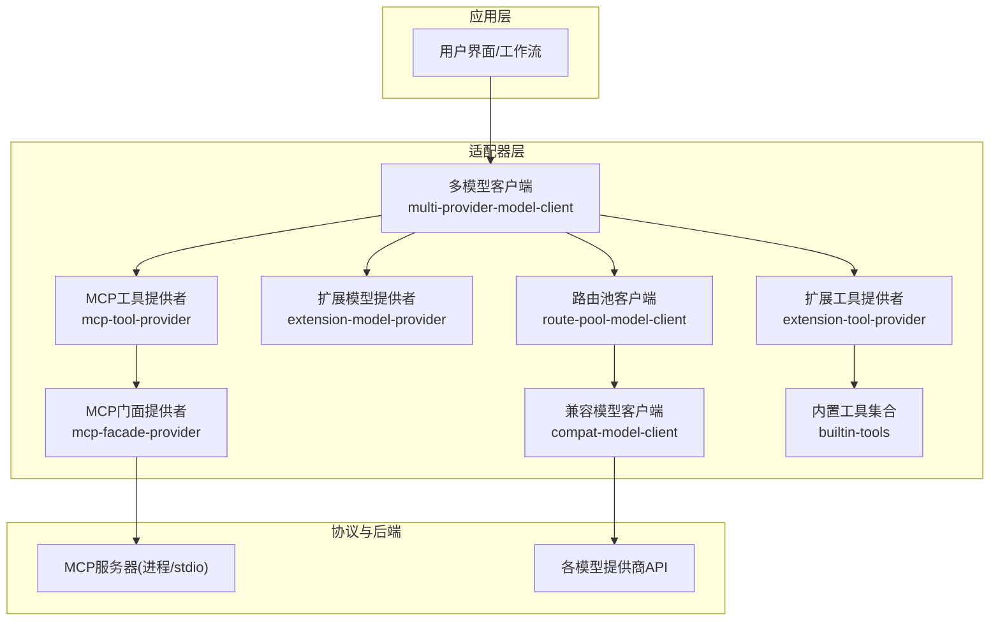
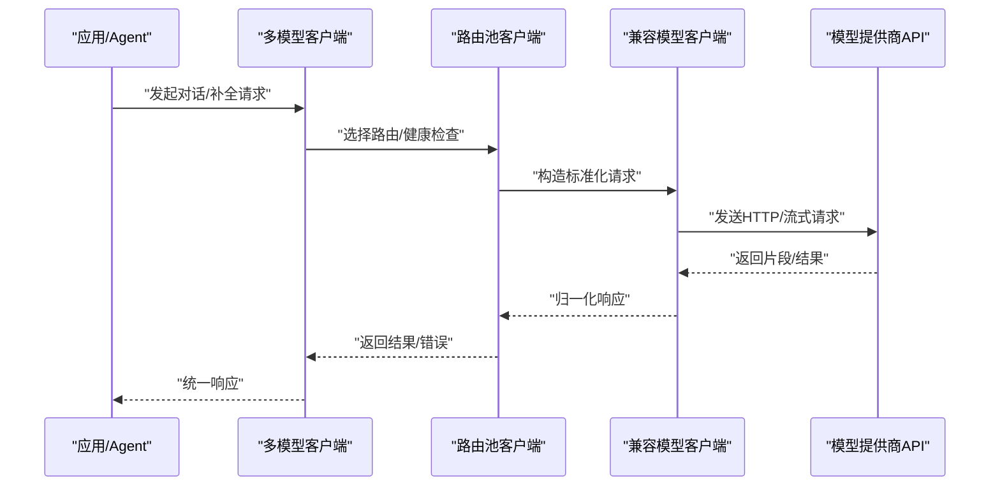
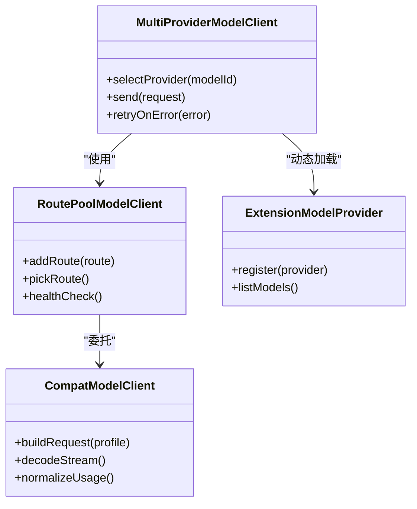
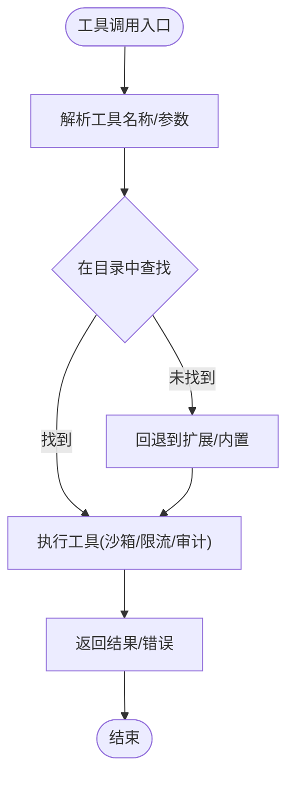
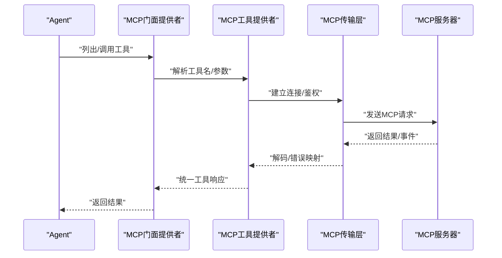
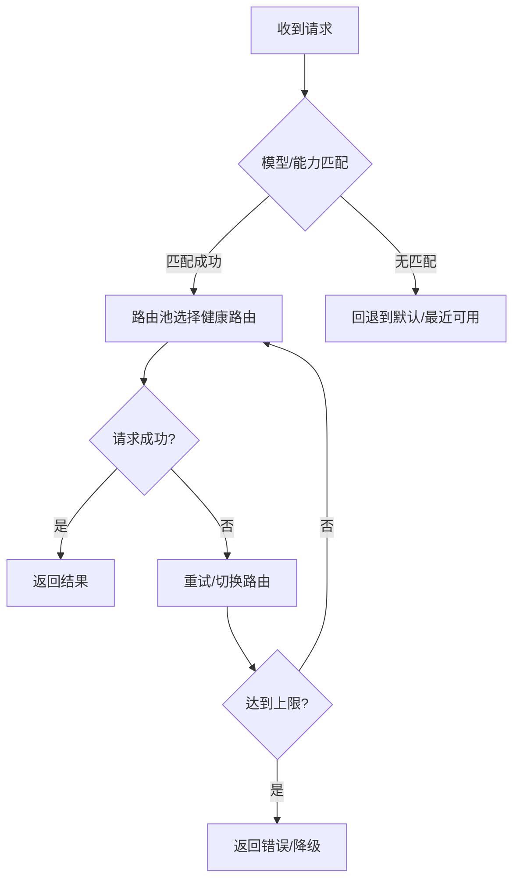
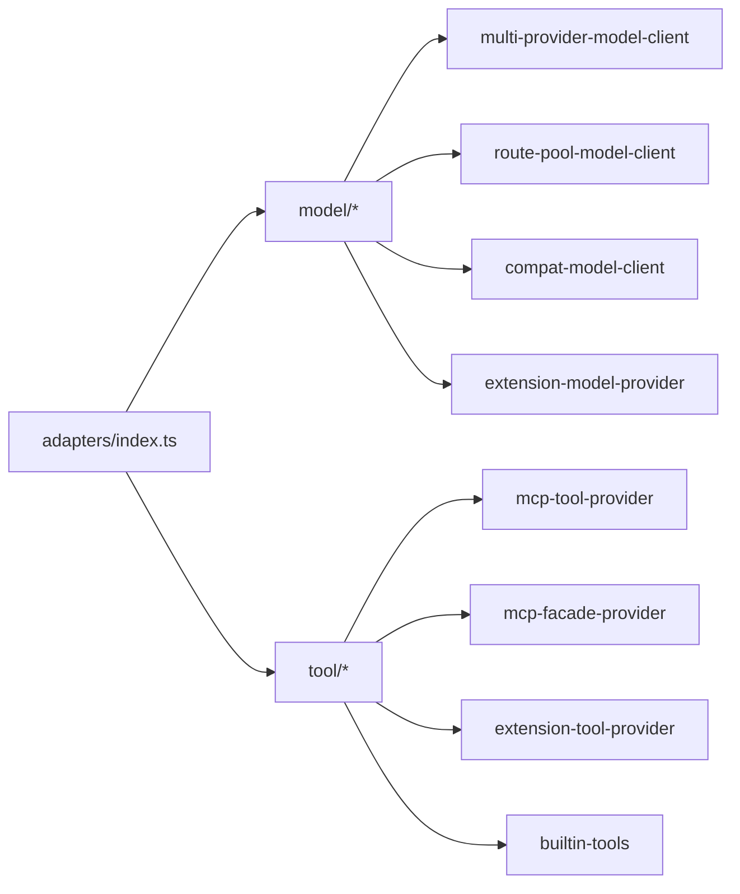

# AI集成架构

<cite>
**本文引用的文件**
- [kun/src/adapters/index.ts](file://kun/src/adapters/index.ts)
- [kun/src/adapters/model/multi-provider-model-client.ts](file://kun/src/adapters/model/multi-provider-model-client.ts)
- [kun/src/adapters/model/route-pool-model-client.ts](file://kun/src/adapters/model/route-pool-model-client.ts)
- [kun/src/adapters/model/compat-model-client.ts](file://kun/src/adapters/model/compat-model-client.ts)
- [kun/src/adapters/model/extension-model-provider.ts](file://kun/src/adapters/model/extension-model-provider.ts)
- [src/shared/model-provider-presets.ts](file://src/shared/model-provider-presets.ts)
- [kun/src/adapters/tool/mcp-tool-provider.ts](file://kun/src/adapters/tool/mcp-tool-provider.ts)
- [kun/src/adapters/tool/mcp-facade-provider.ts](file://kun/src/adapters/tool/mcp-facade-provider.ts)
- [kun/src/adapters/tool/mcp-transport.ts](file://kun/src/adapters/tool/mcp-transport.ts)
- [kun/src/adapters/tool/builtin-tools.ts](file://kun/src/adapters/tool/builtin-tools.ts)
- [kun/src/adapters/tool/extension-tool-provider.ts](file://kun/src/adapters/tool/extension-tool-provider.ts)
</cite>

## 目录
1. [简介](#简介)
2. [项目结构](#项目结构)
3. [核心组件](#核心组件)
4. [架构总览](#架构总览)
5. [详细组件分析](#详细组件分析)
6. [依赖关系分析](#依赖关系分析)
7. [性能考虑](#性能考虑)
8. [故障排查指南](#故障排查指南)
9. [结论](#结论)
10. [附录](#附录)

## 简介
本文件面向DeepSeek-GUI的AI集成架构，聚焦分层设计：模型提供商抽象层、工具适配器层与MCP协议支持层。文档说明多模型支持的实现方式（请求路由、负载均衡与故障转移）、工具系统的插件化设计（内置工具与第三方工具集成），并给出架构图、数据流图与协议适配图。同时总结性能优化策略（缓存、流式处理、资源管理）以及模型配置、工具开发与集成的最佳实践。

## 项目结构
仓库采用模块化分层组织：
- 共享配置与预设：提供模型供应商预设、能力描述与端点格式等元数据。
- 适配器层：统一封装不同模型提供商与工具的访问细节，向上暴露一致接口。
- MCP协议支持：通过传输层与门面提供者将外部MCP服务暴露为工具。
- 扩展与内置能力：通过扩展工具提供者与内置工具注册表，形成可插拔的工具生态。

图表来源
- [kun/src/adapters/model/multi-provider-model-client.ts](file://kun/src/adapters/model/multi-provider-model-client.ts)
- [kun/src/adapters/model/route-pool-model-client.ts](file://kun/src/adapters/model/route-pool-model-client.ts)
- [kun/src/adapters/model/compat-model-client.ts](file://kun/src/adapters/model/compat-model-client.ts)
- [kun/src/adapters/model/extension-model-provider.ts](file://kun/src/adapters/model/extension-model-provider.ts)
- [kun/src/adapters/tool/mcp-tool-provider.ts](file://kun/src/adapters/tool/mcp-tool-provider.ts)
- [kun/src/adapters/tool/mcp-facade-provider.ts](file://kun/src/adapters/tool/mcp-facade-provider.ts)
- [kun/src/adapters/tool/extension-tool-provider.ts](file://kun/src/adapters/tool/extension-tool-provider.ts)
- [kun/src/adapters/tool/builtin-tools.ts](file://kun/src/adapters/tool/builtin-tools.ts)

章节来源
- [kun/src/adapters/index.ts:1-12](file://kun/src/adapters/index.ts#L1-L12)

## 核心组件
- 多模型客户端：聚合多个模型提供者，负责选择具体提供者、路由请求、重试与降级。
- 路由池客户端：维护多条连接/路由，实现负载均衡与健康检查，失败时自动切换。
- 兼容模型客户端：对上游不同协议进行归一化，屏蔽差异，统一流式与非流式响应。
- 扩展模型提供者：以扩展形式动态加载新模型接入，无需修改核心逻辑。
- MCP工具提供者：将MCP服务暴露为工具，支持认证、会话与错误映射。
- MCP门面提供者：对MCP工具进行命名、分组与发现，简化上层调用。
- 扩展工具提供者与内置工具：统一注册与调度工具，支持沙箱、限流与审计。

章节来源
- [kun/src/adapters/model/multi-provider-model-client.ts](file://kun/src/adapters/model/multi-provider-model-client.ts)
- [kun/src/adapters/model/route-pool-model-client.ts](file://kun/src/adapters/model/route-pool-model-client.ts)
- [kun/src/adapters/model/compat-model-client.ts](file://kun/src/adapters/model/compat-model-client.ts)
- [kun/src/adapters/model/extension-model-provider.ts](file://kun/src/adapters/model/extension-model-provider.ts)
- [kun/src/adapters/tool/mcp-tool-provider.ts](file://kun/src/adapters/tool/mcp-tool-provider.ts)
- [kun/src/adapters/tool/mcp-facade-provider.ts](file://kun/src/adapters/tool/mcp-facade-provider.ts)
- [kun/src/adapters/tool/extension-tool-provider.ts](file://kun/src/adapters/tool/extension-tool-provider.ts)
- [kun/src/adapters/tool/builtin-tools.ts](file://kun/src/adapters/tool/builtin-tools.ts)

## 架构总览
系统采用“抽象+适配”的分层模式：
- 模型提供商抽象层：通过多模型客户端与路由池，将不同厂商的模型统一为一致的请求/响应契约。
- 工具适配器层：将本地/远程工具（含MCP、扩展、内置）统一暴露为Agent可调用的工具。
- MCP协议支持层：通过传输层与门面层，将MCP服务作为工具纳入统一调度。

图表来源
- [kun/src/adapters/model/multi-provider-model-client.ts](file://kun/src/adapters/model/multi-provider-model-client.ts)
- [kun/src/adapters/model/route-pool-model-client.ts](file://kun/src/adapters/model/route-pool-model-client.ts)
- [kun/src/adapters/model/compat-model-client.ts](file://kun/src/adapters/model/compat-model-client.ts)

## 详细组件分析

### 模型提供商抽象层
- 多模型客户端：集中管理多个提供者实例，按模型ID或策略选择提供者；支持重试、超时与错误分类。
- 路由池客户端：维护多个连接/端点，基于健康状态与负载策略分发请求；当主路由失败时自动切换到备用路由。
- 兼容模型客户端：对不同协议（如OpenAI兼容、Anthropic Messages、自定义端点）进行编解码与流式帧缓冲，保证上层一致性。
- 扩展模型提供者：允许以扩展方式注入新的模型接入，避免核心代码膨胀。

图表来源
- [kun/src/adapters/model/multi-provider-model-client.ts](file://kun/src/adapters/model/multi-provider-model-client.ts)
- [kun/src/adapters/model/route-pool-model-client.ts](file://kun/src/adapters/model/route-pool-model-client.ts)
- [kun/src/adapters/model/compat-model-client.ts](file://kun/src/adapters/model/compat-model-client.ts)
- [kun/src/adapters/model/extension-model-provider.ts](file://kun/src/adapters/model/extension-model-provider.ts)

章节来源
- [kun/src/adapters/model/multi-provider-model-client.ts](file://kun/src/adapters/model/multi-provider-model-client.ts)
- [kun/src/adapters/model/route-pool-model-client.ts](file://kun/src/adapters/model/route-pool-model-client.ts)
- [kun/src/adapters/model/compat-model-client.ts](file://kun/src/adapters/model/compat-model-client.ts)
- [kun/src/adapters/model/extension-model-provider.ts](file://kun/src/adapters/model/extension-model-provider.ts)

### 工具适配器层
- 扩展工具提供者：从扩展中加载工具定义与执行器，支持权限、沙箱与审计。
- 内置工具集合：提供文件系统、搜索、Git、LSP等常用能力，统一注册到工具目录。
- 工具目录与虚拟目录：将分散的工具聚合为可发现、可检索的统一视图。

图表来源
- [kun/src/adapters/tool/extension-tool-provider.ts](file://kun/src/adapters/tool/extension-tool-provider.ts)
- [kun/src/adapters/tool/builtin-tools.ts](file://kun/src/adapters/tool/builtin-tools.ts)

章节来源
- [kun/src/adapters/tool/extension-tool-provider.ts](file://kun/src/adapters/tool/extension-tool-provider.ts)
- [kun/src/adapters/tool/builtin-tools.ts](file://kun/src/adapters/tool/builtin-tools.ts)

### MCP协议支持层
- MCP工具提供者：负责启动/连接MCP服务器、鉴权与会话管理，将MCP工具映射为统一工具接口。
- MCP门面提供者：对MCP工具进行命名规范化、分组与发现，便于上层查询与调用。
- MCP传输层：封装stdio/HTTP等传输细节，处理消息编解码与错误传播。

图表来源
- [kun/src/adapters/tool/mcp-facade-provider.ts](file://kun/src/adapters/tool/mcp-facade-provider.ts)
- [kun/src/adapters/tool/mcp-tool-provider.ts](file://kun/src/adapters/tool/mcp-tool-provider.ts)
- [kun/src/adapters/tool/mcp-transport.ts](file://kun/src/adapters/tool/mcp-transport.ts)

章节来源
- [kun/src/adapters/tool/mcp-facade-provider.ts](file://kun/src/adapters/tool/mcp-facade-provider.ts)
- [kun/src/adapters/tool/mcp-tool-provider.ts](file://kun/src/adapters/tool/mcp-tool-provider.ts)
- [kun/src/adapters/tool/mcp-transport.ts](file://kun/src/adapters/tool/mcp-transport.ts)

### 多模型支持与路由策略
- 请求路由：根据模型ID与预设能力（文本/图像/语音/视频）选择对应提供者与端点格式。
- 负载均衡：路由池维护多条连接，按健康状态与权重分配请求。
- 故障转移：当某路由失败时，自动尝试其他路由或降级到备用提供者。

图表来源
- [kun/src/adapters/model/route-pool-model-client.ts](file://kun/src/adapters/model/route-pool-model-client.ts)
- [kun/src/adapters/model/multi-provider-model-client.ts](file://kun/src/adapters/model/multi-provider-model-client.ts)

章节来源
- [kun/src/adapters/model/route-pool-model-client.ts](file://kun/src/adapters/model/route-pool-model-client.ts)
- [kun/src/adapters/model/multi-provider-model-client.ts](file://kun/src/adapters/model/multi-provider-model-client.ts)

### 模型配置与预设
- 预设模型供应商：集中定义各供应商的baseUrl、endpointFormat、models与能力（图像/语音/视频）。
- 订阅与Token Plan：区分按量付费与订阅套餐，支持区域化端点与独立密钥前缀提示。
- 推理能力：为不同模型配置推理强度与协议，确保请求参数正确映射。

章节来源
- [src/shared/model-provider-presets.ts:1-800](file://src/shared/model-provider-presets.ts#L1-L800)

## 依赖关系分析
- 适配器索引导出：统一对外暴露模型与工具相关能力，降低耦合。
- 模型层依赖：多模型客户端依赖路由池与兼容客户端；扩展模型提供者提供动态能力注入。
- 工具层依赖：扩展工具提供者与内置工具共同组成工具目录；MCP层通过门面与传输对接外部服务。

图表来源
- [kun/src/adapters/index.ts:1-12](file://kun/src/adapters/index.ts#L1-L12)
- [kun/src/adapters/model/multi-provider-model-client.ts](file://kun/src/adapters/model/multi-provider-model-client.ts)
- [kun/src/adapters/model/route-pool-model-client.ts](file://kun/src/adapters/model/route-pool-model-client.ts)
- [kun/src/adapters/model/compat-model-client.ts](file://kun/src/adapters/model/compat-model-client.ts)
- [kun/src/adapters/model/extension-model-provider.ts](file://kun/src/adapters/model/extension-model-provider.ts)
- [kun/src/adapters/tool/mcp-tool-provider.ts](file://kun/src/adapters/tool/mcp-tool-provider.ts)
- [kun/src/adapters/tool/mcp-facade-provider.ts](file://kun/src/adapters/tool/mcp-facade-provider.ts)
- [kun/src/adapters/tool/extension-tool-provider.ts](file://kun/src/adapters/tool/extension-tool-provider.ts)
- [kun/src/adapters/tool/builtin-tools.ts](file://kun/src/adapters/tool/builtin-tools.ts)

章节来源
- [kun/src/adapters/index.ts:1-12](file://kun/src/adapters/index.ts#L1-L12)

## 性能考虑
- 请求缓存：对高频、幂等的工具结果与模型响应片段进行缓存，减少重复计算与网络开销。
- 流式处理：对长响应采用流式解码与增量输出，提升首字节延迟与用户体验。
- 资源管理：限制并发连接数、设置超时与重试预算，避免资源耗尽；对MCP进程进行生命周期管理。
- 路由优化：基于健康检查与负载指标动态调整路由权重，提高吞吐与稳定性。

[本节为通用指导，不直接分析具体文件]

## 故障排查指南
- 模型请求失败：检查路由池健康状态、重试策略与错误分类；确认端点格式与模型能力是否匹配。
- MCP工具不可用：验证传输层连接、鉴权与会话；查看门面工具列表是否正确生成。
- 工具执行异常：检查沙箱策略、权限与输入预算；查看工具日志与审计记录。
- 性能问题：监控流式缓冲大小、缓存命中率与连接池利用率；必要时调整并发与超时。

章节来源
- [kun/src/adapters/model/route-pool-model-client.ts](file://kun/src/adapters/model/route-pool-model-client.ts)
- [kun/src/adapters/tool/mcp-tool-provider.ts](file://kun/src/adapters/tool/mcp-tool-provider.ts)
- [kun/src/adapters/tool/mcp-facade-provider.ts](file://kun/src/adapters/tool/mcp-facade-provider.ts)

## 结论
DeepSeek-GUI的AI集成架构通过清晰的层次划分与可扩展的适配器设计，实现了多模型统一接入、工具插件化与MCP协议支持。路由池与兼容客户端保障了高可用与跨协议一致性；预设配置简化了模型接入与能力声明。结合缓存、流式处理与资源管理，系统在性能与稳定性方面具备良好基础。建议在生产环境中持续监控路由健康、工具执行与流式缓冲，按需调优并发与超时策略。

## 附录
- 模型配置最佳实践
  - 明确每个模型的端点格式与能力（文本/图像/语音/视频），并在预设中声明。
  - 区分按量与订阅套餐，合理配置区域化端点与密钥前缀提示。
  - 为推理能力设置合适的强度与协议，避免无效参数传递。
- 工具开发最佳实践
  - 遵循统一工具接口，提供清晰的参数校验与错误信息。
  - 使用沙箱与限流保护系统资源，记录审计日志以便追踪。
  - 对MCP工具进行命名规范与分组，便于发现与管理。
- 集成最佳实践
  - 优先复用内置工具与扩展工具提供者，减少重复实现。
  - 对高频调用路径启用缓存与流式输出，提升响应速度。
  - 在路由池中配置健康检查与降级策略，保障服务韧性。

[本节为通用指导，不直接分析具体文件]