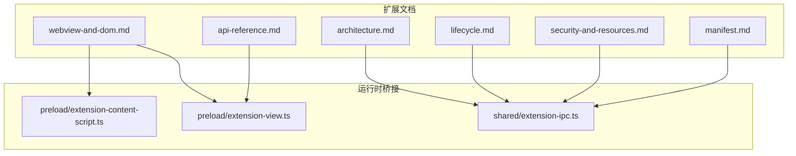
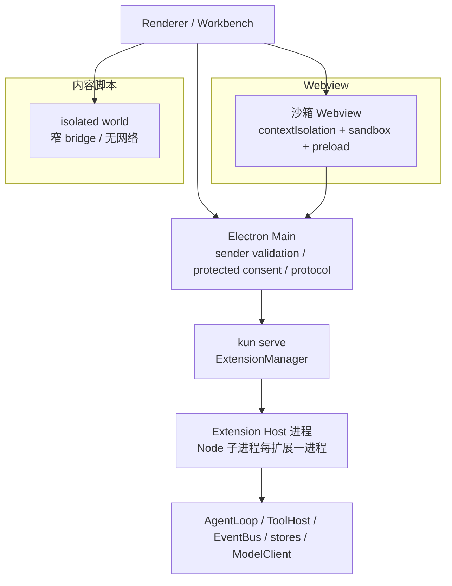
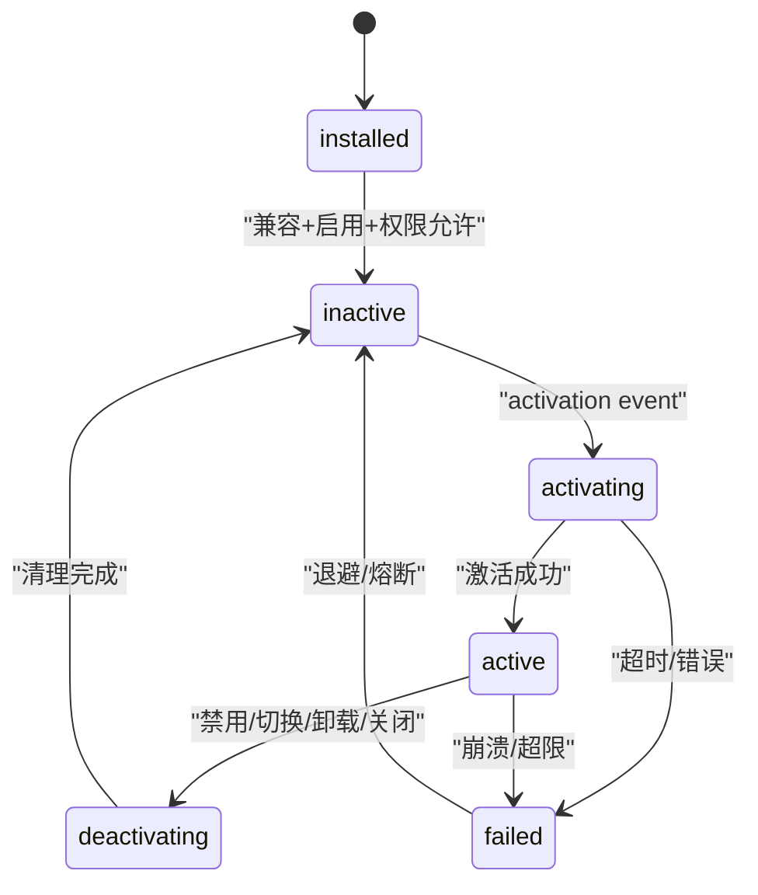
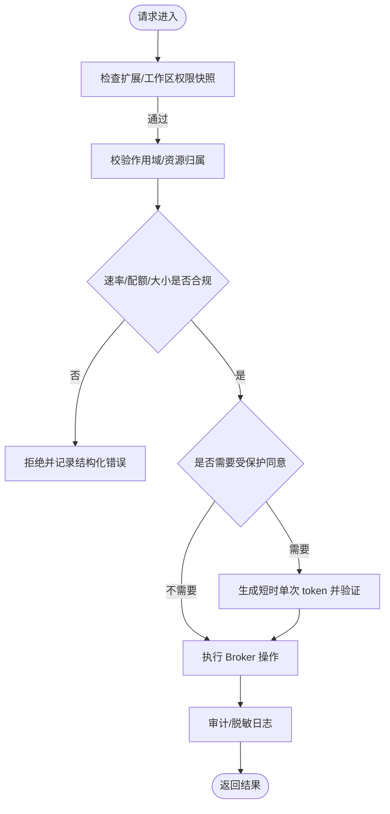
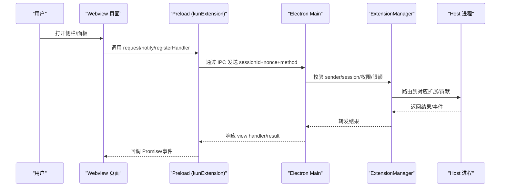
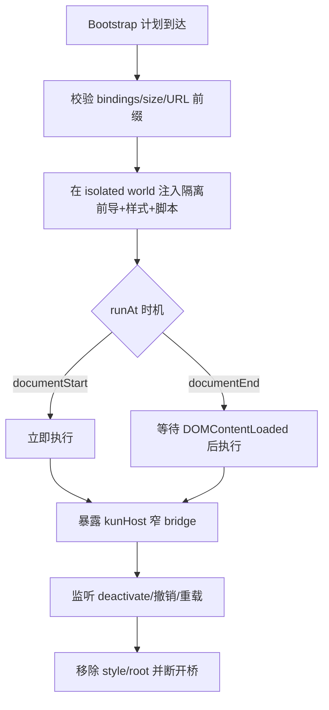
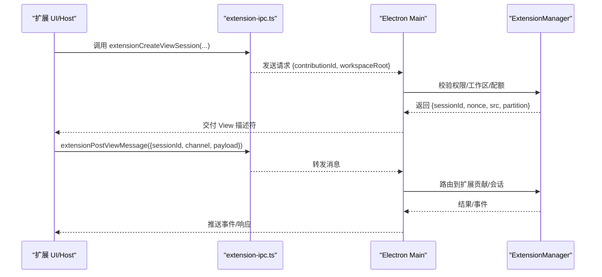
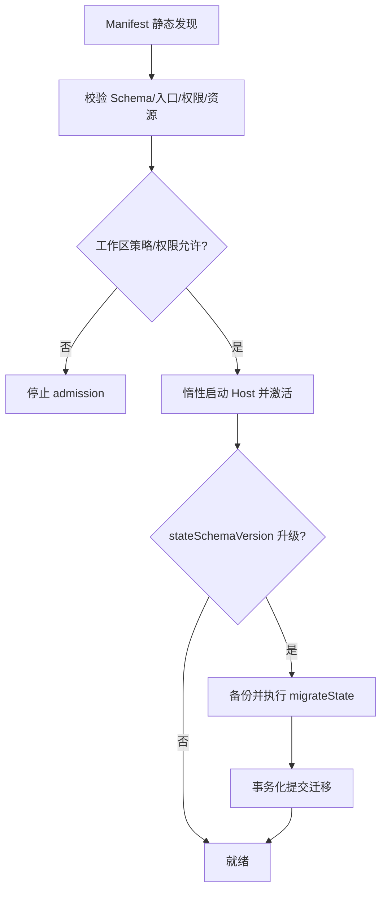
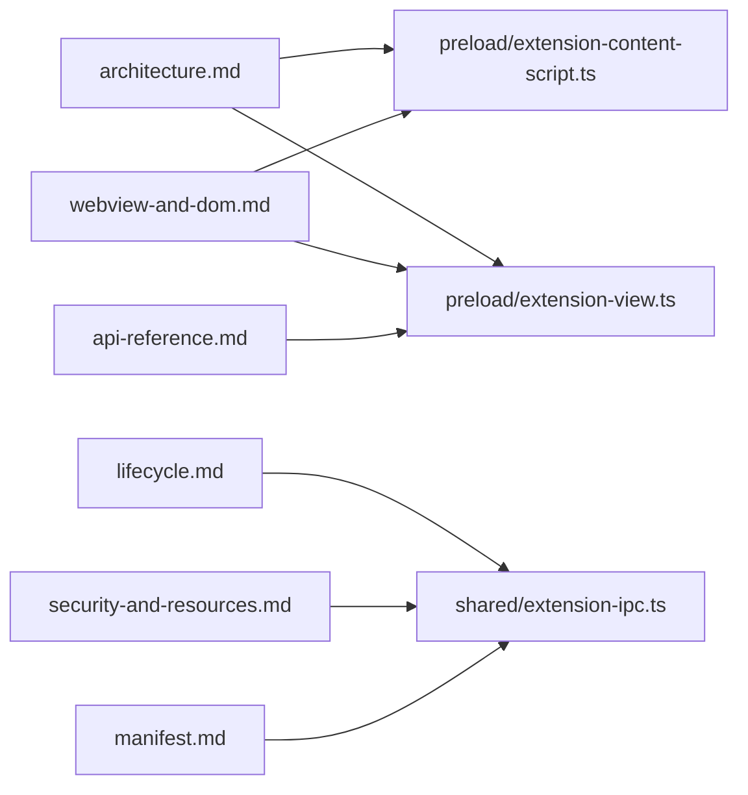

# 扩展系统架构

<cite>
**本文引用的文件**
- [docs/extensions/architecture.md](file://docs/extensions/architecture.md)
- [docs/extensions/lifecycle.md](file://docs/extensions/lifecycle.md)
- [docs/extensions/security-and-resources.md](file://docs/extensions/security-and-resources.md)
- [docs/extensions/webview-and-dom.md](file://docs/extensions/webview-and-dom.md)
- [docs/extensions/manifest.md](file://docs/extensions/manifest.md)
- [docs/extensions/api-reference.md](file://docs/extensions/api-reference.md)
- [src/preload/extension-content-script.ts](file://src/preload/extension-content-script.ts)
- [src/preload/extension-view.ts](file://src/preload/extension-view.ts)
- [src/shared/extension-ipc.ts](file://src/shared/extension-ipc.ts)
</cite>

## 目录
1. [简介](#简介)
2. [项目结构](#项目结构)
3. [核心组件](#核心组件)
4. [架构总览](#架构总览)
5. [详细组件分析](#详细组件分析)
6. [依赖关系分析](#依赖关系分析)
7. [性能与资源限制](#性能与资源限制)
8. [故障排查指南](#故障排查指南)
9. [结论](#结论)
10. [附录：扩展开发指南](#附录：扩展开发指南)

## 简介
本文件面向 DeepSeek-GUI（Kun）扩展系统的架构设计，聚焦插件架构、生命周期管理、权限与安全沙箱、Webview 扩展、内容脚本与协议注册、加载机制、依赖管理与版本兼容性。文档同时提供架构图、权限模型图与生命周期流程图，并给出安全考虑与开发实践建议。

## 项目结构
仓库中与扩展系统直接相关的代码与文档主要分布在以下位置：
- 文档层：docs/extensions 下的架构、生命周期、安全、Webview/DOM、Manifest、API 参考等
- 预加载与桥接：src/preload 中的内容脚本安装器与 View 传输层
- 共享 IPC 类型：src/shared/extension-ipc.ts 定义扩展与宿主之间的消息契约
- 示例与工具：examples/extensions 提供多种扩展样例；scripts 包含打包与校验脚本

**图表来源**
- [docs/extensions/architecture.md:1-124](file://docs/extensions/architecture.md#L1-L124)
- [docs/extensions/lifecycle.md:1-171](file://docs/extensions/lifecycle.md#L1-L171)
- [docs/extensions/security-and-resources.md:1-210](file://docs/extensions/security-and-resources.md#L1-L210)
- [docs/extensions/webview-and-dom.md:1-300](file://docs/extensions/webview-and-dom.md#L1-L300)
- [docs/extensions/manifest.md:1-336](file://docs/extensions/manifest.md#L1-L336)
- [docs/extensions/api-reference.md:1-125](file://docs/extensions/api-reference.md#L1-L125)
- [src/preload/extension-content-script.ts:1-317](file://src/preload/extension-content-script.ts#L1-L317)
- [src/preload/extension-view.ts:1-150](file://src/preload/extension-view.ts#L1-L150)
- [src/shared/extension-ipc.ts:1-527](file://src/shared/extension-ipc.ts#L1-L527)

**章节来源**
- [docs/extensions/architecture.md:1-124](file://docs/extensions/architecture.md#L1-L124)
- [docs/extensions/manifest.md:1-336](file://docs/extensions/manifest.md#L1-L336)

## 核心组件
- 扩展管理器与 Host：由 Kun runtime 的 ExtensionManager 负责扩展发现、激活、并发控制、熔断与状态管理；每个 Node 扩展拥有独立子进程隔离执行。
- Webview 与 View Session：复杂 UI 通过宿主创建的沙箱 Webview 运行，绑定扩展身份、贡献 ID、工作区与不可猜 nonce。
- 内容脚本（Direct DOM）：在 Electron isolated world 中注入受限脚本，仅暴露窄 bridge，禁止网络与敏感 API。
- 协议与 IPC：通过 shared/extension-ipc.ts 定义的请求/响应类型进行安装、启用、权限授予、View 会话创建、外部浏览器控制、通知、账号与 Provider 管理等。
- Manifest 与贡献点：声明入口、激活事件、贡献点、权限与本地化；最小权限原则贯穿始终。
- 公开 API：@kun/extension-api 与 @kun/extension-react 提供框架无关的上下文、服务与 React 绑定。

**章节来源**
- [docs/extensions/architecture.md:44-89](file://docs/extensions/architecture.md#L44-L89)
- [docs/extensions/webview-and-dom.md:19-93](file://docs/extensions/webview-and-dom.md#L19-L93)
- [docs/extensions/manifest.md:143-208](file://docs/extensions/manifest.md#L143-L208)
- [docs/extensions/api-reference.md:15-69](file://docs/extensions/api-reference.md#L15-L69)
- [src/shared/extension-ipc.ts:109-527](file://src/shared/extension-ipc.ts#L109-L527)

## 架构总览
扩展系统遵循“身份绑定 + 最小 Broker 权限 + 受保护同意 + 有界资源”的安全模型。渲染层/工作台通过受保护窗口与宿主交互；Electron Main 负责发送者验证、受保护同意与 kun-extension:// 协议处理；kun serve 中的 ExtensionManager 协调扩展 Host 进程，最终路由到 AgentLoop/ToolHost/EventBus 等核心能力。

**图表来源**
- [docs/extensions/architecture.md:11-31](file://docs/extensions/architecture.md#L11-L31)
- [docs/extensions/webview-and-dom.md:31-78](file://docs/extensions/webview-and-dom.md#L31-L78)
- [src/preload/extension-content-script.ts:45-175](file://src/preload/extension-content-script.ts#L45-L175)

## 详细组件分析

### 扩展生命周期管理
- 静态发现：从 Manifest 读取标题、图标、贡献位置与 when 条件，不激活扩展。
- 激活流程：compatible + enabled + permission admitted -> inactive -> activating（合并一次）-> active。
- 去活触发：disable、版本切换、卸载、runtime 关闭、权限/策略变化、连续崩溃熔断、开发者 reload。
- 取消与终端结果：长操作使用 request ID；收到取消后停止上游工作、不再发非 terminal 事件、释放队列与关联状态。
- View Session 生命周期：每次打开复杂 View 创建独立 session；关闭时取消调用、释放资源、拒绝过期消息。
- Headless 生命周期：无 GUI 时 Node 工具/Provider/Agent profile 仍可激活；需要用户输入时返回 interaction-required。

**图表来源**
- [docs/extensions/lifecycle.md:9-26](file://docs/extensions/lifecycle.md#L9-L26)
- [docs/extensions/lifecycle.md:81-131](file://docs/extensions/lifecycle.md#L81-L131)
- [docs/extensions/lifecycle.md:133-155](file://docs/extensions/lifecycle.md#L133-L155)

**章节来源**
- [docs/extensions/lifecycle.md:28-131](file://docs/extensions/lifecycle.md#L28-L131)
- [docs/extensions/lifecycle.md:133-155](file://docs/extensions/lifecycle.md#L133-L155)

### 权限模型与安全沙箱
- 信任模型：来源信任（签名证据）、执行信任（Webview 沙箱、Node 子进程、Direct DOM 高风险）、工作区信任（按 workspace 授权）、单次操作信任（ApprovalGate/protected consent）。
- 权限生效规则：精确字符串权限、安装或新增权限需受保护确认、每次操作重新检查、撤销立即阻止新调用、跨扩展默认隔离。
- 存储类型：Global State、Workspace State、View State、Credential Store；禁止将 secret 放入 state。
- 网络 Broker：精确 hostname 或显式 wildcard；生产直连只接受 public-unicast；DNS/redirect 全量校验；手动 redirect 模式。
- CSP 策略：默认 connect-src 'none'；即使有 network 权限也不允许直连 fetch/WebSocket；必须走 Broker。
- Direct DOM 风险：可读写可见 DOM，但 isolated world 不阻止 UI 欺骗；需 hostDom 权限与受保护确认。

**图表来源**
- [docs/extensions/security-and-resources.md:9-47](file://docs/extensions/security-and-resources.md#L9-L47)
- [docs/extensions/security-and-resources.md:96-127](file://docs/extensions/security-and-resources.md#L96-L127)
- [docs/extensions/webview-and-dom.md:64-93](file://docs/extensions/webview-and-dom.md#L64-L93)

**章节来源**
- [docs/extensions/security-and-resources.md:9-157](file://docs/extensions/security-and-resources.md#L9-L157)
- [docs/extensions/webview-and-dom.md:64-186](file://docs/extensions/webview-and-dom.md#L64-L186)

### Webview 扩展与 View Bridge
- 创建与身份：每个复杂 View 建立独立 View Session，绑定 extensionId/version/contributionId/workspace/WebContents/session nonce。
- 强制沙箱基线：nodeIntegration=false、contextIsolation=true、sandbox=true、仅 Kun-owned preload、独立 partition、默认拒绝导航/弹窗/下载。
- 本地资源协议：kun-extension://<publisher.name>/<package-relative-path>，校验规范化路径、完整性清单与 resource roots。
- 窄 View Bridge：仅暴露协商版本的 request/response、命令调用、事件订阅、主题/语言/缩放/无障碍偏好、已获准的高层 API。
- React 集成：通过 ExtensionViewProvider 与 Hooks 获取主题、语言、视图状态、主机消息、Agent 运行与账户信息。

**图表来源**
- [docs/extensions/webview-and-dom.md:19-93](file://docs/extensions/webview-and-dom.md#L19-L93)
- [src/preload/extension-view.ts:1-150](file://src/preload/extension-view.ts#L1-L150)
- [src/shared/extension-ipc.ts:133-222](file://src/shared/extension-ipc.ts#L133-L222)

**章节来源**
- [docs/extensions/webview-and-dom.md:19-186](file://docs/extensions/webview-and-dom.md#L19-L186)
- [src/preload/extension-view.ts:1-150](file://src/preload/extension-view.ts#L1-L150)

### 内容脚本（Direct DOM）与隔离世界
- 安装与执行：preload 接收 bootstrap plan，在 isolated world 注入隔离前导代码、样式与脚本；支持 documentStart/documentEnd 两种时机。
- 隔离前导：隐藏危险全局、禁用 fetch/WebSocket/XHR/Worker/open/sendBeacon 等，防止绕过安全策略。
- 窄 bridge：仅暴露 getContext()/reportDiagnostic()/dispose()；所有调用经 bindingId/nonce/worldId/surface/runAt/workspaceScope 校验。
- 生命周期：deactivate 时注入停用脚本；Main 定期复验 package/version/workspace/grant/declaration，过期 world 的后续调用失败。

**图表来源**
- [src/preload/extension-content-script.ts:45-175](file://src/preload/extension-content-script.ts#L45-L175)
- [src/preload/extension-content-script.ts:177-238](file://src/preload/extension-content-script.ts#L177-L238)
- [docs/extensions/webview-and-dom.md:192-253](file://docs/extensions/webview-and-dom.md#L192-L253)

**章节来源**
- [src/preload/extension-content-script.ts:45-317](file://src/preload/extension-content-script.ts#L45-L317)
- [docs/extensions/webview-and-dom.md:192-289](file://docs/extensions/webview-and-dom.md#L192-L289)

### 协议注册与 IPC 契约
- 安装/启用/禁用/回滚/卸载/重载：通过 extensionInstall/Enable/Disable/Rollback/Uninstall/Reload 等请求类型。
- View 会话：extensionCreateViewSession 返回 sessionId/nonce/src/partition；extensionPostViewMessage/ReadViewEvents 用于消息与事件。
- 外部浏览器：extensionExternalBrowserControl 支持 mount/activate/bounds/navigate/back/forward/reload/zoom/state。
- 通知：extensionListAccounts/Notifications/RespondNotification。
- 账号与 Provider：创建会话、完成会话、删除/重命名/替换密钥、设置 Provider 绑定。
- 内容脚本同步：extensionSyncHostContentScripts 将 surface 与 descriptors 同步至渲染层。

**图表来源**
- [src/shared/extension-ipc.ts:133-222](file://src/shared/extension-ipc.ts#L133-L222)
- [src/shared/extension-ipc.ts:448-527](file://src/shared/extension-ipc.ts#L448-L527)

**章节来源**
- [src/shared/extension-ipc.ts:59-527](file://src/shared/extension-ipc.ts#L59-L527)

### 加载机制、依赖管理与版本兼容性
- 加载机制：Manifest 静态发现 -> 权限与工作区策略校验 -> 惰性启动 Node Host -> 激活事件触发 activate(context)。
- 依赖管理：入口必须位于完整性清单与允许资源根内；browser 入口为沙箱资源而非 Node 模块；headless 能力必须声明 main。
- 版本兼容性：
  - 包版本 version、Manifest Schema major manifestVersion、API SemVer apiVersion、状态 schema stateSchemaVersion、Kun engines.kun 五个维度独立。
  - 新 selected version 提高 stateSchemaVersion 时需实现 migrateState(state, context)，原子提交迁移结果。
  - 兼容矩阵以 API 参考与文档为准；v1.2 新增可选能力不影响既有 v1.0/v1.1。

**图表来源**
- [docs/extensions/manifest.md:117-141](file://docs/extensions/manifest.md#L117-L141)
- [docs/extensions/lifecycle.md:157-159](file://docs/extensions/lifecycle.md#L157-L159)
- [docs/extensions/api-reference.md:9-13](file://docs/extensions/api-reference.md#L9-L13)

**章节来源**
- [docs/extensions/manifest.md:117-141](file://docs/extensions/manifest.md#L117-L141)
- [docs/extensions/lifecycle.md:157-159](file://docs/extensions/lifecycle.md#L157-L159)
- [docs/extensions/api-reference.md:9-13](file://docs/extensions/api-reference.md#L9-L13)

## 依赖关系分析
- 文档与实现映射：
  - architecture.md 描述整体边界与数据路径，映射到 preload 与 shared IPC 的实现。
  - lifecycle.md 描述状态机与取消/熔断，映射到 ExtensionManager 与 Host 进程行为。
  - security-and-resources.md 描述权限/网络/存储/日志/配额，映射到 Broker 校验与默认限额。
  - webview-and-dom.md 描述 Webview/CSP/bridge/Direct DOM，映射到 preload 与 content script 安装器。
  - manifest.md 描述贡献点与权限推导，映射到 validator 与 activation events。
  - api-reference.md 描述 SDK 导出与能力，映射到 @kun/extension-api 与 @kun/extension-react。
  - extension-ipc.ts 定义所有 IPC 类型，作为宿主与扩展之间的契约。

**图表来源**
- [docs/extensions/architecture.md:1-124](file://docs/extensions/architecture.md#L1-L124)
- [docs/extensions/lifecycle.md:1-171](file://docs/extensions/lifecycle.md#L1-L171)
- [docs/extensions/security-and-resources.md:1-210](file://docs/extensions/security-and-resources.md#L1-L210)
- [docs/extensions/webview-and-dom.md:1-300](file://docs/extensions/webview-and-dom.md#L1-L300)
- [docs/extensions/manifest.md:1-336](file://docs/extensions/manifest.md#L1-L336)
- [docs/extensions/api-reference.md:1-125](file://docs/extensions/api-reference.md#L1-L125)
- [src/preload/extension-content-script.ts:1-317](file://src/preload/extension-content-script.ts#L1-L317)
- [src/preload/extension-view.ts:1-150](file://src/preload/extension-view.ts#L1-L150)
- [src/shared/extension-ipc.ts:1-527](file://src/shared/extension-ipc.ts#L1-L527)

**章节来源**
- [src/shared/extension-ipc.ts:1-527](file://src/shared/extension-ipc.ts#L1-L527)

## 性能与资源限制
- 默认限额：单 IPC 消息 1 MiB、激活截止 15s、一般操作截止 60s、取消宽限 2s、关机截止 5s、每扩展并发 16、流窗口 32 未 ack 或 4 MiB、Host 事件率 200/s、Host 内存上限 256 MiB、连续崩溃阈值 3、日志轮转 5 MiB×3、状态文档 10 MiB、迁移截止 30s、网络/认证请求体 8 MiB。
- 背压与释放：生产者等待 ack、队列 item/bytes 双上限、滞后订阅者用 cursor 重连、terminal 后释放 buffer/timer/listener/correlation。
- 网络与 DNS：生产直连只接受 public-unicast；一次解析中出现任何非公网地址则 fail closed；redirect 使用 manual/error 模式。

**章节来源**
- [docs/extensions/security-and-resources.md:134-167](file://docs/extensions/security-and-resources.md#L134-L167)
- [docs/extensions/security-and-resources.md:96-127](file://docs/extensions/security-and-resources.md#L96-L127)

## 故障排查指南
- 诊断命令：kun extension doctor/acme.issue-assistant 显示 selected/installed version、source/digest/signature、enablement、permission snapshot、API/Kun/RPC negotiation、state schema、Host PID、activation cause、restart/circuit、limit failures、last structured error、log location。
- 日志查看：kun extension logs acme.issue-assistant [--json]；按扩展 ID、版本与进程实例归因并轮转。
- 常见错误：
  - 激活超时/失败：检查 activation deadline、阻塞网络/模型/用户输入、注册 handler 后尽快返回。
  - 权限不足：新增权限需在受保护窗口确认；撤销后立即阻止新调用。
  - CSP 阻断：connect-src 'none' 阻止直连 fetch/WebSocket；必须通过 Broker。
  - Content Script 执行失败：检查 selector、runAt 时机、资源 URL 前缀与大小限制。
  - View Session 失效：关闭/切换工作区/disable/uninstall/guest crash 会取消 pending 调用与事件订阅。

**章节来源**
- [docs/extensions/lifecycle.md:143-155](file://docs/extensions/lifecycle.md#L143-L155)
- [docs/extensions/security-and-resources.md:168-195](file://docs/extensions/security-and-resources.md#L168-L195)
- [docs/extensions/webview-and-dom.md:188-289](file://docs/extensions/webview-and-dom.md#L188-L289)

## 结论
DeepSeek-GUI 扩展系统通过严格的身份绑定、最小权限、受保护同意与有界资源，实现了安全的插件生态。Webview 与内容脚本分别承担复杂 UI 与极少量 DOM 操作场景，均受到严格沙箱与窄 bridge 约束。Manifest 驱动的贡献点与激活事件确保按需加载，版本与迁移机制保障向后兼容。结合默认限额与熔断策略，系统在可扩展性与安全性之间取得平衡。

## 附录：扩展开发指南
- 选择合适载体：
  - 按钮/菜单/设置/通知：使用声明式贡献。
  - 复杂 UI：使用 Webview，遵守 CSP 与窄 bridge。
  - 必须读写宿主 DOM：谨慎使用 Direct DOM，接受不稳定选择器风险。
- Manifest 最佳实践：
  - 仅声明必要贡献与权限；headless 能力必须提供 main。
  - 明确 activationEvents 与 when 条件；避免 onStartup 滥用。
  - 使用 localResourceRoots 与 kun-extension:// 访问资源。
- 生命周期与资源管理：
  - activate 快速、幂等、可诊断；使用 context.subscriptions 管理资源。
  - 对 stream/queue/cache 设置 bytes/items/time 上限；正确处理取消与 terminal。
- 安全与隐私：
  - 不在 state/settings/logs/messages 存 secret；使用 Account Broker。
  - 网络请求走 Broker；CSP 阻止直连；审批与同意走 protected surface。
  - 日志脱敏；避免记录大 body、token、cookie、prompt。
- 调试技巧：
  - 使用 kun extension doctor/logs/reload；检查权限快照与 last structured error。
  - 在 Content Script 中使用 reportDiagnostic 上报 bounded 诊断。
  - 测试 harness：使用 @kun/extension-test 模拟 Host/transport/service。

**章节来源**
- [docs/extensions/webview-and-dom.md:9-18](file://docs/extensions/webview-and-dom.md#L9-L18)
- [docs/extensions/manifest.md:143-208](file://docs/extensions/manifest.md#L143-L208)
- [docs/extensions/lifecycle.md:67-90](file://docs/extensions/lifecycle.md#L67-L90)
- [docs/extensions/security-and-resources.md:197-210](file://docs/extensions/security-and-resources.md#L197-L210)
- [docs/extensions/api-reference.md:82-85](file://docs/extensions/api-reference.md#L82-L85)