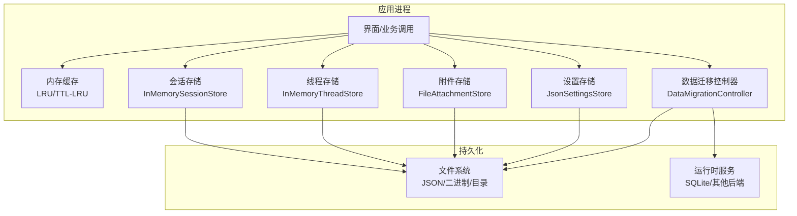
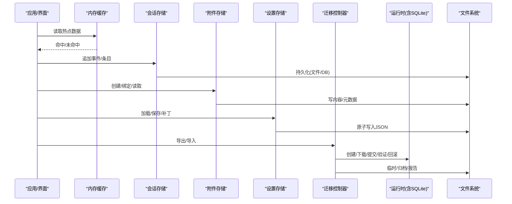
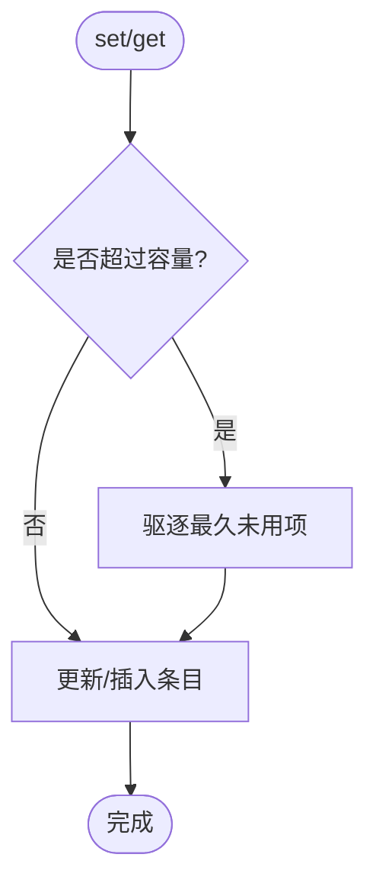
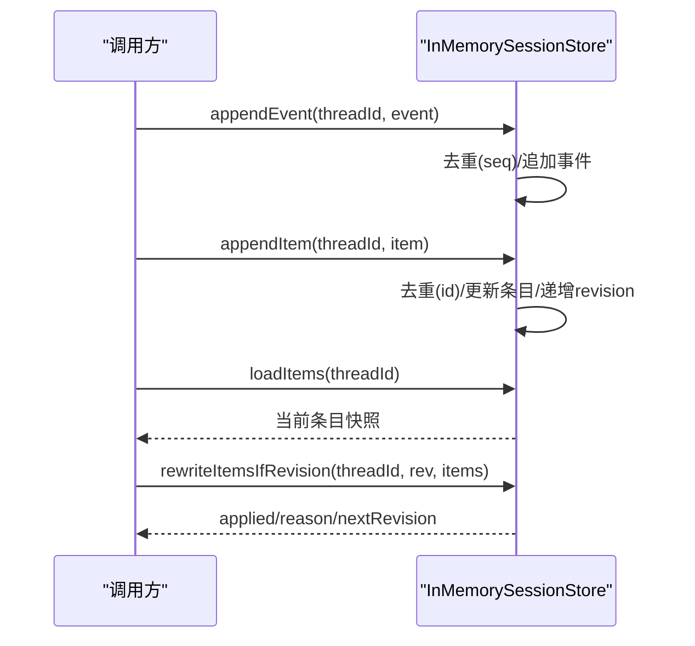
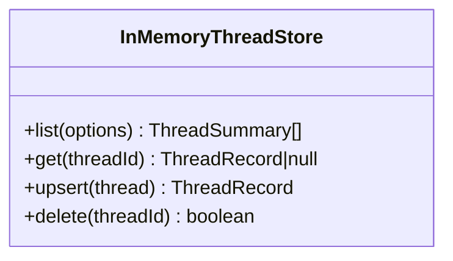
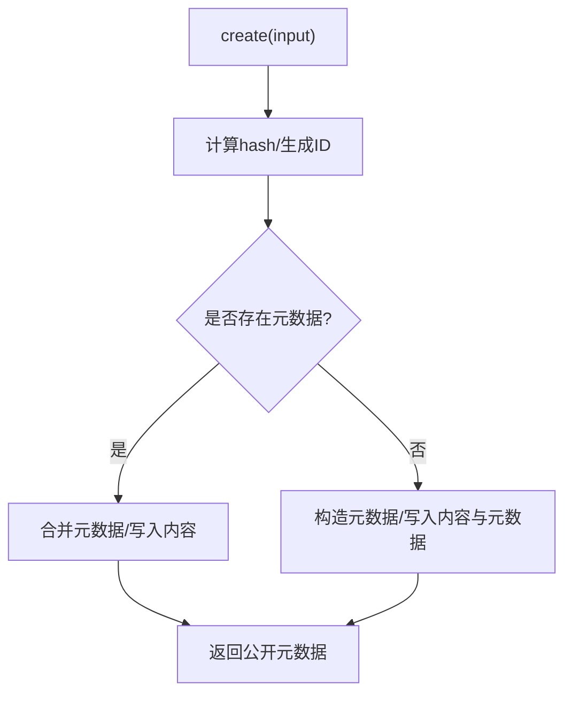
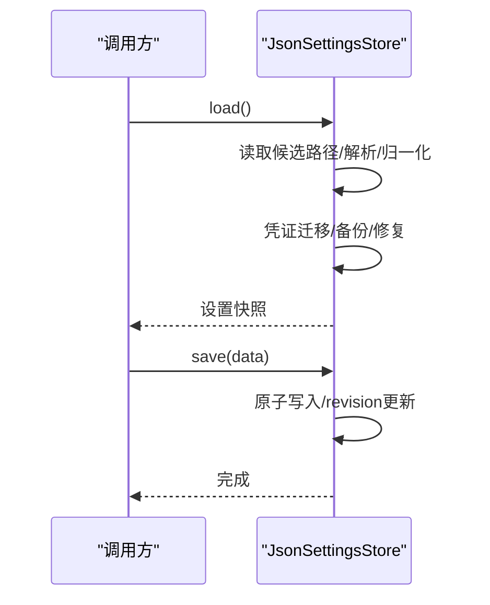
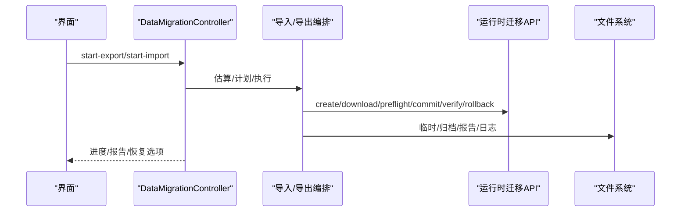
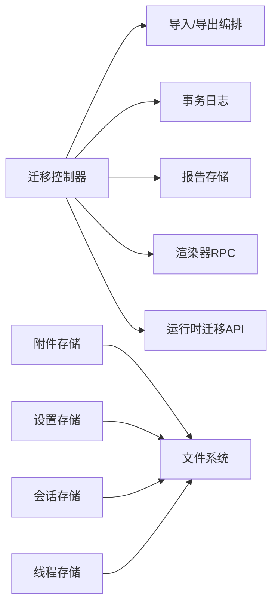

# 数据存储架构

<cite>
**本文引用的文件**
- [lru-cache.ts](file://kun/src/cache/lru-cache.ts)
- [ttl-lru-cache.ts](file://kun/src/cache/ttl-lru-cache.ts)
- [in-memory-session-store.ts](file://kun/src/adapters/in-memory-session-store.ts)
- [in-memory-thread-store.ts](file://kun/src/adapters/in-memory-thread-store.ts)
- [attachment-store.ts](file://kun/src/attachments/attachment-store.ts)
- [settings-store.ts](file://src/main/settings-store.ts)
- [data-migration-controller.ts](file://src/main/data-migration/data-migration-controller.ts)
</cite>

## 目录
1. [简介](#简介)
2. [项目结构](#项目结构)
3. [核心组件](#核心组件)
4. [架构总览](#架构总览)
5. [详细组件分析](#详细组件分析)
6. [依赖关系分析](#依赖关系分析)
7. [性能考量](#性能考量)
8. [故障排查指南](#故障排查指南)
9. [结论](#结论)
10. [附录](#附录)

## 简介
本文件面向 DeepSeek-GUI 的数据存储架构，聚焦“本地优先”的分层设计：文件系统、SQLite（由运行时提供）与内存缓存协同工作。文档覆盖会话持久化（线程存储、附件管理、备份恢复）、缓存策略（LRU、TTL、失效机制）、数据流图与架构图、迁移与版本管理、以及并发控制、事务处理与错误恢复的最佳实践。

## 项目结构
- 内存缓存层：提供 LRU 与 TTL-LRU 通用缓存能力，供上层服务复用。
- 会话与线程存储层：以内存实现为基准，支持事件日志、条目列表与会话投影的三视图；文件/数据库实现可基于此接口扩展。
- 附件存储层：基于文件系统的对象存储，包含内容文件与元数据文件，支持作用域绑定、租约清理与诊断。
- 设置与配置存储层：JSON 文件原子写入，具备兼容读取、默认值注入、路径规范化与凭证迁移能力。
- 数据迁移层：导出/导入编排、事务日志、回滚/恢复、与运行时的迁移 API 交互。

**图表来源**
- [lru-cache.ts:1-67](file://kun/src/cache/lru-cache.ts#L1-L67)
- [ttl-lru-cache.ts:1-73](file://kun/src/cache/ttl-lru-cache.ts#L1-L73)
- [in-memory-session-store.ts:1-186](file://kun/src/adapters/in-memory-session-store.ts#L1-L186)
- [in-memory-thread-store.ts:1-36](file://kun/src/adapters/in-memory-thread-store.ts#L1-L36)
- [attachment-store.ts:1-569](file://kun/src/attachments/attachment-store.ts#L1-L569)
- [settings-store.ts:1-792](file://src/main/settings-store.ts#L1-L792)
- [data-migration-controller.ts:1-882](file://src/main/data-migration/data-migration-controller.ts#L1-L882)

**章节来源**
- [lru-cache.ts:1-67](file://kun/src/cache/lru-cache.ts#L1-L67)
- [ttl-lru-cache.ts:1-73](file://kun/src/cache/ttl-lru-cache.ts#L1-L73)
- [in-memory-session-store.ts:1-186](file://kun/src/adapters/in-memory-session-store.ts#L1-L186)
- [in-memory-thread-store.ts:1-36](file://kun/src/adapters/in-memory-thread-store.ts#L1-L36)
- [attachment-store.ts:1-569](file://kun/src/attachments/attachment-store.ts#L1-L569)
- [settings-store.ts:1-792](file://src/main/settings-store.ts#L1-L792)
- [data-migration-controller.ts:1-882](file://src/main/data-migration/data-migration-controller.ts#L1-L882)

## 核心组件
- 内存缓存
  - LruCache：固定容量的最近最少使用缓存，get/set 均维护访问顺序，满时驱逐最久未用项。
  - TtlLruCache：在 LRU 基础上增加 TTL 过期，支持批量扫描清理过期条目。
- 会话存储
  - InMemorySessionStore：维护每个线程的事件日志、条目列表与完整会话投影；支持增量追加、重写、版本冲突检测与历史快照。
- 线程存储
  - InMemoryThreadStore：线程记录的增删改查与摘要排序，作为文件/数据库实现的统一接口基座。
- 附件存储
  - FileAttachmentStore：按 ID 分桶的内容与元数据文件，支持 MIME/尺寸限制、文本提取、作用域绑定、租约清理与诊断统计。
- 设置存储
  - JsonSettingsStore：JSON 文件原子写入、兼容读取、默认值注入、路径规范化、凭证迁移与并发安全（队列+重试）。
- 数据迁移
  - DataMigrationController：导出/导入编排、IPC 与渲染器状态协调、事务日志、回滚/恢复、与运行时迁移 API 交互。

**章节来源**
- [lru-cache.ts:1-67](file://kun/src/cache/lru-cache.ts#L1-L67)
- [ttl-lru-cache.ts:1-73](file://kun/src/cache/ttl-lru-cache.ts#L1-L73)
- [in-memory-session-store.ts:1-186](file://kun/src/adapters/in-memory-session-store.ts#L1-L186)
- [in-memory-thread-store.ts:1-36](file://kun/src/adapters/in-memory-thread-store.ts#L1-L36)
- [attachment-store.ts:1-569](file://kun/src/attachments/attachment-store.ts#L1-L569)
- [settings-store.ts:1-792](file://src/main/settings-store.ts#L1-L792)
- [data-migration-controller.ts:1-882](file://src/main/data-migration/data-migration-controller.ts#L1-L882)

## 架构总览
下图展示“本地优先”的分层数据流：界面/业务调用通过内存缓存加速读路径；会话与线程读写经内存实现落盘或交由运行时；附件以文件形式持久化；设置以 JSON 原子写入；迁移流程通过控制器编排并借助运行时完成跨版本/跨环境的数据同步。

**图表来源**
- [in-memory-session-store.ts:1-186](file://kun/src/adapters/in-memory-session-store.ts#L1-L186)
- [attachment-store.ts:1-569](file://kun/src/attachments/attachment-store.ts#L1-L569)
- [settings-store.ts:1-792](file://src/main/settings-store.ts#L1-L792)
- [data-migration-controller.ts:1-882](file://src/main/data-migration/data-migration-controller.ts#L1-L882)

## 详细组件分析

### 内存缓存（LRU 与 TTL）
- LruCache
  - 数据结构：Map 维护插入/访问顺序；get/set 会移动键到尾部。
  - 复杂度：get/set/delete 平均 O(1)，size O(1)。
  - 行为：容量满时驱逐头部（最久未用），永不抛异常，miss 返回 undefined。
- TtlLruCache
  - 在 LruCache 之上包装 Entry{value, expiresAt}；get 检查过期并删除；sweep 批量清理过期项。
  - 复杂度：get/set 平均 O(1)，sweep O(n)。
  - 适用：短期热数据、工具目录指纹、请求结果等。

**图表来源**
- [lru-cache.ts:1-67](file://kun/src/cache/lru-cache.ts#L1-L67)
- [ttl-lru-cache.ts:1-73](file://kun/src/cache/ttl-lru-cache.ts#L1-L73)

**章节来源**
- [lru-cache.ts:1-67](file://kun/src/cache/lru-cache.ts#L1-L67)
- [ttl-lru-cache.ts:1-73](file://kun/src/cache/ttl-lru-cache.ts#L1-L73)

### 会话存储（事件日志、条目列表、会话投影）
- 三视图
  - 事件日志：按 seq 追加，支持 since 查询与迭代回放。
  - 条目列表：按 id 去重/更新，支持重写与版本冲突检测（revision）。
  - 会话投影：合并事件与条目，用于重启后重建。
- 并发与一致性
  - 通过 revision 防止覆盖式写入冲突；重写需传入期望 revision。
- 典型流程

**图表来源**
- [in-memory-session-store.ts:1-186](file://kun/src/adapters/in-memory-session-store.ts#L1-L186)

**章节来源**
- [in-memory-session-store.ts:1-186](file://kun/src/adapters/in-memory-session-store.ts#L1-L186)

### 线程存储（列表、获取、增删）
- 功能：列出线程摘要（按更新时间排序）、按 id 获取、upsert、删除。
- 用途：作为文件/数据库实现的统一接口，便于后续替换底层存储。

**图表来源**
- [in-memory-thread-store.ts:1-36](file://kun/src/adapters/in-memory-thread-store.ts#L1-L36)

**章节来源**
- [in-memory-thread-store.ts:1-36](file://kun/src/adapters/in-memory-thread-store.ts#L1-L36)

### 附件存储（文件级对象存储）
- 存储布局
  - 内容文件：<id>.bin（权限 0o600）
  - 元数据文件：<id>.json（权限 0o600）
- 校验与限制
  - SHA-256 校验 sourceSha256；图片/文档类型白名单；尺寸/大小限制；PDF/OOXML 签名识别。
- 作用域与授权
  - 绑定 threadId/workspace；读取/绑定前校验授权。
- 租约与清理
  - pendingLeases 记录待释放租约；pruneExpiredLeases 清理过期租约并删除无引用内容。
- 并发保护
  - 单附件操作串行化（mutations Map）；跨附件批量操作按 rootDir 加锁。

**图表来源**
- [attachment-store.ts:1-569](file://kun/src/attachments/attachment-store.ts#L1-L569)

**章节来源**
- [attachment-store.ts:1-569](file://kun/src/attachments/attachment-store.ts#L1-L569)

### 设置存储（JSON 原子写入与兼容迁移）
- 读取路径
  - 支持多候选路径兼容读取；若为空则加载默认设置并初始化工作目录。
- 写入路径
  - 原子写入（atomicWriteFile）；可选文档后端（带 revision 并发控制）。
- 迁移与修复
  - 凭证迁移：将明文密钥迁移至受保护存储；失败时回滚并保留兼容设置。
  - 无效设置恢复：解析失败时备份原文件并回退默认设置。
- 并发与幂等
  - 操作排队（operationTail）；update/updateIf 支持 revision 重试。

**图表来源**
- [settings-store.ts:1-792](file://src/main/settings-store.ts#L1-L792)

**章节来源**
- [settings-store.ts:1-792](file://src/main/settings-store.ts#L1-L792)

### 数据迁移（导出/导入、事务日志、回滚/恢复）
- 导出
  - 估算/打包：收集设置、运行时线程清单、渲染器状态，生成迁移包。
  - 进度上报与不可变报告持久化。
- 导入
  - 检查/计划：校验包完整性、冲突策略、目标根映射。
  - 预检/提交/验证/回滚：通过运行时迁移 API 执行，结合事务日志保证一致性。
- 恢复
  - 支持从日志中恢复未完成的操作（resume/rollback），包括工作区暂存、应用步骤（设置/渲染器状态/信任重置）。

**图表来源**
- [data-migration-controller.ts:1-882](file://src/main/data-migration/data-migration-controller.ts#L1-L882)

**章节来源**
- [data-migration-controller.ts:1-882](file://src/main/data-migration/data-migration-controller.ts#L1-L882)

## 依赖关系分析
- 组件耦合
  - 迁移控制器依赖导入/导出编排、事务日志、报告存储、渲染器 RPC 与运行时迁移 API。
  - 附件存储依赖文件系统与配置（MIME/大小限制）。
  - 设置存储依赖原子写入与可选文档后端（revision 并发）。
  - 会话/线程存储提供统一接口，便于替换底层实现。
- 外部依赖
  - 运行时服务：提供 SQLite 或其他后端的数据访问与迁移端点。
  - Electron IPC：迁移流程与渲染器状态协调。

**图表来源**
- [data-migration-controller.ts:1-882](file://src/main/data-migration/data-migration-controller.ts#L1-L882)
- [attachment-store.ts:1-569](file://kun/src/attachments/attachment-store.ts#L1-L569)
- [settings-store.ts:1-792](file://src/main/settings-store.ts#L1-L792)
- [in-memory-session-store.ts:1-186](file://kun/src/adapters/in-memory-session-store.ts#L1-L186)
- [in-memory-thread-store.ts:1-36](file://kun/src/adapters/in-memory-thread-store.ts#L1-L36)

**章节来源**
- [data-migration-controller.ts:1-882](file://src/main/data-migration/data-migration-controller.ts#L1-L882)
- [attachment-store.ts:1-569](file://kun/src/attachments/attachment-store.ts#L1-L569)
- [settings-store.ts:1-792](file://src/main/settings-store.ts#L1-L792)
- [in-memory-session-store.ts:1-186](file://kun/src/adapters/in-memory-session-store.ts#L1-L186)
- [in-memory-thread-store.ts:1-36](file://kun/src/adapters/in-memory-thread-store.ts#L1-L36)

## 性能考量
- 缓存策略
  - 使用 LruCache 限制内存占用，避免无限增长；TtlLruCache 定期 sweep 清理过期条目，降低冷数据影响。
- I/O 优化
  - 设置文件采用原子写入，减少损坏风险；附件内容/元数据分离，提升读取效率。
- 并发控制
  - 设置存储通过操作队列与 revision 重试避免竞态；附件存储对单附件操作串行化，跨附件批量操作按根目录加锁。
- 迁移性能
  - 导出/导入使用流式传输与分阶段计划，避免一次性加载大对象；进度上报与可恢复性保障长任务稳定性。

[本节为通用指导，不直接分析具体文件]

## 故障排查指南
- 设置文件损坏
  - 现象：无法解析 JSON 或顶层非对象。
  - 处理：自动备份 invalid 文件并回退默认设置；检查日志中的备份路径。
- 凭证迁移失败
  - 现象：明文密钥无法迁移至受保护存储。
  - 处理：查看迁移失败日志；必要时回滚并保留兼容设置；确保受保护存储可用。
- 附件未找到/未授权
  - 现象：resolveContent/bindScopes 报错。
  - 处理：确认附件 ID 合法、作用域已绑定且当前 turn 有权限；检查元数据文件完整性。
- 会话写入冲突
  - 现象：rewriteItemsIfRevision 返回 conflict。
  - 处理：重新加载最新 revision 并重试；避免并发覆盖。
- 迁移中断
  - 现象：导入/导出中途失败。
  - 处理：通过 status 查询 recoverable 列表；选择 resume 或 rollback；检查事务日志与报告。

**章节来源**
- [settings-store.ts:1-792](file://src/main/settings-store.ts#L1-L792)
- [attachment-store.ts:1-569](file://kun/src/attachments/attachment-store.ts#L1-L569)
- [in-memory-session-store.ts:1-186](file://kun/src/adapters/in-memory-session-store.ts#L1-L186)
- [data-migration-controller.ts:1-882](file://src/main/data-migration/data-migration-controller.ts#L1-L882)

## 结论
DeepSeek-GUI 的数据存储采用“本地优先”的分层架构：内存缓存提升读性能，会话/线程存储提供一致性与可恢复性，附件存储以文件形式可靠持久化，设置存储确保配置安全与兼容，迁移控制器保障跨版本/环境的平滑演进。通过严格的并发控制、事务日志与错误恢复机制，系统在可用性、一致性与可维护性之间取得平衡。

[本节为总结，不直接分析具体文件]

## 附录
- 最佳实践
  - 数据访问模式
    - 读路径优先走缓存，写路径先入队再落盘。
    - 会话写入使用 revision 防冲突；附件操作遵循作用域授权。
  - 并发与事务
    - 使用设置存储的 update/updateIf 进行条件更新；迁移过程严格依赖事务日志与回滚。
  - 错误恢复
    - 任何长任务需支持中断与恢复；关键路径写入采用原子操作与备份策略。
  - 版本管理
    - 设置与迁移包携带版本信息；导入前进行兼容性检查与冲突策略决策。

[本节为通用指导，不直接分析具体文件]